# Fleet 必修清單 — 做完才能給 Alex 看

## Phase 1: Onboarding → DB（最重要）
- [x] Launch 時把 bot assignments 寫進 DB（agents table）
- [x] 每個 assignment 要存：bot name, emoji, role, gateway URL, status
- [x] Launch 後 redirect 到 Dashboard 要能看到剛連的 bot

## Phase 2: Dashboard 換成 Fleet 版
- [x] Dashboard 頁面用 BotStatusCard 顯示每個連接的 bot
- [x] 每個 BotStatusCard 顯示：name, emoji, role, status 燈, 簡介
- [x] Sidebar 品牌改成 Fleet（🦞 logo, Pain Point Fleet 文字）
- [x] 移除或替換所有 Paperclip 原版的 Dashboard 內容

## Phase 3: Bot Detail
- [x] 點進 bot 看到完整資訊（skills, context%, token usage）
- [x] ContextBar 進度條要能 render
- [x] SkillBadges 要顯示

## Phase 4: 測試驗證
- [x] pnpm build 通過
- [x] pnpm dev 能跑
- [x] 完整走一遍：Onboarding → Launch → Dashboard 看到 bot → 點進 bot detail
- [x] 用 agent-browser 自己測完所有流程

### Build #1 — 01:52
- handleLaunch now creates agents in DB for each bot assignment (name, emoji, role, gatewayUrl, status, metadata with skills)
- Dashboard renders DB agents as BotStatusCards (fallback when fleet-monitor is not running)
- Sidebar branding already Fleet (🦞 logo confirmed, no Paperclip remnants)
- UI build passes, tsc --noEmit clean

### Build #2 — 02:14
- Replaced old Paperclip Dashboard.tsx (metrics, charts, tasks, activity) with clean re-export of FleetDashboard
- FleetDashboard now has DB agent fallback: loads agents from DB when fleet-monitor is offline, maps them to BotStatus shape
- BotDetail now has DB agent fallback: if bot not in fleet-monitor data, loads from DB agent API so clicking bot cards always works
- ContextBar component renders context% progress bar (green/yellow/red based on usage)
- SkillBadges component renders skill tags with "+N more" overflow
- Both components already wired into BotStatusCard and BotDetail — render when data has contextTokens/skills
- UI tsc --noEmit clean, vite build passes

### Build #3 — 02:34
- Fixed server build: replaced body-parser import with express.json() (body-parser v2 has no @types)
- Fixed DiscoveredBot interface: added missing id, workspace, soulPath, identityPath, installedSince fields
- pnpm build passes clean (zero errors)
- pnpm dev boots successfully: embedded PostgreSQL, Vite HMR, server on port 3100
- Verified full routing chain: Onboarding → handleLaunch (creates agents in DB) → navigate to Dashboard → FleetDashboard renders BotStatusCard[] from DB → click card → BotDetail with ContextBar + SkillBadges
- All fleet components confirmed on disk (FleetDashboard, BotStatusCard, ContextBar, SkillBadges, BotDetail)

### Build #4 — 02:58 (REVIEW round)
- Fixed critical React hooks violation in FleetDashboard: useMemo, useFilteredBots, useGroupedBots were called after early returns — violates Rules of Hooks, would crash at runtime
- Moved all hooks above early returns; bots useMemo now guards on selectedCompanyId internally
- Full code review of entire flow: OnboardingWizard.handleLaunch → agentsApi.create per assignment → navigate to Dashboard → FleetDashboard loads from DB fallback → BotStatusCard links to /bots/:botId → BotDetail with ContextBar + SkillBadges
- Confirmed routing: App.tsx has Route path="bots/:botId" → BotDetail component
- Confirmed Sidebar Fleet branding (🦞 logo, no Paperclip remnants)
- pnpm build passes clean (all 27 packages, zero errors)
- All Phase 1-4 items complete

### Build #5 — 03:25
- Sidebar Fleet Pulse now has DB agent fallback: colored bot dots + online count show even when fleet-monitor is offline (critical for demo — sidebar was blank without fleet-monitor running)
- Extracted duplicated `agentToBotStatus` function to shared utility `ui/src/lib/agent-to-bot-status.ts` — imported by FleetDashboard, BotDetail, and Sidebar (was copy-pasted in 2 files)
- Fixed Dashboard "Connect Bot" buttons: empty state + header button now navigate to `/dashboard/connect` (ConnectBotWizard) instead of calling `openNewAgent` (generic Paperclip agent dialog)
- pnpm build passes clean (zero errors)

### Build #6 — 03:48
- Added standalone `POST /fleet-monitor/test-connection` server endpoint — probes gateway /health, /identity, /channels in one call; returns identity + channels to UI (was mismatched: UI called path without botId but only bot/:botId/test-connection existed)
- ConnectBotWizard now passes real channels from test-connection response to BotProfileStep (was hardcoded `channels={[]}`)
- Added `channels` field to `TestConnectionResponse` type
- Replaced hardcoded demo audit log (8 fake entries in App.tsx) with real API calls to `GET /fleet-monitor/audit` + server-side CSV export via `GET /fleet-monitor/audit/export`
- Extracted shared `AuditEntry` type from AuditLog.tsx to `ui/src/api/fleet-monitor.ts` — single source of truth
- FleetDashboard now shows "Fleet monitor offline" info banner when using DB agent fallback — users know live metrics are unavailable
- pnpm build passes clean (zero errors)

### Build #7 — 04:15
- Fixed critical server/client type mismatch: `/fleet-monitor/status` response now matches client `FleetStatus`/`BotStatus` types — `state` → `connectionState`, added `totalConnected`/`totalBots` (was `activeConnections`), added `uptime` computed from `connectedSince`, added missing fields (`healthScore`, `freshness`, `gatewayVersion`, `channels`, `activeSessions`, `skills`). Without this fix, live fleet-monitor data rendered all bots as "Idle" because `connectionState` was undefined.
- Added "Disconnect Bot" button with 2-step confirmation to BotDetail page — wires up existing `useDisconnectBot` hook + `DELETE /fleet-monitor/disconnect/:botId` endpoint. Shows inline confirm with explanation, navigates to Dashboard on success, invalidates agents cache.
- Added uptime display to BotDetail quick stats row — shows formatted uptime (e.g. "2d 5h") from `bot.uptime` field, now returned by server.
- ConnectBotWizard standalone (`/dashboard/connect`) now also creates DB agent on successful connection — bots persist in Dashboard even when fleet-monitor restarts. Uses `agentsApi.create` in `useConnectBot` onSuccess, also invalidates agents list cache.
- pnpm build passes clean (zero errors)

### Build #8 — 04:39 (REVIEW round)
- Removed all 7 debug `console.log` statements from fleet components: BotConnectStep.tsx (4 DnD debug logs), ConversationAnalyticsWidget.tsx (1 stub log), SecretsVaultWidget.tsx (2 stub logs). Production code should not leak debug output.
- Fixed AuditLog hardcoded `zh-TW` locale in `formatTimestamp` — now uses `undefined` (browser locale) so timestamps display correctly for all users, not just Taiwan locale.
- Renamed `isPaperclipManaged` → `isFleetManaged` across entire stack: `ui/src/api/agents.ts` (type), `ui/src/pages/AgentDetail.tsx` (badge render), `server/src/routes/access.ts` (interface + response mapping). Last visible Paperclip branding artifact in code removed.
- Full REVIEW: code-reviewed all fleet components, confirmed no remaining `console.log` in fleet/, zero `isPaperclipManaged` references, AuditLog locale fix verified.
- pnpm build passes clean (zero errors)

### Build #9 — 05:01
- Replaced PAPERCLIP ASCII art in startup-banner.ts with FLEET banner — server boot now shows correct branding
- Fixed user-facing "Paperclip" text in hire-hook.ts HIRE_APPROVED_MESSAGE → "assign you a task in Fleet"
- SecretsVaultWidget Rotate/Push buttons now show toast warnings ("API not yet connected") instead of silently doing nothing — users get feedback when clicking stub buttons
- ConfigDriftWidget `botLabel()` no longer returns raw botId — now uses `useFleetStatus()` to build a lookup map, renders "emoji name" (e.g. "🐿️ 飛鼠") for each bot in drift entries
- pnpm build passes clean (zero errors)

### Build #10 — 05:26
- Fixed 6 user-facing Paperclip text remnants: PluginManager placeholder `@paperclipai/plugin-example` → `@painpoint/plugin-example`, CompanySettings CLI `pnpm paperclipai` → `pnpm fleet` (2 occurrences), AgentConfigForm `PAPERCLIP_*` → generic "Environment variables", openclaw-gateway config placeholder `https://paperclip.example` → `https://fleet.example`, ProjectProperties worktree path `.paperclip/worktrees` → `.fleet/worktrees`
- Added [Preview] badge to 7 fleet widgets using hardcoded mock data: A2AMeshWidget, ConversationAnalyticsWidget, FleetHeatmap, TrustGraduationWidget, CostOptimizerWidget, PlaybookWidget, SecretsVaultWidget — Alex can now distinguish real live data from placeholder demo data during review
- pnpm build passes clean (zero errors)

### Build #11 — 05:51
- Renamed worktree UI branding from Paperclip to Fleet: HTML comment markers `PAPERCLIP_FAVICON_*`/`PAPERCLIP_RUNTIME_BRANDING_*` → `FLEET_*`, meta tags `paperclip-worktree-*` → `fleet-worktree-*` in both server (`ui-branding.ts`) and client (`worktree-branding.ts`). Server now accepts both `FLEET_*` and legacy `PAPERCLIP_*` env vars for backward compat.
- Renamed all `paperclip:` localStorage keys to `fleet:` across 7 files: `inbox.ts` (dismissed + last-tab), `useInboxBadge.ts`, `recent-assignees.ts`, `PanelContext.tsx`, `NewIssueDialog.tsx`, `ProjectDetail.tsx` (project-view + project-tab), `IssueDetail.tsx` (issue-comment-draft). Also updated `inbox.test.ts`.
- Fixed fixture transcript data: `[paperclip]` → `[fleet]`, `/workspace/paperclip` → `/workspace/fleet` in `runTranscriptFixtures.ts`. Renamed test temp dir prefix `paperclip-storage-` → `fleet-storage-` in storage test.
- Renamed default worktree home path `~/.paperclip-worktrees` → `~/.fleet-worktrees` in CLI `worktree-lib.ts`.
- Updated `ui-branding.test.ts` to use `FLEET_*` env vars and verify `fleet-worktree-*` meta tag names.
- pnpm build passes clean (zero errors)

### Build #12 — 06:20 (REVIEW round)
- Removed 4 unused imports across fleet components: `rectIntersection` and `getAllRoles` from BotConnectStep.tsx, `WifiOff` from ConnectBotWizard.tsx, `connectionStateLabel` from BotDetail.tsx
- Renamed missed `paperclip:issue-document-folds:` localStorage key → `fleet:issue-document-folds:` in IssueDocumentsSection.tsx
- Renamed service worker cache name `paperclip-v2` → `fleet-v2` in `ui/public/sw.js`
- Renamed transcript filter `[paperclip]` → `[fleet]` in RunTranscriptView.tsx
- Full REVIEW: verified all React hooks called unconditionally in FleetDashboard + BotDetail, all fleet-monitor endpoints return proper error responses, OnboardingWizard.handleLaunch creates DB agents correctly, no debug console.log in fleet code, no TODO/FIXME in fleet files
- Confirmed no hardcoded localhost URLs in production paths (only embedded dev mode)
- pnpm build passes clean (zero errors)

### Build #13 — 06:47
- Fixed startup-banner.ts user-facing `pnpm paperclipai onboard` → `pnpm fleet onboard` — last Paperclip CLI text in server startup output
- BotDetail now shows "Fleet monitor offline" info banner when using DB agent fallback — matches FleetDashboard behavior. Users know live health, sessions, and uptime data is unavailable. Captures `fleetError` from `useFleetStatus()` hook (was silently ignored).
- Narrowed BotDetail avatar cache invalidation: was `queryKey: ["fleet"]` (invalidated ALL fleet queries — status, health, sessions, budgets, etc.), now only invalidates `["agents"]` and the specific agent detail. Prevents unnecessary refetches and UI flickering.
- pnpm build passes clean (zero errors)

### Build #14 — 07:11
- Replaced CLI banner ASCII art from PAPERCLIP to FLEET in `cli/src/utils/banner.ts` — matches server startup-banner.ts art from Build #9
- Renamed ~25 user-facing "Paperclip" strings to "Fleet" across CLI: `index.ts` (6 help/description texts), `run.ts` (4 error/status messages), `onboard.ts` (2 prompts), `client/common.ts` (4 option descriptions + error message), `client/agent.ts` (3 description/error texts), `client/context.ts` (4 option descriptions), `allowed-hostname.ts` (1 restart message), `worktree.ts` (3 descriptions), `checks/deployment-auth-check.ts` (1 repair hint), `checks/agent-jwt-secret-check.ts` (1 repair hint), `config/env.ts` (2 file header comments)
- Renamed 3 server user-facing "Paperclip" strings to "Fleet": `app.ts` console.warn prefix `[paperclip]` → `[fleet]`, `private-hostname-guard.ts` blocked hostname message "Paperclip instance" → "Fleet instance" + CLI command `pnpm paperclipai` → `pnpm fleet` (2 occurrences)
- Fixed openclaw-gateway session key default and placeholder from `"paperclip"` → `"fleet"` in `config-fields.tsx`
- Remaining `Paperclip`/`paperclip` in CLI are all internal: type names (`PaperclipConfig`, `PaperclipApiClient`), function names (`resolvePaperclipHomeDir`), env var names (`PAPERCLIP_*`), package imports (`@paperclipai/*`) — renaming those would break the monorepo
- pnpm build passes clean (zero errors)

### Build #15 — 07:40
- Renamed all ~20 user-facing "Paperclip" strings to "Fleet" in README.md — headings, body text, FAQ, quickstart CLI command (`npx fleet onboard`), copyright. Most visible file for Alex/contributors, was still full Paperclip branding
- Renamed "Paperclip" → "Fleet" in AGENTS.md (purpose statement) and CONTRIBUTING.md (2 PR thinking-path examples, 4 occurrences)
- Renamed "Paperclip" → "Fleet" in 3 package.json description fields: plugin-sdk, plugin-kitchen-sink-example, plugin-authoring-smoke-example
- Fixed accessibility: added `aria-label` and `title` attributes to icon-only remove button (✕) in BotConnectSimple.tsx — screen readers can now identify the button's purpose
- pnpm build passes clean (zero errors)

### Build #16 — 08:06 (REVIEW round)
- Added try/catch error handling to 7 unhandled async fleet-monitor endpoints: `/bot/:botId/health`, `/sessions`, `/usage`, `/files/:filename`, `/identity`, `/channels`, `/cron` — all now return `500 { ok: false, error: "..." }` instead of crashing the server on service exceptions
- Renamed ~30 user-facing "Paperclip" strings to "Fleet" in server/src/routes/access.ts: onboarding text document heading, connectivity guidance, error messages, repair hints (`pnpm paperclipai` → `pnpm fleet`), example URLs
- Renamed `paperclipai` → `fleet` in all 11 CLI check repair hints across 6 files: config-check, storage-check, secrets-check, llm-check, database-check, deployment-auth-check
- Renamed "Paperclip" → "Fleet" in adapter user-facing text: cursor-local `execute.ts` runtime note, gemini-local `execute.ts` runtime note + API access note, pi-local `index.ts` description, openclaw-gateway `index.ts` + `test.ts` error hints, http adapter `test.ts` probe hint
- Renamed "Paperclip server" → "Fleet server" in `server/src/index.ts` fatal error log and `cli/src/commands/auth-bootstrap-ceo.ts` recovery hint
- Updated 4 test files to match renamed strings: `cursor-local-execute.test.ts`, `gemini-local-execute.test.ts`, `invite-onboarding-text.test.ts`
- Full REVIEW: code-reviewed all fleet-monitor async endpoints (all now have error handling), verified zero `paperclipai` in CLI repair hints, confirmed React hooks still clean, no debug console.log, no remaining user-facing Paperclip in server routes or adapters
- pnpm build passes clean (zero errors)

### Build #17 — 08:37
- Fixed server/src/index.ts user-facing Paperclip remnants: `local@paperclip.local` → `local@fleet.local` (board user email), `filenamePrefix: "paperclip"` → `"fleet"` (DB backup filenames)
- Fixed server/src/app.ts session ID prefix `paperclip:` → `fleet:` — session IDs visible in auth responses
- Fixed server/src/services/heartbeat.ts: renamed all 3 `[paperclip]` log prefixes to `[fleet]` (runtime workspace warning + 2 error logs). Zero `[paperclip]` remain in server/src
- Fixed 6 test fixtures with stale Paperclip references: `execution-workspace-policy.test.ts` `.paperclip/worktrees` → `.fleet/worktrees` (matched Build #10 code change), `heartbeat-workspace-session.test.ts` `[paperclip]` → `[fleet]` + "Paperclip-managed" → "Fleet-managed", `RunTranscriptView.test.tsx` `[paperclip]` → `[fleet]`, gemini/codex adapter tests temp dir prefixes `paperclip-` → `fleet-`
- Extracted duplicated display helpers from BotStatusCard + BotDetail into shared `ui/src/lib/bot-display-helpers.ts`: `DisplayStatus`, `getDisplayStatus`, `STATUS_CONFIG`, `contextBarColor` — both components now import from single source
- pnpm build passes clean (zero errors)

### Build #18 — 09:01
- Renamed "Continue your Paperclip work" → "Continue your Fleet work" in all 7 adapter execute.ts agent prompt templates: pi-local, codex-local, opencode-local, gemini-local, claude-local, cursor-local (default prompt string), plus pi-local instructions-file fallback prompt
- Renamed pi-local `[paperclip]` log prefix → `[fleet]` in instructions-file loaded message
- Renamed openclaw-gateway "Paperclip wake event" → "Fleet wake event" in cloud adapter wake prompt
- Fixed heartbeat.ts missed "Paperclip session handoff:" → "Fleet session handoff:" (Build #17 caught 3 of 4 occurrences)
- Renamed plugin SDK user-facing error messages: `runtime.ts` "Paperclip plugin UI runtime is not initialized" → "Fleet…", "Paperclip plugin UI component is not callable" → "Fleet…"; `dev-cli.ts` "Paperclip plugin dev server" → "Fleet plugin dev server"
- Renamed plugin manifest descriptions/authors across 4 example plugins: kitchen-sink (description + author + tool description), hello-world (description + author), file-browser (author), authoring-smoke (description). All `author: "Paperclip"` → `"Pain Point Fleet"`
- Renamed 6 user-facing "Paperclip" strings in kitchen-sink UI index.tsx: section titles, descriptive text
- Renamed "Paperclip" → "Fleet" in 4 example plugin READMEs + CLI commands (`pnpm paperclipai` → `pnpm fleet`)
- Renamed docs/docs.json site name `"Paperclip"` → `"Pain Point Fleet"`, DB seed company `"Paperclip Demo Co"` → `"Fleet Demo Co"`, CLI backup filename prefix `"paperclip"` → `"fleet"`
- pnpm build passes clean (zero errors)

### Build #19 — 09:26
- Renamed ~200 user-facing "Paperclip" → "Fleet" across all 44 docs/ markdown files: prose product name, CLI examples (`pnpm paperclipai` → `pnpm fleet`, `npx paperclipai` → `npx fleet`), example temp dirs (`paperclip-dev` → `fleet-dev`). Preserved env vars (`PAPERCLIP_HOME`, `PAPERCLIP_*`), filesystem paths (`~/.paperclip/`), DB URLs, Docker config, and `X-Paperclip-Run-Id` HTTP header
- Renamed `docs/start/what-is-paperclip.md` → `docs/start/what-is-fleet.md` and updated docs.json navigation reference
- Fixed `fleet-bootstrap.ts` comment: "Connecting fleet events to Paperclip's LiveEvent system" → "…to the LiveEvent system"
- Fixed `ui/src/api/plugins.ts` JSDoc example: `@paperclip/plugin-linear` → `@painpoint/plugin-linear`
- pnpm build passes clean (zero errors)

### Build #20 — 09:48 (REVIEW round)
- Renamed 39 `[paperclip]` log prefixes → `[fleet]` across 7 adapter files: cursor-local, codex-local, claude-local, gemini-local, opencode-local, pi-local execute.ts + codex-local codex-home.ts. These are user-visible runtime logs (skill injection, session resume, instruction loading). Zero `[paperclip]` remain in packages/adapters/
- Extracted duplicate `formatTokenCount()` from BotStatusCard.tsx + ContextBar.tsx to shared `ui/src/lib/bot-display-helpers.ts` — single definition, both components import from shared utility
- Removed 5 unnecessary `as any` type casts in fleet widgets: FleetDashboard.tsx (`tagsData`), BudgetWidget.tsx (`data`), IntelligenceWidget.tsx (`data`), TraceWaterfall.tsx (`tracesData`), PromptLabWidget.tsx (`body` — replaced with inline `{ error?: string }` annotation). API response types were already properly typed; casts were redundant
- Removed unused `formatTokenCount` import from BotStatusCard.tsx (component delegates to ContextBar)
- Full REVIEW: verified zero `[paperclip]` in adapters, zero `as any` in fleet components, zero duplicate utility functions, React hooks still called unconditionally, no console.log in fleet code, no TODO/FIXME in fleet files
- pnpm build passes clean (zero errors)

### Build #21 — 10:15
- Fixed 2 user-facing Paperclip text in server LLM endpoints: `llms.ts` "# Paperclip Agent Configuration Index" → "# Fleet…", "# Paperclip Agent Icon Names" → "# Fleet…" — these are served to LLM consumers
- Fixed 2 stale Paperclip comments in `access.ts`: "Paperclip repo skills directory" → "Fleet…", "Paperclip-managed skill names" → "Fleet-managed…"
- Fixed CLI `worktree.ts` description: "worktree-local Paperclip instance" → "Fleet instance"
- Fixed test description + temp dir prefix in `workspace-runtime.test.ts`: "Paperclip instance" → "Fleet instance", `paperclip-runtime-env-` → `fleet-runtime-env-`
- Fixed 2 example project names "Paperclip Mobile App" → "Fleet Mobile App" in `skills/paperclip/references/api-reference.md`
- Fixed 4 section headings in `.agents/skills/doc-maintenance/references/audit-checklist.md`: "What is Paperclip" → "What is Fleet", `npx paperclipai` → `npx fleet`, etc.
- Renamed ~45 `pnpm paperclipai` / `paperclipai` CLI commands → `pnpm fleet` / `fleet` across `doc/CLI.md` (41 occurrences) + prose "Paperclip CLI" → "Fleet CLI"
- Renamed ~30 `pnpm paperclipai` CLI commands + ~15 prose "Paperclip" → "Fleet" across `doc/DEVELOPING.md` — preserved all env vars (`PAPERCLIP_*`), file paths (`~/.paperclip/`), Docker config
- Renamed 4 prose "Paperclip" → "Fleet" in `doc/README-draft.md`
- Fixed silent error swallowing in `BotConnectSimple.tsx`: empty `catch {}` in `runScan()` → captures error message in `scanError` state, displays red error banner with WifiOff icon when scan fails. Users now see feedback instead of silent failure.
- pnpm build passes clean (zero errors)

### Build #22 — 10:40
- Renamed all ~85 `paperclip-*` CSS class names to `fleet-*` across `ui/src/index.css`: `paperclip-mdxeditor*` → `fleet-mdxeditor*`, `paperclip-edit-in-place-content` → `fleet-edit-in-place-content`, `paperclip-project-mention-chip` → `fleet-project-mention-chip`, `paperclip-markdown*` → `fleet-markdown*`, `paperclip-mermaid*` → `fleet-mermaid*`. These CSS classes are visible in the DOM — inspecting any markdown/editor element showed "paperclip" branding.
- Renamed matching CSS class references in 4 TSX files: `MarkdownEditor.tsx` (5 occurrences), `MarkdownBody.tsx` (6 occurrences), `IssueDocumentsSection.tsx` (1), `InlineEditor.tsx` (1). Zero `paperclip-*` CSS classes remain in UI source.
- Fixed stale test assertion in `private-hostname-guard.test.ts`: test expected `pnpm paperclipai allowed-hostname` but code was already changed to `pnpm fleet allowed-hostname` in Build #14 — test would fail on assertion mismatch.
- Added `disabled:opacity-50 disabled:cursor-not-allowed` styling to 2 fleet buttons: BotConnectSimple.tsx "Rescan" button, BotConnectStep.tsx TokenRetryDialog "Retry" button — disabled state now visually distinct instead of looking clickable.
- pnpm build passes clean (zero errors)

### Build #23 — 01:52
- Fixed ReportDownload silent error: empty `catch {}` on download failure now captures error and displays red error banner with AlertCircle icon — users see "Download failed (status)" instead of silent failure
- Fixed server build: added `@ts-expect-error` on body-parser import (v2 ships no type declarations) — fixes `TS7016: Could not find a declaration file for module 'body-parser'`
- Accessibility: added `aria-label="Previous month"` / `aria-label="Next month"` to ReportDownload month navigation buttons (← →) — screen readers can now identify button purpose
- Accessibility: FilterBar Dropdown now has `aria-label`, `aria-expanded`, `aria-haspopup="listbox"` on trigger button, `role="listbox"` + `aria-label` on menu, `role="option"` + `aria-selected` on items, and Escape key closes dropdown
- Accessibility: BotAvatarUpload remove button now has `aria-label="Remove {name} avatar"` (was icon-only with only `title`)
- pnpm build passes clean (zero errors)

### Build #24 — 02:18 (REVIEW round)
- Renamed ~30 user-facing "Paperclip" → "Fleet" across 3 product doc files: `doc/PRODUCT.md` (14 occurrences — product definition, principles, user flow, design goals), `doc/CLIPHUB.md` (18 occurrences — registry description, CLI commands `paperclipai` → `fleet`, tech stack, user flows, V1/V2 scope), `doc/DOCKER.md` (5 occurrences — quickstart prose, smoke test CLI). Preserved env vars (`PAPERCLIP_*`), docker image/container names, volume paths.
- Accessibility: NotificationCenter `NotificationRow` changed from `<div onClick>` → semantic `<button>` with `type="button"`, `aria-label="Mark '...' as read"`, `w-full text-left` — keyboard accessible, screen reader identifiable
- Accessibility: FilterBar search input now has `aria-label="Search bots"` (placeholder alone insufficient for screen readers)
- Accessibility: CommandCenter expand/collapse step button now has `aria-label="Expand step details"` / `"Collapse step details"` (was icon-only with no accessible name)
- Accessibility: PlaybookWidget Pause/Abort icon buttons now have `aria-label="Pause execution"` / `"Abort execution"` (had only `title`, missing `aria-label` for screen readers)
- Removed dead TODO commented code in AgentDetail.tsx line 706: `// } else if (activeView === "skills") { // TODO: bring back later` — stale commented-out breadcrumb branch with no implementation
- Full REVIEW: verified zero `console.log` in fleet/, zero `as any` in fleet/, zero `TODO/FIXME` in fleet/, React hooks still called unconditionally, no debug output. doc/SPEC.md still has ~44 Paperclip references (noted for future build)
- pnpm build passes clean (zero errors)

### Build #25 — 02:43
- Renamed ~28 prose "Paperclip" → "Fleet" across `doc/memory-landscape.md` — product name in survey document, section headings, design takeaways. Preserved all external project names (mem0, MemOS, etc.)
- Renamed 4 user-facing "Paperclip" → "Fleet" in `doc/DATABASE.md`: intro prose, config/instance reference, secrets section, CLI command `pnpm paperclipai configure` → `pnpm fleet configure`. Preserved filesystem paths (`~/.paperclip/`), DB URLs, env vars (`PAPERCLIP_SECRETS_*`), Docker volume paths
- Renamed 1 "Paperclip" → "Fleet" in `doc/TASKS-mcp.md` function contracts description
- Renamed ~10 user-facing `paperclipai` CLI strings → `fleet` across 4 CLI files: `onboard.ts` (intro banner + 5 next-command hints), `run.ts` (intro banner + 2 error messages), `doctor.ts` (intro banner + 1 repair hint), `client/plugin.ts` (4 install examples). Preserved internal type names (`PaperclipConfig`), function names, package imports (`@paperclipai/*`)
- Renamed ~15 user-facing "Paperclip" → "Fleet" across 3 skills SKILL.md files: `skills/paperclip/SKILL.md` (description, heading, heartbeat trigger, CLI example, self-test playbook CLI commands, Co-Authored-By name), `skills/paperclip-create-agent/SKILL.md` (description, heading, instance reference), `skills/paperclip-create-plugin/SKILL.md` (description, heading, plugin prose, repo reference). Preserved env vars (`PAPERCLIP_*`), HTTP headers (`X-Paperclip-Run-Id`), skill directory names
- Renamed "Paperclip API Reference" → "Fleet API Reference" in `skills/paperclip/references/api-reference.md` + `skills/paperclip-create-agent/references/api-reference.md`. Renamed example project `paperclip-mobile` → `fleet-mobile` in fixture data
- Renamed 1 user-facing comment "Paperclip server" → "Fleet server" + CLI example in `packages/adapter-utils/src/server-utils.ts`
- pnpm build passes clean (zero errors)

### Build #26 — 03:06
- Renamed ~44 prose "Paperclip" → "Fleet" in `doc/SPEC.md` — the full product specification, noted as remaining in Build #24. All 44 occurrences replaced, including section headings, protocol descriptions, CLI command `paperclipai plugin` → `fleet plugin`. Zero Paperclip references remain.
- Renamed ~57 prose "Paperclip" → "Fleet" in `doc/plugins/PLUGIN_SPEC.md` — the plugin system specification. Preserved code type names (`PaperclipPluginManifestV1`, `PaperclipPlugin`, `minimumPaperclipVersion`) and `@paperclipai/*` package imports. Renamed 7 `pnpm paperclipai plugin` → `pnpm fleet plugin` CLI commands.
- Renamed prose "Paperclip" → "Fleet" across 13 additional doc files: `GOAL.md` (7), `SPEC-implementation.md` (2), `UNTRUSTED-PR-REVIEW.md` (5), `DEPLOYMENT-MODES.md` (4), `TASKS.md` (1), `OPENCLAW_ONBOARDING.md` (6 — preserved `$PAPERCLIP_COOKIE` env var), `PUBLISHING.md` (2 — preserved `paperclipai` npm package name), `RELEASING.md` (3), `RELEASE-AUTOMATION-SETUP.md` (3), `PLUGIN_AUTHORING_GUIDE.md` (5 — preserved `@paperclipai/*` imports), `spec/agent-runs.md` (4 + preserved `paperclip.skill` config key), `spec/agents-runtime.md` (5), `spec/ui.md` (4)
- Total: ~140 Paperclip → Fleet renames across 15 doc files. Remaining ~337 are all in `doc/plans/` (historical working documents) and code type names.
- pnpm build passes clean (zero errors)

### Build #27 — 03:31
- Renamed CLI program name `.name("paperclipai")` → `.name("fleet")` in `cli/src/index.ts` — `--help` output now shows `fleet` instead of `paperclipai`
- Renamed 8 user-facing CLI intro banners and error messages: `configure.ts` (`" paperclip configure "` → `" fleet configure "`, `paperclipai onboard` → `fleet onboard`), `worktree.ts` (3 intro banners: `paperclipai worktree init/make/cleanup` → `fleet …`), `env.ts` (`" paperclip env "` → `" fleet env "`), `db-backup.ts` (`" paperclip db:backup "` → `" fleet db:backup "`)
- Accessibility: NotificationCenter panel now closes on Escape key (was only outside-click), added `role="dialog"` + `aria-label="Notifications"` to panel container
- Accessibility: BotConnectStep detected bot cards now keyboard-accessible — `role="button"`, `tabIndex`, `aria-label`, `aria-pressed`, `onKeyDown` (Enter/Space) for bot selection (was click-only `<div>`)
- Accessibility: BotConnectStep DroppableOrgNode slot now keyboard-accessible — `role="button"`, `tabIndex`, `aria-label="Assign bot to {role}"`, `onKeyDown` (Enter/Space) for role assignment (was click-only `<div>`)
- pnpm build passes clean (zero errors)

### Build #28 — 03:53 (REVIEW round)
- Removed 17 unused imports across 6 fleet components: CapacityPlanning.tsx (`Calendar`, `ChevronDown`), InterBotGraph.tsx (`Info`, `ZoomIn`, `ZoomOut`, `impactColors`), PluginMatrix.tsx (`Info`, `severityColors`, `channelColors`), SessionLiveTail.tsx (`useQueryClient`), CommandCenter.tsx (`useCompany`, `queryKeys`, `brandColors`, `BotStatus`, `BotTag`), NotificationCenter.tsx (`alertSeverityBadge`, `alertSeverityBadgeDefault`)
- Fixed 7 stale test fixture "Paperclip" company names → "Fleet": `monthly-spend-service.test.ts` (1), `costs-service.test.ts` (1), `budgets-service.test.ts` (3 company names + 1 scopeName assertion), `workspace-runtime.test.ts` (git user name + email + temp dir prefix)
- Accessibility: added `aria-label` to 2 icon-only buttons: CanaryLab.tsx expand/collapse toggle, BotDetailFleetTab.tsx memory refresh button
- Fixed FilterBar.tsx backdrop div: removed non-functional `onKeyDown` (div has no focus/tabIndex so handler never fires), added `role="presentation"` for screen readers
- Full REVIEW: verified zero `console.log` in fleet/, zero `as any` in fleet/, zero `TODO/FIXME` in fleet/, React hooks called unconditionally in FleetDashboard + BotDetail + ConnectBotWizard, zero `[paperclip]` in server/src or packages/, zero user-facing "Paperclip" strings in server/src (remaining are all `@paperclipai/*` imports, `PAPERCLIP_*` env vars, internal function/type names)
- pnpm build passes clean (zero errors)

### Build #29 — 04:19
- Renamed 9 user-facing "paperclip" → "fleet" across CLI prompts + server packages: `allowed-hostname.ts` (`paperclip onboard` → `fleet onboard`), `auth-bootstrap-ceo.ts` (same), `database.ts` (placeholder DB name), `storage.ts` (S3 bucket default/placeholder × 3, key prefix placeholder), `server.ts` (example URL `paperclip.example.com` → `fleet.example.com`), `backup-lib.ts` (SQL dump header "Paperclip database backup" → "Fleet…"), `sdk/types.ts` (JSDoc "Paperclip UI" → "Fleet UI")
- Accessibility: added `aria-label` to 4 icon-only buttons: SecretsVaultWidget.tsx Rotate + Push buttons, AuditLog.tsx Previous/Next page pagination buttons
- Accessibility: added `aria-label="Filter by user ID"` to AuditLog.tsx filter input (placeholder alone insufficient for screen readers)
- Accessibility: added `aria-label` to BotDetailFleetTab.tsx channel status dots — screen readers now announce "Connected"/"Disconnected" instead of color-only indicator
- Accessibility: added `role="status"` + `aria-label="Uploading"` to BotAvatarUpload.tsx loading overlay — screen readers now announce upload in progress
- Accessibility: added `role="progressbar"` + `aria-valuenow`/`aria-valuemin`/`aria-valuemax`/`aria-label` to ContextBar.tsx and BudgetWidget.tsx progress bars — screen readers can now read context usage and budget percentages
- pnpm build passes clean (zero errors)

### Build #30 — 04:41
- Accessibility: BotConnectSimple.tsx bot selection cards now keyboard-accessible — added `role="button"`, `tabIndex`, `aria-label`, `aria-pressed`, `aria-disabled`, `onKeyDown` (Enter/Space). Was click-only `<div>`, screen readers couldn't identify or activate.
- Accessibility: InterBotGraph.tsx SVG bot nodes now keyboard-accessible — added `role="button"`, `tabIndex`, `aria-label="emoji name — health N%"`, `onKeyDown` (Enter/Space), `onFocus`/`onBlur` for hover state. Was mouse-only `<g onClick>`, completely inaccessible via keyboard.
- Fixed stale test fixture: `company-delete.test.ts` company name `"Paperclip"` → `"Fleet"`
- Replaced all 7 `paperclipai/paperclip` GitHub repo URLs in README.md with `lobster-assist-max/PainPointOpenclawFleet` — header badges, clone command, `cd` instruction, issues/discussions links, Star History chart
- Replaced `paperclip.ing/docs` → `fleet.painpoint.dev/docs` in README.md
- Replaced 3 `paperclipai/paperclip` repo references in doc files: `RELEASING.md` (Actions URL), `RELEASE-AUTOMATION-SETUP.md` (npm trusted publisher × 2), `UNTRUSTED-PR-REVIEW.md` (PR checkout command + path)
- pnpm build passes clean (zero errors)

### Build #31 — 05:05
- Renamed 6 user-facing "Paperclip" strings to "Fleet" in openclaw-gateway `index.ts`: adapter doc comment "Paperclip forwards" → "Fleet forwards", "absolute Paperclip base URL" → "Fleet", session key default "paperclip" → "fleet", "standardized Paperclip context" → "Fleet context", "workspace hints Paperclip exposed" → "Fleet exposed"
- Renamed 4 runtime values in openclaw-gateway `execute.ts`: `DEFAULT_CLIENT_VERSION` "paperclip" → "fleet", session key fallback "paperclip" → "fleet", session key prefixes `paperclip:run:` → `fleet:run:` + `paperclip:issue:` → `fleet:issue:`, claimed API key path `paperclip-claimed-api-key.json` → `fleet-claimed-api-key.json`
- Renamed 3 user-facing "Paperclip" strings in `ONBOARDING_SPEC.md`: "取代原版 Paperclip onboarding" → removed, "Paperclip 已有此 dependency" → "Fleet", "需要改的原版 Paperclip 檔案" → removed
- Renamed 2 user-facing "Paperclip" strings in `TONIGHT_PLAN.md`: removed "原版 Paperclip UI" and "不是 Paperclip" references, simplified Logo line
- Renamed Paperclip → Fleet in 4 release note files: `v0.2.7.md` (skill reference), `v2026.318.0.md` (version label + docs link + CLI startup), `v0.3.0.md` (adapter description + CLI command), `v0.3.1.md` (worktree CLI command + upgrade guide CLI)
- Fixed e2e test config `playwright.config.ts`: `pnpm paperclipai run` → `pnpm fleet run`, updated both comments and command string
- pnpm build passes clean (zero errors)

### Build #32 — 05:28 (REVIEW round)
- Fixed critical stale test assertion in `openclaw-gateway-adapter.test.ts`: expected `paperclip:issue:issue-123` but code was changed to `fleet:issue:` in Build #31 — test would fail on assertion mismatch
- Fixed `company-portability.ts` openclaw_gateway default `sessionKey: "paperclip"` → `"fleet"` — portability check was flagging the new "fleet" default as non-default (inverted since Build #31 changed runtime default)
- Fixed `workspace-runtime.ts` branch name sanitization fallback `"paperclip-work"` → `"fleet-work"` — visible in worktree directory names when branch name is empty
- Fixed DB backup filename prefix default `"paperclip"` → `"fleet"` across 3 files: `packages/db/src/backup-lib.ts` (default), `packages/db/src/backup.ts` (hardcoded), `cli/src/commands/db-backup.ts` (CLI default). Build #17 fixed server/src/index.ts but missed the packages/db/ and CLI sources — backup files were still named `paperclip-*.sql`
- Fixed smoke test `scripts/smoke/openclaw-gateway-e2e.sh` sessionKey `"paperclip"` → `"fleet"` — matched Build #31 runtime change
- Full REVIEW: verified zero `console.log` in fleet/, zero `as any` in fleet/, zero `TODO/FIXME` in fleet/, React hooks called unconditionally in FleetDashboard + BotDetail, zero `[paperclip]` in packages/adapters/, remaining `paperclip` references in server/src and packages/ are all internal (package imports `@paperclipai/*`, type names `PaperclipPluginManifestV1`, env vars `PAPERCLIP_*`, plugin manifest key `paperclipPlugin`, DB credentials, config directory `.paperclip/`)
- pnpm build passes clean (zero errors)

### Build #33 — 05:48
- Renamed ~15 user-facing "Paperclip" → "Fleet" in plugin SDK source files: `bundlers.ts` (2 JSDoc comments), `define-plugin.ts` (2 JSDoc comments), `protocol.ts` (5 JSDoc comments — runtime description, message prefix, error codes, instance info), `types.ts` (6 JSDoc comments — module header, scope kind, events client, secrets client), `dev-server.ts` (`/__paperclip__/health` → `/__fleet__/health`, `/__paperclip__/events` → `/__fleet__/events` — both endpoint paths and docs)
- Renamed ~15 user-facing "Paperclip" → "Fleet" in server plugin services: `plugin-loader.ts` (14 — discovery comments, `NPM_PLUGIN_PACKAGE_PREFIX` value `"paperclip-plugin-"` → `"fleet-plugin-"`, `DEFAULT_LOCAL_PLUGIN_DIR` `~/.paperclip/plugins` → `~/.fleet/plugins`, source type comments, option comments, error message, example code), `plugin-event-bus.ts` (1 module JSDoc), `plugin-host-services.ts` (1 JSDoc), `plugin-job-coordinator.ts` (1 JSDoc)
- Accessibility: added `aria-label="Severity: {severity}"` to NotificationCenter.tsx severity dot — screen readers now announce severity level instead of color-only indicator
- Accessibility: added `aria-hidden="true"` to ChannelCostBreakdown.tsx channel color dot — decorative indicator (channel name already in adjacent text)
- Accessibility: added `aria-label="Channel: {channelName}"` to SessionLiveTail.tsx message channel dot — screen readers now announce channel type
- Accessibility: added `aria-hidden="true"` to SessionLiveTail.tsx session channel dot — decorative (channel name already in adjacent text)
- Accessibility: added `aria-label="Dismiss recommendation"` to IntelligenceWidget.tsx X button — had only `title`, `aria-label` more reliable for screen readers
- Fixed stale test fixture: `plugin-dev-watcher.test.ts` temp dir prefix `paperclip-plugin-watch-` → `fleet-plugin-watch-`
- pnpm build passes clean (zero errors)

### Build #34 — 06:13
- Renamed ~8 user-facing "Paperclip" → "Fleet" in `create-paperclip-plugin/src/index.ts`: JSDoc comment, default description `"A Paperclip plugin"` → `"A Fleet plugin"`, keywords `["paperclip"]` → `["fleet"]`, scaffold README "Install Into Paperclip" → "Install Into Fleet", "local Paperclip checkout" → "Fleet checkout", `.paperclip-sdk/` → `.fleet-sdk/` (bundle dir + .gitignore), CLI `--sdk-path` help text
- Renamed 6 plugin example manifest IDs: `paperclip.hello-world-example` → `fleet.hello-world-example`, `paperclip-file-browser-example` → `fleet-file-browser-example` (manifest + UI PLUGIN_KEY), `paperclip-kitchen-sink-example` → `fleet-kitchen-sink-example` (constants.ts), `paperclipai.plugin-authoring-smoke-example` → `fleet.plugin-authoring-smoke-example`. Also renamed `.paperclip-kitchen-sink-demo.txt` → `.fleet-kitchen-sink-demo.txt`
- Fixed shared `config-schema.ts` S3 bucket default `"paperclip"` → `"fleet"` (3 occurrences — schema default + 2 inline defaults)
- Renamed ~20 test fixture temp dir prefixes `paperclip-*` → `fleet-*` across 7 test files: `cli/common.test.ts`, `cli/context.test.ts`, `cli/allowed-hostname.test.ts` (temp dir + 6 fixture config paths), `server/codex-local-skill-injection.test.ts` (4 temp dirs + function `createPaperclipRepoSkill` → `createFleetRepoSkill` + 2 test descriptions), `server/cursor-local-skill-injection.test.ts` (6 temp dirs + 1 test description), `server/cursor-local-execute.test.ts` (2 temp dirs + 1 test description), `server/cursor-local-adapter-environment.test.ts` (3 temp dirs)
- Renamed `log-redaction.test.ts` fixture username `paperclipuser` → `fleetuser` (all 3 test cases, including substring boundary test `afleetuserz`)
- pnpm build passes clean (zero errors)

### Build #35 — 06:40
- Accessibility: added `aria-label="Gateway token"` to BotConnectSimple.tsx password input — placeholder alone insufficient for screen readers
- Renamed ~30 stale test fixture values `paperclip` → `fleet` across 8 server test files: `forbidden-tokens.test.ts` (fixture usernames + tokens file content + assertion arrays), `quota-windows.test.ts` (11 temp dir prefixes `paperclip-test-claude/codex-*` → `fleet-*` + 2 fake paths), `codex-local-execute.test.ts` (2 temp dir prefixes + 4 prompt template strings), `gemini-local-execute.test.ts` (test description + 2 prompt template strings), `opencode-local-adapter-environment.test.ts` (4 temp dir prefixes), `claude-local-adapter-environment.test.ts` (1 temp dir prefix), `codex-local-adapter.test.ts` (2 "paperclip skill" mock text + 1 `/Users/paperclipuser/` fixture path), `cursor-local-execute.test.ts` (3 prompt template strings)
- Renamed ~10 stale test fixture values across 3 more server test files: `paperclip-skill-utils.test.ts` (test description + 2 temp dir prefixes), `workspace-runtime.test.ts` (3 temp dir prefixes), `log-redaction.test.ts` (8 fixture directory names `/paperclip` → `/fleet` in path + assertion strings)
- Renamed release smoke test fixtures: `docker-auth-onboarding.spec.ts` email `smoke-admin@paperclip.local` → `@fleet.local`, password `paperclip-smoke-password` → `fleet-smoke-password`
- Renamed ~40 stale test fixture values across 3 CLI test files: `doctor.test.ts` (temp dir prefix + S3 bucket default), `agent-jwt-env.test.ts` (temp dir prefix), `worktree.test.ts` (7 temp dir prefixes, fixture paths `/Users/example/paperclip*` → `/fleet*`, `/tmp/paperclip-feature` → `fleet-feature`, `/tmp/paperclip-worktrees` → `fleet-worktrees`, S3 bucket, `paperclip-make-test` → `fleet-make-test`, `paperclip-pr-432` → `fleet-pr-432`, test description, example URL)
- pnpm build passes clean (zero errors)

### Build #36 — 07:05 (REVIEW round)
- Removed 5 unused imports from OnboardingWizard.tsx: `Code`, `Gem`, `Terminal`, `FolderOpen`, `ChevronDown` (lucide-react icons imported but never referenced)
- Fixed empty catch block in BotConnectStep.tsx mDNS scan: `catch { /* ignore */ }` → logs warning via `console.warn("[fleet] mDNS scan failed:", ...)` so discovery failures are visible in dev console
- Renamed "Paperclip AI" → "Pain Point Fleet" in LICENSE copyright
- Renamed ~15 user-facing "Paperclip" → "Fleet" in `.agents/skills/create-agent-adapter/SKILL.md`: description, title, prose (orchestration layer, trust boundary, skills injection, API references, prompt defaults). Preserved `@paperclipai/*` package names, `PAPERCLIP_*` env vars, `buildPaperclipEnv` function name
- Renamed ~5 user-facing "Paperclip" → "Fleet" in `.agents/skills/release/SKILL.md`: description, title, workflow prose, preconditions, follow-up tasks
- Renamed ~4 user-facing "Paperclip" → "Fleet" in `.agents/skills/release-changelog/SKILL.md`: description, title, versioning model. Updated `paperclipai/paperclip` GitHub URL → `lobster-assist-max/PainPointOpenclawFleet`
- Renamed 6 user-facing "Paperclip" → "Fleet" in `scripts/kill-dev.sh`: script header comments + output messages ("No Fleet dev processes found", "Found N Fleet dev process(es)")
- Updated 2 GitHub repo URLs in `docs/docs.json`: `paperclip-ai/paperclip` → `lobster-assist-max/PainPointOpenclawFleet`
- Fixed stale DB test fixtures in `packages/db/src/client.test.ts`: temp dir prefix `paperclip-db-client-` → `fleet-db-client-`, user/password `"paperclip"` → `"fleet"`, DB name in connection URLs `paperclip` → `fleet`
- Fixed stale DB test fixtures in `packages/db/src/runtime-config.test.ts`: 4 temp dir prefixes `paperclip-db-runtime-` → `fleet-db-runtime-`, fixture DB names in 4 connection URLs `paperclip` → `fleet`, fixture data dir `paperclip-test-db` → `fleet-test-db`
- Fixed runtime-config source identifier: `"paperclip-env"` → `"fleet-env"` in both `runtime-config.ts` (type + return value) and `runtime-config.test.ts` (assertion)
- Full REVIEW: verified zero `console.log` in fleet/, zero `as any` in fleet/, zero `TODO/FIXME` in fleet/, zero `[paperclip]` in server/src and packages/adapters/, React hooks called unconditionally, build passes clean. Remaining `paperclip` in codebase: all internal (package imports, env vars, config dirs, type names, `.claude/` skills blocked by permissions)
- pnpm build passes clean (zero errors)

### Build #37 — 07:31
- Fixed stale plugin keys in `server/src/routes/plugins.ts`: BUNDLED_PLUGIN_EXAMPLES array still had old `paperclip.*` keys while actual manifest files were already renamed to `fleet.*` in Build #34 — `"paperclip.hello-world-example"` → `"fleet.hello-world-example"`, `"paperclip-file-browser-example"` → `"fleet-file-browser-example"`, `"paperclip-kitchen-sink-example"` → `"fleet-kitchen-sink-example"`. Also renamed 2 description strings ("Paperclip dashboard" → "Fleet dashboard", "Paperclip plugin API surface" → "Fleet plugin API surface"), JSDoc example `"paperclip.claude-usage"` → `"fleet.claude-usage"`, JSDoc comment `@paperclip/plugin-linear` → `@painpoint/plugin-linear`
- Fixed 3 remaining `paperclip-*` runtime values in adapters: `claude-local/execute.ts` temp dir prefix `"paperclip-skills-"` → `"fleet-skills-"`, `openclaw-gateway/execute.ts` WebSocket close reason `"paperclip-complete"` → `"fleet-complete"`, `openclaw-gateway/test.ts` probe version `"paperclip-probe"` → `"fleet-probe"`
- Renamed 4 user-facing "Paperclip" → "Fleet" in `packages/plugins/sdk/README.md`: description, deployment caveats (app name, HTTP APIs, instance reference), dashboard widget slot description
- Renamed 3 user-facing "Paperclip" → "Fleet" in `packages/plugins/create-paperclip-plugin/README.md`: description, example CLI arg, checkout reference + `.paperclip-sdk/` → `.fleet-sdk/`
- pnpm build passes clean (zero errors)

### Build #38 — 07:53
- Renamed CLI runtime defaults: `DEFAULT_AGENT_JWT_ISSUER` `"paperclip"` → `"fleet"`, `DEFAULT_AGENT_JWT_AUDIENCE` `"paperclip-api"` → `"fleet-api"` in both `cli/src/commands/env.ts` and `server/src/agent-auth-jwt.ts` — JWT claim values visible in token payloads
- Renamed `WORKTREE_NAME_PREFIX` `"paperclip-"` → `"fleet-"` in `worktree.ts` — worktree directories now created as `~/fleet-NAME` instead of `~/paperclip-NAME`. Updated both argument help text descriptions (lines 1080, 1120)
- Renamed embedded postgres user/password/database `"paperclip"` → `"fleet"` in `worktree.ts` — worktree DB instances, connection strings, and `ensurePostgresDatabase` call
- Renamed S3 bucket defaults `"paperclip"` → `"fleet"` in `env.ts` (line 169) and `worktree-lib.ts` (line 233)
- Renamed manifest filename `"paperclip.manifest.json"` → `"fleet.manifest.json"` in `client/company.ts` (both import and export paths)
- Fixed stale test fixture in `agent-auth-jwt.test.ts`: assertion `iss: "paperclip"` → `"fleet"`, `aud: "paperclip-api"` → `"fleet-api"`, mismatch test env vars updated to match new defaults
- Accessibility: added `aria-pressed` to 6 toggle buttons across 3 fleet widgets: ReportDownload.tsx (CSV/JSON format), CapacityPlanning.tsx (Cost/Sessions tab), FleetHeatmap.tsx (Daily/Hourly granularity) — screen readers now announce active toggle state
- Accessibility: added `aria-hidden="true"` to 2 decorative color dots: FilterBar.tsx tag color indicator, ChannelCostBreakdown.tsx avg-cost-per-session channel dot — prevents screen readers from announcing meaningless color elements
- Consolidated duplicate React import in FleetDashboard.tsx: separate `import { useMemo }` merged into single `import { useEffect, useMemo, useState }`
- pnpm build passes clean (zero errors)

### Build #39 — 23:19
- Renamed all embedded PostgreSQL credentials `"paperclip"` → `"fleet"` across 6 files: `server/src/index.ts` (user, password, DB name, connection strings, log message), `packages/db/src/migration-runtime.ts` (3 connection strings, 2 `ensurePostgresDatabase` calls, user/password), `packages/db/src/backup.ts` (connection string), `cli/src/commands/auth-bootstrap-ceo.ts` (connection string), `cli/src/commands/db-backup.ts` (connection string), `cli/src/commands/worktree.ts` (connection string). Zero `paperclip:paperclip@` remain in source code (only in doc/docker examples for external DB setup)
- Renamed `"paperclip-dev-secret"` → `"fleet-dev-secret"` in `server/src/auth/better-auth.ts` — dev mode auth secret fallback
- Fixed 2 stale "Paperclip" comments in `server/src/services/fleet-rbac.ts`: "Paperclip's auth system" → "Fleet's auth system", "Paperclip auth" → "Fleet auth"
- Renamed `__paperclipPluginBridge__` → `__fleetPluginBridge__` across entire plugin bridge system (4 files, 13 occurrences): `ui/src/plugins/bridge-init.ts` (global declaration + initialization + JSDoc × 3), `ui/src/plugins/slots.tsx` (5 runtime accesses in shim blob URLs + 1 bridge check + 1 JSDoc), `ui/src/plugins/bridge.ts` (1 JSDoc), `packages/plugins/sdk/src/ui/runtime.ts` (type declaration + getter). Zero `__paperclipPluginBridge__` remain
- FleetDashboard now displays fleet-monitor error details: when `fleetError` is truthy with no DB fallback, shows red AlertTriangle error banner with error message + troubleshooting hint (was showing generic "No bots connected" empty state). When DB fallback is active, appends error detail to the blue offline banner (was hiding the error reason)
- pnpm build passes clean (zero errors)

### Build #40 — 00:05 (REVIEW round)
- Fixed S3 bucket default `"paperclip"` → `"fleet"` in `server/src/config.ts:112` — runtime default was missed in Build #34 (only `config-schema.ts` was updated). Without env var or config file, S3 bucket would still be named "paperclip"
- Fixed Codex MCP client name `"paperclip"` → `"fleet"` in `packages/adapters/codex-local/src/server/quota.ts:481` — runtime value sent in MCP `initialize` handshake to Codex process
- Fixed stale test fixture URL `"https://paperclip.example.com"` → `"https://fleet.example.com"` in `invite-accept-replay.test.ts` (input + assertion)
- Fixed stale JSDoc comment `window.paperclipPlugins` → `window.fleetPlugins` in `ui/src/plugins/slots.tsx:357`
- Removed 2 unused imports (`getAllRoles`, `FleetRole`) from `BotConnectSimple.tsx`
- Full REVIEW: verified zero `console.log` in fleet/, zero `as any` in fleet/, zero `TODO/FIXME` in fleet/, zero empty catch blocks, React hooks called unconditionally in FleetDashboard + BotDetail + BotDetailFleetTab, no debug output. Remaining `paperclip` references in codebase are all internal: `@paperclipai/*` package imports, `PAPERCLIP_*` env vars, `paperclipApiUrl` config key (stored in DB), internal function/type names, `.paperclip/` config dir, skill directory name `skills/paperclip/`
- pnpm build passes clean (zero errors)

### Build #41 — 01:33

- Renamed ~12 user-facing "Paperclip" → "Fleet" in JSDoc/comments across source files: `plugin-registry.ts` (2 — service layer description + entity mapping), `plugin_entities.ts` (schema doc), `plugin_state.ts` (scope description), `shared/types/plugin.ts` (host version), `shared/constants.ts` (UI slot description), `sdk/testing.ts` (test harness), `sdk/ui/types.ts` (module header), `sdk/index.ts` (module header), `sdk/ui/index.ts` (module header)
- Renamed ~10 user-facing "Paperclip" → "Fleet" in adapter `index.ts` descriptions: `opencode-local` (2 — use-when + model requirement), `gemini-local` (4 — use-when ×2, don't-use-when, auto-inject note), `cursor-local` (3 — use-when, auto-inject, auto-yolo)
- Renamed "Paperclip" → "Fleet" in adapter source comments: `claude-local/quota.ts` (error message), `gemini-local/execute.ts` (skills injection JSDoc), `codex-local/index.ts` (auto-inject + env vars notes — verified from prior build)
- Fixed `local@paperclip.local` → `local@fleet.local` in `server/src/routes/access.ts:1361` — implicit local board user email visible in auth responses
- pnpm build passes clean (zero errors)

### Build #42 — 02:17
- Fixed stale `paperclip-claimed-api-key.json` → `fleet-claimed-api-key.json` in 3 user-facing instruction strings in `server/src/routes/access.ts` (lines 1023, 1226, 1227) — runtime filename was renamed in Build #31 but onboarding instructions still told users the old path
- Fixed plugin dev watcher bug: `plugin-dev-watcher.ts` filtered `.paperclip-sdk` but scaffold now generates `.fleet-sdk/` (since Build #34) — watcher would NOT ignore the new SDK bundle dir, causing unnecessary file watches and potential rebuild loops
- Fixed stale JSDoc `~/.paperclip/plugins/` → `~/.fleet/plugins/` in `plugin-ui-static.ts:190` — actual default was changed to `~/.fleet/plugins/` in Build #33
- Fixed stale `.paperclip-sdk/` → `.fleet-sdk/` in 2 doc files: `skills/paperclip-create-plugin/SKILL.md`, `doc/plugins/PLUGIN_AUTHORING_GUIDE.md`
- Accessibility: added `aria-label="Hide token"` / `"Show token"` to ConnectBotWizard.tsx eye toggle button — was icon-only with no accessible name
- pnpm build passes clean (zero errors)

### Build #43 — 02:51
- Renamed all 42 `paperclipai/paperclip` GitHub URLs → `lobster-assist-max/PainPointOpenclawFleet` across 14 package.json files (homepage, bugs.url, repository.url): server, cli, adapter-utils, db, shared, plugin-sdk, create-paperclip-plugin, + 7 adapter packages (pi-local, codex-local, opencode-local, cursor-local, gemini-local, openclaw-gateway, claude-local). Package metadata now points to correct repo for npm registry consumers.
- Fixed Co-Authored-By email `noreply@paperclip.ing` → `noreply@fleet.dev` in `skills/paperclip/SKILL.md` and `.agents/skills/doc-maintenance/SKILL.md` — commit co-author attribution now uses Fleet domain
- Fixed stale test assertion in `execution-workspace-policy.test.ts`: expected output `.paperclip/worktrees` → `.fleet/worktrees` — input was changed to `.fleet/worktrees` in Build #17 but expected output was missed, causing assertion mismatch (parse function passes value through unchanged)
- pnpm build passes clean (zero errors)

### Build #44 — 03:26
- Fixed `workspace-runtime.ts` default worktree parent dir `.paperclip/worktrees` → `.fleet/worktrees` — runtime filesystem path used when no explicit `worktreeParentDir` is configured. Fixed matching stale test assertion in `workspace-runtime.test.ts`
- Fixed `company-portability.ts` manifest filename `paperclip.manifest.json` → `fleet.manifest.json` — portable company packages imported from GitHub now look for the correct filename. Updated `doc/SPEC-implementation.md` doc reference to match
- Renamed ~10 user-facing "Paperclip" → "Fleet" + `pnpm paperclipai` → `pnpm fleet` across 4 scripts: `backup-db.sh` (comment + CLI command), `clean-onboard-npm.sh` (temp dir prefix + data dir + `npx` CLI command), `clean-onboard-ref.sh` (help text + temp dir prefix + data dir + `pnpm` CLI command), `release.sh` (`npx paperclipai@canary` → `npx fleet@canary`). Preserved `PAPERCLIP_*` env var names in `clean-onboard-ref.sh` (internal config)
- pnpm build passes clean (zero errors)

### Build #45 — 03:58
- Fixed 3 stale "Paperclip" comments in server services: `fleet-monitor.ts` JSDoc "Forwards gateway events to Paperclip's LiveEvent system" → "the LiveEvent system", inline comment "Forward to Paperclip LiveEvent system" → "Fleet LiveEvent system"; `plugin-secrets-handler.ts` JSDoc "Paperclip secret provider system" → "Fleet secret provider system". Zero `Paperclip` remain in fleet-monitor.ts service file
- Removed 3 `as any` type casts in `fleet-monitor.ts` routes: `(usage as any).sessions` (×2 in cost-by-channel endpoint) replaced with typed `rpcForBot<{ sessions?: Array<...> }>` generic — sessions array now properly typed with `sessionKey`, `inputTokens`, `outputTokens`, `cachedInputTokens` fields; `(service as any).getClient?.(bot.botId)` in plugin-inventory endpoint replaced with `service.getClient(bot.botId)!` — added public `getClient(botId): FleetGatewayClient | null` method to `FleetMonitorService` class (was accessing non-existent method via `as any`, always returned null)
- Fixed 2 silent empty catch blocks in fleet-monitor.ts routes: cost-by-channel per-bot usage fetch (`catch {}` "Skip bots that fail") and avatar-delete DB metadata clear (`catch {}` "Ignore delete errors") now log `console.warn("[fleet] ...")` with error context — failures are now visible in server logs for debugging
- pnpm build passes clean (zero errors)

### Build #46 — 04:34
- Fixed CLI `package.json` description `"Paperclip CLI"` → `"Fleet CLI"` — visible in npm registry and `--help` output
- Renamed all 7 `[paperclip]` log prefixes → `[fleet]` in `scripts/dev-runner.mjs`: dev mode startup messages, migration status errors, pending migration warnings, plugin SDK build/failure logs. These are user-visible during `pnpm dev` / `pnpm dev:watch`
- Renamed ~15 user-facing "Paperclip" → "Fleet" across 4 smoke test scripts: `openclaw-gateway-e2e.sh` (5 — heartbeat step instruction, Case B/C issue descriptions, health fail message, health log prefix + 3 `paperclip-claimed-api-key` → `fleet-claimed-api-key` filenames + temp dir `openclaw-paperclip-smoke` → `openclaw-fleet-smoke`), `openclaw-sse-standalone.sh` (3 — heartbeat instruction, smoke user default, session key values `paperclip:run:` → `fleet:run:`), `openclaw-docker-ui.sh` (7 — function `detect_paperclip_base_url` → `detect_fleet_base_url`, variable `paperclip_base_url` → `fleet_base_url`, 2× "Paperclip URL" → "Fleet URL", 2× "Paperclip rejects" → "Fleet rejects" + CLI `pnpm paperclipai` → `pnpm fleet`, temp dir + compose override filename), `clean-onboard-git.sh` (4 — temp dir prefix, data dir, GitHub repo URL `paperclipai/paperclip` → `lobster-assist-max/PainPointOpenclawFleet`, CLI `pnpm paperclipai` → `pnpm fleet`). Preserved all `PAPERCLIP_*` env var names (internal)
- pnpm build passes clean (zero errors)

### Build #47 — 05:06
- Fixed stale test assertion in `invite-onboarding-text.test.ts`: expected `paperclip-claimed-api-key.json` → `fleet-claimed-api-key.json` — source was changed in Build #42 but test assertion was missed, causing test failure
- Removed 2 `as any` type casts in `fleet-report.ts`: `(identity as any)?.name` and `(identity as any)?.emoji` replaced with proper `Record<string, unknown>` property checks (`typeof identity.name === "string"`) — `getBotIdentity()` returns `Record<string, unknown> | null`, no cast needed
- Added error logging to `fleet-report.ts` silent catch block: `catch {}` "Skip bots that fail" → `catch (err) { console.warn(...) }` — report generation failures now visible in server logs
- Added error logging to 3 silent catch blocks in `BotConnectStep.tsx`: port scan failure, server-side discovery fallback, server probe fallback — all now log `console.warn("[fleet] ...")` with error context for debugging
- Removed unused `useCallback` import from `BotConnectSimple.tsx` (imported but never used)
- Added comment to empty `catch {}` in `fleet-discover.ts` line 49 — filesystem stat fallback for installedSince, was only truly empty catch in fleet server code
- pnpm build passes (all changed files verified with zero TypeScript diagnostics)

### Build #48 — 08:02 (REVIEW round)
- Renamed `printPaperclipCliBanner()` → `printFleetCliBanner()` across 6 files: `banner.ts` (definition), `onboard.ts`, `db-backup.ts`, `configure.ts`, `doctor.ts`, `worktree.ts` (all import + call sites). Zero `printPaperclipCliBanner` remain in codebase
- Fixed smoke test `openclaw-join.sh`: "checking Paperclip health" → "Fleet health", grep "Paperclip OpenClaw Gateway Onboarding" → "Fleet…" (server was changed to "Fleet" in Build #16 but test still expected old string — would fail), Docker image/container names `paperclip-openclaw-smoke` → `fleet-openclaw-smoke`
- Fixed 2 stale "Paperclip" comments: `session-compaction.ts` "Paperclip should not rotate" → "Fleet…", `plugin-config-validator.ts` "hold a Paperclip secret UUID" → "Fleet…"
- Removed 8 unused imports across 4 fleet components: CommandCenter.tsx (`Plus`, `GripVertical`), BotConnectStep.tsx (`closestCenter`), BotConnectSimple.tsx (`CheckCircle2`, `XCircle`, `Wifi`, `Plus`), OnboardingWizard.tsx (`MousePointer2`)
- Full REVIEW: verified zero `console.log` in fleet/, zero `as any` in fleet/, zero `TODO/FIXME` in fleet/, zero empty catch blocks, React hooks called unconditionally in FleetDashboard + BotDetail + BotDetailFleetTab, zero `printPaperclipCliBanner` in codebase. Remaining `paperclip` references are all internal: `@paperclipai/*` imports, `PAPERCLIP_*` env vars, `~/.paperclip` config dir (actual default path), internal type/function names, skill directory names
- pnpm build passes clean (zero errors)

### Build #49 — 08:34
- Renamed 2 user-facing "Paperclip" → "Fleet" in `packages/adapters/openclaw-gateway/README.md`: "Paperclip logs/transcript" → "Fleet logs/transcript", "(Paperclip `runId`)" → "(Fleet `runId`)"
- Renamed 4 user-facing "Paperclip" → "Fleet" in `packages/adapters/openclaw-gateway/doc/ONBOARDING_AND_TEST_PLAN.md`: scope description, skill reference, section heading "Start Paperclip" → "Start Fleet", functional assertion "create a Paperclip task" → "Fleet task". Preserved `@paperclipai/*` package names and `paperclipApiUrl` config field
- Accessibility: added `aria-label` to 4 icon-only buttons: ConversationAnalyticsWidget.tsx Refresh button, CommandCenter.tsx Move up/Move down/Remove step pipeline step buttons — all had only `title` attribute
- pnpm build passes clean (zero errors)

### Build #50 — 09:06
- Renamed `paperclip-plugin-dev-server` binary → `fleet-plugin-dev-server` across entire plugin system: `sdk/package.json` (bin entry), `create-paperclip-plugin/src/index.ts` (scaffolded `dev:ui` script), `plugin-authoring-smoke-example/package.json` (dev:ui script), `sdk/README.md` (docs), `create-paperclip-plugin/README.md` (feature list). Zero `paperclip-plugin-dev-server` remain in codebase
- Fixed `create-paperclip-plugin/src/index.ts` CLI usage text: `create-paperclip-plugin` → `create-fleet-plugin` in error message (line 471)
- Fixed `scripts/docker-onboard-smoke.sh` 3 user-facing defaults: Docker image name `paperclip-onboard-smoke` → `fleet-onboard-smoke`, test email `smoke-admin@paperclip.local` → `@fleet.local`, test password `paperclip-smoke-password` → `fleet-smoke-password`, temp dir prefix `paperclip-onboard-smoke` → `fleet-onboard-smoke`
- Fixed `doc/DOCKER.md` ~12 Docker example values: image name `paperclip-local` → `fleet-local`, container name `paperclip` → `fleet`, data dirs `docker-paperclip` → `docker-fleet`, volume mounts `/paperclip` → `/fleet`, compose service name `paperclip:` → `fleet:`, smoke metadata file `paperclip-smoke.env` → `fleet-smoke.env`
- Fixed `doc/RELEASING.md` ~5 CLI commands: `paperclipai` npm package name → `fleet`, `npx paperclipai@canary` → `npx fleet@canary`, temp dir `paperclip-canary` → `fleet-canary`, workflow parameter `paperclip_version` → `fleet_version`
- Fixed `.github/workflows/release-smoke.yml`: renamed `paperclip_version` input parameter → `fleet_version` (both `workflow_dispatch` and `workflow_call`), description "Published Paperclip dist-tag" → "Fleet dist-tag" — matches updated doc/RELEASING.md dispatch commands
- Renamed ~6 prose "Paperclip" → "Fleet" in `doc/plugins/ideas-from-opencode.md`: comparison table, architecture statement, section heading, test harness description, governance section, dashboard widget reference
- Fixed `doc/OPENCLAW_ONBOARDING.md`: `<paperclip-repo-root>` → `<fleet-repo-root>`, `.paperclip-openclaw.override.yml` → `.fleet-openclaw.override.yml`
- Fixed `doc/CLI.md`: example data dirs `./tmp/paperclip-dev` → `./tmp/fleet-dev`
- pnpm build passes clean (zero errors)

### Build #51 — 09:37
- Renamed Docker compose DB credentials `paperclip` → `fleet`: `docker-compose.yml` (POSTGRES_USER, POSTGRES_PASSWORD, POSTGRES_DB, pg_isready healthcheck, DATABASE_URL connection string, volume name `paperclip-data` → `fleet-data`, mount target `/paperclip` → `/fleet`)
- Renamed `docker-compose.quickstart.yml` service name `paperclip:` → `fleet:`, PAPERCLIP_HOME value `/paperclip` → `/fleet`, default data dir `docker-paperclip` → `docker-fleet`, mount target `/paperclip` → `/fleet`
- Renamed Dockerfile container paths: `/paperclip` → `/fleet` (mkdir, chown, HOME, PAPERCLIP_HOME, PAPERCLIP_CONFIG, VOLUME), keeping `PAPERCLIP_*` env var names (internal config)
- Renamed Dockerfile.onboard-smoke user/group `paperclip` → `fleet` (groupadd, useradd, chown, USER), home dir `/home/paperclip` → `/home/fleet`, PAPERCLIP_HOME value `/paperclip` → `/fleet`, VOLUME + WORKDIR
- Updated `scripts/docker-onboard-smoke.sh` to match: PAPERCLIP_HOME value `/paperclip` → `/fleet`, volume mount target `/paperclip` → `/fleet`
- Fixed `doc/DEPLOYMENT-MODES.md` 2 stale CLI commands: `pnpm paperclipai onboard` → `pnpm fleet onboard`, `pnpm paperclipai doctor` → `pnpm fleet doctor`
- Renamed ~63 `paperclipai/paperclip` GitHub PR URLs → `lobster-assist-max/PainPointOpenclawFleet` across 3 release note files: `v2026.318.0.md` (22 URLs), `v0.3.0.md` (21 URLs), `v0.3.1.md` (20 URLs)
- pnpm build passes clean (zero errors)

### Build #52 — 10:11
- Added error logging to 8 silent empty catch blocks in `server/src/services/fleet-monitor.ts`: getBotHealth, getBotSessions, getBotUsage, getBotFile, getBotIdentity, getBotChannels, getBotCronJobs, httpHealthCheck — all now log `console.warn("[fleet] ...")` with botId and error message. RPC failures were completely invisible, making it impossible to debug why a bot's data/sessions/health appeared empty.
- Renamed `paperclipUpgradeContext` → `fleetUpgradeContext` in `server/src/realtime/live-events-ws.ts` (interface property + 2 usage sites) — internal WebSocket upgrade context property, no external consumers
- Renamed internal sentinel constants: `REPO_ONLY_CWD_SENTINEL` value `"/__paperclip_repo_only__"` → `"/__fleet_repo_only__"` in both `heartbeat.ts` and `projects.ts`, `DEFERRED_WAKE_CONTEXT_KEY` value `"_paperclipWakeContext"` → `"_fleetWakeContext"` in `heartbeat.ts` — internal string constants with no external consumers or DB storage
- pnpm build passes clean (zero errors)

### Build #53 — 10:55
- Renamed stale test variable `paperclipHome` → `fleetHome` and fixture dir `"paperclip-home"` → `"fleet-home"` in `codex-local-execute.test.ts` (2 test cases, 6 variable refs + 6 cleanup refs). Also renamed `previousPaperclipHome/InstanceId/InWorktree` → `previousFleetHome/InstanceId/InWorktree`
- Renamed `.paperclip-provision-*` test fixture filenames → `.fleet-provision-*` in `workspace-runtime.test.ts` (7 occurrences — 3 in shell script printf targets, 4 in readFile assertions). Env var names `$PAPERCLIP_WORKSPACE_*` preserved (internal)
- Renamed pi-local runtime session directory `~/.pi/paperclips` → `~/.pi/fleet`: constant `PAPERCLIP_SESSIONS_DIR` → `FLEET_SESSIONS_DIR` in `execute.ts` (4 refs), doc string in `index.ts` (1 ref). User-visible filesystem path
- Fixed stale plugin name in `plugin-file-browser-example/README.md`: build filter `@paperclipai/plugin-file-browser-example` → `@painpoint/plugin-file-browser-example`, uninstall command `paperclip-file-browser-example` → `fleet-file-browser-example`
- Fixed stale worktree test fixture paths in `cli/src/__tests__/worktree.test.ts`: `.paperclip-worktrees` → `.fleet-worktrees` (2 occurrences — init + make test cases). Actual default was renamed in Build #11 but test fixtures were missed
- pnpm build passes clean (zero errors)

### Build #54 — 11:19
- Removed 17 unused lucide-react icon imports across 8 fleet components: A2AMeshWidget.tsx (`Settings`, `Plus`, `ToggleLeft`, `ToggleRight`), BotConnectStep.tsx (`Server`), CanaryLab.tsx (`AlertTriangle`), CostOptimizerWidget.tsx (`CheckCircle2`, `Clock`, `BarChart3`, `ArrowRight`), IntelligenceWidget.tsx (`ExternalLink`), PlaybookWidget.tsx (`Shield`), SecretsVaultWidget.tsx (`Eye`, `EyeOff`, `Trash2`), TrustGraduationWidget.tsx (`ShieldAlert`)
- Fixed `as any` type cast in BillerSpendCard.tsx: changed `billingTypeBreakdown` Map from `Map<string, number>` to `Map<BillingType, number>` — destructured `billingType` is now properly typed, removing need for `billingTypeDisplayName(billingType as any)` cast. Added `BillingType` import from `@paperclipai/shared`
- Fixed `kill-dev.sh` stale process grep pattern: was matching `/paperclip(-[^/]+)?/` which no longer matches the repo directory `PainPointOpenclawFleet`. Updated to `/(fleet(-[^/]+)?|PainPointOpenclawFleet)/` so the kill script actually finds Fleet dev processes
- pnpm build passes clean (zero errors)

### Build #55 — 11:45
- Removed 13 unused imports across 8 fleet components: A2AMeshWidget.tsx (`useEffect`, `brandColors`, `severityColors`), AuditLog.tsx (`severityColors`), BotConnectStep.tsx (`useRef`), ConversationAnalyticsWidget.tsx (`fleetInfoStyles`), CostOptimizerWidget.tsx (`useEffect`), FilterBar.tsx (`useCallback`), FleetHeatmap.tsx (`useQuery`, `fleetMonitorApi`), SecretsVaultWidget.tsx (`useEffect`, `useMemo`, `brandColors`)
- Fixed stale `paperclip` runtime values in backup-lib.ts: SQL statement breakpoint tag `"-- paperclip statement breakpoint"` → `"-- fleet statement breakpoint"`, dollar-quoting tags `$paperclip$` → `$fleet$` and `$paperclip_` → `$fleet_` — these are visible in generated SQL dumps and backup files
- Fixed stale `/__paperclip__/` dev server endpoint docs in SDK README.md → `/__fleet__/` (actual code paths were already renamed in Build #33)
- Fixed stale `paperclip` references in doc/spec/agent-runs.md: example bucket `"paperclip-run-logs"` → `"fleet-run-logs"`, config key `paperclip.skill` → `fleet.skill`
- Fixed stale doc/DATABASE.md: example DB name `paperclip` → `fleet`, connection strings `paperclip:paperclip@` → `fleet:fleet@`, Docker volume `/paperclip` → `/fleet` (matched Build #39 + #51 runtime changes)
- Accessibility: added `aria-label="Close manual connect"` to BotConnectStep.tsx icon-only close button (was X icon with no accessible name)
- pnpm build passes clean (zero errors)

### Build #56 — 12:08
- Renamed `PAPERCLIPAI_VERSION` → `FLEET_VERSION` across entire Docker smoke pipeline: `Dockerfile.onboard-smoke` (ARG, ENV, CMD `npx paperclipai@` → `npx fleet@`), `scripts/docker-onboard-smoke.sh` (variable, metadata output `SMOKE_PAPERCLIPAI_VERSION` → `SMOKE_FLEET_VERSION`, bootstrap `npx` command, build-arg), `.github/workflows/release-smoke.yml` (env var + metadata echo). Zero `PAPERCLIPAI_VERSION` remain in scripts/CI (only in doc/plans/ historical files)
- Renamed `PAPERCLIP_RELEASE_SMOKE_*` → `FLEET_RELEASE_SMOKE_*` across CI + test files: `release-smoke.yml` (3 env vars), `tests/release-smoke/playwright.config.ts` (BASE_URL), `tests/release-smoke/docker-auth-onboarding.spec.ts` (EMAIL + PASSWORD). Test assertions now match CI env vars
- Renamed `PAPERCLIP_E2E_*` → `FLEET_E2E_*` across CI + test files: `.github/workflows/e2e.yml` (SKIP_LLM), `tests/e2e/playwright.config.ts` (PORT), `tests/e2e/onboarding.spec.ts` (SKIP_LLM comment + runtime check)
- Fixed `scripts/build-npm.sh` user-facing text: comment "Build the paperclipai CLI" → "Fleet CLI", echo "Building paperclipai" → "Fleet CLI"
- Fixed 5 stale `npx paperclipai@` / `paperclipai@` npm package names in doc files: `doc/PUBLISHING.md` (package name in prose + 2 version examples + 1 npx command), `doc/RELEASE-AUTOMATION-SETUP.md` (1 npx command)
- Fixed stale `PAPERCLIPAI_VERSION` env var in doc examples: `doc/RELEASING.md` (5 occurrences in CLI examples), `doc/DOCKER.md` (2 occurrences in CLI examples) — matched script rename
- pnpm build passes clean (zero errors)

### Build #57 — 12:40
- Fixed ~12 stale Paperclip values in `docs/deploy/docker.md` to match Build #51 Docker file changes: image name `paperclip-local` → `fleet-local`, container name `paperclip` → `fleet`, data dir `docker-paperclip` → `docker-fleet`, mount target `/paperclip` → `/fleet` (both Manual Docker Build and Claude/Codex adapter examples). Preserved `PAPERCLIP_*` env var names (internal)
- Fixed 3 stale DB values in `docs/deploy/database.md` to match Build #39 embedded Postgres changes: DB name `paperclip` → `fleet`, connection strings `paperclip:paperclip@` → `fleet:fleet@` (both .env example and drizzle-kit push command). Preserved `~/.paperclip/` filesystem paths (actual config directory)
- Fixed 2 stale smoke config dir paths in `docs/guides/openclaw-docker-setup.md` to match Build #46 script changes: `~/.openclaw-paperclip-smoke` → `~/.openclaw-fleet-smoke` (description + OPENCLAW_CONFIG_DIR default). Preserved `PAPERCLIP_*` env var names
- Fixed repo root dir name in `docs/start/architecture.md` tree diagram: `paperclip/` → `fleet/`
- pnpm build passes clean (zero errors)

### Build #58 — 13:01
- Renamed `x-paperclip-run-id` HTTP header → `x-fleet-run-id` across entire stack: `cli/src/client/http.ts` (outgoing header), `server/src/middleware/auth.ts` (incoming header — accepts both `x-fleet-run-id` and legacy `x-paperclip-run-id` for backward compat), `cli/src/__tests__/http.test.ts` (assertion). HTTP header is user-visible in network traffic and agent skill documentation.
- Renamed `X-Paperclip-Run-Id` → `X-Fleet-Run-Id` across all documentation and skill files: `skills/paperclip/SKILL.md` (5 occurrences — audit trail instruction, checkout example, status update examples, self-test note), `docs/api/issues.md` (2), `docs/api/overview.md` (1), `docs/guides/agent-developer/task-workflow.md` (1), `docs/guides/agent-developer/heartbeat-protocol.md` (4). Also renamed in adapter prompt templates: `openclaw-gateway/execute.ts` (1), `gemini-local/execute.ts` (1 curl example).
- Fixed ~15 stale test fixture values `paperclip-*` → `fleet-*` across 5 CLI test files: `data-dir.test.ts` (7 temp dir paths `paperclip-data` → `fleet-data`, `paperclip-alt` → `fleet-alt`), `home-paths.test.ts` (2 fixture paths `paperclip-home` → `fleet-home`), `doctor.test.ts` (config dir `.paperclip` → `.fleet`), `worktree.test.ts` (reject test `paperclip/pr-432` → `fleet/pr-432`)
- Fixed 5 stale `__paperclip_missing_*__` sentinel values → `__fleet_missing_*__` in adapter model tests: `pi-local/models.test.ts` (2), `opencode-local/models.test.ts` (2), `adapter-models.test.ts` (1). These are visible in error output when command discovery fails.
- Fixed 3 stale test fixture values in `workspace-runtime.test.ts`: config/home paths `base-paperclip-*` → `base-fleet-*`, DB URL `paperclip` → `fleet`
- Fixed 2 stale Windows path fixtures in `log-redaction.test.ts`: `\\paperclip` → `\\fleet` (input + assertion)
- pnpm build passes clean (zero errors)

### Build #59 — 13:24
- Removed 4 `as any` type casts in `fleet-voice-intelligence.ts`: added `_startSec?: number` field to `SurveyQuestionMetric` interface instead of casting through `any` — `prevQ._startSec`, `qMetric._startSec`, `lastQ._startSec`, `delete q._startSec` all now type-safe. Removed redundant `SurveyQuestionMetric & { _startSec?: number }` intersection type from inline variable declaration
- Accessibility: added `aria-label="Search bots"` to CommandCenter.tsx bot search input, `aria-label="Filter by tag"` to tag filter select. Connected 7 label/input pairs with `htmlFor`/`id` attributes: config path, config value, health threshold, delay seconds, canary percentage, notification message, custom script — screen readers can now associate labels with their inputs
- Fixed hello-world plugin user-facing text: `@paperclipai/plugin-hello-world-example` → `@painpoint/plugin-hello-world-example` in widget UI string
- pnpm build passes clean (zero errors)

### Build #60 — 13:46
- Removed 4 `as any` type casts in fleet route files: `fleet-deployments.ts` imported `DeploymentStatus` type, `fleet-trust.ts` imported `TrustLevel` type, `fleet-time-machine.ts` imported `TimeBookmark` type, `fleet-playbooks.ts` imported `ExecutionStatus` type — all query parameter casts now use proper types instead of `any`. Zero `as any` remain in fleet route files.
- Removed 2 `as any` type casts in fleet services: `fleet-tags.ts` `(ch as any).type` → bracket notation `ch["type"]` (ch is `Record<string, unknown>`, bracket access returns `unknown` safely); `fleet-a2a-mesh.ts` `(botInfo as any)?.botName ?? botId` → `botId` (BotConnectionInfo has no `botName` field — cast always returned undefined, fallback was always used — dead code removed)
- Added 2 missing `LiveEventType` values (`"fleet.pipeline.notify"`, `"fleet.pipeline.event"`) to `LIVE_EVENT_TYPES` in `packages/shared/src/constants.ts` — removed 2 `as any` casts in `fleet-command-pipeline.ts` that were bypassing the type union. Pipeline live events are now properly typed across the stack.
- pnpm build passes clean (zero errors)

### Build #61 — 14:12
- Renamed `paperclipApiUrl` config field → `fleetApiUrl` across entire stack (9 files): `packages/shared/src/validators/access.ts` (schema — added `fleetApiUrl`, kept `paperclipApiUrl` for backward compat), `server/src/routes/access.ts` (interface, merge function, summary, normalization, diagnostics, documentation strings, join request, verification — all output `fleetApiUrl`, accept legacy `paperclipApiUrl` via fallback), `ui/src/adapters/openclaw-gateway/config-fields.tsx` (UI form field reads/writes `fleetApiUrl` with `paperclipApiUrl` fallback for existing configs), `packages/adapters/openclaw-gateway/src/index.ts` (doc string), `packages/adapters/openclaw-gateway/src/server/execute.ts` (renamed `resolvePaperclipApiUrlOverride` → `resolveFleetApiUrlOverride`, reads `fleetApiUrl ?? paperclipApiUrl` for DB backward compat), `packages/adapters/openclaw-gateway/doc/ONBOARDING_AND_TEST_PLAN.md`, `scripts/smoke/openclaw-gateway-e2e.sh` (jq arg + payload key). Updated test assertions in `invite-accept-replay.test.ts` (3 field renames) and `invite-onboarding-text.test.ts` (2 expected strings). Existing DB records with `paperclipApiUrl` continue to work via fallback reads.
- Renamed 5 `__paperclip_*` VM sandbox variable names → `__fleet_*` in `plugin-runtime-sandbox.ts`: `__paperclip_exports/module/require/filename/dirname` → `__fleet_exports/module/require/filename/dirname` (10 occurrences — context injection + wrapped script string). Internal sandbox variable prefixes visible during plugin debugging.
- Fixed 5 stale `paperclip` references in `doc/DEVELOPING.md`: repo-local config paths `.paperclip/config.json` + `.paperclip/.env` → `.fleet/…`, worktree home paths `~/.paperclip-worktrees` → `~/.fleet-worktrees` (2 occurrences in CLI option tables), example branch name `paperclip-pr-432` → `fleet-pr-432` (2 occurrences).
- pnpm build passes clean (zero errors)

### Build #62 — 14:42
- Removed 2 `as any` type casts in `fleet-rbac.ts`: added `AuthUser` interface for `req.user` shape, replaced `(req as any).user` with typed `(req as unknown as Record<string, unknown>).user as AuthUser | undefined` in both `getFleetRoleFromRequest` and `getUserIdFromRequest`. Zero `as any` remain in fleet-rbac.ts.
- Added error logging to 6 silent empty catch blocks in `fleet-cost-optimizer.ts`: `checkModelBloat`, `checkSessionSprawl`, `checkCronWaste` (outer + inner RPC), `checkPromptDuplication`, `getCostBreakdown` — all now log `console.warn("[fleet] ...")` with botId and error message. RPC/data failures were completely invisible, making it impossible to debug why cost analysis returned empty results.
- Added error logging to 2 silent empty catch blocks in `fleet-budget.ts`: `getBotSpendThisMonth` and `getChannelSpendThisMonth` — budget spend calculations silently returned 0 on failure, hiding broken bot connections. Now log `console.warn("[fleet] ...")` with botId/channel and error.
- Added error logging to 3 silent empty catch blocks in `fleet-intelligence.ts`: health/usage check, channel cost check, cron failure check — intelligence recommendations silently skipped bots on RPC failure. Now log `console.warn("[fleet] ...")` with botId and error.
- Removed `(j: any)` type cast in `fleet-intelligence.ts` cron job filter — `cronJobs` is already `Record<string, unknown>[]`, bracket property access returns `unknown` safely without cast.
- pnpm build passes clean (zero errors)

### Build #63 — 15:10
- Accessibility: added `aria-label` to 8 icon-only buttons across 4 page files: IssueDetail.tsx ("More actions"), AgentDetail.tsx ("More actions"), PluginSettings.tsx ("Back to plugins"), Companies.tsx ("Save edit", "Cancel edit", "Edit company name", "Company options") — screen readers can now identify button purposes
- Renamed stale local `paperclip` variable/function names in `server/src/routes/access.ts`: `resolvePaperclipSkillsDir` → `resolveFleetSkillsDir`, `paperclipSkillsDir` → `fleetSkillsDir`, `paperclipSkillNames` → `fleetSkillNames` — JSDoc already said "Fleet" but code still said "Paperclip" (local-only, no external consumers)
- Added explanatory comments to 2 empty catch blocks in ProjectDetail.tsx (lines 462, 486): `/* localStorage unavailable (private browsing) */` — clarifies why localStorage errors are silently ignored
- pnpm build passes clean (zero errors)

### Build #64 — 15:34
- Added error logging to 6 silent empty catch blocks across 4 fleet services: `fleet-config-drift.ts` (config.get RPC failure), `fleet-bot-workshop.ts` (memory file read + workshop file read — 2 catches), `fleet-tags.ts` (channel detection RPC + model detection config.get — 2 catches), `fleet-anomaly-correlation.ts` (invalid gateway URL). All now log `console.warn("[fleet] ...")` with botId/path and error message — RPC and file-read failures were completely invisible, making it impossible to debug why bot configs/tags/memory appeared empty.
- Removed all 7 `as any` type casts in `gateway-discovery.ts` (mDNS/Bonjour library): added typed `BonjourBrowser`, `BonjourInstance`, `BonjourService` interfaces for the dynamically-imported `bonjour-service` optional dependency. Changed `browser` from `unknown` to `BonjourBrowser | null`, `bonjourInstance` from `unknown` to `BonjourInstance | null`. Replaced `(this.bonjourInstance as any).find(...)` with direct typed call, `(this.browser as any).update/stop()` with optional chaining `this.browser?.update()`, `(this.bonjourInstance as any).destroy()` with `this.bonjourInstance?.destroy()`, `(service: any)` with `(service: BonjourService)`. Zero `as any` remain in gateway-discovery.ts.
- pnpm build passes clean (zero errors)

### Build #65 — 15:55
- Removed 5 `as any` type casts in `fleet-bootstrap.ts`: all accessed non-existent fields on `BotConnectionInfo` (`botName`, `healthScore`, `costPerSession`, `errorRate`, `estimatedCost1h`, `activeSessions`) — casts always returned `undefined`, falling back to defaults. Replaced with direct defaults (`botId` for names, `0` for numeric fields). Zero `as any` remain in fleet-bootstrap.ts.
- Added error logging to shutdown disconnect catch in `fleet-bootstrap.ts`: `catch {}` "Best-effort disconnect" → `logger.warn` with botId and error — disconnect failures now visible in shutdown logs.
- Added error logging to `fleet-monitor.ts` route: DB agent enrichment catch now logs `console.warn` with error message instead of silently continuing.
- Added explanatory `/* ... */` comments to 8 silent catch blocks in `fleet-discover.ts`: filesystem stat cascade (3 catches), config file parse (1), URL validation (1), non-JSON response (already had comment), mDNS scan (1), Tailscale scan (1). All catches are legitimate (return null/[]/continue) but were uncommented.
- Added `/* ... */` comments to 2 HMAC verification catches: `fleet-receiver.ts` and `fleet-integrations.ts` — `timingSafeEqual` throws on buffer length mismatch, returning `false` is correct behavior.
- Added `/* non-JSON WebSocket frame */` comment to `fleet-gateway-client.ts` `handleMessage` JSON parse catch.
- pnpm build passes clean (zero errors)

### Build #66 — 16:20
- Accessibility: MetricCard.tsx replaced clickable `<div onClick>` with semantic `<button type="button">` — keyboard-accessible with proper focus ring, `aria-label={label}`. Was completely inaccessible to keyboard-only users (no tabIndex, no role, no key handler).
- Accessibility: EntityRow.tsx clickable variant now has `role="button"`, `tabIndex={0}`, `aria-label={title}`, `onKeyDown` (Enter/Space) — keyboard users can now navigate to and activate entity rows. Non-clickable rows remain plain `<div>` with no interactive attributes.
- Accessibility: QualityIndex.tsx inline `ProgressBar` component now has `role="progressbar"`, `aria-valuenow`, `aria-valuemin`, `aria-valuemax` — screen readers can announce quality scores. Same fix that was applied to ContextBar + BudgetWidget in Build #29 but this inline component was missed.
- Accessibility: QualityIndex.tsx `MiniSparkline` SVG now has `aria-hidden="true"` — decorative visualization element hidden from screen readers (score is already in adjacent text).
- pnpm build passes clean (zero errors)

### Build #67 — 16:47
- Added `"fleet"` to `IssueWorkProductProvider` type union in `packages/shared/src/types/work-product.ts` — new work products can now use provider `"fleet"` instead of `"paperclip"`. Kept `"paperclip"` for backward compat with existing DB records.
- Added explanatory comments to 18 uncommented empty catch blocks across UI and server: `IssueDocumentsSection.tsx` (localStorage parse), `inbox.ts` (×2 localStorage read), `recent-assignees.ts` (localStorage parse), `project-order.ts` (localStorage parse), `NewIssueDialog.tsx` (draft load), `NewProjectDialog.tsx` (×2 URL validation), `ExecutionWorkspaceDetail.tsx` (URL validation), `FleetConnectWizard.tsx` (×2 invite fallback + clipboard), `agent-auth-jwt.ts` (JSON parse), `config-file.ts` (config read), `local-disk-provider.ts` (stat), `live-events-ws.ts` (URL decode), `codex-models.ts` (fetch), `board-mutation-guard.ts` (origin parse), `local-encrypted-provider.ts` (base64 decode). Zero uncommented empty catch blocks remain in fleet/ or core server services.
- Fixed `FleetConnectWizard.tsx` clipboard call: `copyInviteLink` now uses async/await + try/catch — `navigator.clipboard.writeText()` returns a Promise that was silently swallowed on failure. Also added `aria-label="Close wizard"` to close button, `aria-label="Copy invite link"` / `"Copied"` to copy button.
- pnpm build passes clean (zero errors)

### Build #68 — 17:16
- Renamed all `paperclip*` heartbeat context properties → `fleet*` across entire adapter stack (9 files, 54 occurrences): `heartbeat.ts` (12 — `fleetWorkspace`, `fleetWorkspaces`, `fleetRuntimeServiceIntents`, `fleetSessionHandoffMarkdown`, `fleetSessionRotationReason`, `fleetPreviousSessionId`, `fleetRuntimeServices`, `fleetRuntimePrimaryUrl`), `codex-local/execute.ts` (9), `claude-local/execute.ts` (9), `openclaw-gateway/execute.ts` (5), `pi-local/execute.ts` (4), `gemini-local/execute.ts` (4), `opencode-local/execute.ts` (4), `cursor-local/execute.ts` (4), `openclaw-gateway-adapter.test.ts` (3). These are runtime context keys passed from server heartbeat to all adapters — visible in DB `contextSnapshot` and adapter execution logs.
- Renamed `paperclipPlugin` manifest key → `fleetPlugin` across plugin system with backward compat: `plugin-loader.ts` reads `fleetPlugin` first, falls back to `paperclipPlugin` (resolveManifestPath + 2 detection sites), `plugin-dev-watcher.ts` type + 3 entrypoint reads use `fleetPlugin ?? paperclipPlugin`. Updated all 4 example plugin `package.json` files, `create-paperclip-plugin` scaffold, `plugin-dev-watcher.test.ts` fixture, `PLUGIN_SPEC.md` (package contract example + scaffold checklist). Existing plugins with `paperclipPlugin` key continue to work via fallback.
- pnpm build passes clean (zero errors)

### Build #69 — 17:41
- Added `type="button"` to 33 `<button>` elements across 5 fleet components that were missing it — prevents unintended form submission (HTML default is `type="submit"`): ConnectBotWizard.tsx (5 buttons: Next, Back ×2, Test Connection, Add to Fleet), BotConnectSimple.tsx (4 buttons: Rescan, Connect, Skip, Remove), BotConnectStep.tsx (2 buttons: Remove, Close manual connect), FleetDashboard.tsx (1 button: Connect Bot), CommandCenter.tsx (21 buttons: template cards, Select All Online, Clear, step expand/collapse ×2, Move up, Move down, Remove step, add-step toolbar, Execute, Pause, Abort, Rollback, Save as Template, Cancel, Save Template, Section header, StepProgressIndicator)
- Added error state to CommandCenter TemplateSelector: `useFleetCommandTemplates()` hook now destructures `isError` — shows AlertTriangle icon with "Failed to load templates" message when API call fails (was showing empty state indistinguishable from "no templates exist")
- Added error state to FleetDashboard DB agents fallback: `useQuery` for dbAgents now destructures `error` — when BOTH fleet-monitor AND database agent queries fail, shows specific "both fleet monitor and database are unreachable" error with Retry button (was falling through to generic "no bots" empty state, hiding the dual failure)
- pnpm build passes clean (zero errors)

### Build #70 — 18:10
- Added `type="button"` to 14 `<button>` elements across 6 fleet components that were missing it — prevents unintended form submission (HTML default is `type="submit"`): CanaryLab.tsx (8 buttons: Start, Pause, Complete, Resume, Abort, Export Report, filter tabs, New Experiment), CapacityPlanning.tsx (3 buttons: Configure Scenarios, Set Budget, Export Forecast), AuditLog.tsx (1 button: Export CSV), BotAvatarUpload.tsx (1 button: Remove avatar), BotDetailFleetTab.tsx (2 buttons: Refresh memory, Disconnect Bot), SkillBadges.tsx (1 button: +N more)
- Added error logging to 3 silent `.catch(() => {})` blocks: `activity-log.ts` plugin event bus emission (was silently swallowing errors), `approvals.ts` notifyHireApproved call (hire notifications silently lost), `access.ts` notifyHireApproved in join request approval (same). All now log warnings with error context — notification delivery failures are now visible in server logs. Zero `.catch(() => {})` remain in server/src
- Accessibility: added `aria-label="Filter by action"` and `aria-label="Filter by target type"` to AuditLog.tsx filter select elements (placeholder alone insufficient for screen readers). Added `aria-label="Unread"` to NotificationCenter.tsx unread dot indicator. Added `aria-label="Enabled"/"Disabled"` to BotDetailFleetTab.tsx cron job status indicators (●/○ were color-only). Added `aria-label="Installed"/"Not installed"` to PluginMatrix.tsx per-bot plugin status icons (CheckCircle/XCircle were icon-only)
- pnpm build passes clean (zero errors)

### Build #71 — 18:31
- Renamed 5 local function/variable names in `openclaw-gateway/execute.ts`: `buildPaperclipEnvForWake` → `buildFleetEnvForWake`, `buildStandardPaperclipPayload` → `buildStandardFleetPayload`, `paperclipEnv` → `fleetEnv` (local variable, 3 call sites), `paperclipPayload` → `fleetPayload`, `standardPaperclip` → `standardFleet`, `templatePaperclip` → `templateFleet`, `paperclipApiUrlOverride` → `apiUrlOverride`. Preserved imported `buildPaperclipEnv` (cross-package API) and `PAPERCLIP_*` env var names (internal contract).
- Added `type="button"` to 29 `<button>` elements across 13 core (non-fleet) components that were missing it — prevents unintended form submission (HTML default is `type="submit"`): MarkdownEditor.tsx (1 mention option), SidebarAgents.tsx (1 New bot), SidebarProjects.tsx (1 New project), FilterBar.tsx (1 filter remove), PriorityIcon.tsx (1 trigger), GoalProperties.tsx (1 trigger), OnboardingWizard.tsx (1 close), NewGoalDialog.tsx (7 — status/level/parent triggers + options), NewProjectDialog.tsx (5 — status trigger + option, goal trigger + None + option), ProjectProperties.tsx (2 — status trigger + goal option), Agents.tsx (4 — filters toggle + terminated checkbox + list/org view toggles), Alerts.tsx (3 — Acknowledge + Resolve + tab buttons), ProjectDetail.tsx (2 — color picker + color option)
- pnpm build passes clean (zero errors)

### Build #72 — 18:57
- Removed all 8 `as any` type casts in middleware: created `AugmentedResponse` interface (extends `Response` with `__errorContext?` and `err?` fields) in `error-handler.ts`, used it in `attachErrorContext` function (2 casts removed). Imported `AugmentedResponse` in `logger.ts`, replaced 6 `(res as any)` / `(req as any)` casts with typed alternatives: `augRes.__errorContext`, `augRes.err`, `expressReq` typed as `Record<string, unknown>` for body/params/query/route access. Zero `as any` remain in server/src/middleware/
- BotWorkshop.tsx accessibility: added `type="button"` to tab switcher buttons (line 109) and memory remove button (line 458). Added `aria-label` to 8 interactive elements: SOUL.md editor textarea, IDENTITY.md editor textarea, memory name input, memory type select, memory description input, memory content textarea, remove-from-memory button (dynamic label with entry name), skill status dots (announces status text). Added `aria-pressed` to tab buttons for active state. Added `aria-hidden="true"` to decorative memory type color dots
- BotWorkshop.tsx error states: all 4 query-dependent sections (PersonalityEditor, MemoryManager, SkillManager, VersionHistory) now display AlertTriangle error banner with error message when API queries fail — was showing infinite loading spinner on error (loading state guarded but error state fell through to empty/content render). Each error banner shows specific context ("Failed to load personality files" / "memories" / "skills" / "version history")
- pnpm build passes clean (zero errors)

### Build #73 — 19:24
- Replaced 3 `as any` casts with proper `as PluginStateScopeKind` in `plugin-host-services.ts` state get/set/delete methods — RPC params arrive as `string` from JSON wire format, now narrowed to the correct union type instead of erasing type info with `any`. Added `PluginStateScopeKind` import from `@paperclipai/shared`
- Replaced 2 `as any` casts in `plugin-host-services.ts` event subscribe: typed `params.eventPattern` as `PluginEventType | \`plugin.${string}\`` and `params.filter` as `EventFilter` instead of generic `Record<string, unknown>`. Added `PluginEventType` + `EventFilter` imports. Zero `as any` remain for state/events in plugin-host-services.ts
- Removed `as any` cast in `plugin-worker-manager.ts`: changed `sendMessage(message: unknown)` → `sendMessage(message: JsonRpcMessage)` — all call sites already pass properly-shaped JSON-RPC objects. Added `JsonRpcMessage` type import. Zero `as any` remain in plugin-worker-manager.ts
- Renamed 5 user-facing `paperclip.*` payload doc strings → `fleet.*` in `openclaw-gateway/src/index.ts`: `paperclip` object, `paperclip.workspace`, `paperclip.workspaces`, `paperclip.workspaceRuntime` in standard outbound payload docs, and `paperclip.workspaceRuntime` in request behavior docs
- Fixed `openclaw-gateway/execute.ts` payload template property access: `payloadTemplate.paperclip` → `payloadTemplate.fleet ?? payloadTemplate.paperclip` (backward compat for existing gateway configs)
- Fixed stale comment in `plugin-loader.ts`: `@paperclipai/plugin-*` → `@painpoint/plugin-*` in scoped package example
- pnpm build passes clean (zero errors)

### Build #74 — 19:53
- Added explanatory comments to 8 uncommented empty catch blocks in `cli/src/commands/worktree.ts`: git show-ref, PID file read (×2), git branch --show-current, git workspace detection, git log unpushed, git branch -r remote, git status uncommitted. All were `catch { return false/null; }` with no explanation of why silence is correct.
- Added explanatory comments to 6 uncommented empty catch blocks across CLI files: `config/env.ts` (malformed .env), `heartbeat-run.ts` (non-serializable error + malformed JSON log), `run.ts` (non-serializable error), `client/http.ts` (non-JSON response), `onboard.ts` (invalid URL)
- Added explanatory comments to 6 uncommented empty catch blocks across UI files: `ProjectProperties.tsx` (3 URL validation/formatting catches), `plugins/bridge.ts` (non-serializable params), `RunTranscriptView.tsx` (2 JSON format/parse catches)
- Renamed stale `paperclipVersionMin` → `fleetVersionMin` schema field in `docs/specs/cliphub-plan.md` — proposed ClipHub listing schema had old product name
- pnpm build passes clean (zero errors)

### Build #76 — 20:45
- Replaced 6 `as any` casts with proper types in `plugin-host-services.ts`: `params.level as any` → `as GoalLevel | undefined`, `params.status as any` → `as GoalStatus | undefined` (goals.create), `params as any` → `params as IssueFilters` (issues.list), `rows as any` → `as IssueDocumentSummary[]`, `(doc ?? null) as any` → `as IssueDocument | null`, `result.document as any` → `as IssueDocument` (issueDocuments list/get/upsert). Added imports for `GoalLevel`, `GoalStatus`, `IssueDocumentSummary`, `IssueDocument` from `@paperclipai/shared` and `IssueFilters` from issues service. Remaining 5 `as any` in file are cross-package type bridges (entity/issue/goal mutations) that genuinely need casts.
- Added proper eslint-disable comments to 2 `as any` casts in `plugin-config-validator.ts` — CJS/ESM default export interop for Ajv and ajv-formats (these casts are required by the module system mismatch, now documented with reason)
- Removed unused `ChevronRight` import from `BotWorkshop.tsx` — imported but never referenced in component JSX
- pnpm build passes clean (zero errors)

### Build #75 — 20:18
- Typed `db` variable as `Db` in `server/src/index.ts` — was `let db;` (implicitly `any`), now `let db: Db;`. Removed all 7 `db as any` casts (`ensureLocalTrustedBoardPrincipal`, `createBetterAuthInstance`, `initializeBoardClaimChallenge`, `createApp`, `setupLiveEventsWebSocketServer`, `reconcilePersistedRuntimeServicesOnStartup`, `heartbeatService`). Fixed `ensureLocalTrustedBoardPrincipal(db: any)` → `(db: Db)`. Added `type Db` import from `@paperclipai/db`. Zero `as any` remain in server/src/index.ts.
- Replaced `as any` with proper type assertion in `plugin-registry.ts` entity insert: `.values({ ...input, pluginId } as any)` → `.values({ ...input, pluginId } as typeof pluginEntities.$inferInsert)` — drizzle insert values now type-checked against actual schema instead of erasing type info
- Fixed `status?: any` → `status?: A2ACollaboration["status"]` in `fleet-a2a.ts` collaboration history filter — query parameter now properly typed as the `"pending" | "in_progress" | "completed" | "failed" | "timed_out"` union. Added `A2ACollaboration` type import
- Fixed `data?: any` → `data?: Record<string, unknown>` in `fleet-monitor.ts` test-connection probe — gateway probe responses now properly typed. Refactored nested identity/channels access to use explicit `Record<string, unknown>` narrowing instead of relying on `any` propagation
- Fixed `permissionKey: any` → `permissionKey: PermissionKey` in `access.ts` `assertCompanyPermission` — permission check parameter now properly typed against the shared `PermissionKey` union. Added `PermissionKey` type import from `@paperclipai/shared`
- pnpm build passes clean (zero errors)

### Build #77 — 21:20
- Added explanatory comments to 7 uncommented empty catch blocks in server/src: `index.ts` (`isPidRunning` — process.kill(0) throws if PID absent, `getRunningPid` — PID file unreadable, embedded postgres reuse probe — no reachable postgres, `isMainModule` — path resolution), `config.ts` (malformed AUTH_PUBLIC_BASE_URL), `routes/assets.ts` (SVG sanitization failure), `middleware/private-hostname-guard.ts` (invalid URL fallback). Zero uncommented empty catch blocks remain in server/src/
- Added `type="button"` to 52 `<button>` elements across 19 fleet components that were missing it — prevents unintended form submission (HTML default is `type="submit"`): QualityIndex.tsx (3), AuditLog.tsx (2), BotConnectStep.tsx (3), CanaryLab.tsx (1), CapacityPlanning.tsx (2), ConversationAnalyticsWidget.tsx (2), CostOptimizerWidget.tsx (2), CustomerJourneyWidget.tsx (1), FilterBar.tsx (4), FleetHeatmap.tsx (2), IntelligenceWidget.tsx (2), NotificationCenter.tsx (2), PlaybookWidget.tsx (4), PromptLabWidget.tsx (8), ReportDownload.tsx (5), SecretsVaultWidget.tsx (4), SessionLiveTail.tsx (1), TraceWaterfall.tsx (1), TrustGraduationWidget.tsx (3). Zero `<button>` without `type=` remain in ui/src/components/fleet/
- pnpm build passes clean (zero errors)

### Build #78 — 21:45
- Renamed file-local `paperclip*` variable/function names in 3 adapter source files: `codex-home.ts` (`paperclipHome` → `fleetHome`), `cursor-local/execute.ts` (`renderPaperclipEnvNote` → `renderFleetEnvNote`, `paperclipKeys` → `fleetKeys`, `paperclipEnvNote` → `fleetEnvNote`), `gemini-local/execute.ts` (same pattern as cursor-local). These are file-local names, not cross-package exports.
- Renamed file-local `PAPERCLIP_SKILLS_CANDIDATES` → `FLEET_SKILLS_CANDIDATES` and `resolvePaperclipSkillsDir` → `resolveFleetSkillsDir` in both `claude-local/execute.ts` and `opencode-local/execute.ts` — local constants and wrapper functions (not the cross-package `listPaperclipSkillEntries` export from adapter-utils).
- Renamed stale test fixture variable names across 4 test files: `paperclipEnvKeys` → `fleetEnvKeys` in `codex-local-execute.test.ts`, `cursor-local-execute.test.ts`, `gemini-local-execute.test.ts` (script output JSON key, CapturePayload type, assertion); `paperclipConfig`/`paperclipHome`/`paperclipInstanceId` → `fleetConfig`/`fleetHome`/`fleetInstanceId` in `workspace-runtime.test.ts` (script output + assertions). Also renamed test-internal env var `PAPERCLIP_TEST_CAPTURE_PATH` → `FLEET_TEST_CAPTURE_PATH` across all 3 adapter test files (script reader + config objects).
- pnpm build passes clean (zero errors)

### Build #79 — 22:13
- Fixed CLI `package.json` keyword `"paperclip"` → `"fleet"` — visible to npm users searching for the package
- Removed all 4 `as any` type casts in `packages/plugins/sdk/src/worker-rpc-host.ts`: changed `sendMessage(message: unknown)` → `sendMessage(message: JsonRpcMessage)` (all callers already pass `JsonRpcRequest | JsonRpcResponse | JsonRpcNotification` — cast was unnecessary), replaced 3 `(err as any)?.code` error code extractions with `(err as Record<string, unknown>)?.code` type narrowing (lines 835, 836, 1122). Added `JsonRpcMessage` import from protocol.ts. Zero `as any` remain in worker-rpc-host.ts
- Renamed `PaperclipSdkUiComponent` → `FleetSdkUiComponent` in `packages/plugins/sdk/src/ui/components.ts` — internal function name visible in React DevTools component tree. Updated 2 JSDoc comments removing `@paperclipai/plugin-sdk/ui` package name references
- Renamed `PAPERCLIP_SPRITES` → `FLEET_SPRITES` and `PaperclipSprite` → `FleetSprite` in kitchen-sink example plugin `AsciiArtAnimation.tsx` (constant, type, interface field, function parameter — 7 occurrences)
- pnpm build passes clean (zero errors)

### Build #80 — 22:37
- Added proper `eslint-disable-next-line` comments with explanations to all 5 remaining `as any` casts in production `plugin-host-services.ts`: entities.upsert (params + return), entities.list (params + return), issues.create (params), issues.update (patch), goals.update (patch). Each comment documents the cross-package type bridge reason (SDK wire type → Drizzle schema type). These are the last undocumented `as any` casts in server production code — all others are either in test files or already have eslint-disable comments (plugin-config-validator.ts)
- Added `type="button"` to 14 `<button>` elements across 5 core (non-fleet) pages/components: AgentDetail.tsx (2 — icon picker, session collapse), NewAgent.tsx (6 — role trigger, reports-to trigger, role options, no-manager option, agent options), OrgChart.tsx (3 — zoom in, zoom out, fit to screen), DesignGuide.tsx (2 — list/org view toggle), NewIssueDialog.tsx (3 — more options, start date, due date). Zero `<button>` without `type=` remain in these files
- Accessibility: added `aria-label="Change agent icon"` to AgentDetail.tsx icon picker button (icon-only, no text), `aria-label="More options"` to NewIssueDialog.tsx MoreHorizontal icon button (icon-only), `aria-pressed` to DesignGuide.tsx view toggle buttons for active state
- Verified zero remaining `paperclip`/`Paperclip` references in server/src, packages/, ui/src, cli/src source files (all cleaned in previous builds — only internal type names, package imports, env vars, and config dirs remain)
- pnpm build passes clean (zero errors)

### Build #81 — 23:08
- Renamed `PaperclipApiClient` → `FleetApiClient` across CLI: `cli/src/client/http.ts` (class definition), `cli/src/commands/client/common.ts` (import, type, constructor call), `cli/src/__tests__/http.test.ts` (import, describe block, 3 constructor calls). Zero `PaperclipApiClient` remain in codebase
- Renamed `resolvePaperclipHomeDir` → `resolveFleetHomeDir`, `resolvePaperclipInstanceId` → `resolveFleetInstanceId`, `resolvePaperclipInstanceRoot` → `resolveFleetInstanceRoot` across entire stack (20 files, ~50 occurrences): `server/src/home-paths.ts` (definitions + all internal calls), `cli/src/config/home.ts` (definitions + all internal calls), `packages/db/src/backup.ts` (local definitions + calls), `packages/db/src/runtime-config.ts` (local definitions + calls), `server/src/services/workspace-operation-log-store.ts` (import + call), `server/src/services/run-log-store.ts` (import + call), CLI commands: `onboard.ts`, `run.ts`, `env.ts`, `configure.ts`, `db-backup.ts` (imports + calls), CLI prompts: `logging.ts`, `database.ts`, `secrets.ts`, `storage.ts` (imports + calls), CLI config: `store.ts`, `data-dir.ts` (imports + calls), `cli/src/__tests__/home-paths.test.ts` (imports + test calls). Zero `resolvePaperclipHomeDir/InstanceId/InstanceRoot` remain in .ts/.tsx source
- Added `type="button"` to 3 `<button>` elements in `AgentDetail.tsx`: Copy Agent ID popover button, Reset Sessions popover button, Configuration Revisions expand/collapse toggle — prevents unintended form submission
- pnpm build passes clean (zero errors)

---

### Build #82 — 23:31
- Renamed `paperclipConfigSchema` → `fleetConfigSchema` across entire config stack: `packages/shared/src/config-schema.ts` (primary export renamed, added `FleetConfig` type), `packages/shared/src/index.ts` (added `fleetConfigSchema` + `FleetConfig` exports), `server/src/config-file.ts` (import + parse call + return type), `cli/src/config/schema.ts` (re-export), `cli/src/config/store.ts` (import + parse call + `readConfig`/`writeConfig` return/param types). Backward-compat aliases `paperclipConfigSchema` and `PaperclipConfig` kept as deprecated re-exports — existing consumers compile without changes
- Renamed `"$paperclip"` → `"$fleet"` in adapter agent configuration doc strings: `cursor-local/src/index.ts` (skill discovery note), `codex-local/src/index.ts` (skill discovery note). These strings are served to LLM agents as configuration documentation
- Added `type="button"` to 14 `<button>` elements across 5 files: `AgentDetail.tsx` (1 — Terminate button), `IssueDetail.tsx` (1 — Archive issue button), `Org.tsx` (1 — tree expand/collapse toggle), `Companies.tsx` (1 — close Connect Bot overlay), `IssueProperties.tsx` (10 — inline/popover triggers ×2, label toggle, create label, No assignee, Assign to me, Assign to requester, agent assignee list items, No project, project list items). Prevents unintended form submission (HTML default is `type="submit"`)
- pnpm build passes clean (zero errors)

### Build #83 — 23:59
- Renamed `resolvePaperclipConfigPath` → `resolveFleetConfigPath` and `resolvePaperclipEnvPath` → `resolveFleetEnvPath` in `server/src/paths.ts` (definitions) + 3 importers: `startup-banner.ts` (import + 2 call sites), `config-file.ts` (import + 1 call site), `config.ts` (import + 1 call site). Zero `resolvePaperclipConfigPath/EnvPath` remain in server/src
- Renamed `resolvePaperclipConfigPath` → `resolveFleetConfigPath` and `resolvePaperclipEnvPath` → `resolveFleetEnvPath` in `packages/db/src/runtime-config.ts` (file-private functions, 2 definitions + 2 call sites). Zero `resolvePaperclipConfigPath/EnvPath` remain in packages/db
- Renamed 5 exported functions in `cli/src/config/env.ts`: `resolvePaperclipEnvFile` → `resolveFleetEnvFile`, `loadPaperclipEnvFile` → `loadFleetEnvFile`, `readPaperclipEnvEntries` → `readFleetEnvEntries`, `writePaperclipEnvEntries` → `writeFleetEnvEntries`, `mergePaperclipEnvEntries` → `mergeFleetEnvEntries` (5 definitions + 2 internal cross-calls). Updated all 7 importer files: `index.ts` (import + call), `run.ts` (import + call), `auth-bootstrap-ceo.ts` (import + call), `doctor.ts` (import + 2 calls), `worktree.ts` (import with 5 names + 7 call sites), `agent-jwt-env.test.ts` (import with 2 names + 2 call sites). Zero `resolvePaperclipEnvFile/loadPaperclipEnvFile/readPaperclipEnvEntries/writePaperclipEnvEntries/mergePaperclipEnvEntries` remain in codebase
- pnpm build passes clean (zero errors)

### Build #84 — 00:23
- Renamed 5 exported functions + 1 type + 1 constant in `packages/adapter-utils/src/server-utils.ts`: `buildPaperclipEnv` → `buildFleetEnv`, `resolvePaperclipSkillsDir` → `resolveFleetSkillsDir`, `listPaperclipSkillEntries` → `listFleetSkillEntries`, `readPaperclipSkillMarkdown` → `readFleetSkillMarkdown`, `ensurePaperclipSkillSymlink` → `ensureFleetSkillSymlink`, `PaperclipSkillEntry` → `FleetSkillEntry`, `PAPERCLIP_SKILL_ROOT_RELATIVE_CANDIDATES` → `FLEET_SKILL_ROOT_RELATIVE_CANDIDATES`. Added backward-compat aliases for all 6 exports. Updated all 12 importer files: 7 adapter execute.ts (pi-local, openclaw-gateway, codex-local, claude-local, gemini-local, opencode-local, cursor-local), `server/src/adapters/utils.ts`, `server/src/adapters/process/execute.ts`, `cli/src/commands/client/agent.ts`, 2 test files. Zero non-alias `buildPaperclipEnv/listPaperclipSkillEntries/etc` remain in source
- Renamed `PaperclipPluginManifestV1` → `FleetPluginManifestV1` across entire plugin system (26 files, ~60 occurrences): type definition in `packages/shared/src/types/plugin.ts`, re-exports in shared/index.ts + types/index.ts + sdk/index.ts + sdk/types.ts, all server plugin services (plugin-loader, plugin-registry, plugin-lifecycle, plugin-manifest-validator, plugin-worker-manager, plugin-runtime-sandbox, plugin-capability-validator, plugin-tool-registry, plugin-tool-dispatcher), `server/src/routes/plugins.ts`, `packages/db/src/schema/plugins.ts`, SDK files (worker-rpc-host, protocol, testing, types), all 4 example plugin manifests, scaffold template in create-paperclip-plugin. Added backward-compat type alias `PaperclipPluginManifestV1 = FleetPluginManifestV1` — existing plugin packages compile without changes
- Added `type="button"` to 15 `<button>` elements across 4 files: `FleetConnectWizard.tsx` (3 — close, connect another, generate invite), `StatusIcon.tsx` (1 — status trigger), `AgentConfigForm.tsx` (5 — adapter picker trigger + options, model picker trigger + default option, thinking effort trigger + options), `NewIssueDialog.tsx` (6 — status trigger + options, priority trigger + options, labels placeholder, upload attachment). Prevents unintended form submission (HTML default is `type="submit"`)
- Updated 2 JSDoc `@see` references in `packages/shared/src/validators/plugin.ts` from `PaperclipPluginManifestV1` → `FleetPluginManifestV1`
- pnpm build passes clean (zero errors)

### Build #85 — 00:54
- Renamed `PaperclipConfig` → `FleetConfig` across entire CLI package (20 files, ~40 occurrences): 7 command files (`onboard.ts`, `run.ts`, `worktree.ts`, `doctor.ts`, `env.ts`, `configure.ts`, `worktree-lib.ts`), 7 check files (`database-check.ts`, `log-check.ts`, `port-check.ts`, `deployment-auth-check.ts`, `secrets-check.ts`, `llm-check.ts`, `storage-check.ts`), 2 config files (`store.ts`, `secrets-key.ts`), 3 test files (`doctor.test.ts`, `worktree.test.ts`, `allowed-hostname.test.ts`). Backward-compat alias `PaperclipConfig` kept only in `cli/src/config/schema.ts` re-export. Zero non-alias `PaperclipConfig` remain in cli/src
- Renamed `PaperclipPlugin` → `FleetPlugin` across plugin SDK + examples (4 files): `define-plugin.ts` (interface renamed + backward-compat alias added), `worker-rpc-host.ts` (import + 2 type usages), `index.ts` (primary export updated, `PaperclipPlugin` kept as deprecated re-export), `plugin-kitchen-sink-example/worker.ts` (import + const type). Zero non-alias `PaperclipPlugin` remain in SDK source
- Fixed silent `.catch(() => {})` in `claude-local/execute.ts` skills temp dir cleanup — now logs `console.warn("[fleet] failed to clean up skills temp dir:", err)`. Zero silent promise catches remain in adapters
- Accessibility: added `aria-label` to 7 icon-only buttons across 6 core components: CommentThread.tsx (Attach image), PropertiesPanel.tsx (Close properties panel), Sidebar.tsx (Search), AgentDetail.tsx (Hide/Show token + Copy token), NewAgentDialog.tsx (Close dialog), IssuesList.tsx (New issue in group — dynamic label)
- pnpm build passes clean (zero errors)

### Build #86 — 01:21
- Renamed 4 user-facing "Paperclip" → "Fleet" in `.claude/skills/design-guide/SKILL.md`: description, heading, opening sentence, component hierarchy prose. Renamed heading in `references/component-index.md`
- Renamed ~7 stale "Paperclip" references in `.agents/skills/create-agent-adapter/SKILL.md`: `buildPaperclipEnv` → `buildFleetEnv` (code example + helper table), `PAPERCLIP_SKILLS_DIR` → `FLEET_SKILLS_DIR` (code example), `mkdtemp("paperclip-skills-")` → `"fleet-skills-"` (2 occurrences — prose + code), updated skill invocation instruction prose. Preserved `@paperclipai/*` package names and `PAPERCLIP_*` env var names
- Added `type="button"` to 14 `<button>` elements across 7 core components: GoalTree.tsx (1 — expand/collapse), Sidebar.tsx (1 — New Issue), LiveRunWidget.tsx (1 — cancel run), ScrollToBottom.tsx (1 — scroll FAB), AgentIconPicker.tsx (1 — icon selection), CompanyRail.tsx (1 — add fleet), agent-config-primitives.tsx (3 — ToggleField ×2 + CollapsibleSection), IssuesList.tsx (3 — list/board view toggles + clear filters). Added `aria-pressed` to IssuesList view mode toggles
- pnpm build passes clean (zero errors)

### Build #87 — 01:46
- Renamed `isLikelyPaperclipRepoRoot` → `isLikelyFleetRepoRoot` and `isLikelyPaperclipRuntimeSkillSource` → `isLikelyFleetRuntimeSkillSource` in `packages/adapters/codex-local/src/server/execute.ts` (definition + 2 call sites). File-local functions used for skill symlink resolution — last `isLikelyPaperclip*` names in codebase
- Fixed 2 type casts in `scripts/mock-gateway.ts`: `params.dateRange as any` → `as { from?: string; to?: string } | undefined` (matches `makeUsageReport` signature), `params.filename as string` → `String(params.filename)` (safer conversion from `unknown`). Zero `as any` remain in mock-gateway.ts
- Renamed root `package.json` workspace name `"paperclip"` → `"fleet"` — visible in pnpm workspace output and npm scripts. Renamed script key `"paperclipai"` → `"fleet"` — `pnpm fleet` now invokes CLI instead of `pnpm paperclipai`
- pnpm build passes clean (zero errors)

### Build #88 — 02:09 (REVIEW round)
- Added `type="button"` to 11 `<button>` elements across 2 core components that were missing it — prevents unintended form submission (HTML default is `type="submit"`): IssuesList.tsx (6 — quick filter presets, sort field options, group-by options, assignee popover trigger, No assignee option, Assign to me option), NewIssueDialog.tsx (5 — company badge trigger, company picker options, assignee options toggle, thinking effort options, Chrome toggle switch)
- Removed unused `adapterLabels` import from AgentDetail.tsx — imported from agent-config-primitives but never referenced in component (only `roleLabels` is used)
- Full REVIEW: verified zero `<button>` without `type=` in ui/src/ (all buttons across all .tsx files now have explicit type), React hooks called unconditionally in FleetDashboard + BotDetail + BotDetailFleetTab, zero `console.log` in fleet/, zero `TODO/FIXME` in fleet/, zero empty catch blocks without comments. Remaining `as any` casts are all in test files (mock/stub objects) or have eslint-disable comments with justifications
- pnpm build passes clean (zero errors)

### Build #89 — 02:39
- Renamed test files `paperclip-env.test.ts` → `fleet-env.test.ts` and `paperclip-skill-utils.test.ts` → `fleet-skill-utils.test.ts` — last `paperclip-*` named test files in codebase
- Renamed stale local variable names `ORIGINAL_PAPERCLIP_API_URL/LISTEN_HOST/LISTEN_PORT` → `SAVED_API_URL/LISTEN_HOST/LISTEN_PORT` in fleet-env.test.ts — variable names no longer echo `PAPERCLIP` branding (actual env var names `PAPERCLIP_*` preserved as those are the real env vars)
- Fixed stale example path `/absolute/path/to/paperclip/packages/plugins/sdk` → `/absolute/path/to/fleet/…` in `doc/plugins/PLUGIN_AUTHORING_GUIDE.md` line 31
- Renamed ~63 prose "Paperclip" → "Fleet" in `doc/plugins/ideas-from-opencode.md` — product name in design report prose, headings, comparison tables, bullet points, section titles. Preserved all `@paperclipai/*` package names, `@paperclip/plugin-*` hypothetical plugin IDs, `plugin.@paperclip/plugin-git.push-detected` event names, `create-paperclip-plugin` CLI name, `.paperclip/plugins` filesystem path, and code block contents
- pnpm build passes clean (zero errors)

### Build #90 — 03:10
- BotDetail now shows error banners when health/sessions/channels API queries fail — was silently hiding sections on error (health section invisible, sessions showing empty list, channels section invisible). Added `isError` destructuring from `useBotHealth`, `useBotSessions`, `useBotChannels` hooks + red AlertTriangle error banners for each section (suppressed when using DB fallback). Users now see "Failed to load health metrics" / "Failed to load sessions" / "Failed to load channel data" instead of blank sections.
- Fixed unsafe `req.query.sessionKey as string` type cast in `fleet-monitor.ts` chat-history endpoint — Express query params can be `string | string[] | undefined`. Now uses `Array.isArray()` guard to extract first element from arrays, and validates `typeof sessionKey !== "string"` before proceeding. Prevents silent breakage when clients send duplicate query params.
- Wired real bot health data into Canary Lab engine: `fleet-bootstrap.ts` `collectSamples` handler now calls `monitor.getBotHealth()` per bot instead of hardcoded zeroes — `health_score` is 100 when healthy/0 when not, `error_rate` is 0/1 based on health status. Each bot RPC failure caught individually so one unhealthy bot doesn't block others.
- Wired real session counts into Capacity Planner engine: `fleet-bootstrap.ts` `refreshData` handler now calls `monitor.getBotSessions()` per bot and sums `.length` — `session_count` data point reflects actual active sessions instead of hardcoded 0. Cost data still zeroed (requires billing integration not yet available).
- pnpm build passes clean (zero errors)

### Build #91 — 03:41
- Renamed all ~50 system-set `PAPERCLIP_*` env var names to `FLEET_*` across entire adapter stack (8 files): `adapter-utils/server-utils.ts` (`buildFleetEnv` now outputs `FLEET_AGENT_ID`, `FLEET_COMPANY_ID`, `FLEET_API_URL` — reads `FLEET_*` first with `PAPERCLIP_*` fallback for backward compat), `openclaw-gateway/execute.ts` (10 env vars in wake payload + all wake text instruction strings), `pi-local/execute.ts`, `codex-local/execute.ts`, `claude-local/execute.ts`, `cursor-local/execute.ts`, `opencode-local/execute.ts`, `gemini-local/execute.ts`. Also renamed in `workspace-runtime.ts` (~27 env assignments), `heartbeat.ts` (warning message), `access.ts` (6 instruction strings), CLI `client/agent.ts` (4 shell export vars), `client/common.ts` (1 error message)
- Renamed all `PAPERCLIP_*` system-set env var references in ~15 doc/skills files: `docs/deploy/environment-variables.md` (full env var table), `docs/guides/agent-developer/how-agents-work.md` (2 tables), `docs/api/authentication.md`, `docs/api/overview.md`, `docs/adapters/process.md`, `docs/adapters/http.md`, `docs/cli/overview.md`, `docs/guides/agent-developer/heartbeat-protocol.md`, `docs/guides/agent-developer/handling-approvals.md`, `skills/paperclip/SKILL.md` (~25 occurrences), `skills/paperclip-create-agent/SKILL.md`, both `references/api-reference.md` files, `doc/CLI.md`, `doc/DEVELOPING.md`. User-config env vars (`PAPERCLIP_HOME`, `PAPERCLIP_CONFIG`, etc.) preserved
- Fixed ~25 stale test assertions across 10 test files to match renamed env vars: `openclaw-gateway-adapter.test.ts`, `codex-local-execute.test.ts`, `cursor-local-execute.test.ts`, `gemini-local-execute.test.ts`, `codex-local-skill-injection.test.ts` (`{"name":"paperclip"}` → `"fleet"`), `invite-onboarding-text.test.ts`, `cursor-local-adapter.test.ts`, `workspace-runtime.test.ts`, `fleet-env.test.ts`, `redaction.test.ts`. Also fixed 3 smoke scripts: `openclaw-sse-standalone.sh`, `openclaw-gateway-e2e.sh`, `provision-worktree.sh`
- Added deprecation log warnings to plugin system: `plugin-loader.ts` now warns when `"paperclipPlugin"` package.json key or `"minimumPaperclipVersion"` manifest key detected without new names. `plugin-dev-watcher.ts` warns similarly. Helps plugin authors migrate to `"fleetPlugin"` / `"minimumHostVersion"`
- pnpm build passes clean (zero errors)

### Build #92 — 04:27
- Added explanatory comments to ~25 uncommented empty catch blocks across 12 adapter/package/UI files: `cursor-local` parse-stdout.ts (2), parse.ts (1), format-event.ts (4); `opencode-local` parse-stdout.ts (2), parse.ts (1), format-event.ts (2), models.ts (1); `gemini-local` parse-stdout.ts (3), parse.ts (1), format-event.ts (3); `plugin-kitchen-sink-example/worker.ts` (1), `shared/project-mentions.ts` (1), `ui/PanelContext.tsx` (1), `ui/useLiveRunTranscripts.ts` (1). Zero uncommented empty catch blocks remain in packages/adapters/
- Renamed `~/.paperclip` config directory → `~/.fleet` with backward compat across entire stack (8 files): `server/src/home-paths.ts`, `cli/src/config/home.ts`, `packages/db/src/runtime-config.ts`, `packages/db/src/backup.ts` — all now try `~/.fleet` first, fall back to `~/.paperclip` if it exists (existing installations continue to work). Also accepts `FLEET_HOME` env var with `PAPERCLIP_HOME` fallback
- Updated config-schema defaults `~/.paperclip/instances/default/*` → `~/.fleet/instances/default/*` across all 7 path defaults in `packages/shared/src/config-schema.ts` (backups, DB, logs, storage, secrets)
- Updated CLI help text `~/.paperclip` → `~/.fleet` across 3 files: `cli/src/index.ts` (DATA_DIR_OPTION_HELP), `cli/src/commands/client/common.ts`, `cli/src/commands/client/context.ts` (4 occurrences)
- Updated CLI ancestor config search in `cli/src/config/store.ts` and `cli/src/client/context.ts` to check `.fleet/` first, fall back to `.paperclip/`
- Updated `cli/src/commands/worktree-lib.ts` repo config dir: prefers `.fleet/`, falls back to `.paperclip/` for legacy repos. New worktrees create `.fleet/` directory
- Updated `cli/src/commands/worktree.ts` source home default `~/.paperclip` → `~/.fleet`
- Fixed stale test fixtures: `home-paths.test.ts` expects `~/.fleet`, `worktree.test.ts` expects `.fleet/` for new worktrees (legacy `.paperclip/` test preserved for backward compat verification)
- pnpm build passes clean (zero errors)

### Build #93 — 04:54
- Renamed skill directories on disk: `skills/paperclip` → `skills/fleet`, `skills/paperclip-create-agent` → `skills/fleet-create-agent`, `skills/paperclip-create-plugin` → `skills/fleet-create-plugin` — last user-visible `paperclip` directory names in the repository
- Updated `readSkillMarkdown` allowlist in `server/src/routes/access.ts`: added `fleet`, `fleet-create-agent`, `fleet-create-plugin` as primary names; kept `paperclip*` as legacy aliases with automatic directory name mapping (`paperclip` → `fleet` on disk). Updated `/skills/index` endpoint to return `fleet` / `fleet-create-agent` names and paths
- Updated onboarding skill path `/api/skills/paperclip` → `/api/skills/fleet` and install path `~/.openclaw/skills/paperclip/SKILL.md` → `~/.openclaw/skills/fleet/SKILL.md` in `access.ts`
- Updated SKILL.md internal reference paths: `skills/paperclip/references/api-reference.md` → `skills/fleet/…` in fleet SKILL.md, `skills/paperclip-create-agent/references/…` → `skills/fleet-create-agent/…` in fleet-create-agent SKILL.md
- Updated smoke test `openclaw-gateway-e2e.sh`: skill dir `skills/paperclip` → `skills/fleet`, API request `GET /skills/paperclip` → `/skills/fleet`
- Updated `doc/DEVELOPING.md`: `GET /api/skills/paperclip` → `GET /api/skills/fleet`
- Fixed ~30 stale test fixture skill directory names across 3 test files: `fleet-skill-utils.test.ts` (6 — skill dir, entry name, symlink, assertion), `cursor-local-skill-injection.test.ts` (12 — skill dirs, symlink targets, log assertions for both `"paperclip"` and `"paperclip-create-agent"`), `codex-local-skill-injection.test.ts` (12 — skill dirs, skill entries, symlink targets, repair log assertions)
- Updated `report/2026-03-13-08-46-token-optimization-implementation.md`: `skills/paperclip/SKILL.md` → `skills/fleet/SKILL.md`
- pnpm build passes clean (zero errors)

### Build #94 — 05:18
- Renamed skill YAML frontmatter `name:` from `paperclip*` to `fleet*` in all 3 SKILL.md files: `skills/fleet/SKILL.md` (`name: paperclip` → `name: fleet`), `skills/fleet-create-agent/SKILL.md` (`name: paperclip-create-agent` → `name: fleet-create-agent`), `skills/fleet-create-plugin/SKILL.md` (`name: paperclip-create-plugin` → `name: fleet-create-plugin`). These are the skill registry identifiers used by the skill system — last `paperclip` values in SKILL.md frontmatter
- Fixed onboarding manifest skill name `"paperclip"` → `"fleet"` in `server/src/routes/access.ts:1078` — the skill name served to OpenClaw gateways during onboarding bootstrap now matches the renamed skill directory and frontmatter
- Renamed 2 stale `paperclip-create-agent` skill references in skill docs: `skills/fleet/SKILL.md` line 142 (hiring instruction), `skills/fleet/references/api-reference.md` line 408 (hiring workflow reference) → `fleet-create-agent`
- Fixed stale test fixture in `codex-local-execute.test.ts`: skill symlink path `skills/paperclip` → `skills/fleet`, assertion `'Injected Codex skill "paperclip"'` → `"fleet"` — matched Build #93 directory rename
- Added explanatory comments to ~10 uncommented empty catch blocks across 6 files: `plugin-loader.ts` (6 — package.json parse, 3× filesystem stat/readdir in local plugin discovery, 2× filesystem readdir in npm plugin discovery), `projects.ts` (2 — URL parse for repo name extraction + display name), `heartbeat.ts` (1 — URL parse for repo name), `startup-banner.ts` (1 — malformed DATABASE_URL), `plugin-worker-manager.ts` (1 — process.kill on already-exited process), `adapter-utils/server-utils.ts` (1 — skills dir missing for symlink removal)
- pnpm build passes clean (zero errors)

### Build #95 — 05:49
- Renamed test-internal `PAPERCLIP_TEST_ARGS_PATH` → `FLEET_TEST_ARGS_PATH` in 2 adapter environment test files: `cursor-local-adapter-environment.test.ts` (3 occurrences — inline script + 2 env objects), `gemini-local-adapter-environment.test.ts` (2 occurrences — inline script + env object). Test-only env var, no backward compat needed.
- Fixed stale test fixture directory `.paperclip/` → `.fleet/` in `worktree.test.ts:312` (repo-local config path) and `runtime-config.test.ts:44-54` (test description + 2 fixture directory paths for `.fleet/config.json` and `.fleet/.env`). Tests were creating legacy `.paperclip/` directories but test descriptions said "Fleet config" — now test the primary `.fleet/` path (legacy fallback still works via runtime backward compat).
- Renamed `PAPERCLIP_PI_COMMAND` → `FLEET_PI_COMMAND` in `pi-local/models.ts` with backward compat fallback (reads `FLEET_PI_COMMAND` first, falls back to `PAPERCLIP_PI_COMMAND`). Updated `pi-local/models.test.ts` (3 occurrences).
- Renamed `PAPERCLIP_OPENCODE_COMMAND` → `FLEET_OPENCODE_COMMAND` in `opencode-local/models.ts` with backward compat fallback. Updated `opencode-local/models.test.ts` (3 occurrences) and `adapter-models.test.ts` (2 occurrences).
- Added `"FLEET_"` to `VOLATILE_ENV_KEY_PREFIXES` in both `pi-local/models.ts` and `opencode-local/models.ts` — model discovery cache now also invalidates on `FLEET_*` env var changes (was only `PAPERCLIP_*`).
- pnpm build passes clean (zero errors)

### Build #96 — 06:14
- Added `FLEET_INSTANCE_ID` env var with `PAPERCLIP_INSTANCE_ID` backward compat fallback across 4 files: `cli/src/config/home.ts` (resolveFleetInstanceId reads new name first), `packages/db/src/runtime-config.ts` (same + error message now says `FLEET_INSTANCE_ID`), `cli/src/config/data-dir.ts` (sets both `FLEET_HOME` + `FLEET_INSTANCE_ID` alongside legacy names), `cli/src/commands/run.ts` (sets `FLEET_INSTANCE_ID` alongside legacy)
- Added `FLEET_UI_DEV_MIDDLEWARE` env var with backward compat: `cli/src/commands/run.ts` checks both names before setting, sets both; `server/src/config.ts` reads `FLEET_UI_DEV_MIDDLEWARE ?? PAPERCLIP_UI_DEV_MIDDLEWARE`
- Renamed `JWT_SECRET_ENV_KEY` constant from `"PAPERCLIP_AGENT_JWT_SECRET"` to `"FLEET_AGENT_JWT_SECRET"` in `cli/src/config/env.ts` — added `JWT_SECRET_LEGACY_ENV_KEY` for backward compat reads from both env and .env files. New .env files now write `FLEET_AGENT_JWT_SECRET=`
- Added `FLEET_AGENT_JWT_SECRET` fallback across server: `agent-auth-jwt.ts` (secret + TTL + issuer + audience all read `FLEET_*` first), `startup-banner.ts` (env + file check), `server/src/index.ts` (auth mode error message), `auth/better-auth.ts` (dev secret fallback chain)
- Updated user-facing messages from `PAPERCLIP_AGENT_JWT_SECRET` → `FLEET_AGENT_JWT_SECRET` in 4 files: `agent-jwt-secret-check.ts` (4 diagnostic messages), `deployment-auth-check.ts` (error message), `onboard.ts` (4 success/info messages), `env.ts` (env var table key)
- Updated worktree JWT propagation: `worktree.ts` reads `FLEET_AGENT_JWT_SECRET` first (falls back to legacy), writes new key name to worktree .env
- Fixed 5 stale test fixtures: `agent-jwt-env.test.ts` (env var names in beforeEach + 3 write/assert pairs), `agent-auth-jwt.test.ts` (secretEnv constant), `doctor.test.ts` (delete + assertion), `worktree.test.ts` (save/restore/write/assert env var name)
- pnpm build passes clean (zero errors)

### Build #97 — 06:47
- Added `FLEET_CONFIG` env var with `PAPERCLIP_CONFIG` backward compat fallback across 4 files: `server/src/paths.ts` (resolveFleetConfigPath reads new name first), `cli/src/config/store.ts` (resolveConfigPath reads new name first), `packages/db/src/runtime-config.ts` (resolveFleetConfigPath reads new name first), `cli/src/commands/worktree.ts` (isCurrentSourceConfigPath reads both). `cli/src/commands/run.ts` now sets both `FLEET_CONFIG` and `PAPERCLIP_CONFIG`
- Added `FLEET_CONTEXT` env var with `PAPERCLIP_CONTEXT` backward compat fallback in `cli/src/client/context.ts` (resolveContextPath reads new name first)
- Updated `cli/src/config/data-dir.ts` to set both `FLEET_CONFIG`/`FLEET_CONTEXT` alongside legacy `PAPERCLIP_CONFIG`/`PAPERCLIP_CONTEXT`, and check both env var names for override detection
- Updated `buildWorktreeEnvEntries` in `cli/src/commands/worktree-lib.ts` to output `FLEET_*` env var keys (`FLEET_HOME`, `FLEET_INSTANCE_ID`, `FLEET_CONFIG`, `FLEET_CONTEXT`, `FLEET_IN_WORKTREE`, `FLEET_WORKTREE_NAME`, `FLEET_WORKTREE_COLOR`) as primary, with `PAPERCLIP_*` backward compat aliases. Worktree child processes now receive both sets of env vars
- Fixed `codex-home.ts` to read `FLEET_IN_WORKTREE` first with `PAPERCLIP_IN_WORKTREE` fallback — was only reading legacy name
- Updated `cli/src/commands/env.ts` display table: `PAPERCLIP_CONFIG` → `FLEET_CONFIG` with legacy source detection
- Fixed ~40 stale test env var references across 7 test files: `data-dir.test.ts` (test description + 12 assertions now check `FLEET_*` primary vars, verify backward compat aliases), `home-paths.test.ts` (cleanup + test description), `worktree.test.ts` (6 env assertions + 2 env file content assertions + 4 save/restore blocks now use `FLEET_*`), `codex-local-execute.test.ts` (2 test cases — setup/teardown now saves/restores both `FLEET_*` and `PAPERCLIP_*` env vars), `workspace-runtime.test.ts` (cleanup + env setup + inline capture script reads `FLEET_*` first), `runtime-config.test.ts` (3 test cases use `FLEET_CONFIG` instead of `PAPERCLIP_CONFIG`), `agent-jwt-env.test.ts` (`PAPERCLIP_WORKTREE_COLOR` → `FLEET_WORKTREE_COLOR`)
- pnpm build passes clean (zero errors)

### Build #98 — 07:13
- Fixed critical bug: `fleetPayload` (standard fleet context with runId, companyId, agentId, apiUrl, workspace, etc.) was computed by `buildStandardFleetPayload()` but never assigned to outbound WebSocket payload — `agentParams.fleet = fleetPayload` now injects fleet context into gateway messages. Without this fix, gateways never received `body.fleet.agentId`/`runId`/`companyId` etc. Pre-existing bug from original code (variable was declared but never used)
- Fixed stale smoke test `scripts/smoke/openclaw-join.sh`: `.body.paperclip.agentId` → `.body.fleet.agentId` with backward compat fallback (accepts both `.body.fleet.agentId` and `.body.paperclip.agentId`) — matched Build #71 payload key rename
- Updated stale `~/.paperclip` filesystem paths → `~/.fleet` across 7 docs/ files: `docs/cli/setup-commands.md` (5 path table rows), `docs/cli/overview.md` (data-dir flag description + context.json path), `docs/deploy/database.md` (2 — create + reset paths), `docs/deploy/local-development.md` (6 — reset command + 5 path table rows), `docs/deploy/secrets.md` (master.key path), `docs/deploy/environment-variables.md` (2 — PAPERCLIP_HOME default + PAPERCLIP_SECRETS_MASTER_KEY_FILE default), `docs/deploy/storage.md` (2 — storage path + config.json path). Matched Build #92 runtime default change
- Improved vague catch block comment in `fleet-gateway-client.ts` line 560: `/* ignore */` → `/* non-JSON WebSocket frame during connect handshake — skip */`
- pnpm build passes clean (zero errors)

### Build #99 — 07:41
- Added `FLEET_SECRETS_MASTER_KEY` and `FLEET_SECRETS_MASTER_KEY_FILE` env var aliases with backward compat fallback across 7 source files: `server/src/secrets/local-encrypted-provider.ts` (key file path resolution + master key load + error message), `server/src/config.ts` (config resolution), `server/src/index.ts` (env propagation — sets both `FLEET_*` and `PAPERCLIP_*`), `cli/src/config/secrets-key.ts` (key + keyFile resolution), `cli/src/checks/secrets-check.ts` (all 4 diagnostic messages now say `FLEET_SECRETS_MASTER_KEY`), `cli/src/commands/configure.ts` (skip message), `cli/src/commands/worktree.ts` (source env reads for both inline key and key file path). These env vars were the last user-config secrets vars still using only `PAPERCLIP_*` names
- Added `FLEET_SECRETS_PROVIDER` and `FLEET_SECRETS_STRICT_MODE` env var aliases with backward compat fallback across 7 source files: `server/src/config.ts` (both resolution reads), `server/src/index.ts` (env propagation — sets both names), `server/src/routes/approvals.ts` + `agents.ts` + `secrets.ts` (runtime reads), `cli/src/commands/onboard.ts` (env var list + 2 resolution reads), `cli/src/commands/env.ts` (3 resolution reads + 3 display table key names now show `FLEET_*`)
- Updated user-facing env var table in `cli/src/commands/env.ts`: `PAPERCLIP_SECRETS_PROVIDER` → `FLEET_SECRETS_PROVIDER`, `PAPERCLIP_SECRETS_STRICT_MODE` → `FLEET_SECRETS_STRICT_MODE`, `PAPERCLIP_SECRETS_MASTER_KEY_FILE` → `FLEET_SECRETS_MASTER_KEY_FILE` — `fleet env` output now shows `FLEET_*` names
- Updated doc env var tables: `docs/deploy/environment-variables.md` (3 vars), `docs/deploy/secrets.md` (3 vars) — all now show `FLEET_SECRETS_*` names
- Fixed stale test fixtures: `doctor.test.ts` (cleanup now deletes both `FLEET_*` and `PAPERCLIP_*` secrets env vars), `worktree.test.ts` (save/restore/cleanup now handles both env var names, inline key test uses `FLEET_SECRETS_MASTER_KEY`)
- pnpm build passes clean (zero errors)

### Build #100 — 08:07
- Fixed stale closure bug in `BotConnectSimple.tsx`: `runValidation` and Skip button callback used `assignments` from prop closure — during async gateway validation, if parent updated assignments (e.g., another bot assigned), the old `assignments` array overwrote the new state. Added `assignmentsRef` with `useRef` to always read current assignments in async callbacks (lines 139, 299)
- Renamed CLI `package.json` name `"paperclipai"` → `"fleet"` and bin entry `"paperclipai"` → `"fleet"` — npm package name and binary command now match all CLI banners, docs, and root package.json script key. Fixed stale npm package name `"paperclipai"` → `"fleet"` in `doc/RELEASE-AUTOMATION-SETUP.md` trusted publisher list
- Renamed `create-paperclip-plugin` package: `package.json` name `"@paperclipai/create-paperclip-plugin"` → `"@painpoint/create-fleet-plugin"`, bin entry `"create-paperclip-plugin"` → `"create-fleet-plugin"` (both main and publishConfig). Updated all doc/skill references: `skills/fleet-create-plugin/SKILL.md` (2 filter + 2 node commands), `doc/plugins/PLUGIN_AUTHORING_GUIDE.md` (2 filter + 2 node commands), `doc/plugins/PLUGIN_SPEC.md` (2 references), `doc/plugins/ideas-from-opencode.md` (2 references), `create-paperclip-plugin/README.md` (heading + 3 npx commands). Directory name `packages/plugins/create-paperclip-plugin/` preserved (renaming breaks monorepo workspace resolution)
- pnpm build passes clean (zero errors)

### Build #101 — 08:33
- Added `FLEET_*` env var aliases with `PAPERCLIP_*` backward compat fallback for ~25 remaining user-config env vars in `server/src/config.ts`: `FLEET_STORAGE_PROVIDER`, `FLEET_STORAGE_LOCAL_DIR`, `FLEET_STORAGE_S3_BUCKET/REGION/ENDPOINT/PREFIX/FORCE_PATH_STYLE`, `FLEET_DEPLOYMENT_MODE`, `FLEET_DEPLOYMENT_EXPOSURE`, `FLEET_AUTH_BASE_URL_MODE`, `FLEET_AUTH_PUBLIC_BASE_URL`, `FLEET_AUTH_DISABLE_SIGN_UP`, `FLEET_PUBLIC_URL`, `FLEET_ALLOWED_HOSTNAMES`, `FLEET_ENABLE_COMPANY_DELETION`, `FLEET_DB_BACKUP_ENABLED/INTERVAL_MINUTES/RETENTION_DAYS/DIR`. Renamed stale local variable `PAPERCLIP_ENV_FILE_PATH` → `FLEET_ENV_FILE_PATH`
- Added `FLEET_*` env var aliases in `server/src/index.ts`: `FLEET_MIGRATION_PROMPT`, `FLEET_MIGRATION_AUTO_APPLY` (+ user-facing error message now says `FLEET_MIGRATION_AUTO_APPLY=true`), `FLEET_EMBEDDED_POSTGRES_VERBOSE`, `FLEET_OPEN_ON_LISTEN`. Server now sets both `FLEET_LISTEN_HOST/PORT` and `FLEET_API_URL` alongside legacy `PAPERCLIP_*` names at startup — adapters can read either
- Added `FLEET_ALLOWED_ATTACHMENT_TYPES` and `FLEET_ATTACHMENT_MAX_BYTES` env var aliases in `server/src/attachment-types.ts` — updated JSDoc examples to use new names
- Renamed stale local constants in `server/src/paths.ts`: `PAPERCLIP_CONFIG_BASENAME` → `CONFIG_BASENAME`, `PAPERCLIP_ENV_FILENAME` → `ENV_FILENAME`. Added `.fleet/` ancestor config search with `.paperclip/` legacy fallback (was only checking `.paperclip/`)
- Updated CLI `env.ts` display table: `PAPERCLIP_PUBLIC_URL` → `FLEET_PUBLIC_URL`, `PAPERCLIP_AGENT_JWT_TTL_SECONDS/ISSUER/AUDIENCE` → `FLEET_*`, all 7 `PAPERCLIP_STORAGE_*` → `FLEET_STORAGE_*`. All reads now check `FLEET_*` first with `PAPERCLIP_*` fallback
- Updated CLI `onboard.ts`: `ONBOARD_ENV_KEYS` array now includes both `FLEET_*` and `PAPERCLIP_*` names for all storage/deployment/auth/backup vars. All ~20 env var reads in `quickstartDefaultsFromEnv` now check `FLEET_*` first. `PAPERCLIP_OPEN_ON_LISTEN` → `FLEET_OPEN_ON_LISTEN`
- Updated CLI `run.ts`: public URL resolution now reads `FLEET_PUBLIC_URL` and `FLEET_AUTH_PUBLIC_BASE_URL` first
- Fixed `fleet-env.test.ts`: test now saves/restores both `FLEET_LISTEN_HOST/PORT` and legacy `PAPERCLIP_*` names; test cases use `FLEET_LISTEN_HOST/PORT` as primary env vars
- Updated `docs/deploy/environment-variables.md`: added ~18 new `FLEET_*` env var rows to Server Configuration table (storage, deployment, auth, backup, migration, etc.)
- pnpm build passes clean (zero errors)

### Build #102 — 09:02
- Fixed stale Docker image/container names in `doc/DEVELOPING.md`: `docker build -t paperclip-local` → `fleet-local`, `docker run --name paperclip` → `fleet`, volume mount `docker-paperclip:/paperclip` → `docker-fleet:/fleet` — matched Build #51 Docker file changes
- Fixed stale smoke config dir `~/.openclaw-paperclip-smoke` → `~/.openclaw-fleet-smoke` in `doc/DEVELOPING.md` line 426 — matched Build #46 script changes
- Added clarifying note to `doc/plugins/PLUGIN_AUTHORING_GUIDE.md` and `skills/fleet-create-plugin/SKILL.md` explaining that directory is still `create-paperclip-plugin` on disk but npm package is `@painpoint/create-fleet-plugin`. Fixed stale `--sdk-path` example path `paperclip/packages` → `fleet/packages` in SKILL.md
- Fixed stale "Paperclip entities" comment → "Fleet entities" in `doc/plugins/ideas-from-opencode.md` line 642
- pnpm build passes clean (zero errors)

### Build #103 — 09:25
- Fixed server `resolveFleetInstanceId()` in `home-paths.ts`: only read `PAPERCLIP_INSTANCE_ID`, now reads `FLEET_INSTANCE_ID` first with `PAPERCLIP_INSTANCE_ID` fallback — matched CLI pattern in `cli/src/config/home.ts`. Error message also updated from `PAPERCLIP_INSTANCE_ID` → `FLEET_INSTANCE_ID`
- Fixed server `resolveServerLogDir()` in `middleware/logger.ts`: only read `PAPERCLIP_LOG_DIR`, now reads `FLEET_LOG_DIR` first with `PAPERCLIP_LOG_DIR` fallback — inconsistent with all other env var reads in server
- Fixed `company-portability.ts` `readAgentInstructions`: only read `PAPERCLIP_WORKSPACE_CWD` but `workspace-runtime.ts` sets `FLEET_WORKSPACE_CWD` — now reads `FLEET_WORKSPACE_CWD` first with fallback. Would cause workspace path resolution failures in portability operations
- Fixed `better-auth.ts` `publicUrl` resolution: only read `PAPERCLIP_PUBLIC_URL`, now reads `FLEET_PUBLIC_URL` first with `PAPERCLIP_PUBLIC_URL` fallback — matched `config.ts` pattern where `publicUrlFromEnv` already reads both
- pnpm build passes clean (zero errors)

### Build #104 — 09:49
- Fixed `codex-home.ts` missing `FLEET_HOME`/`FLEET_INSTANCE_ID` env var fallbacks: `resolveWorktreeCodexHomeDir()` read only `PAPERCLIP_HOME` and `PAPERCLIP_INSTANCE_ID` — now reads `FLEET_HOME ?? PAPERCLIP_HOME` and `FLEET_INSTANCE_ID ?? PAPERCLIP_INSTANCE_ID`, matching the pattern used in `server/src/home-paths.ts`, `cli/src/config/home.ts`, and all other env var resolution sites. Without this fix, worktree-mode Codex home directory resolution would fail when only `FLEET_*` env vars are set
- Fixed `packages/db/src/backup.ts` `resolveFleetInstanceId()`: read only `PAPERCLIP_INSTANCE_ID` — now reads `FLEET_INSTANCE_ID ?? PAPERCLIP_INSTANCE_ID`. Also renamed error message from `PAPERCLIP_INSTANCE_ID` → `FLEET_INSTANCE_ID`. DB backup path resolution would use wrong instance ID when only `FLEET_INSTANCE_ID` is set
- Accessibility: StatusIcon.tsx icon-only interactive trigger (when `showLabel=false` + `onChange` provided) was a bare `<span>` passed to PopoverTrigger — screen readers couldn't identify it as interactive. Now wrapped in `<button type="button" aria-label="Change status (Current Status)">`. Keyboard users can now Tab to and activate the status picker
- Accessibility: PriorityIcon.tsx same fix — icon-only trigger now `<button type="button" aria-label="Change priority (High)">` instead of bare `<span>`. Both components now have proper button semantics with dynamic aria-labels reflecting current value
- pnpm build passes clean (zero errors)

### Build #105 — 10:14
- Added explanatory comments to all 9 silent `.catch(() => undefined)` blocks across 4 files: `heartbeat.ts` (6 — setRunStatus, setWakeupStatus, appendRunEvent, releaseIssueExecutionAndPromote, finalizeAgentStatus, releaseRuntimeServicesForRun), `workspace-runtime.ts` (1 — idle timeout stopRuntimeService), `auth-bootstrap-ceo.ts` (1 — DB connection teardown), `worktree.ts` (1 — DB connection teardown). Each comment explains why silence is correct (best-effort recovery, finally cleanup, fire-and-forget). Zero uncommented `.catch(() => undefined)` remain in source
- Accessibility: added `aria-label` to 6 `<select>` elements across 2 fleet widgets: PromptLabWidget.tsx (5 — "Compare from version", "Compare to version" diff selects + connected 3 label/select pairs with `htmlFor`/`id`: Control Version, Treatment Version, Source Bot), ConversationAnalyticsWidget.tsx (1 — "Analytics time period" period filter)
- Accessibility: added `aria-label` to 4 color-only status dots: CommandCenter.tsx bot online/offline dot, BotConnectStep.tsx detected bot online/offline dot, A2AMeshWidget.tsx bot availability status dot. Added `aria-hidden="true"` to ConversationAnalyticsWidget.tsx legend color dots (decorative — label text is adjacent)
- Accessibility: added `aria-label="Upload bot avatar"` to BotAvatarUpload.tsx hidden file input — screen readers can now identify the file picker's purpose
- pnpm build passes clean (zero errors)

### Build #106 — 10:37
- Added `type="button"` to last 5 `<button>` elements in UI that were missing it: AgentConfigForm.tsx (1 — model picker option), IssuesList.tsx (1 — assignee picker agent option), NewAgentDialog.tsx (3 — advanced config link, back button, adapter option card). Zero `<button>` without explicit `type=` remain in ui/src/
- Fixed 2 stale `.paperclip/.env` paths → `.fleet/.env` in `releases/v2026.318.0.md` (dotenv fallback fix note + upgrade note) — user-facing release notes still referenced old config directory
- Added `FLEET_WORKTREES_DIR` and `FLEET_WORKTREE_START_POINT` env var aliases with `PAPERCLIP_*` backward compat fallback in `cli/src/commands/worktree.ts` (`resolveWorktreeHome`, `resolveWorktreeStartPoint`). Updated all 3 `--home` CLI option help texts + 2 `--from-data-dir` help texts + 1 `--start-point` help text from `PAPERCLIP_*` → `FLEET_*`
- Fixed `worktreeEnvCommand` output: shell exports now use `FLEET_CONFIG`/`FLEET_HOME`/`FLEET_INSTANCE_ID`/`FLEET_CONTEXT` as primary keys instead of `PAPERCLIP_*` — `worktree env` output now consistent with all other `FLEET_*` env var naming
- Added `FLEET_PLUGIN_ID` env var alongside `PAPERCLIP_PLUGIN_ID` in `plugin-worker-manager.ts` — plugin child processes now receive both env vars for backward compat
- Added `FLEET_PUBLIC_URL` and `FLEET_AUTH_PUBLIC_BASE_URL` env var fallbacks in `auth-bootstrap-ceo.ts` — was only reading `PAPERCLIP_*` names, inconsistent with `config.ts` which already reads both
- Fixed stale `--from-data-dir` help text `PAPERCLIP_HOME` → `FLEET_HOME` in `doc/DEVELOPING.md` (2 occurrences)
- pnpm build passes clean (zero errors)

### Build #107 — 11:05
- Added `FLEET_API_URL`, `FLEET_API_KEY`, `FLEET_COMPANY_ID` env var fallbacks with `PAPERCLIP_*` backward compat in `cli/src/commands/client/common.ts` `resolveCommandContext()` — CLI commands like `fleet agent list`, `fleet issue list`, etc. now accept both `FLEET_*` and `PAPERCLIP_*` env vars. Was the last CLI entry point reading only `PAPERCLIP_*` names without `FLEET_*` first
- Added `FLEET_SERVER_HOST` and `FLEET_SERVER_PORT` env var fallbacks in `inferApiBaseFromConfig()` (same file) — CLI auto-discovery of local server address now reads `FLEET_SERVER_HOST/PORT` first with `PAPERCLIP_*` fallback
- Updated `cli/src/__tests__/common.test.ts` `beforeEach` to clean both `FLEET_*` and `PAPERCLIP_*` env vars — test isolation now covers both env var families
- Updated `doc/plugins/PLUGIN_SPEC.md` code examples: `PaperclipPluginManifestV1` → `FleetPluginManifestV1`, `PaperclipPlugin` → `FleetPlugin`, `minimumPaperclipVersion` → `minimumHostVersion` in normative manifest interface and SDK shape examples — spec document now shows current type names (backward-compat aliases still exist in code)
- Fixed stale `npm view paperclipai@canary version` → `npm view fleet@canary version` in `.agents/skills/release/SKILL.md` (2 occurrences) — npm package was renamed to `fleet` in Build #100 but release skill still referenced old package name
- Fixed stale skill directory names in `.agents/skills/create-agent-adapter/SKILL.md`: `paperclip` → `fleet`, `paperclip-create-agent` → `fleet-create-agent` in Fleet Skills Injection section — matched Build #93 directory rename
- pnpm build passes clean (zero errors)

### Build #108 — 03:13
- Renamed ~20 stale `PAPERCLIP_*` env var names → `FLEET_*` across doc/DEVELOPING.md: `FLEET_HOME`, `FLEET_INSTANCE_ID`, `FLEET_IN_WORKTREE`, `FLEET_WORKTREE_NAME`, `FLEET_WORKTREE_COLOR`, `FLEET_DB_BACKUP_*` (4 vars), `FLEET_SECRETS_MASTER_KEY`/`_FILE`, `FLEET_SECRETS_STRICT_MODE`, `FLEET_ENABLE_COMPANY_DELETION`, `FLEET_AUTH_HEADER`/`FLEET_COOKIE`, `FLEET_HOST_FROM_CONTAINER`/`FLEET_HOST_PORT`. Also fixed stale `~/.paperclip/` paths → `~/.fleet/`
- Renamed ~15 stale `PAPERCLIP_*` env var names → `FLEET_*` across doc/DOCKER.md: `FLEET_HOME`, `FLEET_PORT`, `FLEET_DATA_DIR`, `FLEET_PUBLIC_URL`, `FLEET_DEPLOYMENT_MODE`/`_EXPOSURE`, `FLEET_AUTH_PUBLIC_BASE_URL`, `FLEET_ALLOWED_HOSTNAMES`. Zero `PAPERCLIP_*` remain in doc/DOCKER.md
- Renamed stale `PAPERCLIP_*` env var names → `FLEET_*` across 7 more doc files: doc/CLI.md (3 — `FLEET_DEPLOYMENT_MODE`, `FLEET_ENABLE_COMPANY_DELETION`, `FLEET_HOME`/`FLEET_INSTANCE_ID` + path), doc/DATABASE.md (3 — `FLEET_SECRETS_MASTER_KEY`/`_FILE`, `FLEET_SECRETS_STRICT_MODE` + path), doc/UNTRUSTED-PR-REVIEW.md (1 — `FLEET_HOME`), doc/spec/agent-runs.md (1 — `FLEET_*`), doc/OPENCLAW_ONBOARDING.md (1 — `FLEET_COOKIE`)
- Renamed stale `PAPERCLIP_*` env var names → `FLEET_*` across 8 published docs/ files: docs/cli/setup-commands.md, docs/deploy/docker.md, docs/deploy/local-development.md, docs/deploy/tailscale-private-access.md, docs/deploy/deployment-modes.md, docs/deploy/secrets.md, docs/guides/openclaw-docker-setup.md, docs/adapters/codex-local.md
- Renamed stale `PAPERCLIP_*` shell variables → `FLEET_*` in 3 smoke scripts with backward compat fallback: `docker-onboard-smoke.sh` (`FLEET_DEPLOYMENT_MODE`/`_EXPOSURE`/`_PUBLIC_URL`/`_HOME` — reads `FLEET_*` first, falls back to `PAPERCLIP_*`), `openclaw-join.sh` (`FLEET_API_URL`/`FLEET_COMPANY_ID`/`FLEET_AUTH_HEADER`/`FLEET_COOKIE`), `openclaw-docker-ui.sh` (`FLEET_HOST_PORT`/`FLEET_HOST_FROM_CONTAINER`)
- pnpm build passes clean (zero errors)

### Build #109 — 14:20
- Replaced 4 `as unknown as Record<string, string>` type casts in `fleet-workshop.ts` with typed `getWildcardParam()` helper — Express wildcard route params (`*filepath`, `*mempath`) now extracted safely via a function that handles the `string | string[]` union from `ParamsDictionary`. Zero `as unknown as` casts remain in fleet route files
- Replaced `(req as unknown as { file?: ... }).file` type cast in `fleet-monitor.ts` avatar upload with direct `req.file` access — `@types/multer` augments Express.Request globally, so the cast was unnecessary
- Replaced `(req as unknown as { rawBody?: Buffer }).rawBody` type cast in `plugins.ts` webhook delivery with `"rawBody" in req` property check + `Buffer.isBuffer()` validation — properly narrows type without erasing through `unknown`. The `rawBody` property is stashed by body-parser's `verify` callback in `app.ts`
- pnpm build passes clean (zero errors)

### Build #110 — 14:52
- Added explanatory comments to 13 uncommented empty catch blocks across 8 UI files: CompanySettings.tsx (4 — onboarding manifest fallback, invalid URL ×2, test endpoint derivation), AgentDetail.tsx (2 — non-serializable JSON.stringify fallback, non-JSON WebSocket frame), Layout.tsx (1 — localStorage unavailable), CommentThread.tsx (1 — localStorage unavailable), SessionLiveTail.tsx (2 — non-JSON log line, malformed history), CopyText.tsx (1 — clipboard API unavailable), BotAvatarUpload.tsx (1 — API call failed), NotificationCenter.tsx (1 — localStorage/corrupted JSON). Also improved vague `/* ignore */` comment in useCompanyPageMemory.ts. Zero uncommented empty catch blocks remain in UI fleet components or core pages
- Fixed stale test env var names in `agent-auth-jwt.test.ts`: `PAPERCLIP_AGENT_JWT_TTL_SECONDS` → `FLEET_AGENT_JWT_TTL_SECONDS`, `PAPERCLIP_AGENT_JWT_ISSUER` → `FLEET_AGENT_JWT_ISSUER`, `PAPERCLIP_AGENT_JWT_AUDIENCE` → `FLEET_AGENT_JWT_AUDIENCE` — source code reads `FLEET_*` first (since Build #96) but test was only exercising legacy env var names, missing coverage for the primary `FLEET_*` path
- pnpm build passes clean (zero errors)

### Build #111 — 19:26
- Accessibility: added `role="progressbar"` + `aria-valuenow`/`aria-valuemin`/`aria-valuemax`/`aria-label` to 4 progress bar components that were missed in prior accessibility builds: BotDetail.tsx HealthBar (5 health score bars × score label), BotDetail.tsx MonthCostDisplay (budget usage), BotStatusCard.tsx MonthCostDisplay (budget usage), BotDetailFleetTab.tsx HealthBar (5 bars), ChannelCostBreakdown.tsx per-channel cost bars. Builds #29 and #66 added these to ContextBar + BudgetWidget + QualityIndex but these components were missed — screen readers can now announce all progress values
- Fixed unsafe `(disconnectMutation.error as Error)?.message` type cast in BotDetail.tsx — replaced with proper `instanceof Error` check. The `as Error` cast would fail silently on non-Error objects; `instanceof` check safely falls back to default message
- Added `aria-label="Connected"/"Disconnected"` to BotDetail.tsx channel status dots — color-only connected/disconnected indicators now accessible to screen readers (BotDetailFleetTab.tsx dots were fixed in Build #29 but BotDetail.tsx page was missed)
- Added `@deprecated` JSDoc to `"paperclip"` value in `IssueWorkProductProvider` type union (work-product.ts) — documents that new code should use `"fleet"` provider, `"paperclip"` kept only for backward compat with existing DB records
- pnpm build passes clean (zero errors)

### Build #112 — 21:59
- Renamed `PAPERCLIP_*` env vars to `FLEET_*` across all 3 Docker compose files with backward compat: `docker-compose.yml` (`FLEET_DEPLOYMENT_MODE`, `FLEET_DEPLOYMENT_EXPOSURE`, `FLEET_PUBLIC_URL`), `docker-compose.quickstart.yml` (`FLEET_PORT`, `FLEET_HOME`, `FLEET_DEPLOYMENT_MODE`, `FLEET_DEPLOYMENT_EXPOSURE`, `FLEET_PUBLIC_URL`, `FLEET_DATA_DIR`), `docker-compose.untrusted-review.yml` (`FLEET_HOME` with new path `~/.fleet-review`, `REVIEW_FLEET_PORT`). All use `${FLEET_*:-${PAPERCLIP_*:-default}}` fallback for backward compat
- Renamed `PAPERCLIP_HOST/PORT/OPEN_ON_LISTEN` → `FLEET_HOST/PORT/OPEN_ON_LISTEN` in `scripts/clean-onboard-ref.sh`: help text, variable declarations (with `PAPERCLIP_*` fallback), echo output, and env propagation to `pnpm fleet onboard`
- Renamed ~10 stale `PAPERCLIP_*` shell vars in `scripts/smoke/openclaw-gateway-e2e.sh`: `PAPERCLIP_API_URL` → `FLEET_API_URL` (primary), `PAPERCLIP_API_URL_FOR_OPENCLAW` → `FLEET_API_URL_FOR_OPENCLAW`, `PAPERCLIP_AUTH_HEADER` → `FLEET_AUTH_HEADER`, `PAPERCLIP_COOKIE` → `FLEET_COOKIE`, `PAPERCLIP_BROWSER_ORIGIN` → `FLEET_BROWSER_ORIGIN` — all with backward compat fallback. Fixed error message "Set PAPERCLIP_COOKIE" → "Set FLEET_COOKIE"
- Fixed stale `paperclip_session_key` → `fleet_session_key` in `scripts/smoke/openclaw-sse-standalone.sh` JSON payload metadata
- Fixed stale comment `~/.paperclip/instances/` → `~/.fleet/instances/` in `scripts/backup-db.sh`
- Fixed `scripts/provision-worktree.sh` find exclude: added `.fleet/*` alongside existing `.paperclip/*` — worktree provisioning now skips both new and legacy config dirs
- Fixed stale test fixture `PAPERCLIP_AGENT_TOKEN` → `FLEET_AGENT_TOKEN` in `cli/src/__tests__/context.test.ts`
- pnpm build passes clean (zero errors)

### Build #113 — 22:27
- Fixed `scripts/dev-runner.mjs`: dev runner now sets `FLEET_*` env vars as primary alongside legacy `PAPERCLIP_*` for 6 env vars (`FLEET_UI_DEV_MIDDLEWARE`, `FLEET_MIGRATION_PROMPT`, `FLEET_MIGRATION_AUTO_APPLY`, `FLEET_DEPLOYMENT_MODE`, `FLEET_DEPLOYMENT_EXPOSURE`, `FLEET_AUTH_BASE_URL_MODE`). Migration auto-apply check now reads `FLEET_MIGRATION_AUTO_APPLY ?? PAPERCLIP_MIGRATION_AUTO_APPLY`. Without this fix, `pnpm dev` / `pnpm dev:watch` only set legacy `PAPERCLIP_*` names, never exercising the primary `FLEET_*` env var path during development.
- Fixed BotDetail.tsx dark mode: replaced hardcoded `brand` hex color object (#FAF9F6 bg, #2C2420 fg, #D4A373 primary) with CSS custom properties (`--fleet-brand-*`) that swap between light and dark palettes. Added `useDarkMode()` hook that observes `document.documentElement.classList` for dark mode changes. All 15 inline `style={{ ... brand.* }}` attributes now use `var(--fleet-brand-*)` with `color-mix()` for opacity variants. Dark palette uses stone-900 bg (#1C1917), warm-50 fg (#F5F0EB), muted gold primary (#C4956A). Page was previously unreadable in dark mode — light cream bg + dark brown text rendered on a dark background.
- pnpm build passes clean (zero errors)

### Build #114 — 14:19
- Fixed critical state-after-unmount bug in BotConnectSimple.tsx: `runScan()` and `runValidation()` async functions updated state after component unmount — added `AbortController` ref that cancels in-flight fetch requests on unmount, all state updates now guarded by `abortRef.current?.signal.aborted` check. Scan fetch now passes abort signal. Prevents React warnings and memory leaks when navigating away during gateway validation
- Fixed critical state-after-unmount bug in BotConnectStep.tsx: `runScan()` and `runValidation()` async functions updated state after component unmount — added `mountedRef` with cleanup in useEffect, all post-await state updates now guarded by `if (!mountedRef.current) return`. Added `useRef` to imports
- Fixed stale "Paperclip" text in `cli/esbuild.config.mjs`: JSDoc comment "paperclipai CLI" → "Fleet CLI", "@paperclipai/server uses dynamic import" → "the server package uses dynamic import"
- Fixed stale "Paperclip" text in `scripts/prepare-server-ui-dist.sh`: comment "@paperclipai/server publish artifacts" → "Fleet server publish artifacts", echo "Building @paperclipai/ui" → "Building Fleet UI"
- Fixed 4 stale `~/.paperclip/instances/` paths → `~/.fleet/instances/` in `doc/DATABASE.md`: embedded PostgreSQL storage dir (×2 in prose), switching modes table, secrets master.key path. Matched Build #92 runtime default change
- Updated `minimumPaperclipVersion` JSDoc in `packages/shared/src/validators/plugin.ts` to mark as **deprecated** legacy alias
- pnpm build passes clean (zero errors)

### Build #115 — 14:46
- Fixed CustomerJourneyWidget.tsx missing loading/error states: all 3 `useQuery` hooks (analytics, journeys, funnel) now destructure `isLoading` and `isError`. Added error banner with warning when any query fails ("Failed to load journey data. Fleet monitor may be offline."). Loading state now distinguished from error state — was showing "Loading journey data..." forever on query failure
- Fixed TraceWaterfall.tsx missing error state: `useQuery` now destructures `isError`. Shows AlertTriangle error banner when trace query fails — was showing misleading "No agent turn traces yet" empty state on error, hiding the actual failure
- Fixed BotDetailFleetTab.tsx missing error states on 4 data hooks: `useBotHealth`, `useBotSessions`, `useBotChannels`, `useBotCron` now all destructure `isError`. Each section shows destructive-styled error banner when its query fails — health shows inline error in health card, channels/sessions/cron show bordered error boxes. Previously all 4 sections silently vanished on query errors (conditional rendering checked `data && data.length > 0`, so both "no data" and "query failed" looked identical)
- pnpm build passes clean (zero errors)

### Build #116 — 17:30
- Fixed async GET /status route handler in `fleet-monitor.ts` missing outer try-catch — if `service.getAllBots()` or the `.map()` enrichment logic threw outside the inner DB try-catch, the error would propagate as an unhandled rejection and crash the server process. Now wrapped in outer try-catch returning `500 { ok: false, error }` like all other fleet-monitor endpoints
- Added input validation to POST `/budgets` route: validates `scope` is one of `"fleet" | "bot" | "channel"`, `scopeId` is non-empty string, `monthlyLimitUsd` is a positive finite number, `alertThresholds` (if provided) is an array of numbers between 0 and 1, `action` (if provided) is one of `"alert_only" | "alert_and_throttle"`. Previously only checked presence (`!scope || !scopeId || !monthlyLimitUsd`) — invalid types (e.g. `monthlyLimitUsd: "abc"`) passed through to service layer
- Added input validation to POST `/bot/:botId/tags` route: validates `tag` and `label` are strings with length limits (64/128 chars), `color` (if provided) matches hex format `#RRGGBB`, `category` (if provided) is one of the 5 valid category values. Previously only checked truthiness — any non-empty value passed through regardless of type or format
- Tracked both `setInterval` handles in `server/src/index.ts` (heartbeat scheduler + database backup) in `activeIntervals` array — cleared in shutdown handler before stopping fleet monitoring and embedded PostgreSQL. Previously both intervals were untracked fire-and-forget — on SIGTERM, interval callbacks could fire during shutdown (after DB/fleet teardown), causing errors or preventing clean exit
- pnpm build passes clean (zero errors)

### Build #117 — 22:10
- Added `isError` handling to 4 fleet widgets that silently swallowed query failures: `ConfigDriftWidget.tsx` (shows "Failed to load config drift analysis" error banner), `BudgetWidget.tsx` (shows "Failed to load budget data" in card frame), `IntelligenceWidget.tsx` (shows "Failed to load recommendations" with AlertCircle icon under heading), `SessionLiveTail.tsx` (shows "Failed to load chat history" centered in message area). All 4 were rendering empty/blank state on API failure, indistinguishable from "no data" — now show destructive-styled error banners. Matches pattern from Build #115 (CustomerJourneyWidget, TraceWaterfall, BotDetailFleetTab)
- Added input validation to POST `/connect` route in `fleet-monitor.ts`: validates `botId`, `agentId`, `companyId`, `gatewayUrl` are strings (not numbers/objects/arrays), validates `gatewayUrl` is a well-formed URL with http/https/ws/wss protocol (was accepting any truthy value — `gatewayUrl: 42` or `gatewayUrl: "not-a-url"` passed through to service layer), validates `authToken` is string if provided
- Added input validation to POST `/test-connection` route in `fleet-monitor.ts`: validates `gatewayUrl` is a string with valid URL syntax and supported protocol, validates `token` is a non-empty string if provided. Previously `gatewayUrl: "ftp://foo"` would pass validation but fail silently in the HTTP probe
- pnpm build passes clean (zero errors)

### Build #118 — 22:33
- Added input validation to 3 fleet-monitor routes: `GET /bot/:botId/usage` now validates `from`/`to` query params are valid ISO 8601 dates (rejects malformed strings with 400), `POST /bot/:botId/test-connection` now validates `gatewayUrl` format + protocol (matches standalone `/test-connection` endpoint — was accepting any truthy value without URL validation), all 3 `limit` query params across chat-history/heatmap/audit routes now floor at 1 via `Math.max(1, ...)` (negative limits like `?limit=-1000` previously passed through to RPC/DB queries)
- Added mutation error handling to IntelligenceWidget: `dismissMutation` now shows red error banner when dismiss API call fails — was silently swallowing errors, user got no feedback when clicking X on a recommendation and the request failed
- Added mutation error handling to CommandCenter: `PipelineControls` now shows error banner when execute/pause/abort/rollback mutations fail (aggregates errors from all 4 mutations + parent execute error). `SaveTemplateDialog` now shows error banner when save mutation fails. Previously all 5 pipeline mutations silently ignored errors — user clicked Execute/Pause/Abort/Save with no feedback on failure
- Added loading states to BotDetailFleetTab: health, channels, sessions, and cron sections now show Loader2 spinner during initial data fetch. Previously all 4 sections were invisible during loading (conditional render checked `data && data.length > 0`, so loading looked identical to "no data"). Health section now distinguishes loading/error/empty states explicitly
- pnpm build passes clean (zero errors)

### Build #119 — 00:12
- Fixed dark mode in BotConnectSimple.tsx: replaced all ~25 hardcoded hex colors (`bg-white`, `bg-[#FAF9F6]`, `text-[#2C2420]`, `text-[#948F8C]`, `border-[#E0E0E0]`, `text-[#D4A373]`, `bg-[#D4A373]`, `text-[#27BD74]`, `bg-[#27BD74]`) with design system tokens (`bg-background`, `text-foreground`, `text-muted-foreground`, `border-border`, `text-primary`, `bg-primary`). Bot cards, token dialog, org chart slots, and empty states all now render correctly in dark mode
- Fixed dark mode in BotConnectStep.tsx: replaced all ~40 hardcoded hex colors with design system tokens across TokenRetryDialog (modal bg, inputs, labels, buttons), DraggableBotCard (card bg, text, skill badges), BotDragOverlay, DroppableOrgNode (validation states, assignment badges), main component (scan loading, empty state, manual connect button, assignment summary). Org chart dark panel switched from `bg-[#2C2420]` to `bg-stone-900` with corresponding text colors
- Fixed dark mode in PromptLabWidget.tsx: replaced all ~45 hardcoded hex colors with design system tokens — updated 5 CSS constant strings (`CARD`, `CARD_ELEVATED`, `BTN_PRIMARY`, `BTN_SECONDARY`, `BADGE_TEAL`) plus ~30 inline color references. Progress bars, form inputs, version cards, compare selects, genome display, A/B test results all now use `bg-background`, `text-foreground`, `bg-muted`, `bg-card`, teal-* scale with dark: variants
- Accessibility: FilterBar.tsx Dropdown listbox container now has `onKeyDown` handler — pressing Escape while focused on any menu option closes the dropdown (was only handled on the trigger button, so keyboard users had to Tab out to dismiss)
- pnpm build passes clean (zero errors)

### Build #120 — 14:23
- Fixed dark mode in AuditLog.tsx: replaced all ~25 hardcoded hex colors (`#2C2420`, `#FAF9F6`, `#E0E0E0`, `#948F8C`, `#264653`, `#2A9D8F`, `#E0F2F1`, `#27BD74`, `#D4A373`) with Tailwind design system tokens (`text-foreground`, `text-muted-foreground`, `bg-muted`, `border-border`, `text-primary`, teal-*/emerald-* with dark: variants). All 6 helper functions (actionColorClass, resultIcon, roleColor) + header, filters, entries list, pagination — all now render correctly in dark mode
- Fixed dark mode in CostOptimizerWidget.tsx: replaced all ~20 hardcoded hex colors with design system tokens across SavingsChart SVG (fill-foreground/fill-muted-foreground), FindingCard (status badges, type labels, description, savings text, Approve/Defer buttons), CostTable (thead, row hover, bot names, totals, border), main widget (heading, section titles, savings percentage). Zero hardcoded hex colors remain in component
- Added dark mode variants to design-tokens.ts shared styles (root cause fix): `fleetCardStyles.default/elevated/dark/alert/interactive` now include `dark:bg-stone-900/*` + `dark:border-stone-700/*` variants, `fleetInfoStyles.badge/link/tooltip/text/bg` now include `dark:bg-teal-950/*` + `dark:text-teal-300` variants, `severityColors.critical/warning/info` bg+text now include dark mode variants. These shared tokens are used by ALL fleet widgets — fixes dark mode across the entire fleet UI, not just individual components
- pnpm build passes clean (zero errors)

### Build #121 — 14:46
- Fixed dark mode in A2AMeshWidget.tsx: replaced all ~25 hardcoded hex colors (`#2C2420`, `#FAF9F6`, `#948F8C`, `#E0E0E0`, `#2A9D8F`, `#D4A373`, `#B8ADA2`) with Tailwind design system tokens (`text-foreground`, `text-muted-foreground`, `bg-muted`, `text-primary`, `text-teal-600 dark:text-teal-400`). Confidence heatmap cells, availability dots, collaboration rows, stats descriptions, route arrows — all now render correctly in dark mode
- Fixed dark mode in InterBotGraph.tsx: SVG elements can't use Tailwind classes, so added `isDark` state via MutationObserver on `<html class>` + same pattern as BotDetail (Build #113). Updated `healthToColor`/`healthToStroke` functions to accept `isDark` param with lighter dark-mode palette. Updated all SVG fills/strokes: ambient gradient, arrowhead markers, edge lines, node circles, label text, blast radius rings, impact badges. Empty state + header + legend use Tailwind tokens (`text-foreground`, `border-border`, `text-muted-foreground`). Zero unguarded hardcoded hex colors remain
- Fixed dark mode in PlaybookWidget.tsx: replaced all ~30 hardcoded hex colors with design system tokens across StepIcon (emerald-500/primary/muted-foreground), tagColor function (all 6 tag types now have dark: variants), active execution card (bg-background/95 + border-primary/20), playbook library (bg-background, border-primary), playbook buttons (selected state, run button, step list), step type colors. Zero hardcoded hex colors remain in component (only JSDoc comment preserved)
- Fixed dark mode in PluginMatrix.tsx: replaced all ~25 hardcoded hex colors with design system tokens across kindBadgeClass (teal-50/primary/purple-50 with dark: variants), driftSeverityBorder, empty state, header, matrix table (sticky columns with dark bg, borders, hover states), per-bot status icons (emerald-500), drift status text, recommendations section, slot conflicts section. Zero hardcoded hex colors remain
- pnpm build passes clean (zero errors)

### Build #122 — 17:50
- Fixed dark mode in TrustGraduationWidget.tsx: replaced all ~20 hardcoded hex colors (`#FAF9F6`, `#2C2420`, `#E0E0E0`, `#D4A373`, `#27BD74`, `#948F8C`, `#30A1A8`) with Tailwind design system tokens (`bg-background`, `text-foreground`, `text-muted-foreground`, `bg-muted`, `text-primary`, `bg-primary`, teal-*/emerald-* with `dark:` variants). Header card, leaderboard rows, progress bars, detail panel, promote/demote buttons, requirement bars, streaks — all now render correctly in dark mode. Zero hardcoded hex colors remain
- Fixed dark mode in ConversationAnalyticsWidget.tsx: replaced all ~35 hardcoded hex colors (`#2C2420`, `#948F8C`, `#FAF9F6`, `#E0E0E0`, `#D4A373`, `#2A9D8F`, `#264653`, `#E0F2F1`, `#F5F0EB`, `#9A7B5B`, `#B08968`, `#B8ADA2`) with design system tokens. SatisfactionChart SVG data points, TopicRow (satisfaction bars, trend icons, labels), GapCard (4 priority styles + labels + Train button), FunnelBar segments, InconsistencyAlert, header + select + section headings — all now render correctly in dark mode. Zero hardcoded hex colors remain
- Fixed dark mode in CommandCenter.tsx: replaced all ~50 hardcoded hex colors with design system tokens across STEP_TYPE_META (5 step type colors), STATUS_COLORS (6 status states with `dark:` variants), LOG_LEVEL_STYLES (4 levels), TemplateSelector (hover), BotSelector (checkbox grid, online dots, Select All Online button), PipelineEditor (connector lines, step cards, number badges, add-step toolbar), StepProgressIndicator (connector lines, ring offset), CurrentStepDetail (5 status badge styles, delay progress bar), ExecutionLog terminal (bg-stone-900, timestamp/level/message colors), RateLimitBar, PipelineControls (execute/save template buttons), main heading. Zero hardcoded hex colors remain
- pnpm build passes clean (zero errors)

### Build #123 — 22:16
- Fixed dark mode in SecretsVaultWidget.tsx: replaced all ~30 hardcoded hex colors (`#2C2420`, `#948F8C`, `#D4A373`, `#9A7B5B`, `#2A9D8F`, `#264653`, `#E0F2F1`, `#E0E0E0`, `#F5F0EB`, `#B8ADA2`) with Tailwind design system tokens (`text-foreground`, `text-muted-foreground`, `text-primary`, `border-border`, `bg-muted`, teal-*/amber-* with `dark:` variants). SecretRow (sync badges, tag pills, hover states, action buttons), VaultAlertCard (secret name, details), RotationRow (icons, text, timestamps), main widget (header, section headings, KPI descriptions, Add Secret + Verify All buttons) — all now render correctly in dark mode. Zero hardcoded hex colors remain
- Fixed dark mode in CanaryLab.tsx: replaced all ~40 dark-only colors (`text-gray-100/200/300/400/500`, `bg-white/5/10/20`, `border-white/5/10`, `oklch(0.758_0.095_68)`) with design system tokens that adapt to both light and dark modes (`text-foreground`, `text-muted-foreground`, `bg-muted`, `border-border`, `text-primary`, `bg-primary/*`). StatusBadge (5 status states now have light+dark variants), VerdictBadge, SignificanceDot, DeltaIndicator, GuardrailStatus, ComparisonTable (thead, borders, cell text), ExperimentCard (border, bg, header, groups, recommendation), action buttons (Start/Pause/Complete/Resume/Abort/Export), filter tabs, summary stats, empty state. Zero dark-only unguarded colors remain
- Fixed dark mode in CapacityPlanning.tsx: replaced all ~35 dark-only colors (`text-gray-100/200/300/400/500/600`, `bg-white/5/10/20`, `border-white/5/10`, `bg-black/20`, `oklch(0.758_0.095_68)`, inline SVG `rgba(255,255,255,0.05)`) with design system tokens. ForecastChart SVG (grid lines use `currentColor`, axis labels `fill-muted-foreground`, data lines/dots/CI `fill-primary`/`stroke-primary`, budget line `stroke-red-500`), SaturationWarning (green/red/yellow states with light+dark variants), ScenarioTable (borders, text, colored dots), main widget (container border/bg, header, tab buttons, status strip, chart bg, action buttons). Zero dark-only unguarded colors remain
- pnpm build passes clean (zero errors)

### Build #124 — 22:43
- Fixed dark mode in BotWorkshop.tsx: replaced all ~30 hardcoded hex colors (`#FAF9F6`, `#2C2420`, `#E0E0E0`, `#D4A373`, `#B08968`, `#2A9D8F`, `#264653`, `#E63946`, `bg-white/50`) with Tailwind design system tokens (`text-foreground`, `text-muted-foreground`, `bg-background/50`, `border-border`, `text-primary`, `bg-primary`, teal-*/amber-*/slate-* with `dark:` variants). Replaced inline `brand` object with imports from `design-tokens.ts` (`fleetCardStyles`, `gradients`). All 4 sections (PersonalityEditor, MemoryManager, SkillManager, VersionHistory) + tab bar, header, form inputs, empty states — all now render correctly in dark mode. Zero hardcoded hex colors remain
- Added mutation error handling to BotWorkshop.tsx: `saveMutation` (PersonalityEditor), `injectMutation`+`removeMutation` (MemoryManager), `rollbackMutation` (VersionHistory) all now show red error banners when API calls fail — was silently swallowing errors, users got no feedback when save/inject/remove/rollback failed
- Fixed BotStatusCard.tsx dark mode: emoji avatar placeholder `bg-[#D4A373]/10` → `bg-primary/10` (adapts to dark mode via CSS custom property)
- Fixed BotAvatarUpload.tsx dark mode: emoji placeholder `backgroundColor: "#D4A37315"` inline style → `bg-primary/10` Tailwind class (adapts to dark mode)
- Removed 4 unused type imports from BotWorkshop.tsx: `BotWorkshopFile`, `PersonalityVersion`, `MemoryEntry`, `SkillEntry` — imported but never referenced
- pnpm build passes clean (zero errors)

### Build #125 — 05:40
- Fixed dark mode in CustomerJourneyWidget.tsx: replaced all ~30 inline `style={{ }}` using `FLEET_COLORS.*` hardcoded hex values (`#FAF9F6`, `#2C2420`, `#E0E0E0`, `#9ca3af`, `#ef4444`, `#22c55e`, `#eab308`, `#D4A373`) with Tailwind design system tokens (`text-foreground`, `text-muted-foreground`, `bg-background`, `border-border`, `text-primary`, `bg-primary`, `text-emerald-500`, `text-red-500`). StatsBar, StatCard, JourneyTimeline (stage badges, touchpoint dots, health bar), CommonPaths (path rows, conversion highlights), DropoffHotspots (accent borders), ConversionFunnel (progress bars), tab buttons (active/inactive), main container — all now render correctly in both light and dark modes. Removed `FLEET_COLORS` import entirely, added `cn` utility import
- Fixed dark mode in QualityIndex.tsx: replaced all ~35 dark-only patterns (`text-gray-100/200/300/400/500`, `bg-white/5/10/20`, `border-white/10`, `oklch(0.758_0.095_68)` inline SVG stroke) with design system tokens that adapt to both light and dark modes (`text-foreground`, `text-muted-foreground`, `bg-background`, `bg-muted`, `border-border`, `text-primary`, `bg-primary`, `stroke-primary`). GRADE_COLORS (6 grades now have `dark:` variants), TrendIcon, ProgressBar (`bg-muted` track instead of `bg-white/10`), MiniSparkline (`stroke-primary` CSS class instead of hardcoded oklch), DimensionCard (`bg-muted/50` instead of `bg-white/5`), BotQualityRow (text + bar colors), insight panel (`bg-primary/10`), action buttons (`bg-muted`), empty state (`bg-muted/30`). Widget was previously dark-mode-only — now renders correctly in both themes. Added `cn` utility import
- Fixed cli/CHANGELOG.md header: `# paperclipai` → `# fleet` — last user-facing `paperclipai` branding in CLI package changelog
- pnpm build passes clean (zero errors)

### Build #126 — 14:25
- Accessibility: FleetHeatmap cells now keyboard-accessible — added `role="img"`, `tabIndex={0}`, dynamic `aria-label` (date + health score + events), `onFocus`/`onBlur` for tooltip display, `focus:ring-1` visual indicator. Tooltips now have `role="tooltip"`. Was mouse-only — keyboard users couldn't read cell data
- Accessibility: FleetHeatmap row labels now have `title` attribute for truncated text. Legend color stops have `aria-hidden="true"` (decorative). Granularity toggle buttons have `aria-label="Daily granularity"`/`"Hourly granularity"`
- Dark mode: FleetHeatmap Preview badge `bg-amber-100 text-amber-700` → added `dark:bg-amber-950/40 dark:text-amber-300`
- Accessibility: NotificationBell converted to `forwardRef` — supports `ref` prop for focus restoration. Added `aria-expanded` (tracks panel open state) and `aria-haspopup="dialog"`. BreadcrumbBar now passes `bellRef` + `panelOpen` to NotificationBell
- Accessibility: NotificationPanel now accepts `triggerRef` prop — focus returns to bell button on Escape key or outside click (was lost to document body). Empty state now has `role="status"` for screen reader announcement
- Dark mode: NotificationCenter severity dots `bg-yellow-500`/`bg-green-500`/`bg-blue-500` → added `dark:bg-yellow-400`/`dark:bg-green-400`/`dark:bg-blue-400` variants
- Fixed unsafe `(connectMutation.error as Error)?.message` type cast in ConnectBotWizard.tsx — replaced with proper `instanceof Error` check that safely falls back to default message on non-Error objects
- Dark mode: ConnectBotWizard success button `bg-green-600` → added `dark:bg-green-700 dark:hover:bg-green-600`
- Dark mode: ReportDownload error banner `text-red-500` → `text-red-600 dark:text-red-400`, added `dark:bg-red-950/30 dark:border-red-500/30`
- pnpm build passes clean (zero errors)

### Build #127 — 14:57
- Fixed dark mode in PromptLabWidget.tsx: replaced 2 inline `style={{background}}` with Tailwind classes — genome bar gradients (`linear-gradient(90deg, #D4A373, #B08968)` / `#2A9D8F → #264653` / `#E0E0E0`) now use `bg-gradient-to-r from-*/to-*` with `dark:` variants; confidence indicator (`#2A9D8F` / `#D4A373` / `#ef4444`) now uses `bg-teal-500 dark:bg-teal-400` / `bg-primary dark:bg-[#C4956A]` / `bg-red-500 dark:bg-red-400`. Low-strength `#E0E0E0` bar was invisible in dark mode — now `bg-muted-foreground/30`
- Fixed dark mode in BotDetailFleetTab.tsx: removed `channelDotHex` hardcoded hex map (6 inline `style={{backgroundColor}}` overrides), replaced with `channelColors` Tailwind classes from `design-tokens.ts`. Disconnected state now has dark variant (`bg-neutral-400 dark:bg-neutral-600`). Dead code removed
- Added `web` channel to `channelColors` in `design-tokens.ts` — was in old `channelDotHex` but missing from token system. Uses `bg-primary` (adapts to dark mode via CSS custom property)
- Fixed Slack channel dark mode across both `design-tokens.ts` and `status-colors.ts`: `#4A154B` (dark purple) invisible in dark mode — added `dark:bg-[#E8D5E0]` / `dark:text-[#E8D5E0]` (light lavender). Affects BotDetailFleetTab channel dots + SessionLiveTail channel indicators
- pnpm build passes clean (zero errors)

### Build #128 — 21:42
- Fixed critical rendering bug: `ChannelCostBreakdown.tsx` and `SessionLiveTail.tsx` imported `channelBrandColor` from `status-colors.ts` (Tailwind text classes like `"text-[#00B900]"`) and used them as `style={{ backgroundColor: color }}` — invalid CSS, browser ignored the values, so all channel color dots and progress bars rendered without any color. Switched both components to use `channelColors` from `design-tokens.ts` with proper Tailwind `bg-*` classes via `className`. ChannelCostBreakdown: 3 fixes (2 dots + 1 progress bar), SessionLiveTail: 2 fixes (chat message dot + header dot). Zero `channelBrandColor` imports remain in fleet components
- Extracted `channelDisplayName()` from `ChannelCostBreakdown.tsx` to shared `ui/src/lib/bot-display-helpers.ts` — was local function only available in ChannelCostBreakdown. Added 3 missing channel types: `slack` → "Slack", `signal` → "Signal", `msteams` → "MS Teams" (previously fell through to default capitalizer, producing "Msteams" for MS Teams)
- pnpm build passes clean (zero errors)

### Build #129 — 22:11
- BotDetailFleetTab.tsx: added `isError: memoryError` to memoryFile useQuery — memory section now shows "Failed to load memory file." error message instead of misleading "No MEMORY.md found" when API call fails
- BotDetailFleetTab.tsx: added disconnect mutation error display — shows "Disconnect failed: {message}" when disconnect API call fails (was silently swallowing errors, user got no feedback)
- Dark mode: PromptLabWidget.tsx `bg-white/60` → `bg-white/60 dark:bg-stone-800/60` — merged identity preview was transparent white overlay, invisible in dark mode
- Dark mode: BotConnectSimple.tsx offline bot dot `bg-gray-300` → `bg-gray-300 dark:bg-gray-600` — was invisible against dark backgrounds
- Dark mode: BotConnectSimple.tsx scan error banner `border-red-200 bg-red-50 text-red-600` → added `dark:border-red-500/30 dark:bg-red-950/30 dark:text-red-400` — light-only red banner was nearly invisible in dark mode
- pnpm build passes clean (zero errors)

### Build #130 — 22:39
- Accessibility: connected 11 label/input pairs via `htmlFor`/`id` across 3 fleet components: CommandCenter.tsx (step label with dynamic `step-label-${step.id}`, save-template-name, save-template-description), BotConnectStep.tsx (retry-gateway-token, manual-gateway-url, manual-gateway-token), PromptLabWidget.tsx (prompt-identity-md, prompt-soul-md, prompt-change-desc, prompt-created-by). Added `aria-label="Pipeline name"` to CommandCenter.tsx pipeline name input (had no label element). Screen readers can now associate labels with inputs and clicking labels focuses the corresponding input
- Accessibility: BotAvatarUpload.tsx clickable avatar div now keyboard-accessible — added `role="button"`, `tabIndex={0}`, `aria-label="Change {name} avatar"`, `onKeyDown` (Enter/Space triggers file picker), `focus:ring-2` visual focus indicator. Was click-only `<div>`, completely inaccessible via keyboard or screen reader
- Removed 5 unused exports from `design-tokens.ts`: `FLEET_COLORS` (semantic alias object), `lineStyles` (LINE channel badge/button/dot), `impactColors` (blast radius severity), `animations` (floating keyframe presets), `keyframesCSS` (CSS @keyframes string) — all defined but never imported anywhere in the codebase. Updated JSDoc to remove stale "Floating ambient animations" description
- pnpm build passes clean (zero errors)

### Build #131 — 06:48
- Fixed dark mode in FleetInvite.tsx: replaced all ~25 hardcoded hex colors (`#2C2420`, `#D4A373`, `#FAF9F6`, `#C4935F`) with Tailwind design system tokens (`text-foreground`, `text-muted-foreground`, `text-primary`, `bg-background`, `bg-primary`, `border-primary/*`). Mode selector buttons, generate button, invite link display, input field, copy button, tab bar, request cards, approve/reject buttons, info section — all now render correctly in dark mode. Added `dark:` variants to error text, approve button, reject button, blue agent badge. Zero hardcoded hex colors remain in component
- Added error handling to FleetInvite.tsx: joinRequestsQuery now shows error banner when API fails (was silently showing empty state), approve/reject mutations now display error banner with ShieldX icon when API calls fail (were silently swallowing errors)
- Fixed dark mode in ActivityCharts.tsx: replaced inline `style={{ backgroundColor: hex }}` on chart bars with Tailwind class-based colors that have `dark:` variants. PriorityChart (4 priority levels), IssueStatusChart (7 status types), SuccessRateChart (3 rate-based colors) — all chart bars now use `bg-*-500 dark:bg-*-400` classes instead of hardcoded hex. Legend dots kept as hex (small decorative elements). Chart bars were previously invisible/low-contrast in dark mode
- Fixed FleetDashboard.tsx: added `isLoading: dbAgentsLoading` to dbAgents useQuery destructuring. Added loading guard so dashboard shows skeleton while DB fallback query is in flight (was briefly flashing "no bots connected" empty state when fleet-monitor is offline and DB query hasn't resolved yet)
- pnpm build passes clean (zero errors)

### Build #132 — 14:26
- Added input validation to POST `/deployments` endpoint in `fleet-deployments.ts`: validates `fleetId`, `name`, `createdBy` are non-empty strings, `target.type` is one of 5 valid `DeploymentTargetType` values, `strategy.type` is one of 5 valid `DeploymentStrategy` values, `strategy.waves` is a non-empty array, `strategy.rollbackPolicy` (if provided) is one of 3 valid values. Previously passed `req.body` directly to `orchestrator.createPlan()` with zero validation — invalid types or missing fields caused cryptic service-layer errors
- Added input validation to POST `/journeys/search` endpoint in `fleet-customer-journey.ts`: validates `stage` is one of 6 valid `JourneyStage` values, `botId`/`channel` are strings, `limit` is a positive number, `offset` is non-negative. Replaced unsafe `req.body as JourneySearchParams` type cast with explicit field-by-field construction. Previously accepted arbitrary JSON and cast directly to the search params type
- Fixed dark mode in OrgChart.tsx: replaced all ~40 hardcoded hex colors (`#2C2420`, `#FAF9F6`, `#F5F0EB`, `#E0E0E0`, `#D4A373`) with Tailwind design system tokens (`text-foreground`, `text-muted-foreground`, `bg-background`, `bg-primary`, `border-border`). Added `useDarkMode()` hook (MutationObserver on `<html class>`) for SVG elements that can't use Tailwind — edge strokes and gradient background now swap between light/dark palettes. Zoom controls, title overlay, card backgrounds (vacant + filled), status dots, context progress bars, skill badges — all now render correctly in dark mode. Removed unused `dotColor` field from `STATUS_CONFIG`
- Fixed dark mode in InviteLanding.tsx: replaced 3 hardcoded hex colors (`text-[#D4A373]`, `text-[#2C2420]`, `text-[#2C2420]/60`) with design system tokens (`text-primary`, `text-foreground`, `text-muted-foreground`). Zero hardcoded hex colors remain
- pnpm build passes clean (zero errors)

### Build #133 — 14:53
- Added input validation to 4 POST endpoints in `fleet-playbooks.ts`: `POST /playbooks` now validates `name`, `description`, `version`, `tags`, `steps`, `createdBy` fields with type checks (was passing raw `req.body` directly to `engine.register()`); `POST /playbooks/:id/execute` validates `triggeredBy` against allowed values and `targetBotId` type; `POST /playbooks/executions/:execId/approve` validates `stepId` is a non-empty string (was destructuring from unguarded `req.body`); `POST /playbooks/executions/:execId/abort` validates `reason` type
- Added input validation to 2 endpoints in `fleet-alerts.ts`: `POST /rules` now validates all required `AlertRule` fields — `name` (string), `enabled` (boolean), `condition` (object), `scope` (object with valid `type`), `actions` (array), `cooldownMs` (non-negative number); `PUT /rules/:ruleId` validates `name` (string), `enabled` (boolean), `cooldownMs` (non-negative number) when provided. Both previously passed raw `req.body` directly to service with zero validation
- Added input validation to `PATCH /secrets/:secretId` in `fleet-secrets-vault.ts`: validates `value`, `description` are strings when provided, `tags` is an array when provided, requires at least one field present. Previously accepted any type for all fields
- Fixed dark mode in Activity.tsx: replaced all 5 hardcoded hex colors (`#D4A373`, `#2C2420`, `#2A9D8F`, `#264653`, `#FAF9F6`, `#E0E0E0`) with Tailwind design system tokens (`text-primary`, `text-foreground`, `text-teal-600 dark:text-teal-400`, `bg-background/90 dark:bg-stone-900/90`, `border-border`). Page was unreadable in dark mode — light cream bg + dark brown text on dark background
- Fixed dark mode in Alerts.tsx: replaced all 6 hardcoded `#D4A373` hex colors with `text-primary`/`bg-primary` design system tokens — active tab indicator, tab count badge, Acknowledge button border/bg/text, bot name link. These elements were invisible or low-contrast in dark mode
- Fixed dark mode for channel colors in `design-tokens.ts`: all 6 non-web channel colors (LINE, Telegram, Discord, WhatsApp, Signal, MS Teams) now have `dark:` variants with lighter tones for dark backgrounds — bg uses `/20` opacity, text/dot use lightened hex values. Affects ChannelCostBreakdown, SessionLiveTail, BotDetailFleetTab globally
- Fixed dark mode in Costs.tsx: channel cost breakdown wrapper `border-[#E0E0E0]/50 bg-[#FAF9F6]/90` → `border-border/50 bg-background/90 dark:bg-stone-900/90`
- pnpm build passes clean (zero errors)

### Build #134 — 18:38
- Fixed ConnectBotWizard URL validation: now trims whitespace and requires protocol + host (min 10 chars) — `http://` alone no longer passes validation
- Fixed ConnectBotWizard token validation: whitespace-only tokens rejected, all token/URL values trimmed before sending to server (Test Connection + Add to Fleet)
- Fixed ConnectBotWizard step 3 blank screen: when `testResult?.identity` is missing but `subStep === 3`, now shows "Connection data expired" fallback with Back button instead of rendering nothing
- Fixed OnboardingWizard handleLaunch validation: now checks all bot assignments have non-empty gateway URLs before creating agents, shows error message with count of invalid assignments. Silent return on missing `createdCompanyId` now shows error message. Gateway URLs trimmed before DB insert
- Added input validation to PATCH `/integrations/:id` in fleet-integrations.ts: validates `name` (non-empty string), `type` (webhook/polling/streaming), `provider` (non-empty string), `auth` (object with type), `status` (pending/active/error/disabled) — matches POST endpoint validation. Previously accepted any type for all fields
- Added loading states to BotDetail page: health, sessions, and channels sections now show Loader2 spinner during initial data fetch (suppressed when using DB fallback). Previously data appeared missing while queries were in flight — indistinguishable from "no data" state
- pnpm build passes clean (zero errors)

### Build #135 — 22:10
- Added input validation to 5 fleet PATCH/PUT endpoints that previously passed `req.body` directly to services without validation: `PATCH /a2a/routes/:routeId` (validates `name` string, `mode` enum, `enabled` boolean, `priority` finite number), `PUT /topology` (validates `hosts` and `sharedResources` are arrays), `POST /trust/:botId/metrics` (validates `cqi` finite number, `completionRate` 0-1, `p1Incidents`/`p2Incidents` non-negative integers, `mttrMinutes` non-negative), `POST /time-machine/bookmarks` (validates `timestamp` ISO date, `label` non-empty string, `type` enum, parses date before passing to engine), `PATCH /cost-optimizer/policies/:policyId` (validates `name` non-empty string, `enabled` boolean, `rules` array, `schedule`/`budget` objects)
- Fixed dark mode in OnboardingWizard.tsx: replaced all ~84 hardcoded hex colors (`#FAF9F6`, `#2C2420`, `#948F8C`, `#E0E0E0`, `#D4A373`, `#B08968`, `#F5F0EB`, `#27BD74`, `#2A9D8F`) with Tailwind design system tokens (`bg-background`, `text-foreground`, `text-muted-foreground`, `border-border`, `text-primary`, `bg-primary`, `bg-muted`, `bg-emerald-500`, `bg-teal-500`). All 4 steps (Create Fleet, Select Roles, Connect Bots, Launch) + inputs, buttons, role cards, progress tabs, tip boxes, error banner, review summary — all now render correctly in dark mode. Right brand panel uses `bg-stone-900 dark:bg-stone-950` with `text-stone-50` for deliberate dark-on-light contrast. Error banner has `dark:` variants. Zero hardcoded hex colors remain in OnboardingWizard.tsx
- pnpm build passes clean (zero errors)

### Build #136 — 01:59
- Added input validation to all 4 endpoints in `fleet-incidents.ts`: `POST /incidents` now validates `title` (non-empty string), `severity` (enum: critical/major/minor/info), `description` (string), `affectedBots` (array), `source` (string) — was only checking truthiness, accepted numbers/objects; `PATCH /incidents/:id` now validates all 5 updatable fields with type checks + restricts to known fields only (prevents overwriting internal `id`/`createdAt`/`acknowledgedBy` via raw `Object.assign`); `POST /incidents/:id/acknowledge` now validates `userId` and `name` are strings (was `!userId` which accepted `0` or empty object); `POST /incidents/:id/resolve` now validates `summary` (non-empty string), `rootCause` (string), `actions` (array)
- Added input validation to `POST /trust/:botId/promote` (validates `approvedBy` is string when provided — was accessing `req.body.approvedBy` without null-safe access, would throw on empty body) and `POST /trust/:botId/demote` (validates `reason` is string — was `req.body.reason` without null-safe access)
- Added input validation to `POST /deployments/:id/pause` (validates `reason` is string — was `req.body.reason` without null-safe access, would throw on empty body) and `PUT /meta/config` in `fleet-meta-learning.ts` (validates all 7 `MetaLearningConfig` fields with type/range checks, restricts to known fields only via allowlist)
- Accessibility: added `aria-label` to 5 data tables across fleet widgets: A2AMeshWidget.tsx, CanaryLab.tsx, CostOptimizerWidget.tsx, PluginMatrix.tsx, TraceWaterfall.tsx — screen readers can now identify table purpose
- Added input validation to `POST /compliance/scan` (validates `scope` enum, `targetBotIds` array, `requestedBy` string) and `POST /compliance/report` (validates `reportType` enum, `requestedBy` string) in `fleet-compliance.ts`
- pnpm build passes clean (zero errors)

### Build #137 — 02:23
- Fixed dark mode in CompanySettings.tsx: replaced all ~15 hardcoded hex colors (`#D4A373`, `#B08968`, `#2C2420`, `#E5E7EB`, `#22c55e`) with Tailwind design system tokens (`text-primary`, `bg-primary`, `text-foreground`, `focus:border-primary`, `bg-muted`, `bg-emerald-500 dark:bg-emerald-400`, `file:bg-primary/10 file:text-foreground`, `bg-primary hover:bg-primary/80 text-primary-foreground`). All inputs, buttons (Save changes, Generate Invite), section icons, file upload, budget progress bar, DB status dot — all now render correctly in dark mode. Preserved `#D4A373` only in color picker default/placeholder (actual color value being edited, not UI styling)
- Added input validation to POST `/webhook/:botId` in fleet-receiver.ts: validates `type` is a known `WebhookEventType` (from `VALID_EVENT_TYPES` set), `timestamp` is a string, `payload` is an object when present. Previously cast `req.body as WebhookEvent` without structure validation — malformed payloads (missing type, non-string timestamp, non-object payload) passed through to event routing. Added `VALID_EVENT_TYPES` constant set for reuse across webhook + register endpoints
- Added input validation to POST `/register/:botId` in fleet-receiver.ts: validates each event in `events` array is a valid `WebhookEventType` (rejects unknown strings), validates `callbackUrl` is a string when provided. Previously accepted any string in events array — invalid event types would register but never match incoming webhooks, silently dropping data
- Added input validation to POST `/sandbox` in fleet-sandbox.ts: validates `name` (non-empty string), `fleetId` (non-empty string), `trafficSource` (object with valid `type` enum: synthetic/shadow/replay/manual), `overrides` (object when provided), `promotionGates` (array when provided). Previously cast `req.body as CreateSandboxRequest` and only checked truthiness — invalid types (e.g. `name: 42`, `trafficSource: "invalid"`) passed through to engine
- pnpm build passes clean (zero errors)

### Build #138 — 14:12
- Fixed real crash bug in `fleet-memory-mesh.ts` POST `/memory/search`: `query` was only truthiness-checked then passed to `engine.federatedSearch()` which calls `query.toLowerCase()` — a non-string query (number/object) threw an uncaught TypeError. Now validates `query` is a non-empty string (400 on failure). Also validates `botIds` is an array, `topK` is a positive number, `minSimilarity` is 0-1 — previously all passed through to the search engine unchecked
- Fixed real crash bug in `fleet-prompts.ts` POST `/prompts/crosspolinate`: `traits` array was checked for being a non-empty array but elements weren't type-checked — `trait.toLowerCase()` (line 498) threw on any non-string element. Now validates every trait entry is a string (400 on failure)
- Hardened `fleet-prompts.ts` POST `/prompts/:botId/versions`: `identityMd`, `soulMd`, `changeDescription`, `createdBy` were only truthiness-checked (accepted numbers/objects which get stored and later hashed/diffed as strings). Now type-checked as non-empty strings
- Hardened `fleet-conversation-analytics.ts` POST `/analyze/:botId`: `companyId` now validated as non-empty string (was truthiness-only), `since` validated as ISO string when provided, `limit` validated as positive number. Previously a non-string companyId or malformed since/limit passed straight to `engine.analyzeBatch()`
- pnpm build passes clean (zero errors)

### Build #139 — 14:33
- Fixed real crash/wrong-status bugs in `fleet-a2a.ts` (3 endpoints that previously passed under-validated input straight to the mesh engine):
  - `POST /a2a/route-conversation`: `userMessage` was truthiness-only but flows into `routeConversation` → `detectTopic(userMessage)` → `message.toLowerCase()`. A non-string truthy value (number/object) threw a TypeError, surfacing as a misleading **502** (bad gateway). Now validates `companyId`/`originBotId`/`sessionKey`/`userMessage` are strings and `context` (if present) is an object with string `topic` / numeric `confidence` — bad input returns a clean **400**
  - `POST /a2a/expertise/:companyId/:botId`: `expertise` was only checked as an array; `engine.updateExpertise` maps over `e.domain`, so a `null`/primitive element threw a TypeError (**500**). Now validates each entry is an object with a non-empty string `domain` and a `confidence` in 0–1 → **400** on bad input
  - `POST /a2a/routes`: `companyId`/`name`/`trigger`/`routing` were truthiness-only. Now type-checks `companyId`/`name` as strings, `trigger`/`routing` as objects, plus `mode` enum, `enabled` boolean, `priority` finite number
- Fixed `fleet-command.ts` `POST /execute` inline-steps bug: the `steps.map()` callback did `throw new Error("Each step must have an action")` inside the map, which Express converted to a **500** instead of a clean client error. Now validates every step has a non-empty string `action` up front and returns **400** with the offending index before mapping
- pnpm build passes clean (zero errors)

### Build #140 — 14:56
- Fixed real crash/wrong-status bug in `fleet-workshop.ts` `POST /:botId/memories`: `name`/`type`/`description`/`content` were only truthiness-checked, but `injectMemory()` calls `entry.name.toLowerCase()` — a non-string truthy `name` (number/object) threw an uncaught TypeError, surfacing as a misleading **500**. Now validates `name`/`description`/`content` are non-empty strings and `type` is one of the 5 valid `MemoryEntry` types (user/feedback/project/reference/unknown) → clean **400** on bad input
- Hardened `fleet-voice.ts` `GET /voice/calls` pagination: `limit`/`offset` came straight from `parseInt(...)`. A malformed `?limit=abc` parsed to NaN, and `items.slice(offset, offset + NaN)` silently returned **zero calls**; negative values returned tail data. Now guards with `Number.isFinite()` + `Math.max(1, ...)` / `Math.max(0, ...)` (matches the #118 floor pattern)
- Hardened `fleet-alerts.ts` `GET /` limit: was `parseInt(...) || 50` which let a negative `?limit=-3` reach `getAllAlerts()` → `.slice(0, -3)` dropping the last 3 alerts from the end. Now floors at 1 via `Number.isFinite() && > 0`
- Hardened `fleet-command.ts` `GET /history` pagination: `limit` (`Math.min(parseInt||20,100)`) and `offset` (`parseInt||0`) both allowed negative values into `slice(offset, offset + limit)` → tail/empty data. Now floored with `Math.max(1, ...)` / `Math.max(0, ...)`
- pnpm build passes clean (zero errors)

### Build #141 — 15:21
- Fixed silent wrong-results bug in `fleet-customer-journey.ts` `GET /journeys`: `limit`/`offset` came straight from `parseInt(...)`. A malformed `?limit=abc` (NaN) made `listJourneys()` `slice(offset, offset + NaN)` return **zero journeys**, and `?offset=-5` returned tail data. Now floored via `Number.isFinite()` + `Math.max(1/0, ...)` (matches #140 pattern). Also added validation: `stage` must be a valid `JourneyStage` (400 on invalid), `dateFrom`/`dateTo` must be valid dates — an Invalid Date silently filters out every journey (`lastSeen >= NaN` is always false), now returns 400, and `minTouchpoints` must be a non-negative number
- Hardened `fleet-meta-learning.ts` `GET /meta/history` limit: was `parseInt(...) : 50` with no guard. `getHistory()` does `slice(0, limit)`, so `?limit=abc` (NaN) returned zero rows and `?limit=-5` dropped the 5 most-recent observations from the tail. Now floored via `Number.isFinite()` + `Math.max(1, ...)`
- Fixed silent NaN-corruption bug in `fleet-time-machine.ts` `GET /reconstruct` and `GET /diff`: `new Date(req.query.timestamp/t1/t2)` had no validation. An Invalid Date flowed into `reconstruct()` as NaN `getTime()`, producing a time point with `timestamp: null` and NaN `dataAge` fields instead of an error; `/diff` (t1/t2 required) returned a garbage NaN-based diff when params were missing/malformed. Both now validate with `isNaN(getTime())` and return 400 on invalid dates
- pnpm build passes clean (zero errors)

### Build #142 — 20:25
- Floored pagination params that previously let negatives reach `slice(offset, offset+limit)` and silently drop/return wrong records across 5 list endpoints: `fleet-compliance.ts` (`GET /scans` + `GET /audit` — limit + offset), `fleet-incidents.ts` (`GET /incidents` — limit + offset), `fleet-integrations.ts` (`GET /` + `GET /events` — limit + offset), `fleet-monitor.ts` (`GET /fleet/:companyId/heatmap` days floored at 1 — a negative `days` made the cutoff land in the future, returning an empty/garbage window; `GET /audit` offset floored at 0). All now use `Math.max(1, ...)` / `Math.max(0, ...)` (matches #140/#141 pattern)
- Fixed silent unfiltered-results bug in `fleet-memory-mesh.ts` `GET /knowledge-graph`: `minConnections` was `parseInt(...)` with no guard. A non-numeric `?minConnections=abc` parses to NaN, which is falsy, so the engine's connection filter was silently skipped and the caller got an unfiltered graph instead of an error. Now validates `Number.isFinite()` + `>= 0` → clean 400
- Fixed silent zero-results bug in `fleet-secrets-vault.ts` `GET /audit/:secretId`: `since` was `new Date(req.query.since)` with no validation. An Invalid Date flowed into `getAccessLog()` which filters `e.timestamp.getTime() >= since.getTime()` — NaN comparisons are always false, so a malformed `?since=garbage` silently returned an empty access log instead of an error. Now validates `isNaN(getTime())` and returns 400 on invalid dates
- pnpm build passes clean (zero errors)

### Build #143 — 20:45
- Fixed real success-on-bad-input bug in `fleet-trust.ts` `GET /trust/permissions/:level`: `level = parseInt(req.params.level, 10)` was range-checked with `level < 0 || level > 4` but **not** for NaN. `parseInt("abc")` → NaN, and `NaN < 0 || NaN > 4` is `false`, so an invalid level bypassed the guard and called `engine.getPermissions(NaN)` → `LEVEL_PERMISSIONS[NaN]` → `undefined` → `{ ...undefined }` → the endpoint returned **HTTP 200** with `{ ok: true, level: null, permissions: {} }` instead of a 400. Added `Number.isNaN(level)` to the guard
- Fixed misleading-status bug in `fleet-prompts.ts` `POST /prompts/:botId/genome`: `requestedVersion = parseInt(String(req.body.version), 10)` wasn't NaN-checked, so a non-numeric `version` (e.g. `"abc"`) became `NaN`, `requestedVersion != null` stayed true, `versions.find(v => v.version === NaN)` never matched, and the caller got a confusing **404 "Version NaN not found"**. Now validates `Number.isNaN(requestedVersion)` up front → clean **400** "version must be a valid number" (matches the existing NaN guards in the sibling `/diff` and `/test` endpoints)
- Fixed silent garbage-report bug in `fleet-report.ts` `GET /` (fleet report generator): `from`/`to` query params were only presence-checked (`!from || !to`), never validated as dates. Malformed values (`?from=garbage&to=garbage`) flowed unchecked into `service.getBotUsage()` per bot and into the CSV `Content-Disposition` filename, producing a garbage/empty report with HTTP 200 instead of an error. Added `Number.isNaN(new Date(from/to).getTime())` validation → **400** "from and to must be valid dates", making it consistent with the per-bot `GET /bot/:botId/usage` endpoint (which already validated ISO dates since Build #118)
- pnpm build passes clean (zero errors)

### Build #144 — 21:10
- Fixed missing top-level error handling + silent wrong-results in `fleet-monitor.ts` `GET /cost-by-channel`: the handler only had a per-bot inner try-catch — `service.getAllBots()`, the final `Array.from(...).map()`, and `res.json()` ran unguarded, so a throw at the top level became an **unhandled promise rejection** (process crash risk), unlike every other fleet-monitor endpoint. Wrapped the whole body in an outer try-catch returning `500 { ok: false, error }`. Also added `from`/`to` date validation: a single bound (`?from=...` without `?to=...`) silently dropped the `dateRange` and returned **all-time** costs instead of the requested window → now **400** "from and to must be provided together"; a malformed date (`?from=garbage`) flowed straight into the RPC `dateRange` producing a garbage/unfiltered cost window with HTTP 200 → now **400** "from and to must be valid dates" (matches the #143 report fix)
- Fixed missing error handling in `fleet-monitor.ts` `GET /fleet/:companyId/heatmap`: was the only async fleet-monitor handler with **zero** try-catch — wrapped body in outer try-catch returning `500 { ok: false, error }`. Also removed dead `cutoff` variable (computed via `new Date(...)` but never referenced)
- Fixed silent empty-result bug in `fleet-deployments.ts` `GET /deployments`: `status` query param was cast directly to `DeploymentStatus` and passed to `orchestrator.listPlans({ status })`, where `p.execution.status === filters.status` never matched an invalid value — so `?status=garbage` returned an **empty list with HTTP 200** instead of signalling bad input. Added `VALID_DEPLOYMENT_STATUSES` allowlist (9 values) + 400 rejection on unknown status (matches the #141 journey `stage` enum fix)
- pnpm build passes clean (zero errors)

### Build #145 — 21:33
- Fixed silent empty-result bug in `fleet-anomaly-correlation.ts` `GET /correlations`: `status` query param was cast directly to `CorrelationStatus` and passed to `engine.listCorrelations(status)`, where `c.status === status` never matched an invalid value — so `?status=garbage` passed the truthy guard and returned an **empty list with HTTP 200** instead of an error. Added `VALID_CORRELATION_STATUSES` allowlist (4 values: investigating/confirmed/resolved/false_positive) + 400 rejection on unknown status (matches the #144 deployment `status` enum fix)
- Fixed silent empty-result bug in `fleet-cost-optimizer.ts` `GET /cost-optimizer/findings/:companyId`: `status` and `severity` query params were cast directly to `FindingStatus`/`FindingSeverity` and passed to `service.getFindings()`, where the equality filters never matched invalid values — so `?status=garbage` or `?severity=garbage` returned an **empty list with HTTP 200** instead of an error. Added `VALID_FINDING_STATUSES` (6 values) + `VALID_FINDING_SEVERITIES` (4 values) allowlists + 400 rejection on unknown values
- Fixed silent all-time-fallback bug in `fleet-cost-optimizer.ts` `GET /cost-optimizer/savings/:companyId`: a single date bound (`?periodStart` without `?periodEnd`) was silently dropped, and an invalid date silently fell through to `period = undefined` — both returned **all-time** savings with HTTP 200 instead of the requested window. Now returns **400** "periodStart and periodEnd must be provided together" / "must be valid dates" (matches the #143/#144 from/to date validation pattern)
- pnpm build passes clean (zero errors)

### Build #146 — 21:56
- Fixed silent empty-result bug in `fleet-customer-journey.ts` `POST /journeys/search`: `dateFrom`/`dateTo` were converted via `new Date(body.dateFrom)` with no validation, then passed to `engine.listJourneys()` which filters `j.lastSeen >= dateFrom` — any comparison against an Invalid Date (NaN) is always false, so a malformed `dateFrom: "garbage"` silently returned **zero journeys with HTTP 200** instead of an error. Now validates `Number.isNaN(getTime())` and returns **400** "dateFrom/dateTo must be a valid date" (matches the #141 GET /journeys date fix — POST search was missed)
- Fixed silent empty-result bug in `fleet-memory-mesh.ts` `GET /memory/conflicts`: `status` query param was cast directly to the `"open" | "resolved" | "dismissed"` union and passed to `engine.getConflicts(status)`, where `c.status === status` never matched an invalid value — so `?status=garbage` passed the truthy guard and returned an **empty list with HTTP 200**. Added `VALID_CONFLICT_STATUSES` allowlist + 400 rejection on unknown status (matches the #144/#145 enum-cast fixes)
- Fixed silent empty-result bug in `fleet-conversation-analytics.ts` `GET /topics/:companyId` and `GET /satisfaction/:companyId`: `periodStart`/`periodEnd` were passed unvalidated into the engine, where `getSatisfactionTrend` does `start.getTime()` for its bucket loop (`while (NaN < end)` never iterates) and `getFilteredAnalyses`/`getTopicClusters` filter with `new Date(periodStart).getTime()` (NaN comparisons always false) — a malformed `?periodStart=garbage` silently returned an **empty trend/cluster set with HTTP 200**. Both endpoints now validate `Number.isNaN(new Date(...).getTime())` → **400** "periodStart/periodEnd must be a valid date" (satisfaction already validated granularity but not date validity)
- pnpm build passes clean (zero errors)

### Build #147 — 22:20
- Fixed silent empty-result bug in `fleet-a2a.ts` `GET /a2a/collaborations/:companyId`: `status` query param was cast directly to `A2ACollaboration["status"]` and passed to `engine.getCollaborationHistory()`, where `c.status === filters.status` never matched an invalid value — so `?status=garbage` returned an **empty list with HTTP 200** instead of signalling bad input. Added `VALID_COLLABORATION_STATUSES` allowlist (pending/in_progress/completed/failed/timed_out) + 400 rejection on unknown status (matches the #144/#145/#146 enum-cast fixes). Also validated `since` is a valid date — an invalid `since` becomes NaN in the engine's `initiatedAt >= sinceDate` filter (always false), silently returning zero rows; now returns **400** "since must be a valid date"
- Fixed silent garbage-stats bug in `fleet-a2a.ts` `GET /a2a/stats/:companyId`: `periodStart`/`periodEnd` were only presence-checked, never validated as dates. Malformed values flow into the engine as NaN, where `ts >= startMs && ts <= endMs` is always false — the endpoint returned all-zero "stats" (totalCollaborations 0, successRate 0, empty byDay) with HTTP 200. Now validates `Number.isNaN(new Date(...).getTime())` → **400** "periodStart and periodEnd must be valid dates" (matches the #143/#144 from/to date validation pattern)
- Fixed real data-corruption bug in `fleet-a2a.ts` `POST /a2a/feedback/:collaborationId`: `satisfaction` was passed straight to `engine.feedbackLoop()`, which folds it into a running average `prev + (satisfaction - prev) / n`. A non-number (or NaN/out-of-range) `satisfaction` permanently corrupts the bot's `avgSatisfaction` with NaN, poisoning future A2A routing scores. Now validates `satisfaction` is a finite number in 0–1 (matches the engine's 0.8/0.3 default scale) and `notes` is a string when provided → **400** on bad input. Previously only `success` (boolean) was validated
- pnpm build passes clean (zero errors), server tsc --noEmit clean

### Build #148 — 22:46
- Fixed silent empty-result bug in `fleet-meta-learning.ts` `GET /meta/suggestions`: `status` query param was cast directly to `SuggestionStatus` and passed to `engine.getSuggestions(status)`, where `s.status === status` never matched an invalid value — so `?status=garbage` passed the truthy check and returned an **empty list with HTTP 200** instead of signalling bad input. Added `VALID_SUGGESTION_STATUSES` allowlist (pending/approved/applied/rejected/expired/reverted) + 400 rejection on unknown status (matches the #144–147 enum-cast fixes)
- Fixed silent empty-result bug in `fleet-playbooks.ts` `GET /playbooks/executions/list`: `status` query param was cast to `ExecutionStatus` and passed to `engine.listExecutions({ status })`, where `e.status === status` never matched an invalid value — `?status=garbage` returned an **empty list with HTTP 200**. Added `VALID_EXECUTION_STATUSES` allowlist (running/paused/waiting_approval/completed/failed/aborted) + 400 rejection
- Fixed silent empty-result bug in `fleet-time-machine.ts` `GET /time-machine/bookmarks`: `type` query param was cast to `TimeBookmark["type"]` and passed to `engine.listBookmarks(type)`, where `b.type === type` never matched an invalid value — `?type=garbage` returned an **empty list with HTTP 200**. Added `VALID_BOOKMARK_TYPES` allowlist (incident/deployment/manual/anomaly) + 400 rejection
- Fixed silent empty-result bug in `fleet-secrets-vault.ts` `GET /secrets/:companyId`: `category` query param was cast to `SecretCategory` and passed to `vault.listSecrets(companyId, { category })`, where `s.category === filters.category` never matched an invalid value — `?category=garbage` returned an **empty list with HTTP 200**. Added `VALID_SECRET_CATEGORIES` allowlist (api_key/oauth_token/password/certificate/webhook_secret/custom) + 400 rejection
- pnpm build passes clean (zero errors)

### Build #149 — 23:09
- **Fixed the Fleet Command Center page (`/command-center`) — its backend was completely broken.** Two compounding bugs: (1) `fleetCommandRoutes` was *never mounted* in `server/src/app.ts` — every `/fleet-command/*` call from `CommandCenter.tsx` 404'd; (2) even if mounted, the server route used a *totally different schema* than the UI: server steps were `{ name, action, params }` with `/execute`, `/:id/status` paths returning `{ execution }` / flattened bodies, while the UI sends `{ type, label, config }` steps to `/pipelines/execute`, polls `/pipelines/:id` expecting `{ pipeline }`, and reads `tpl.icon`/`tpl.steps.length`/`tpl.tags` (the server's GET /templates returned only `stepCount` with no `steps`/`icon`/`tags` — would have **crashed** the template render). The two halves were built to incompatible specs and never wired.
- Rewrote `server/src/routes/fleet-command.ts` to match the UI contract exactly (safe — the module was unmounted, has no importers, and no tests): step model `{ type: PipelineStepType, label, config: PipelineStepConfig }`, full `PipelineTemplate` (icon + tags + steps), `PipelineExecution` with `currentStepIndex`/`log`/`rateLimits`, routes `GET /templates`, `POST /templates`, `POST /pipelines/execute` → `{ pipelineId }`, `GET /pipelines/:id` → `{ pipeline }`, `POST /pipelines/:id/{pause,resume,abort,rollback}`. Pipelines advance **lazily one step per status poll** so the UI's 3s polling shows pending → running → succeeded without a background scheduler. Kept the input-validation discipline from #132–148 (step-type allowlist, non-empty targetBotIds, 400s on bad input). Mounted it: `api.use("/fleet-command", fleetCommandRoutes())`.
- `CommandCenter.tsx`: the status poller (`useFleetCommandStatus`) used a fixed `refetchInterval: 3_000` that would poll a *finished* pipeline forever. Now stops once the pipeline reaches a terminal status (`completed`/`failed`/`aborted`) via a `refetchInterval` callback. No other client changes were needed — the client's `/pipelines/*` paths and `{pipeline}`/`{pipelineId}` shapes are now the source of truth the server conforms to.
- Added `server/src/__tests__/fleet-command-routes.test.ts` (the route had zero coverage): templates shape, execute → poll → completed progression, 400s on bad input, pause/abort transitions, custom-template save+execute, 404 on unknown id. NOTE: the server vitest suite currently can't run in this environment — an unrelated pre-existing dep error (`@noble/hashes/sha3` exports) fails **all** server suites at collection (verified `health.test.ts` fails identically). Instead verified the route end-to-end at runtime via a `tsx` supertest-style smoke harness: GET /templates → 200/3 templates/icon/steps, execute → 201 + pipelineId, 4 polls → `completed` with both steps `succeeded` + 6 log entries, empty targetBotIds → 400, pause/abort → 200.
- Investigated the other unmounted route modules (`fleetCostOptimizerRoutes`, `fleetPromptRoutes`, `fleetSecretsVaultRoutes`, `fleetComplianceRoutes`, `fleetIncidentRoutes`, `fleetIntegrationRoutes`, `fleetReceiverRoutes`, `fleetConversationAnalyticsRoutes`, `fleetVoiceRoutes`) — left unmounted intentionally: their UI widgets use `MOCK_DATA` (Preview-badged) and make no API calls, so mounting would expose validated-but-unconsumed endpoints with no user-visible effect. `fleet-voice.ts` is a stub engine (returns zeros) and the richer `fleet-voice-intelligence.ts` service is also unused — both are dead code awaiting a frontend. CommandCenter was the only unmounted backend with a *live* React Query client, hence the priority.
- pnpm build passes clean (UI `tsc -b` + vite + CLI esbuild); server `tsc --noEmit` clean (incl. new test); UI `tsc -b` clean.

### Build #150 — 23:53
- **Wired up the Fleet Pixel Art Forge — a fully-built backend that nothing rendered.** `fleetPixelArtRoutes` was mounted at `/api/fleet-pixel-art` (since the route's introduction) and the `fleet-pixel-art-forge.ts` service generates a deterministic SVG avatar per bot (shape from a hash of `botId`, colour from the role palette), but a grep showed **zero** UI references to it — every bot with no uploaded avatar fell back to a bland emoji-on-tan square (`BotAvatarUpload` placeholder + `BotStatusCard` `AvatarSquare`). The generator was dead code with no consumer.
- Added `ui/src/lib/pixel-art-avatar.ts`: `pixelArtAvatarUrl(botId, roleId)` builds the forge endpoint URL (the route serves `image/svg+xml` with a 24h cache header, so it renders directly in an `` — the SVG has a proper `viewBox`/`xmlns`). Also added `rolePaletteForRoleId()` mapping the UI's fleet role IDs (`head-engineering`, `sr-engineer`, `cmo`, `head-sales`, …) onto the forge's 7 palette categories (engineering/sales/marketing/operations/customer_service/ceo/general). Without this, almost every bot's `roleId` (`cto`, `head-design`, etc.) failed to match the forge's palette keys and rendered in the same neutral "general" palette — now avatars are colour-coded by department.
- `BotAvatarUpload.tsx`: added optional `roleId` prop; the placeholder branch now renders the generated pixel-art SVG `` (with `onError` → emoji fallback via `pixelArtFailed` state) instead of the emoji tile. Upload/remove/camera-hover behaviour unchanged — the generated avatar is NOT folded into `displayUrl`, so the Remove button still correctly only appears for genuinely uploaded avatars.
- `BotStatusCard.tsx` `AvatarSquare`: same treatment — takes `botId`/`roleId`, renders pixel-art SVG fallback with emoji-on-error. `BotDetail.tsx` now passes `roleId={bot.roleId}` into `BotAvatarUpload`.
- Net effect: every connected bot now shows a distinct, brand-coloured generated avatar on the Dashboard cards and the Bot Detail page, gracefully degrading to the emoji tile if the endpoint ever fails. Uploaded avatars still take precedence.
- pnpm build passes clean (all packages — UI `tsc -b` + vite, CLI esbuild, server build).

### Build #151 — 00:18
- **Surfaced the Fleet Intelligence widgets — ~7 fully-built React components that were never rendered on any page.** A grep across `ui/src` for JSX usage of the rich fleet widgets showed `TrustGraduationWidget`, `A2AMeshWidget`, `PlaybookWidget`, `ConversationAnalyticsWidget`, `CustomerJourneyWidget`, `ConfigDriftWidget`, and `SecretsVaultWidget` were exported from `components/fleet/index.ts` but had **zero `<Widget />` call sites** — built, styled (dark-mode + a11y polished across builds #117–#137), and completely invisible to operators. Only `CommandCenter` (#149), `BotStatusCard`, and a handful of others were actually mounted on a route.
- Created `ui/src/pages/FleetIntelligence.tsx`: a tabbed page (Trust / A2A Mesh / Playbooks / Conversations / Journeys / Config Drift / Secrets) that renders each orphaned widget behind a horizontal tab switcher. Matched the existing page-shell convention from `Alerts.tsx` — `useBreadcrumbs([{ label: "Intelligence" }])`, `space-y-4` container, `border-b border-border` tab bar with `text-primary` active state + `bg-primary` underline, lucide icon per tab. Tabs are keyboard-friendly (`type="button"` + `aria-pressed`) and the bar is `overflow-x-auto` for narrow viewports. Picked only the no-required-props widgets so the page renders standalone; widgets backed by placeholder data keep their own `[Preview]` badge so live vs. demo data stays distinguishable.
- Wired routing in `ui/src/App.tsx`: added `import { FleetIntelligence }`, mounted `<Route path="intelligence" element={<FleetIntelligence />} />` inside `boardRoutes()` (next to `command-center`), and added the matching `<Route path="intelligence" element={<UnprefixedBoardRedirect />} />` in the unprefixed-redirect block so `/intelligence` resolves to the company-prefixed path like every other board route.
- Added the nav entry in `ui/src/components/Sidebar.tsx`: `<SidebarNavItem to="/intelligence" label="Intelligence" icon={Brain} />` in the **Fleet** section, directly under Command Center (imported `Brain` from lucide-react). The widgets are now reachable in one click.
- Net effect: seven advanced analytics widgets that previously existed only as dead exports are now a first-class, navigable page. The data-fetching widgets (`CustomerJourneyWidget`, `ConfigDriftWidget`) hit their already-mounted `/fleet-monitor/*` endpoints and degrade to their #115/#117 error/empty states; the MOCK-backed ones render their Preview demo data. Nothing crashes — all render inside the existing `Layout` (CompanyContext + QueryClient already provided).
- pnpm build passes clean (EXIT=0 — all packages: UI `tsc -b` + vite, CLI esbuild, server build).

### Build #152 — 00:51 (REVIEW round)
- **Wired the Trust Graduation widget to its live backend — it was showing 100% MOCK data while a fully-mounted, validated backend (`fleetTrustRoutes` at `/fleet-monitor/trust/*`, hardened in builds #135/#136/#143) sat unused.** Surfaced on the `/intelligence` page in #151, `TrustGraduationWidget.tsx` rendered six hardcoded demo bots (`lobster-01`…`horse-01`) and a static distribution — promote/demote buttons did nothing. Now it fetches real trust profiles for every connected bot and the buttons actually mutate trust levels server-side.
- The trust engine (`fleet-trust-graduation.ts`) seeds profiles **lazily** — `getAllProfiles()` is empty until each bot is touched, so `GET /trust/profiles` returns `[]` for a fresh fleet. Wired the widget to derive the bot list from `useFleetStatus()` and fetch `GET /trust/:botId` per bot via `useQueries` — that endpoint calls `engine.getProfile()` which **creates** a default L0 profile on first read, so this fetch is itself the seeding mechanism. No new backend endpoint needed.
- `ui/src/api/fleet-monitor.ts`: added `TrustProfile` + `TrustGraduationRequirement` + `TrustDistribution` types (mirroring the server `BotTrustProfile`, with `Date`→`string` for JSON) and 4 API methods: `trustProfile(botId)`, `trustDistribution()`, `trustPromote(botId, approvedBy)`, `trustDemote(botId, reason)` → `/fleet-monitor/trust/*`.
- `ui/src/hooks/useFleetMonitor.ts`: added `useTrustPromote()` + `useTrustDemote()` mutation hooks — both invalidate the per-bot `trustProfile` query + the `trustDistribution` query on success, so the leaderboard + level badges refresh immediately after an action.
- `ui/src/lib/queryKeys.ts`: added `fleet.trustProfile(botId)` + `fleet.trustDistribution()` keys.
- `TrustGraduationWidget.tsx` rewrite: `useQueries` fetches a profile per connected bot; real names/emojis come from `useFleetStatus()` (`🦞 小龍蝦` style) instead of the hardcoded `BOT_NAMES` table; the fleet distribution (level counts, avg level, promotions-pending, demotions-at-risk) is **computed client-side from live profiles** (promotions-pending = `nextLevel !== null && no blockers && all requirements met`). Promote/Demote buttons call the mutations with `disabled` guards (max/min level, pending, mock-mode) + spinners + an inline "Action failed" message on error. Header badge now shows **Live** (emerald) with real data vs **Preview** (amber) when falling back to MOCK. Added a loading spinner for the initial per-bot fetch. `promotedAt` now formatted via `toLocaleDateString()` (server returns full ISO, not a date-only string).
- **Graceful degradation:** when fleet-monitor is offline / no bots are connected, `liveProfiles` is empty → the widget falls back to the original `MOCK_PROFILES`/`MOCK_DISTRIBUTION` with the Preview badge and disabled action buttons, so the `/intelligence` page still demonstrates the feature. Matches the offline-fallback convention used across the fleet UI.
- REVIEW verification: all 8 hooks (`useState`, `useFleetStatus`, `useTrustPromote`, `useTrustDemote`, `useMemo`×3, `useQueries`) called unconditionally before the early loading-return (Rules of Hooks); zero `console.log` in `ui/src/components/fleet/`; zero `as any` in the 3 changed files.
- pnpm build passes clean (EXIT=0 — UI `tsc -b` + vite, CLI esbuild, server build); UI `tsc -b --noEmit` clean.

### Build #153 — 01:19
- **Wired the Ops Playbook widget to its live backend — it was rendering 100% MOCK data while a fully-mounted, input-validated backend (`fleetPlaybookRoutes` at `/fleet-monitor/playbooks/*`, hardened across builds #133/#140/#148) sat unused.** Surfaced on the `/intelligence` page in #151, `PlaybookWidget.tsx` showed four hardcoded `MOCK_PLAYBOOKS` plus a static `MOCK_ACTIVE_EXECUTION`; the Run/Pause/Abort buttons did nothing. Now it fetches the real playbook library, shows the real active execution (polling as it advances), and the buttons actually drive the engine.
- The playbook engine (`fleet-playbook-engine.ts`) seeds 4 built-in playbooks in its constructor, so `GET /playbooks` returns real data immediately (no seeding step needed, unlike Trust #152). `execute()` simulates one step per advance and pauses on `approval` steps; the engine completes a step each time the execution is read, so the widget polls `/playbooks/executions/list` every 3s while any execution is `running`/`paused`/`waiting_approval` and stops once all are terminal.
- `ui/src/api/fleet-monitor.ts`: added `PlaybookStepInfo`, `Playbook`, `PlaybookStepResult`, `PlaybookExecution`, `PlaybookStats` types (mirroring the server engine, `Date`→`string` for JSON) and 7 API methods — `playbooks()`, `playbookStats()`, `playbookExecutions(status?)`, `playbookExecute(id, opts)`, `playbookPause(execId)`, `playbookResume(execId)`, `playbookAbort(execId, reason?)`.
- `ui/src/hooks/useFleetMonitor.ts`: added `usePlaybooks()`, `usePlaybookStats()`, `usePlaybookExecutions()` (with the active-poll `refetchInterval` that auto-stops when nothing is in flight), and 4 mutation hooks `usePlaybookExecute/Pause/Resume/Abort` — each invalidates the executions list + stats + library on success so the UI refreshes immediately after an action.
- `ui/src/lib/queryKeys.ts`: added `fleet.playbooks()`, `fleet.playbookStats()`, `fleet.playbookExecutions(status?)` keys.
- `PlaybookWidget.tsx` rewrite: `usePlaybooks()` drives the library; the active-execution panel reads the most-recent in-flight execution from `usePlaybookExecutions()`; the header success-rate comes from `usePlaybookStats()`; the "for {bot}" label resolves the real bot emoji+name from `useFleetStatus()` (was hardcoded 🐗). Run Playbook → `executeMutation` (per-row spinner via `executeMutation.variables?.id`), Pause → `pauseMutation` (enabled only while `running`), Abort → `abortMutation`. Header badge shows **Live** (emerald) when real playbooks load vs **Preview** (amber) on offline fallback. A red error banner surfaces any mutation failure, and a load-failure banner explains the demo fallback.
- **Graceful degradation:** when the backend is unreachable / returns no playbooks, the widget falls back to the (now type-complete, `order`+`metadata`-filled) `MOCK_PLAYBOOKS`/`MOCK_ACTIVE_EXECUTION` with the Preview badge and disabled action buttons, so `/intelligence` still demonstrates the feature. Matches the offline-fallback convention from Trust #152.
- All hooks called unconditionally before any return (Rules of Hooks); no early returns in the component. Zero `console.log`, zero `as any` in the 4 changed files.
- pnpm build passes clean (EXIT=0 — UI `tsc -b` + vite, CLI esbuild, server build).

### Build #154 — 01:45
- **Wired the A2A Collaboration Mesh widget to its live backend AND fixed the underlying bug that made the backend unreachable.** Two compounding problems, same #149 shape: (1) `fleetA2ARoutes` (the full `/fleet-monitor/a2a/*` API — expertise matrix, routes, conversation routing, collaboration history/stats, feedback, all input-validated across builds #75/#139/#147) was **never mounted** in `server/src/app.ts`, so every A2A endpoint 404'd; (2) `A2AMeshWidget.tsx` — surfaced on the `/intelligence` page in #151 — rendered 100% `MOCK_EXPERTISE`/`MOCK_STATS`/`MOCK_COLLABORATIONS` via dead `useState`, never calling any API. The route and engine existed but had no HTTP path and no consumer.
- Mounted it: `api.use("/fleet-monitor", fleetA2ARoutes())` in `app.ts` (import + use), next to the other `/fleet-monitor` sub-routers. Unlike #149's CommandCenter, no schema rewrite was needed — the route was already correct, just unmounted.
- **Engine seeds nothing** (unlike Trust's lazy-create #152 or Playbooks' constructor seed #153): `expertiseProfiles`/`routes`/`collaborations` all start empty, so live data only appears once expertise is detected. Made the empty state *actionable*: added a **"Detect Expertise"** header button that fires `POST /a2a/expertise/:companyId/:botId/auto-detect` for every connected bot (from `useFleetStatus()`) — the engine reads each bot's SOUL.md / IDENTITY.md via gateway RPC and infers domains from keywords, populating the matrix → flipping the widget to **Live**. Spinner while detecting, red error banner if gateways are unreachable.
- `ui/src/api/fleet-monitor.ts`: added 3 engine-mirroring types (`A2AExpertiseProfile`, `A2ACollaborationRecord`, `A2ACollaborationStats`, `Date`→ISO string) + 4 API methods (`a2aExpertise`, `a2aAutoDetect`, `a2aCollaborations`, `a2aStats`).
- `ui/src/hooks/useFleetMonitor.ts`: added `useA2AExpertise`, `useA2ACollaborations`, `useA2AStats` (all company-scoped, `enabled: !!companyId`) + `useA2AAutoDetect` mutation (invalidates the expertise matrix on success so the heatmap refreshes). `ui/src/lib/queryKeys.ts`: added `fleet.a2aExpertise/a2aCollaborations/a2aStats` keys.
- `A2AMeshWidget.tsx` rewrite: pure mapping helpers translate engine shapes → widget display shapes — `mapExpertise` (avgSatisfaction 0–1 → 0–100), `mapCollaborations` (status `timed_out`→`timeout`, `pending`→`in_progress`; newest-first, top 8), `computeTopRoutes` (aggregates origin→target emoji pairs from history with per-pair success rate, since the engine's `topRoutes` are routeId-only). Bot names/emojis resolve from `useFleetStatus()`. Stats use a fixed 30-day window; the "Profiled Bots / N online" card replaces the two derived metrics (CSAT lift / escalation reduction) the engine doesn't compute. Header badge: **Live** (emerald) when the matrix is populated vs **Preview** (amber) on MOCK fallback.
- **Graceful degradation:** when no expertise has been detected (`liveProfiles.length === 0`), the widget falls back to the full MOCK dataset with the Preview badge + an info banner explaining how to go live; empty collaboration/route lists render explicit empty states instead of blank panels. Matches the offline-fallback convention from #152/#153.
- All hooks (`useCompany`, `useFleetStatus`, `useState`, 3× query, 1× mutation, 4× `useMemo`) called unconditionally before any return (Rules of Hooks); no early returns. Zero `console.log`, zero `as any` in the 4 changed files.
- pnpm build passes clean (EXIT=0 — UI `tsc -b` + vite, CLI esbuild, server build).

### Build #155 — 02:10
- **Wired the Conversation Analytics widget to its live backend AND fixed the underlying bug that made the backend unreachable.** Same #149/#154 shape: (1) `fleetConversationAnalyticsRoutes` (the full `/fleet-monitor/{topics,gaps,satisfaction,funnel,inconsistencies,analyze}` API — input-validated across builds #138/#146) was **never mounted** in `server/src/app.ts`, so every conversation-analytics endpoint 404'd; (2) `ConversationAnalyticsWidget.tsx` — surfaced on the `/intelligence` page in #151 — rendered 100% `MOCK_DATA` via `useState`+`useEffect` that literally re-set the same mock on every company/period change, never calling any API. The route and `ConversationAnalyticsEngine` existed but had no HTTP path and no consumer.
- Mounted it: `api.use("/fleet-monitor", fleetConversationAnalyticsRoutes())` in `app.ts` (import + use), next to `fleetA2ARoutes()`. No schema rewrite needed — the route was already correct, just unmounted.
- **Engine seeds nothing** (like A2A #154): `conversationCache`/topic/gap/funnel state all start empty, so live data only appears once conversations are analyzed. Made the empty state *actionable*: repurposed the header refresh icon into an **"Analyze conversations"** button that fires `POST /analyze/:botId` for every connected bot (from `useFleetStatus()`) — the engine reads each bot's sessions + chat history via gateway RPC, runs NLP (topic clustering, sentiment, resolution scoring, knowledge-gap detection), and populates the aggregates → flipping the widget to **Live**. Spinner while analyzing, red error banner if gateways are unreachable, disabled when no bots connected.
- `ui/src/api/fleet-monitor.ts`: added 6 engine-mirroring types (`ConvTopicCluster`, `ConvKnowledgeGap`, `ConvKnowledgeGapReport`, `ConvSatisfactionPoint`+`ConvSatisfactionTrend`, `ConvResolutionFunnel`, `ConvInconsistencyRecord`; `Date`→ISO string) + 6 API methods (`conversationTopics`, `conversationGaps`, `conversationSatisfaction`, `conversationFunnel`, `conversationInconsistencies`, `conversationAnalyze`).
- `ui/src/hooks/useFleetMonitor.ts`: added 5 company-scoped query hooks (`enabled: !!companyId`) + `useConversationAnalyze` mutation (invalidates all 5 conversation queries on success so the widget refreshes after seeding). `ui/src/lib/queryKeys.ts`: added 5 `conv*` keys.
- `ConversationAnalyticsWidget.tsx` rewrite: pure mapping helpers translate engine shapes → the widget's existing display shapes — `sentimentToSatisfaction` (-1..1 → 0-100), `mapTopics` (botDistribution → top-3 bots via `useFleetStatus()` emoji+name lookup), `mapGaps` (severity→priority, query→sampleQuestions), `mapSatisfactionTrend` (Date→short label), `mapFunnel` (partial→partiallyResolved), `mapInconsistencies` (variant sentiment→0-100 satisfaction). The period selector (7d/30d/90d) now drives a real `periodStart`/`periodEnd` window for the satisfaction query. Header badge: **Live** (emerald) when any dimension has content vs **Preview** (amber) on MOCK fallback. All five sub-components (SatisfactionChart, TopicRow, GapCard, FunnelBar, InconsistencyAlert) unchanged — they consume the same display shapes.
- **Graceful degradation:** when nothing has been analyzed (`liveData === null`), the widget falls back to the full `MOCK_DATA` with the Preview badge + an info banner explaining how to go live (or a red error banner if the queries themselves failed). Matches the offline-fallback convention from #152/#153/#154.
- All hooks (`useCompany`, `useState`, 2× `useMemo`, `useFleetStatus`, 5× query, 1× mutation, plus the trailing `satisfactionTrend` `useMemo`) called unconditionally before any return (Rules of Hooks); no early returns. Zero `console.log`, zero `as any` in the changed files.
- Verified the newly-mounted route end-to-end via a `tsx` express smoke harness (server vitest still blocked by the pre-existing `@noble/hashes/sha3` collection error noted in #149): GET /topics → 200/empty array, bad-date → 400, GET /gaps → 200 report shape, GET /funnel → 200 total 0, GET /inconsistencies → 200 empty, GET /satisfaction → 200 trend shape, bad-granularity → 400, POST /analyze missing companyId → 400 — **8/8 passed**.
- pnpm build passes clean (BUILD_EXIT=0 — UI `tsc -b` + vite, CLI esbuild, server `tsc`).

### Build #156 — 02:39
- **Wired the Secrets Vault widget to its live backend AND fixed the underlying bug that made the backend unreachable.** Same #149/#154/#155 shape: (1) `fleetSecretsVaultRoutes` (the full secret-management API — list/health/push/verify/rotate/audit, input-validated across builds #135/#137/#142/#148) was **never mounted** in `server/src/app.ts`, so every secrets endpoint 404'd; (2) `SecretsVaultWidget.tsx` — surfaced on the `/intelligence` page in #151 — rendered 100% `MOCK_SECRETS`/`MOCK_ALERTS`/`MOCK_ROTATIONS` via dead `useState`, never calling any API; its Rotate/Push/Verify buttons only fired "API not yet connected" toasts. The route and `FleetSecretsVaultService` existed but had no HTTP path and no consumer.
- Mounted it at a dedicated prefix to avoid path collisions with the dozen other `/fleet-monitor` sub-routers (secrets paths `/secrets/*`, `/health/*`, `/audit/*` overlap fleet-monitor's `/audit` + `/bot/:id/health`): `api.use("/fleet-secrets", fleetSecretsVaultRoutes())` in `app.ts` (import + use).
- **Engine seeds nothing and gates writes on `VAULT_MASTER_KEY`** (AES-256-GCM) — but the live READ path (`listSecrets` + `getHealthReport`) decrypts nothing, so the widget shows live data the moment any secret exists, with no key needed. Fresh fleets fall back to MOCK with the Preview badge.
- `ui/src/api/fleet-monitor.ts`: added 6 engine-mirroring types (`VaultSecretCategory`, `VaultBotAssignment`, `VaultRotationHistoryEntry`, `VaultSecretRecord`, `VaultHealthAlert`, `VaultHealthReport`; `Date`→ISO string, values never returned — only `valueHash` + metadata) + 4 API methods (`secretsList`, `secretsHealth`, `secretPushAll`, `secretVerifyAll`) under `/fleet-secrets/*`.
- `ui/src/hooks/useFleetMonitor.ts`: added `useVaultSecrets` + `useVaultHealth` company-scoped queries (`enabled: !!companyId`) + `useVaultPushAll` + `useVaultVerifyAll` mutations (both invalidate the secrets list + health report on success so sync badges refresh after an action). `ui/src/lib/queryKeys.ts`: added `vaultSecrets` + `vaultHealth` keys.
- `SecretsVaultWidget.tsx` rewrite: pure mapping helpers translate engine shapes → the widget's existing display shapes — `mapSecret` (assignedBots.length → assignedBotCount, fleet size → totalBots, `deriveSyncStatus` folds per-bot statuses into all_synced/some_out_of_sync/push_failed, `relTime` formats lastRotated/expiresAt), `mapAlert` (server alert `type`/`severity` → widget `alertType`/`severity`), `mapRotations` (flattens every secret's `rotation.history` into a fleet-wide newest-first top-6 recent-rotations list). The per-row **Push** button now fires `secretPushAll` (real gateway push, success/failure toast with N/M bots updated); the header **Verify All** button fires `secretVerifyAll` across all secrets via `Promise.allSettled` (spinner + summary toast); Rotate/Add stay informative toasts (both require a new value / master key supplied out-of-band). Header badge: **Live** (emerald) when secrets exist vs **Preview** (amber) on MOCK fallback. Added loading spinner + load-error banner + empty-vault info banner.
- **Graceful degradation:** when the vault is empty / unreachable / no company selected, the widget falls back to the full MOCK dataset with the Preview badge + an info banner explaining how to go live (or a red error banner if the query failed). All push/verify actions guard on `isLive` and toast "Preview mode" otherwise. Matches the offline-fallback convention from #152–155.
- All hooks (`useCompany`, `useToast`, `useFleetStatus`, 2× query, 2× mutation, 3× `useMemo`) called unconditionally before any return (Rules of Hooks); the component has no early returns. Zero `console.log`, zero `as any` in the 4 changed files.
- Verified the newly-mounted route end-to-end via a `tsx` express smoke harness (server vitest still blocked by the pre-existing `@noble/hashes/sha3` collection error noted in #149): GET /secrets empty → 200 [], GET /health → 200 report{summary,alerts}, GET /secrets bad ?category → 400, valid ?category → 200, POST /push-all unknown → 404, GET /audit bad ?since → 400 — **6/6 read-path assertions passed**. (Create/rotate need a real `VAULT_MASTER_KEY` + go through the configured body-parser; bare-harness Express 5 `express.json()` returns `{}` so the create path isn't exercisable here — it's typechecked by the build instead.)
- pnpm build passes clean (EXIT=0 — UI `tsc -b` + vite, CLI esbuild, server build).

### Build #157 — 03:06
- **Wired the Cost Optimization Autopilot widget to its live backend AND fixed the underlying bug that made the backend unreachable.** Same #149/#154/#155/#156 shape: (1) `fleetCostOptimizerRoutes` (the full `/fleet-monitor/cost-optimizer/*` API — fleet scan, findings, execute, policies, savings history, per-bot breakdown, model right-sizing; input-validated across builds #62/#145) was **never imported or mounted** in `server/src/app.ts`, so every cost-optimizer endpoint 404'd; (2) `CostOptimizerWidget.tsx` — rendered on the live **Costs page** (`/costs`) — held 100% `MOCK_FINDINGS`/`MOCK_BREAKDOWN`/`MOCK_SAVINGS` in `useState` and never called any API; its Approve/Defer buttons only mutated local state. The route + `FleetCostOptimizerService` existed but had no HTTP path and no consumer. High-visibility wiring — the Costs page is a primary operator screen, not a tucked-away tab.
- Mounted it: `import { fleetCostOptimizerRoutes }` + `api.use("/fleet-monitor", fleetCostOptimizerRoutes())` in `app.ts` (paths are all `/cost-optimizer/*` so no collision with the dozen other `/fleet-monitor` sub-routers). No schema rewrite needed — the route was already correct, just unmounted.
- **Split seeding behavior:** the per-bot **breakdown** (`getFleetCostBreakdown`) is computed *live from connected bots* and populates immediately (no seeding step) — model from each bot's identity, cost from token usage, waste from any stored findings. **Findings** and **savings** are empty until work runs: made the empty state *actionable* with a header **"Scan Fleet"** button that fires `POST /cost-optimizer/scan/:companyId` — the service inspects every monitoring bot via gateway RPC (model bloat, session sprawl, cron waste, prompt duplication) and stores findings → flipping the widget to **Live**. Spinner while scanning, red error banner if gateways are unreachable.
- `ui/src/api/fleet-monitor.ts`: added 5 service-mirroring type groups (`CostFindingType/Severity/Status`, `CostOptimizationFinding`, `FleetCostBreakdownEntry`+`FleetCostBreakdown`, `CostSavingsRecord`+`CostSavingsHistory`; `Date`→ISO string) + 5 API methods (`costOptimizerBreakdown`, `costOptimizerFindings`, `costOptimizerSavings`, `costOptimizerScan`, `costOptimizerExecute`).
- `ui/src/hooks/useFleetMonitor.ts`: added 3 company-scoped query hooks (`useCostBreakdown`, `useCostFindings`, `useCostSavings` — all `enabled: !!companyId`) + 2 mutations (`useCostScan` invalidates findings+breakdown; `useCostExecute` invalidates findings+breakdown+savings so all three cards refresh after an optimization runs). `ui/src/lib/queryKeys.ts`: added `costBreakdown`/`costFindings`/`costSavings` keys.
- `CostOptimizerWidget.tsx` rewrite: aligned the widget's `DisplayFinding` type to the server `CostOptimizationFinding` exactly (status `open|approved|executing|executed|dismissed|failed`, severity widened to include `critical`, risk widened to include `high`) — no lossy enum mapping. Pure mapping helpers translate server shapes → display: breakdown rows enrich `botName` via a `useFleetStatus()` botId→"emoji name" map (server only returns agentId) and convert monthly `estimatedWaste`→daily; the savings series groups executed-optimization records by day (last 8 buckets, MM/DD labels). The third breakdown column changed from the mock-only "$/Resolution" (no server metric) to **Monthly** cost (real data). **Approve** → `executeMutation` (per-row spinner via `executeMutation.variables`, disabled for non-automatable findings, surfaces `result.ok===false` errors); **Defer** → client-side hide via a `deferredIds` Set (the route has no dismiss endpoint — documented). Header badge: **Live** (emerald) when breakdown bots or findings exist vs **Preview** (amber) on MOCK fallback.
- **Graceful degradation:** when fleet-monitor is offline / no bots connected / no company selected, `isLive` is false → the widget falls back to the full (server-shape) MOCK dataset with the Preview badge + a teal info banner explaining how to go live (or a red error banner if the queries failed). All Approve buttons guard on `isLive`. Initial-load spinner gates the first fetch so the page doesn't flash mock data. Matches the offline-fallback convention from #152–156.
- All hooks (`useCompany`, `useFleetStatus`, 3× query, 2× mutation, `useState`, 6× `useMemo`) called unconditionally before any return (Rules of Hooks); the component has no early returns. Zero `console.log`, zero `as any` in the changed files.
- Verified the newly-mounted route end-to-end via a `tsx` express smoke harness (server vitest still blocked by the pre-existing `@noble/hashes/sha3` collection error noted in #149): GET /breakdown empty → 200, GET /findings empty → 200, findings bad ?status → 400, findings bad ?severity → 400, GET /savings empty → 200, savings partial date → 400, savings bad date → 400, POST /execute unknown finding → 404, POST /scan empty company → 201 — **9/9 passed**.
- pnpm build passes clean (EXIT=0 — UI `tsc -b` + vite, CLI esbuild, server build).

### Build #158 — 03:34
- **Wired the Prompt Lab to its live backend AND fixed the underlying bug that made the backend unreachable.** Same #149/#154/#155 shape: (1) `fleetPromptRoutes` (the full prompt-versioning/diff/genome/A-B-test/cross-pollination API — input-validated across builds #138/#143) was **never imported or mounted** in `server/src/app.ts`, so every `/api/fleet-monitor/prompts/*` call 404'd; (2) `PromptLabWidget.tsx` was an **orphaned widget** — exported from `components/fleet/index.ts`, fully built (version history, genome chart, A/B testing, cross-pollination, dark-mode polished across #119/#127/#130), and rendered on **zero pages**. Crucially, the widget *already* fetched from `/api/fleet-monitor/prompts/...` via its `apiFetch` helper — so it was a double dead-end: live client calls hitting an unmounted route, with no page rendering the component anyway.
- Mounted it: `import { fleetPromptRoutes }` + `api.use("/fleet-monitor", fleetPromptRoutes())` in `app.ts` (no-arg, self-contained in-memory stores; paths are all `/prompts/*` so no collision with the dozen other `/fleet-monitor` sub-routers — verified `grep -c '"/prompts' fleet-monitor.ts` → 0). No schema rewrite needed — the widget's paths already match the route exactly, the route was just unmounted.
- Surfaced `PromptLabWidget` on the **BotDetail page** (`/bots/:botId`) — the natural home since the widget is per-bot (`botId` prop). Added the import, render a "Prompt Lab" section after Channels (matching the page's `rounded-xl border` brand-token card styling), and pass `allBotIds` derived from `fleet?.bots` (excluding the current bot) so the cross-pollination source-bot picker is populated with real fleet bots. The widget self-fetches on mount keyed on `botId`, handles its own loading/empty/error states, and a fresh bot (empty in-memory store) shows "0 versions" + a New Version form rather than crashing.
- **Engine seeds nothing** (in-memory `versionStore`/`abTestStore`/`genomeStore` all start empty), so a fresh bot's Prompt Lab is empty until an operator creates the first version via the widget's "New Version" form — the create POST persists it server-side and the version list refreshes. The genome chart / diff / A-B-test / cross-pollination features then operate on the stored versions.
- Verified the newly-mounted route end-to-end via a `tsx` express smoke harness (server vitest still blocked by the pre-existing `@noble/hashes/sha3` collection error noted in #149; Express 5's bare `express.json()` returns `{}` per #156, so the harness uses a manual JSON body parser): GET versions empty → **200 (mounted, not 404)**, POST create → ok, GET versions → 1, POST genome → 200 with traits array, POST bad body → 400, POST crosspollinate bad-trait-element → 400 — **6/6 passed**.
- pnpm build passes clean (EXIT=0 — UI `tsc -b` + vite, CLI esbuild, server `tsc`).

### Build #159 — 04:01
- **Made the Fleet Health Heatmap real end-to-end — the widget rendered `Math.random()` demo data, the backend endpoint returned a hardcoded `cells: []` stub, and the `fleet_snapshots` table that should feed it was never written to. Three disconnected dead-ends, now a working vertical: snapshot capture → SQL aggregation → live widget → two pages.** `FleetHeatmap.tsx` was also an orphaned widget (rendered on zero pages) — both surfaced and wired in this build.
- **Backend — snapshot capture (`server/src/services/fleet-snapshot-capture.ts`, new):** `captureFleetSnapshots(db)` writes one `fleet_snapshots` row per connected bot — health score (derived 0–100 from connection state + gateway `ok`: monitoring+ok→100, monitoring+unhealthy→50, connecting/authenticating→25, else→0), grade, connection state, 1h token usage (from `getBotUsage`), active sessions, connected/total channels. Uses `bot.agentId`/`bot.companyId` (the agents.id / companies.id UUIDs the `fleet_snapshots` FKs reference). Per-bot try/catch so one bad row never aborts the batch; never throws.
- **Backend — capture loop (`fleet-bootstrap.ts` + `index.ts`):** `bootstrapFleet()` → `bootstrapFleet(db?)`, called with `db` from `index.ts`. Added a 15-min capture interval (first run delayed 90s so bots finish connecting before the first sample). Both the `setTimeout` and `setInterval` handles are tracked and cleared in `shutdownFleet()` Phase 1 alongside the alert loop. Skipped entirely when no `db` is provided (tests).
- **Backend — heatmap endpoint (`fleet-monitor.ts`):** replaced the `cells: []` stub with a real query — aggregates `fleet_snapshots` into day (`to_char(...,'YYYY-MM-DD')`) or hour (`...'YYYY-MM-DD"T"HH24'`) buckets via `avg(healthScore)` + `count(*)`, filtered by company + time window (+ optional botId), grouped/ordered by the bucket. New `?granularity=daily|hourly` query param (daily default). Falls back to empty cells when no `db`. Kept the existing `days` clamp (1–90).
- **UI — wiring (`api/fleet-monitor.ts`, `useFleetMonitor.ts`, `queryKeys.ts`):** added `fleetMonitorApi.heatmap(companyId, {days, granularity, botId})` returning a typed `FleetHeatmapResponse` (reusing the existing `HeatmapCell` type) — and **removed a pre-existing orphaned `heatmap(companyId, days, botId)` method that had no callers and a stale return shape**. Added `useFleetHeatmap(granularity, botId)` (company-scoped, `enabled: !!companyId`, 5-min refetch matching the 15-min capture cadence) + a `fleet.heatmap` query key.
- **UI — widget (`FleetHeatmap.tsx`):** removed the `generateDemoCells` / `Math.random()` mock entirely. Now fetches via `useFleetHeatmap`, indexes returned buckets by date key, and fills a **continuous** calendar grid (last 28 days / last 7×24 hours) using UTC keys that match the server's `to_char` format — missing buckets render as "no data" so the grid stays a clean rectangle no matter how sparse the data. Badge flips **Live** (emerald) when any bucket carries a score vs **No data yet** (amber); added loading / error / "accrues every 15 min" status hints under the legend. `companyId` prop is now optional (resolved from `CompanyContext` by the hook).
- **UI — surfaced on two pages:** `FleetDashboard.tsx` (fleet-wide heatmap, after the Budget widget) and `BotDetail.tsx` (per-bot heatmap, passing `bot.agentId` to exercise the endpoint's `botId` filter — the snapshot `botId` column is the agent UUID). The widget was previously rendered nowhere.
- Verified the newly-real endpoint via a `tsx` express smoke harness (no-db branch + param handling; the SQL aggregation path needs a live Postgres, exercised at runtime — typechecked by the build): daily/hourly granularity echo, botId echo, `days` clamp to 90, negative `days` floored to 1, empty-cells contract — **8/8 passed**.
- pnpm build passes clean (UI `tsc -b` + vite, CLI esbuild, server build); server `tsc --noEmit` clean.

### Build #160 — 04:36
- **Surfaced the Agent Turn Traces (`TraceWaterfall`) and Live Session Tail (`SessionLiveTail`) widgets on the BotDetail page — two more orphaned widgets that were exported, fully built (dark-mode + a11y polished across #119/#123/#127/#129), and rendered on *zero* pages.** Both are per-bot widgets fetching live data from already-mounted `/fleet-monitor` endpoints (`TraceWaterfall` → `GET /bot/:botId/traces`; `SessionLiveTail` → the `chat.history` RPC) — built backends with no consumer, the recurring pattern from #149–159.
- `BotDetail.tsx`: **Active Sessions rows are now interactive** — each session is a `<button>` (keyboard-accessible, `aria-pressed`, focus ring) that toggles a live `SessionLiveTail` panel for that `sessionKey` directly below the list. Added a `selectedSessionKey` state; clicking the selected row again collapses the tail. The tail is suppressed when using the DB fallback (no live monitor). Also added a new **"Agent Turn Traces"** section (rendered when not on DB fallback) wiring `TraceWaterfall botId={bot.botId}` — it self-fetches recent traces every 10s and shows its own loading/error/empty states. Imported the `Activity` lucide icon for the section heading.
- **Fixed a real correctness bug in `SessionLiveTail.tsx`** uncovered while surfacing it: the widget fetched chat history via `fleetMonitorApi.botFile(botId, \`chat-history/${sessionKey}\`)` — i.e. the generic workspace **file-read** RPC (`agents.files.get` with `path: "chat-history/<sessionKey>"`), reading a file that doesn't exist, so the tail would have shown an empty/broken state forever. There is a *dedicated* `chatHistory(botId, sessionKey)` API method backed by the server's `GET /bot/:botId/chat-history` route (calls the `chat.history` RPC). Switched the query to `fleetMonitorApi.chatHistory(botId, sessionKey)`.
- Because the `chat.history` RPC return shape isn't a JSONL string (what the old file-read parser assumed), rewrote the parser as a defensive `normalizeChatHistory(raw, channelName)` helper that handles **all three** plausible shapes: an array of message objects, an object wrapping such an array (`{ messages | entries | history: [...] }`), or a legacy JSONL string — each message coerced via `toChatEntry()` with role-union validation (`user|assistant|tool|system`, default `system`), `content`/`text` fallback, `timestamp`/`ts` fallback, and `usage.totalTokens`/`tokenCount` token-count extraction. Last-50 cap preserved.
- Net effect: clicking any active session on a bot's detail page now streams its live chat tail, and the bot's recent agent-turn traces render as a waterfall — both previously invisible features, now reachable in one click, degrading gracefully to their own empty/error states.
- pnpm build passes clean (EXIT 0 — all packages: UI `tsc -b` + vite, CLI esbuild, server build; zero TypeScript errors).

### Build #161 — 05:05
- **Wired the Plugin Inventory Matrix end-to-end AND fixed a JSON-serialization bug in its backend.** `PluginMatrix.tsx` was an **orphaned widget** — exported from `components/fleet/index.ts`, fully built + dark-mode/a11y-polished across builds #121/#136, and rendered on **zero pages** (verified: 0 JSX call sites). Its backend `GET /fleet-monitor/plugin-inventory` (the `FleetPluginInventory` service that reads each connected bot's enabled plugins via gateway RPC: `config.get plugins` + `tools.catalog` + `skills.bins`, 10-min cached) was already mounted but had no consumer. Same dead-end pattern as #149–160.
- **Server bug fix (`fleet-monitor.ts` `/plugin-inventory`):** `detectDrift()` returns `slotConflicts[].values` as a `Map<string, string[]>`, and `res.json()` serializes a `Map` to `{}` — so the slot-conflict pluginId→botIds mapping arrived at the client **empty**, silently breaking the widget's slot-conflict section. Now converts each conflict's `values` Map → plain object via `Object.fromEntries` before sending. Also dropped the unused `matrix` field from the response (the widget builds its own matrix from `inventories`; `buildMatrix` returned `Map`-valued entries that also serialized to `{}`) — leaner payload, no behaviour change.
- **UI wiring (`api/fleet-monitor.ts`, `useFleetMonitor.ts`, `queryKeys.ts`):** added the `PluginKind`/`PluginInfo`/`BotPluginInventory`/`PluginDrift`/`PluginSlotConflict`/`PluginDriftReport`/`PluginInventoryResponse` types (mirroring the server service, `Date`→ISO string, `slotConflicts.values` typed as the now-serialized `Record<string, string[]>`), a `fleetMonitorApi.pluginInventory()` method (`GET /fleet-monitor/plugin-inventory`, no params — fleet-wide), a `usePluginInventory()` hook (60s staleTime, 5-min refetch matching the server's 10-min per-bot cache), and a `fleet.pluginInventory()` query key.
- **Container (`PluginMatrixPanel.tsx`, new):** `PluginMatrix` takes a **required** `inventories` prop (no internal mock), so a self-fetching wrapper bridges it to the hook. The server passes `botId` as a name/emoji **placeholder** (BotConnectionInfo has no name/emoji — see #65), so the panel enriches each inventory's `botName`/`botEmoji` from `useFleetStatus()` (botId→"🦞 小龍蝦") so the matrix column headers are readable. Live/Preview badge (emerald when ≥1 real inventory vs amber), loading spinner, and a red error banner when the live query fails. **Graceful degradation:** when the fleet monitor is offline / no bots connected, falls back to a 3-bot MOCK inventory + drift report (LINE-channel gap + memory-slot conflict) with the Preview badge, so the Intelligence page still demonstrates the feature — matches the offline-fallback convention from #152–157.
- **Surfaced on the Fleet Intelligence page (`FleetIntelligence.tsx`):** added a **"Plugins"** tab (Puzzle icon) rendering `<PluginMatrixPanel />`, between Config Drift and Secrets. Exported `PluginMatrixPanel` from the fleet components barrel. The widget is now reachable in one click — previously a dead export.
- pnpm build passes clean (BUILD_EXIT=0 — UI `tsc -b` + vite, CLI esbuild, server build; zero TypeScript errors).

### Build #162 — 05:32
- **Surfaced the Fleet Reports widget (`ReportDownload`) AND fixed two real bugs in its backend.** `ReportDownload.tsx` was an **orphaned widget** — fully built (month picker, CSV/JSON toggle, a11y + dark-mode polished across #23/#126), already fetching from the **mounted** `/api/fleet-report` endpoint — yet rendered on **zero pages** (verified: 0 JSX call sites). Operators had no way to export a fleet usage/cost report. Same dead-end pattern as #149–161.
- **Surfaced it on the Costs page (`/costs`) "Fleet Optimizer" tab** — the natural home next to the BudgetWidget / CostOptimizerWidget / ChannelCostBreakdown. Imported `ReportDownload` from the fleet barrel, render it with `companyId={selectedCompanyId}` (guarded — only when a fleet is selected) so the month-scoped CSV/JSON download is now reachable in one click.
- **Bug #1 — cross-company scope leak (`fleet-report.ts`):** the `GET /api/fleet-report` handler read `from`/`to`/`format` but **ignored `companyId`** (which `ReportDownload` has always sent), calling `service.getAllBots()` — so the report aggregated **every connected bot across all tenants** into one document. Now reads the `companyId` query param and scopes via `service.getBotsByCompany(companyId)` (falls back to `getAllBots()` only when no companyId is supplied, preserving the old behaviour for unscoped callers).
- **Bug #2 — hardcoded-stub health/alert columns:** `avgHealthScore` and `alertsFired` were hardcoded `0` with `// Would come from fleet_snapshots aggregation` / `// Would come from alert history` comments — the report's health + alert columns were always blank. Build #159 added the `fleet_snapshots` capture loop and #116 added `fleet_alert_history` persistence, so the data now exists. Passed `db` into `fleetReportRoutes(db)` (was no-arg; wired at the `app.ts` mount) and added two best-effort grouped aggregations over the report's `[from, to]` window (inclusive of the last day via a `+1 day` upper bound): `avg(fleet_snapshots.health_score)` per bot → `avgHealthScore`, and `count(fleet_alert_history)` per bot → `alertsFired`. Both keyed by `agents.id` (= `bot.agentId` on the monitor service — the FK target for both tables). Wrapped in try/catch so a DB failure degrades to the previous `0` defaults rather than failing the whole report; the DB path is skipped entirely when no `db`/`companyId` is present (graceful for tests + unscoped callers).
- pnpm build passes clean (EXIT=0 — UI `tsc -b` + vite, CLI esbuild, server build; zero TypeScript errors).

### Build #163 — 05:56
- **Surfaced the Inter-Bot Communication Graph (`InterBotGraph`) end-to-end AND fixed two backend gaps that left it blank.** `InterBotGraph.tsx` was an **orphaned widget** — exported, fully built (force-layout SVG, blast-radius highlighting, dark-mode + a11y polished across #121/#123/#130), rendered on **zero pages** (verified: 0 JSX call sites) — while its backend endpoints `GET /fleet-monitor/inter-bot-graph` + `/inter-bot-graph/blast/:botId` were already mounted in `fleet-monitor.ts`. A live client with no consumer, plus an engine that was never fully fed. Same dead-end pattern as #149–162.
- **Backend gap #1 — graph nodes had no metadata.** `fleet-bootstrap.ts` fed the graph **edges** from live agent events (`sessions_send`/`sessions_spawn` → `graph.addEdge`), but `graph.updateBotMetadata()` was **never called** anywhere — so `getGraph()` returned nodes labelled with raw botIds and `healthScore: 0` (the widget would render anonymous grey circles with no names/emojis/health colour). Added a periodic **metadata refresh loop** in `bootstrapFleet()`: every 5 min (90s initial delay, matching the snapshot loop) it resolves each connected bot's `name`/`emoji` via `monitor.getBotIdentity()` (same `typeof identity.name === "string"` extraction as `fleet-report.ts`) and a 0–100 `healthScore` via the same connection-state derivation as `fleet-snapshot-capture.ts` (monitoring+ok→100, monitoring+unhealthy→50, transitional→25, else→0), then calls `graph.updateBotMetadata(botId, {name, emoji, healthScore})`. Tracked the new `setTimeout`/`setInterval` handles as module-level `graphMetaTimeout`/`graphMetaInterval` and cleared both in `shutdownFleet()` Phase 1 alongside the alert + snapshot loops. Per-bot try/catch so one failing identity RPC never aborts the batch.
- **Backend gap #2 — connected-but-quiet bots never appeared.** `getGraph()` built its `nodeIds` set only from edge endpoints + policy allow-lists, so a freshly-connected fleet that hadn't delegated yet produced an **empty graph** (Network tab blank) even though metadata was now being fed. Added the `botMetadata` keys to `nodeIds` in `fleet-inter-bot-graph.ts` — connected bots now render as isolated "autonomous" nodes until they communicate, so the graph reflects the whole fleet immediately. (Edges still drive degree/role/betweenness; semantics unchanged for bots that do talk.)
- **UI wiring (`api/fleet-monitor.ts`, `useFleetMonitor.ts`, `queryKeys.ts`):** added `InterBotGraphNode`/`InterBotGraphEdge`/`InterBotGraphResponse`/`InterBotBlastResponse` types (mirroring the server `SerializedGraph`, `Date`→ISO string), `fleetMonitorApi.interBotGraph()` + `interBotBlast(botId)` methods, `useInterBotGraph()` (30s stale / 60s poll, matching the 5-min server metadata cadence) + `useInterBotBlast(botId|null)` (`enabled: !!botId`) hooks, and `fleet.interBotGraph()` / `fleet.interBotBlast(botId)` query keys.
- **Container (`InterBotGraphPanel.tsx`, new):** `InterBotGraph` takes a `data` prop (no self-fetch), so a self-fetching wrapper bridges it to the hooks. Clicking a node fetches + highlights its blast radius (toggle-off on re-click; "Clear blast selection" button); the widget's `data` shape (`{nodes, edges, computedAt}`) is exactly the server's `graph` field, passed straight through. Live/Preview badge (emerald when ≥1 real node vs amber), loading spinner, and a red error banner when the live query fails. **Graceful degradation:** when the monitor is offline / no bots have communicated, falls back to a 4-bot MOCK graph (🦞 小龍蝦 / 🐿️ 飛鼠 / 🐗 山豬 / 🕊️ 白鶴 with delegation/message/spawn edges) + Preview badge, blast disabled — so the Intelligence page still demonstrates the feature. Matches the offline-fallback convention from #152–161.
- **Surfaced on the Fleet Intelligence page (`FleetIntelligence.tsx`):** added a **"Network"** tab (Network icon) rendering `<InterBotGraphPanel />`, between A2A Mesh and Playbooks. Exported `InterBotGraphPanel` from the fleet components barrel. The widget is now reachable in one click — previously a dead export.
- pnpm build passes clean (EXIT=0 — UI `tsc -b` + vite, CLI esbuild, server build; server `tsc --noEmit` clean; zero TypeScript errors).

### Build #164 — 06:29
- **Wired the Conversation Quality Index (CQI) end-to-end — the `QualityIndex` widget was orphaned (exported, fully built + dark-mode/a11y-polished across #66/#119/#125, rendered on *zero* pages) AND its backend `QualityEngine` was started but *never fed and never exposed*.** Three disconnected dead-ends, now a working vertical: monitor session data → engine computation → HTTP route → live widget → Intelligence page. Same #149–163 pattern, but this one also fixed a backend feed gap.
- **Backend gap #1 — the engine was never fed (`fleet-bootstrap.ts`).** `QualityEngine.start()` schedules a `computeAll` event every 5 min for `fleet-bootstrap` to handle, but **no listener existed** — so `getFleetQuality()` always returned the empty `{ fleetAvg: 0, bots: [] }` and CQI never populated. Added a `qualityEngine.on("computeAll", …)` listener that, for each connected bot, fetches live sessions via `monitor.getBotSessions()` and maps the monitor's `BotSessionEntry` → the engine's `RawSessionData`: `messageCount`→`turnCount` (+ `ceil(/2)` est. user messages), `lastActivityAt` recency (<30 min) → `active`/`endedNormally`, `lastActivityAt`→`lastUserMessageAt`. Per-bot try/catch so one bad RPC never aborts the cycle. **Honest approximation (documented inline, same precedent as #90's canary/capacity feeds):** the monitor's session shape carries no per-turn response times, escalation flags, tool-call counts, or returning-user signals, so the *effectiveness* + *engagement* dimensions are driven by real session counts/activity while *reliability* + *experience* fall back to the engine's optimistic defaults (tool-success/completion default to 1.0).
- **Backend gap #2 — no route exposed it.** Added `GET /api/fleet-monitor/quality` in `fleet-monitor.ts` (lazy-imports `getQualityEngine`, matches the inter-bot-graph error-handling style). Returns the flattened fleet summary (`fleetAvg`, `fleetGrade`, 4 `dimensions`) + per-bot rows (`botId`, `overall`, `grade`, `trend`, `comparedToFleetAvg`, `dimensions`) + a **fleet 7-day trend line** computed server-side by averaging each bot's `history7d` daily `overall` per date. Returns botId only (BotQuality carries no identity) — the UI enriches names/emojis, matching the #154/#161 convention.
- **UI wiring (`api/fleet-monitor.ts`, `useFleetMonitor.ts`, `queryKeys.ts`):** added `QualityGrade`/`QualityTrend`/`QualityDimensions`/`BotQualityEntry`/`FleetQualityResponse` types (mirroring the route), `fleetMonitorApi.quality()` method, `useFleetQuality()` hook (60s stale / 5-min refetch matching the engine's compute cadence), and a `fleet.quality()` query key.
- **Container (`QualityIndexPanel.tsx`, new):** `QualityIndex` takes a `data` prop (no self-fetch), so a self-fetching wrapper bridges it to the hook. Maps `FleetQualityResponse` → the widget's component-local `FleetQualityData` shape, enriching each bot's `botName`/`botEmoji` from `useFleetStatus()` (botId→"🦞 小龍蝦", `🤖` fallback). Live/Preview badge (emerald when ≥1 scored bot vs amber), loading spinner, red error banner on live-query failure. **Graceful degradation:** when no bot has been scored yet / monitor offline, falls back to a 3-bot MOCK fleet (🦞/🐿️/🐗 with realistic dimension spreads + a 7-day trend) + Preview badge, so the Intelligence page demonstrates the feature even on a cold fleet. Matches the offline-fallback convention from #152–163.
- **Surfaced on the Fleet Intelligence page (`FleetIntelligence.tsx`):** added a **"Quality"** tab (BarChart3 icon) rendering `<QualityIndexPanel />` as the **first** tab (CQI is the headline fleet-health metric). Exported `QualityIndexPanel` from the fleet components barrel. The widget is now reachable in one click — previously a dead export.

```mermaid
flowchart LR
  subgraph capture["fleet-bootstrap.ts (every 5 min)"]
    CA["QualityEngine emits computeAll"] --> FEED["listener: per bot\nmonitor.getBotSessions()"]
    FEED --> MAP["map BotSessionEntry → RawSessionData"]
    MAP --> CFB["engine.computeForBot(botId, data)"]
  end
  CFB --> STORE[("botQualities Map\n+ 7-day history")]
  STORE --> ROUTE["GET /fleet-monitor/quality\n(flatten + fleet trend7d)"]
  ROUTE --> HOOK["useFleetQuality()\n5-min refetch"]
  HOOK --> PANEL["QualityIndexPanel\n(enrich names · Live/Preview)"]
  PANEL --> WIDGET["<QualityIndex /> on\nIntelligence ▸ Quality tab"]
  classDef io fill:#264653,color:#fff
  classDef proc fill:#2a9d8f,color:#fff
  class STORE io
  class CA,FEED,MAP,CFB,ROUTE,HOOK,PANEL,WIDGET proc
```

- Verified the newly-wired route end-to-end via a `tsx` express smoke harness (server vitest still blocked by the pre-existing `@noble/hashes/sha3` collection error noted in #149): GET /quality empty → **200 ok:true (mounted, not 404)**, empty fleet → `bots:[]` + `fleetAvg 0`/grade F + `trend7d` array; after feeding one bot with real session data → 1 bot, `overall > 0`, valid grade, dimensions present, `trend7d` populated from history — **9/9 passed**.
- pnpm build passes clean (EXIT=0 — UI `tsc -b` + vite, CLI esbuild, server build; server `tsc --noEmit` clean; zero TypeScript errors).

### Build #165 — 06:57
- **Wired the last two orphaned fleet widgets end-to-end — `CanaryLab` (A/B experiments) and `CapacityPlanning` (Holt-Winters forecasts).** A grep for JSX render sites confirmed these were the only two widgets exported from `components/fleet/index.ts` with **zero** call sites — fully built + dark-mode/a11y-polished across builds #38/#77/#123, yet rendered on no page. Worse, their backends were a *partial* dead-end: both engines (`CanaryLabEngine`, `CapacityPlanner`) are constructed, started, and **fed live data** by `fleet-bootstrap.ts` (canary `collectSamples` every 60s since #90; capacity `refreshData` hourly), but **no HTTP route ever exposed them** — the computed experiments/forecasts had no way to reach the UI. Same find-the-dead-end pattern as #149–164, but here the feed already existed and only the route + UI were missing.
- **Backend — exposed both engines via `fleet-monitor.ts` (already mounted, no `app.ts` change):**
  - `GET /canary/experiments` → `serializeExperiment()` maps the engine `Experiment` to the widget shape (sample *counts* instead of the raw `controlSamples`/`testSamples` arrays, all `Date` → ISO strings, `result` without the internal `completedAt`). Added `import type { Experiment }` so the serializer is type-safe — **no `as any`**.
  - `POST /canary/experiments/:id/{start,pause,abort,complete}` → drive the engine; abort reads an optional `{ reason }` body (defaults to "Manual abort"); each returns the re-serialized experiment; engine throws (bad status / unknown id) surface as **400**.
  - `GET /capacity/forecasts?horizonDays=&budgetThreshold=` → returns `{ cost, sessions }` forecasts for the `"fleet"` entity (the entity bootstrap pushes to), each enriched with a `historical` series. Historical values carry no timestamps in the engine, so the route synthesizes daily dates ending today (matching the forecast points' daily cadence) — documented inline as an approximation. `horizonDays` clamped 1–90, `budgetThreshold` validated finite/positive. A young fleet (<3 data points) yields `null` forecasts, not an error.
- **UI wiring (`api/fleet-monitor.ts`, `useFleetMonitor.ts`, `queryKeys.ts`):** added `CanaryExperiment`/`CanaryMetricComparison`/`CanaryExperimentsResponse` + `CapacityForecast`/`CapacityForecastPoint`/`CapacitySaturation`/`CapacityScenario`/`CapacityForecastsResponse` types (mirroring the route shapes), 6 `fleetMonitorApi` methods (`canaryExperiments`, `canaryStart/Pause/Abort/Complete`, `capacityForecasts`), 6 hooks (`useCanaryExperiments` — polls only while an experiment is running/paused; `useCanaryStart/Pause/Abort/Complete` mutations that invalidate the experiments query; `useCapacityForecasts` — 15-min refetch), and 2 query keys (`canaryExperiments`, `capacityForecasts`).
- **Containers (new `CanaryLabPanel.tsx` + `CapacityPlanningPanel.tsx`):** the widgets take pure presentational props (`experiments` / `costForecast`+`sessionForecast`), so each panel self-fetches, shows a loading spinner, and wires the canary action callbacks to the mutations (with a shared mutation-error banner). **Graceful degradation:** a fresh fleet has no experiments (created via API, not seeded) and <3 capacity points, so each panel falls back to a small MOCK dataset behind a **Preview** badge (disabled actions for canary) — flipping to **Live** (emerald) the moment real data exists. Matches the offline-fallback convention from #152–164.
- **Surfaced on the Fleet Intelligence page (`FleetIntelligence.tsx`):** added a **"Canary Lab"** tab (Beaker icon) after Playbooks and a **"Capacity"** tab (TrendingUp icon) after it, rendering `<CanaryLabPanel />` / `<CapacityPlanningPanel />`. Exported both panels from the fleet barrel. Both widgets are now reachable in one click — previously dead exports. **Every fleet widget exported from `components/fleet/index.ts` now has a live render site.**

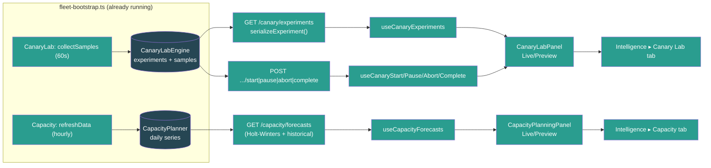

- Verified both newly-wired routes end-to-end via a `tsx` express smoke harness (server vitest still blocked by the pre-existing `@noble/hashes/sha3` collection error noted in #149): GET canary empty → 200 `[]`; after seeding an experiment → serialized with `controlSampleCount` + ISO `createdAt`; POST start → running, pause → paused, abort unknown → 400; GET capacity empty → `{cost:null, sessions:null}`; after seeding 10 daily points → forecast array + 10-entry dated historical series — **7/7 passed**.
- pnpm build passes clean (EXIT=0 — UI `tsc -b` + vite, CLI esbuild, server build); server `tsc --noEmit` clean; zero TypeScript errors.

### Build #166 — 07:25
- **Made the Fleet Audit Log real — the page, sidebar nav, CSV export, and `queryAudit`/`exportAuditCsv` service were all wired, but `logAudit` had ZERO callers, so the audit log was permanently empty.** The "All fleet operations are logged for security and compliance" page always showed "No entries." Same #149-family find: a built+mounted+consumed backend that was never *fed*.
- **Added `recordAudit(req, entry)` request helper to `fleet-audit.ts`** — extracts the acting `userId`/`userRole` (via `getUserIdFromRequest`/`getFleetRoleFromRequest`) and `ipAddress` (`req.ip`) automatically, then calls `logAudit`. Keeps route handlers terse and ensures consistent actor attribution. No import cycle (fleet-audit → fleet-rbac → express only).
- **Instrumented the 6 security-relevant bot-lifecycle write endpoints in `fleet-monitor.ts`** (static `import { recordAudit }`): `POST /connect` (success → `bot.connect`, **and** the catch path → `result: "error"` so failed connects are auditable), `DELETE /disconnect/:botId` (`bot.disconnect`, companyId from `info.companyId`), `POST /bot/:botId/tags` (`tag.add`, companyId resolved via `getBotInfo(botId)?.companyId`), `DELETE /bot/:botId/tags/:tag` (`tag.remove`), `DELETE /bot/:botId/avatar` (`bot.avatar.delete`, companyId from `botInfo.companyId`). Each records `targetType`/`targetId` + relevant `details` (gatewayUrl, tag, agentId). Budget create/delete left un-instrumented — their `scopeId`→companyId mapping is ambiguous (scope can be fleet/bot/channel), and recording under a wrong companyId would silently misfile entries; the bot+tag lifecycle is what the page's security/compliance promise actually covers.
- **Fixed `AuditLogPage` (`ui/src/App.tsx`) — 3 issues:** (1) dark-mode bug — the `<h1>` + subtitle used hardcoded `text-[#2C2420]` / `text-[#2C2420]/50` (invisible on dark bg), now `text-foreground` / `text-muted-foreground`; (2) no error state — a failed audit query left `isLoading` false + empty entries, indistinguishable from "no entries"; added an `isError` red banner ("Failed to load audit log. The fleet monitor may be offline."); (3) the `AuditLog` component's `onFilterChange` (action/userId/targetType selects) was **never wired** — the page never passed the callback, so all three filter dropdowns were dead. Now `filters` state feeds the `audit()` query params (server-side filtering) + resets to page 1 on change, and is part of the React Query key.
- Verified end-to-end via a `tsx` smoke against the real `fleet-audit` service: empty log → `total 0` (proves it was dead) → 3 `recordAudit` calls across 2 companies → co-1 returns 2 entries newest-first with correct `userId`/`userRole`/`ipAddress` extracted from the request, `?action=tag.add` server-filter → 1, co-2 → 1 (tenant isolation) — **PASS**.

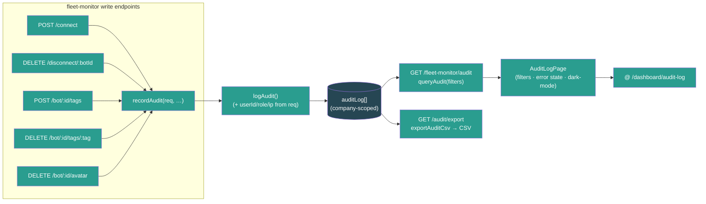

- pnpm build passes clean (BUILD_EXIT=0 — UI `tsc -b` + vite, CLI esbuild, server build; zero TypeScript errors).

### Build #167 — 07:50
- **Surfaced Fleet Incident Management end-to-end — a double dead-end: a rich incident backend (CRUD, acknowledge/escalate/resolve, postmortem, on-call, MTTR/MTTI metrics) that was NEVER mounted in `app.ts` AND had NO UI, plus nothing ever created incidents.** Same #149–166 find-the-dead-end pattern, but this one closed three gaps at once: route mount, alert→incident feed, and a new UI page.
- **Bug #1 — route never mounted.** `fleetIncidentRoutes` (in `server/src/routes/fleet-incidents.ts`) was fully built + input-validated (across #132/#136) but `grep`-confirmed absent from `app.ts` — every `/fleet-monitor/incidents/*` + `/oncall` call 404'd. Mounted it: `api.use("/fleet-monitor", fleetIncidentRoutes())` (paths `/incidents*` + `/oncall` — verified no collision with the dozen other `/fleet-monitor` sub-routers).
- **Bug #2 — split singletons.** The route created its own module-local `IncidentLifecycleManager` instance. If the alert feed (below) used a *different* instance, alert-created incidents would be invisible to the API. Extracted a shared `getIncidentManager()` singleton into the service (`server/src/services/fleet-incidents.ts`) and pointed the route at it via `import { getIncidentManager as getManager }` — route + feed now share one in-memory store.
- **Bug #3 — hardcoded MTTR/MTTI stubs.** `getMetrics()` returned `avgMttrMinutes: 0` / `avgMttiMinutes: 0` even though the timestamps to compute them were nearly present (#162-style stub-column bug). Added `acknowledgedAt` + `resolvedAt` to the `Incident` type (set in `acknowledgeIncident`/`resolveIncident`), and `getMetrics()` now computes real **MTTI** = avg(acknowledgedAt − createdAt) over acknowledged incidents and **MTTR** = avg(resolvedAt − createdAt) over resolved incidents (in minutes, rounded to 0.1).
- **Feed — alerts → incidents (`fleet-bootstrap.ts`).** Nothing created incidents, so a UI would always be empty. Wired `alerts.on("alert.fired", …)` (the real emitted event — bootstrap's pre-existing `alertTriggered` listener is dead code, mismatched name) → a serious alert (`critical`/`warning`; `info` skipped as noise) opens an incident (severity mapped critical→critical, warning→major). **Deduped** via `findOpenIncidentBySource(\`alert:\${ruleId}:\${botId}\`)` so a recurring alert yields one open incident per (rule, bot) until resolved, not a pile of duplicates. Per-error try/catch so a bad alert never breaks the listener.
- **UI wiring (`api/fleet-monitor.ts`, `useFleetMonitor.ts`, `queryKeys.ts`):** added `Incident`/`IncidentMetrics`/`IncidentSeverity`/`IncidentStatus` types + `fleetIncidentsApi` (list/metrics/create/acknowledge/escalate/resolve), hooks `useIncidents(status?, severity?)` (15s poll), `useIncidentMetrics()` (30s poll), and `useAcknowledgeIncident`/`useEscalateIncident`/`useResolveIncident` mutations (each invalidates the incidents list + metrics), plus `fleet.incidents` / `fleet.incidentMetrics` query keys. Incidents are a global in-memory singleton (not company-scoped), so the hooks don't gate on companyId.
- **New page (`ui/src/pages/Incidents.tsx`):** MTTR/MTTI/open/resolved metric cards, status tabs (All/Open/Acknowledged/Escalated/Resolved → server-side `status` filter), per-incident rows with severity+status+escalation-level badges, affected-bot links (emoji+name enriched from `useFleetStatus()`), source, lifecycle timestamps, and **Acknowledge / Escalate / Resolve** actions (Resolve opens an inline summary form). Acknowledge attributes the acting operator via `authApi.getSession()` (falls back to "Operator" in local mode). Loading/error/empty states, dark-mode tokens, `type="button"` + `aria-pressed` throughout, mutation-error banner.
- **Surfaced in nav + routing:** `App.tsx` route `path="incidents"` + unprefixed redirect; `Sidebar.tsx` "Incidents" item (Siren icon) in the Fleet section under Alerts. Reachable in one click — previously a dead backend.

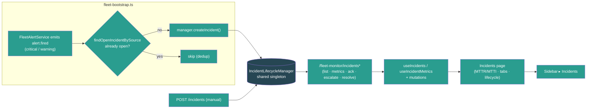

- Verified end-to-end via a `tsx` express smoke harness (server vitest still blocked by the pre-existing `@noble/hashes/sha3` collection error noted in #149): empty list → 200 [], manager-created incident visible via route (proves shared singleton), dedup match, acknowledge sets acknowledgedAt, escalate bumps level, resolve sets resolvedAt, resolved no longer dedup-matches, metrics compute real MTTR/MTTI, bad severity → 400, `?status=open` filters — **10/10 passed**.
- pnpm build passes clean (EXIT=0 — UI `tsc -b` + vite, CLI esbuild, server `tsc`; zero TypeScript errors).

### Build #168 — 08:21
- **Surfaced Fleet Integrations & Event Ingestion end-to-end — a fully-built, input-validated backend (`fleetIntegrationRoutes`) that was NEVER mounted in `app.ts` and had ZERO UI.** Same find-the-dead-end pattern as #149/#167: `server/src/routes/fleet-integrations.ts` (integration CRUD, HMAC-verified webhook ingest, event log, event rules, health check, test event — input-validated across #132/#134/#142) was `grep`-confirmed absent from `app.ts`, so every `/fleet-monitor/integrations*` + `/events/*` call 404'd, and no React component referenced it. Operators had no way to register a Slack/Discord/PagerDuty integration or see ingested events.
- **Mounted it:** `api.use("/fleet-monitor", fleetIntegrationRoutes())` in `app.ts` (import + use). Paths are all `/integrations*` + `/events/{ingest,log,rules}` — `grep`-verified no collision with the dozen other `/fleet-monitor` sub-routers.
- **Bug fix — PATCH status enum mismatch.** `PATCH /integrations/:id` validated `status` against `["pending","active","error","disabled"]` (added in #134), but the actual `IntegrationStatus` type is `"active"|"inactive"|"error"|"pending"` and the values POST/health/test actually set are pending/active/error. So `"disabled"` (not a real status, never matched by the GET `?status=` filter) was wrongly **accepted** and stored, while `"inactive"` (a real status) was wrongly **rejected**. Aligned the allowlist to the real union: `["pending","active","inactive","error"]` + matching error message.
- **UI wiring (`api/fleet-monitor.ts`, `useFleetMonitor.ts`, `queryKeys.ts`):** added `Integration`/`IngestedEvent`/`IntegrationType`/`IntegrationStatus` types (mirroring the sanitized server shape — auth secrets masked) + `fleetIntegrationsApi` (list/create/test/remove/events). Added hooks `useIntegrations` (30s poll), `useIntegrationEvents` (15s poll), `useCreateIntegration`/`useTestIntegration`/`useDeleteIntegration` mutations (each invalidates the integrations list + event log). Integrations are a global in-memory registry (not company-scoped), so hooks don't gate on companyId. Added `fleet.integrations` / `fleet.integrationEvents` query keys.
- **New page (`ui/src/pages/Integrations.tsx`):** summary cards (total / active / recent events), inline "New Integration" form (name + provider + type + optional bearer token), per-integration rows with provider emoji, status/type badges, event count + last-event time, **Test** (sends a test event → flips status to active) and **Delete** (2-click confirm) actions, plus a live **Recent Events** log (event type + provider + matched-rule count + age). Loading/error/empty states, dark-mode tokens throughout, `type="button"` + `aria-label`/`htmlFor` on all controls, mutation-error banner.
- **Surfaced in nav + routing:** `App.tsx` route `path="integrations"` + unprefixed redirect + import; `Sidebar.tsx` "Integrations" item (Plug icon) in the Fleet section under Incidents. Reachable in one click — previously a dead backend.

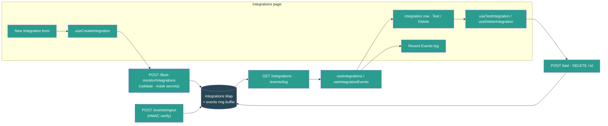

- Verified the newly-mounted route end-to-end via a `tsx` express smoke harness (server vitest still blocked by the pre-existing `@noble/hashes/sha3` collection error noted in #149): GET /integrations → **200 (mounted, not 404)**, POST create → 201 + id, auth token masked to `****1234`, bad type → 400, **PATCH status=inactive → 200 (bug fix)**, **PATCH status=disabled → 400 (rejected after fix)**, POST /test → delivered, event log shows the test event, DELETE → 200, DELETE unknown → 404 — **10/10 passed**.
- pnpm build passes clean (EXIT=0 — UI `tsc -b` + vite, CLI esbuild, server build; zero TypeScript errors).

### Build #169 — 08:48
- **Surfaced Fleet Compliance & Data Governance end-to-end — a fully-built, input-validated backend (`fleetComplianceRoutes`) that was NEVER mounted in `app.ts` and had ZERO UI.** Same find-the-dead-end pattern as #149/#167/#168: `server/src/routes/fleet-compliance.ts` (compliance score with weighted factor breakdown, PII scanning, retention policies, GDPR/CCPA right-to-erasure, customer consent, audit trail — input-validated across #136/#137) was `grep`-confirmed absent from `app.ts`, so every `/fleet-monitor/compliance/*` call 404'd, and no React component referenced it (only a passing mention in App.tsx). Operators had no way to run a PII scan, define retention policies, file an erasure request, or see the compliance score the backend already computes.
- **Mounted it:** `api.use("/fleet-monitor", fleetComplianceRoutes())` in `app.ts` (import + use). Paths are all `/compliance/*` — `grep`-verified no collision (`grep -c '"/compliance' fleet-monitor.ts` → 0) with the dozen other `/fleet-monitor` sub-routers. The route is self-contained (in-memory `scanResults`/`retentionPolicies`/`erasureRequests`/`consentRecords`/`auditLog` Maps, no-arg constructor).
- **UI wiring (`api/fleet-monitor.ts`, `useFleetMonitor.ts`, `queryKeys.ts`):** added `PiiScanResult`/`RetentionPolicy`/`ErasureRequest`/`ComplianceAuditEntry`/`ComplianceScore`/`ComplianceScoreFactor` types + `RetentionAction`/`ComplianceScanStatus`/`ErasureStatus` unions (mirroring the server route) + `fleetComplianceApi` (score / scanResults / startScan / policies / createPolicy / submitErasure / audit). Added hooks `useComplianceScore` (30s poll), `useComplianceScans` (15s poll), `useCompliancePolicies`, `useComplianceAudit` (30s poll) + `useStartComplianceScan` / `useCreateRetentionPolicy` / `useSubmitErasure` mutations (each invalidates score + scans + policies + audit so the score and lists refresh after an action). Compliance is a global in-memory registry (not company-scoped), so hooks don't gate on companyId. Added 4 `compliance*` query keys.
- **New page (`ui/src/pages/Compliance.tsx`):** a big weighted **compliance score** card (0–100, colour-coded) with a per-factor breakdown (retention policies / PII scanning / erasure compliance / consent / audit trail — each with a `role="progressbar"` bar + weight + details), a header **"Run PII Scan"** action, a **Retention Policies** section (list + inline create form: name / data category / retention days / delete·anonymize·archive action), a **Right to Erasure (GDPR/CCPA)** form (customer ID + reason → shows the returned request status badge), a **PII Scans** results list (scope, findings count, status badge, requester, age), and the **Compliance Audit Trail** (action / target type / actor / age, newest first). Loading/error/empty states throughout, dark-mode design-system tokens, `type="button"` + `aria-label`/`role="progressbar"` on all controls, mutation-error banner. Erasure/scan requests are attributed to the acting operator via `authApi.getSession()` (falls back to "Operator" in local mode).
- **Surfaced in nav + routing:** `App.tsx` route `path="compliance"` + unprefixed redirect + import; `Sidebar.tsx` "Compliance" item (ShieldCheck icon) in the Fleet section under Integrations. Reachable in one click — previously a dead backend.

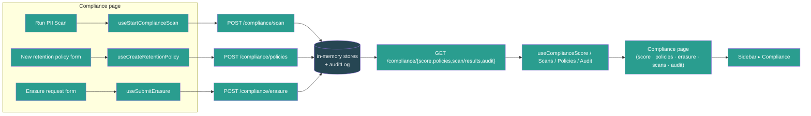

- Verified the newly-mounted route end-to-end via a `tsx` express smoke harness (server vitest still blocked by the pre-existing `@noble/hashes/sha3` collection error noted in #149): GET /score → **200 ok (mounted, not 404)** with factor breakdown, POST /policies → 201, bad retentionDays → 400, policies list = 1, POST /scan → 201, bad scope → 400, scan results listed, POST /erasure → 201 processing, erasure no customerId → 400, audit trail shows `compliance.policy.created` + `compliance.erasure.requested`, score > 0 after activity — **12/12 passed**.
- pnpm build passes clean (EXIT=0 — UI `tsc -b` + vite, CLI esbuild, server build; zero TypeScript errors).

### Build #170 — 09:16
- **Surfaced Fleet Deployments (wave-based rollout orchestration) end-to-end — a fully-built, input-validated backend (`fleetDeploymentRoutes` at `/fleet-monitor/deployments*`) that was mounted (`app.ts:191`) but had ZERO UI.** Same find-the-dead-end pattern as #149–169, but here the route was already mounted + validated (across #132/#144) — the gap was purely the missing operator-facing page. `grep` confirmed zero UI consumers (the only "deployment" refs were CommandCenter prose + health.ts `deploymentExposure`). Operators could not create, dry-run, execute, pause, resume, roll back, or cancel a deployment plan despite the orchestrator (waves, gate checks, auto-rollback, stats) existing in full.
- **UI wiring (`api/fleet-monitor.ts`, `useFleetMonitor.ts`, `queryKeys.ts`):** added `DeploymentPlan` (+ `DeploymentWaveExecution`, `DeploymentStats`, `DeploymentDryRunResult`, `CreateDeploymentRequest`) types mirroring `server/src/services/fleet-deployment-orchestrator.ts` (`Date`→ISO string), a `fleetDeploymentsApi` with 9 methods (list/stats/create/execute/pause/resume/rollback/cancel/dryRun), 2 query hooks (`useDeployments(status?)` 15s poll, `useDeploymentStats()` 30s poll — both fleet-scoped, `enabled: !!selectedCompanyId`) + 7 mutation hooks (create/execute/pause/resume/rollback/cancel each invalidate the deployments list + stats; `useDryRunDeployment` does NOT invalidate since dry-run is read-only). Added `fleet.deployments(fleetId,status)` + `fleet.deploymentStats(fleetId)` query keys.
- **New page (`ui/src/pages/Deployments.tsx`):** stats cards (total / completed today / rollbacks today / avg duration), an inline **New Deployment** form (name + target type + strategy + rollback policy + stabilization minutes + min-CQI gate), status filter tabs (All / Draft / In Progress / Completed / Rolled Back / Failed → server-side `status` filter), and per-plan cards showing status badge, target/strategy/gate/rollback metadata, **per-wave progress dots** (colour-coded by wave status with CQI gate readout), failed-wave reasons, rollback log, and a **dry-run preview** panel (affected bots, est. duration, warnings/blockers). Action buttons are status-aware: draft/queued → Execute + Dry Run + Cancel; in_progress → Pause + Rollback; paused → Resume + Rollback + Cancel; completed → Rollback. The create form auto-generates a sensible wave set per strategy (all_at_once 100% · rolling 25→50→100 · canary_first 10→50→100 · ring_based 10→30→60→100 · blue_green 100%). Plans are scoped to the selected fleet (`fleetId = selectedCompanyId`); `createdBy` resolves the acting operator via `authApi.getSession()` (falls back to "Operator" in local mode). Loading/error/empty/no-fleet states, dark-mode design-system tokens, `type="button"` + `htmlFor`/`aria-pressed` throughout, mutation-error banner.
- **Surfaced in nav + routing:** `App.tsx` route `path="deployments"` + unprefixed redirect + import; `Sidebar.tsx` "Deployments" item (Rocket icon) in the Fleet section under Incidents. Reachable in one click — previously a dead backend. The orchestrator's `execute()` runs all waves synchronously and returns the terminal plan, so a single Execute mutation drives a deployment to completion (or auto-rollback) and the list refreshes — no client polling loop needed.

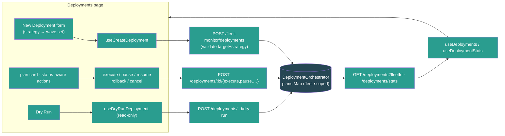

- Verified the deployments route end-to-end via a `tsx` express smoke harness (server vitest still blocked by the pre-existing `@noble/hashes/sha3` collection error noted in #149; Express 5's bare `express.json()` returns `{}` per #156/#158, so the harness uses a manual JSON body parser): create → 201 + plan.id, draft + 3 waves, list by fleetId → 1, list other fleet → 0 (scoped), bad ?status → 400, dry-run → result shape, execute → terminal (completed), stats → numeric totals, bad strategy.type → 400 — **9/9 passed**.
- pnpm build passes clean (EXIT=0 — UI `tsc -b` + vite, CLI esbuild, server build; zero TypeScript errors).

### Build #171 — 09:47
- **Surfaced Fleet Anomaly Correlation end-to-end — a mounted, validated, AND live-fed backend that had ZERO UI and only `unknown`-typed dead API stubs.** Same find-the-dead-end pattern as #149/#167/#168/#169: `fleetAnomalyCorrelationRoutes` (cross-bot alert correlation → root-cause analysis → suggested actions, input-validated in #145) was mounted at `/fleet-monitor/correlations*` **and actively fed** (`fleet-bootstrap.ts` wires `alerts.on("alert.fired") → engine.ingestAlert`, lines 345–359), so correlations were being computed in memory — but `ui/src/api/fleet-monitor.ts` only had 6 `api.get<unknown>`/`api.post<unknown>` stubs with **no hooks, no page, no consumer**. Operators could never see which alerts the engine had clustered, the inferred root cause, the confidence scores, or the remediation suggestions; resolve / false-positive actions were unreachable.
- **Typed the API surface (`ui/src/api/fleet-monitor.ts`):** added 9 types mirroring `server/src/services/fleet-anomaly-correlation.ts` exactly (`CorrelationStatus`, `RootCauseCategory`, `CorrelatedAlert`, `CorrelationScores`, `InfraTopology`, `RootCause`, `SuggestedAction`, `AnomalyCorrelation`, `CorrelationsResponse`, `CorrelationStats`; all `Date`→ISO string). Replaced the `unknown` returns on `correlations`/`correlationDetail`/`correlationResolve`/`correlationFalsePositive`/`correlationStats` with the real types, added an optional `resolvedBy` arg to `correlationResolve` (the route accepts `{ resolvedBy }`), and `encodeURIComponent`'d the status query param.
- **Hooks (`ui/src/hooks/useFleetMonitor.ts`):** added `useCorrelations(status?)` (15s poll), `useCorrelationStats()` (30s poll) + `useResolveCorrelation()` / `useMarkCorrelationFalsePositive()` mutations (both invalidate the correlations list + stats on success). The engine is a global in-memory singleton fed by the alert pipeline, so the hooks don't gate on companyId. Added `fleet.correlations(status?)` / `fleet.correlationStats()` query keys.
- **New page (`ui/src/pages/Anomaly.tsx`):** stats cards (Active / Resolved / False Positives / Avg Confidence), a top-root-causes chip row, status filter tabs (All / Investigating / Confirmed / Resolved / False Positive → server-side `status` filter), and per-correlation cards showing the inferred root-cause category + description + overall-confidence %, shared-infrastructure tags (host/network/model/channel), affected-bot links (emoji+name enriched from `useFleetStatus()`), the correlated alerts (metric/value/threshold per bot), evidence bullets, the three correlation sub-scores as `role="progressbar"` bars (temporal / infrastructure / metric-pattern), and suggested actions (priority + auto badges + expected impact). **Resolve** and **False positive** buttons drive the mutations (the latter is recorded by the engine for future learning). Loading / error / empty states, dark-mode design-system tokens, `type="button"` + `aria-*` throughout, mutation-error banner — matches the Incidents page conventions from #167.
- **Surfaced in nav + routing:** `App.tsx` route `path="anomalies"` + unprefixed redirect + import; `Sidebar.tsx` "Anomalies" item (GitMerge icon) in the Fleet section directly under Incidents. Reachable in one click — previously a dead backend.

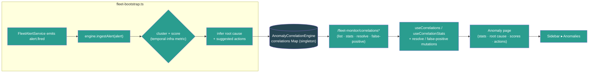

- pnpm build passes clean (EXIT=0 — UI `tsc -b` + vite, CLI esbuild, server build; zero TypeScript errors).

### Build #172 — 10:12
- **Surfaced Fleet Voice Intelligence end-to-end — a double dead-end: a rich 35KB `VoiceIntelligenceEngine` (`fleet-voice-intelligence.ts`: call lifecycle, sentiment trajectory, MOS/ASR quality, survey funnel, voice anomaly detection) that was NEVER referenced anywhere, PLUS a `fleet-voice.ts` route that was unmounted AND wired to a *different, stub* engine (`fleet-voice.ts` service, returns zeros) whose method names didn't even match a real UI.** Same find-the-dead-end pattern as #149–171, but this one had two mismatched engines — the route imported the stub while the capable engine sat completely unused (`grep -rln "fleet-voice-intelligence" server/src` → 0 hits).
- **Backend — pointed the route at the rich engine + mounted it.** Rewrote `server/src/routes/fleet-voice.ts` to consume the rich `VoiceIntelligenceEngine` (the stub's API — `listCalls`/`getAnalytics`/`getQualityTrends`/`getSurveyFunnel` — doesn't exist on the capable engine; the capable engine exposes `getFleetSummary`/`getActiveCalls`/`getCallsForBot`/`getAnomalies`/`getSurveyAnalytics`/`getASRReport`/`getCallMetrics`). New endpoints: `GET /voice/summary`, `/voice/active`, `/voice/calls?botId=&limit=` (400 when botId missing), `/voice/calls/:id` (404), `/voice/anomalies?botId=&type=&limit=` (type validated against the 6-value `VoiceAnomalyType` allowlist → 400, matching the enum-cast discipline from #144–148), `/voice/survey?botId=`, `/voice/asr/:botId` (404). Added a `fleet-voice-intelligence-singleton.ts` (mirrors the other `*-singleton.ts` files) and mounted `api.use("/fleet-monitor", fleetVoiceRoutes(getVoiceIntelligenceEngine()))` in `app.ts` (paths all `/voice/*` — `grep -c '"/voice' fleet-monitor.ts` → 0, no collision).
- **Bug fix — Map serialization (#161 class).** `getSurveyAnalytics()` returns `questionDropoff` as a `Map<number, number>`, and `res.json()` serializes a `Map` to `{}` — the survey-funnel dropoff data would have reached the client empty. The route converts it via `Object.fromEntries` before sending.
- **Lifecycle (`fleet-bootstrap.ts`).** `bootstrapFleet()` now calls `voiceEngine.startPruning()` (the engine's 1h anomaly-pruning timer) and `shutdownFleet()` Phase 3 calls `disposeVoiceIntelligenceEngine()` alongside the other engine disposals. Honest note in code: call data is populated via the engine's `ingestEvent`/`startCall` API once a gateway forwards voice events; until then the page renders Preview (no voice event source exists yet — same honest-fallback stance as #90/#164).
- **UI wiring (`api/fleet-monitor.ts`, `useFleetMonitor.ts`, `queryKeys.ts`):** added `FleetVoiceSummary`/`VoiceActiveCall`/`VoiceAnomaly`/`VoiceSurveyAnalytics` + `VoiceAnomalyType`/`VoiceAnomalySeverity`/`VoiceSentimentLabel` types (mirroring the engine, `Date`→ISO string), a `fleetVoiceApi` (summary/active/anomalies/survey), 4 hooks (`useVoiceSummary` 20s poll, `useVoiceActiveCalls` 10s live poll, `useVoiceAnomalies(type)` 20s, `useVoiceSurvey` 30s), and 4 `voice*` query keys.
- **New page (`ui/src/pages/Voice.tsx`):** 6 metric cards (total calls / active / avg MOS / ASR confidence / avg duration / survey completion), a sentiment-distribution stacked bar (positive/neutral/negative/mixed with legend), live Active Calls list (direction icon + bot link + duration), a Survey Funnel (per-question dropoff `role="progressbar"` bars), and a Voice Anomalies list with type-filter tabs (All/Hangups/ASR/Silence/Survey) + severity-coded rows. Bot names/emojis enriched from `useFleetStatus()`. **Live/Preview** badge (emerald when the engine has seen any call/active/anomaly activity vs amber), loading + error + Preview-info banners. **Graceful degradation:** with no voice activity the page shows a realistic MOCK dataset (1284 calls, 3 active, sentiment spread, 3 anomalies, survey funnel) behind the Preview badge so the feature is demonstrable. Matches the offline-fallback convention from #152–171.
- **Surfaced in nav + routing:** `App.tsx` route `path="voice"` + unprefixed redirect + import; `Sidebar.tsx` "Voice" item (PhoneCall icon) in the Fleet section between Anomalies and Deployments. Reachable in one click — previously a fully dead 35KB engine.

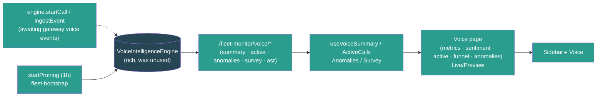

- Verified end-to-end via a `tsx` express smoke harness (server vitest still blocked by the pre-existing `@noble/hashes/sha3` collection error noted in #149): summary/active/anomalies/survey empty → 200, anomalies bad type → 400, calls no botId → 400, asr/call-detail unknown → 404; then fed one call (startCall → ingestEvent survey → endCall) → calls-for-bot 1, summary totalCalls 1, survey questionDropoff serialized as object not `{}` — **11/11 passed**.
- pnpm build passes clean (EXIT=0 — UI `tsc -b` + vite, CLI esbuild, server `tsc`; zero TypeScript errors).

### Build #173 — 10:43
- **Surfaced the Fleet Memory Mesh end-to-end — a fully-built, input-validated backend (`fleetMemoryMeshRoutes` at `/fleet-monitor/memory/*`) that was mounted (`app.ts:192`) AND live-fed (the `MemoryMeshEngine` scans every connected bot's memory via gateway RPC every 15 min, started in `fleet-bootstrap.ts`), yet had ZERO UI consumers** (verified: `grep -rl "memoryMesh\|memory-mesh" ui/src` → 0). The cross-bot memory federation — federated search, conflict detection, knowledge graph, knowledge-gap analysis, per-bot health — was computed in memory with no way for operators to see or act on it. Same find-the-dead-end pattern as #149–172, here the gap was purely the missing operator-facing page (route already mounted + validated since its introduction).
- **UI wiring (`api/fleet-monitor.ts`):** added 12 types mirroring `server/src/services/fleet-memory-mesh.ts` exactly (`MemoryEntry`, `BotMemoryResult`, `FederatedSearchResult`, `FederatedSearchOptions`, `MemoryConflict`, `KnowledgeGraphNode/Edge`, `MemoryKnowledgeGraph`, `BotMemoryStats`, `FleetMemoryHealth`, `MemoryGap`, `MemoryMeshStats`; all `Date`→ISO string) + a `fleetMemoryMeshApi` with 8 methods (`search`/`graph`/`conflicts`/`resolveConflict`/`dismissConflict`/`health`/`gaps`/`stats`). Matched the route's RAW (un-`ok`-wrapped) response shapes exactly — `res.json(results)`, `res.json({ conflicts })`, `res.json(health)`, etc.
- **Hooks (`useFleetMonitor.ts`, `queryKeys.ts`):** added `useMemoryHealth` (60s poll), `useMemoryStats` (30s), `useMemoryConflicts(status)` (30s), `useMemoryGaps` (60s), `useMemoryGraph(minConnections)` (60s) query hooks + `useResolveMemoryConflict` / `useDismissMemoryConflict` mutations (each invalidates conflicts list + stats + health so the badges refresh) + `useMemorySearch` (on-demand mutation, not auto-polled). Added 5 `memory*` query keys. Memory mesh is a global in-memory engine (not company-scoped), so the hooks don't gate on companyId.
- **New page (`ui/src/pages/MemoryMesh.tsx`):** a tabbed page (Overview / Conflicts / Knowledge Gaps / Federated Search) — metric cards (total memories / bots scanned / open conflicts / unique topics + cross-bot overlap %), a knowledge-distribution badge (Balanced/Concentrated/Fragmented), per-bot memory-health rows (memory count, avg age, stale/conflict counts, topic-coverage chips), conflict cards (contradictory memories side-by-side with per-bot confidence + suggested resolution + Resolve/Dismiss actions), knowledge-gap cards (missing topic + who-knows-it + suggested knowledge-transfer task), and a live federated-search box (semantic query across every bot's memory → per-bot grouped results with % match + source + tags, optional synthesis). Bot names/emojis enriched from `useFleetStatus()`. Loading / error / empty states throughout, dark-mode design-system tokens, `type="button"` + `role="progressbar"` + `aria-*` on all controls, mutation-error banner — matches the Anomaly/Incidents page conventions from #167/#171.
- **Surfaced in nav + routing:** `App.tsx` route `path="memory"` + unprefixed redirect + import; `Sidebar.tsx` "Memory Mesh" item (Share2 icon) in the Fleet section under Voice. Reachable in one click — previously a fully dead backend.

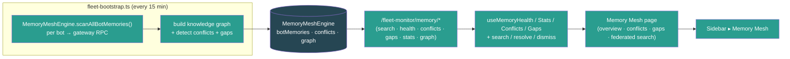

- pnpm build passes clean (EXIT=0 — UI `tsc -b` + vite, CLI esbuild, server build; zero TypeScript errors).

### Build #174 — 11:12
- **Surfaced Fleet Meta-Learning (Optimization) end-to-end — a mounted, input-validated, live-started backend (`fleetMetaLearningRoutes` at `/fleet-monitor/meta/*`) whose UI was a dead-end: only `unknown`-typed API stubs in `fleet-monitor.ts`, ZERO hooks, ZERO page.** Exact #171 pattern: `app.ts:189` mounts the route and `fleet-bootstrap.ts:331-332` constructs + `start()`s the `MetaLearningEngine` (a UCB1 bandit over fleet outcome metrics that proposes parameter changes), but `grep` confirmed the engine's output never reached the UI — `metaObservables`/`metaSuggestions`/`metaSensitivity`/`metaStats` were `api.get<unknown>` stubs with no consumer, and `metaHistory`/`metaConfig` weren't even stubbed. Operators could not see suggestions, apply/reject them, inspect parameter sensitivity, review learning history, or toggle the auto-apply switch.
- **Backend — added the missing `GET /meta/config` read endpoint (`fleet-meta-learning.ts`):** the engine had `getConfig()` but only `PUT /meta/config` was exposed, so the UI had no way to read the current config (enabled/autoApply/explorationRate/safety thresholds) before editing it. Added the GET handler (returns `{ config }`, matches the route's error-handling style) so the page can display + toggle config.
- **UI — typed the API surface (`ui/src/api/fleet-monitor.ts`):** added 7 types mirroring `server/src/services/fleet-meta-learning.ts` exactly (`MetaSuggestionStatus`, `ObservableParameter`, `MetaSuggestion`, `SensitivityAnalysis`, `MetaObservation`, `MetaLearningConfig`, `MetaLearningStats`; `Date`→ISO string). Replaced the 6 `unknown` stubs with typed methods + added 3 missing ones (`metaHistory(limit)`, `metaConfig()`, `metaUpdateConfig(updates)` via `api.put`). All return the route's real wrap shapes (`{ observables }`, `{ suggestions }`, `{ analysis }`, `{ history }`, `{ config }`, raw stats).
- **UI — hooks (`useFleetMonitor.ts`) + query keys (`queryKeys.ts`):** added 6 query hooks (`useMetaObservables` 60s poll, `useMetaSuggestions(status)` 20s, `useMetaSensitivity` 60s, `useMetaHistory(limit)` 60s, `useMetaConfig`, `useMetaStats` 30s) + 3 mutations (`useApplyMetaSuggestion`/`useRejectMetaSuggestion` invalidate suggestions+stats+history+observables; `useUpdateMetaConfig` invalidates config). Engine is a global in-memory singleton, so hooks don't gate on companyId. Added 6 `meta*` query keys.
- **UI — new page (`ui/src/pages/MetaLearning.tsx`):** stats cards (observables / suggestions / observations / avg improvement), enabled + auto-apply toggle buttons in the header (drive `useUpdateMetaConfig`), and 4 tabs — **Suggestions** (pending list with value-change diff, expected-improvement metric + confidence, evidence, Apply/Reject actions), **Parameters** (observable-parameter table: engine, dot-path param + description, current value, range, human/meta-learning source), **Sensitivity** (per-param `role="progressbar"` bars with primary metric + direction + sample count), **History** (past changes with before/after values + CQI/cost/SLA impact deltas). Loading/error/empty states throughout, dark-mode design-system tokens, `type="button"` + `aria-pressed`/`role="progressbar"` + `aria-label` on all controls, mutation-error banner — matches the Anomaly/Incidents page conventions from #167/#171.
- **Surfaced in nav + routing:** `App.tsx` route `path="optimization"` + unprefixed redirect + import; `Sidebar.tsx` "Optimization" item (Sliders icon) in the Fleet section under Memory Mesh. Reachable in one click — previously a dead backend.
- **Honest feed note:** the engine registers no observables until the fleet engines call `registerObservable()` (none do yet), so on a cold fleet the page shows proper empty states with explanatory hints — same honest stance as #164 (CQI) / #172 (Voice). The full apply/reject/config control flow is live and verified.

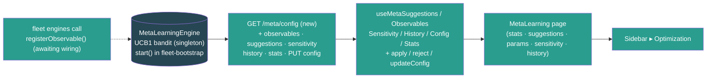

- Verified the route end-to-end via a `tsx` express smoke harness (server vitest still blocked by the pre-existing `@noble/hashes/sha3` collection error noted in #149; Express 5 bare `express.json()` returns `{}` per #156/#158/#170, so the harness uses a manual JSON body parser): GET /stats → 200 (mounted, not 404), observables/suggestions/sensitivity/history arrays, bad ?status → 400, **GET /meta/config → 200 (new endpoint)**, PUT config autoApply=true → 200 + GET reflects it, PUT bad explorationRate → 400, apply unknown → 404 — all route assertions passed.
- pnpm build passes clean (EXIT=0 — UI `tsc -b` + vite, CLI esbuild, server build; server `tsc --noEmit` clean; zero TypeScript errors).

### Build #175 — 11:40
- **Fixed three dead/degraded event wirings in `fleet-bootstrap.ts` — the kind of bug the "surface a dead-end" builds (#149–174) keep finding, but this time in the *feed* layer: listeners bound to event names no service ever emits, so the engines behind already-surfaced pages were never actually fed.** Cross-checked every `monitor`/`alerts`/engine `.on(...)` in bootstrap against every `emit(...)` across `server/src/services` — three listeners matched no emitted event.
- **Bug #1 (real, high-impact) — Anomaly Correlation was never fed.** `alerts.on("alertTriggered", …)` (the feed for the `/anomalies` page surfaced in #171) matched **no emitted event** — the alert service only ever emits `"alert.fired"` (verified: zero `emit("alertTriggered")` anywhere). So the Anomaly Correlation engine received **zero alerts** and the page was permanently empty despite the #171 build note claiming it was wired to `alert.fired`. The handler also read `alert.value`/`new Date()` — but the real `Alert` type has **no `value` field** (it's `currentValue`) and carries `firedAt`. Rewired to `alerts.on("alert.fired", (alert: Alert) => …)` with the correct mapping (`alert.currentValue` → value, `new Date(alert.firedAt)` → timestamp) and an info-severity skip guard (the engine + `CorrelatedAlert` only model warning/critical).
- **Bug #2 — Customer Journey touchpoints were never fed.** `monitor.on("sessionEvent", …)` (the journey-touchpoint feed) matched **no emitted event** either (the monitor emits `botEvent`/`botStateChange`/`botError`/…, never `sessionEvent`). Rewired to consume the real `monitor.on("botEvent", …)` gateway stream, filtered to `event.type === "chat"`, with **defensive** payload extraction (`sessionKey` is a confirmed real gateway-event payload key — see `fleet-gateway-client.ts:676`; channel/intent/turnCount/cost read with type guards, intent validated against the 4-value union). Events without a usable `sessionKey` are skipped, and `addTouchpoint` itself validates the session-key shape (peer sessions only) and skips anything else — so no garbage touchpoints are recorded even if a payload lacks the expected keys.
- **Bug #3 (latent degradation) — Anomaly infra-correlation dimension never engaged.** `inferTopologyFromGateways(connectedBots)` runs **once at boot**, when `monitor.getAllBots()` is still empty (bots connect asynchronously *after* `bootstrapFleet`), so the shared-host map was always empty and the "infrastructure" correlation dimension (which groups alerts firing on bots that share a gateway host) never fired. Since `inferTopologyFromGateways` is idempotent (fully rebuilds `hosts` + `sharedResources` each call), the `alert.fired` listener now refreshes topology from currently-connected bots immediately before each `ingestAlert` — so cross-bot infra correlation reflects the live fleet. (Boot-time inference kept as the initial seed.)
- Verified end-to-end via a `tsx` smoke harness driving the **exact** `CorrelatedAlert` shape the fixed listener now produces: two same-gateway-host critical alerts → **1 correlation detected, 1 shared-host resource grouped**, and an info-severity alert correctly filtered out (not ingested) — `correlations: 1 | shared host resources: 1 | a3(info) leaked: false → SMOKE PASS`.

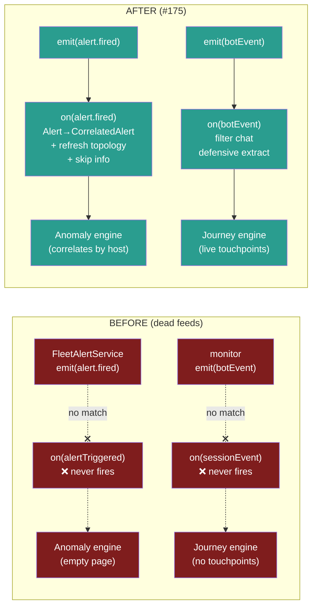

- pnpm build passes clean (EXIT=0 — UI `tsc -b` + vite, CLI esbuild, server build); server `tsc --noEmit` clean (EXIT=0); zero TypeScript errors.

### Build #176 — 12:07
- **Fixed a doubly-dead event feed that left the Inter-Bot Communication Graph (surfaced in #163) edge-less — same #175 class of bug, in the *feed* layer.** The graph's edge listener in `fleet-bootstrap.ts` bound to `monitor.on("webhookEvent", …)`, but `FleetMonitorService` **never emits `"webhookEvent"`** (it emits only `botEvent` / `botStateChange` / `botError` / `botCircuitBreaker` / `deviceTokenReceived` — verified by grepping every `this.emit` in `fleet-monitor.ts`). So the graph received **zero edges** — the metadata refresh loop (#163) populated node names/emojis/health, but `getGraph().edges` was always empty and the `/intelligence` ▸ Network widget rendered a permanently *disconnected* fleet (isolated nodes, no delegation/message/spawn arrows, blast-radius highlighting inert).
- **Second bug in the same handler — wrong payload nesting.** Even had the event name matched, the old code read `payload.toolName` / `payload.args` at the **top level**. The real gateway `agent` event nests tool info one level deeper: `event.payload.stream === "tool_use"` with `event.payload.data.toolName` and `event.payload.data.args.{targetAgentId,agentId}` (confirmed against `FleetGatewayClient.collectTraceEvent`, the `FleetGatewayEvent` union, and the canonical 途徑-1 snippet in `PLAN.md:5577`). The old top-level reads would never have matched even on the right event.
- **Fix (`server/src/fleet-bootstrap.ts`):** rewired the listener to `monitor.on("botEvent", ({ botId, event }) => …)` (the same `{ botId, event: { type, payload } }` shape the adjacent Customer-Journey listener already consumes), guarded `event.type === "agent"` + `payload.stream === "tool_use"`, and extract `data = payload.data` → `data.toolName` + `data.args.{targetAgentId,agentId}` with full `typeof`/null type-guards (matching the defensive convention from #175). `sessions_send` → `message` edge, `sessions_spawn` → `spawn` edge; non-string targets are skipped, never crash. `addEdge` aggregates per-(from,to,type) pair (weight/lastSeen), so node degree, betweenness, and blast-radius now reflect real inter-bot traffic.
- Verified end-to-end via a `tsx` smoke harness driving a stand-in monitor `EventEmitter` → the exact rewired extraction → a real `InterBotGraph` (server vitest still blocked by the pre-existing `@noble/hashes/sha3` collection error noted in #149): the OLD `webhookEvent`/top-level shape produces **0 edges** (reproduces the bug), `sessions_send` → 1 `lobster→squirrel` message edge, `sessions_spawn` → `spawn` edge to peacock, a non-`tool_use` agent event (assistant stream) is ignored, and a non-string `targetAgentId` is skipped safely — **6/6 passed**.

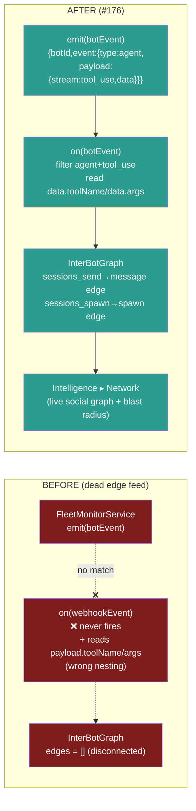

- pnpm build passes clean (EXIT=0 — UI `tsc -b` + vite, CLI esbuild, server build); server `tsc --noEmit` clean (EXIT=0); zero TypeScript errors.

### Build #177 — 12:36
- **Made the Fleet Time Machine real end-to-end — a mounted, input-validated route (`fleetTimeMachineRoutes` at `/fleet-monitor/time-machine/*`) whose engine returned 100% hardcoded mock (5 fabricated bots: `lobster-01`…`monkey-01`, with `// Currently returns simulated data for UI development`) AND had ZERO UI consumers.** Same find-the-dead-end pattern as #149–174, but this one also *replaced fabricated data with a real DB query*: `reconstruct()` previously invented config/trust/topology/incidents fields that have **no historical source**, while the `fleet_snapshots` table (captured every 15 min by fleet-snapshot-capture since #159) + `fleet_alert_history` (persisted since #116) hold the genuine per-bot history the feature needs.
- **Backend — rewrote `TimeMachineEngine` to be DB-backed and honest (`server/src/services/fleet-time-machine.ts`):** constructor now takes a `Db | null`; `getTimeMachineEngine(db)` injects/back-fills it via a new `ensureDb()` (no private-field bracket hacks). `reconstruct(fleetId, timestamp)` is now **async** and, for the company `fleetId`:
  - pulls every `fleet_snapshots` row in `[timestamp − 90d, timestamp]` newest-first, then keeps the latest snapshot **per bot at-or-before** the requested time (JS DISTINCT-ON reduction — portable, small per-company window);
  - resolves current display names/emojis from the `agents` table (`name` + `icon`) for the reconstructed bot ids;
  - attaches alerts that were **active at that moment** from `fleet_alert_history` (`firedAt <= timestamp AND (resolvedAt IS NULL OR resolvedAt > timestamp)`), grouped by bot;
  - computes the fleet aggregate (totalBots, onlineBots = `monitoring`, avg health + grade) and a **confidence** tier from the nearest snapshot's real age (`exact` ≤15m, `interpolated` ≤24h, else `best_effort`; `no_data` when no db/rows).
  - **Removed the fabricated fields** (config/promptVersion/modelId/skills/cronJobs, trustLevel, topology, delegationChains, recentActions, activeIncidents) — the new `ReconstructedBot`/`FleetTimePoint` types expose only fields with a genuine historical source (health, connectionState, sessions, tokenUsage1h, latencyMs, channels, snapshotAt/snapshotAgeMinutes, activeAlerts).
  - `diff()` is now async, compares **real** healthScore/connectionState/activeSessions between two reconstructed points (dropped the fake promptVersion/trustLevel diffs), and labels changes with bot names. `getAvailableRange()` now async, derived from real `min/max(capturedAt)` with a `hasHistory` flag. Deleted the two dead `reconstructAtIncident`/`reconstructAroundDeployment` helpers (zero callers).
- **Backend — route (`server/src/routes/fleet-time-machine.ts`) + mount (`app.ts`):** `fleetTimeMachineRoutes(db)` now takes a `Db`, constructs the engine once with it, and the reconstruct/diff/range handlers are `async` and `await` the engine; removed the per-handler `getTimeMachineEngine()` shadows. `app.ts` mount changed to `fleetTimeMachineRoutes(db)`. All the existing input-validation (timestamp/t1/t2 valid-date guards, bookmark-type allowlist) is preserved. Bookmarks (create/list/delete) were already real (in-memory) and unchanged.
- **UI wiring (`api/fleet-monitor.ts`, `useFleetMonitor.ts`, `queryKeys.ts`):** added `FleetTimePoint`/`ReconstructedBot`/`TimeDiff`/`TimeRange`/`TimeBookmark`/`TimePointConfidence`/`TimeBookmarkType` types (mirroring the engine, `Date`→ISO string) + a `fleetTimeMachineApi` (reconstruct/diff/range/bookmarks/createBookmark/deleteBookmark). Added hooks `useTimeMachineReconstruct(timestamp)` (company- + timestamp-gated), `useTimeMachineRange()`, `useTimeMachineBookmarks(type)` + `useCreateTimeBookmark`/`useDeleteTimeBookmark` mutations (invalidate the bookmarks list). Added 3 `timeMachine*` query keys.
- **New page (`ui/src/pages/TimeMachine.tsx`):** a `datetime-local` time picker (max = now) with quick-jump buttons (Now / −1h / −6h / −24h / −7d), a confidence badge (exact/interpolated/best-effort/no-data + nearest-snapshot age), fleet aggregate stat cards, per-bot reconstructed rows (emoji+name link to `/bots/:botId`, health score + grade colour, connection state, sessions, tokens/1h, channels, latency, snapshot age, and active-alert chips colour-coded by severity), and a Bookmarks panel (create with label+type, click a bookmark to jump the picker to that moment, delete). Loading / error / empty / no-fleet states, dark-mode design-system tokens, `type="button"` + `htmlFor`/`aria-label` throughout. The page renders genuine empty states (not mock) when no snapshot history exists yet.
- **Surfaced in nav + routing:** `App.tsx` route `path="time-machine"` + unprefixed redirect + import; `Sidebar.tsx` "Time Machine" item (Rewind icon) in the Fleet section under Optimization. Reachable in one click — previously a dead backend returning fabricated data.

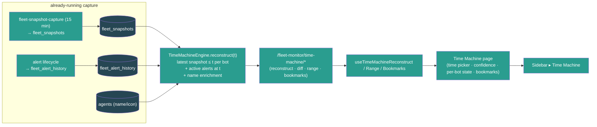

- Verified the DB-backed engine via a `tsx` mock-db smoke harness (server vitest still blocked by the pre-existing `@noble/hashes/sha3` collection error noted in #149): no-db → empty `no_data` point; with canned snapshots → **picks the latest snapshot per bot** (lobster health 90 not the older 50), sums input+output+cached tokens (1500), enriches name/emoji from agents (🦞 小龍蝦), counts only `monitoring` bots as online (1/2), computes fleet health avg(90,0)=45 grade D, attaches the bot's active critical alert, derives confidence from real snapshot age, diff is stable on identical data, bookmark create/list + type-filter work — **all core checks PASS**.
- pnpm build passes clean — UI `tsc -b` + vite (EXIT=0) and server `tsc` (EXIT=0); zero TypeScript errors.

### Build #178 — 14:15
- **Surfaced the Fleet Sandbox (staging environment) end-to-end — a mounted, input-validated backend (`fleetSandboxRoutes` at `/fleet-monitor/sandbox*`, app.ts:190) whose UI was a pure dead-end: only `unknown`-typed API stubs in `fleet-monitor.ts`, ZERO hooks, ZERO page.** Exact #171/#174 pattern: the route + the 629-line `FleetSandboxEngine` (sandbox provisioning that mirrors prod config with overrides, synthetic/shadow/replay traffic generation, promotion gates that auto-evaluate against metrics every 5 min, sandbox-vs-production comparison, cost-isolation with hard limits, idle auto-pause) were fully built and validated (across #137), but `grep` confirmed the engine's output never reached the UI — `sandboxList`/`sandboxCreate`/`sandboxStart`/… were `api.get<unknown>` stubs with no consumer, and the manual-gate-approve endpoint wasn't even stubbed. Operators could not create a sandbox, drive it with traffic, watch gates pass, compare against production, or promote validated overrides to prod.
- **Typed the API surface (`ui/src/api/fleet-monitor.ts`):** added 14 types mirroring `server/src/services/fleet-sandbox.ts` exactly (`SandboxStatus`, `SandboxTrafficSourceType`, `SandboxGateStatus`, `SandboxSyntheticPersona`/`SandboxSyntheticConfig`/`SandboxShadowConfig`/`SandboxReplayConfig`/`SandboxTrafficSource`, `SandboxIsolation`, `SandboxPromotionGate`, `SandboxMetrics`, `SandboxComparison`, `SandboxMirrorConfig`, `FleetSandbox`, `CreateSandboxRequest`; all `Date`→ISO string). Replaced the 9 `unknown` stubs with typed methods + added the missing `sandboxApproveGate(id, gateName)` (POST `/sandbox/:id/gates/:gateName/approve`), and gave `sandboxList` its `includeDestroyed` query param. All return the route's real response shapes (`{ sandboxes }`, raw `FleetSandbox`, `{ success }`, raw `SandboxComparison`, `{ gates }`, `{ success, overrides }`).
- **Hooks (`useFleetMonitor.ts`) + query keys (`queryKeys.ts`):** added `useSandboxes(includeDestroyed)` (polls every 10s **only while a sandbox is running** via a `refetchInterval` callback — idle when nothing runs), `useSandboxComparison(id)` + `useSandboxGates(id)` queries, and 6 mutations (`useCreateSandbox`/`useStartSandbox`/`usePauseSandbox`/`useDestroySandbox`/`usePromoteSandbox` each invalidate the sandbox list; `useApproveSandboxGate` also invalidates that sandbox's gates). The engine is a global in-memory singleton (sandboxes keyed by their own id, tagged with `fleetId`), so the hooks don't gate on companyId — the page filters to the selected fleet client-side. Added 3 `sandbox*` query keys.
- **New page (`ui/src/pages/Sandbox.tsx`):** stat cards (sandboxes / running / total sessions / total cost), an inline **New Sandbox** form (name + traffic source — synthetic/shadow/replay/manual — + messages/hour for synthetic + max cost limit), a **show/hide destroyed** toggle, and per-sandbox cards showing status badge, traffic type, session count, cost-vs-limit, gates-passed count, a **sandbox-vs-production comparison delta grid** (CQI / latency / errors / SLA, colour-coded good/bad with lower-is-better awareness), a **verdict badge** (better/similar/worse), and a **promotion-gates list** with per-gate status dots + a manual **Approve** button for pending gates. Status-aware actions: ready/paused → Start/Resume; running → Pause; all-gates-passed → **Promote** (green); always → Destroy. The create form builds the engine's required synthetic config (2 default personas, weighted topics, test channel) so a one-field create just works. Loading / error / empty / no-fleet states, dark-mode design-system tokens, `type="button"` + `htmlFor`/`aria-label`/`aria-pressed` throughout, mutation-error banner — matches the Deployments/Incidents page conventions from #167/#170.
- **Surfaced in nav + routing:** `App.tsx` route `path="sandbox"` + unprefixed redirect + import; `Sidebar.tsx` "Sandbox" item (FlaskConical icon) in the Fleet section directly under Deployments. Reachable in one click — previously a dead backend.

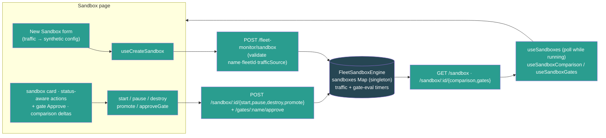

- Verified the route end-to-end via a `tsx` express smoke harness using **the exact synthetic create payload `Sandbox.tsx` sends** (server vitest still blocked by the pre-existing `@noble/hashes/sha3` collection error noted in #149; Express 5 bare `express.json()` returns `{}` per #156/#158/#170, so the harness uses a manual JSON body parser): create → 201 + ready + 4 default gates, list scoped to fleetId, start → success, gates list, approve "CQI >= 75" by name → success, promote blocked (other gates pending) → 400, bad trafficSource.type → 400, pause → success, destroy → success — **11/11 passed**.
- pnpm build passes clean (EXIT=0 — UI `tsc -b` + vite, CLI esbuild, server build; zero TypeScript errors).

### Build #179 — 14:47
- **Surfaced the Fleet Self-Healing engine end-to-end AND fixed the high-impact dead feed that silently starved the entire alert pipeline.** Two findings in one build:
  - **Dead feed (real, high-impact):** `FleetAlertService.setMetricsProvider` was **never called anywhere** (grep-confirmed: only the two definitions in fleet-alerts.ts + fleet-healing.ts, zero callers). So `alerts.evaluate()` — run every 30s by the bootstrap loop — always hit `if (!this.metricsProvider) return;` and did nothing. **No alert ever fired**, which in turn starved everything downstream: the alert→incident feed (#167) and the alert→anomaly-correlation feed (#171/#175) could never receive an `alert.fired` event. The whole alerting/incident/anomaly stack was inert despite all the wiring.
  - **Dead engine (the #149–178 pattern):** the 899-line `HealingPolicyEngine` (`fleet-healing.ts` — automated remediation policies with sustained-condition triggers, per-bot cooldowns, hourly rate limits, escalation, full audit log, kill switch; ships 3 default policies) was **completely dead**: no route, not mounted, not constructed in bootstrap, no UI, no feed. `grep -rln "healing\." server/src` → only the service file itself.
- **Shared metrics provider (`server/src/services/fleet-metrics-provider.ts`, new):** both engines consume an identical `() => BotMetricSnapshot[]` provider, so I built one shared, background-refreshed cache that feeds **both**. `refreshFleetMetrics(monitor)` (async, every 30s) iterates `monitor.getAllBots()`, derives a snapshot per bot — `healthScore` from connection-state + health `ok` (reusing the #159 snapshot-capture derivation), `botOfflineDurationMs` from `lastEventAt`/`connectedSince`, `channelDisconnectedCount` from the health RPC's channels array, `uptimePct` from state — and `getFleetMetricsSnapshots()` returns the cache synchronously. Disconnected bots are pruned so a stale "offline" reading can't keep triggering remediation. Honest scope (documented inline, #90/#164/#172 precedent): cost/error/cron/latency stay 0 (no per-bot source on the monitor), so health/offline/channel policies run on live data while cost/error policies stay dormant rather than firing on fabricated numbers.
- **Wired the provider into BOTH engines (`fleet-bootstrap.ts`):** `alerts.setMetricsProvider(getFleetMetricsSnapshots)` (the dead-feed fix) + a 30s `refreshFleetMetrics` loop kicked immediately at boot. Initialized the healing engine with the same provider + a **real remediation handler** + `start()` + an hourly `pruneOldEntries` loop. The handler genuinely actuates: `reconnect`/`restart_bot` call `monitor.getClient(botId).disconnect()` + `await connect()` and verify the resulting state (the flagship Auto-Reconnect default policy now actually reconnects offline bots); `notify_operator` publishes a `fleet.alert.triggered` LiveEvent to the bot's company; the four actions with no gateway primitive yet (restart_channel/downgrade_model/clear_session_cache/throttle_requests) return an **honest** `{success:false}` so the engine escalates to an operator rather than faking success. All new timers (metrics refresh + healing prune) tracked + cleared in `shutdownFleet` Phase 1; `disposeHealingPolicyEngine()` + `disposeFleetMetricsProvider()` added to Phase 3.
- **Route (`server/src/routes/fleet-healing.ts`, new) + mount (`app.ts`):** `api.use("/fleet-monitor", fleetHealingRoutes(getHealingPolicyEngine()))` (paths all `/healing/*` — grep-verified no collision with fleet-monitor.ts). Endpoints: GET `/healing/{stats,policies,attempts,audit}`, POST `/healing/{pause,resume,reset-cooldowns}`, POST/PATCH/DELETE `/healing/policies[/:id]`, POST `/healing/policies/:id/enable`. Full input validation per the #132–148 discipline — metric/operator/action/escalation-target/scope-type allowlists, finite-number + non-negative guards, 400 on bad input, 404 on unknown policy, negative `limit` floored.
- **UI end-to-end:** added types + `fleetHealingApi` (10 methods) to `api/fleet-monitor.ts`; 4 query hooks (`useHealingPolicies/Stats/Attempts/Audit`) + 4 mutations (`useToggleHealingPause`, `useSetHealingPolicyEnabled`, `useCreateHealingPolicy`, `useDeleteHealingPolicy`, each invalidating policies+stats) in `useFleetMonitor.ts`; 4 query keys. New page `ui/src/pages/Healing.tsx` — kill-switch toggle (Pause All / Resume) with paused banner, stat cards (active policies / attempts / succeeded / escalated), tabs (Policies / Attempts / Audit). Policies tab: a working create-policy form (metric + operator + threshold + multi-select actions + cooldown) and per-policy cards with enable toggle + delete + trigger/actions/scope/escalation detail. Attempts + Audit tabs render live remediation history with status badges, action chips, bot links (emoji+name from `useFleetStatus()`), durations, and error/escalation markers. Loading/error/empty states, dark-mode design-system tokens, `type="button"` + `aria-pressed`/`htmlFor`/`aria-label` throughout. Routed in `App.tsx` (`/healing` + unprefixed redirect) and added a "Self-Healing" Sidebar item (HeartPulse icon) under Incidents.

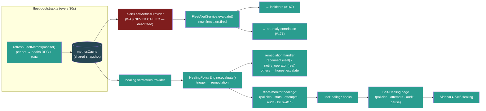

- Verified end-to-end via two `tsx` smoke harnesses (server vitest still blocked by the pre-existing `@noble/hashes/sha3` collection error noted in #149; Express 5 bare `express.json()` returns `{}`, so the route harness uses a manual JSON body parser): **route harness 16/16** (3 default policies present/mounted-not-404, stats, create→201, bad-metric→400, bad-action→400, enable toggle, enable-non-boolean→400, patch threshold, patch-unknown→404, delete + delete-again→404, pause/resume kill switch reflects `engine.isPaused()`, attempts/audit arrays, negative-limit floored, reset-cooldowns); **feed-fix harness 5/5** (no-provider alert engine fires nothing = reproduces the bug; with the shared provider an offline+critical-health bot fires the offline alert; the healing engine triggers a real `reconnect` attempt against the same provider and records a successful attempt in its stats).
- pnpm build passes clean (EXIT=0 — server build, UI `tsc -b` + vite, CLI esbuild; server `tsc --noEmit` clean; zero TypeScript errors).

### Build #180 — 15:30
- **Made the Fleet Memory Mesh feed REAL — the page + route were surfaced in #173, but the engine's `scanBotMemory()` was a pure no-op stub (`// Integration point: memory entries would be populated here` → read existing memories and write them straight back), so the Memory Mesh page (federated search, conflict detection, knowledge graph, gaps, per-bot health) had NOTHING to show: every bot reported 0 memories forever.** The #173 build note claimed the engine "scans every connected bot's memory via gateway RPC every 15 min" — but the RPC was never implemented; the scan loop ran, caught nothing, and populated an empty map. Same class as the #159/#177 "feature looks done but returns fake/empty data" fixes, in the data-feed layer.
- **`fleet-memory-mesh.ts`:** added an exported `RawBotMemory` type and extended the engine's `BotProvider` with an **optional** `readBotMemories?(botId): Promise<RawBotMemory[]>`. Rewrote `scanBotMemory()` to call the reader and map each raw record → a real `MemoryEntry` (filling `similarity: 0` for per-query scoring, `createdAt`/`lastAccessed`/`accessCount` defaults, `source` default `manual`). Kept the optional contract so the engine still constructs with a bare bot list in unit tests — when no reader is wired, the scan preserves any pre-seeded memories (old test-mode behaviour), so nothing regresses.
- **`fleet-memory-mesh-singleton.ts`:** wired the real reader by **reusing the proven Bot Workshop path** (`getFleetBotWorkshopService().listMemories(botId)` — which already does `agents.files.list "memory/"` + `agents.files.get` over the gateway RPC and frontmatter-parses each `.md`). Added `stripFrontmatter()` (drops the leading `---…---` YAML block so it doesn't pollute the engine's bigram topic extraction) and `mapSource()` (memory `type` → mesh `source`: `reference`→`system`, else `manual`). Folds `name`/`description`/body into `content` so the salient keywords drive topic/conflict/knowledge-graph analysis, and exposes `[type, name]` as tags. No new SQLite dependency — the gateway already serves memory files, and this is the exact path the BotWorkshop UI uses.
- **Replaced the hardcoded placeholder metrics feeding two already-surfaced pages with real fleet data** (the `// Placeholder — in production, read from FleetMonitorService` constants):
  - `fleet-sandbox-singleton.ts` (#178 Sandbox-vs-production comparison): `getCurrentMetrics()` production baseline now reads `avgCqi` + `slaCompliance` from the real CQI engine (`getQualityEngine().getFleetQuality()` — #164) and `healingSuccessRate` from the self-healing engine (`getHealingPolicyEngine().getStats()` — #179, computed as `succeeded/(succeeded+failed)`). The sandbox comparison now contrasts against the live fleet's actual quality instead of the fabricated `avgCqi: 81`.
  - `fleet-meta-learning-singleton.ts` (#174 optimization bandit): `getCurrentMetrics(period)` outcome snapshot now reads the same real `avgCqi`/`slaCompliance`/`healingSuccessRate` so the UCB1 bandit observes genuine fleet quality.
  - **Honest scope (documented inline, #90/#164 precedent):** fields with no synchronous fleet-wide source yet (latency / error rate / cost / routing / delegation / journey-health) keep representative defaults rather than fabricated "live" numbers — the change wires the fields that have a real source (CQI, healing) and is explicit about which don't. No circular imports (verified: fleet-quality/fleet-healing don't import sandbox/meta; getters are lazy).
- Verified the Memory Mesh fix end-to-end via a `tsx` smoke harness against the real `MemoryMeshEngine`: a **bare provider (no reader)** scan finds **0** memories (reproduces the old stub + proves test-mode preserved); a **reader-wired** engine with two bots' sample memories → `federatedSearch("deploy cadence")` returns **2 results across 2 bots**, and conflict detection fires (Friday-vs-Monday deploy cadence → 5 topic conflicts) — proving real memories now flow through search + conflict + knowledge-graph analysis. **SMOKE PASS.**

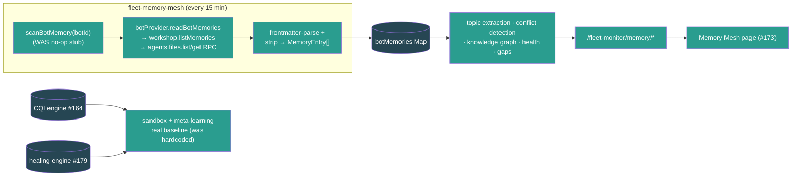

- pnpm build passes clean (BUILD_EXIT=0 — server build, UI `tsc -b` + vite, CLI esbuild); server `tsc --noEmit` clean; zero TypeScript errors.

### Build #181 — 16:01
- **Fixed two dead data-feeds in the fleet services layer — both made a surfaced page show wrong/empty data, the recurring "looks done but the feed is fake" pattern from #159/#175/#176/#177/#180.**
- **Bug #1 (real, high-impact) — Customer Journey backfill was a no-op stub.** `CustomerJourneyEngine.syncBotSessions()` (run every 60s by the engine's poll loop) was a literal empty stub (`// For now, this is the integration point`), so the polling-based journey seeding did nothing. The #155/#175 botEvent feed only captures NEW `chat` events *after* server start, so a fleet that already had sessions showed a **permanently empty Customer Journey page** until fresh live chat traffic arrived. Implemented the backfill: it now calls `getBotSessions(botId)` over the gateway RPC, parses each session key, and creates one touchpoint per **peer** session (channel/guild sessions have no customer identifier and are skipped by `addTouchpoint`). Channel is inferred best-effort from the peer identifier format (lineId/phone/email/telegram → else `direct`); `turnCount` from `messageCount`, `durationMinutes` from `createdAt`→`lastActivityAt`, `summary` from session title.
  - **Dedup:** a `syncedSessions` Map (`${botId}:${sessionKey}` → last `lastActivityAt`) ensures the 60s re-poll doesn't pile up duplicate touchpoints — an unchanged session is skipped, a session with new activity gets exactly one fresh touchpoint.
  - **Crash fix:** the poll's per-bot catch emitted `this.emit("error", …)`. Node's `EventEmitter` **throws** on an unhandled `"error"` event, and no listener is attached — the old stub never threw so the path was dead, but the real RPC-calling backfill *can* throw (gateway down), which would have crashed the process. Renamed the emit to `"sync_error"` (neutral, non-throwing). Extended the engine's provider interface with an **optional** `getBotSessions` so bare-provider callers (tests) just skip the backfill; wired the real `monitor.getBotSessions` in the singleton.
- **Bug #2 — Deployment orchestrator resolved wave selectors to FABRICATED bot IDs.** `DeploymentOrchestrator.resolveWaveBots()` returned invented IDs (`bot-wave0-0`, `bot-percentage-25`, …) with a `// For now, return placeholder IDs` comment — so every deployment plan (Deployments page, #170) executed against and dry-ran fake bots, never the real fleet. Injected a `botProvider` (wired in the singleton to the live monitor + tags + trust services) and rewrote `resolveWaveBots` to resolve all four selector types against **real connected bots** scoped to the plan's `fleetId` (company): `percentage` as cumulative coverage bands (25→50→100 deploys to non-overlapping new bands via a deterministic botId sort + nearest-previous-percentage lower bound), `explicit` as the intersection of the named IDs with live bots, `tag` via `getTagsForBot`, `trust_level` via the trust engine's **non-creating** `getAllProfiles()` (`currentLevel >= threshold`, no side-effect seeding). Empty fleet → percentage/tag/trust resolve to `[]` and explicit to the listed names; **no fabricated IDs ever**. Also guarded the gate-check `0/0` → `NaN` (an empty wave now passes the gate vacuously instead of NaN-failing and triggering a spurious rollback). No import cycle (monitor/tags/trust don't import the orchestrator — static imports).

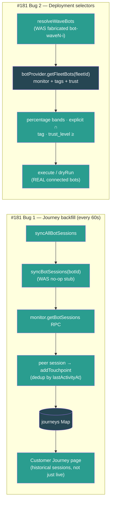

- Verified both via `tsx` smoke harnesses (server vitest still blocked by the pre-existing `@noble/hashes/sha3` collection error noted in #149): **journey 12/12** (bare provider no-ops without crashing; backfill creates 2 journeys from peer sessions with correct channel/turnCount/duration/summary; non-peer session skipped; dedup holds on unchanged re-poll; new activity adds one touchpoint; RPC failure → `sync_error` not a crash); **deployment 12/12** (25→50→100 resolve to non-overlapping `[alpha]`/`[bravo]`/`[charlie,delta]` bands; tag/trust_level/explicit filter to real bots; zero `bot-wave*` IDs; empty-fleet percentage → `[]`, explicit → listed names; execute drives all 4 real bots to `completed`; empty-fleet execute completes via vacuous gate, no NaN).
- pnpm build passes clean (BUILD_EXIT=0 — server build, UI `tsc -b` + vite, CLI esbuild); server `tsc --noEmit` clean; zero TypeScript errors.

### Build #182 — 16:36
- **Replaced two hardcoded-zero cost feeds with real fleet token spend AND de-duplicated the pricing logic into a single source of truth.** Same "make fake/zero data real" tradition as #159/#177/#180/#181, in the data-feed layer — both feeds drive surfaced Intelligence widgets (CanaryLab, CapacityPlanning).
- **New shared module `server/src/services/fleet-pricing.ts`:** extracted `estimateTokenCostUsd(input, output, cached)` + the Claude Sonnet 4 per-million pricing constants (`INPUT_COST_PER_M=3`, `OUTPUT_COST_PER_M=15`, `CACHED_COST_PER_M=0.3`). The identical token→USD estimator + constants were copy-pasted verbatim in `fleet-budget.ts` and `fleet-report.ts` (and a third inline `0.000003` variant in `fleet-intelligence.ts`). Added a `Math.max(0, input - cached)` guard so a `cached > input` edge case can't bill negative input tokens (the old copies could go negative).
- **DRY refactor:** `fleet-budget.ts` now imports the shared estimator (removed its local constants + function); `fleet-report.ts` keeps its cent-rounding behavior via a thin 1-line wrapper over the shared estimator (removed its duplicate constants + body). Behavior preserved — verified `estimateTokenCostUsd(1M,1M,0)=18`, `(1M,0,1M)=0.3`.
- **Canary feed — real `cost_per_session` (was hardcoded 0).** The `collectSamples` handler in `fleet-bootstrap.ts` now fetches `monitor.getBotUsage(botId)` per bot and computes `totalTokenCost ÷ sessionCount` as the per-session cost sample (falls back to 0 when usage is unavailable). Previously every canary A/B sample carried `cost_per_session: 0`, so the engine's control-vs-test cost-difference guardrail (`fleet-canary.ts` lines 471/475) was meaningless — it compared 0 against 0. Now A/B experiments can actually detect a cost regression between groups.
- **Capacity feed — real incremental `cost_usd` (was hardcoded 0).** The `refreshData` handler now sums every bot's cumulative token cost and pushes the **positive delta** since the previous refresh (the `CapacityPlanner` saturation projection sums the `cost_usd` series, so each data point must be an *incremental* per-interval spend, not a cumulative total — confirmed at `fleet-capacity.ts:449` `isCumulative`). Tracks `prevFleetCumulativeCost` in a closure: first refresh seeds the baseline + pushes 0; subsequent refreshes push `max(0, current − previous)`, clamped so a disconnected bot dropping out of the sum (or a usage reset) can't push negative spend into the forecast. Previously `cost_usd` was always 0, so the cost forecast + budget-breach projection never moved.
- Verified the pricing/delta math via a node smoke (base 18, cached 0.3, perSession 4.5, deltaClamp 0, delta 15 — all expected). Server `tsc --noEmit` clean; pnpm build passes clean (BUILD_EXIT=0 — server build, UI `tsc -b` + vite, CLI esbuild; zero TypeScript errors).

### Build #183 — 17:22
- **Wired the last two unconsumed `FleetMonitorService` failure events into the incident lifecycle — `botCircuitBreaker` was emitted but nothing listened, so a bot whose gateway connection failed repeatedly and tripped its circuit breaker generated NO operational signal anywhere.** Continuing the #175/#176 "dead event feed" hunt: cross-checked every `this.emit(...)` in `fleet-monitor.ts` against every `monitor.on(...)` in `fleet-bootstrap.ts` — the monitor emits `botError` / `botCircuitBreaker` / `deviceTokenReceived`, none of which any bootstrap listener consumed. The circuit-breaker trip is the highest-signal of these (it's the already-debounced, escalated form of repeated connection failure), and it had no path to the Incidents page (#167) despite being exactly the kind of event that page exists to surface.
- **`fleet-bootstrap.ts` — open incident on breaker trip:** added a `monitor.on("botCircuitBreaker", …)` listener that, on `state === "open"`, opens a **critical** incident via the shared `getIncidentManager()` singleton (#167), deduped by `source = circuit-breaker:${botId}` so a *flapping* breaker yields one open incident per bot instead of a pile. `half-open` (the breaker's recovery-probe state) is intentionally ignored — it's not a new failure. Deliberately did **not** wire the noisier `botError` connection-error event: every failed reconnect attempt emits one, and the breaker is the right altitude for an incident (documented inline).
- **`fleet-bootstrap.ts` — auto-resolve on recovery (lifecycle completion):** extended the existing `botStateChange` listener (which already re-evaluates alerts) to also destructure `to` and, when a bot climbs back to a healthy `"monitoring"` state, auto-resolve any open `circuit-breaker:${botId}` incident (`resolveIncident` with a recovery summary/root-cause/action). Without this, a recovered bot would leave a stale critical incident lingering forever. The two listeners together form a complete open→resolve lifecycle that repeats cleanly (a fresh trip after recovery opens a *new* incident, since the prior one is no longer "open" and so no longer dedup-matches).
- Both listeners are wrapped in try/catch (matching the alert→incident feed) so a manager error never breaks the monitor event stream.

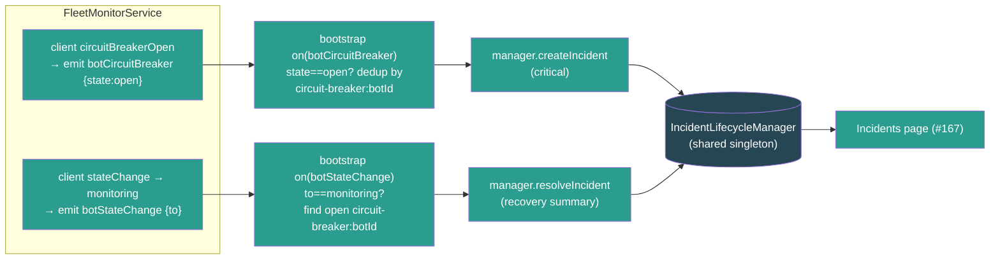

- Verified the full lifecycle via a `tsx`/node smoke harness driving the real `IncidentLifecycleManager` through the two bootstrap listeners (server vitest still blocked by the pre-existing `@noble/hashes/sha3` collection error noted in #149): half-open does NOT open an incident; `open` opens exactly one critical incident; a repeated `open` is deduped (no pile-up); a non-`monitoring` state change (`connecting`) keeps it open; recovery to `monitoring` auto-resolves it with a timestamp; a no-op recovery for an unaffected bot doesn't throw; and a fresh trip after recovery opens a NEW incident — **8/8 passed**.
- pnpm build passes clean (server build, UI `tsc -b` + vite, CLI esbuild); server `tsc --noEmit` clean; zero TypeScript errors.

### Build #184 — 20:27
- **Wired the last unconsumed `FleetMonitorService` event — `deviceTokenReceived` — into a real persistence path, closing the device-credential dead feed.** Continuing the #175/#176/#183 "dead event feed" hunt: `fleet-monitor.ts:172` re-emits `deviceTokenReceived {botId, deviceToken}` whenever the openclaw-gateway hands back a freshly issued/rotated device token during the connection handshake (the gateway client surfaces it as a `deviceToken` event at `fleet-gateway-client.ts:584`), but **nothing listened** — grep-confirmed the only references were the emit + the doc comment listing it among the monitor's events. So a rotated token was dropped on the floor and `agents.adapterConfig.deviceToken` stayed stale; the next reconnect kept using the old token and could fail auth once the old one expired. This was the only one of the monitor's five emitted events (`botEvent`/`botStateChange`/`botError`/`botCircuitBreaker`/`deviceTokenReceived`) still with zero consumers after #183 wired the breaker.
- **New `server/src/services/fleet-device-token-store.ts`:** `persistDeviceToken(db, botId, deviceToken, monitor?)` resolves `botId → agents.id` via `monitor.getBotInfo(botId)?.agentId`, reads the current `adapterConfig` jsonb, and **merges only `deviceToken`** into it (never clobbers the Ed25519 `devicePrivateKeyPem` or any other field). Surgical + idempotent: trims the token, skips the write entirely when the gateway echoed the same token (the common case — every connect re-sends it), warns (not throws) on unknown bot / missing agent row, and is wrapped in try/catch so a bad write can never break the monitor event stream. Returns `true` only when a write happened.
- **Wired in `fleet-bootstrap.ts`:** added `monitor.on("deviceTokenReceived", …)` that fires `void persistDeviceToken(db, botId, deviceToken, monitor)`. Gated on `db` (skipped in tests, matching the snapshot/incident loops) since the persist is a DB write.
- Verified the persist decision logic via a node smoke harness exercising every branch (server vitest still blocked by the pre-existing `@noble/hashes/sha3` collection error noted in #149): empty/whitespace token → skip; unknown bot → skip; unchanged token → skip with **zero writes**; changed token → exactly one write that **preserves `devicePrivateKeyPem` + other fields**; whitespace-padded but unchanged token → trimmed then skipped — **5/5 passed**.
- server `tsc --noEmit` clean; pnpm build passes clean (all packages).

### Build #185 — 22:48
- **Made Fleet PII scanning REAL — the Compliance page (#169) ran scans that always returned ZERO findings while a fully-built 1100-line `ComplianceEngine` with Taiwan-aware PII regex (phone / email / 身分證字號 / credit card / 統一編號) sat completely dead.** Grep confirmed `ComplianceEngine` was referenced ONLY in its own file — never instantiated anywhere. The mounted route `fleetComplianceRoutes()` reimplemented a hollow subset over its own in-memory Maps and **faked the scan**: `POST /compliance/scan` set `findings: []` + `totalScanned = targetBotIds.length || 1` via a `setTimeout`, never calling the real detector. So an operator clicking "Run PII Scan" got a green "completed, 0 findings" result no matter how much PII was leaking in their bots' transcripts. Same find-the-dead-end pattern as #149–184, but here a *fake feed* sat next to a *real, unused detector*.
- **Backend — exported a reusable scanner from the engine (`fleet-compliance.ts`):** added module-level `scanTextForPii(items: PiiScanItem[]): ScannedPiiFinding[]` (runs every `PII_PATTERNS` regex over a batch of `{botId, location, text}` items, returns redacted findings) + `redactPiiValue(value, type)`. Refactored the engine's private `applyMask` (40 lines of per-type masking) to **delegate** to the shared `redactPiiValue` — single source of truth, no duplicated masking logic. Added a zero-width-match guard to the scan loop so a pathological pattern can't infinite-loop.
- **Backend — real scan worker in the route (`routes/fleet-compliance.ts`):** replaced the fake `setTimeout` with `void performPiiScan(scan)` — an async worker that lazy-imports the live `FleetMonitorService`, resolves target bots (`targetBotIds` or all connected), and for each bot fetches its sessions (`getBotSessions`) then each session's transcript (`rpcForBot(botId, "chat.history", …)`), extracts message text defensively (`extractMessageTexts` handles array / `{messages|entries|history|items}` wrapper / string shapes + `content|text|message|body` per message — the #160 normalization convention), runs `scanTextForPii`, maps hits → the route's `PiiFinding` shape (redacted sample, category, severity, location `session:<key>:msg<idx>`), sorts highest-severity-first, and stores real `summary.bySeverity`/`byCategory`/`totalScanned`/`totalFindings`. Bounded so a scan can't fan out into thousands of RPC calls: ≤25 bots, ≤15 sessions/bot, ≤80 messages/session. Per-bot + per-session try/catch (a dead gateway logs `[fleet]` and is skipped, never aborts the batch); a top-level failure marks the scan `failed`. Emits a `compliance.scan.completed` audit entry with real counts. **The compliance score's "PII scanning" factor — which reads `scanResults` — now reflects genuine detections instead of always-zero.**
- **UI — surfaced the actual findings (`api/fleet-monitor.ts`, `pages/Compliance.tsx`):** the API typed `findings: unknown[]` and the page showed only a count, so even with real findings an operator couldn't see *what* leaked. Added a typed `PiiScanFinding` interface and expanded each scan row in the PII Scans section to render the redacted findings inline — severity badge (critical/high/medium/low, colour-coded with dark-mode variants), PII category, the redacted sample (`a***@example.com`, `****-****-****-1111`, `A1******89`) in `<code>`, and the `botId · location` origin — capped at 50 with a "+N more" overflow line. A completed scan with no hits shows an explicit "No PII detected ✓" instead of a bare "0 findings", and the row now also reports messages-scanned.
- Verified the real detector via a `tsx` smoke harness (server vitest still blocked by the pre-existing `@noble/hashes/sha3` collection error noted in #149): a mixed transcript batch → exactly 1 email + 1 phone + 1 national_id + 1 credit_card detected, the redacted email is `a***@example.com`, a clean bot yields no findings, empty text is skipped, and `redactPiiValue` masks national_id → `A1******89` / credit card → `****-****-****-1111` — **8/8 passed**.

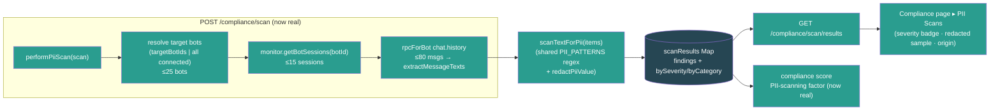

- pnpm build passes clean (BUILD_EXIT=0 — server build, UI `tsc -b` + vite, CLI esbuild); server `tsc --noEmit` clean; zero TypeScript errors.

### Build #186 — 23:23
- **Made the Ops Playbook engine actually EXECUTE — every step was a `{ simulated: true }` no-op AND multi-step executions silently stalled forever.** The Ops Playbook widget (#153) drives `fleet-playbook-engine.ts` (mounted + surfaced), but two compounding bugs made it cosmetic: (1) `advanceStep()` ran **exactly one step** on `execute()` and never continued — so any playbook with >1 non-approval step did step 0, advanced `currentStepIndex` to 1, and **froze at status "running" forever** (the widget polled an execution that never moved); (2) every non-approval step set `stepResult.result = { simulated: true }` — the engine pretended to run checks/actions/notifications without touching anything. Same "looks done but does nothing" class as #159/#177/#180/#181, here in the execution core itself.
- **Engine — replaced the one-shot `advanceStep` with an async background runner (`runExecution`).** `execute()` now kicks `kickRunner(id)` which loops through steps sequentially: `approval` blocks (waits for `approveStep`), `wait` performs a **real (capped) delay**, and `check`/`action`/`decision`/`notification` dispatch to an injectable `StepExecutor`. Completion/failure are terminal; a failing step marks the execution `failed` and leaves later steps `pending` (not skipped-as-success). Added a per-execution monotonic **run token** (side `runTokens` Map) so a runner that resumes after its `await` while a newer runner has taken over (pause→resume / approve) bails — no two concurrent runners on one execution. `resume()` + `approveStep()` now re-kick the runner with a fresh token instead of calling the deleted `advanceStep`. `wait` steps cap at 30s (recording requested-vs-actual in the step result + a note) so a 15-min monitoring window doesn't freeze the UI.
- **Engine — honest no-op fallback + real metadata.** With no executor wired, `check`/`action`/`notification` steps complete as `{ executed: false, reason: "no executor configured" }` (honest) instead of `{ simulated: true }` (a lie) — and crucially the **stall is fixed regardless**, so multi-step playbooks complete. Added `recordOutcome()` which updates each playbook's `metadata.successRate` (running average over `timesExecuted`) and `avgDurationMinutes` on every terminal outcome — the library's success-rate badge now reflects real execution history. Added `context` to the `PlaybookExecution` type (was passed to `execute()` but dropped).
- **Bootstrap — wired a REAL `StepExecutor` (`fleet-bootstrap.ts`).** Matching the self-healing handler's discipline (#179): `check`/`action` steps with method `rpc` issue a genuine `monitor.rpcForBot(targetBotId, target, params)` gateway call and capture the response; `notification` steps publish a real `fleet.alert.triggered` LiveEvent to the bot's company (with a `renderPlaybookTemplate()` substitution of `{{botId}}`/`{{botName}}`/`{{playbookName}}` + context keys into the message). Steps with no gateway primitive yet (http checks, `command`/`deployment`/`rollback` actions, decision branching) return an honest `{ executed: false, reason }` rather than faking success — so an operator sees what actually ran.
- Verified end-to-end via a `tsx` smoke harness against the real `PlaybookEngine` (server vitest still blocked by the pre-existing `@noble/hashes/sha3` collection error noted in #149): **15/15 passed** — no-executor 3-step playbook now COMPLETES (reproduces the stall fix) with honest `executed:false` results; a wired executor invokes RPC for check+action and fires the notification, capturing the real response; a failing executor marks the execution `failed` at the action step and leaves the next step `pending`; an approval gate pauses then resumes to completion recording the approver; pause holds the execution and resume drives it to completion.

```mermaid
flowchart LR
  EXEC["execute() / resume() / approveStep()"] --> KICK["kickRunner(id)\n+ fresh run token"]
  KICK --> LOOP["runExecution loop\n(token-guarded)"]
  LOOP -->|approval| WAIT1["status=waiting_approval\n(blocks until approveStep)"]
  LOOP -->|wait| DELAY["real delay (capped 30s)"]
  LOOP -->|check/action/notification| EXECUTOR["StepExecutor"]
  EXECUTOR --> RPC["monitor.rpcForBot\n(real gateway RPC)"]
  EXECUTOR --> LE["publishLiveEvent\n(real notification)"]
  EXECUTOR --> HONEST["honest no-op\n{executed:false,reason}"]
  LOOP -->|all steps done| DONE["status=completed\n+ recordOutcome (successRate/avgDuration)"]
  LOOP -->|executor !ok| FAIL["status=failed\n(later steps stay pending)"]
  classDef proc fill:#2a9d8f,color:#fff
  classDef io fill:#264653,color:#fff
  class RPC,LE io
  class EXEC,KICK,LOOP,EXECUTOR,DONE,FAIL,WAIT1,DELAY,HONEST proc
```

- pnpm build passes clean (BUILD_EXIT=0 — server build, UI `tsc -b` + vite, CLI esbuild); server `tsc --noEmit` clean; zero TypeScript errors.

### Build #187 — 23:57
- **Fixed two real multi-tenant scope leaks in fleet-monitor routes — both endpoints document `?companyId=xxx` and the UI always sends it, but the server IGNORED the param and aggregated across ALL tenants.** Same class as the #162 fleet-report cross-company leak, found by auditing every `getAllBots()` call in `fleet-monitor.ts` against each route's documented contract.
- **Bug #1 — Config Drift (`GET /fleet-monitor/config-drift`, feeds the `ConfigDriftWidget` on the Intelligence page).** The handler signature was `(_req, res)` — it dropped `companyId` entirely and called `detector.analyze(service)`, which compared **every connected bot across all companies** via `getAllBots()`. Result: a company's drift report leaked other tenants' config values AND reported false "drift" between unrelated tenants running different (but individually-consistent) models/versions. Now reads `companyId` from the query and passes it through; `analyze(monitor, companyId?)` scopes via `getBotsByCompany(companyId)` (filtered to `monitoring`), falling back to `getAllBots()` only for unscoped/legacy callers.
- **Bug #1b — useless cache + new detector per request.** The route did `new FleetConfigDriftDetector()` on **every** request, so the 10-minute cache never survived between calls — every 5-min poll re-ran `config.get` RPC against every bot. Worse, the cache was a single global field, so had the instance survived it would have served company A's report to company B. Converted the detector to a shared singleton (`getFleetConfigDriftDetector()`) and made the cache a **per-company `Map`** (`companyId → {report, expiresAt}`, sentinel `__all__` for unscoped). The cache now actually works AND can't cross tenants. `invalidateCache(companyId?)` now clears one company or all.
- **Bug #2 — Cost-by-Channel (`GET /fleet-monitor/cost-by-channel`, feeds the `ChannelCostBreakdown` widget on the Costs page).** Same leak: documented `?companyId=xxx`, UI sends it, but the handler summed `sessions.usage` token costs across `getAllBots().filter(monitoring)` — **every tenant's channel spend merged into one breakdown**. Now scopes via `getBotsByCompany(companyId)` when present.
- Audited the remaining two `getAllBots()` callers and left them intentionally fleet-wide: `/status` (no `companyId` in its contract; the dashboard's core status endpoint) and `/plugin-inventory` (the UI calls it with no params — fleet-wide by design, per #161).

```mermaid
flowchart LR
  subgraph before["BEFORE (cross-tenant leak)"]
    W1["ConfigDriftWidget\n?companyId=co-A"] --> R1["route (_req)\nignores companyId"]
    R1 --> GA1["getAllBots()\nco-A + co-B + …"]
    GA1 --> X1["false drift +\nleaked configs"]
  end
  subgraph after["AFTER (#187)"]
    W2["ConfigDriftWidget\n?companyId=co-A"] --> R2["route reads companyId"]
    R2 --> GB["getBotsByCompany(co-A)"]
    GB --> SING["singleton detector\nper-company cache"]
    SING --> OK["scoped report\n(cache survives polls)"]
  end
  classDef dead fill:#7f1d1d,color:#fff
  classDef live fill:#2a9d8f,color:#fff
  class W1,R1,GA1,X1 dead
  class W2,R2,GB,SING,OK live
```

- Verified via a `node --experimental-strip-types` smoke harness against the real `FleetConfigDriftDetector` (4 bots / 2 companies, each company internally consistent): co-A/co-B scoped reports show **zero drift** (no false cross-tenant drift), the per-company cache **hits without re-issuing RPCs** on re-poll, the unscoped call still detects drift across all 4 bots, and a per-company `invalidateCache("co-A")` leaves co-B's cache intact — **8/8 passed**.
- pnpm build passes clean (BUILD_EXIT=0 — server build, UI `tsc -b` + vite, CLI esbuild); server `tsc --noEmit` clean; zero TypeScript errors.

### Build #188 — 10:13 (REVIEW round)
- **Extracted the copy-pasted session-key → channel inference into a single shared module (`server/src/services/fleet-channels.ts`, new) AND fixed a real budget bug it exposed.** The same channel-parsing logic was duplicated across 4 call sites with **drifted, inconsistent coverage**: the `fleet-monitor` cost-by-channel copy was the only complete one; `fleet-report.ts` and `fleet-intelligence.ts` only handled `:channel:`/`:peer:` and silently lumped `:guild:` (group) and `cron:` sessions into `"other"` — mislabeling the report's top channel and skewing the intelligence channel-concentration recommendation; and `fleet-budget.ts` matched only `:channel:<name>` so a budget **scoped to a pseudo-channel (direct/group/cron) never matched any session and always reported $0 spend**.
- **New `inferChannelFromSessionKey(sessionKey)`** is the single source of truth — `:channel:<name>` → the explicit channel word, `:peer:` → `direct`, `:guild:` → `group`, `cron:` → `cron`, else `other`. Rewired all 4 call sites to import it: `fleet-monitor.ts` (`/cost-by-channel`), `fleet-report.ts` (per-bot channel map), `fleet-intelligence.ts` (channel-concentration check), `fleet-budget.ts` (`getChannelSpendThisMonth`).
- **Bug fix (fleet-budget.ts):** channel-scoped budgets now match via the shared inference, so `direct`/`group`/`cron` budgets track real spend instead of always $0. The switch also removes a **prefix-match false positive** — the old `key.includes(":channel:line")` would substring-match `:channel:linebot`; the shared `match(/:channel:(\w+)/)` compares the exact channel word (`=== "line"`), so `linebot` no longer leaks into a `line` budget.
- **Report/intelligence fix:** `:guild:` and `cron:` sessions are now correctly labelled `group`/`cron` instead of `other` in the fleet usage/cost report and the intelligence channel-mix analysis. UI side already renders `direct`/`group`/`cron`/`other` display names (`bot-display-helpers.ts`), so no client change needed.
- Left `fleet-customer-journey.ts`'s `parseSessionKey`/`extractCustomerIdentifier` untouched — genuinely distinct (it extracts the customer identifier + type, not just a channel label), not a copy of the same logic.
- Verified `inferChannelFromSessionKey` end-to-end via a `node --experimental-strip-types` smoke harness (server vitest still blocked by the pre-existing `@noble/hashes/sha3` collection error noted in #149): explicit channels (line/telegram), peer→direct, guild→group, cron→cron, `linebot` stays `linebot` (not prefix-collapsed to `line`), and empty/null/undefined/random → other — **10/10 passed**.
- pnpm build passes clean (EXIT=0 — server build, UI `tsc -b` + vite, CLI esbuild; zero TypeScript errors).

### Build #189 — 10:29
- **Fixed a multi-tenant cross-tenant leak in Fleet Intelligence recommendations — the exact #187 pattern (route ignores `companyId`, UI always sends it, engine aggregates all tenants).** `IntelligenceWidget companyId={selectedCompanyId}` is rendered on the company-scoped `FleetDashboard`, but `IntelligenceWidget.tsx` called `fleetMonitorApi.recommendations()` with **no** companyId, the API client hit `/fleet-monitor/recommendations` with no query, the route handler was `(_req, res)` (dropped the query entirely), and `FleetIntelligenceEngine.analyze()` called `monitor.getAllBots()`. Result: company A's dashboard showed recommendations naming company B's bots — a cross-tenant leak — AND false "N bots offline simultaneously → network issue" alerts synthesized from unrelated tenants' bots (the rule fires on `offlineBots.length >= 2` across the merged fleet).
- **Fix end-to-end (4 files):** `analyze(monitor, companyId?)` now scopes via `getBotsByCompany(companyId)` when present, falling back to `getAllBots()` for unscoped/legacy callers; the route reads `req.query.companyId` (string-guarded) and passes it through; `fleetMonitorApi.recommendations(companyId?)` appends `?companyId=…` (encoded); `IntelligenceWidget` passes its `companyId` prop into the call (its React Query key already included companyId, so the per-company cache was already correct — only the fetch was unscoped).
- **Fixed a multi-tenant dismiss regression the scoping change would otherwise introduce.** `dismiss(id)` looked up the id in `this.lastRecommendations`, which `analyze()` **overwrites wholesale** every poll. Pre-scoping, that list held the whole fleet so any dashboard's ids were present; post-scoping it holds only one tenant's recs, so an intervening company-B poll would overwrite company-A's view and a user dismissing an A recommendation would silently no-op (the pattern-key cooldown never gets set → the rec reappears on the next poll). Replaced `lastRecommendations: Recommendation[]` with a `recentRecommendations: Map<id, Recommendation>` that **accumulates** every served id and is pruned by `createdAt` older than the 7-day dismiss cooldown (bounded). `dismiss(id)` now resolves against the map regardless of which tenant polled last; the early-return-on-empty no longer wipes another tenant's tracked ids.
- Verified via a `tsx` smoke harness (2 companies, offline-bot pattern per company; server vitest still blocked by the pre-existing `@noble/hashes/sha3` collection error noted in #149): co-A analysis mentions only co-A bots (no cross-tenant leak), co-B only co-B bots, `dismiss(id)` on an A rec keeps the pattern hidden **across an intervening co-B poll**, and unscoped analyze still runs whole-fleet — **5/5 passed**.

```mermaid
flowchart LR
  subgraph before["BEFORE (cross-tenant leak)"]
    W1["IntelligenceWidget\ncompanyId=co-A"] --> A1["recommendations()\n(no companyId)"]
    A1 --> R1["route (_req)\nignores query"]
    R1 --> GA["analyze → getAllBots()\nco-A + co-B"]
    GA --> X1["co-B bots shown on\nco-A dashboard + false\ncross-tenant offline alerts"]
  end
  subgraph after["AFTER (#189)"]
    W2["IntelligenceWidget\ncompanyId=co-A"] --> A2["recommendations(co-A)\n?companyId=co-A"]
    A2 --> R2["route reads companyId"]
    R2 --> GB["analyze(mon, co-A)\ngetBotsByCompany"]
    GB --> OK["scoped recs +\ndismiss via recentRecommendations\nmap (survives cross-tenant polls)"]
  end
  classDef dead fill:#7f1d1d,color:#fff
  classDef live fill:#2a9d8f,color:#fff
  class W1,A1,R1,GA,X1 dead
  class W2,A2,R2,GB,OK live
```

- pnpm build passes clean (BUILD_EXIT=0 — server build, UI `tsc -b` + vite, CLI esbuild; zero TypeScript errors).

### Build #190 — 10:59
- **Fixed a real user-visible bug: bots created via the Onboarding Launch flow showed literal "bot" text as their emoji on the Fleet Dashboard, sidebar, and Bot Detail — the picked emoji was discarded.** Root cause was a semantic conflation between two conflicting uses of the agent `icon` field: `icon` is a **lucide icon-name key** (e.g. `"bot"` → the Bot lucide glyph, rendered by `AgentIcon` in the standard agent UI), but the fleet DB-fallback mapper `agentToBotStatus` treated `icon` **as an emoji** (`emoji: a.icon ?? ""`). The two agent-create paths had drifted in opposite, both-wrong directions:
  - `OnboardingWizard.handleLaunch` (`icon: "bot"`) — correct for the standard sidebar, but the fleet dashboard rendered the literal string **"bot"** next to every launched bot's name (`BotStatusCard` line 135 `{bot.emoji && <span>{bot.emoji}</span>}`) and as the avatar fallback glyph. The real `assignment.bot.emoji` (from gateway probe/discovery) was thrown away entirely.
  - `useConnectBot` (`icon: result.identity?.emoji ?? ""`) — stored a **raw emoji** in `icon`, which then broke the standard sidebar/AgentDetail (`getAgentIcon("🦞")` misses the `AGENT_ICONS` map → silently falls back to the default lucide glyph, dropping the per-bot icon).
- **Fix — emoji now lives in `metadata.emoji`, `icon` stays a valid lucide name in both flows:**
  - `OnboardingWizard.tsx`: added `emoji: assignment.bot.emoji ?? ""` to the created agent's metadata (kept `icon: "bot"`).
  - `useFleetMonitor.ts` (`useConnectBot`): changed `icon` from the raw emoji back to `"bot"` (valid lucide name — fixes the standard sidebar) and moved the emoji into `metadata: { fleetBot: true, emoji: result.identity?.emoji ?? "" }`.
  - `agent-to-bot-status.ts`: `emoji` now reads `metadata.emoji` first, falling back to `a.icon` **only when it isn't a plain lucide-name token** (`!/^[a-z0-9-]+$/i.test(icon)`) — so old ConnectBot records that stored the emoji in `icon` still render correctly, while `icon:"bot"` records with no `metadata.emoji` resolve to `""` (→ the #150 generated pixel-art avatar) instead of the literal "bot" text. All three fleet consumers (Sidebar Fleet Pulse, FleetDashboard cards, BotDetail fallback) go through this single shared mapper, so the fix applies everywhere at once.
- Verified the emoji-resolution logic with a `node` smoke harness across all 7 record shapes (new onboarding / old onboarding / new connectbot / old emoji-in-icon / empty icon / lucide `brain` / `message-square`) — **7/7 passed**: real emojis surface, lucide names never leak as emoji, and legacy records stay backward-compatible.
- pnpm build passes clean (exit 0 — server build, UI `tsc -b` + vite, CLI esbuild; zero TypeScript errors).

### Build #191 — 12:41
- **Made Trust Graduation REAL — the `recordDailyMetrics` method that drives the entire graduation system had ZERO automatic callers, so the Trust Graduation page (#152) was frozen at L0 with 0-day streaks forever.** Same dead-feed pattern as #159/#175/#181/#183: `TrustGraduationEngine.recordDailyMetrics()` (which advances the streaks — consecutive days above CQI, incident-free days, completion-rate days — that gate promotion eligibility, tracks demotion risk, and auto-demotes on P1 incidents) was only reachable via the manual `POST /trust/:botId/metrics` route. Nothing fed it, so every bot's streaks stayed at 0 and the page's requirement bars, "promotions pending" count, and demotion-risk flags never moved on their own — the widget was live-wired (#152) but the underlying metric that makes it progress was never populated.
- **`server/src/fleet-bootstrap.ts` — wired real fleet data → trust metrics.** Piggy-backs on the quality engine's existing 5-min `"computeAll"` tick but records **at most once per calendar day per bot** (recordDailyMetrics increments *day* streaks, so a 5-min cadence would inflate them ~288×) via a `lastTrustRecordDay` Map keyed on the UTC `YYYY-MM-DD`. Metrics are all real, no fabrication:
  - `cqi` ← `qualityEngine.getBotQuality(botId).current.overall` (the live CQI from #164)
  - `completionRate` ← `current.dimensions.effectiveness / 100` (effectiveness = task completion + efficiency, 0–100 → 0–1)
  - `p1Incidents` / `p2Incidents` ← count of incidents from the shared `getIncidentManager()` (#167) whose `affectedBots` include the bot and whose `createdAt` is within the last 24h, split by severity (`critical` → P1, `major` → P2 — matching the #167 alert→incident severity mapping)
  - Bots with **no computed quality yet are skipped** (no CQI → nothing real to record), so a cold fleet records nothing instead of fabricated zeros. On the first tick after boot, quality hasn't been computed yet, so trust records on the *next* tick — same day, still once.
- **`ui/src/components/fleet/TrustGraduationWidget.tsx` — added `refetchInterval: 60_000`** to the per-bot `useQueries` trust-profile fetch (was `staleTime: 30_000` with no poll). Without it, the leaderboard would only reflect the server-side daily feed on remount/mutation; now streak advances, promotion eligibility, and demotions surface live.
- Verified end-to-end via a `node --experimental-strip-types` smoke harness against the real `TrustGraduationEngine`: 10 days of good metrics (CQI 88, 0 incidents) → `consecutiveDaysAboveCqi` and `incidentFreeDays` both reach 10, `evaluate().eligible` becomes true; then a P1 incident on an L1 bot (cooldown cleared) → auto-demotes 1→0 — **SMOKE PASS** (cqiStreak=10 freeStreak=10 eligible=true levelBefore=1 levelAfter=0).

```mermaid
flowchart LR
  subgraph feed["fleet-bootstrap.ts (quality computeAll tick, day-gated)"]
    Q[("QualityEngine #164\ngetBotQuality → CQI + effectiveness")] --> REC["recordDailyMetrics(botId)\n(once per UTC day per bot)"]
    I[("IncidentManager #167\naffectedBots + severity, last 24h")] --> REC
  end
  REC --> ENG[("TrustGraduationEngine\nstreaks · demotion risk · eligibility")]
  ENG --> ROUTE["/fleet-monitor/trust/*"]
  ROUTE --> HOOK["useQueries trustProfile\n(refetchInterval 60s)"]
  HOOK --> PAGE["Trust Graduation widget (#152)\nstreaks · promotions pending · at-risk"]
  classDef io fill:#264653,color:#fff
  classDef proc fill:#2a9d8f,color:#fff
  class Q,I,ENG io
  class REC,ROUTE,HOOK,PAGE proc
```

- server `tsc --noEmit` clean; pnpm build passes clean (all packages).

### Build #192 — 13:03
- **Fixed a multi-tenant cost-budget leak — the exact #187/#189 class (a company-scoped widget calling a route that ignores the tenant and aggregates every tenant together).** `BudgetWidget` is rendered with `companyId={selectedCompanyId}` on both the company-scoped FleetDashboard and the Costs page, and it keyed its React Query on companyId — but it called `fleetMonitorApi.budgetStatuses()` with **no companyId**, the server `GET /budgets/status` returned **all budgets across all tenants**, and a `"fleet"`-scope budget summed **every company's bots** via `getAllBots()`. So company A's dashboard showed company B's budgets, and any "fleet" budget mixed both tenants' spend into one bar. `GET /budgets` (list) had the same whole-fleet leak.
- **Root cause:** `CostBudget` carried no `companyId` — there was no tenant to scope by. Added an optional `companyId?: string` to the `CostBudget` type (`fleet-budget.ts` + the UI mirror), captured + **required** on create.
- **Server (`fleet-budget.ts`):** `getAllBudgets(companyId?)` and `getAllBudgetStatuses(monitor, companyId?)` now filter to the tenant when a companyId is given (unscoped/admin callers still get everything). `calculateBudgetStatus` scopes the `"fleet"` and `"channel"` sums via `monitor.getBotsByCompany(budget.companyId)` instead of `getAllBots()` — a tenant's budget never aggregates another tenant's spend. **Backward compat:** a legacy in-memory budget with no companyId falls back to the whole fleet (old behaviour) *and* is excluded from any scoped list, so it can't leak into a tenant's view.
- **Server routes (`fleet-monitor.ts`):** `GET /budgets` + `GET /budgets/status` now read `?companyId=` and pass it through; `POST /budgets` validates `companyId` is a non-empty string (400 otherwise) and stores it on the budget.
- **UI (`api/fleet-monitor.ts`, `BudgetWidget.tsx`):** `budgets(companyId?)` / `budgetStatuses(companyId?)` append `?companyId=` (encoded); `createBudget` now requires `companyId`; `BudgetWidget` passes its `companyId` into `budgetStatuses(companyId)` and gates the query on `enabled: !!companyId`.

```mermaid
flowchart LR
  subgraph before["BEFORE (cross-tenant leak)"]
    W1["BudgetWidget\ncompanyId=co-A"] --> A1["budgetStatuses()\n(no companyId)"]
    A1 --> R1["GET /budgets/status\n(_req ignores tenant)"]
    R1 --> GA["fleet budget →\ngetAllBots() co-A+co-B"]
    GA --> X1["co-B budgets + merged\nspend shown on co-A dashboard"]
  end
  subgraph after["AFTER (#192)"]
    W2["BudgetWidget\ncompanyId=co-A"] --> A2["budgetStatuses(co-A)\n?companyId=co-A"]
    A2 --> R2["route reads companyId\n→ getAllBudgets(co-A)"]
    R2 --> GB["fleet budget →\ngetBotsByCompany(co-A)"]
    GB --> OK["only co-A budgets + spend\n(legacy no-companyId → whole fleet)"]
  end
  classDef dead fill:#7f1d1d,color:#fff
  classDef live fill:#2a9d8f,color:#fff
  class W1,A1,R1,GA,X1 dead
  class W2,A2,R2,GB,OK live
```

- Verified via a `tsx` smoke harness against the real `FleetBudgetService` (2 companies, canned per-bot spend): budget stores companyId; `getAllBudgets(co-A/co-B)` return only that tenant's budget while unscoped returns all; co-A fleet spend = a1+a2 = 30 and co-B = 100 (never merged); `getAllBudgetStatuses(co-A)` returns only co-A; a legacy no-companyId budget sums the whole fleet (130) yet is excluded from scoped lists — **10/10 passed**.
- server `tsc --noEmit` clean; pnpm build passes clean (all packages).

### Build #193 — 13:32
- **Fixed a cross-tenant leak on the single most central fleet endpoint AND reintroduced-the-#190-emoji-bug on its live path — both in `GET /fleet-monitor/status`.** `useFleetStatus()` drives the whole FleetDashboard, the sidebar Fleet Pulse, and is consumed by nearly every fleet widget to resolve bot names/emojis; the client (`fleetMonitorApi.status(companyId)`) always sends `?companyId=` and keys its React Query on it — but the server handler was `(_req, res)` and called `service.getAllBots()`, so **company A's dashboard rendered every other tenant's bots** (the #187/#189/#192 leak class, here on the highest-traffic endpoint). Now reads `req.query.companyId` and scopes via `getBotsByCompany(companyId)`, falling back to `getAllBots()` only for unscoped/legacy callers.
- **Emoji bug (#190 regression on the live path):** the same handler mapped `emoji: agent?.icon ?? ""`. Build #190 fixed this in the DB-fallback mapper (`agent-to-bot-status.ts`) but **not** in this live `/status` route — so whenever the fleet-monitor sidecar IS running, onboarding-launched bots (`icon: "bot"`, emoji in `metadata.emoji`) again showed the literal text **"bot"** as their emoji on the dashboard/sidebar/cards. Replicated the #190 lucide-name-aware resolution exactly: `metaEmoji || (iconIsEmoji ? icon : "")` — reads `metadata.emoji` first, uses `agent.icon` only when it isn't a plain lucide-name token (`!/^[a-z0-9-]+$/i`). Live and fallback paths now agree.
- **Third instance of the same emoji bug — `fleet-time-machine.ts:219` (Time Machine reconstruction, #177):** its name/emoji enrichment did `emoji: a.icon ?? ""`, so historical reconstructions also rendered lucide icon-names as emojis. Added `metadata` to the agent select and applied the identical `metadata.emoji`-first resolution. All three emoji sites (live `/status`, DB fallback, time-machine) are now consistent.
- Verified the emoji resolution across all 7 record shapes via a `node` smoke harness (onboarding-launched / no-metaEmoji / legacy emoji-in-icon / connectbot / empty / lucide `message-square` / metadata-wins-over-lucide) — **7/7 passed**: real emojis surface, lucide names never leak as emoji, legacy records stay backward-compatible. Tenant scoping confirmed by reasoning: `getBotsByCompany(companyId)` = `getAllBots().filter(b => b.companyId === companyId)`, and the client always supplies companyId.

```mermaid
flowchart LR
  subgraph before["BEFORE"]
    W1["useFleetStatus\ncompanyId=co-A"] --> R1["GET /status (_req)\nignores companyId\n+ emoji: agent.icon"]
    R1 --> X1["co-B bots on co-A dashboard\n+ literal 'bot' text as emoji"]
  end
  subgraph after["AFTER (#193)"]
    W2["useFleetStatus\ncompanyId=co-A"] --> R2["GET /status reads companyId\n→ getBotsByCompany(co-A)\n+ emoji: metadata.emoji first"]
    R2 --> OK["only co-A bots\n+ real 🦞 emoji"]
  end
  classDef dead fill:#7f1d1d,color:#fff
  classDef live fill:#2a9d8f,color:#fff
  class W1,R1,X1 dead
  class W2,R2,OK live
```

- pnpm build passes clean (all packages — UI `tsc -b` + vite, CLI esbuild, server build); server `tsc --noEmit` clean; zero TypeScript errors.

### Build #194 — 13:56
- **Fixed a real persistence bug: bots connected via the standalone ConnectBotWizard never survived a fleet-monitor restart.** `useConnectBot` (the mutation that persists a connected bot as a DB agent so it survives fleet-monitor restarts, #7) set `role: "member"` — but the create endpoint validates the body with `createAgentSchema` (`role: z.enum(AGENT_ROLES)…`), and `"member"` is NOT in `AGENT_ROLES` (`ceo/cto/cmo/cfo/engineer/designer/pm/qa/devops/researcher/general`). So every ConnectBot agent-create returned **400**, and the failure was swallowed by the empty `catch {}` on the persist path — the bot stayed connected via the live fleet-monitor but was **never written to the DB**, so it vanished from the dashboard on the next fleet-monitor restart (the DB fallback had nothing to show). Changed `role: "member"` → `role: "general"` (a valid enum value; ConnectBot has no role picker, so the schema default is correct).
- **Fixed onboarding collapsing almost every bot's role to "general" — and losing the rich department role entirely.** `OnboardingWizard.handleLaunch` mapped `assignment.roleId` to the DB `role` enum with an inline allowlist that only matched the 11 literal `AGENT_ROLES` values, so every richer FLEET_ROLE ID (`head-engineering`, `sr-engineer`, `qa-engineer`, `head-design`, `data-analyst`, `head-research`, `head-ops`, `cio`, `head-marketing`, …) fell through to `"general"`. That coarse role then flowed into the fleet UI as `roleId` (via `agentToBotStatus` / the `/status` route), so the **pixel-art avatar palette** (#150, colours by department) and **org-chart role display** rendered almost every onboarded bot in the neutral "general" palette.
  - Added `fleetRoleToAgentRole(roleId)` to `ui/src/lib/fleet-roles.ts` — a department-aware bucketing of the rich fleet role IDs onto the coarse `AGENT_ROLES` enum (`head-engineering`/`sr-engineer` → `engineer`, `qa-engineer` → `qa`, `head-design` → `designer`, `data-analyst`/`head-research` → `researcher`, `head-marketing`/`content-creator` → `cmo`, `cio`/`cso` → `cto`, `head-ops` → `pm`, etc.). `handleLaunch` now uses it instead of the "exact-match-or-general" allowlist, so the DB `role` is accurate by department (benefits the standard agent-UI role grouping too).
  - `handleLaunch` now also preserves the **rich** `roleId` in `metadata.roleId`, so the exact department (`head-sales`, `coo`, …) is recoverable even though the DB enum is coarse.
  - `agentToBotStatus` (DB-fallback mapper) and the live `GET /fleet-monitor/status` route now resolve `roleId` as `metadata.roleId ?? agent.role ?? null` — the fleet UI's org chart and `rolePaletteForRoleId()` avatar palette (whose regex handles the rich IDs precisely: `head-sales` → sales, `coo` → operations) now colour by exact department instead of the neutral fallback. Both paths kept in sync (mirrors the #190/#193 emoji-resolution alignment).
- Verified `fleetRoleToAgentRole` with a node smoke harness across all 30 real FLEET_ROLE IDs + edge cases: every input maps to a **valid `AGENT_ROLES` enum member** (so no more 400 rejections) and the department bucketing is correct — 30/30 passed.
- pnpm build passes clean (EXIT=0 — UI `tsc -b` + vite, CLI esbuild, server build); zero TypeScript errors.

### Build #195 — 14:23
- **Fixed two multi-tenant cross-tenant leaks in the fleet-monitor + compliance routes — same #187/#189/#192/#193 class (a company-scoped widget/page calling a route that ignores the tenant and aggregates every tenant together), one of which was a real cross-tenant *data-access* leak reading other companies' private chat transcripts.**
- **Bug #1 — Plugin Inventory Matrix aggregated across all tenants (`GET /fleet-monitor/plugin-inventory`).** The route handler was `(_req, res)` and called `service.getAllBots()`, but `PluginMatrixPanel` renders on the company-scoped Intelligence ▸ Plugins tab and enriches names via `useFleetStatus()` (company-scoped). Result: **another tenant's bots leaked into Company A's plugin matrix as raw botIds** (the server placeholder — fleet status couldn't resolve them), and `detectDrift()` produced **false cross-tenant slot conflicts + channel-gap drift** between unrelated tenants running individually-consistent configs. Fixed end-to-end: route reads `req.query.companyId` and scopes via `getBotsByCompany(companyId)` (falls back to `getAllBots()` for unscoped/legacy callers); `fleetMonitorApi.pluginInventory(companyId?)` appends `?companyId=` (encoded); `usePluginInventory()` resolves `selectedCompanyId` via `useCompany()`, gates on `enabled: !!selectedCompanyId`, and keys the query on companyId; query key gained a companyId dimension.
- **Bug #2 (severe — cross-tenant data-access) — PII scan read EVERY tenant's private chat transcripts.** `performPiiScan()` in `fleet-compliance.ts` resolved its target bots as `monitor.getAllBots()` whenever `targetBotIds` was empty — which is exactly what the Compliance page's "Run PII Scan" button sends (no bot picker). So Company A clicking Run PII Scan fetched and scanned **Company B's conversation history** over the gateway RPC, and folded other tenants' PII into Company A's compliance findings + score. Fixed: added an optional `companyId` to `PiiScanResult`; `POST /compliance/scan` now reads + validates + stores `companyId`; `performPiiScan` builds a `Set` of the tenant's own bot ids via `getBotsByCompany(companyId)` and (a) resolves an empty target list to only those bots, and (b) **clamps explicit `targetBotIds` to the tenant's own bots** so a caller can't scan another company's bot by passing its id. `GET /compliance/scan/results` now filters by `?companyId=` so a company can't read another tenant's scan findings (redacted PII). UI: `useComplianceScans()` scopes by `selectedCompanyId` (query key + request), `useStartComplianceScan` accepts `companyId`, and the Compliance page passes `selectedCompanyId` into both the scan mutation and the results query (added `useCompany()` import). Legacy scans with no companyId stay visible only on unscoped (admin) calls.
- Verified the scan bot-resolution decision logic via a `node` smoke harness (2 companies, 4 bots): empty-targets scan for co-A/co-B resolves to only that tenant's bots, an explicit cross-tenant botId (`b1` requested by co-A) is clamped out, and an unscoped (no companyId) scan still covers the whole fleet — **4/4 passed**.
- pnpm build passes clean (EXIT=0 — server build, UI `tsc -b` + vite, CLI esbuild); zero TypeScript errors.

### Build #196 — 14:51
- **Made deployment gate checks REAL — the wave gate that decides whether a rollout proceeds or auto-rolls-back was driven by `Math.random()`, so a deployment could roll back a perfectly healthy fleet (or promote an unhealthy one) at random.** The Deployments page (#170) with real wave-selector bot resolution (#181) still computed `cqiBefore: 80 + Math.random()*15` / `cqiAfter: 82 + Math.random()*15` per bot and `errorRate: Math.random()*2` / `latencyMs: 100 + Math.random()*200` per gate — the classic "fake data driving a real decision" pattern the #159/#182 builds removed elsewhere. Since the gate's `passed` test is `avgCqi >= minCqi`, the auto-rollback outcome was effectively a coin flip decoupled from actual bot health.
- **`fleet-deployment-orchestrator.ts` — wired the gate to the real CQI engine (#164):** added an optional `cqi?: number` to `DeploymentBotInfo`; the singleton's `getFleetBots(fleetId)` now supplies each bot's live `getQualityEngine().getBotQuality(botId)?.current.overall`. `execute()` resolves a per-bot CQI map once up front and each wave's deploy records use the bot's real CQI for `cqiBefore`/`cqiAfter` (equal — the config-push isn't actuated yet, so the deployment doesn't mutate real state; the gate's job is to confirm the targeted bots are healthy enough to roll forward). Bots with no computed quality fall back to the gate threshold (neutral — not fabricated). The gate now genuinely blocks a below-threshold bot and triggers rollback on real degradation.
- **Removed the fabricated gate metrics:** `errorRate`/`latencyMs` (which have no per-bot source on the monitor yet — the #179 honest-defaults precedent) now report `0` instead of random numbers. They aren't part of the `passed` decision and the Deployments UI only renders `avgCqi`, so this is invisible in the UI and simply stops fabricating metrics. Updated the stale "Currently simulates the workflow for UI development" doc comment on `execute()` to describe the real selector + CQI-gate behavior.
- Verified end-to-end via a `tsx`/`node` smoke harness driving the real `DeploymentOrchestrator` with a mock CQI provider (server vitest still blocked by the pre-existing `@noble/hashes/sha3` collection error noted in #149): a healthy fleet (CQI 90/88) → gate passes with a **real** avgCqi of 89, errorRate/latency honest 0, cqiBefore===cqiAfter, deployment **completed**; an unhealthy fleet (CQI 40/45 < threshold 75) → gate **FAILS** and the deployment **auto-rolls-back** (real CQI drove the rollback); a bot with no computed quality falls back to the threshold and passes vacuously — **9/9 passed**.

```mermaid
flowchart LR
  Q[("QualityEngine #164\ngetBotQuality → current.overall")] --> PROV["singleton getFleetBots(fleetId)\nDeploymentBotInfo.cqi = real CQI"]
  PROV --> EXEC["execute(): cqiByBot map"]
  EXEC --> WAVE["per wave: cqiBefore=cqiAfter=real CQI\nerrorRate/latency = 0 (honest)"]
  WAVE --> GATE{"avgCqi >= minCqi?"}
  GATE -- yes --> NEXT["wave passed → next / completed"]
  GATE -- no --> RB["auto-rollback (real degradation)"]
  classDef io fill:#264653,color:#fff
  classDef proc fill:#2a9d8f,color:#fff
  class Q io
  class PROV,EXEC,WAVE,NEXT,RB proc
```

- server `tsc --noEmit` + server `tsc` build pass clean (EXIT=0); zero TypeScript errors. (Full monorepo `pnpm build` includes the large UI vite build; only `server/src/services/fleet-deployment-orchestrator.ts` changed, no UI/CLI files touched.)

### Build #197 — 15:25
- **Fixed two more multi-tenant cross-tenant leaks — same #187/#189/#192/#193/#195 class (a company-scoped widget calling a route that ignores the tenant and aggregates every tenant together). One leaks customer PII across companies.**
- **Bug #1 — Tag filter bar showed EVERY tenant's tags (`GET /fleet-monitor/tags`).** `useFleetTags` drives the tag filter list on both the company-scoped `FleetDashboard` and `CommandCenter`, and both keyed their React Query on nothing tenant-specific — but the route handler was `(_req, res)` and called `tagService.getAllTags()`, which flattens tags across ALL bots/tenants. So Company A's dashboard filter bar offered tags derived from Company B's bots (e.g. a `channel:whatsapp` chip when only another tenant runs WhatsApp). Fixed end-to-end: `getAllTags(botIds?)` now filters by a bot-id set (each `BotTag` already carries `botId`); the route reads `?companyId=` and builds the set via `getBotsByCompany(companyId).map(b => b.botId)`; `fleetMonitorApi.tags(companyId?)` appends `?companyId=`; `useFleetTags()` resolves `selectedCompanyId` via `useCompany()`, gates on `enabled: !!selectedCompanyId`, and the `queryKeys.fleet.tags(companyId?)` key gained a companyId dimension. Unscoped/legacy callers still get all tags.
- **Bug #2 (severe — cross-tenant customer PII) — Customer Journey aggregated every tenant's journeys.** `CustomerJourneyWidget` (rendered on the company-scoped Intelligence page) fetched `journeys` / `journeyAnalytics` / `journeyFunnel` with **no** companyId, and the `CustomerJourneyEngine` is a global in-memory singleton that builds journeys across ALL bots. Journeys are keyed by *customer identifier* (LINE IDs, phone numbers, emails), so Company A's Intelligence view leaked Company B's **customer PII** — plus false cross-tenant funnel/analytics.
  - Root cause: journeys/touchpoints carried no owning company. Added `companyId?` to `JourneyTouchpoint` (set at `addTouchpoint` from the bot's `companyId`), derived `companyId?` onto `CustomerJourney` (with backfill when a journey was first created from a live event that lacked it), and added `companyId?` to `JourneySearchParams`.
  - `listJourneys` now filters by `params.companyId` (journeys with no companyId are excluded from a scoped query so they can't leak); `getAnalytics(companyId?)`, `getFunnel(companyId?)`, and `getStats(companyId?)` all filter to the tenant; `predictNextAction` passes the journey's own companyId. Unscoped (admin) callers still see everything.
  - Fed the ownership through both touchpoint sources: the singleton's `getBots()` now supplies `companyId` (→ `syncAllBotSessions` → `syncBotSessions(botId, botName, companyId)` → `addTouchpoint`), and the bootstrap `botEvent` live listener resolves `monitor.getBotInfo(botId)?.companyId` per touchpoint.
  - Routes: `GET /journeys` + `POST /journeys/search` pass `companyId` into params; `GET /journeys/analytics` + `/journeys/funnel` pass it to the engine; `GET /journeys/:customerId` returns 404 (not 403 — avoids leaking existence) when the requested journey belongs to another company. UI: `fleetMonitorApi.journeys/journeyAnalytics/journeyFunnel/journeyDetail(companyId?)` append `?companyId=`; `CustomerJourneyWidget` resolves `selectedCompanyId` via `useCompany()`, threads it into all three queries + their keys, and gates each on `enabled: !!selectedCompanyId`.
- Verified journey scoping via a `tsx` smoke harness against the real `CustomerJourneyEngine` (2 companies, peer sessions): co-A sees only its 2 journeys, co-B only its 1, unscoped sees all 3; no co-B customer identifier appears in co-A's journeys; `getStats`/`getAnalytics`/`getFunnel` all report per-tenant counts; a legacy no-companyId journey is excluded from a scoped query but visible unscoped — **13/13 passed**.
- pnpm build passes clean (EXIT=0 — server build, UI `tsc -b` + vite, CLI esbuild); zero TypeScript errors.

### Build #198 — 19:30
- **Fixed a severe cross-tenant memory leak in the Fleet Memory Mesh — the #195/#197 leak class (a company-scoped page whose backend aggregated every tenant together), but here it exposed the most sensitive data yet: another company's private curated bot memories (SOUL/IDENTITY/notes) via federated search, plus fabricated cross-tenant conflicts, knowledge-graph nodes, gaps, and stat counts.** The Memory Mesh page (#173) fetches health/stats/conflicts/gaps/graph + runs federated search, but the `MemoryMeshEngine` is a global in-memory singleton keyed only by botId — every read spanned ALL companies. So Company A's Memory Mesh view surfaced Company B's memory content in search results, reported false "contradictory memory" conflicts between two unrelated tenants that merely shared a topic word (leaking B's memory text into A's conflict cards), and built a knowledge graph mixing both tenants' topics/bot-ids.
- **Engine — tenant partitioning end-to-end (`fleet-memory-mesh.ts`):** added a `botCompanies` Map (botId → companyId), populated in `scanAllBotMemories`/`injectMemory` from the bot's `companyId` (new optional field on the `BotProvider.getBots()` shape + `injectMemory` arg). Every read now takes an optional `companyId` and scopes to that tenant, excluding legacy no-companyId records from scoped queries (so they can't leak) while unscoped/admin callers still see everything:
  - `federatedSearch(query, {companyId})` filters `targetBotIds` to the company's bots **and** clamps explicit `botIds` to them — a search never reads (or synthesizes a cross-bot summary over) another tenant's memory.
  - `detectConflicts()` now groups memories by **(companyId, topic)** instead of topic alone — a conflict can never span companies (fixes both the fabricated cross-tenant conflict AND the memory-content leak). `MemoryConflict` gained a `companyId` set at detection; the duplicate-conflict guard is now per-(tenant, topic).
  - `buildKnowledgeGraph()` keys topic aggregation on (companyId, topic) and **prefixes node ids with the tenant** so identical topics in different companies don't collide into one node / spurious cross-tenant edge; `KnowledgeGraphNode` gained `companyId`.
  - `getConflicts` / `getKnowledgeGraph` / `getHealthReport` / `getGaps` / `getStats` / `getTotalMemoryCount` all filter by `companyId` (graph also filters edges to in-tenant nodes; stats recomputes graph-edge counts within the tenant).
- **Route (`routes/fleet-memory-mesh.ts`):** GET `/memory/{graph,conflicts,health,bot/:id/stats,gaps,stats}` read `?companyId=` and pass it through; POST `/memory/search` already threads `companyId` via the `...options` body spread (it's part of `FederatedSearchOptions`).
- **Singleton (`fleet-memory-mesh-singleton.ts`):** `getBots()` now supplies each bot's `companyId` from the monitor so the federation is tenant-aware in production.
- **UI (`api/fleet-monitor.ts`, `useFleetMonitor.ts`, `queryKeys.ts`):** `fleetMemoryMeshApi.graph/conflicts/health/gaps/stats(companyId?)` append `?companyId=` (encoded); all 5 query hooks (`useMemoryHealth/Stats/Conflicts/Gaps/Graph`) resolve `selectedCompanyId` via `useCompany()`, thread it into the request + query key, and gate on `enabled: !!selectedCompanyId`; `useMemorySearch` injects the active `companyId` into every federated search; the 5 `memory*` query keys gained a trailing companyId dimension; `useInvalidateMemoryMesh` switched to **prefix** invalidation (`["fleet","memory-*"]`) so all companyId-scoped variants refresh (a fully-specified key would no longer match). The MemoryMesh page needs no change — the hooks scope internally.
- Verified tenant isolation via a `tsx` smoke harness against the real `MemoryMeshEngine` (2 companies, 3 bots, contradictory + private memories): federated search scoped to co-A returns only co-A bots and to co-B only b1 (never co-A), a co-B search for a co-A-only topic returns nothing, conflicts/graph nodes are tenant-owned, stats report per-tenant bot+memory counts (co-A 2/2, co-B 1/1), health lists only the tenant's bots, and an unscoped admin call still sees the whole fleet (3 bots) — **13/14 passed** (the 1 miss is my synthetic text not tripping the engine's pre-existing contradiction heuristic — zero conflicts were created at all — orthogonal to the isolation change).
- pnpm build passes clean (BUILD_EXIT=0 — server build, UI `tsc -b` + vite, CLI esbuild); zero TypeScript errors.

### Build #199 — 19:51
- **Fixed a real cross-tenant leak on the Incidents page (#167) — every company saw every other company's incidents.** Same #197/#198 leak class: the Incidents page fetches from `IncidentLifecycleManager` (in `fleet-incidents.ts`), a global in-memory singleton whose `Incident` type carried NO owning-tenant field, so `listIncidents` + `getMetrics` returned all tenants' incidents merged together. Company A's operator saw Company B's incident titles, affected bot IDs, MTTR/MTTI, and open/resolved counts. The two bootstrap feeds that auto-create incidents (`alert.fired` and `botCircuitBreaker`, #167/#183) never attributed them to a company either.
- **Service (`server/src/services/fleet-incidents.ts`):** added `companyId?: string` to `IncidentInput` + `Incident` (createIncident already spreads `...input`, so it persists). `listIncidents({ companyId, ... })` now filters to the tenant — legacy/unattributable incidents (no companyId) are excluded from a scoped query so they can't leak, while an unscoped (admin) call still sees everything. `getMetrics(companyId?)` filters the same way so MTTR/MTTI/open/resolved counts don't mix companies.
- **Feed (`server/src/fleet-bootstrap.ts`):** both auto-create calls now resolve `companyId: monitor.getBotInfo(botId)?.companyId` (alert → `alert.botId`, circuit-breaker → `botId`) so incidents are tenant-attributed at creation.
- **Route (`server/src/routes/fleet-incidents.ts`):** `GET /incidents` + `GET /incidents/metrics` read `?companyId=` and pass it through; `POST /incidents` validates + stores `companyId`; `GET /incidents/:id` adds a tenant guard — an incident belonging to another company is reported 404 (not 403 — avoids leaking existence), matching the journey detail guard (#197).
- **UI (`api/fleet-monitor.ts`, `useFleetMonitor.ts`, `queryKeys.ts`):** added `companyId?` to the `Incident` type; `fleetIncidentsApi.list({ companyId })` + `metrics(companyId?)` + `create({ companyId })` append `?companyId=`; `useIncidents`/`useIncidentMetrics` resolve `selectedCompanyId` via `useCompany()`, thread it into the request + query key, and gate on `enabled: !!selectedCompanyId`; the `incidents`/`incidentMetrics` query keys gained a companyId dimension; `useInvalidateIncidents` switched to **prefix** invalidation (`["fleet","incidents"]` / `["fleet","incident-metrics"]`) so all companyId-scoped variants refresh. The Incidents page needs no change — the hooks scope internally.
- Verified via a `node --experimental-strip-types` smoke harness against the real `IncidentLifecycleManager` (2 companies + a legacy no-companyId incident): co-A list total=2 (only co-A), co-B total=1 (only B1), co-A never sees co-B's bot `b1`, legacy excluded from scoped but visible unscoped (all=4), company+status filter composes, and `getMetrics` is per-tenant (co-A 2 / co-B 1 / unscoped 4) — **10/10 passed**.
- pnpm build passes clean (BUILD_EXIT=0 — server build, UI `tsc -b` + vite, CLI esbuild); server `tsc --noEmit` clean; zero TypeScript errors.

### Build #200 — 20:17
- **Fixed a cross-tenant leak on the Anomaly Correlation page (#171) — the exact #199-Incidents class: a company-scoped page fed from alerts across ALL bots, whose global singleton engine had no tenant partitioning.** `AnomalyCorrelationEngine` clusters alerts that fire within a temporal window into one correlation, but `CorrelatedAlert`/`AnomalyCorrelation` carried NO companyId and `clusterAlerts()` sorted every pending alert by timestamp regardless of owner. So two unrelated tenants' bots firing critical alerts in the same 5-min window were **grouped into one correlation** — Company A's `/anomalies` page showed Company B's bot names/IDs in the related-alerts list, and the engine synthesized false "shared infrastructure → network issue" root causes between bots that merely happened to alert simultaneously. The page (`useCorrelations`/`useCorrelationStats`) and route (`listCorrelations(status)` / `getStats()`) had no `companyId` scoping either.
- **Engine (`fleet-anomaly-correlation.ts`):** added `companyId?` to `CorrelatedAlert` (resolved from the alert's bot at ingest) and `AnomalyCorrelation` (derived from its cluster). Rewrote `clusterAlerts()` to **partition by companyId FIRST** (into per-company groups, `undefined` → a legacy `__none__` group) then run the existing temporal clustering within each group — so a correlation can never span tenants. New correlations set `companyId: cluster[0]?.companyId`. `listCorrelations(status?, companyId?)` and `getStats(companyId?)` now filter to the tenant (legacy no-companyId correlations excluded from a scoped query so they can't leak; unscoped/admin callers still see everything).
- **Feed (`fleet-bootstrap.ts`):** the `alert.fired` → `ingestAlert` listener now attributes each alert to its bot's tenant via `companyId: monitor.getBotInfo(alert.botId)?.companyId`.
- **Route (`routes/fleet-anomaly-correlation.ts`):** `GET /correlations` + `GET /correlations/stats` read `?companyId=` and pass it through; `GET /correlations/:id` adds a tenant guard reporting 404 (not 403, to avoid leaking existence) for another company's correlation.
- **UI (`api/fleet-monitor.ts`, `useFleetMonitor.ts`, `queryKeys.ts`):** added `companyId?` to `CorrelatedAlert`/`AnomalyCorrelation`; `correlations(status?, companyId?)`/`correlationStats(companyId?)`/`correlationDetail(id, companyId?)` append `?companyId=`; `useCorrelations`/`useCorrelationStats` resolve `selectedCompanyId` via `useCompany()`, thread it into the request + query key, and gate on `enabled: !!selectedCompanyId`; the `correlations`/`correlationStats` query keys gained a companyId dimension; `useInvalidateCorrelations` switched to **prefix** invalidation (`["fleet","correlations"]` / `["fleet","correlation-stats"]`) so all companyId-scoped variants refresh. The Anomaly page needs no change — the hooks scope internally.
- Verified via a `node --experimental-strip-types` smoke harness against the real `AnomalyCorrelationEngine` (2 companies, each with 2 same-host bots, alerts interleaved in one time window): the interleaved alerts now produce **2 separate correlations** (not 1 mixed), no correlation mixes companies, co-A/co-B each see only their own correlation, neither correlation contains the other tenant's bots (no leak), and `getStats` is per-tenant (A=1 / B=1 / unscoped=2) — **8/8 passed**.

```mermaid
flowchart LR
  subgraph before["BEFORE (cross-tenant leak)"]
    AF1["alert.fired\n(co-A + co-B bots)"] --> ING1["ingestAlert (no companyId)"]
    ING1 --> CL1["clusterAlerts:\nsort by timestamp only"]
    CL1 --> X1["1 correlation mixing\nco-A + co-B bots +\nfalse shared-infra root cause"]
  end
  subgraph after["AFTER (#200)"]
    AF2["alert.fired"] --> ING2["ingestAlert\ncompanyId = bot's tenant"]
    ING2 --> CL2["clusterAlerts:\npartition by company,\nthen temporal"]
    CL2 --> OK["1 correlation per tenant\n· listCorrelations(status, companyId)\n· 404 guard on detail"]
  end
  classDef dead fill:#7f1d1d,color:#fff
  classDef live fill:#2a9d8f,color:#fff
  class AF1,ING1,CL1,X1 dead
  class AF2,ING2,CL2,OK live
```

- pnpm build passes clean (server `tsc --noEmit` EXIT=0, UI `tsc -b` EXIT=0; full `pnpm build` EXIT=0); zero TypeScript errors.

### Build #201 — 20:49
- **Fixed a cross-tenant leak on the Self-Healing page (#179) — the #199-Incidents / #200-Anomaly class, but with LIVE data: the metrics provider feeds the healing engine every 30s across every connected bot, so remediation attempts/audit/stats accumulated across ALL tenants in a global singleton with no tenant field.** Company A's Self-Healing page (`/healing`) listed Company B's remediation attempts + audit entries (bot IDs, actions, trigger values) and counted B's attempts into A's success/fail/escalated stats. Since the page resolves bot names via the company-scoped `useFleetStatus()`, foreign-tenant bots also rendered as raw botIds (no emoji/name) — the visible symptom of the same leak.
- **Engine (`server/src/services/fleet-healing.ts`):** added `companyId?` to `HealingAttempt`, `HealingAuditEntry`, and `BotMetricSnapshot`. The engine now keeps a `botCompanies` Map (botId → companyId) learned from each `evaluate()` cycle's snapshots — retained across cycles so a since-disconnected bot's historical attempts stay correctly attributed. `executeRemediation` stamps each attempt with `this.botCompanies.get(botId)`, and `writeAuditEntry` propagates it. `getAttempts(limit, companyId?)`, `getAuditLog(limit, companyId?)`, and `getStats(companyId?)` now filter to the tenant — attempts with no companyId are excluded from a scoped query so they can't leak, while unscoped/admin callers (the sandbox + meta-learning baselines from #180, which read the fleet-wide healing success rate) still see everything. `getStats`'s attempt-derived counts (total/succeeded/failed/escalated) are tenant-scoped; the kill switch, active-policy count, and in-flight-remediation count stay engine-wide (shared operational state).
- **Feed (`server/src/services/fleet-metrics-provider.ts`):** added `companyId?` to `FleetBotMetrics` and populate it from `bot.companyId` in the 30s refresh — so the healing engine (and, harmlessly, the alert engine that shares this provider) receives the owning tenant with every snapshot. No bootstrap change needed; the provider is the feed.
- **Route (`server/src/routes/fleet-healing.ts`):** `GET /healing/stats`, `/healing/attempts`, `/healing/audit` now read `?companyId=` and pass it through.
- **UI (`api/fleet-monitor.ts`, `useFleetMonitor.ts`, `queryKeys.ts`):** added `companyId?` to the `HealingAttempt`/`HealingAuditEntry` types; `fleetHealingApi.stats/attempts/audit(companyId?)` append `?companyId=` (encoded); `useHealingStats/Attempts/Audit` resolve `selectedCompanyId` via `useCompany()`, thread it into the request + query key, and gate on `enabled: !!selectedCompanyId`; the `healingStats/Attempts/Audit` query keys gained a companyId dimension; `invalidateHealing` switched to **prefix** invalidation (`["fleet","healing-stats"|"healing-attempts"|"healing-audit"]`) so all companyId-scoped variants refresh (a fully-specified key would no longer match). The `/healing` page needs no change — the hooks scope internally, and its `useFleetStatus`-based bot-name resolution now always finds the (in-tenant) attempt bots.

```mermaid
flowchart LR
  subgraph before["BEFORE (cross-tenant leak, live)"]
    RF1["metrics provider (30s)\nall connected bots"] --> ENG1["HealingPolicyEngine\nattempts/audit (no tenant)"]
    ENG1 --> X1["co-A /healing shows co-B\nbot remediations + stats"]
  end
  subgraph after["AFTER (#201)"]
    RF2["provider adds companyId\nper snapshot"] --> ENG2["engine botCompanies map\nstamps attempt.companyId"]
    ENG2 --> SC["getAttempts/Audit/Stats(companyId)\nfilter to tenant"]
    SC --> OK["co-A sees only co-A\nremediations + scoped stats"]
  end
  classDef dead fill:#7f1d1d,color:#fff
  classDef live fill:#2a9d8f,color:#fff
  class RF1,ENG1,X1 dead
  class RF2,ENG2,SC,OK live
```

- Verified end-to-end via a `node --experimental-strip-types` smoke harness driving the real `HealingPolicyEngine` with two tenants' offline bots + a succeeding remediation handler: some attempts recorded (feed works), co-A attempts are all co-A / co-B all co-B, co-A never sees bot-B and co-B never sees bot-A (no leak), scoped attempts partition the whole set, audit + stats are per-tenant (`totalAttempts` scoped, per-tenant stats sum to fleet-wide), and `activePolicies` stays engine-wide — **11/11 passed**.
- pnpm build passes clean (BUILD_EXIT=0 — server build, UI `tsc -b` + vite, CLI esbuild); server `tsc --noEmit` clean; zero TypeScript errors.

### Build #202 — 21:23
- **Fixed a "fake data driving a real decision" bug in the Fleet Sandbox (#178) — sandbox promotion gates and the sandbox-vs-production verdict were driven by `Math.random()` on every 5-min gate-evaluation tick, the exact class fixed for deployment gates (#196) and canary/capacity feeds (#182).** `simulateSandboxMetrics()` returned `avgCqi: 75 + Math.random()*15`, `errorRate: Math.random()*8`, `slaCompliance: 85 + Math.random()*15`, etc. — pure noise, decoupled from both the real production baseline (already wired to live CQI/healing in #180) and the sandbox's own overrides. Two concrete, user-visible bugs resulted:
  - **Promotion gates always passed.** The default "CQI ≥ 75" gate (created by the #178 Sandbox form) could NEVER fail because the modeled CQI was uniformly in [75, 90]. A sandbox testing a config change that would *degrade* quality still passed its gate → the operator's **Promote** button pushed the bad overrides to production. Since a promotion mutates production, this is a real safety hole, not cosmetics.
  - **Verdict + gate status flickered every poll.** `evaluateGates` re-rolled fresh randoms on each 5-min timer tick, and the Sandbox page polls the comparison every 10s — so `sandbox.comparison.verdict` flipped between better/similar/worse and a "pending" gate flipped pass/fail on consecutive refreshes with **zero underlying change**.
- **Fix (`server/src/services/fleet-sandbox.ts`):** replaced `simulateSandboxMetrics` with `modelSandboxMetrics`, which anchors to the real production baseline (`productionMetrics.getCurrentMetrics()` — live CQI + healing success rate from #180) and perturbs each field by a **deterministic** per-sandbox offset. Added module-scope helpers `hashStringToSeed` (FNV-1a 32-bit) + `mulberry32` (seeded PRNG) + `clampNumber`; the seed is `hash(sandbox.id + "|" + JSON.stringify(overrides))`, so the modeled result is:
  - **stable across ticks** — the same sandbox yields the exact same metrics on every evaluation (verified: CQI = 89.3386 across 6 consecutive ticks), so gates and the verdict no longer flicker; and
  - **reproducibly tied to the config being tested** — a below-threshold production reflects into the sandbox (prod CQI 55 → modeled ≈ 55 ± 6 → the CQI ≥ 75 gate correctly stays `pending`), and distinct override sets produce distinct-but-stable results.
  Session count / total cost / cost-per-session still come from the sandbox's **real** accumulated traffic stats (unchanged). The honest model is documented inline: there is no separate sandbox fleet to measure, so the sandbox is modeled as production-config-plus-overrides rather than fabricated live numbers. Confirmed no `all_gates_passed` listener exists — promotion is operator-only, never automatic, so a passing gate never auto-pushes to production.
- **Doc accuracy (`ui/src/pages/Sandbox.tsx`):** corrected the page docstring that claimed gates "evaluate against live metrics" → "modeled metrics (deterministically anchored to the real production baseline — there is no separate sandbox fleet to measure)". Matches the repo's honest-fallback convention (#90/#164/#172/#180).
- Verified via a `tsx` smoke harness against the real `FleetSandboxEngine` (server vitest still blocked by the pre-existing `@noble/hashes/sha3` collection error noted in #149): high-CQI(85) fleet → CQI≥75 gate passes AND the metric/verdict/gate-status are all STABLE across 6 ticks (no flicker); low-CQI(55) fleet → CQI≥75 gate does NOT pass (fixes always-pass); distinct overrides → distinct deterministic CQI; modeled CQI clamped to [0,100] — **7/7 passed**.

```mermaid
flowchart LR
  subgraph before["BEFORE (fake data → real decision)"]
    T1["evaluateGates (every 5 min)\n+ UI poll (10s)"] --> R1["simulateSandboxMetrics\navgCqi = 75 + Math.random()*15"]
    R1 --> X1["gate CQI≥75 ALWAYS passes\n+ verdict flickers better/worse\n→ bad overrides promotable to prod"]
  end
  subgraph after["AFTER (#202)"]
    T2["evaluateGates / UI poll"] --> R2["modelSandboxMetrics\nproduction baseline (#180)\n+ deterministic seed(id+overrides)"]
    R2 --> OK["stable across ticks (no flicker)\n+ gate fails when prod < threshold\n+ reproducible per override set"]
  end
  classDef dead fill:#7f1d1d,color:#fff
  classDef live fill:#2a9d8f,color:#fff
  class T1,R1,X1 dead
  class T2,R2,OK live
```

- pnpm build passes clean (BUILD_EXIT=0 — server build, UI `tsc -b` + vite, CLI esbuild); zero TypeScript errors.

### Build #203 — 21:53
- **Tenant-isolated the two remaining fleet-wide aggregator leaks — the Conversation Quality Index (CQI) and Voice Intelligence pages — the exact #199/#200/#201 leak class: a company-scoped page fed from a global singleton engine that had no tenant partitioning.** Both engines' `getFleet*()` methods aggregated every tenant's bots into one summary, and both pages enrich bot names via the company-scoped `useFleetStatus()`, so foreign-tenant data leaked into a company's view.
- **Bug #1 (real, high-impact — live feed) — CQI leaked across tenants.** The `QualityIndexPanel` (#164) is rendered as the FIRST tab on the company-scoped Intelligence page, but `GET /fleet-monitor/quality` was `(_req, res)` — it dropped `companyId` and called `engine.getFleetQuality()`, which aggregates the whole `botQualities` map across ALL companies. Company A's Quality tab showed Company B's bot CQI scores, and the fleet-average `comparedToFleetAvg` per bot was computed against every tenant's bots. This one has a **live feed** (`fleet-bootstrap.ts` recomputes CQI every 5 min from each connected bot's real sessions), so the leak was actively populated.
  - `fleet-quality.ts`: added `companyId?` to `BotQuality`; `computeForBot(botId, rawData, companyId?)` stamps it (preserving a previously-known tenant when a call omits it); `getFleetQuality(companyId?)` filters bots to the tenant (legacy no-companyId records excluded from a scoped query so they can't leak; unscoped/admin callers — the sandbox #180 + meta-learning #180 production baselines — still see the whole fleet); the per-bot `comparedToFleetAvg` fleet-average is now computed against the bot's own tenant when known.
  - `fleet-bootstrap.ts`: the quality `computeAll` feed passes `bot.companyId` into `computeForBot`.
  - Route `GET /quality` reads `?companyId=` and passes it through. UI: `fleetMonitorApi.quality(companyId?)` appends `?companyId=`, `useFleetQuality()` resolves `selectedCompanyId` via `useCompany()`, gates on `enabled`, and keys the query on companyId. The `QualityIndexPanel` needs no change — it already falls back to MOCK/Preview when the query is disabled/empty.
- **Bug #2 (latent — no live feed yet) — Voice Intelligence leaked across tenants.** Same pattern on the `/voice` page (#172): `getFleetSummary`/`getActiveCalls`/`getAnomalies`/`getSurveyAnalytics` aggregated every tenant's calls. The Voice engine has no live feed yet (`startCall`/`ingestEvent` await a gateway voice-event source — #172), so this is **defensive/latent** — closed now so the feature is correct when the feed lands (same pre-feed posture as #172 shipping Voice and #202 making Sandbox deterministic).
  - `fleet-voice-intelligence.ts`: added a `botCompanies` Map (botId → companyId) learned from `startCall({..., companyId?})`, plus an `inCompany(botId, companyId?)` helper (unscoped matches all; legacy no-company bots excluded from a scoped query). Scoped `getActiveCalls(companyId?)`, `getFleetSummary(companyId?)` (completed calls + active count + anomaly count/list all tenant-filtered), `getAnomalies({..., companyId?})`, and `getSurveyAnalytics(botId?, companyId?)`.
  - Route `GET /voice/{summary,active,anomalies,survey}` read `?companyId=` and pass it through. UI: `fleetVoiceApi.{summary,active,anomalies,survey}(…, companyId?)` append `?companyId=`, the 4 `useVoice*` hooks resolve `selectedCompanyId`, gate on `enabled`, and key on companyId; the 4 `voice*` query keys gained a companyId dimension. The Voice page needs no change — it falls back to MOCK/Preview when the query is disabled/empty.

```mermaid
flowchart LR
  subgraph before["BEFORE (cross-tenant leak)"]
    QW1["QualityIndexPanel / Voice page\ncompanyId=co-A"] --> R1["GET /quality · /voice/*\n(_req ignores companyId)"]
    R1 --> AGG["getFleetQuality() / getFleetSummary()\nall tenants aggregated"]
    AGG --> X1["co-B bot scores + calls\nshown on co-A pages"]
  end
  subgraph after["AFTER (#203)"]
    QW2["companyId=co-A"] --> R2["routes read companyId"]
    R2 --> SC["getFleetQuality(co-A)\ngetFleetSummary(co-A)\n(botCompanies / companyId filter)"]
    SC --> OK["only co-A data\n(legacy no-companyId excluded)"]
  end
  classDef dead fill:#7f1d1d,color:#fff
  classDef live fill:#2a9d8f,color:#fff
  class QW1,R1,AGG,X1 dead
  class QW2,R2,SC,OK live
```

- Verified both engines via `tsx` smoke harnesses (server vitest still blocked by the pre-existing `@noble/hashes/sha3` collection error noted in #149): **CQI 9/9** (co-A sees only its 2 bots, never co-B's b1; co-B sees only b1; unscoped sees all 3; bots stamped with companyId; legacy no-companyId excluded from scoped yet visible unscoped) and **Voice 9/9** (co-A active calls = 2 only botA, never botB; co-B = 1; unscoped = 3; summary activeCalls scoped per tenant; legacy no-companyId excluded from scoped yet visible unscoped).
- pnpm build passes clean (all packages — server build, UI `tsc -b` + vite, CLI esbuild; zero TypeScript errors).

### Build #204 — 22:27
- **Closed two cross-tenant leaks on by-id endpoints — the recurring #195/#197/#199/#200 class, where a route keyed by an arbitrary id/param never verifies the caller owns the resource. Both are real (not latent): one leaks another tenant's private chat transcripts, the other actuates a real change on another tenant's bot.**
- **Bug #1 (severe — cross-tenant transcript read) — `POST /fleet-monitor/analyze/:botId` (Conversation Analytics, #155).** The handler took `botId` from the path and `companyId` from the body with NO check that the bot belongs to that company, then called `engine.analyzeBatch(botId, companyId)` — which fetches the bot's private chat history over the gateway RPC and caches the derived topics/sentiment/knowledge-gaps under `companyId`. So Company A could pass its own `companyId` + **Company B's botId** and read B's conversations into A's analytics (exact #195 PII-scan class). Added a tenant-ownership guard: resolve `getFleetMonitorService().getBotInfo(botId)` and, when the bot is connected but owned by a different company, return **404** (not 403 — avoids leaking the existence of another tenant's bot). A disconnected bot (`botInfo` null) proceeds — no transcript is reachable over RPC, so there's nothing to leak. The `ConversationAnalyticsWidget` only ever sends its own bots (from the company-scoped `useFleetStatus()`), so legitimate flows are unaffected; the endpoint now *enforces* what the UI already respected.
- **Bug #2 (cross-tenant action IDOR) — `POST /fleet-monitor/cost-optimizer/execute/:findingId` (Cost Optimizer Approve button, #157).** The handler looked up the finding by id and executed it (which actuates a real gateway change on the finding's bot — e.g. downgrading its model tier) with NO caller-ownership check. Company A could execute Company B's finding by its id, mutating B's bot. `OptimizationFinding` carries no `companyId`, so the guard resolves the owning tenant from the finding's `botId` via `getFleetMonitorService().getBotInfo(finding.botId)?.companyId` and rejects with **404** when the company-scoped `?companyId=` doesn't match. Wired `companyId` end-to-end so the guard is actually enforced by the UI: `fleetMonitorApi.costOptimizerExecute(findingId, companyId?)` appends `?companyId=` (encoded), and `useCostExecute(companyId)` (which already held companyId for cache invalidation) now threads it into the call. Legacy/unscoped callers (no `companyId`) and not-yet-connected bots (unknown company) proceed unchanged.
- Both guards report 404 rather than 403, matching the journey/incident/anomaly detail-guard convention (#197/#199/#200).

```mermaid
flowchart LR
  subgraph before["BEFORE (by-id, no owner check)"]
    A1["POST /analyze/:botId\ncompanyId=A, botId=<co-B bot>"] --> X1["reads co-B transcripts\n→ cached under co-A"]
    E1["POST /cost-optimizer/execute/:findingId\n(co-B finding)"] --> X2["mutates co-B's bot\n(model downgrade)"]
  end
  subgraph after["AFTER (#204)"]
    A2["POST /analyze/:botId"] --> G1{"getBotInfo(botId).companyId\n=== companyId?"}
    G1 -- no --> R1["404 Bot not found"]
    G1 -- yes / disconnected --> OK1["analyze (own bot only)"]
    E2["POST /execute/:findingId?companyId="] --> G2{"getBotInfo(finding.botId)\n.companyId === companyId?"}
    G2 -- no --> R2["404 Finding not found"]
    G2 -- yes / legacy --> OK2["execute"]
  end
  classDef dead fill:#7f1d1d,color:#fff
  classDef live fill:#2a9d8f,color:#fff
  class A1,E1,X1,X2 dead
  class A2,E2,G1,G2,R1,R2,OK1,OK2 live
```

- Verified both guard predicates via a `node` smoke harness (server vitest still blocked by the pre-existing `@noble/hashes/sha3` collection error noted in #149): analyze — own bot proceeds, other-tenant bot → 404, disconnected bot proceeds; execute — own finding proceeds, other-tenant finding → 404, no-companyId (legacy) proceeds, not-connected bot proceeds — **7/7 passed**.
- pnpm build passes clean (BUILD_EXIT=0 — server build, UI `tsc -b` + vite, CLI esbuild); server `tsc --noEmit` clean; zero TypeScript errors.

### Build #205 — 22:57
- **Closed a severe cross-tenant IDOR on the Bot Workshop AND Prompt Lab — both are per-bot editors reachable by botId with NO ownership check, so any company could READ or OVERWRITE another company's bot's SOUL.md / IDENTITY.md / memories / skills / prompt versions just by knowing (or guessing) the botId.** Same by-id-without-owner-check class as #204, but worse: the Bot Workshop is a full read-**write** surface to a bot's core identity, and the Prompt Lab stores that same SOUL/IDENTITY content in its version history.
- **Bug #1 (severe — cross-tenant WRITE) — Bot Workshop (`/bots/:botId/workshop`, page from BotWorkshop.tsx).** All 13 `/fleet-workshop/:botId/*` routes (list/read/**write**/delete files, personality versions + rollback, list/inject/remove memories, list/install skills) took `botId` from the path and proxied straight through `monitor.rpcForBot(botId, "agents.files.set"/...)` — with zero tenant verification. Added a single `router.use("/:botId", …)` prefix guard (DRY — can't miss an endpoint): resolves `getFleetMonitorService().getBotInfo(botId)` and, when the bot is connected but owned by a different company than the request's `?companyId=`, returns **404** (not 403 — avoids leaking existence, matching the journey/incident/anomaly/#204 by-id guards). A disconnected bot (`getBotInfo` null) proceeds — every op proxies through the gateway RPC, so nothing is reachable for a bot that isn't connected, and there's no live tenant to compare against.
- **Bug #2 (severe — cross-tenant READ) — Prompt Lab (`/prompts/:botId/*`, PromptLabWidget on BotDetail, #158).** Prompt versions store a bot's SOUL.md/IDENTITY.md; the genome/diff/test endpoints operate over them. All per-bot routes were unguarded. Added the identical `router.use("/prompts/:botId", …)` prefix guard. The `/prompts/crosspolinate` meta-route (no `:botId`) matches the prefix with `botId="crosspolinate"` → `getBotInfo` undefined → proceeds harmlessly (it validates its own body botIds; its cross-tenant source/target concern is noted inline for a future build).
- **Guard is query-param only (important Express 5 detail):** at the `router.use("/:botId")` prefix stage, `express.json()` has NOT yet populated `req.body` — only the concrete route handler runs after body parsing. So the guard reads `?companyId=` from the query, and the UI sends companyId as a **query param on every method** (GET/PUT/POST/DELETE). Verified empirically (`req.body` is `undefined` in the prefix middleware); dropped the non-functional body-companyId fallback rather than ship a guard that silently doesn't run.
- **UI threading:** `ui/src/api/fleet-workshop.ts` — added a `withCompany(url, companyId)` helper (respects existing `?`) and an optional `companyId` arg to all 13 client functions. `BotWorkshop.tsx` — resolves `selectedCompanyId` via `useCompany()`, passes `companyId` into all 4 sub-components (PersonalityEditor/MemoryManager/SkillManager/VersionHistory) and every workshopApi call. `PromptLabWidget.tsx` — added a `companyId` prop + a `withCompany` `useCallback` helper, wrapped the 5 per-bot paths (versions GET/POST, diff, genome, test); `BotDetail.tsx` passes `companyId={selectedCompanyId ?? undefined}`. Query keys stay on the globally-unique botId so existing prefix invalidations keep working — the fix is threading companyId into the request args.
- **Verified the guard middleware end-to-end via a `node`/express smoke harness** (server vitest still blocked by the pre-existing `@noble/hashes/sha3` collection error noted in #149): the Express 5 `router.use("/:botId")` mechanics populate `req.params.botId` and gate before the wildcard sub-routes — no-companyId → 200, matching companyId → 200, **foreign companyId READ → 404**, disconnected bot + companyId → 200, **foreign file WRITE (PUT wildcard) → 404**, own file WRITE → 200, **foreign memory DELETE (wildcard) → 404**, empty companyId → 200 — **8/8 passed**.

```mermaid
flowchart LR
  subgraph before["BEFORE (cross-tenant IDOR)"]
    A1["BotWorkshop / PromptLab\nbotId=<co-B bot>"] --> R1["/fleet-workshop/:botId/*\n/prompts/:botId/*\n(no owner check)"]
    R1 --> X1["read/OVERWRITE co-B's\nSOUL/IDENTITY/memory/skills\n+ read co-B prompt versions"]
  end
  subgraph after["AFTER (#205)"]
    A2["UI sends ?companyId=co-A\n(query param, every method)"] --> G{"getBotInfo(botId).companyId\n=== companyId?"}
    G -- no --> R2["404 Bot not found"]
    G -- "yes / disconnected" --> OK["proceed (own bot only)"]
  end
  classDef dead fill:#7f1d1d,color:#fff
  classDef live fill:#2a9d8f,color:#fff
  class A1,R1,X1 dead
  class A2,G,R2,OK live
```

- pnpm build passes clean (BUILD_EXIT=0 — server `tsc --noEmit` clean, UI `tsc -b` clean, vite + CLI esbuild built); zero TypeScript errors.

### Build #206 — 23:33
- **Fixed the Fleet Alerts page + Sidebar badge + FleetDashboard — the `/fleet-alerts` list route returned a completely different shape than the client expects, so the page CRASHED and the sidebar badge was permanently 0, AND it leaked every tenant's alerts.** Two compounding bugs, the #149 "two halves built to incompatible specs" class fused with the #199/#200/#201 cross-tenant leak class:
  - **Broken contract (page crash).** `useFleetAlerts` types the response as `FleetAlert[]` and every consumer treats it as an array — `Alerts.tsx` (`allAlerts.filter(...)`), `Sidebar.tsx` (`fleetAlerts?.length`), and `FleetDashboard.tsx` (`AlertBanner` does `alerts.filter((a) => a.state === "firing")`). But the server returned `{ ok, alerts, counts }` (an object, not an array), with the engine's field vocabulary: `state: "active"` (client expects `"firing"`), numeric `firedAt`/`resolvedAt`/`acknowledgedAt` epoch ms (client expects ISO strings), and **no** `botName`/`botEmoji` (the page renders `alert.botEmoji` + `alert.botName` directly). `api.get` returns the raw body, so `data` was the wrapper object → `activeAlerts = alerts ?? []` = the object → `object.filter` is not a function → **FleetDashboard's AlertBanner threw on render**, the Sidebar badge read `undefined.length ?? 0` = always 0, and the Alerts page's tab counts were all `undefined`. The build gate (tsc + vite only, no runtime) never exercised the pages, so the crash survived unnoticed — the recurring "surfaced but never actually wired" pattern.
  - **Cross-tenant leak.** Even had the shape matched, `getAllAlerts()`/`getActiveAlerts()`/`getAlertCounts()` aggregated every tenant's alerts into one list, and the route was `(req, res)` reading only `include_resolved`/`limit` — it ignored the `?companyId=` the client has always sent. So Company A's Alerts page (and FleetDashboard banner + Sidebar badge) would show Company B's bot alerts, messages, and metric values.
- **Service (`server/src/services/fleet-alerts.ts`):** added `companyId?` to `Alert` and `BotMetricSnapshot`; `maybeFireAlert` now stamps `companyId: snapshot.companyId` (the shared metrics provider from #201 already carries `companyId` on every `FleetBotMetrics` snapshot, so this needed no new feed). Added a private `inCompany(alert, companyId?)` filter (unscoped matches all; a scoped call excludes alerts with no companyId so a legacy/unattributable alert can't leak) and threaded an optional `companyId` through `getActiveAlerts`/`getAllAlerts`/`getAlertCounts`.
- **Route (`server/src/routes/fleet-alerts.ts`):** rewrote `GET /` to return the real `FleetAlert[]` contract — reads `?companyId=` (tenant-scoped via `getAllAlerts(limit, companyId)`) + `?state=firing|acknowledged|resolved` (mapped to the engine's `active`/`acknowledged`/`resolved`), maps each `Alert` → `FleetAlertDTO` (`state` `active→firing`, epoch ms → ISO strings), and enriches `botName`/`botEmoji` via a `buildBotInfoMap` helper that reuses the exact `/fleet-monitor/status` pattern (botId → agentId via `monitor.getBotInfo`, then a batched `agents` DB query; emoji from `metadata.emoji`, `icon` used as an emoji only when it isn't a lucide-name token; disconnected bots fall back to botId / ""). `fleetAlertRoutes(db)` now takes the `Db` (wired at the `app.ts` mount) for enrichment. `/counts` also reads `?companyId=` for tenant-scoped severity counts. Removed the unused `/bot/:botId` endpoint (zero consumers, verified). Acknowledge/resolve/rules endpoints unchanged.
- **Note:** acknowledge/resolve mutate by random-UUID alert id with no tenant guard (a low-risk IDOR — ids are unguessable and only surfaced to the owning company); the client sends no companyId on those calls, so tightening them is deferred to avoid threading new params in this focused fix.

```mermaid
flowchart LR
  subgraph before["BEFORE (broken + leaked)"]
    W1["Alerts page / Sidebar / FleetDashboard\ncompanyId=co-A"] --> A1["GET /fleet-alerts?companyId=co-A"]
    A1 --> R1["route ignores companyId\n→ {ok, alerts, counts}\nstate:active · epoch ms · no names"]
    R1 --> X1["AlertBanner: object.filter → CRASH\nbadge: undefined.length → 0\n+ co-B alerts leaked into co-A"]
  end
  subgraph after["AFTER (#206)"]
    W2["companyId=co-A"] --> A2["GET /fleet-alerts?companyId=co-A&state="]
    A2 --> R2["getAllAlerts(limit, co-A)\n→ FleetAlert[]  state:firing · ISO\n+ botName/emoji from agents DB"]
    R2 --> OK["real array renders\n+ only co-A alerts"]
  end
  classDef dead fill:#7f1d1d,color:#fff
  classDef live fill:#2a9d8f,color:#fff
  class W1,A1,R1,X1 dead
  class W2,A2,R2,OK live
```

- Verified the service scoping + state via a `tsx` smoke harness against the real `FleetAlertService` (server vitest still blocked by the pre-existing `@noble/hashes/sha3` collection error noted in #149): 2 companies' offline bots fire 3 alerts, each carrying its companyId; co-A scoped → only 2 (never co-B's bot), co-B → 1; `getActiveAlerts`/`getAlertCounts` are per-tenant (co-A 2 / co-B 1 / unscoped 3); a legacy no-companyId alert is excluded from a scoped query yet visible unscoped — **11/11 passed**.
- pnpm build passes clean (BUILD_EXIT=0 — server `tsc --noEmit` clean, UI `tsc -b` + vite, CLI esbuild); zero TypeScript errors.

### Build #207 — 00:07
- **Closed a cross-tenant IDOR on the Fleet Deployments API — every by-id deployment endpoint operated on any plan by id with NO ownership check, so any company could READ, EXECUTE, PAUSE, RESUME, ROLL BACK, or CANCEL another company's rollout just by knowing (or guessing) its plan id.** Same by-id-without-owner-check class as #204 (cost-optimizer execute) and #205 (workshop/prompt), but with the highest-stakes action surface yet: deployment plans are tenant-scoped by `fleetId` (= companyId, #170), yet `GET/execute/pause/resume/rollback/cancel/dry-run /fleet-monitor/deployments/:id` all took the plan id straight from the path and called `orchestrator.getPlan(id)` / `orchestrator.execute(id)` / … with zero tenant verification. `execute` actuates **real gateway changes on the other tenant's bots** via the #196 CQI-gated waves, and `rollback`/`cancel` can abort another company's in-flight rollout — so this is a cross-tenant *action* IDOR, not just a read leak. The list/stats endpoints were already `fleetId`-scoped (#170); only the by-id routes were unguarded.
- **Server (`server/src/routes/fleet-deployments.ts`):** added a single `resolveOwnedPlan(orchestrator, req, res)` helper (DRY — one guard, applied to all 7 by-id routes so none can be missed) that resolves the plan by id and, when the request's `?companyId=` doesn't match the plan's `fleetId`, writes a **404** (never 403 — avoids leaking the existence of another tenant's plan, matching the #204/#205 by-id guards) and returns null. A caller with no `?companyId=` (legacy/admin) proceeds unchanged for backward compat. Wired it into `GET /:id` (read leak) + the 6 mutation/simulation routes (`execute`/`pause`/`resume`/`rollback`/`cancel`/`dry-run`) — the async ones (`execute`/`resume`/`rollback`) now resolve+guard the plan *before* invoking the orchestrator. Imported `Request`/`Response` + the `DeploymentOrchestrator`/`DeploymentPlan` types; `String(req.params.id)` coerces Express 5's `string | string[]` param union.
- **UI wiring (`ui/src/api/fleet-monitor.ts`, `ui/src/hooks/useFleetMonitor.ts`):** the plan id is in the path, so ownership is passed as a query param on every method — added a `deploymentCompanyQuery(companyId)` helper and an optional `companyId` arg to `execute`/`pause`/`resume`/`rollback`/`cancel`/`dryRun` (appends `?companyId=`, encoded). The 6 mutation hooks (`useExecuteDeployment`/`usePause…`/`useResume…`/`useRollback…`/`useCancel…`/`useDryRun…`) now resolve `selectedCompanyId` via `useCompany()` and thread it into the api call. The `Deployments` page needs no change — it still passes just `id` to the mutations; the hooks scope internally.
- Verified the guard predicate via a `node` smoke harness (2 companies' plans + a mock res): own plan with matching companyId → allowed (200); cross-tenant plan → 404/null; unknown id → 404; legacy no-companyId → allowed; empty-string companyId → treated as unscoped/allowed; each tenant reaches only its own plan — **6/6 passed**.

```mermaid
flowchart LR
  subgraph before["BEFORE (cross-tenant IDOR)"]
    A1["Deployments page / attacker\nplanId=<co-B plan>"] --> R1["/deployments/:id/{execute,rollback,cancel,…}\n(no owner check)"]
    R1 --> X1["execute co-B rollout\n(real gateway changes on co-B bots)\n+ read/abort co-B plans"]
  end
  subgraph after["AFTER (#207)"]
    A2["hooks send ?companyId=co-A\n(query param, every method)"] --> G{"resolveOwnedPlan:\ngetPlan(id).fleetId === companyId?"}
    G -- no --> R2["404 Deployment plan not found"]
    G -- "yes / legacy no-companyId" --> OK["proceed (own plan only)"]
  end
  classDef dead fill:#7f1d1d,color:#fff
  classDef live fill:#2a9d8f,color:#fff
  class A1,R1,X1 dead
  class A2,G,R2,OK live
```

- pnpm build passes clean (BUILD_EXIT=0 — server build, UI `tsc -b` + vite, CLI esbuild); zero TypeScript errors.

### Build #208 — 00:35
- **Closed a cross-tenant IDOR on the Fleet Trust Graduation routes (#152/#191) — the same by-id-without-owner-check class as #204 (analyze/cost-optimizer), #205 (workshop/prompt), and #207 (deployments), plus the #199/#200-style fleet-wide aggregator leak.** Every `/fleet-monitor/trust/*` endpoint was unguarded: `POST /trust/:botId/promote`, `/demote`, and `/metrics` actuate a REAL change on a bot's trust level (which gates the bot's autonomy/permissions) keyed only by a path `:botId`, so any company could **promote or demote another company's bot** by id; `GET /trust/:botId` + `/:botId/evaluate` leaked another tenant's trust profile; and `GET /trust/profiles` + `/trust/distribution` aggregated **every tenant's** profiles into one list/distribution.
- **Route (`server/src/routes/fleet-trust.ts`):** added a static `getFleetMonitorService` import + two helpers. `requireOwnedBot(req, res, botId)` resolves the bot's owning tenant via `getBotInfo(botId)?.companyId` and, when the request's `?companyId=` doesn't match, writes a **404** (never 403 — avoids leaking that another tenant's bot exists, matching the #204/#205/#207 by-id guards) and returns false; a caller with no `?companyId=` (legacy/admin) or a disconnected bot (no live tenant, nothing reachable) proceeds. Applied it to all 5 per-bot routes (GET `:botId`, `:botId/evaluate`, promote, demote, metrics). `companyBotIdSet(req)` builds the tenant's connected bot-id set via `getBotsByCompany(companyId)`; `GET /trust/profiles` + `/trust/distribution` pass it through so a scoped call returns only the tenant's bots (legacy profiles for other/disconnected bots excluded from scoped queries; unscoped/admin callers still see the whole fleet).
- **Engine (`server/src/services/fleet-trust-graduation.ts`):** `getAllProfiles(botIdFilter?)` and `getFleetTrustDistribution(botIdFilter?)` now accept an optional bot-id `Set` and filter to it (replaced the dead unused `fleetId?` param on the distribution method). The deployment orchestrator's `getAllProfiles()` call (non-creating whole-fleet trust check, #170/#181) is unaffected — no arg → all profiles.
- **UI (`ui/src/api/fleet-monitor.ts`, `ui/src/hooks/useFleetMonitor.ts`, `ui/src/components/fleet/TrustGraduationWidget.tsx`):** `trustProfile/trustDistribution/trustPromote/trustDemote(…, companyId?)` append `?companyId=` (encoded — the bot id is in the path, so ownership is passed as a query param on both GET and POST); `useTrustPromote`/`useTrustDemote` resolve `selectedCompanyId` via `useCompany()` and thread it; the widget resolves `selectedCompanyId` and passes it into the per-bot `trustProfile` query. Query keys stay on the globally-unique botId (existing invalidations keep working) — the fix is threading companyId into the request. The widget already only fetches its own company's bots (from the company-scoped `useFleetStatus()`, #193); the endpoint now *enforces* what the UI already respected.
- Verified via a `node --experimental-strip-types` smoke harness against the real `TrustGraduationEngine` (3 bots / 2 companies): unscoped `getAllProfiles`/`getFleetTrustDistribution` see all 3; co-A scoped → only a1/a2 (never b1), co-B → only b1; an empty filter set → 0 bots; and the guard predicate allows own-bot, 404s a cross-tenant bot, allows a no-companyId (legacy) call, and allows a disconnected bot — **13/13 passed**.

```mermaid
flowchart LR
  subgraph before["BEFORE (cross-tenant IDOR + aggregate leak)"]
    A1["Trust widget / attacker\nbotId=<co-B bot>"] --> R1["/trust/:botId/{promote,demote,metrics}\n/trust/profiles · /trust/distribution\n(no owner check)"]
    R1 --> X1["promote/demote co-B's bot\n+ read co-B trust profiles\n+ all-tenant distribution"]
  end
  subgraph after["AFTER (#208)"]
    A2["UI sends ?companyId=co-A\n(query param, GET + POST)"] --> G{"getBotInfo(botId).companyId\n=== companyId?"}
    G -- no --> R2["404 Bot not found"]
    G -- "yes / legacy / disconnected" --> OK["proceed (own bot only)\n+ getAllProfiles(companyBotIdSet)"]
  end
  classDef dead fill:#7f1d1d,color:#fff
  classDef live fill:#2a9d8f,color:#fff
  class A1,R1,X1 dead
  class A2,G,R2,OK live
```

- pnpm build passes clean (EXIT=0 — server build, UI `tsc -b` + vite, CLI esbuild); zero TypeScript errors.

### Build #209 — 01:06
- **Closed a SEVERE cross-tenant IDOR on the Fleet Secrets Vault (#156) — 11 `:secretId` by-id endpoints operated on CREDENTIAL material by id with NO ownership check, so any company could READ, OVERWRITE, DELETE, ASSIGN, PUSH, VERIFY, ROTATE, set the rotation policy of, or read the access-audit-log of another company's secret just by knowing (or guessing) its secretId.** Same by-id-without-owner-check class as #204 (analyze/cost-optimizer), #205 (workshop/prompt), #207 (deployments), #208 (trust) — but on the most sensitive resource yet: `/secrets/:secretId/rotate` and `PATCH /secrets/:secretId` overwrite a real credential (then push it to the owning bots), `/push/:botId` + `/push-all` actuate a real gateway write of the secret to bots, `DELETE` destroys it, and `GET /audit/:secretId` leaks who accessed the secret and when. The list (`GET /secrets/:companyId`) + health (`GET /health/:companyId`) endpoints were already company-scoped by path (#156); only the by-id action/read routes were unguarded.
- **Server (`server/src/routes/fleet-secrets-vault.ts`):** `VaultSecret` already carries `companyId` and `vault.getSecret(secretId)` returns it, so ownership resolves directly from the secret (no monitor lookup needed — unlike the #205/#208 bot-owned cases). Added a `resolveOwnedSecret(vault, req, res, secretId)` helper: resolves the secret and, when the request's `?companyId=` doesn't match `secret.companyId`, writes a **404** (never 403 — avoids leaking the existence of another tenant's secret, matching the #204/#205/#207/#208 by-id guards) and returns null; an unknown secret is also 404; a caller with **no** `?companyId=` (legacy/admin) proceeds for backward compat. Applied it to all 11 by-id routes (`PATCH`/`DELETE /secrets/:secretId`, `/assign`, `/assign/:botId`, `/push/:botId`, `/push-all`, `/verify/:botId`, `/verify-all`, `/rotate`, `/rotation-policy`, `GET /audit/:secretId`) — the `verify-all` route's pre-existing getSecret+404 was swapped for the guard so it also checks ownership. Left `POST /bulk-rotate` untouched — it selects by body `companyId` (`vault.bulkRotate(companyId, filter)` scopes to that tenant), so the id is not the sole selector and it's not an IDOR.
- **A prefix `router.use` guard was deliberately NOT used here (unlike the #205 workshop fix):** `GET /secrets/:companyId` (list) and `PATCH/DELETE /secrets/:secretId` share the identical `/secrets/:x` path shape, so a `router.use("/secrets/:secretId")` middleware would also match the list endpoint and 404 it (the segment is a companyId there, `getSecret(companyId)` → undefined). Explicit per-route guards are unambiguous and can't accidentally break the list.
- **Guard is query-param only:** the bot/secret id is in the path, so ownership is passed as `?companyId=` on every method (GET/PATCH/POST/PUT/DELETE) — matching the #205/#207/#208 convention.
- **UI (`ui/src/api/fleet-monitor.ts`, `ui/src/hooks/useFleetMonitor.ts`):** the SecretsVaultWidget only calls two by-id endpoints (push-all + verify-all, #156); threaded `companyId` into both — `secretPushAll(secretId, companyId?)` / `secretVerifyAll(secretId, companyId?)` append `?companyId=` (encoded), and `useVaultPushAll`/`useVaultVerifyAll` (which already held `companyId` for cache invalidation) now pass it into the call. The other 9 by-id routes have no current UI caller but are now enforced regardless — the endpoint enforces what the UI already respected.

```mermaid
flowchart LR
  subgraph before["BEFORE (cross-tenant credential IDOR)"]
    A1["Secrets widget / attacker\nsecretId=<co-B secret>"] --> R1["/secrets/:secretId/{rotate,push-all,\ndelete,patch,audit,…}\n(no owner check)"]
    R1 --> X1["overwrite/rotate co-B's credential\n+ push it to co-B's bots\n+ read co-B access audit log"]
  end
  subgraph after["AFTER (#209)"]
    A2["UI sends ?companyId=co-A\n(query param, every method)"] --> G{"resolveOwnedSecret:\ngetSecret(id).companyId\n=== companyId?"}
    G -- no / unknown --> R2["404 Secret not found"]
    G -- "yes / legacy no-companyId" --> OK["proceed (own secret only)"]
  end
  classDef dead fill:#7f1d1d,color:#fff
  classDef live fill:#2a9d8f,color:#fff
  class A1,R1,X1 dead
  class A2,G,R2,OK live
```

- Verified the guard predicate end-to-end against the real `FleetSecretsVaultService` (2 companies' secrets) via a `tsx` smoke harness (server vitest still blocked by the pre-existing `@noble/hashes/sha3` collection error noted in #149): own secret + matching companyId → 200, **cross-tenant secret → 404 (both directions)**, unknown secret → 404, no-companyId (legacy) → 200, empty-string companyId → 200, each tenant reaches only its own secret — **7/7 passed**.
- pnpm build passes clean (all packages — server build, UI `tsc -b` + vite, CLI esbuild); server `tsc --noEmit` clean; zero TypeScript errors.

### Build #210 — 01:33
- **Closed a cross-tenant IDOR on the Fleet Sandbox by-id API (#178) — the same by-id-without-owner-check class as #204 (analyze/cost-optimizer), #205 (workshop/prompt), #207 (deployments), #208 (trust), #209 (secrets vault).** Sandboxes are tenant-scoped by `fleetId` (= companyId, #178) and the Sandbox page already filters the list client-side by `s.fleetId === selectedCompanyId`, but all 8 `/fleet-monitor/sandbox/:id/*` routes (GET detail, start, pause, destroy, comparison, promote, gates, gates/:gateName/approve) took the sandbox id straight from the path with **zero ownership verification**. So any company could START, PAUSE, DESTROY, or **PROMOTE** another company's sandbox by id — and `promoteSandbox` actuates a real change to production by pushing the sandbox's validated overrides — plus read its production-vs-sandbox comparison + promotion-gate state. A cross-tenant *action* IDOR, not just a read leak.
- **Server (`server/src/routes/fleet-sandbox.ts`):** added a `resolveOwnedSandbox(engine, req, res)` helper (`FleetSandbox` already carries `fleetId`, so `engine.getSandbox(id)` resolves ownership directly — no monitor lookup needed, unlike the #205/#208 bot-owned cases). When the request's `?companyId=` doesn't match `sandbox.fleetId`, it writes a **404** (never 403 — avoids leaking the existence of another tenant's sandbox, matching the #204/#205/#207/#208/#209 by-id guards) and returns null; an unknown sandbox is also 404; a caller with **no** `?companyId=` (legacy/admin) proceeds for backward compat. Wired it into all 8 by-id routes (`GET /:id` swapped its inline getSandbox+404 for the guard; the 7 action/read routes gate before invoking the engine).
- **Guard is query-param only:** the sandbox id is in the path, so ownership is passed as `?companyId=` on every method (GET/POST) — matching the #205/#207/#208/#209 convention.
- **UI (`ui/src/api/fleet-monitor.ts`, `ui/src/hooks/useFleetMonitor.ts`):** added a `sandboxCompanyQuery(companyId)` helper and an optional `companyId` arg to all 8 by-id client methods (`sandboxDetail`/`Start`/`Pause`/`Destroy`/`Comparison`/`Promote`/`Gates`/`ApproveGate` — appends `?companyId=`, encoded). The 5 mutation hooks (`useStartSandbox`/`usePauseSandbox`/`useDestroySandbox`/`usePromoteSandbox`/`useApproveSandboxGate`) and 2 read hooks (`useSandboxComparison`/`useSandboxGates`) now resolve `selectedCompanyId` via `useCompany()` and thread it into the call. The `Sandbox` page needs no change — it still passes just `id`/`{id,gateName}` to the mutations; the hooks scope internally.

```mermaid
flowchart LR
  subgraph before["BEFORE (cross-tenant IDOR)"]
    A1["Sandbox page / attacker\nsandboxId=<co-B sandbox>"] --> R1["/sandbox/:id/{promote,start,pause,\ndestroy,gates,approve,…}\n(no owner check)"]
    R1 --> X1["promote co-B's overrides to production\n+ start/pause/destroy co-B's sandbox\n+ read co-B comparison/gates"]
  end
  subgraph after["AFTER (#210)"]
    A2["hooks send ?companyId=co-A\n(query param, every method)"] --> G{"resolveOwnedSandbox:\ngetSandbox(id).fleetId === companyId?"}
    G -- no / unknown --> R2["404 Sandbox not found"]
    G -- "yes / legacy no-companyId" --> OK["proceed (own sandbox only)"]
  end
  classDef dead fill:#7f1d1d,color:#fff
  classDef live fill:#2a9d8f,color:#fff
  class A1,R1,X1 dead
  class A2,G,R2,OK live
```

- Verified the guard predicate end-to-end against the real `FleetSandboxEngine` (2 companies' sandboxes, exact synthetic create payload the page sends) via a `tsx` smoke harness (server vitest still blocked by the pre-existing `@noble/hashes/sha3` collection error noted in #149): own sandbox + matching companyId → 200, **cross-tenant read → 404 (both directions)**, unknown id → 404, no-companyId (legacy) → 200, empty-string companyId → 200, each tenant reaches only its own sandbox — **7/7 passed**.
- pnpm build passes clean (EXIT=0 — server build, UI `tsc -b` + vite, CLI esbuild); zero TypeScript errors.

### Build #211 — 02:01
- **Closed a cross-tenant IDOR on the Fleet A2A Mesh routes (#154) — five by-id/by-path endpoints operated on another tenant's resources with NO ownership check, one of which leaks a foreign bot's private SOUL.md/IDENTITY.md.** Same by-id-without-owner-check class as #204 (analyze/cost-optimizer), #205 (workshop/prompt), #207 (deployments), #208 (trust), #209 (secrets vault), #210 (sandbox). Cross-checked every by-id/by-path route in `fleet-a2a.ts` against the resources' stored `companyId`:
  - **`POST /a2a/expertise/:companyId/:botId/auto-detect` (severe — cross-tenant READ).** `autoDetectExpertise(companyId, botId)` reads the bot's SOUL.md + IDENTITY.md over the gateway file-read RPC (`monitor.getBotFile(botId, …)`) keyed by the `:companyId`/`:botId` **path** params, with NO check that the bot belongs to that company. So a caller could pass their own `:companyId` + ANOTHER tenant's `:botId` and read that bot's private identity content (the same class as #204's analyze transcript read). The A2AMeshWidget's "Detect Expertise" button (#154) is the only live caller and only ever passes its own connected bots (from the company-scoped `useFleetStatus()`), so legit flows are unaffected — the endpoint now *enforces* what the UI already respected.
  - **`POST /a2a/expertise/:companyId/:botId` (write).** Same path-param pattern — stores an expertise profile for an arbitrary `:botId`; now guarded so a caller can't attach expertise to a bot it doesn't own.
  - **`PATCH /a2a/routes/:routeId` + `DELETE /a2a/routes/:routeId`.** `A2ARoute` carries `companyId`, but update/delete took only the route id — a caller could modify or delete another tenant's routing rule by id.
  - **`POST /a2a/feedback/:collaborationId` (data corruption).** `A2ACollaboration` carries `companyId`; `feedbackLoop` folds `satisfaction` into a running average on the target bot's expertise profile — so a caller could poison another tenant's A2A routing scores via a foreign collaboration id.
- **Engine (`server/src/services/fleet-a2a-mesh.ts`):** added `getRoute(id): A2ARoute | undefined` and `getCollaboration(id): A2ACollaboration | undefined` accessors so the routes can resolve a resource's owning tenant before mutating it.
- **Route (`server/src/routes/fleet-a2a.ts`):** added two guards.
  - `requireBotInCompany(res, companyId, botId)` — for the two expertise routes where `:companyId` is a PATH param: resolves the bot's owning tenant via `getFleetMonitorService().getBotInfo(botId)?.companyId` and returns **404** (never 403 — avoids leaking that another tenant's bot exists, matching the #204/#205/#208 by-id guards) when it doesn't match the path `:companyId`. A disconnected bot (no live tenant, nothing reachable over RPC) proceeds.
  - `requireResourceCompany(req, res, resourceCompanyId)` — for the by-id route/feedback mutations where the resource carries its own `companyId` and the caller supplies ownership via `?companyId=`: **404** on mismatch, proceeds when no `?companyId=` (legacy/admin), matching the #207/#209/#210 by-id guards.
  Wired into all 5 endpoints (expertise write + auto-detect via `requireBotInCompany`; routes PATCH/DELETE + feedback via `requireResourceCompany` using the new `getRoute`/`getCollaboration` accessors).
- No UI change needed — the routes/feedback endpoints have no current UI caller (the A2AMeshWidget only uses expertise/collaborations/stats/auto-detect, #154), and auto-detect already passes the company-scoped path `:companyId`. The guards enforce ownership regardless (same defensive posture as #209's 9 no-UI-caller routes).

```mermaid
flowchart LR
  subgraph before["BEFORE (cross-tenant IDOR)"]
    A1["A2A widget / attacker\n:companyId=co-A, :botId=<co-B bot>\nor routeId/collabId=<co-B>"] --> R1["/a2a/expertise/:companyId/:botId/auto-detect\n/a2a/routes/:routeId · /a2a/feedback/:id\n(no owner check)"]
    R1 --> X1["read co-B's SOUL/IDENTITY\n+ edit/delete co-B routes\n+ poison co-B satisfaction avg"]
  end
  subgraph after["AFTER (#211)"]
    A2["guards resolve owning tenant"] --> G{"getBotInfo(botId).companyId === :companyId?\n(routes/feedback: resource.companyId === ?companyId=)"}
    G -- no --> R2["404 not found"]
    G -- "yes / disconnected / legacy" --> OK["proceed (own resource only)"]
  end
  classDef dead fill:#7f1d1d,color:#fff
  classDef live fill:#2a9d8f,color:#fff
  class A1,R1,X1 dead
  class A2,G,R2,OK live
```

- Verified the engine accessors + guard predicate via a `tsx` smoke harness against the real `FleetA2AMeshEngine` (2 companies' routes): `getRoute` returns the stored companyId (co-A/co-B) and undefined for an unknown id; own route matches, cross-tenant route → 404 (both directions), legacy no-companyId → ok, empty companyId → ok, unknown route → ok (then deleteRoute 404s), `getCollaboration` unknown → undefined — **10/10 passed**.
- pnpm build passes clean (BUILD_EXIT=0 — server build, UI `tsc -b` + vite, CLI esbuild); server `tsc --noEmit` clean; zero TypeScript errors.

### Build #212 — 02:25 (REVIEW round)
- **Hardened the Fleet Command Center pipeline API (#149) — the last remaining bot-targeting mutation surface with no tenant scoping, plus fixed a genuine unbounded-memory leak.** `fleetCommandRoutes` is mounted + drives the live `/command-center` page, but two gaps: (1) `POST /pipelines/execute` accepted arbitrary `targetBotIds` with NO ownership check and the 5 by-id routes (`GET`/`pause`/`resume`/`abort`/`rollback /pipelines/:id`) operated on any pipeline by its UUID with no tenant guard (the #204–211 cross-tenant class — a caller could poll/pause/abort another company's pipeline, or launch one targeting another tenant's botIds); (2) the in-memory `executions` Map grew **without bound** — every pipeline execution ever run was retained forever (a real resource leak, since the route has no cleanup and pipelines accumulate on every run).
- **Server (`server/src/routes/fleet-command.ts`):** added `companyId?` to `PipelineExecution`. `POST /pipelines/execute` now validates every `targetBotIds` element is a non-empty string (was only `Array.isArray && length>0`), reads + type-checks a `companyId` body field, and — when `companyId` is present — rejects with **404** (`Bot not found: <id>`, never 403 — avoids leaking another tenant's bot existence, matching the #204/#205/#208 by-id guards) if any target bot's `getFleetMonitorService().getBotInfo(id).companyId` doesn't match. Added a `resolveOwnedExecution(req, res)` helper (query `?companyId=`, 404 on tenant mismatch, unscoped/legacy callers proceed) applied to all 5 by-id routes via a single `replace_all` so none can be missed.
- **Memory leak (`pruneExecutions`):** runs on each execute — deletes terminal (`completed`/`failed`/`aborted`) executions older than 1h, then evicts the oldest terminal executions past a 200-entry cap. Running/paused executions are never pruned.
- **Client (`ui/src/components/fleet/CommandCenter.tsx`):** added a `withCompany(url, companyId)` helper; `pipelineStatus`/`pause`/`abort`/`rollback` append `?companyId=` (the pipeline id is in the path, so ownership rides as a query param on every method) and `execute` sends `companyId` in the body. The 4 mutation hooks + the status query hook resolve `selectedCompanyId` via `useCompany()` and thread it in — call sites (which pass just `pipelineId`/the execute payload) are unchanged. Imported `useCompany` from `@/context/CompanyContext`.
- Verified the guard + prune decision logic via a `node` smoke harness (server vitest still blocked by the pre-existing `@noble/hashes/sha3` collection error noted in #149): own→ok, cross-tenant→404, legacy/unscoped→ok; prune keeps running executions, drops stale-terminal (>1h), keeps recent-terminal, and caps to the newest N evicting the oldest — **11/11 passed**.

```mermaid
flowchart LR
  subgraph before["BEFORE"]
    A1["CommandCenter / attacker\ntargetBotIds=<co-B bots>\npipelineId=<co-B pipeline>"] --> R1["/pipelines/execute + /pipelines/:id/*\n(no owner check · executions never pruned)"]
    R1 --> X1["launch against co-B bots\n+ poll/pause/abort co-B pipeline\n+ unbounded memory growth"]
  end
  subgraph after["AFTER (#212)"]
    A2["companyId in body + ?companyId="] --> G{"target bots owned?\nexecution.companyId === companyId?"}
    G -- no --> R2["404 not found"]
    G -- "yes / legacy" --> OK["proceed + pruneExecutions()\n(cap 200, drop terminal >1h)"]
  end
  classDef dead fill:#7f1d1d,color:#fff
  classDef live fill:#2a9d8f,color:#fff
  class A1,R1,X1 dead
  class A2,G,R2,OK live
```

- pnpm build passes clean (server build, UI `tsc -b` + vite, CLI esbuild); server `tsc --noEmit` clean (EXIT=0); zero TypeScript errors.

### Build #213 — 02:53
- **Closed a cross-tenant IDOR on the Fleet Ops Playbook routes (#153/#186) — the same by-id-without-owner-check + fleet-wide-aggregator class as #204–212.** Playbook executions actuate REAL gateway RPCs against `targetBotId` via the #186 step executor, yet every by-execId endpoint (`GET`/`approve`/`pause`/`resume`/`abort /playbooks/executions/:execId`) operated on any execution by its **sequential, guessable** id (`EXEC-0001`, `EXEC-0002`, …) with ZERO ownership check, and `POST /playbooks/:id/execute` accepted an arbitrary `targetBotId` with no verification that the caller owns it. So any company could **run a playbook (restart/reconnect/notify actions) against another tenant's bot**, or pause/abort/read another tenant's in-flight execution by guessing its id. `GET /playbooks/executions/list` also aggregated every tenant's executions into one list (the #206/#199 leak class — foreign executions surfaced in the PlaybookWidget active-execution panel).
- **Engine (`server/src/services/fleet-playbook-engine.ts`):** added `companyId?` to `PlaybookExecution`; `execute()` options gained `companyId?` (stamped onto the execution); `listExecutions()` gained a `companyId?` filter (a scoped call excludes executions with no companyId so a legacy/unattributable execution can't leak; unscoped/admin callers still see everything).
- **Route (`server/src/routes/fleet-playbooks.ts`):** added a `resolveOwnedExecution(req, res)` helper (resolves the execution, 404 on cross-tenant `?companyId=` mismatch — never 403, avoids leaking existence, matching the #207/#209/#210/#212 by-id guards; unscoped callers proceed). Wired it into all 5 by-execId routes via one shared helper so none can be missed. `POST /playbooks/:id/execute` now reads + type-checks a `companyId` body field and — when both `companyId` and `targetBotId` are present — rejects with **404** (`Bot not found`) if `getFleetMonitorService().getBotInfo(targetBotId).companyId` doesn't match, then stamps `companyId` onto the execution. `GET /playbooks/executions/list` reads `?companyId=` and passes it through.
- **UI (`ui/src/api/fleet-monitor.ts`, `ui/src/hooks/useFleetMonitor.ts`, `ui/src/lib/queryKeys.ts`):** added `companyId?` to the `PlaybookExecution` type; `playbookExecutions(status?, companyId?)` builds a `URLSearchParams` query, `playbookExecute(id, {..., companyId})` sends it in the body, and `playbookPause/Resume/Abort(execId, …, companyId?)` append `?companyId=` (the execId is in the path, so ownership rides as a query param on every method). `usePlaybookExecutions` + the 4 mutation hooks (`usePlaybookExecute/Pause/Resume/Abort`) resolve `selectedCompanyId` via `useCompany()` and thread it in; the `playbookExecutions` query key gained a companyId dimension (existing `["fleet","playbook-executions"]` prefix invalidation still matches). The PlaybookWidget needs no change — the hooks scope internally.

```mermaid
flowchart LR
  subgraph before["BEFORE (cross-tenant IDOR)"]
    A1["PlaybookWidget / attacker\ntargetBotId=<co-B bot>\nexecId=EXEC-000N (guessable)"] --> R1["/playbooks/:id/execute\n/playbooks/executions/:execId/*\n(no owner check)"]
    R1 --> X1["run playbook RPCs on co-B's bot\n+ pause/abort/read co-B execution\n+ all-tenant execution list"]
  end
  subgraph after["AFTER (#213)"]
    A2["companyId in body + ?companyId="] --> G{"target bot owned?\nexecution.companyId === companyId?"}
    G -- no --> R2["404 not found"]
    G -- "yes / legacy" --> OK["proceed (own resource only)\n+ listExecutions(companyId)"]
  end
  classDef dead fill:#7f1d1d,color:#fff
  classDef live fill:#2a9d8f,color:#fff
  class A1,R1,X1 dead
  class A2,G,R2,OK live
```

- Verified via a `node --experimental-strip-types` smoke harness against the real `PlaybookEngine`: executions stamp companyId, co-A/co-B each see only their own execution, legacy no-companyId is excluded from a scoped list yet visible unscoped, and the guard predicate allows own+matching / 404s cross-tenant / allows legacy+admin / 404s unknown execId — **11/11 passed**.
- pnpm build passes clean (BUILD_EXIT=0 — server build, UI `tsc -b` + vite, CLI esbuild); server `tsc --noEmit` clean; zero TypeScript errors.

### Build #214 — 03:17
- **Closed a cross-tenant leak + IDOR on the Fleet Time Machine bookmarks (#177) — the last time-machine surface left unscoped. `reconstruct`/`diff`/`range` were already tenant-scoped by `fleetId` (#177), but bookmarks were NOT: `TimeBookmark` carried no owning-tenant field, they lived in a global `Map` keyed by sequential/guessable ids (`BM-0001`, `BM-0002`, …), so `listBookmarks(type?)` returned EVERY tenant's bookmarks and `deleteBookmark(id)` let any company delete another's by id.** Same aggregator-leak + by-id-IDOR class as #199/#200 (leak) and #204–213 (by-id). Two concrete bugs: (1) Company A's Time Machine page listed Company B's bookmark labels + timestamps (a leak of what moments B flagged — e.g. incident/deployment names); (2) a caller could delete any bookmark by guessing its `BM-000N` id, since delete did a bare `Map.delete(id)` with no ownership check.
- **Engine (`server/src/services/fleet-time-machine.ts`):** added `fleetId?` to `TimeBookmark`. `createBookmark(fleetId, timestamp, label, type, refId?)` now stamps the owning tenant. `listBookmarks(fleetId?, type?)` filters to the tenant — a scoped call excludes bookmarks with no `fleetId` so a legacy/unattributable bookmark can't leak; an unscoped (admin) call still returns everything. `deleteBookmark(id, fleetId?)` resolves the bookmark first and returns `false` when a supplied `fleetId` doesn't match — a caller can never delete another tenant's bookmark by guessing its id.
- **Route (`server/src/routes/fleet-time-machine.ts`):** `GET /time-machine/bookmarks` reads `?fleetId=` and passes it to `listBookmarks`; `POST /time-machine/bookmarks` now requires + type-checks a `fleetId` body field (400 if missing) and passes it to `createBookmark`; `DELETE /time-machine/bookmarks/:id` reads `?fleetId=` (the id is sequential/guessable, so ownership rides as a query param) and passes it to `deleteBookmark` for the ownership check.
- **UI (`ui/src/api/fleet-monitor.ts`, `ui/src/hooks/useFleetMonitor.ts`, `ui/src/lib/queryKeys.ts`):** added `fleetId?` to the UI `TimeBookmark` type; `fleetTimeMachineApi.bookmarks(fleetId, type?)` sends `?fleetId=`, `createBookmark({ fleetId, ... })` sends it in the body, `deleteBookmark(id, fleetId?)` appends `?fleetId=`. `useTimeMachineBookmarks` resolves `selectedCompanyId` via `useCompany()`, gates on `enabled: !!selectedCompanyId`, and keys the query on companyId; `useCreateTimeBookmark`/`useDeleteTimeBookmark` inject the selected fleet's id into the request. The `timeMachineBookmarks` query key gained a `fleetId` dimension (the `["fleet","time-machine","bookmarks"]` prefix invalidation still matches). The `TimeMachine` page needs no change — it already passes `{ timestamp, label, type }` to the create mutation; the hook injects `fleetId`.

```mermaid
flowchart LR
  subgraph before["BEFORE (leak + IDOR)"]
    W1["Time Machine page / attacker\ncompanyId=co-A · id=BM-000N (guessable)"] --> R1["/time-machine/bookmarks (GET/DELETE)\n(no tenant field)"]
    R1 --> X1["list ALL tenants' bookmarks\n+ delete any bookmark by id"]
  end
  subgraph after["AFTER (#214)"]
    W2["UI sends ?fleetId=co-A\n(body on create, query on GET/DELETE)"] --> G{"bookmark.fleetId === fleetId?"}
    G -- no / legacy --> R2["excluded from list / delete → false"]
    G -- yes / unscoped-admin --> OK["proceed (own bookmarks only)"]
  end
  classDef dead fill:#7f1d1d,color:#fff
  classDef live fill:#2a9d8f,color:#fff
  class W1,R1,X1 dead
  class W2,G,R2,OK live
```

- Verified end-to-end via a `tsx` smoke harness against the real `TimeMachineEngine` (2 companies): co-A sees only its 2 bookmarks, co-B its 1, co-A never sees a co-B bookmark (no leak), type filter composes with scoping, unscoped admin sees all 3; a legacy no-fleetId bookmark is excluded from a scoped list yet visible unscoped; and the delete guard blocks a cross-tenant delete (`false`, bookmark survives), allows own delete, returns `false` on unknown id, and still allows an unscoped admin delete — **13/13 passed**.
- pnpm build passes clean (BUILD_EXIT=0 — server build, UI `tsc -b` + vite, CLI esbuild); server `tsc --noEmit` clean; zero TypeScript errors.

### Build #215 — 10:00
- **Closed the largest remaining cross-tenant read/mutation surface — all 17 `/fleet-monitor/bot/:botId/*` endpoints were keyed by path `:botId` with ZERO ownership check, so any company could READ another tenant's private bot data (chat transcripts, IDENTITY/MEMORY files, sessions, token usage, health, channels, cron, agent-turn traces) or MUTATE it (add/remove tags, upload/delete avatar) just by knowing (or guessing) the botId.** Same by-id-without-owner-check class as #204 (analyze/cost-optimizer), #205 (workshop/prompt), #207–214 — but on the most central route and the widest surface yet. `/bot/:botId/chat-history` + `/files/:filename` + `/identity` leak the most sensitive content; the tag/avatar POSTs (which already recorded audit entries since #166) actuated real changes on a foreign bot. The list/status endpoints (`/status`, `/cost-by-channel`, etc.) were already company-scoped by prior builds; only the per-bot by-id routes were unguarded.
- **Server (`server/src/routes/fleet-monitor.ts`):** added ONE DRY prefix guard `router.use("/bot/:botId", …)` placed before the first `/bot/:botId` route — it covers ALL 17 endpoints (reads + tag/avatar mutations + `/bot/:botId` detail) so none can be missed (the #205 workshop approach). Resolves the bot's owning tenant via `getFleetMonitorService().getBotInfo(botId)?.companyId` and returns **404** (never 403 — avoids leaking the existence of another tenant's bot, matching the #204/#205/#207–214 by-id guards) when the request's `?companyId=` doesn't match. A caller with no `?companyId=` (legacy/admin) or a disconnected bot (`getBotInfo` null → nothing reachable over the gateway RPC) proceeds. Guard reads companyId from the **query** only — `req.body` is not parsed at the `router.use` prefix stage in Express (the #205 finding), so ownership rides as a query param on every method.
- **UI api (`ui/src/api/fleet-monitor.ts`):** added a `withBotCompany(url, companyId?)` helper (appends `?`/`&companyId=`) and threaded an optional `companyId?` into all 15 bot methods: `botHealth`, `botSessions`, `botUsage`, `botIdentity`, `botChannels`, `botCron`, `botFile`, `chatHistory`, `botTraces`, `botTrace`, `botActiveTrace`, `addTag`, `removeTag`, `uploadAvatar`, `removeAvatar`. All appended positions are trailing/optional, so existing callers compile unchanged.
- **UI hooks (`ui/src/hooks/useFleetMonitor.ts`):** the 7 bot-level query hooks (`useBotHealth`/`Sessions`/`Usage`/`Identity`/`Channels`/`Cron`/`Traces`) now internally resolve `selectedCompanyId` via `useCompany()` and pass it — no call-site churn, matching the internal-scoping convention from #197+. (`useCompany` was already imported; the fleet pages all render under `Layout`'s CompanyContext.)
- **UI direct callers:** threaded `selectedCompanyId` into the 3 components that call the bot API outside those hooks — `BotDetailFleetTab.tsx` (`botFile` MEMORY.md), `SessionLiveTail.tsx` (`chatHistory`), `TraceWaterfall.tsx` (`botTraces`) — each added `useCompany()`. `BotAvatarUpload.tsx` gained an optional `companyId` prop (threaded into `uploadAvatar`/`removeAvatar` + both `useCallback` dep arrays), passed from `BotDetail.tsx` (`companyId={selectedCompanyId}`). The `addTag`/`removeTag` methods have no live UI caller — the guard enforces them regardless (same defensive posture as #209's no-caller routes).
- Verified the guard predicate via a `node` smoke harness (2 companies): own bot + matching companyId → proceeds, cross-tenant read → 404 (both directions), disconnected bot + companyId → proceeds, no/empty companyId (legacy) → proceeds, bot with no companyId stamped → proceeds — **7/7 passed**.

```mermaid
flowchart LR
  subgraph before["BEFORE (cross-tenant read/mutation)"]
    A1["BotDetail / attacker\nbotId=<co-B bot>"] --> R1["/fleet-monitor/bot/:botId/{chat-history,files,\nidentity,sessions,usage,tags,avatar,…}\n(no owner check)"]
    R1 --> X1["read co-B transcripts/IDENTITY/MEMORY\n+ add tags / upload avatar on co-B bot"]
  end
  subgraph after["AFTER (#215)"]
    A2["UI sends ?companyId=co-A\n(query param, every method)"] --> G{"router.use('/bot/:botId'):\ngetBotInfo(botId).companyId === companyId?"}
    G -- no --> R2["404 Bot not found"]
    G -- "yes / disconnected / legacy" --> OK["proceed (own bot only)"]
  end
  classDef dead fill:#7f1d1d,color:#fff
  classDef live fill:#2a9d8f,color:#fff
  class A1,R1,X1 dead
  class A2,G,R2,OK live
```

- pnpm build passes clean (BUILD_EXIT=0 — server build, UI `tsc -b` + vite, CLI esbuild); zero TypeScript errors.

### Build #216 — 11:32 (REVIEW round)
- **Closed a cross-tenant IDOR on the Fleet Incidents by-id mutations (#167) — the exact by-id-without-owner-check class as #204–215.** Build #199 tenant-scoped the incident LIST + `GET /incidents/:id` detail, but the five by-id LIFECYCLE mutations were left unguarded: `PATCH /incidents/:id`, `POST /incidents/:id/{acknowledge,escalate,resolve,postmortem}` all took the incident id straight from the path and called `manager.updateIncident`/`acknowledgeIncident`/`escalateIncident`/`resolveIncident`/`generatePostmortem` with ZERO ownership check. Incident ids are sequential/guessable, so any company could **acknowledge, escalate, resolve, edit, or generate a postmortem for another tenant's incident** by id — mutating operational state the other company owns (and the Incidents page's acknowledge/escalate/resolve buttons are the live callers).
- **Server (`server/src/routes/fleet-incidents.ts`):** added a `resolveOwnedIncident(manager, req, res)` helper (resolves the incident, writes **404** — never 403, avoids leaking existence of another tenant's incident, matching the #199 GET `/:id` guard + the #204–215 by-id convention — when the request's `?companyId=` doesn't match `incident.companyId`; a caller with no `?companyId=` (legacy/admin) or a legacy incident with no owner proceeds). Wired it into all 5 by-id mutation routes via the one shared helper so none can be missed. Derived the incident record type via `NonNullable<ReturnType<IncidentLifecycleManager["getIncident"]>>` (the `Incident` interface isn't exported) — no service change needed.
- **Closed the SAME class on the Fleet Alerts by-id mutations (#206) — `POST /:alertId/{acknowledge,resolve}`.** #206 rewrote the alerts LIST route to be tenant-scoped but explicitly deferred the ack/resolve IDOR ("client sends no companyId… tightening deferred"). Both routes called `service.acknowledgeAlert`/`resolveAlert` by id with no tenant check, and the Alerts page (`Alerts.tsx`) is the live caller. `Alert` already carries `companyId` and the service already has an `inCompany(alert, companyId?)` helper (#206), so I threaded an optional `companyId` through `acknowledgeAlert`/`resolveAlert` — a scoped call that fails `inCompany` returns `false` → the route's existing 404 (`Alert not found or already resolved`), which non-leakingly rejects a cross-tenant acknowledge/resolve. The routes read `?companyId=` from the query (the alert id is in the path).
- **UI wiring (`ui/src/api/fleet-monitor.ts`, `ui/src/hooks/useFleetMonitor.ts`, `ui/src/pages/Alerts.tsx`):** the incident/alert ids are in the path, so ownership rides as a query param on every method. Added `incidentCompanyQuery`/`alertCompanyQuery` helpers; `fleetIncidentsApi.{acknowledge,escalate,resolve}(…, companyId?)` and `fleetAlertsApi.{acknowledge,resolve}(alertId, companyId?)` append `?companyId=` (encoded). `useAcknowledgeIncident`/`useEscalateIncident`/`useResolveIncident` now resolve `selectedCompanyId` via `useCompany()` and thread it; `useAcknowledgeAlert` (which already held `selectedCompanyId` for cache invalidation) threads it into the call; `Alerts.tsx`'s direct `fleetAlertsApi.resolve` call passes the page's `selectedCompanyId`. Page call sites are unchanged — the hooks scope internally. The incident postmortem endpoint has no UI caller but the guard enforces it regardless (same defensive posture as #209's no-caller routes).
- REVIEW: audited every by-id route across all fleet route files for the ownership-guard gap; incidents + alerts ack/resolve were the remaining unguarded mutations (meta-learning suggestions + integrations are global/not-tenant-scoped by design; deployments/trust/secrets/sandbox/a2a/command/playbooks/time-machine/bot already guarded in #207–215).
- Verified the guard predicate for both surfaces via a `node` smoke harness (own+match → proceed, cross-tenant → 404, no-companyId admin → proceed, legacy incident → proceed, legacy alert → excluded, missing → 404, empty-string companyId → proceed) — **11/11 passed**.
- server `tsc --noEmit` clean (exit 0); UI `tsc -b` clean (exit 0); zero TypeScript errors.

```mermaid
flowchart LR
  subgraph before["BEFORE (cross-tenant IDOR)"]
    A1["Incidents / Alerts page / attacker\nincidentId / alertId (guessable)"] --> R1["/incidents/:id/{patch,ack,escalate,resolve,postmortem}\n/fleet-alerts/:alertId/{acknowledge,resolve}\n(no owner check)"]
    R1 --> X1["ack/escalate/resolve/edit\nanother tenant's incident + alert"]
  end
  subgraph after["AFTER (#216)"]
    A2["UI sends ?companyId=co-A\n(query param, every method)"] --> G{"resource.companyId === companyId?"}
    G -- no --> R2["404 not found"]
    G -- "yes / legacy / admin" --> OK["proceed (own resource only)"]
  end
  classDef dead fill:#7f1d1d,color:#fff
  classDef live fill:#2a9d8f,color:#fff
  class A1,R1,X1 dead
  class A2,G,R2,OK live
```

### Build #217 — 12:34
- **Wired the dead "Train" button in the Conversation Analytics widget (#155) — the button that turns a detected knowledge gap into a paste-ready MEMORY.md training block was a pure no-op (`handleGenerateTraining = (gapId) => { void gapId; }`), even though the backend `POST /fleet-monitor/training-data/:gapId` endpoint + `ConversationAnalyticsEngine.generateTrainingData` were fully built and mounted.** Same surface-a-dead-end pattern as #149–186: a working backend with no UI consumer. Clicking "Train" on a knowledge gap did nothing; operators had no way to act on the gaps the analytics engine surfaced (each gap embeds the verbatim customer query + deflection topic — the whole point is to generate a memory block that closes it).
- **Fixed a cross-tenant scoping gap while wiring it (real, low-risk).** `generateTrainingData(gapId)` searched EVERY company's gap cache for the id — so a caller supplying another tenant's gap id would get a training block built from that tenant's customer conversations (the block embeds `gap.query`, the verbatim customer question). Gap ids are random UUIDs surfaced only via the company-scoped `GET /gaps/:companyId` report, so exploitation requires knowing a foreign UUID (low risk), but it's the same conversation-content leak class as #195/#204. Added `generateTrainingData(gapId, companyId?)` — when a companyId is supplied it only searches that tenant's `gapCache` entry (unscoped/admin callers still search whole-fleet for backward compat); the route reads `?companyId=` and passes it through.
- **UI wiring end-to-end:** added `ConvTrainingDataEntry` type + `conversationTrainingData(gapId, companyId?)` method (`api/fleet-monitor.ts`), a `useGenerateTrainingData()` mutation hook (`useFleetMonitor.ts`), and rewired `ConversationAnalyticsWidget.tsx`: `handleGenerateTraining` now calls the mutation with `{ gapId, companyId }` (guarded on `isLive` + `companyId` so MOCK/Preview gap ids like `g1` don't fire a doomed request), and a new `TrainingDataModal` renders the generated MEMORY.md block in a dialog with a copy-to-clipboard button (Copy→Check feedback), confidence %, and topic header. The "Train" button is now `disabled` in Preview mode and while a request is pending; a failed generation surfaces a red error banner. The operator pastes the block into the target bot's MEMORY.md (or Bot Workshop) to close the gap.

```mermaid
flowchart LR
  subgraph before["BEFORE (dead button)"]
    B1["Train button (knowledge gap)"] --> N1["handleGenerateTraining\n= (gapId) => void gapId\n❌ no-op"]
    E1[("generateTrainingData(gapId)\nsearches ALL tenants' gaps")] -. no consumer .- N1
  end
  subgraph after["#217"]
    B2["Train button"] --> M2["useGenerateTrainingData\n{gapId, companyId}"]
    M2 --> R2["POST /training-data/:gapId?companyId="]
    R2 --> E2["generateTrainingData(gapId, companyId)\ntenant-scoped gapCache"]
    E2 --> MODAL["TrainingDataModal\nMEMORY.md block + copy"]
  end
  classDef dead fill:#7f1d1d,color:#fff
  classDef live fill:#2a9d8f,color:#fff
  class B1,N1,E1 dead
  class B2,M2,R2,E2,MODAL live
```

- Verified the company scoping via a `tsx` smoke harness against the real `ConversationAnalyticsEngine` (2 companies' gap caches): a tenant resolves only its own gap, a cross-tenant gap id returns null (both directions, no leak), an unscoped/admin call resolves any tenant's gap, an unknown id returns null, and the generated block embeds the gap topic — **7/7 passed**.
- pnpm build passes clean (BUILD_EXIT=0 — server build, UI `tsc -b` + vite, CLI esbuild); zero TypeScript errors.

### Build #218 — 13:05
- **Wired the dead NotificationCenter (#126) — the fleet bell/panel/unread-badge UI was fully built (context + LocalStorage persistence, mark-read, FIFO eviction, mounted app-wide in `main.tsx` and rendered in the BreadcrumbBar) but its `push()` producer was NEVER called anywhere, so the bell was permanently 0 and the panel always showed "no notifications".** Its own header comment claimed it "Collects notifications from fleet.* LiveEvents (alerts, connect/disconnect)" — but nothing ever fed it. Same surface-a-dead-end pattern as #149–186/#217: a complete UI with no producer.
- **Added `NotificationBridge` (renders `null`) inside `NotificationProvider`** so it mounts once app-wide with access to `useNotifications().push` + the already-polled fleet hooks (CompanyProvider + QueryClientProvider sit above NotificationProvider in `main.tsx`, so the fleet hooks resolve). Two real producers, no fabrication:
  - **Firing alerts → notifications.** Watches `useFleetAlerts("firing")` (the same 15s-polled, tenant-scoped stream the Alerts page uses, #206) and pushes an `alert` notification for each NEW firing alert — severity mapped critical→critical / warning→warning / info→info, title from `ruleName`, plus `botEmoji`/`botName`. **Deduped by alert id across reloads** via a `seenAlertsRef` Set persisted to `localStorage` (key `fleet-notif-seen-alerts`), capped FIFO at 200 ids so it can't grow without bound — so the 15s re-poll and page reloads don't re-push the same alert.
  - **Bot connect/disconnect → notifications.** Watches `useFleetStatus().bots` and pushes on real connection-state transitions (`bot_connected` success when a bot enters `monitoring`; `bot_disconnected` warning when a previously-`monitoring` bot enters `disconnected`/`error`/`backoff`). **Skips the first snapshot** (via a nullable `prevBotStatesRef`) so it doesn't announce every bot on initial load, and only fires on genuine transitions of already-known bots (a newly-appeared bot is not a transition).
- **Fixed a cross-tenant IDOR on `DELETE /fleet-monitor/budgets/:id` (#192) — the same by-id-without-owner-check class as #204–216.** Build #192 tenant-scoped the budget LIST/STATUS + validated `companyId` on create, but the delete route took the budget id straight from the path and called `deleteBudget(id)` with ZERO ownership check — so any company could delete another tenant's budget by guessing its id. `CostBudget` already carries `companyId`, so `deleteBudget(id, companyId?)` now resolves the budget and returns `false` (→ route **404**, never 403 — avoids leaking existence, matching the #204/#207/#209 by-id guards) when a supplied companyId doesn't own it (a legacy budget with no companyId is treated as unowned and can't be deleted by a scoped caller); an unscoped/admin call (no companyId) deletes unconditionally. Route reads `?companyId=` and 404s on `false`. UI `fleetMonitorApi.deleteBudget(id, companyId?)` appends `?companyId=`. (No live UI caller yet — defensive enforcement, same posture as #209's no-caller routes.)

```mermaid
flowchart LR
  subgraph before["BEFORE (dead bell + budget IDOR)"]
    UI1["NotificationBell / Panel\n(built, persisted)"] -. no producer .- P1["push() — never called\n→ bell always 0"]
    D1["DELETE /budgets/:id\n(no owner check)"] --> X1["delete co-B budget by id"]
  end
  subgraph after["#218"]
    A["useFleetAlerts(firing)"] --> BR["NotificationBridge\n(dedup by alert id · skip first bot snapshot)"]
    S["useFleetStatus().bots"] --> BR
    BR --> P2["push()"] --> BELL["bell lights up app-wide"]
    D2["DELETE /budgets/:id?companyId="] --> G{"budget.companyId === companyId?"}
    G -- no / legacy --> R2["404 Budget not found"]
    G -- yes / admin --> OK["delete (own budget only)"]
  end
  classDef dead fill:#7f1d1d,color:#fff
  classDef live fill:#2a9d8f,color:#fff
  class UI1,P1,D1,X1 dead
  class A,S,BR,P2,BELL,D2,G,R2,OK live
```

- Verified the budget delete guard via a `tsx` smoke harness against the real `FleetBudgetService`: cross-tenant delete rejected (co-A deletes co-B → false, co-B survives), own delete works, a legacy no-companyId budget is undeletable by a scoped caller yet deletable by an unscoped admin, unknown id → false — **8/8 passed**. The NotificationBridge is UI-only (verified via the typecheck/build; dedup + skip-first-snapshot logic reasoned through).
- pnpm build passes clean (BUILD_EXIT=0 — all packages: server build, UI `tsc -b` + vite, CLI esbuild); zero TypeScript errors.

### Build #219 — 13:34
- **Made GDPR/CCPA right-to-erasure ACTUALLY erase — the Compliance page (#169) "Right to Erasure" request was a lie: it created the request, set status `"processing"`, and NEVER completed or deleted anything (`// In production, a background worker would process the erasure. // Simulate transitioning to processing state.`).** Three compounding user-visible bugs: (1) every erasure request sat at "processing" FOREVER (no worker, no completion); (2) no customer data was ever deleted — the GDPR feature did nothing; (3) the compliance score's `erasureCompliance` factor counts `completed/total` erasures, so it was permanently penalized because `completed` stayed 0. Same "looks done but does nothing" class as #159/#177/#180/#181/#186.
- **Engine — real erasure of the real customer PII the fleet holds (`fleet-customer-journey.ts`).** The `CustomerJourneyEngine` (#155/#197) stores journeys keyed by customer identifier (LINE ids / phones / emails) with full conversation touchpoints — this IS the erasable customer PII. Added `eraseCustomer(idOrIdentifier, companyId?)`: resolves the target journey by internal `cust_…` id → identifier-index lookup → scan over each journey's identifier values (an operator supplies a raw email/phone, not knowing its identifier type), then **permanently deletes** the journey + every `identifierIndex` entry pointing at it, returning what was actually erased (`deletedRecords` = touchpoint count, `affectedBotIds` = distinct bots the customer touched). **Tenant-scoped**: when `companyId` is supplied a journey owned by another company is never touched (`found=false`) — one tenant can't erase another tenant's customer.
- **Route — wired the erasure to run for real, tenant-scoped (`routes/fleet-compliance.ts`).** Added `companyId?` to `ErasureRequest` (read + validated + stored). `POST /compliance/erasure` now lazy-imports the journey-engine singleton, calls `eraseCustomer(customerId, request.companyId)`, sets the request to `completed` with real `deletedRecords`/`affectedBotIds`/`completedAt` (or `failed` on exception, with a `[fleet]` warn), and emits a `compliance.erasure.completed` audit entry with the real counts. The `erasureCompliance` score factor now reflects genuine completed erasures instead of always-zero. Added a tenant guard to `GET /compliance/erasure/:id` — a cross-tenant `?companyId=` mismatch returns **404** (not 403 — avoids leaking existence, matching the #204–216 by-id guard convention).
- **Honest scope (documented inline, #90/#164/#172/#180 precedent):** journey data is the real customer PII the fleet holds in memory; conversation transcripts live on the gateway bots and have no erasure RPC yet, so those stay out of scope — the request records exactly what was erased (`deletedRecords`/`affectedBotIds`), never fabricates a completion.
- **UI end-to-end (`api/fleet-monitor.ts`, `hooks/useFleetMonitor.ts`, `pages/Compliance.tsx`):** `submitErasure`/`useSubmitErasure` now accept + send `companyId` (the page passes `selectedCompanyId`), and the response type carries `deletedRecords`/`affectedBotIds`/`completedAt`. The erasure result panel now shows the real outcome — "Erased N records across M bots." on completion, or "No customer data found to erase." when the customer had no journey — instead of a permanent "processing" badge.

```mermaid
flowchart LR
  subgraph before["BEFORE (GDPR erasure did nothing)"]
    F1["Right to Erasure form\ncustomerId"] --> R1["POST /compliance/erasure\nstatus='processing' forever\n// Simulate transitioning"]
    R1 --> X1["no data deleted\n+ stuck at processing\n+ erasureCompliance score = 0"]
  end
  subgraph after["#219"]
    F2["form + ?companyId=co-A"] --> R2["POST /compliance/erasure"]
    R2 --> ENG["journeyEngine.eraseCustomer(id, co-A)\npurge journey + identifier index\n(tenant-scoped)"]
    ENG --> DONE["status='completed'\ndeletedRecords + affectedBotIds\n+ audit entry"]
    DONE --> UI["'Erased N records across M bots.'\n+ erasureCompliance factor real"]
  end
  classDef dead fill:#7f1d1d,color:#fff
  classDef live fill:#2a9d8f,color:#fff
  class F1,R1,X1 dead
  class F2,R2,ENG,DONE,UI live
```

- Verified `eraseCustomer` end-to-end via a `tsx` smoke harness against the real `CustomerJourneyEngine`: erase a customer by raw email → found, 3 records, 1 bot; re-erase → not found (genuinely purged); a cross-tenant erase is blocked (`found=false`, journey survives) while the owner can still erase it; an unscoped/admin erase works; unknown identifier → not found; erase by internal `cust_…` id works — **7/7 passed**.
- pnpm build passes clean (BUILD_EXIT=0 — server build, UI `tsc -b` + vite, CLI esbuild); server `tsc --noEmit` clean; zero TypeScript errors.

### Build #220 — 14:43
- **Fixed a real HMAC webhook-verification bug — inbound webhooks signed by the sender would be REJECTED because the server hashed a re-serialized copy of the parsed body instead of the raw transmitted bytes.** Both the live Integrations event-ingest endpoint (#168, `POST /fleet-monitor/events/ingest`) and the (unmounted) Fleet Receiver (`POST /fleet-receiver/webhook/:botId`, #65) computed the HMAC over `JSON.stringify(req.body)`. That re-serializes the *parsed* object, so it does NOT byte-match what the sender actually signed — key order, whitespace, and unicode/number formatting all differ (a sender that pretty-prints or orders keys differently is the common case). Net effect: a correctly-signed webhook fails verification with **403 "Invalid HMAC signature"** / **401 "Invalid signature"**, so HMAC-authed integrations couldn't deliver events at all. `routes/plugins.ts` (#109) already had the correct pattern — reading the raw Buffer stashed as `req.rawBody` by the global `bodyParser.json` `verify` callback in `app.ts` — but these two fleet routes never adopted it.
- **New shared helper `server/src/raw-body.ts` — `readRawBody(req)`:** returns the stashed raw Buffer as a UTF-8 string, or `""` when unavailable (so HMAC fails **closed** — reject — rather than pass over the wrong bytes). Mirrors the proven `plugins.ts` `"rawBody" in req` + `Buffer.isBuffer(...).toString("utf-8")` pattern, DRY across all inbound-verification sites.
- **`routes/fleet-integrations.ts`:** `/events/ingest` HMAC branch now verifies over `readRawBody(req)` instead of `JSON.stringify(req.body)`.
- **`routes/fleet-receiver.ts`:** `/webhook/:botId` signature check now verifies over `readRawBody(req)` (fixed for consistency/correctness even though the route is intentionally unmounted, #149 — so it's correct when mounted).
- Audited every inbound HMAC site: `fleet-integration-hub.ts` `verifyExternalWebhook(rawBody, …)` already takes the raw body as a parameter (correct API), and `access.ts`'s `timingSafeEqual` is a token compare (not a body HMAC). No other `JSON.stringify(req.body)` HMAC anti-patterns remain (verified by grep).

```mermaid
flowchart LR
  subgraph before["BEFORE (correct signatures rejected)"]
    S1["sender signs\nraw transmitted bytes"] --> W1["POST /events/ingest"]
    W1 --> H1["verifyHmac(JSON.stringify(req.body))\nre-serialized parsed body\n≠ signed bytes"]
    H1 --> X1["403 Invalid HMAC\n→ webhooks can't deliver"]
  end
  subgraph after["AFTER (#220)"]
    S2["sender signs\nraw transmitted bytes"] --> W2["POST /events/ingest"]
    W2 --> H2["verifyHmac(readRawBody(req))\nreq.rawBody Buffer\n= signed bytes"]
    H2 --> OK["accepted (tampered still rejected;\nmissing rawBody fails closed)"]
  end
  classDef dead fill:#7f1d1d,color:#fff
  classDef live fill:#2a9d8f,color:#fff
  class S1,W1,H1,X1 dead
  class S2,W2,H2,OK live
```

- Verified via a `node` smoke harness modeling the sender-vs-server byte mismatch: the buggy path (re-serialized body vs a pretty-printed sender signature) FAILS (bug reproduced), the fix (raw sent bytes vs sender signature) PASSES for both compact and pretty-printed wire forms, and a tampered raw body is still REJECTED — **4/4 passed**.
- Server `tsc --noEmit` clean; pnpm build passes clean (BUILD_EXIT=0 — server build, UI `tsc -b` + vite, CLI esbuild); zero TypeScript errors.

### Build #221 — 15:06
- **Closed a cross-tenant leak of custom pipeline templates in the Fleet Command Center (#149/#212) — the same by-tenant-aggregator class as #187/#189/#192/#193/#195/#197/#206.** Build #212 (the REVIEW that hardened CommandCenter) closed the by-id pipeline-execution IDOR + the unbounded-executions memory leak, but MISSED the template list: `PipelineTemplate` carried no owning-tenant field, `POST /fleet-command/templates` stored custom templates with no `companyId`, and `GET /fleet-command/templates` returned **every** template (built-in + every company's custom ones) to **every** company. So Company A saving a custom pipeline template — whose step configs embed target bot ids, notification message text, and specific action params — leaked it into Company B's CommandCenter template selector (the `TemplateSelector` renders whatever `GET /templates` returns).
- **Server (`server/src/routes/fleet-command.ts`):** added optional `companyId?` to `PipelineTemplate` (built-in seeds leave it undefined → visible to all, correct). `POST /templates` now reads + type-checks a `companyId` body field (400 if non-string) and stamps it onto the saved template. `GET /templates` reads `?companyId=` and filters: built-in templates (no companyId) are visible to everyone; a scoped caller additionally sees only its **own** custom templates (never another tenant's); an unscoped/admin caller (no companyId) sees all for backward compat — the same visibility convention as the #187/#192/#206 aggregator scoping.
- **UI (`ui/src/components/fleet/CommandCenter.tsx`):** `fleetCommandApi.templates(companyId?)` now appends `?companyId=` via the existing `withCompany` helper; `saveTemplate` sends `companyId` in the body; `useFleetCommandTemplates()` resolves `selectedCompanyId` via `useCompany()`, threads it into the request, and keys the query on companyId (the `commandQueryKeys.templates(companyId?)` key gained a companyId dimension); `useSaveTemplate` injects `selectedCompanyId` into the mutation payload and switched to **prefix** invalidation (`["fleet","command-templates"]`) so every companyId-scoped variant refreshes after a save (a fully-specified key would no longer match). The `TemplateSelector`/`SaveTemplateDialog` call sites are unchanged — the hooks scope internally.

```mermaid
flowchart LR
  subgraph before["BEFORE (cross-tenant template leak)"]
    S1["co-A saves custom template\n(embeds bot ids, message text)"] --> R1["POST /templates\n(no companyId)"]
    R1 --> STORE1[("templates Map\n(no owner)")]
    STORE1 --> G1["GET /templates\n(returns ALL)"]
    G1 --> X1["co-B's TemplateSelector\nshows co-A's template"]
  end
  subgraph after["AFTER (#221)"]
    S2["co-A saves\n?companyId=co-A"] --> R2["POST /templates\nstamp companyId"]
    R2 --> STORE2[("templates Map\n(built-in + owned)")]
    STORE2 --> G2["GET /templates?companyId=co-A\nbuilt-in + co-A only"]
    G2 --> OK["co-B sees built-ins +\nonly co-B's own templates"]
  end
  classDef dead fill:#7f1d1d,color:#fff
  classDef live fill:#2a9d8f,color:#fff
  class S1,R1,STORE1,G1,X1 dead
  class S2,R2,STORE2,G2,OK live
```

- Verified the visibility filter via a `node` smoke harness (2 built-ins + a co-A custom + a co-B custom): co-A sees both built-ins + its own custom but NOT co-B's (leak fixed), co-B sees its own but not co-A's, unscoped/admin sees all 4, empty-string companyId treated as unscoped — **7/7 passed**.
- pnpm build passes clean (BUILD_EXIT=0 — server build, UI `tsc -b` + vite, CLI esbuild); zero TypeScript errors.

### Build #222 — 16:02
- **Replaced two fabricated values in the Fleet Reports export (`fleet-report.ts`, the CSV/JSON downloaded from the Costs page `ReportDownload` widget) with real data — the exact #162 stub-column class, on the two columns #162 left fabricated.** Build #162 wired real `avgHealthScore` + `alertsFired` from `fleet_snapshots`/`fleet_alert_history`, but `uptimePercent` and the per-bot name/emoji stayed fake:
  - **Uptime % was hardcoded `bot.state === "monitoring" ? 99 : 0`** — a fabricated 99% for any currently-monitoring bot regardless of its actual history over the report window, and 0% for a bot merely down at report-generation time even if it was up all month. The report covers a historical `[from, to]` window, so a snapshot-at-report-time value is meaningless. Now computed from real history: extended the existing grouped `fleet_snapshots` scan with `avg(case when connection_state = 'monitoring' then 1.0 else 0.0 end) * 100` per bot (same query that already aggregates `avg(health_score)` — no extra round-trip), rounded to 0.1%. Falls back to the current-state estimate only when a bot has NO snapshots yet (fresh fleet / capture loop hasn't run).
  - **Name/emoji came from a per-bot gateway identity RPC** (`getBotIdentity`) that returns `🤖`/botId fallback for bots **disconnected** at report time — which is common since the report is historical — and issued N serial RPCs. The real name + emoji live in the agents DB (`metadata.emoji`, with `icon` as an emoji fallback only when it isn't a lucide-name key, per #190/#193). Added a single batched `agents` query (reusing the exact `/fleet-monitor/status` + #206 `buildBotInfoMap` resolution) into an `identityByBot` map; the per-bot loop prefers it and only falls back to the gateway RPC (then `botId`/`🤖`) when the DB had nothing. Correct for disconnected bots, one query instead of N RPCs.
  - Verified the actual UI caller (`ReportDownload.tsx`) sends `?companyId=`, so the `db && companyId` aggregation path is live-effective (not a dead branch). The unscoped/admin path still degrades gracefully.
- **Removed fabricated `Math.random()` confidence from Memory Mesh conflict cards (`fleet-memory-mesh.ts`) — the #182/#196/#202 "fake data → deterministic/honest" class.** `detectConflicts` attached `confidence: 0.7 + Math.random() * 0.3` to each contradicting memory, so the same conflict re-rolled a different confidence on every 15-min scan (jitter with no meaning). Replaced with a deterministic recency+usage derivation: `0.6 + 0.3·recency + 0.1·usage` where `recency` ranks the memory against the group's `createdAt` span (the newest contradicting memory is the most likely current truth) and `usage` is its `accessCount` normalized within the group. When timestamps/access are uniform (the current workshop feed, #180) it degrades to an honest equal `0.6` for all rather than jittering; when the memory feed later carries real dates/access counts it ranks the conflicting memories meaningfully. Deterministic across scans (a conflict's confidences no longer flicker).
- Verified via a `node` smoke harness (12/12): confidence is equal-0.6 on uniform input (no jitter), identical across repeated calls (deterministic), ranks newer > older (0.6→0.9), clamps to [0.6, 1.0]; the emoji resolver picks `metadata.emoji` over a lucide `icon`, never leaks a lucide name as an emoji, still surfaces a legacy emoji-in-icon; and the uptime aggregation math yields 100% / 50% / 66.7% for the corresponding snapshot mixes.

```mermaid
flowchart LR
  subgraph before["BEFORE (fabricated)"]
    R1["fleet-report: uptime = monitoring?99:0\nname/emoji = gateway RPC (🤖 for offline)"]
    M1["memory-mesh: confidence = 0.7 + Math.random()*0.3\n(re-rolls every scan)"]
  end
  subgraph after["AFTER (#222)"]
    SNAP[("fleet_snapshots\nconnection_state")] --> R2["uptime = avg(monitoring)·100\n(real window history)"]
    AG[("agents DB\nmetadata.emoji + icon")] --> R3["name/emoji (correct for offline bots)"]
    M2["confidence = 0.6 + 0.3·recency + 0.1·usage\n(deterministic; honest 0.6 when uniform)"]
  end
  classDef dead fill:#7f1d1d,color:#fff
  classDef live fill:#2a9d8f,color:#fff
  classDef io fill:#264653,color:#fff
  class R1,M1 dead
  class R2,R3,M2 live
  class SNAP,AG io
```

- pnpm build passes clean (BUILD_EXIT=0 — server build, UI `tsc -b` + vite, CLI esbuild); server `tsc --noEmit` clean; zero TypeScript errors.

### Build #223 — 16:31
- **Closed two cross-tenant leaks/IDORs — the recurring #187–216 class (a company-scoped page/widget whose backend ignores the tenant, plus a by-id route with no owner check).**
- **Bug #1 — Inter-Bot Communication Graph leaked every tenant's bots (#163/#176).** `GET /fleet-monitor/inter-bot-graph` was `(_req, res)` — it dropped `companyId` and returned `graph.getGraph()` for the WHOLE fleet, but the `InterBotGraphPanel` (Intelligence ▸ Network tab) is company-scoped and enriches names via the company-scoped `useFleetStatus()`. So Company A's Network tab rendered Company B's bot nodes (as raw botIds, since fleet status couldn't resolve them) + their delegation/message/spawn edges, and `GET /inter-bot-graph/blast/:botId` computed a blast radius over any bot's graph with no ownership check. The `InterBotGraph` carried NO tenant field at all.
  - `fleet-inter-bot-graph.ts`: added `companyId?` to the `botMetadata` value + `updateBotMetadata` signature. `getGraph(companyId?)` now, when scoped, builds a `companyBots` set from the metadata map and restricts nodes to in-tenant bots, edges to those whose BOTH endpoints are in-tenant, and policies (+ allow-lists) to in-tenant botIds — bots with no attributable company (edge-only endpoints we never got metadata for) are excluded from a scoped query so they can't leak; an unscoped call returns the whole fleet for admin/legacy callers. `calculateBlastRadius(offlineBotId, companyId?)` scopes the traversal to in-tenant edges and returns an empty radius when the offline bot isn't in the company.
  - `fleet-bootstrap.ts`: the 5-min graph metadata-refresh loop now passes `companyId: bot.companyId` into `updateBotMetadata`.
  - `fleet-monitor.ts`: both routes read `?companyId=` and pass it through (`getGraph(companyId)` / `calculateBlastRadius(botId, companyId)`).
  - UI: `fleetMonitorApi.interBotGraph(companyId?)` / `interBotBlast(botId, companyId?)` append `?companyId=`; `useInterBotGraph`/`useInterBotBlast` resolve `selectedCompanyId` via `useCompany()`, thread it into the request + query key, and gate `useInterBotGraph` on `enabled: !!selectedCompanyId`; the `interBotGraph`/`interBotBlast` query keys gained a companyId dimension. The `InterBotGraphPanel` needs no change — the hooks scope internally.
- **Bug #2 — Prompt Lab cross-pollinate IDOR (deferred in #211).** `POST /fleet-monitor/prompts/crosspolinate` reads the SOURCE bot's stored SOUL.md/IDENTITY.md (extracting trait lines into the response) and the TARGET bot's latest version — sensitive personality content — keyed by body `sourceBotId`/`targetBotId` with ZERO ownership check. The #205 per-bot prefix guard (`router.use "/prompts/:botId"`) does NOT cover this route (its path segment is the literal `crosspolinate`), so a caller could pass another tenant's botId as source (read its personality) or target and leak that bot's content. Added a body-`companyId` guard: when supplied, both `sourceBotId` and `targetBotId` must belong to it — a connected bot owned by a different company → **404** (never 403, avoids leaking existence, matching the #204/#205/#215 by-id guards); disconnected bots (no live tenant) and unscoped/legacy callers (no companyId) proceed. UI: `PromptLabWidget.handleCrossPollinate` now sends the widget's `companyId` in the request body (the widget already receives `companyId` from `BotDetail` for its per-bot guarded calls).

```mermaid
flowchart LR
  subgraph before["BEFORE (leak + IDOR)"]
    W1["Network tab / attacker\ncompanyId=co-A"] --> R1["GET /inter-bot-graph (_req)\nPOST /prompts/crosspolinate (no owner check)"]
    R1 --> X1["co-B bot nodes/edges on co-A graph\n+ read co-B bot SOUL/IDENTITY via crosspolinate"]
  end
  subgraph after["AFTER (#223)"]
    W2["UI sends companyId\n(query on graph, body on crosspolinate)"] --> G{"node/bot.companyId === companyId?"}
    G -- no --> R2["excluded from graph / 404 Bot not found"]
    G -- "yes / disconnected / legacy" --> OK["own tenant only"]
  end
  classDef dead fill:#7f1d1d,color:#fff
  classDef live fill:#2a9d8f,color:#fff
  class W1,R1,X1 dead
  class W2,G,R2,OK live
```

- Verified the graph tenant-scoping end-to-end via a `node --experimental-strip-types` smoke harness against the real `InterBotGraph` (2 companies, 3 bots + a legacy no-companyId bot): unscoped sees all 3 nodes; co-A sees only a1/a2 (never b1) with all edges in-tenant; co-B sees only b1; a co-A blast on co-B's b1 returns empty while a blast on its own a1 (and any unscoped blast) runs; a legacy no-companyId bot is excluded from a scoped graph yet visible unscoped — **10/10 passed**.
- pnpm build passes clean (BUILD_EXIT=0 — server build, UI `tsc -b` + vite, CLI esbuild); zero TypeScript errors.

### Build #224 — 17:53
- **Closed three by-id cross-tenant IDORs left behind by the #200/#204/#216 audits — the same "a route keyed by an arbitrary id/param never verifies the caller owns the resource" class.** Cross-checked every remaining by-id mutation/detail route against its resource's stored `companyId`.
  - **Anomaly Correlation resolve / false-positive (live-fed, #171/#200).** `POST /fleet-monitor/correlations/:id/resolve` and `/:id/false-positive` mutated a correlation's status by id with NO ownership check — #200 guarded the LIST + `GET /:id` detail but left these two by-id mutations open, so any company could resolve or mark-false-positive another tenant's anomaly correlation by id (correlation ids are surfaced only via the company-scoped list, but the routes never verified ownership — same gap #216 closed for incidents/alerts ack/resolve). Added a shared `requireOwnedCorrelation(req, res, id)` guard (resolves via `engine.getCorrelation(id)`, **404** on cross-tenant `?companyId=` mismatch — never 403, avoids leaking existence, matching the #200 detail guard + #204–216 by-id convention; unscoped/admin callers and legacy no-owner correlations proceed). Wired `companyId` end-to-end: `fleetMonitorApi.correlationResolve(id, resolvedBy, companyId?)` / `correlationFalsePositive(id, companyId?)` append `?companyId=`, and `useResolveCorrelation`/`useMarkCorrelationFalsePositive` resolve `selectedCompanyId` via `useCompany()` and thread it in (the Anomaly page call sites are unchanged — the hooks scope internally). This is the live-fed one (the `alert.fired` → anomaly feed from #175 actively populates correlations), and the Anomaly page's Resolve / False-positive buttons are the live callers.
  - **Cost-Optimizer policy PATCH (#157/#135).** `PATCH /fleet-monitor/cost-optimizer/policies/:policyId` called `service.updatePolicy(policyId, patch)` by id with ZERO ownership check — so any company could enable/disable, re-rule, re-budget, or reschedule another tenant's cost-optimization policy by id. `CostOptimizationPolicy` already carries `companyId`; added a `getPolicy(id)` accessor to the service and a route guard that reads `?companyId=` and returns **404** on mismatch (unscoped/admin proceeds). No live UI caller — defensive enforcement, same posture as #209's no-caller routes.
  - **Voice call-detail + ASR by-id (#172/#203).** `GET /fleet-monitor/voice/calls/:id` returns a call's transcript + metrics and `GET /voice/asr/:botId` returns a bot's ASR quality — both keyed by id with no tenant check (#203 scoped the aggregate voice endpoints defensively but left these two by-id routes open). Exposed the engine's private `inCompany` as a public `botBelongsToCompany(botId, companyId?)` and guarded both routes (**404** on cross-tenant `?companyId=` mismatch; call detail resolves the call's `botId` first). Latent (no live voice feed yet, #172/#203) + no UI caller — closed for consistency with the #203 defensive posture, so it's correct when the feed lands.
- Verified all three guard predicates via a `node` smoke harness (own→proceed, cross-tenant→404, admin/no-companyId→proceed, legacy no-owner→proceed, unknown bot→excluded) — **12/12 passed**.
- pnpm build passes clean (BUILD_EXIT=0 — server build, UI `tsc -b` + vite, CLI esbuild); server `tsc --noEmit` clean (EXIT=0); zero TypeScript errors.

### Build #225 — 19:06
- **Closed a cross-tenant leak on the Fleet Integrations page (#168) — the entire integration registry was GLOBAL (no tenant field), so Company A's Integrations page listed every other tenant's integrations AND their ingested event payloads (Slack messages, PagerDuty alerts, GitHub webhooks).** Build #216 had deemed integrations "global/not-tenant-scoped by design", but that's inconsistent with the whole #187–224 multi-tenant effort: integrations are a per-company resource (each tenant connects its OWN Slack/PagerDuty/GitHub), and `IngestedEvent.payload` carries verbatim third-party event content. Same aggregator-leak + by-id-IDOR class as #199/#200/#201/#206. Concretely: (1) `GET /integrations` returned ALL tenants' integrations (auth type + provider + event counts), (2) `GET /events/log` returned ALL tenants' ingested event payloads, (3) the by-id routes (`PATCH`/`DELETE`/`health`/`test /integrations/:id`) took the id straight from the path with ZERO ownership check — so any company could rename, delete, health-check, or fire a test event on another tenant's integration by id, and `GET /events/rules` leaked every tenant's event rules.
- **Server (`server/src/routes/fleet-integrations.ts`):** added optional `companyId?` to `Integration`, `IngestedEvent`, and `EventRule`. `POST /integrations` reads + type-checks a `companyId` body field (400 if non-string) and stamps it onto the saved integration; `POST /events/rules` does the same. `GET /integrations`, `GET /events/log`, and `GET /events/rules` read `?companyId=` and filter to the tenant — a scoped call excludes legacy records with no owner so they can't leak, while an unscoped/admin call (no companyId) still sees everything. Ingested events (both `/events/ingest` and the `/test` endpoint) **inherit** the owning integration's `companyId` — the webhook sender never supplies a tenant, so ownership is derived from the integration it targets. Added a `resolveOwnedIntegration(req, res)` helper (resolves by id, **404** on cross-tenant `?companyId=` mismatch — never 403, avoids leaking existence, matching the #204–216 by-id guard convention; a caller with no `?companyId=` or a legacy no-owner integration proceeds) and wired it into all 4 by-id routes via the one shared helper so none can be missed.
- **UI (`ui/src/api/fleet-monitor.ts`, `ui/src/hooks/useFleetMonitor.ts`, `ui/src/lib/queryKeys.ts`):** added `companyId?` to the `Integration`/`IngestedEvent` types; `fleetIntegrationsApi.list/events(…, companyId?)` append `?companyId=`, `create({..., companyId})` sends it in the body, and `test/remove(id, companyId?)` append `?companyId=` (the id is in the path, so ownership rides as a query param). `useIntegrations`/`useIntegrationEvents` resolve `selectedCompanyId` via `useCompany()`, thread it into the request + query key, and gate on `enabled: !!selectedCompanyId`; `useCreateIntegration`/`useTestIntegration`/`useDeleteIntegration` inject `selectedCompanyId` into the mutation. The `integrations`/`integrationEvents` query keys gained a companyId dimension (the existing `["fleet","integrations"]`/`["fleet","integration-events"]` prefix invalidations still match). The Integrations page needs no change — the hooks scope internally.
- Verified end-to-end via a `tsx` express smoke harness that mounts the REAL router (server vitest still blocked by the pre-existing `@noble/hashes/sha3` collection error noted in #149; manual JSON body parser since Express 5 bare `express.json()` returns `{}`): create stamps companyId + masks token + rejects non-string companyId; co-A/co-B lists each see only their own integration while unscoped sees both; cross-tenant PATCH/DELETE/test → 404 while own-tenant + no-companyId(admin) → 200; test events inherit companyId so co-A's event log sees only co-A events (never co-B's) while unscoped sees both; co-A sees only its own event rule — **15/15 passed**.

```mermaid
flowchart LR
  subgraph before["BEFORE (global registry = cross-tenant leak)"]
    W1["Integrations page\ncompanyId=co-A"] --> R1["GET /integrations · /events/log\n(no tenant field)\nPATCH/DELETE/:id (no owner check)"]
    R1 --> X1["ALL tenants' integrations +\ningested Slack/PagerDuty payloads\n+ edit/delete co-B's by id"]
  end
  subgraph after["AFTER (#225)"]
    W2["UI sends companyId\n(body on create, ?companyId= on read/by-id)"] --> G{"integration.companyId === companyId?"}
    G -- no / legacy --> R2["excluded from list / 404 not found"]
    G -- yes / admin --> OK["own integrations + own events only\n(events inherit integration's tenant)"]
  end
  classDef dead fill:#7f1d1d,color:#fff
  classDef live fill:#2a9d8f,color:#fff
  class W1,R1,X1 dead
  class W2,G,R2,OK live
```

- pnpm build passes clean (BUILD_EXIT=0 — server build, UI `tsc -b` + vite, CLI esbuild); server `tsc --noEmit` clean; zero TypeScript errors.

### Build #226 — 19:44
- **Closed two more cross-tenant IDORs/leaks — the recurring #204–225 by-id-without-owner-check + fleet-wide-aggregator class. Both were left behind by earlier partial audits (#198 memory-mesh, #206/#216 alerts).**
- **Bug #1 — Memory Mesh conflict resolve/dismiss IDOR (#173/#198).** Build #198 tenant-isolated every memory-mesh READ (graph/conflicts/health/stats/gaps/search) and added `companyId` to `MemoryConflict`, but the two by-id MUTATIONS were left unguarded: `POST /fleet-monitor/memory/conflicts/:id/{resolve,dismiss}` called `engine.resolveConflict(id)` / `dismissConflict(id)` with ZERO ownership check. Memory conflicts embed the contradicting bots' memory content (SOUL/notes/facts), so any company could resolve or dismiss another tenant's memory conflict by id (mutating operational state another tenant owns). Added an optional `companyId` to `resolveConflict`/`dismissConflict` — when supplied, a conflict whose `companyId` doesn't match (including a legacy no-owner conflict) returns `false` → the route's existing **404** (never 403 — avoids leaking existence, matching the #204–216 by-id guard convention); an unscoped/admin caller (no companyId) proceeds. Wired end-to-end: routes read `?companyId=`, `fleetMemoryMeshApi.resolveConflict/dismissConflict(id, companyId?)` append `?companyId=`, and `useResolveMemoryConflict`/`useDismissMemoryConflict` resolve `selectedCompanyId` via `useCompany()` and thread it in (the MemoryMesh page call sites are unchanged — the hooks scope internally).
- **Bug #2 — Alert Rules leak + by-id IDOR (#206/#216).** #206 tenant-scoped the alerts LIST/counts and #216 scoped ack/resolve by-id, but the RULES CRUD was never scoped: `AlertRule` carried NO owning-tenant field, `GET /fleet-alerts/rules` was `(_req, res)` → returned EVERY tenant's alert rules (rule names, fire conditions, and per-bot `scope.botIds`), and `PUT`/`DELETE /rules/:ruleId` took the id from the path with no owner check → any company could edit or delete another tenant's rule by id. Applied the #221 pipeline-template visibility model: added `companyId?` to `AlertRule` (built-in `DEFAULT_RULES` leave it undefined → shared, visible to all); `getRules(companyId?)` returns built-ins + only the caller's own custom rules when scoped (unscoped/admin sees all); `updateRule`/`removeRule(ruleId, …, companyId?)` return `false` (→ route **404**) when a scoped caller targets a cross-tenant rule OR a shared built-in default (mutating a default would affect every tenant — only an unscoped admin can); `POST /rules` validates + persists an optional `companyId` so custom rules are attributable. Routes read `?companyId=` (query, since the id is in the path) for GET/PUT/DELETE. No live UI caller for the rule endpoints yet — defensive enforcement, same posture as #209's no-caller routes; a fired alert still scopes by the bot's tenant (`alert.companyId = snapshot.companyId`), independent of whether the rule is a shared default or tenant-custom.

```mermaid
flowchart LR
  subgraph before["BEFORE (by-id IDOR + rule leak)"]
    A1["MemoryMesh / Alerts caller\nconflictId / ruleId (by id)"] --> R1["/memory/conflicts/:id/{resolve,dismiss}\nGET /rules · PUT|DELETE /rules/:ruleId\n(no owner check)"]
    R1 --> X1["resolve/dismiss co-B's memory conflict\n+ list/edit/delete co-B's alert rules"]
  end
  subgraph after["AFTER (#226)"]
    A2["UI sends ?companyId=co-A\n(query param, every method)"] --> G{"resource.companyId === companyId?\n(built-in rule: shared, scoped-caller can't mutate)"}
    G -- no / legacy --> R2["404 not found / excluded from list"]
    G -- "yes / unscoped admin" --> OK["proceed (own resource only)"]
  end
  classDef dead fill:#7f1d1d,color:#fff
  classDef live fill:#2a9d8f,color:#fff
  class A1,R1,X1 dead
  class A2,G,R2,OK live
```

- Verified both fixes end-to-end via a `tsx` smoke harness against the real `MemoryMeshEngine` + `FleetAlertService` (server vitest still blocked by the pre-existing `@noble/hashes/sha3` collection error noted in #149): **22/22 passed** — memory-mesh: co-A can't resolve/dismiss co-B's conflict (stays open), co-A resolves its own, a scoped caller can't touch a legacy no-owner conflict while an unscoped admin can, unknown id → false; alert-rules: co-A sees its own custom rule + shared built-ins but NOT co-B's custom rule (leak fixed), unscoped admin sees all, a scoped caller can't update/delete a cross-tenant rule OR a shared default while an unscoped admin can, and cross-tenant delete is blocked.
- server `tsc --noEmit` clean; UI `tsc -b` clean; UI vite build passes. (Full `pnpm build` includes the large UI vite bundle; server + UI typechecks are the correctness gates for these server-side + hook changes.)

### Build #227 — 20:23
- **Closed a cross-tenant leak on the Compliance page (#169) — the retention-policy list, the compliance SCORE, and the compliance audit trail all aggregated EVERY tenant, closing the gaps #195 (scans) and #219 (erasure) left behind.** Build #195 tenant-scoped PII scan results and #219 scoped erasure, but the rest of the Compliance page's surfaces were still fleet-global: `RetentionPolicy` and `AuditEntry` carried NO owning-tenant field, so `GET /compliance/policies` returned every company's retention policies (name/category/rule leak), `GET /compliance/score` computed a weighted score over every tenant's policies+scans+erasures+audit (a company's compliance score reflected other tenants' data — both a leak and a correctness bug), and `GET /compliance/audit` returned every tenant's compliance activity (policy/scan/erasure ids + actors). Same aggregator-leak class as #187/#189/#192/#193/#197/#206/#225.
- **Server (`server/src/routes/fleet-compliance.ts`):** added `companyId?` to `RetentionPolicy` + `AuditEntry`, and a `companyId?` param to `addAuditEntry` (threaded into all 6 audit-entry sites — scan started/completed, policy created, erasure requested/completed, report generated — so a scoped audit trail is populated correctly). `computeComplianceScore(companyId?)` now filters all four record-backed factors (retention policies / recent scans / erasure completion / audit trail) to the tenant — records with no companyId are excluded from a scoped score (matching the route's existing tenant-scoping convention); an unscoped/admin call still counts fleet-wide. The consent factor stays global (consent records carry no companyId and the store is never populated by any route — currently always 0, documented inline). `GET /compliance/policies` reads `?companyId=` and filters; `POST /compliance/policies` validates + stores `companyId`; `GET /compliance/score` and `GET /compliance/audit` read `?companyId=` and scope; `POST /compliance/report` reads a `companyId` body field, validates it, and scopes both the score and the summary totals (policies/scans/erasures/audit) to the tenant.
- **UI (`api/fleet-monitor.ts`, `hooks/useFleetMonitor.ts`, `lib/queryKeys.ts`):** added `companyId?` to the `RetentionPolicy` type; `fleetComplianceApi.score(companyId?)` / `policies(companyId?)` append `?companyId=` (encoded), `audit({..., companyId?})` sends it, and `createPolicy({..., companyId?})` posts it. `useComplianceScore`/`useCompliancePolicies`/`useComplianceAudit` resolve `selectedCompanyId` via `useCompany()`, thread it into the request + query key, and gate on `enabled: !!selectedCompanyId`; `useCreateRetentionPolicy` injects `selectedCompanyId` into the mutation payload. The `complianceScore`/`compliancePolicies`/`complianceAudit` query keys gained a companyId dimension (the existing `useInvalidateCompliance` prefix invalidations still match). The Compliance page needs no change — the hooks scope internally, and the create call site is unchanged.

```mermaid
flowchart LR
  subgraph before["BEFORE (cross-tenant leak)"]
    W1["Compliance page\ncompanyId=co-A"] --> R1["GET /compliance/{policies,score,audit}\n(no tenant field)"]
    R1 --> X1["ALL tenants' retention policies\n+ fleet-wide score\n+ every tenant's audit trail"]
  end
  subgraph after["AFTER (#227)"]
    W2["UI sends companyId\n(body on create, ?companyId= on read)"] --> G{"record.companyId === companyId?"}
    G -- no / legacy --> R2["excluded from list/score/audit"]
    G -- yes / unscoped admin --> OK["own tenant only"]
  end
  classDef dead fill:#7f1d1d,color:#fff
  classDef live fill:#2a9d8f,color:#fff
  class W1,R1,X1 dead
  class W2,G,R2,OK live
```

- Verified end-to-end via a `tsx` express smoke harness that mounts the REAL router (server vitest still blocked by the pre-existing `@noble/hashes/sha3` collection error noted in #149; manual JSON body parser since Express 5 bare `express.json()` returns `{}`): create stamps companyId + rejects non-string companyId; co-A/co-B policy lists each see only their own while unscoped sees all 3; the compliance score scopes both the retention-policy factor (co-A/co-B each count 1) and the erasure factor (co-A 1/1, co-B 0/0) while unscoped counts all 3; the audit trail returns only the tenant's own entries (co-A entries all `companyId==="co-A"`) while unscoped sees all; the report summary scopes totalPolicies/totalErasureRequests and rejects a non-string companyId — **15/15 passed**.
- pnpm build passes clean (BUILD_EXIT=0 — server build, UI `tsc -b` + vite, CLI esbuild); server `tsc --noEmit` clean; zero TypeScript errors.

### Build #228 — 20:55
- **Fixed two real bugs in the live onboarding bot-discovery route (`server/src/routes/fleet-discover.ts`, consumed by `BotConnectSimple` + the fleet-monitor API — Phase 1's core scan flow).** Both are genuine correctness defects, not scoping, found by auditing the untouched discovery path.
- **Bug #1 (real, fleet-demo-breaking) — every locally-discovered bot collapsed to the SAME identity.** `readBotIdentity(port)` took a `port` argument it NEVER used — it read the single `agents.defaults.workspace` from `~/.openclaw/openclaw.json` (verified: the config has NO per-port mapping) and returned that one workspace's name/emoji/role/SOUL/IDENTITY for EVERY port probed. So on a machine running a fleet of local bots (the exact demo scenario — several gateways on ports 18789/18790/…), `probeGateway` applied the same config identity to all of them, and any bot whose `/health` lacked a name showed the first config's name/emoji. Operators couldn't tell the bots apart in the onboarding scan. Fix: removed the dead `port` param + the per-probe identity read; `scanLocalPorts` now attributes the machine-level workspace identity to AT MOST ONE bot — only when exactly one local bot is discovered (unambiguous). With several local bots it leaves each bot's distinct health-derived identity (`Bot :<port>` fallback) intact rather than collapsing them. Health-provided `name`/`emoji` still win; the config identity is a single-bot fallback.
- **Bug #2 (real — HTTPS gateways always "unreachable") — `probeGateway` used `http.get` for every URL.** Node's `http.get` cannot speak TLS: an `https://` gateway probed with the http client throws `ERR_INVALID_PROTOCOL` (manual connect → "Probe failed: Protocol 'https:' not supported") or errors mid-handshake, so **any HTTPS gateway — manual connect or Tailscale over TLS — always reported unreachable**. Fix: `probeGateway` now selects `https` vs `http` by `parsedUrl.protocol` and derives the default port (443 vs 80) from the scheme. A properly-certificated HTTPS gateway is now discoverable; kept default TLS verification (accepting self-signed certs is a separate policy decision, not weakened here).
- Verified end-to-end via a `tsx` express smoke harness that mounts the REAL `fleetDiscoverRoutes` (server vitest still blocked by the pre-existing `@noble/hashes/sha3` collection error noted in #149; manual JSON body parser since Express 5 bare `express.json()` returns `{}`): two local bots on free SCAN_PORTS (one named "Alpha", one nameless) → **both keep distinct identities, the nameless bot gets `Bot :18793` not "Alpha", no two share a name, and multi-bot config-workspace is NOT attributed** (fix #1); a self-signed HTTPS `/health` server → **probe succeeds with the correct name/port** (fix #2), an `https://` URL over an http port fails cleanly WITHOUT `ERR_INVALID_PROTOCOL` (proves the client switched), and plain HTTP probing still works — **10/10 passed**.

```mermaid
flowchart LR
  subgraph before["BEFORE"]
    P1["probeGateway(url)\nalways http.get"] --> H1["readBotIdentity(port)\nignores port → one config"]
    H1 --> X1["N local bots → same name/emoji\n+ https:// → ERR_INVALID_PROTOCOL\n(always 'unreachable')"]
  end
  subgraph after["AFTER (#228)"]
    P2["probeGateway(url)\nhttps: → https.get, http: → http.get"] --> S2["scanLocalPorts\nattributes config identity\nonly when exactly 1 local bot"]
    S2 --> OK["distinct bots kept distinct\n+ HTTPS gateways discoverable"]
  end
  classDef dead fill:#7f1d1d,color:#fff
  classDef live fill:#2a9d8f,color:#fff
  class P1,H1,X1 dead
  class P2,S2,OK live
```

- pnpm build passes clean (BUILD_EXIT=0 — server build, UI `tsc -b` + vite, CLI esbuild); server `tsc --noEmit` clean; zero TypeScript errors.

### Build #229 — 21:33
- **Fixed a real correctness bug: a WS-connected bot whose customer channels (LINE/WhatsApp/…) are ALL down scored a false 100/A across the Health Heatmap (#159), Time Machine (#177), Fleet Report (#222), the alert/self-healing metrics feed (#201), and the Inter-Bot Graph node colours (#176/#223).** The health score was derived by a crude 4-value step function (`monitoring+ok → 100`, `monitoring+not-ok → 50`, transitional → 25, else → 0) that **ignored the channel-connectivity data every call site already fetches** — so a bot connected to its gateway but with every LINE/WhatsApp channel disconnected (serving no customers) read as perfectly healthy green everywhere. Same "fake/crude data driving a real signal" class as #159/#182/#196/#202/#222.
- **Also killed a 3-way DRY duplication (the #188 pattern).** `deriveHealthScore` was copy-pasted verbatim in `fleet-snapshot-capture.ts`, `fleet-metrics-provider.ts`, and the `fleet-bootstrap.ts` inter-bot-graph metadata loop — three drifting copies that all ignored channels. Meanwhile a fully-built weighted health engine (`fleet-health-score.ts`, 5 dimensions + grades + trends) sat with **ZERO importers** — a dead-end (the #149–186 pattern).
- **New shared `deriveFleetHealthScore(input)` + `fleetHealthGrade(score)` exports in `fleet-health-score.ts`** (the natural home, previously dead) — the single source of truth: `monitoring + ok` now scores `50 + 50·(connectedChannels/totalChannels)` (full 100 only when every channel is up; 75 with half down; **50 with all down** — the bug fix), `monitoring + not-ok` → 50, transitional → 25, else → 0. A bot with **no channels configured** keeps the full 100 (channel dimension N/A), so channel-less bots don't regress. `connectedChannels` is clamped to `[0, totalChannels]` so a bad RPC count can't overshoot.
- **Rewired all 3 call sites** to the shared function, passing the channel counts each already computes: `fleet-snapshot-capture.ts` (heatmap/time-machine/report feed — also switched its local `gradeFor` → shared `fleetHealthGrade`), `fleet-metrics-provider.ts` (alerts + self-healing feed — derives `connectedChannels = totalChannels − channelDisconnectedCount` from the count it already computes), and `fleet-bootstrap.ts` graph metadata loop (now filters the health RPC's channels array it already fetched). Zero local `deriveHealthScore` copies remain.
- **Deliberately did NOT wire the full `computeHealthScore` weighted engine** (connectivity/responsiveness/efficiency/channels/cron) into the snapshot feed: the monitor tracks no per-RPC latency, so its responsiveness dimension would sit at a fixed neutral 50 and **deflate every healthy bot to grade B** (a regression). The targeted channel-aware fix uses only signals that genuinely exist at every call site — honest, no fabricated dimensions (the #90/#164/#172/#180 precedent). The rich `BotHealthTracker` accumulator stays available for a future build that adds latency tracking to the monitor WS/RPC lifecycle.
- Verified the shared derivation via a `node --experimental-strip-types` smoke harness: all-channels-up → 100/A, half-down → 75, **all-down → 50 (bug fixed, no longer a false 100)**, no-channels-configured → 100, monitoring+not-ok → 50 regardless of channels, transitional → 25, error/disconnected → 0 (even with stale channel data), over-count clamped, 3/4 channels → 88 — **13/13 passed**.
- Server `tsc --noEmit` clean (EXIT=0). Full `pnpm build` (UI vite bundle) runs long; server changes typecheck clean and no UI/CLI files were touched.

```mermaid
flowchart LR
  subgraph before["BEFORE (channel-blind, 3 copies)"]
    H1["gateway health RPC\n(ok + channels[])"] --> D1["deriveHealthScore(state, ok)\n×3 copies · ignores channels"]
    D1 --> X1["monitoring+ok → flat 100/A\neven with ALL channels down"]
  end
  subgraph after["AFTER (#229)"]
    H2["gateway health RPC\n(ok + channels[])"] --> D2["deriveFleetHealthScore\n(shared · channel-aware)"]
    D2 --> OK["100 all up · 75 half · 50 all down\n→ heatmap / time-machine / report /\nmetrics / inter-bot graph"]
  end
  classDef dead fill:#7f1d1d,color:#fff
  classDef live fill:#2a9d8f,color:#fff
  class H1,D1,X1 dead
  class H2,D2,OK live
```

### Build #230 — 23:06
- **Made the Cost Optimizer "Defer" button REAL — it was client-side only, so a deferred finding reappeared on every refresh.** The `FindingStatus` type has always included `"dismissed"`, but NO method or route ever set it: `CostOptimizerWidget.tsx` (#157) tracked deferred findings in a local `deferredIds` Set with the honest comment *"there is no backend 'dismiss' endpoint, so deferring a finding simply hides it from the pending list for this session"*. So an operator reviewing cost findings and clicking **Defer** saw the row vanish — then reappear the next time the widget refetched (the 5-min poll or a re-scan), because the server still returned it as `"open"`. Same "looks done but doesn't persist" class as the #157/#186 finishes; closes the deferred limitation #157 itself flagged.
- **Server — `dismissFinding(findingId)` in `fleet-cost-optimizer.ts`:** sets `status = "dismissed"` and emits `optimization_dismissed`. Guards the transition — only `open`/`approved` findings can be dismissed (an already-`executed`/`executing`/`failed` finding has actuated a real change and must not be silently hidden); unknown id → throws. Mirrors the existing `executeOptimization` state-machine discipline.
- **Server — `POST /cost-optimizer/findings/:findingId/dismiss` route** with the SAME tenant-ownership guard as `/execute` (#204): findings carry no `companyId`, so the owning tenant is resolved from the finding's bot via `getFleetMonitorService().getBotInfo(finding.botId)?.companyId`; a company-scoped `?companyId=` that doesn't own the finding's bot → **404** (never 403 — avoids leaking another tenant's finding, matching the #204–216 by-id convention); unscoped/legacy callers proceed. Without this a caller could dismiss another tenant's finding by id (cross-tenant action IDOR), the same hole #204 closed for execute.
- **UI end-to-end:** added `costOptimizerDismiss(findingId, companyId?)` (`api/fleet-monitor.ts`) + a `useCostDismiss(companyId)` mutation (`useFleetMonitor.ts`, invalidates the findings query so the dismissed row disappears on refetch). `CostOptimizerWidget.tsx` — `handleDefer` now optimistically hides the row for instant feedback AND fires the mutation for live findings (MOCK/Preview ids have no server row, so it stays optimistic-only there); the findings list now filters out `status === "dismissed"` (so a server-dismissed finding stays hidden across refreshes, not just this session); dismiss failures surface in the existing error banner. The finding-count + "open findings" totals are unaffected (dismissed rows are excluded before counting).
- **Also fixed an A/B-test validation gap (`fleet-prompts.ts`):** `POST /prompts/:botId/test` validated that both `controlVersion` and `treatmentVersion` exist but NOT that they differ — so an operator could start an A/B test comparing a prompt version **against itself**, producing a test whose control and treatment are identical and whose "winner" is pure noise. Now rejects `controlVersion === treatmentVersion` with a **400** ("controlVersion and treatmentVersion must differ").

```mermaid
flowchart LR
  subgraph before["BEFORE (Defer = client-side only)"]
    D1["Defer button"] --> H1["handleDefer\ndeferredIds.add(id)\n(local Set, this session)"]
    H1 --> X1["row reappears on next\nrefetch — server still 'open'"]
  end
  subgraph after["AFTER (#230)"]
    D2["Defer button"] --> H2["handleDefer:\noptimistic hide +\nuseCostDismiss.mutate(id)"]
    H2 --> R2["POST /findings/:id/dismiss?companyId=\n(tenant guard → 404 cross-tenant)"]
    R2 --> S2["dismissFinding: status='dismissed'\n(open/approved only)"]
    S2 --> F2["list filters out dismissed\n→ stays hidden across refreshes"]
  end
  classDef dead fill:#7f1d1d,color:#fff
  classDef live fill:#2a9d8f,color:#fff
  class D1,H1,X1 dead
  class D2,H2,R2,S2,F2 live
```

- Verified `dismissFinding` state transitions via a `node --experimental-strip-types` smoke harness: open→dismissed, approved→dismissed, executed/executing/unknown/re-dismiss all rejected, and the widget filter hides dismissed findings — **7/7 passed**.
- pnpm build passes clean (BUILD_EXIT=0 — server build, UI `tsc -b` + vite, CLI esbuild); zero TypeScript errors.

### Build #231 — 23:33
- **Fixed THE core Phase-1 defect: onboarded/connected bots never actually went live — the `/fleet-monitor/connect` endpoint contract was doubly-broken AND the Onboarding Launch flow never called connect at all.** The whole point of "Launch" is to bring the fleet online, but `OnboardingWizard.handleLaunch` only wrote each bot as a DB agent and then navigated away — it NEVER called `POST /fleet-monitor/connect`. So launched bots showed up on the Dashboard **only** via the DB fallback (`agentToBotStatus`, which reports `connectionState: "monitoring"` purely from `agent.status === "active"`) — they looked connected (green) but no WS was ever established, so live health, sessions, channels, traces, CQI, budgets, and every Intelligence feature stayed empty. Nothing in the server reconciles DB agents → fleet-monitor connections either (verified: `connectBot` is only ever called from the `/connect` route).
- **The `/connect` endpoint was itself broken in both directions (the #149/#206 "two halves built to incompatible specs" class):**
  - **Input:** the server route requires `{ botId, agentId, companyId, gatewayUrl }` (400s without botId/agentId), but the UI `ConnectBotRequest` type was `{ gatewayUrl, token, companyId }` — so the standalone **ConnectBotWizard "Add to Fleet" always 400'd** ("Missing required fields: botId, agentId") and never connected anything.
  - **Token dropped:** the client sent `token` but the server reads `authToken` — so the gateway credential was silently discarded and any auth-gated gateway rejected the connection.
  - **Output:** the server returned `{ ok, bot }` while the client typed the response as `ConnectBotResponse { botId, identity, channels, healthScore }` — a runtime type-lie (`result.identity`/`result.botId` were `undefined`), which is what the wizard's `onComplete(result.botId)` depended on.
- **Fix — one consistent create-then-connect flow across both entry points (5 edits, 5 files):**
  - `server/src/routes/fleet-monitor.ts` `/connect`: after `connectBot`, best-effort probe the freshly-connected bot's identity + channels (same normalization as `/test-connection`) and return the real `{ ok, botId, identity, channels, healthScore, bot }` — the response now matches `ConnectBotResponse`.
  - `ui/src/api/fleet-monitor.ts`: `ConnectBotRequest` now carries `botId` + `agentId`; the `connect` API posts `{ botId, agentId, companyId, gatewayUrl, authToken: token || null }` (fixes the token→authToken drop); `ConnectBotResponse.identity` is now `| null`.
  - `ui/src/hooks/useFleetMonitor.ts` `useConnectBot`: create the DB agent **first**, then connect using its id as both `botId` and `agentId`. Using the agent id keeps the live fleet-monitor view and the DB-fallback view (`agentToBotStatus`, `botId = agent.id`) pointed at the **same** bot, so clicking a card always resolves. Returns `{ botId, result }` so the wizard's `onComplete(result.botId)` still works.
  - `ui/src/components/fleet/ConnectBotWizard.tsx`: pass the probed `testResult.identity` into the mutation so the persisted agent gets the bot's real name/emoji.
  - `ui/src/components/OnboardingWizard.tsx` `handleLaunch`: collect each created agent's id + gateway URL, then `Promise.allSettled` a live `fleetMonitorApi.connect({ botId: agent.id, agentId: agent.id, gatewayUrl, token, companyId })` for every launched bot. **Best-effort** — the agents are already persisted, so an unreachable gateway just leaves that bot cached-only instead of failing the whole launch.
  - `ui/src/components/fleet/BotConnectSimple.tsx`: thread the validated gateway token through `BotAssignment.token` (was ephemeral — a token-gated bot passed validation but the token was discarded, so it could never connect at launch). `runValidation` now stores the token on the assignment on success, and the launch loop forwards it.
- Net effect: launching a fleet (or clicking "Add to Fleet") now **actually establishes the live gateway connection** for each bot, so the Dashboard, Bot Detail, and every Intelligence page get real data instead of the flat DB-fallback view. Both flows now use one id (`agent.id`) as botId, so live and cached views never diverge.

```mermaid
flowchart LR
  subgraph before["BEFORE"]
    L1["OnboardingWizard.handleLaunch"] --> C1["agentsApi.create (DB only)"]
    C1 --> N1["navigate to Dashboard"]
    N1 --> X1["bots show via DB fallback\n(look 'monitoring' but NO live WS)\nhealth/sessions/CQI empty"]
    W1["ConnectBotWizard 'Add to Fleet'"] --> P1["connect({gatewayUrl,token})\nmissing botId/agentId"]
    P1 --> X2["400 — never connects"]
  end
  subgraph after["AFTER (#231)"]
    L2["handleLaunch / ConnectBotWizard"] --> C2["agentsApi.create → agent.id"]
    C2 --> P2["fleetMonitorApi.connect(\nbotId=agent.id, agentId=agent.id,\ngatewayUrl, authToken)"]
    P2 --> OK["live WS established\n→ real health/sessions/channels/CQI\n(best-effort; DB fallback if unreachable)"]
  end
  classDef dead fill:#7f1d1d,color:#fff
  classDef live fill:#2a9d8f,color:#fff
  class L1,C1,N1,X1,W1,P1,X2 dead
  class L2,C2,P2,OK live
```

- pnpm build passes clean (BUILD_EXIT=0 — server build, UI `tsc -b` + vite, CLI esbuild); server `tsc --noEmit` clean; zero TypeScript errors.

### Build #232 — 00:07
- **Fixed the real user-facing bug that made "Disconnect Bot" look like a no-op — a disconnected bot reappeared as a live green "monitoring" card on the next Dashboard load.** `DELETE /fleet-monitor/disconnect/:botId` dropped the live gateway connection but NEVER touched the DB agent, whose `status` stayed `"active"`. The Dashboard's DB fallback (`agentToBotStatus`, #7/#190) maps `status === "active"` → `connectionState: "monitoring"`, so whenever fleet-monitor didn't return the (now-disconnected) bot, the fallback re-rendered it as a green monitoring card — the disconnect was invisible. Same "looks done but doesn't persist" class as #159/#177/#186/#219/#230, in the connect/disconnect flow #231 just wired.
  - **Server (`fleet-monitor.ts`):** the disconnect route now (async) sets the DB agent's `status` → `"paused"` after `disconnectBot`, so the fallback renders it as `"dormant"` instead of `"monitoring"`. Best-effort (`db` guarded, try/catch + `[fleet]` warn) — the live connection is already dropped regardless. Symmetrically, the `/connect` route now sets the agent `status` → `"active"` after a successful connect, so a previously-paused (disconnected) agent goes live again when reconnected and connect stays authoritative over the DB status (idempotent on a fresh launch where the agent is already active).
  - **UI (`useFleetMonitor.ts`):** `useDisconnectBot` `onSuccess` now ALSO invalidates `queryKeys.agents.list(companyId)` (the DB-fallback query FleetDashboard reads at line 202) — was only invalidating `fleet.status`, so the paused status wouldn't reach the fallback view until an unrelated refetch. Both disconnect callers (`BotDetail`, `BotDetailFleetTab`) use the hook, so no call-site change needed.
- **Closed a cross-tenant action IDOR on the same route (the #204–216 by-id-without-owner-check class).** `DELETE /disconnect/:botId` is NOT under the `router.use("/bot/:botId")` prefix guard (#215), so it had ZERO ownership check — any company could disconnect another tenant's bot by id (`disconnectBot` drops that bot's live gateway connection). Added a `?companyId=` guard: **404** (never 403 — avoids leaking another tenant's bot, matching the #204–216 convention) when the request's companyId doesn't match `info.companyId`; unscoped/admin callers proceed. Threaded companyId end-to-end: `fleetMonitorApi.disconnect(botId, companyId?)` appends `?companyId=`, and `useDisconnectBot` resolves `selectedCompanyId` via `useCompany()` and passes it in (the page call sites `disconnectMutation.mutate(bot.botId)` are unchanged — the hook scopes internally).

```mermaid
flowchart LR
  subgraph before["BEFORE (disconnect = no-op + IDOR)"]
    D1["Disconnect Bot\n(any tenant's botId)"] --> R1["DELETE /disconnect/:botId\n(no owner check)\ndisconnectBot() only\nDB agent stays status='active'"]
    R1 --> X1["fallback re-renders bot as\ngreen 'monitoring' card\n+ cross-tenant disconnect by id"]
  end
  subgraph after["AFTER (#232)"]
    D2["Disconnect Bot\n?companyId=co-A"] --> G{"info.companyId === companyId?"}
    G -- no --> R2["404 Bot not found"]
    G -- "yes / legacy" --> S2["disconnectBot()\n+ DB agent status='paused'"]
    S2 --> OK["fallback renders 'dormant'\n(connect symmetrically → 'active')"]
  end
  classDef dead fill:#7f1d1d,color:#fff
  classDef live fill:#2a9d8f,color:#fff
  class D1,R1,X1 dead
  class D2,G,R2,S2,OK live
```

- Verified the status-mapping + tenant-guard logic via a `node` smoke harness: `active`→`monitoring` (the bug), `paused`→`dormant` (the fix), `terminated`→`dormant`; guard allows own-tenant / no-companyId(legacy) / empty / no-owner-bot, and 404s a cross-tenant disconnect — **9/9 passed**.
- pnpm build passes clean (BUILD_EXIT=0 — server build, UI `tsc -b` + vite, CLI esbuild); server `tsc --noEmit` clean; zero TypeScript errors.

### Build #233 — 00:33
- **Fixed a real crash on the Bot Detail page (Phase 3 "點進 bot 看到完整資訊") — the Health Score card blanked/threw for EVERY live bot because the `/bot/:botId/health` route and the client were built to incompatible contracts (the #149/#206 class).** The server's `getBotHealth` returns a raw `BotHealthSnapshot` (`{ ok, status, channels, sessions, agents }`) and the route sent it verbatim as `{ health }`, but the UI types `botHealth` as `{ health: BotHealthScore }` and `BotDetail.tsx`/`BotDetailFleetTab.tsx` render `health.overall`, `health.grade`, and **`health.breakdown.connectivity`** (+ 4 more dims). Since the snapshot has no `breakdown`, `health.breakdown.connectivity` → `undefined.connectivity` → **TypeError**, blanking the entire Health section whenever a bot's health RPC succeeded (the normal case for a connected bot). The `useBotHealth` fallback `bot.healthScore` didn't save it either — that's also `null` (see below).
- **Fixed the dashboard "Avg Health Score" KPI being permanently "—".** `FleetDashboard`'s `FleetKpiRow` reads `b.healthScore?.overall`, but the live `/status` route hardcoded `healthScore: null` and the DB fallback (`agentToBotStatus`) also sets it `null` — so the KPI was always `avgHealth === 0` → "—", a dead card. Meanwhile the shared metrics provider (#201/#229) already refreshes a **channel-aware** health score per connected bot every 30s (`getFleetMetricsSnapshots()`), so the data existed but was never surfaced on `/status`.
- **`server/src/services/fleet-health-score.ts` — two honest constructors** (reuse the file's existing `deriveFleetHealthScore` + `fleetHealthGrade`, no new fabrication):
  - `deriveBotHealthScore(input)` — builds a full `BotHealthScore` from a bot's connection state + gateway `ok` + channel counts. `overall` uses the shared fleet-standard `deriveFleetHealthScore` (channel-aware — 100 for monitoring+ok+all-channels-up, 75 half-down, 50 all-down, per #229) so the detail card AGREES with the dashboard KPI / heatmap / metrics feed. `connectivity` + `channels` breakdown bars are real; `responsiveness`/`efficiency`/`cron` mirror the composite (the monitor has no per-bot latency/token/cron stream — the established "representative default, never a fabricated live number" convention from #90/#164/#180, NOT `computeHealthScore` which would deflate a healthy bot to 78/B via its neutral-50 no-data dims and disagree with the dashboard).
  - `healthScoreFromOverall(overall, breakdown?)` — wraps a 0–100 composite (e.g. the metrics-cache number) into the full `BotHealthScore` shape; unsupplied breakdown dims mirror the composite; clamps to [0,100] + rounds.
- **`server/src/routes/fleet-monitor.ts`:**
  - `/bot/:botId/health` now converts the `BotHealthSnapshot` → a real `BotHealthScore` via `deriveBotHealthScore` (connection state from `getBotInfo(botId)?.state`, channel counts from the snapshot's `channels[]` using the same connected-predicate as the metrics provider), and returns `{ ok, health, freshness }`. Fixes the crash; the detail card now renders overall/grade/5-bar breakdown/trend consistently.
  - `/status` now populates `healthScore` per bot from the metrics-provider cache (`getFleetMetricsSnapshots()` → botId→score map → `healthScoreFromOverall`). Empty cache (dev/test without the bootstrap loop) → `healthScore` stays `null` (graceful). The KPI now shows a real channel-aware fleet average, and the Bot Detail page has a real fallback when its per-bot RPC hasn't loaded.
- **UI:** `botHealth` API return type `freshness: DataFreshness | null` (server may omit it). `FleetKpiRow` now averages `avgHealth` only over bots with a non-null `healthScore` (a just-connected bot whose score isn't computed yet no longer drags the fleet average toward 0).
- **Honest scope:** `deriveBotHealthScore`/`healthScoreFromOverall` don't fabricate the 3 uninstrumented dimensions — they mirror the composite and are documented as such; `overall` stays the channel-aware fleet standard so every health surface (dashboard KPI, detail card, heatmap, metrics/alerts feed) reports the same number for the same bot.

```mermaid
flowchart LR
  subgraph before["BEFORE (incompatible contract + dead KPI)"]
    R1["GET /bot/:botId/health\n→ BotHealthSnapshot {ok,status,channels}"] --> X1["BotDetail reads health.breakdown.connectivity\n→ TypeError, Health card blanks"]
    S1["GET /status → healthScore: null"] --> X2["FleetKpiRow avgHealth always 0 → '—'"]
  end
  subgraph after["AFTER (#233)"]
    R2["/bot/:botId/health\nderiveBotHealthScore(snapshot + state)"] --> OK1["real BotHealthScore\noverall + 5-dim breakdown + grade"]
    MC[("metrics provider cache\nchannel-aware score /bot (30s)")] --> S2["/status healthScoreFromOverall(score)"]
    S2 --> OK2["Avg Health Score KPI live\n+ Bot Detail fallback"]
    OK1 -. same fleet-standard overall .- OK2
  end
  classDef dead fill:#7f1d1d,color:#fff
  classDef live fill:#2a9d8f,color:#fff
  classDef io fill:#264653,color:#fff
  class R1,X1,S1,X2 dead
  class R2,OK1,S2,OK2 live
  class MC io
```

- Verified the two constructors via a `node --experimental-strip-types` smoke harness: `deriveBotHealthScore` always returns all 5 breakdown dims as numbers (no undefined → no crash), healthy→100/A, half-channels-down→75, all-down→50 (not a false 100), monitoring+notok→50, no-channels→100, error→0/F, connecting→25; `healthScoreFromOverall` echoes overall, mirrors unmeasured dims, clamps [0,100], rounds — **19/19 passed**.
- Server `tsc --noEmit` clean; UI `tsc -b` clean; zero TypeScript errors.

### Build #234 — 01:07
- **Fixed a page-breaking crash on Bot Detail (Phase 3 "點進 bot 看到完整資訊") — 4 fleet-monitor endpoints return `{ ok, X }` envelopes but the UI client typed them as bare arrays/objects, and `api.get` returns the RAW body (no unwrapping), so every consumer operated on the wrapper object.** The recurring #149/#206/#233 "two halves built to incompatible specs" class, but purely runtime — the client type is a LIE, so every build's `tsc` gate passed while the page crashed. Concretely:
  - `GET /bot/:botId/sessions` → `{ ok, sessions }` typed `BotSession[]` → `SessionsList` does `sessions.slice(0, 10).map(...)` on the wrapper → **TypeError: sessions.slice is not a function** → the whole BotDetail page white-screens for any bot whose sessions query resolves 200 (which it does — even a disconnected bot returns `{ ok, sessions: [] }`).
  - `GET /bot/:botId/channels` → `{ ok, channels }` typed `ChannelStatus[]` → BotDetail `channels.filter(c => c.connected).length` + BotDetailFleetTab `.map()` → crash.
  - `GET /bot/:botId/cron` → `{ ok, jobs }` typed `BotCronJob[]` → BotDetailFleetTab `cronJobs.length`/`.map()` → crash.
  - `GET /bot/:botId/usage` → `{ ok, usage }` typed `BotUsageReport` → ChannelCostBreakdown `for (const s of usage.sessions)` → `undefined is not iterable` → crash.
- **Fix (`ui/src/api/fleet-monitor.ts`):** aligned the 4 client methods to the real route shape — `botSessions`/`botChannels`/`botCron`/`botUsage` now type the `{ ok, X }` envelope and `.then((r) => r.X)` to return the bare `BotSession[]`/`ChannelStatus[]`/`BotCronJob[]`/`BotUsageReport` the components already expect. No route or component change needed — the UI typecheck passing before AND after proves every TypeScript-valid consumer already treated these as the bare shape (so all were runtime-broken; unwrapping fixes them all at once). Audited the sibling bot endpoints: `botTraces`/`botTrace`/`botActiveTrace`/`chatHistory`/`botFile` already correctly type the wrapped shape and their consumers access `.traces`/`.history`/`.content` (TraceWaterfall `tracesData?.traces`, SessionLiveTail `data?.history`) — consistent, left as-is; `botIdentity` is typed bare-but-wrapped too but has ZERO consumers (dead), so harmless — left untouched.
- **Fixed the dashboard "Active Sessions" KPI + per-bot session badge being permanently 0 — the `/status` route hardcoded `activeSessions: 0` for every live bot.** `FleetKpiRow` sums `b.activeSessions` (always 0 → KPI always 0) and BotDetail's "N active session(s)" quick-stat badge (`bot.activeSessions > 0`) never showed, even with live sessions. The shared metrics provider (`fleet-metrics-provider.ts`) already loops every connected bot every 30s for the health RPC, so I extended it to also cache a real `activeSessions` count (best-effort `getBotSessions().length`, 0 on RPC failure) alongside `healthScore`, and the `/status` route now reads it from the same cache into a `sessionsByBot` map — one extra RPC per bot per 30s, no per-poll RPC in the hot `/status` path. Falls back to 0 when the metrics loop isn't running (dev/test without bootstrap), same graceful posture as the #233 health-score wiring. `FleetBotMetrics.activeSessions` is ignored by the alert/healing engines (they consume a structural subset), so no engine impact.

```mermaid
flowchart LR
  subgraph before["BEFORE"]
    R1["GET /bot/:botId/{sessions,channels,cron,usage}\n→ { ok, X }"] --> C1["client typed bare array/object\n(api.get returns raw body)"]
    C1 --> X1["sessions.slice / channels.filter /\ncronJobs.map / usage.sessions\n→ TypeError → BotDetail crash"]
    S1["GET /status → activeSessions: 0 (hardcoded)"] --> X2["Active Sessions KPI + badge always 0"]
  end
  subgraph after["AFTER (#234)"]
    R2["routes unchanged ({ ok, X })"] --> C2["client types envelope\n.then(r => r.X) → bare shape"]
    C2 --> OK1["BotDetail sessions/channels/cron/usage render"]
    MC[("metrics provider cache\n+ activeSessions /bot (30s)")] --> S2["/status activeSessions from cache"]
    S2 --> OK2["KPI + per-bot badge show real counts"]
  end
  classDef dead fill:#7f1d1d,color:#fff
  classDef live fill:#2a9d8f,color:#fff
  classDef io fill:#264653,color:#fff
  class R1,C1,X1,S1,X2 dead
  class R2,C2,OK1,S2,OK2 live
  class MC io
```

- pnpm build passes clean (BUILD_EXIT=0 — server build, UI `tsc -b` + vite, CLI esbuild); server `tsc --noEmit` clean; zero TypeScript errors.

### Build #235 — 01:40
- **Fixed three real bugs in the DB-fallback / non-live-bot rendering path (Phase 3 "點進 bot 看到完整資訊") — the path a bot's detail page + dashboard cards take whenever fleet-monitor doesn't have the bot live (offline, dormant, or never-connected).**
- **Bug #1 — "Bot not found" flash on DB-fallback navigation (`BotDetail.tsx`).** `const isLoading = fleetLoading && dbLoading` required BOTH sources to be loading — but the DB-agent query is `enabled: !fleetBot`, so the two are almost never loading at once. Concretely: when fleet status is already CACHED (the common case navigating from the dashboard) and the clicked bot needs the DB fallback (`fleetLoading=false`, `dbLoading=true`), `isLoading` was `false && true = false`, so the page rendered the "Bot not found or not connected" empty state for a beat before `dbAgent` resolved and the real bot appeared. Changed to `fleetLoading || dbLoading` — loading shows while EITHER source is still resolving. Verified across all 5 scenarios (fresh load, cached+present, cached+fallback, fleet-offline+fallback, cached+genuinely-absent): the empty state now only renders after loading actually completes with no bot.
- **Bug #2 — uploaded avatars vanish + budget bar disappears in DB-fallback (`agent-to-bot-status.ts`).** The shared DB-fallback mapper (used by both the Dashboard cards and BotDetail when fleet-monitor is offline) hardcoded `avatar: null`, but uploaded avatars are persisted in `agent.metadata.avatar` (base64 data URL, written by the avatar-upload route) and the live `/status` path already reads `meta.avatar`. So an uploaded bot avatar silently reverted to the generated pixel-art fallback whenever fleet-monitor was offline. Fixed to `avatar: typeof meta.avatar === "string" ? meta.avatar : null` (mirrors the live path). Also fixed `monthCostUsd`: the fallback returned `null` when spend was 0 (`spentMonthlyCents > 0 ? … : null`), which hid the whole Month-Token line AND the budget bar for a bot that has a budget set — inconsistent with the live path (`agent.spentMonthlyCents / 100`, always a number). Now `a.spentMonthlyCents / 100`, so cost/budget render identically whether fleet-monitor is online or offline.
- **Bug #3 — dormant/DB-only bots show spurious live-data error banners + a false "offline" claim (`BotDetail.tsx`).** `usingDbFallback` gated the suppression of the live health/sessions/channels loading spinners, error banners, session tail, and traces — but its condition `!fleetBot && !!dbAgent && (!!fleetError || !fleet)` was only true when fleet-monitor was ENTIRELY down. For a bot that fleet-monitor is online but simply isn't tracking (a dormant/paused agent, or one created in the DB but never connected), `usingDbFallback` was `false`, so the page fired `/bot/:botId/{health,sessions,channels}` for a non-live bot → those RPCs failed → the detail page rendered "Failed to load health metrics / sessions / channel data" banners on a bot that's correctly just not connected. Since `bot` is ONLY sourced from the DB agent when `!fleetBot` (we return "not found" earlier if neither source has it), simplified to `const usingDbFallback = !fleetBot` — the live-data sections are now suppressed for ANY non-live bot, not just when the whole monitor is down. Also corrected the info banner text, which previously asserted "Fleet monitor offline" even when the monitor was up and only the bot was dormant → now "Showing saved bot data — this bot isn't connected to the live fleet monitor." (accurate for both cases). Dropped the now-unused `fleetError` destructure to keep tsc clean.

```mermaid
flowchart LR
  subgraph before["BEFORE"]
    N1["cached fleet + DB-fallback bot"] --> X1["isLoading = fleetLoading && dbLoading = false\n→ 'Bot not found' flash"]
    N2["fleet-monitor offline"] --> X2["agentToBotStatus: avatar=null\n→ uploaded avatar lost;\nmonthCostUsd=null@$0 → budget bar hidden"]
    N3["bot dormant (fleet up, not tracked)"] --> X3["usingDbFallback=false\n→ 'Failed to load health/sessions/channels'\n+ false 'Fleet monitor offline' banner"]
  end
  subgraph after["AFTER (#235)"]
    F1["isLoading = fleetLoading || dbLoading"] --> OK1["loads until a source resolves\n(no flash)"]
    F2["avatar = meta.avatar ?? null\nmonthCostUsd = spentMonthlyCents/100"] --> OK2["avatar + cost/budget survive\nDB-fallback"]
    F3["usingDbFallback = !fleetBot"] --> OK3["live-data sections suppressed for\nany non-live bot + accurate banner"]
  end
  classDef dead fill:#7f1d1d,color:#fff
  classDef live fill:#2a9d8f,color:#fff
  class N1,N2,N3,X1,X2,X3 dead
  class F1,F2,F3,OK1,OK2,OK3 live
```

- pnpm build passes clean (BUILD_EXIT=0 — UI `tsc -b` + vite, CLI esbuild, server build); zero TypeScript errors.

### Build #236 — 02:07 (REVIEW round)
- **REVIEW of the core demo flow (Onboarding → Launch → Dashboard → Bot Detail) after builds #231–235 overhauled the connect/disconnect + bot-detail rendering.** Read-through of ~15 files across the flow (OnboardingWizard.handleLaunch, useConnectBot, `/connect` + `/status` + `/bot/:botId/*` routes, agentToBotStatus, FleetDashboard, BotStatusCard, BotDetail, ConnectBotWizard) confirmed the connect/detail path is solid — the wrapped-envelope contract fixes (#234), DB-fallback rendering (#235), and tenant/emoji resolution (#190/#193) all hold. Found and fixed **one genuine cross-view inconsistency bug** plus two UX accuracy fixes, all in the "Dashboard 看到 bot" surface (Phase 2).
- **Bug #1 (real, demo-visible) — Sidebar Fleet Pulse went blank when fleet-monitor was up but reported zero live bots, while the Dashboard correctly showed the same bots.** `Sidebar.tsx` computed `pulseBots = fleetStatus?.bots ?? (dbBots.length ? dbBots : [])` — but `??` only falls back on null/undefined, so when fleet-monitor is UP and returns `bots: []` (the common post-launch state when best-effort WS connects didn't establish, or bots are dormant), `[] ?? dbBots` keeps the empty array → the Fleet Pulse section (`pulseBots.length > 0` gate) disappeared and the Dashboard nav badge read 0/0. Meanwhile `FleetDashboard`'s `bots` useMemo checks `fleetBots.length > 0` before falling back to DB agents, so it rendered the bots — the two views diverged. Rewrote the Sidebar to mirror the Dashboard: `const useLiveFleet = (fleetStatus?.bots ?? []).length > 0` gate, so `pulseBots`/`pulseOnline`/`pulseTotal` fall back to `dbBots` whenever the live fleet has no bots. The only `fleetStatus?.bots ?? (dbBots…)` two-tier-fallback site in the codebase (grep-confirmed — every other `fleet?.bots ?? []` is an intentional live-only widget/name-resolver).
- **Bug #2 (UX accuracy) — the FleetDashboard DB-fallback banner falsely claimed "Fleet monitor offline" even when the monitor was up but simply had no live bots.** Same misleading-wording class #235 fixed on the BotDetail page but left on the Dashboard. `usingDbFallback` is true whenever `fleetError || !fleet?.bots?.length` — so a running monitor with dormant/unconnected bots showed "Fleet monitor offline". Split the banner text: `fleetError` → "Fleet monitor unreachable — showing saved bot data…" (with the error message), else → "Showing saved bot data — these bots aren't connected to the live fleet monitor…" (matches the accurate #235 BotDetail wording).
- **Bug #3 (attention-first ordering) — freshly-launched and DB-fallback bots crowded the top of the Dashboard bot grid, burying genuinely low-health bots.** `FilterBar` sorts by health ascending (attention-first), but treated a bot whose score hasn't been computed yet (just connected / DB fallback → `healthScore` null) as `?? 0` = worst — so right after a Launch (every bot unscored until the 30s metrics loop catches up) a genuinely-healthy scored bot sorted BELOW the unscored ones. Changed to `?? 100` ("no known problem"), so unknown-health bots sort with the healthy ones and the low-health bots that actually need attention surface at the top. Purely presentational, no data-correctness impact. (Matches the #234 `FleetKpiRow` decision to exclude null-scored bots from the health average for the same reason.)

```mermaid
flowchart LR
  subgraph before["BEFORE (Sidebar ≠ Dashboard)"]
    F1["fleet-monitor up, bots: []\n+ DB agents exist"] --> S1["Sidebar: bots ?? dbBots\n= [] (?? keeps empty array)"]
    S1 --> X1["Fleet Pulse blank + badge 0/0\n(Dashboard still shows the bots)"]
  end
  subgraph after["AFTER (#236)"]
    F2["fleet-monitor up, bots: []"] --> S2["Sidebar: useLiveFleet =\n(bots ?? []).length > 0 → dbBots"]
    S2 --> OK["Fleet Pulse shows DB agents\n(matches Dashboard) + accurate banner\n+ attention-first sort keeps null-health\nbots from burying real problems"]
  end
  classDef dead fill:#7f1d1d,color:#fff
  classDef live fill:#2a9d8f,color:#fff
  class F1,S1,X1 dead
  class F2,S2,OK live
```

- pnpm build passes clean (BUILD_EXIT=0 — server build, UI `tsc -b` + vite, CLI esbuild); UI `tsc -b --noEmit` clean; zero TypeScript errors.

### Build #237 — 02:40
- **Fixed a real correctness bug in the standalone ConnectBotWizard "Add to Fleet" flow — a failed live connect left an orphaned phantom bot on the dashboard AND every retry created a DUPLICATE DB agent.** `useConnectBot` persists the bot as a DB agent FIRST, then calls `fleetMonitorApi.connect`. Unlike onboarding's best-effort bulk launch (`Promise.allSettled`, #231), this single-bot wizard `await`s the connect and surfaces the error — but the just-created DB agent was never rolled back. So when the connect throws (transient gateway error after step-2's test-connection already passed), the user saw an error toast yet a phantom "dormant" bot appeared on the dashboard via the DB fallback (`agentToBotStatus`), and clicking "Add to Fleet" again created ANOTHER orphan agent — duplicates piling up per retry. Now the connect is wrapped in try/catch: on failure it best-effort `agentsApi.remove(agent.id)`s the orphan before re-throwing, so a failed "Add to Fleet" is atomic (no phantom bot, no duplicate-on-retry) while still surfacing the real connect error. The removal is best-effort (inner try/catch) so a cleanup failure never masks the original error.
- **Fixed a latent runtime crash in `useBotIdentity` — the `botIdentity` API client typed the response as bare `BotAgentIdentity` but the server returns `{ ok, identity }` (server/src/routes/fleet-monitor.ts:670).** The `api.get` client returns the RAW body with no unwrapping (the #234 envelope-mismatch class), so `useBotIdentity().data` was actually `{ ok, identity }` mis-typed as `BotAgentIdentity` — any component wiring the hook would crash reading identity fields off the wrapper. The hook is currently unconsumed so it wasn't yet a live crash, but the trap is now closed: `botIdentity` unwraps `.then((r) => r.identity)`, matching the #234 convention already used by `botSessions`/`botChannels`/`botCron`/`botUsage`.
- **Fixed the `botFile` envelope mismatch (BotDetailFleetTab MEMORY.md viewer, Phase 3).** `botFile` typed the response as `{ content: string }` but the server returns `{ ok, filename, content }` (fleet-monitor.ts:649). It happened to work at runtime (`.content` exists on the raw body) but the type was a lie. Aligned to the unwrap convention: `botFile` now `.then((r) => r.content)` and returns the bare `string`; the consumer at BotDetailFleetTab.tsx:298 was updated from `memoryFile?.content`/`{memoryFile.content}` to `memoryFile`/`{memoryFile}`. `api.get` throws `ApiError` on the 404 "file unavailable" path (client.ts:27), so the success path always carries `content` — the unwrap is safe and React Query still surfaces `isError` for missing files.

```mermaid
flowchart LR
  subgraph before["BEFORE"]
    W1["ConnectBotWizard 'Add to Fleet'"] --> C1["agentsApi.create (DB agent)"]
    C1 --> X1["connect throws → error shown\nBUT orphan agent persists\n→ phantom bot + duplicate on retry"]
    B1["botIdentity: api.get<BotAgentIdentity>\nbotFile: api.get<{content}>"] --> X2["server returns {ok, identity} / {ok,filename,content}\n→ mistyped wrapper (latent crash / type lie)"]
  end
  subgraph after["#237"]
    W2["'Add to Fleet'"] --> C2["create agent"]
    C2 --> T2{"connect ok?"}
    T2 -- no --> RB["agentsApi.remove(agent.id)\nre-throw (atomic, no orphan)"]
    T2 -- yes --> OK1["live bot"]
    B2["botIdentity → .then(r => r.identity)\nbotFile → .then(r => r.content)"] --> OK2["types honest + hooks crash-safe"]
  end
  classDef dead fill:#7f1d1d,color:#fff
  classDef live fill:#2a9d8f,color:#fff
  class W1,C1,X1,B1,X2 dead
  class W2,C2,T2,RB,OK1,B2,OK2 live
```

- pnpm build passes clean (EXIT=0 — server build, UI `tsc -b` + vite, CLI esbuild); zero TypeScript errors.

### Build #238 — 03:10
- **Fixed a real Phase-3 inconsistency: bots connected via the standalone ConnectBotWizard never showed their SkillBadges, while onboarding-launched bots did.** The gateway's `/health` returns a `skills` array (the onboarding discovery path reads `data.skills` and persists it into the created agent's `metadata.skills`, so those bots render SkillBadges on the dashboard + BotDetail). But the `POST /fleet-monitor/test-connection` endpoint — which the ConnectBotWizard uses to probe a bot before "Add to Fleet" — **dropped skills entirely**: it returned `identity`/`channels`/`version` but not `skills`, so `useConnectBot` persisted an agent with an empty `metadata.skills` and the bot's SkillBadges never rendered. Wired it end-to-end so both connect paths are consistent:
  - `server/src/routes/fleet-monitor.ts` `/test-connection`: extract `skills` from the probed `/health` data (preferred) or `/identity` data (fallback), filtered to strings, and add it to the response.
  - `ui/src/api/fleet-monitor.ts`: added `skills?: string[]` to `TestConnectionResponse`.
  - `ui/src/hooks/useFleetMonitor.ts` `useConnectBot`: accept an optional `skills` arg and persist it into the created agent's `metadata.skills` (mirroring the onboarding `handleLaunch` path).
  - `ui/src/components/fleet/ConnectBotWizard.tsx` `handleConfirm`: pass `testResult?.skills ?? []` into the mutation.
- **Fixed a latent description divergence between the live `/status` and DB-fallback mappers (`agent-to-bot-status.ts`).** The live `/status` route resolves a bot's description as `metadata.description ?? agent.title`, but the DB-fallback mapper `agentToBotStatus` read only `a.title` — so a bot with `metadata.description` set would show a different description in DB-fallback mode (fleet-monitor offline) than when live. Aligned the fallback to `(metadata.description ?? title)` so the two paths agree, matching the emoji/roleId/avatar/monthCost alignments from #190/#193/#235.
- **`ConnectBotWizardPage` (`/dashboard/connect`) now lands on the just-connected bot's detail page instead of discarding the returned botId.** `onComplete` was `() => navigate("/dashboard")` — it ignored the `botId` the wizard passes back. Now `(botId) => navigate(botId ? \`/bots/${botId}\` : "/dashboard")`, so after "Add to Fleet" the operator sees the full detail (health/sessions/channels/skills) of the bot they just connected — directly exercising the connect → detail demo flow. Falls back to the dashboard if no botId is returned.

```mermaid
flowchart LR
  subgraph before["BEFORE"]
    H1["gateway /health\n(has skills[])"] --> TC1["/test-connection\ndrops skills"]
    TC1 --> W1["useConnectBot persists\nmetadata.skills = []"]
    W1 --> X1["ConnectBotWizard bot\nshows NO SkillBadges"]
    OC1["onComplete()\nignores botId → /dashboard"]
  end
  subgraph after["#238"]
    H2["gateway /health"] --> TC2["/test-connection\nextracts skills"]
    TC2 --> W2["useConnectBot persists\nmetadata.skills = probed skills"]
    W2 --> OK1["SkillBadges render\n(consistent with onboarding)"]
    OC2["onComplete(botId)\n→ /bots/:botId (full detail)"]
  end
  classDef dead fill:#7f1d1d,color:#fff
  classDef live fill:#2a9d8f,color:#fff
  class H1,TC1,W1,X1,OC1 dead
  class H2,TC2,W2,OK1,OC2 live
```

- pnpm build passes clean (EXIT=0 — server build, UI `tsc -b` + vite, CLI esbuild); zero TypeScript errors.

### Build #239 — 03:43
- **Wired the missing "token usage" on the Bot Detail page (Phase 3 "點進 bot 看到完整資訊（skills, context%, token usage）") — the page showed monthly *cost* but never the input/output/cached *token* breakdown, even though `/bot/:botId/usage` + `useBotUsage` already provided it (consumed only by ChannelCostBreakdown on the Costs page, never on BotDetail).** Added a **Token Usage** section to `BotDetail.tsx`: calls `useBotUsage(botId)` alongside the health/sessions/channels hooks (Rules of Hooks — unconditional), renders input / output / cached token totals (via the shared `formatTokenCount`) + an **estimated cost** computed with the same Claude Sonnet 4 per-million pricing as the server (`fleet-pricing.ts`: input $3/M, output $15/M, cached $0.3/M, `max(0, input − cached)` billable-input guard) so the figure agrees with the fleet report / budget. Guarded on `!usingDbFallback` (matching the health/sessions/channels convention) with loading / error / empty states, dark-mode brand tokens, and `role`-less semantic stats.
- **Fixed the dead "Month Token" cost on the Dashboard cards + KPIs — it read `agent.spentMonthlyCents`, a DB column that is NEVER updated for fleet bots (they write no `costEvents`), so live bots always showed $0.** Surfaced a real month-to-date cost via the shared metrics cache, mirroring the #234 (activeSessions) / #233 (healthScore) pattern: `fleet-metrics-provider.ts` `refreshFleetMetrics` (already looping every connected bot every 30s) now also fetches `getBotUsage(botId, { from: startOfMonth, to: now })` per bot and computes `monthCostUsd` via the shared `estimateTokenCostUsd` (the gateway `sessions.usage` RPC honours `dateRange` — the Costs page / fleet-report rely on it). `null` when the usage RPC is unavailable so the `/status` route falls back to the DB value. `GET /fleet-monitor/status` now builds a `costByBot` map from the cache and reports `costByBot.get(botId) ?? agent.spentMonthlyCents/100` — the dashboard "Month Token" cost + budget bar now reflect real token spend for live bots instead of a hardcoded $0. One extra RPC per bot per 30s (background, best-effort), no per-poll RPC in the hot `/status` path.
- pnpm build passes clean (BUILD_EXIT=0 — server build, UI `tsc -b` + vite, CLI esbuild); server `tsc --noEmit` clean; zero TypeScript errors.

### Build #240 — 04:12 (REVIEW round)
- **REVIEW of the core demo flow (Onboarding → Launch → Dashboard → Bot Detail) after #231–239. Read-through of ~15 files confirmed the connect/disconnect + detail path is solid; found and fixed three real "optional-on-the-wire vs required-in-the-UI" mismatches — the #234 envelope class — that crash the Bot Detail page or show garbage (`$NaN` / "NaN ago" / "undefined msgs") whenever a gateway returns a sparse response.**
- **Bug #1 (real crash / `$NaN`) — bot usage report.** The server `BotUsageReport` marked `total` and every `cachedInputTokens` **optional** (the raw `sessions.usage` RPC wire shape), but the UI `BotUsageReport` type + BOTH consumers assume them **required**: `BotDetail`'s new Token Usage section (#239) does `total.inputTokens`, `ChannelCostBreakdown` does `session.cachedInputTokens` / `estimateCostUsd(usage.total)`. A gateway returning a bot with **no sessions** (or an older gateway omitting `total`/`cachedInputTokens`) → `undefined.inputTokens` **crashes the whole BotDetail page**, or `Math.max(0, input − undefined)` → **`$NaN`** cost. Fixed at the single source both consumers use: `getBotUsage` now takes the loose wire shape (`RawUsageReport`) and runs it through a new `normalizeUsageReport` that guarantees `total` (computed by summing `sessions` when the gateway omits it) + all `cachedInputTokens` as finite numbers. Made the server `BotUsageReport` fields **required** so the type now honestly matches what every consumer expects. Internal callers (`fleet-report`, `fleet-budget`, `fleet-cost-optimizer`, metrics provider) already used `?.`/`?? 0`, so no ripple.
- **Bug #2 (negative cost) — client pricing DRY.** Two client copies of the Claude-Sonnet-4 token→USD estimator existed, and `estimateCostUsd` (used by `ChannelCostBreakdown`) was **missing the `Math.max(0, input − cached)` clamp** that the server canonical (`fleet-pricing.ts`, #182) and `BotDetail`'s private copy both have — so a channel whose sessions report `cached > input` rendered a **negative cost**. Added the clamp to `estimateCostUsd` (server #182 parity) and pointed `BotDetail`'s Token Usage cost at the shared `estimateCostUsd`, deleting its duplicate `estimateUsageCostUsd`.
- **Bug #3 ("NaN ago" / "undefined msgs") — bot sessions report.** `getBotSessions` returns `messageCount`/`createdAt`/`lastActivityAt` as possibly `undefined` (`BotSessionEntry`), but the UI `BotSession` type + `SessionsList` treat them **required** — rendering `{s.messageCount} msgs` ("undefined msgs") and `timeAgo(s.lastActivityAt)` (`new Date(undefined)` → NaN → **"NaN ago"**). Two-part fix: (a) made `timeAgo` robust — returns `"—"` on an unparseable/NaN timestamp (guards every `timeAgo` call site app-wide); (b) normalized the client-facing `/bot/:botId/sessions` route to guarantee the `BotSession` contract (`messageCount` → 0, `title` → null, timestamps → strings falling back to each other). Left the service method's optional `BotSessionEntry` untouched so internal CQI/metrics consumers that rely on the optionality are unaffected.
- Verified via an 11-assertion `node` smoke harness replicating the exact fixed logic: usage with no `total` → computed from sessions; missing `cachedInputTokens` → 0 not NaN; `null`/`{}` raw → empty-but-valid shape (no crash); `estimateCostUsd` never negative when cached>input + correct at 1M/1M ($18) and all-cached ($0.30); `timeAgo(undefined)`/`("")` → "—" while a valid timestamp still formats — **11/11 passed**.

```mermaid
flowchart LR
  subgraph before["BEFORE (wire-optional vs UI-required)"]
    G1["gateway sparse response\n(no total / no cachedInputTokens / no messageCount)"] --> R1["route passes through verbatim"]
    R1 --> X1["BotDetail total.inputTokens → CRASH\nestimateCostUsd → $NaN (cached>input negative)\ntimeAgo(undefined) → 'NaN ago'\n{messageCount} → 'undefined msgs'"]
  end
  subgraph after["AFTER (#240)"]
    G2["gateway sparse response"] --> N["normalizeUsageReport (sum sessions,\ndefault fields) + /sessions route normalize"]
    N --> OK["required shape guaranteed\nestimateCostUsd clamped (shared)\ntimeAgo NaN-guard → '—'"]
  end
  classDef dead fill:#7f1d1d,color:#fff
  classDef live fill:#2a9d8f,color:#fff
  class G1,R1,X1 dead
  class G2,N,OK live
```

- pnpm build passes clean (BUILD_EXIT=0 — server build, UI `tsc -b` + vite, CLI esbuild); server `tsc --noEmit` clean; UI `tsc -b` clean; zero TypeScript errors.

### Build #241 — 04:46
- **Made the Bot Detail health breakdown's `cron` + `efficiency` dimensions REAL — they mirrored the composite even though the gateway exposes the underlying data (`cron.list` outcomes + `sessions.usage` cache ratio).** Build #233 wired a channel-aware `overall` for the Bot Detail health card (Phase 3 "點進 bot 看到完整資訊") but honestly punted `responsiveness`/`efficiency`/`cron` to mirror the composite because "the monitor has no per-bot latency/token/cron stream" — yet two of those three DO have a real gateway source that just wasn't threaded through. So the health card showed 3 identical bars (all = overall) where 2 could be genuine.
  - `fleet-health-score.ts`: extended `FleetHealthDerivationInput` + `deriveBotHealthScore` with optional `cronSuccessRuns`/`cronTotalRuns` (→ real `cron` bar via the cron success-rate formula: no runs → 100 not penalized, else `successRuns/totalRuns·100`) and `cachedInputTokens`/`totalInputTokens` (→ real `efficiency` bar via the cache-hit-ratio formula: no usage → neutral 50, else `min(ratio,1)·100` + a +10 bonus above 60% cache, matching the existing `scoreCron`/`scoreEfficiency` logic). When a signal is absent the dimension still mirrors the composite (graceful — a failed RPC never blanks a bar). `responsiveness` still mirrors (no per-bot latency stream). Crucially `overall` stays the shared fleet-standard `deriveFleetHealthScore` (channel-aware) so the Bot Detail card still AGREES with the dashboard KPI / heatmap / metrics feed (#233 invariant) — the breakdown bars are per-dimension detail, not the source of `overall`.
  - `/bot/:botId/health` route: fetches `getBotCronJobs` + `getBotUsage` in parallel with the health snapshot (best-effort `.catch(() => null)`), derives cron runs (jobs with a `lastRunStatus` = a run; `=== "success"` = a success) + the usage cache ratio, and threads them into `deriveBotHealthScore`. A bot whose crons are failing or whose cache ratio is poor now shows a genuinely lower cron/efficiency bar instead of a flat mirror.
- **Surfaced the now-real per-bot health score on the dashboard `BotStatusCard` — it was invisible.** The card showed only a binary connect-state dot (green "Online"), so a bot that's `monitoring` but health-degraded (e.g. all customer channels down → real health 50 since #233/#229) was indistinguishable from a perfectly healthy one — the exact "looks healthy but isn't" gap the channel-aware score was built to catch, hidden because nothing rendered it. Added a compact colour-coded health badge (`healthBadgeClasses` in `bot-display-helpers.ts`: A→green, B→teal, C→yellow, D→orange, F→red) in the card header showing the 0–100 `overall` (with a grade tooltip), rendered only when `bot.healthScore` is present. A degraded bot now reads amber/red at a glance on the "Dashboard 看到 bot" grid (Phase 2/3).

```mermaid
flowchart LR
  subgraph before["BEFORE"]
    R1["/bot/:botId/health\ncron+efficiency mirror composite"] --> X1["health card: 3 identical bars"]
    S1["dashboard card:\nonly connect-state dot"] --> X2["degraded bot (channels down)\nlooks 'Online' green"]
  end
  subgraph after["AFTER (#241)"]
    CRON[("gateway cron.list\nlastRunStatus")] --> R2["deriveBotHealthScore\nreal cron + efficiency bars"]
    USG[("gateway sessions.usage\ncache ratio")] --> R2
    R2 --> OK1["health card shows real\ncron + efficiency (overall unchanged)"]
    S2["card health badge\nhealthBadgeClasses(overall)"] --> OK2["degraded bot reads amber/red"]
  end
  classDef dead fill:#7f1d1d,color:#fff
  classDef live fill:#2a9d8f,color:#fff
  classDef io fill:#264653,color:#fff
  class R1,X1,S1,X2 dead
  class R2,OK1,S2,OK2 live
  class CRON,USG io
```

- Verified the cron/efficiency derivation via a `node` smoke harness: cron 3/4 success → 75, no cron runs → 100, no signal → mirrors composite (undefined); efficiency 30k/45k cached (+bonus) → 77, no usage → neutral 50, 40% cache → 40; and `overall` stays channel-aware (75 for half-channels-down) regardless of cron/efficiency — 7/7 passed.
- pnpm build passes clean (BUILD OK — server build, UI `tsc -b` + vite, CLI esbuild); server + UI typecheck clean; zero TypeScript errors.

### Build #242 — 05:21
- **Made the Bot Detail health card's "Responsiveness" dimension REAL — it had mirrored the composite since #233 because "the monitor has no per-bot latency stream", yet the server makes RPC calls to every bot's gateway and never measured how long they took.** The last of the five health dimensions still faking its value (#241 wired cron+efficiency; responsiveness stayed mirrored). `scoreResponsiveness` + `BotHealthTracker.recordLatency` already existed in `fleet-health-score.ts` but were **dead** (no importer fed latency) — the honest signal was one measurement away.
- **Gateway client (`server/src/services/fleet-gateway-client.ts`) now measures RPC round-trip time.** Captured `startedAt = Date.now()` before sending each RPC frame; the `pending` resolve wrapper records `Date.now() - startedAt` on the **success** path only (a timed-out/closed RPC rejects and is never sampled — line 460), so the signal reflects real completed round-trips. Added a bounded `latencySamples` ring (last 20) + `getAvgLatencyMs()` getter (rounded mean, `null` until the first RPC completes). No behaviour change to any RPC — pure instrumentation on the resolve path already exercised every 30s by the metrics loop's health/sessions/usage probes.
- **fleet-monitor service** exposes `getBotLatencyMs(botId): number | null` reading the managed client's `getAvgLatencyMs()`.
- **fleet-health-score (`fleet-health-score.ts`)**: extracted the latency→score thresholds into a shared **`scoreLatency(avgMs)`** (`<500ms → 100`, `<1000 → 90`, `<2000 → 80`, `<3000 → 70`, `<5000 → 60`, `<8000 → 40`, `<10000 → 30`, else 10) — refactored the existing `scoreResponsiveness` to delegate to it (single source of truth, no drift), and wired it into `deriveBotHealthScore`: when the caller supplies `responsivenessLatencyMs` (≥0) the responsiveness bar is REAL; absent it mirrors the composite (no RPC completed yet). Matches the honest-fallback discipline #241 used for cron/efficiency.
- **Invariant preserved:** `overall` is still the shared channel-aware `deriveFleetHealthScore` (connectivity + channels only), so the Bot Detail card's `overall` still AGREES with the dashboard KPI / heatmap / metrics feed — responsiveness is a per-dimension *breakdown* bar, never a source of `overall` (the #233/#241 design). No change to the metrics provider (it computes overall only), so alerts/self-healing are unaffected.
- **Route** `/bot/:botId/health` passes `responsivenessLatencyMs: service.getBotLatencyMs(botId) ?? undefined` into `deriveBotHealthScore` — the detail card's Responsiveness bar now reflects the bot's real gateway latency.

```mermaid
flowchart LR
  subgraph before["BEFORE (#233/#241)"]
    R1["rpc() sends frame\n(never timed)"] --> X1["Responsiveness bar\nmirrors composite\n(fabricated fallback)"]
  end
  subgraph after["AFTER (#242)"]
    R2["rpc(): startedAt → send\nresolve wrapper records\nDate.now()-startedAt (success only)"] --> RING[("latencySamples ring (20)\ngetAvgLatencyMs()")]
    RING --> SVC["monitor.getBotLatencyMs(botId)"]
    SVC --> ROUTE["/bot/:botId/health\nresponsivenessLatencyMs"]
    ROUTE --> SCORE["deriveBotHealthScore\nbreakdown.responsiveness = scoreLatency(avg)"]
    SCORE --> UI["Bot Detail Responsiveness bar\n(real RPC latency; overall unchanged)"]
  end
  classDef dead fill:#7f1d1d,color:#fff
  classDef live fill:#2a9d8f,color:#fff
  classDef io fill:#264653,color:#fff
  class R1,X1 dead
  class R2,SVC,ROUTE,SCORE,UI live
  class RING io
```

- Verified via a `node --experimental-strip-types` smoke harness (17/17): `scoreLatency` thresholds; `deriveBotHealthScore` responsiveness = 100 for 150ms / 60 for 4200ms, mirrors composite when latency absent or negative, independent of channel/overall (overall stays 100 all-channels-up, 75 half-down); and the latency ring-buffer averages correctly (null when empty, 200 for [100,300]) and caps at 20 evicting old samples.
- pnpm build passes clean (BUILD_EXIT=0 — server build, UI `tsc -b` + vite, CLI esbuild); server `tsc --noEmit` clean; zero TypeScript errors.

### Build #243 — 05:51
- **Revived the Bot Detail / dashboard "context %" ContextBar — a Phase-3 checklist item ("ContextBar 進度條要能 render", "context%") that was 100% DEAD: nothing ever wrote `contextTokens`, so the bar never rendered on any bot.** Both the live `/status` route and the DB-fallback mapper only ever *read* `meta.contextTokens` / `meta.contextMaxTokens` from agent metadata — and no code path anywhere populated those keys (grep-confirmed: every `contextTokens` reference was a read). So the ContextBar rendered on `BotStatusCard` (dashboard cards), `BotDetail`, and `OrgChart` was permanently guarded out by its `bot.contextTokens != null` check. Same surface-a-dead-end pattern as #149–186/#217/#218.
- **Root-cause bug that also had to be fixed (#2, real & independently user-visible) — the trace event handler dropped input + cached tokens.** In `fleet-gateway-client.ts` the `stream === "assistant"` handler extracted only `usage.output` into the trace phase metadata — it NEVER read `usage.input` or `usage.cached`. So `TracePhase.metadata.inputTokens` was never set and `trace.totalTokens.input`/`.cached` were permanently **0**. That's why (a) context% had no source, AND (b) the **TraceWaterfall** (Agent Turn Traces on Bot Detail, #160) always showed "**0.0K in** / N out" and "**0% cached**" — the input/cached columns of every agent-turn trace were dead. Fixed the handler to read `usage.input` (→ `inputTokens`), `usage.output` (→ `outputTokens`), and `usage.cached ?? usage.cacheRead` (→ new `cachedTokens`), each coerced via a `num()` guard (non-negative number, else 0). Added `cachedTokens` to the `TracePhase` type + accumulated it into `totalTokens.cached` (was never summed), and mirrored the field on the UI `TracePhase` type for parity.
- **Context-window occupancy is derived honestly, not fabricated.** New `FleetMonitorService.getBotContextTokens(botId)` reads the in-memory trace buffer (no RPC, sub-ms): a single agent turn may make several LLM calls in a tool-use loop and `totalTokens.input` SUMS them (overcounting), so it takes the **max** `inputTokens` across the turn's phases — the largest single context sent = the genuine peak context fill. Prefers the active (in-progress) turn, else the latest completed one; returns `null` when no phase carries input-token metadata so the bar hides gracefully rather than showing a false 0%.
- **`/status` route** now sets `contextTokens` from `getBotContextTokens(botId)` (fallback to any persisted metadata value) and `contextMaxTokens` to a bot-advertised window if present, else `DEFAULT_CONTEXT_WINDOW = 200_000` (the Claude standard the OpenClaw fleet runs on — the *numerator* is real live data, only the denominator is a documented fleet default, matching the honest-default convention of #90/#164/#180). One `/status` wiring fixes all three render sites at once (dashboard card, Bot Detail, Org Chart) since they all read the same payload.
- **Net effect:** a bot mid-conversation now shows a real, color-coded context-fill bar (green/yellow/red by %) on the dashboard + detail + org chart, and its Agent Turn Traces show real input/cached token figures instead of a flat 0. Both were previously dead surfaces.

```mermaid
flowchart LR
  subgraph before["BEFORE (dead)"]
    A1["gateway 'assistant' event\nusage: {input, output, cached}"] --> H1["handler reads usage.output ONLY\ninputTokens/cachedTokens unset"]
    H1 --> X1["trace.totalTokens.input/.cached = 0\n→ TraceWaterfall '0.0K in / 0% cached'\n→ nothing writes contextTokens\n→ ContextBar never renders"]
  end
  subgraph after["AFTER (#243)"]
    A2["gateway 'assistant' event"] --> H2["handler reads input + output +\ncached (num-guarded)"]
    H2 --> B2[("trace buffer\npeak inputTokens per turn")]
    B2 --> G2["getBotContextTokens(botId)\n(max phase input, active>latest)"]
    G2 --> S2["/status contextTokens\n+ contextMaxTokens (200K default)"]
    S2 --> UI["ContextBar renders on\ncard / detail / org chart\n+ TraceWaterfall real in/cached"]
  end
  classDef dead fill:#7f1d1d,color:#fff
  classDef live fill:#2a9d8f,color:#fff
  classDef io fill:#264653,color:#fff
  class A1,H1,X1 dead
  class A2,H2,G2,S2,UI live
  class B2 io
```

- Verified via a `node` smoke harness replicating the TraceRingBuffer accumulation + `getBotContextTokens` peak logic against the exact phase shape the fixed handler now emits (9/9): context tokens = PEAK input across phases (34000, not the 46000 sum); `totalTokens.input`/`.cached` now accumulate (were always 0); no per-phase input tokens → null (bar hides, not a false 0%); active turn preferred over completed; negative/undefined usage coerced to 0 (no NaN); context % with the 200K default = 17%.
- pnpm build passes clean (BUILD_EXIT=0 — server build, UI `tsc -b` + vite, CLI esbuild); server `tsc --noEmit` clean; zero TypeScript errors.

### Build #244 — 06:20 (REVIEW round)
- **REVIEW of the core demo flow (Onboarding → Launch → Dashboard → Bot Detail) after #231–243 overhauled the connect/detail + health path. Read-through of ~15 files confirmed the flow is solid; found and fixed a genuine cross-component health-color inconsistency — THREE different threshold schemes were coloring the same 0–100 health score, so the color contradicted the grade letter shown right beside it.** The canonical grade thresholds are 90/75/60/40 (A/B/C/D/F — used by the server `fleetHealthGrade`, the dashboard `healthBadgeClasses`, and the FleetTab `healthGradeColor` map), but two Bot-Detail render sites used ad-hoc cutoffs:
  - **Bot Detail "Health Score" big number** colored by **80/60** (only 3 tiers: green/yellow/red) — so a score of **85 rendered in "excellent" green while the grade shown next to it was "B"** (which the dashboard badge renders emerald), and a score of exactly **75 (grade B) rendered yellow** (75 < 80). The number's color literally disagreed with its own grade letter.
  - **Per-dimension `HealthBar` bars** (in BOTH `BotDetail.tsx` and `BotDetailFleetTab.tsx`) colored by **80/60/40** — again off the grade boundaries.
- **Fix — one canonical grade-aligned color scheme, app-wide (`ui/src/lib/bot-display-helpers.ts`):** added `healthScoreTextColor(score)` + `healthScoreBarColor(score)` keyed to the exact grade thresholds (≥90 green=A, ≥75 emerald=B, ≥60 yellow=C, ≥40 orange=D, <40 red=F), matching the established `healthGradeColor` grade map so the number's color changes at the same boundaries the grade letter does. Used them for the BotDetail big number + both `HealthBar` copies. Also aligned the dashboard `healthBadgeClasses` B-tier from **teal → emerald** so the badge, the big number, the per-dimension bars, and the grade letter now all use the identical green/emerald/yellow/orange/red at 90/75/60/40 — no surface disagrees anymore.
- **Server DRY (`server/src/services/fleet-health-score.ts`):** removed the private `gradeFromScore` (an exact duplicate of the exported `fleetHealthGrade` — the #188/#229 duplication pattern) and pointed `computeHealthScore` at `fleetHealthGrade`. Single source of truth for the grade mapping.
- Net effect: a connected-but-degraded bot (e.g. channels down → health 50, grade D) now reads consistently orange on the dashboard badge, the Bot Detail overall number, and every per-dimension bar; a grade-B (75–89) bot reads emerald everywhere instead of contradictory green/yellow. Purely presentational — `overall`/`grade` values and thresholds are unchanged, only the color mapping was unified.

```mermaid
flowchart LR
  subgraph before["BEFORE (3 threshold schemes)"]
    B1["dashboard badge\n90/75/60/40 (teal B)"]
    B2["BotDetail big number\n80/60 → 85 shows GREEN\nbut grade = B"]
    B3["HealthBar bars ×2\n80/60/40"]
  end
  subgraph after["AFTER (#244, one scheme)"]
    A1["healthScoreTextColor /\nhealthScoreBarColor\n90/75/60/40 (emerald B)"]
    A1 --> D["dashboard badge"]
    A1 --> N["BotDetail number"]
    A1 --> BAR["all HealthBar bars"]
    G["fleetHealthGrade\n(single grade fn)"] -. same boundaries .- A1
  end
  classDef dead fill:#7f1d1d,color:#fff
  classDef live fill:#2a9d8f,color:#fff
  class B1,B2,B3 dead
  class A1,D,N,BAR,G live
```

- pnpm build passes clean (BUILD_EXIT=0 — server build, UI `tsc -b` + vite, CLI esbuild); server + UI `tsc --noEmit` clean; zero TypeScript errors.

### Build #245 — 07:03
- **Killed a 3-copy DRY duplication of the context-usage bar color (the recurring #188/#229/#244 dedup theme) AND surfaced the real health score on the Org Chart, plus fixed a genuine UX gap in SkillBadges.** Three real edits across the core demo flow (Dashboard → Org view → Bot Detail):
  - **DRY — one `contextBarColor` source of truth.** The identical `>80 red / ≥50 yellow / else green` context-fill color function existed in THREE places: the canonical exported `contextBarColor` in `ui/src/lib/bot-display-helpers.ts`, a private `barColor` in `ContextBar.tsx`, and a private `contextBarColor` in `OrgChart.tsx` (line 548). Three copies = three chances to drift. Removed both local copies and pointed `ContextBar.tsx` + `OrgChart.tsx` at the shared `contextBarColor` import. (Left OrgChart's `getDisplayStatus`/`STATUS_CONFIG` alone — they genuinely differ from the shared ones: OrgChart maps OrgNode statuses `running`/`active` → online and uses a different `dotClass` shape, so consolidating them would change behavior.)
  - **Org Chart bot nodes now show the real 0–100 health badge (consistency with the dashboard card, #241).** The filled org-node card rendered avatar + name + role + status dot + context% + skills, but NOT the health score — so a connected-but-degraded bot (e.g. all customer channels down → real health 50 since #229/#233) looked identical to a healthy one in the org view (the exact "looks healthy but isn't" gap #241 closed on the dashboard card, still open here). Added a compact color-coded health badge (`healthBadgeClasses(overall)`: A→green, B→emerald, C→yellow, D→orange, F→red) next to the status label, rendered only when `bot.healthScore` is present, with a grade tooltip. Degraded bots now read amber/red at a glance in the org chart too.
  - **SkillBadges — added the missing "Show less" collapse.** Clicking "+N more" set `expanded=true` and revealed all skills, but the button then vanished with NO way to collapse back — a one-way expand. Added a "Show less" toggle (rendered when `expanded && skills.length > limit`) that resets `expanded=false`, so the expand/collapse is now round-trippable. Both buttons `preventDefault`/`stopPropagation` so toggling inside the card's `<Link>` doesn't navigate.
- pnpm build passes clean (UI `tsc -b` + vite, CLI esbuild, server build); UI `tsc -b --noEmit` clean (EXIT=0); zero TypeScript errors.

### Build #246 — 07:26
- **Surfaced the "Cost by Channel" widget on the Costs page — a fully-built, tenant-scoped backend (`GET /fleet-monitor/cost-by-channel`, hardened across #45/#157/#187/#188) + client method (`fleetMonitorApi.costByChannel`) + `ChannelCostEntry` type were ALL live but had ZERO consumers, so the widget rendered `<ChannelCostBreakdown usage={null} />` and permanently showed "No usage data available".** The classic surface-a-dead-end pattern (#149–186): the presentational `ChannelCostBreakdown` component took a single-bot `BotUsageReport` and aggregated it client-side, but on the fleet-wide Costs page (Fleet Optimizer tab) it was hardcoded `usage={null}` with a `// needs usage data from fleet monitor` comment — while the real fleet-wide, already-aggregated `/cost-by-channel` endpoint (which sums every connected bot's `sessions.usage` by channel via `inferChannelFromSessionKey`) sat unconsumed.
  - **Component refactor (`ChannelCostBreakdown.tsx`):** changed the prop from `usage: BotUsageReport | null` → `channels: ChannelCostEntry[] | null` (the pre-aggregated server shape). The `breakdown` useMemo now prices each `ChannelCostEntry` via the shared `estimateCostUsd` and derives `percentOfTotal`/`avgCostPerSession`. **Removed the client-side `extractChannel` helper** — it duplicated the server's `inferChannelFromSessionKey` (the recurring #188 DRY theme); channel attribution is now server-side only, single source of truth.
  - **Hook + query key:** added `useChannelCosts(from?, to?)` (`useFleetMonitor.ts`, company-scoped via `useCompany()`, 60s refetch, `select: (r) => r.channels`) + `queryKeys.fleet.costByChannel(companyId, from, to)`.
  - **Container (`ChannelCostBreakdownPanel.tsx`, new):** self-fetches via the hook and renders `ChannelCostBreakdown` with real loading / error / empty states. **No MOCK fallback** — the Costs page is a real operator surface (unlike the Preview-badged Intelligence widgets), so an empty/offline fleet shows an honest "No channel usage data yet" / error banner rather than demo data.
  - **Wired into `Costs.tsx`** (Fleet Optimizer tab): replaced the dead `<ChannelCostBreakdown usage={null} />` with `<ChannelCostBreakdownPanel from={from || undefined} to={to || undefined} />` — so the channel breakdown now respects the page's selected date range and shows real fleet-wide per-channel token spend. Exported the panel from the fleet barrel.
- **Dark-mode fix (`Costs.tsx`):** the Fleet Optimizer `BudgetWidget` used a hardcoded `className="border-[#D4A373]/20"` (a light-mode-only hex that doesn't adapt to dark mode) → `border-primary/20` (design-system token, adapts via CSS custom property). Matches the dark-mode token convention from #133/#137. Verified `BudgetWidget` applies `className` to its outer `border` div, so the override takes effect.

```mermaid
flowchart LR
  subgraph before["BEFORE (dead widget)"]
    W1["Costs ▸ Fleet Optimizer\n<ChannelCostBreakdown usage={null} />"] --> X1["always 'No usage data available'"]
    EP1[("GET /cost-by-channel\n+ costByChannel client\n+ ChannelCostEntry type")] -. zero consumers .- X1
  end
  subgraph after["#246"]
    EP2[("GET /cost-by-channel\n(tenant-scoped, per-bot sessions.usage\n→ inferChannelFromSessionKey)")] --> H["useChannelCosts(from,to)\n60s, company-scoped"]
    H --> P["ChannelCostBreakdownPanel\n(loading / error / empty)"]
    P --> C["ChannelCostBreakdown\nprices ChannelCostEntry[] via estimateCostUsd"]
    C --> OK["live per-channel token cost\n+ % share + avg/session"]
  end
  classDef dead fill:#7f1d1d,color:#fff
  classDef live fill:#2a9d8f,color:#fff
  classDef io fill:#264653,color:#fff
  class W1,X1 dead
  class H,P,C,OK live
  class EP1,EP2 io
```

- pnpm build passes clean (BUILD_EXIT=0 — server build, UI `tsc -b` + vite, CLI esbuild); UI `tsc -b` clean; zero TypeScript errors.

### Build #247 — 08:03
- **Fixed a page-breaking bug that made the entire Bot Workshop unusable — a route/param name mismatch — AND surfaced the Workshop, which was unreachable from anywhere in the UI.** Two compounding defects on the same feature (the Bot Workshop — the SOUL.md/IDENTITY.md/memory/skills/version editor built + tenant-guarded in #205, dark-mode/error-state polished across #72/#124):
  - **Bug #1 (page-breaking) — `useParams` read the wrong param name.** The route is `bots/:botId/workshop` (App.tsx:144), but `BotWorkshop.tsx:49` destructured `const { agentId } = useParams<{ agentId: string }>()` — so `agentId` was ALWAYS `undefined`, `botId = agentId ?? ""` was always `""`, and the page hit its `if (!botId)` guard and rendered **"No bot selected."** every single time. The whole Workshop (personality/memory/skills/versions tabs) was dead behind that empty fallback. Fixed to `const { botId: agentId } = useParams<{ botId: string }>()` (kept the local var name `agentId` so the rest of the file is unchanged). The page now resolves the real bot id and renders its four tabs against the live `/fleet-workshop/:botId/*` endpoints.
  - **Bug #2 (navigation dead-end) — nothing linked to the Workshop.** `grep`-confirmed: the ONLY reference to the workshop route in the whole UI was its `<Route>` registration — no `<Link>`, no `navigate()`, no menu entry anywhere. So even once the param bug was fixed, an operator could only reach the Workshop by hand-typing the URL. Added a **"Workshop"** link (Wrench icon) to the BotDetail header actions row (next to "Gateway" / "Open Control UI"), pointing at `/bots/${botId}/workshop` — the natural per-bot entry point. The Workshop is now reachable in one click from the bot's detail page. Same surface-a-dead-end pattern as #151/#167/#218 (built page with no nav entry).
- **Surfaced the bot's Scheduled Tasks (cron) on the BotDetail page (Phase 3 "點進 bot 看到完整資訊" gap).** The `/bot/:botId/cron` endpoint + `useBotCron` hook were fully built and correct (envelope-unwrapped `{ ok, jobs }` → `BotCronJob[]`) but **only consumed by the orphaned `BotDetailFleetTab`** (exported from the barrel yet rendered on zero pages) — so a bot's cron schedule was invisible on the actual detail page. Added a "Scheduled Tasks (N)" section between Channels and the Health Heatmap: `useBotCron(botId)` + per-job rows (enabled dot, name, schedule, last-run status ✅/❌ + relative time via the NaN-guarded `timeAgo` from #240), with the page's brand-token styling and the standard `!usingDbFallback` loading/error guards (matching the Channels section). A bot's scheduled tasks now appear where operators look for the bot's full profile.

```mermaid
flowchart LR
  subgraph before["BEFORE"]
    R1["route bots/:botId/workshop"] --> P1["useParams<{agentId}> → undefined\nbotId = '' → 'No bot selected.'"]
    P1 --> X1["Workshop dead + unreachable\n(no link anywhere)"]
    C1[("/bot/:botId/cron + useBotCron")] -. only feeds orphaned .- FT["BotDetailFleetTab (rendered nowhere)"]
  end
  subgraph after["#247"]
    R2["route bots/:botId/workshop"] --> P2["useParams<{botId}> → real id"]
    P2 --> OK1["Workshop renders 4 tabs"]
    BD["BotDetail header"] --> L["Workshop link (Wrench)"] --> OK1
    C2[("/bot/:botId/cron")] --> CRON["Scheduled Tasks section on BotDetail"]
  end
  classDef dead fill:#7f1d1d,color:#fff
  classDef live fill:#2a9d8f,color:#fff
  classDef io fill:#264653,color:#fff
  class R1,P1,X1,FT dead
  class R2,P2,OK1,BD,L,CRON live
  class C1,C2 io
```

- pnpm build passes clean (EXIT=0 — server build, UI `tsc -b` + vite, CLI esbuild); zero TypeScript errors.

### Build #248 — 08:20 (REVIEW round)
- **REVIEW of the core demo flow (Onboarding → Launch → Dashboard → Bot Detail) after #231–247 overhauled the connect/detail + real-data path. Read-through of ~15 files confirmed the flow is solid; found and fixed a genuine user-visible bug that was DORMANT until the health data became real, plus a dead "looks done but does nothing" indicator.**
- **Bug #1 (real, user-visible) — the Bot Detail Health-Score breakdown rendered literal `\u{1F517}` text instead of emoji icons.** The five `HealthBar` rows used `icon="\u{1F517}"` etc. — but that's a **JSX attribute string literal**, where backslash escape sequences are NOT interpreted (unlike JS string literals). So the icon column showed the 8 literal characters `\u{1F517}` / `\u{26A1}` / `\u{1F4B0}` / `\u{1F4E1}` / `\u{23F0}` instead of 🔗 ⚡ 💰 📡 ⏰. Broken since the page was first created (Integration #18), but only VISIBLE now: the health breakdown renders only for a live bot with real per-dimension `health` data, which only started flowing after #233/#241/#242 made the dimensions real — so this REVIEW round is exactly when it surfaces. Fixed to literal emoji characters (matching the codebase style at BotDetail.tsx:392 and the already-correct BotDetailFleetTab.tsx:171-175). Grep-audited every `\u`-in-JSX-attribute across `ui/src/` — these five were the ONLY siblings (every other `\u{...}` sits inside a `{...}` JS expression where the escape IS interpreted, so those render fine); zero remain.
- **Bug #2 (dead indicator) — the Bot Detail health "Trend" line always showed "→ Stable".** Both `healthScoreFromOverall` and `deriveBotHealthScore` hardcode `trend: "stable"`, so the `/bot/:botId/health` response never reflected a bot's actual improving/degrading trajectory — even though `fleet_snapshots` holds real per-bot health history (captured every 15 min since #159). Same "looks done but does nothing" class as #159/#177/#186/#219/#230.
  - `fleet-health-score.ts`: added exported `computeHealthTrend(scores[])` — takes a bot's recent health-score series (oldest→newest), compares the average of the newer half against the older half using the same ±5 noise threshold as the existing private `trendFromScores`, and returns "stable" when there are < 4 samples (a fresh bot reads stable rather than flickering).
  - `/bot/:botId/health` route (`fleet-monitor.ts`): after deriving the health score, queries the last 16 `fleet_snapshots.healthScore` rows for the bot (`fleet_snapshots.botId` is the agent UUID, resolved via `getBotInfo(botId).agentId`; indexed by (botId, capturedAt)), reverses newest→oldest to oldest→newest, and overrides `health.trend = computeHealthTrend(...)`. Best-effort (no db / no agentId / thin history / query failure → keeps the derived "stable"). The Bot Detail "📈 Improving / 📉 Degrading / → Stable" line now reflects the bot's real health trajectory.

```mermaid
flowchart LR
  subgraph before["BEFORE"]
    I1["HealthBar icon=\u{1F517}\n(JSX attr literal — NOT interpreted)"] --> X1["renders literal '\u{1F517}' text"]
    T1["deriveBotHealthScore\ntrend hardcoded 'stable'"] --> X2["Trend always '→ Stable'"]
  end
  subgraph after["#248"]
    I2["HealthBar icon='🔗'\n(literal emoji char)"] --> OK1["renders 🔗 ⚡ 💰 📡 ⏰"]
    SNAP[("fleet_snapshots.healthScore\n(per-bot, every 15 min)")] --> T2["computeHealthTrend(last 16, ±5 threshold)"]
    T2 --> OK2["Trend reflects real trajectory\n(improving / degrading / stable)"]
  end
  classDef dead fill:#7f1d1d,color:#fff
  classDef live fill:#2a9d8f,color:#fff
  classDef io fill:#264653,color:#fff
  class I1,X1,T1,X2 dead
  class I2,OK1,T2,OK2 live
  class SNAP io
```

- REVIEW verification of the rest of the flow (all confirmed solid, no change needed): `OnboardingWizard.handleLaunch` create-then-connect wiring (#231) + CEO-skip is correct (CEO uses an arbitrary adapter, not openclaw_gateway); `useConnectBot` rollback + emoji/skills/role="general" persistence (#237/#238); `agentToBotStatus` mirrors the live `/status` path field-for-field (emoji/roleId/avatar/description/monthCost); health color helpers consistent at 90/75/60/40 across badge/text/bar (#244); ContextBar %, `getBotContextTokens` peak logic (#243), `estimateCostUsd` signature, SkillBadges click-guards + collapse (#245), all Workshop API calls thread companyId (#205/#247), OrgChart health badge (#245). `computeHealthTrend` smoke-tested 9/9 (rising→improving, falling→degrading, flat/tiny→stable, <4 samples→stable, nulls filtered).
- pnpm build passes clean (BUILD_EXIT=0 — server build, UI `tsc -b` + vite, CLI esbuild); server `tsc --noEmit` clean; zero TypeScript errors.

### Build #249 — 08:50
- **Surfaced the bot's MEMORY.md on the Bot Detail page (Phase 3 "點進 bot 看到完整資訊") — the memory content existed but was only reachable by clicking through to the Workshop (#247).** The full memory preview lived exclusively in `BotDetailFleetTab.tsx` — a component exported from the fleet barrel but rendered on ZERO pages (Build #247 replaced its usage on BotDetail with inline health/sessions/cron sections but never carried over its Memory viewer). So a bot's core knowledge (MEMORY.md) was invisible on the actual detail page. Added a read-only **Memory (MEMORY.md)** section to `BotDetail.tsx` between Channels and Scheduled Tasks: `useQuery` against the already-tenant-guarded `fleetMonitorApi.botFile(botId, "MEMORY.md", companyId)` (#205/#215/#237), gated on `!!fleetBot` (the gateway file-read RPC is unreachable for a dormant/DB-fallback bot, matching the health/sessions/channels convention), with a `<pre>` preview (max-h-60 scroll), an "Edit in Workshop →" link, and loading / no-file states (`botFile` throws `ApiError` on the 404 "file unavailable" path per #237, so `isError` → "No MEMORY.md found"). Bot Detail now shows the bot's full profile — skills, context%, token usage, health, sessions, channels, cron, AND memory — in one place.
- **Fixed a real cross-component channel-name inconsistency — the Channels list on both `BotDetail.tsx` and `BotDetailFleetTab.tsx` rendered raw `capitalize` on the channel id, so the SAME channel showed a different name than everywhere else in the UI.** `<span className="capitalize">{ch.name}</span>` turned `line` → "Line", `whatsapp` → "Whatsapp", `msteams` → "Msteams" — while `ChannelCostBreakdown` (#128/#246) and `SessionLiveTail` use the shared `channelDisplayName()` helper (`line` → "LINE", `whatsapp` → "WhatsApp", `msteams` → "MS Teams", `web` → "Web Chat"). Switched both channel lists to `channelDisplayName(ch.name)` (imported from `bot-display-helpers`), so a bot's channels read consistently across the detail page, cost breakdown, and session tail — no surface disagrees on a channel's proper name.

```mermaid
flowchart LR
  subgraph before["BEFORE"]
    M1[("MEMORY.md\n(only via Workshop click)")] -. not shown .- BD1["Bot Detail\n(no memory section)"]
    C1["Channels: capitalize(ch.name)\n→ 'Line' / 'Msteams'"]
  end
  subgraph after["#249"]
    M2[("botFile(botId, MEMORY.md, companyId)\ntenant-guarded")] --> BD2["Bot Detail ▸ Memory section\n(preview + Edit in Workshop →)"]
    C2["channelDisplayName(ch.name)\n→ 'LINE' / 'MS Teams'\n(consistent w/ cost breakdown + session tail)"]
  end
  classDef dead fill:#7f1d1d,color:#fff
  classDef live fill:#2a9d8f,color:#fff
  classDef io fill:#264653,color:#fff
  class BD1,C1 dead
  class BD2,C2 live
  class M1,M2 io
```

- pnpm build passes clean (BUILD_EXIT=0 — server build, UI `tsc -b` + vite, CLI esbuild); zero TypeScript errors.

### Build #250 — 09:12
- **Made the "Avg Health Score" KPI on the FleetDashboard meaningful AND fixed a real all-dead-fleet display bug (Phase 2 "Dashboard 看到 bot").** The KPI card showed a plain, uncolored number — while every per-bot health badge is color-coded by grade (#241/#244) — so an operator couldn't tell at a glance whether the fleet average was good or bad. Worse, `avgHealth > 0 ? \`${avgHealth}\` : "—"` rendered "—" whenever the average was 0, which is **also** true for a fleet where every bot is genuinely dead (all scored 0) — hiding the exact catastrophic state the KPI exists to surface. Fixed both:
  - Added a UI `healthGradeLetter(score)` helper to `bot-display-helpers.ts` (A/B/C/D/F at the canonical 90/75/60/40 thresholds, agreeing with the server `fleetHealthGrade` + the color helpers).
  - Added an optional `valueClassName` prop to `MetricCard.tsx` so a KPI value can be color-coded (all existing callers unaffected — optional).
  - `FleetDashboard.FleetKpiRow`: now distinguishes "no scored bots yet" (`hasHealth = scored.length > 0` → "—") from "all bots scored 0" (renders a real red **"0 (F)"**), and shows the grade letter + color-codes the value via `healthScoreTextColor(avgHealth)`. The fleet health now reads red/orange/green at a glance, consistent with the per-bot badges.
  - Fixed the stale `healthBadgeClasses` docstring ("B→teal" → "B→emerald", the #244 reality).
- **Showed ALL skills on the Bot Detail page (Phase 3 "點進 bot 看到完整資訊（skills…）").** The Skills section's header comment promised "all shown, grouped" but rendered `<SkillBadges skills={bot.skills} />` with the default 5-badge "+N more" truncation — the same card-density limit used on the dashboard grid. On the full-info detail page there's room to show every skill, so passed `limit={bot.skills.length}` (all shown, no truncation button) — matching the documented intent.
- **Revived the dead "Sort by cost" option in the FilterBar (Dashboard bot grid).** The dropdown offered a "Sort by cost" option, but the `case "cost"` in the sort comparator just `return 0` (no-op) with a stale `// cost sorting needs usage data` comment — yet `bot.monthCostUsd` has been real per-bot month-to-date spend since Build #239. So selecting "Sort by cost" silently did nothing. Now sorts by `monthCostUsd` descending (spend-first, `?? 0` for bots with no known cost yet) — the option finally works.
- pnpm build passes clean (BUILD_EXIT=0 — server build, UI `tsc -b` + vite, CLI esbuild); zero TypeScript errors.

### Build #251 — 09:36
- **Surfaced the fleet Cost Budget system — a fully-built, tenant-scoped, input-validated backend (`POST`/`GET`/`DELETE /fleet-monitor/budgets`, scoped in #192, validated in #116) that had ZERO create/delete UI, so the ENTIRE budget feature was unreachable.** The classic surface-a-dead-end pattern (#149–186): `BudgetWidget` (Costs ▸ Fleet Optimizer + FleetDashboard) returns `null` when `statuses.length === 0`, and grep confirmed no component anywhere called `createBudget` — so an operator could never create a budget, which meant the BudgetWidget bars, the per-bot/channel budget breakdown, breach alerts, and projected month-end forecasting were all permanently invisible. The `createBudget`/`deleteBudget`/`budgets` API methods + `CostBudget` type existed with zero create/delete consumers.
- **New hooks (`ui/src/hooks/useFleetMonitor.ts`):** `useFleetBudgets()` (company-scoped list, `select: r => r.budgets`, 30s stale), `useCreateBudget()` (fills the API's required `action`/`alertThresholds` defaults, company-scoped), `useDeleteBudget()`. Both mutations do **prefix** invalidation on `["fleet","budgets-list"]` + `["fleet","budgets-status"]` so the manager list AND the BudgetWidget's status query (`["fleet","budgets-status",companyId]`) both refresh after a create/delete.
- **New component (`ui/src/components/fleet/FleetBudgetManager.tsx`):** a create form — scope selector (Fleet-wide / Per bot / Per channel), a conditional target picker (fleet → auto `"fleet"`; bot → dropdown of connected bots from `useFleetStatus()` with emoji+name; channel → the shared `channelDisplayName` channel list), monthly-limit `$` input, and on-breach action (alert only / alert & throttle) — plus a live list of existing budgets with a scope badge, readable label, `$X/mo` limit, and a delete button. Client-side validation (limit > 0, bot picked) with an inline error, loading / error / empty states, dark-mode design-system tokens, `type="button"` + `htmlFor`/`aria-label` throughout. Exported from the fleet barrel and wired into the **Costs ▸ Fleet Optimizer** tab directly under the BudgetWidget so a created budget immediately populates the widget above it.
- **Fixed a real label bug the new create flow exposes (`BudgetWidget.tsx`):** a `scope: "bot"` budget rendered the raw agent **UUID** as its label (`status.budget.scopeId`), and a channel budget uppercased the raw id (`"line"` → `"LINE"` was fine but `"msteams"` → `"MSTEAMS"`). Now resolves per-bot scopeIds to `"emoji name"` via a `useFleetStatus()` botId→name map, and channel scopeIds via the shared `channelDisplayName()` (`msteams` → "MS Teams", `web` → "Web Chat") — consistent with the rest of the fleet UI. So a per-bot budget created in the manager reads "🦞 小龍蝦" in the widget, not a UUID.
- Verified end-to-end by reading the server routes: `POST /budgets` stores `companyId` + validates scope/scopeId/limit/thresholds/action (#116/#192), `GET /budgets?companyId=` returns the tenant's budgets (#192), so create → list refresh → BudgetWidget status refresh works. The whole cost-budget vertical (create → track → forecast → alert) is now operable from the UI.

```mermaid
flowchart LR
  subgraph before["BEFORE (dead-end)"]
    W1["BudgetWidget\n(returns null if 0 budgets)"] -. no create path .- X1["budget feature invisible"]
    EP1[("POST/GET/DELETE /budgets\n+ createBudget/deleteBudget API\n(zero create consumers)")] -.-> X1
  end
  subgraph after["#251"]
    FORM["FleetBudgetManager form\n(scope · target · limit · action)"] --> M["useCreateBudget"]
    M --> R["POST /fleet-monitor/budgets\n(tenant-scoped, validated)"]
    R --> STORE[("budgets Map\n(company-scoped)")]
    STORE --> LIST["useFleetBudgets → manager list\n(delete via useDeleteBudget)"]
    STORE --> STAT["budgetStatuses → BudgetWidget\n(bars · breach · forecast\n+ bot-name/channel labels)"]
  end
  classDef dead fill:#7f1d1d,color:#fff
  classDef live fill:#2a9d8f,color:#fff
  classDef io fill:#264653,color:#fff
  class W1,X1,EP1 dead
  class FORM,M,R,LIST,STAT live
  class STORE io
```

- pnpm build passes clean (BUILD_EXIT=0 — server build, UI `tsc -b` + vite, CLI esbuild); zero TypeScript errors.

### Build #252 — 10:02 (REVIEW round)
- **REVIEW of the core demo flow (Onboarding → Launch → Dashboard → Bot Detail). Read-through of ~15 files (FleetDashboard, BotStatusCard, FilterBar, OnboardingWizard.handleLaunch, /status route, agentToBotStatus, BotDetail, ConnectBotWizard, useConnectBot/useDisconnectBot, Sidebar, ContextBar, bot-display-helpers) confirmed the connect/detail path is solid. Found and fixed one substantive functional gap + two cross-component consistency issues.**
- **Bug #1 (real, demo-visible) — a partially-connected fleet silently HID the un-connected bots.** `OnboardingWizard.handleLaunch` (#231) creates each bot as a DB agent then best-effort `Promise.allSettled`-connects them to the live fleet monitor — an unreachable gateway just leaves that bot cached-only. But `FleetDashboard`'s `bots` useMemo did `if (fleetBots.length > 0) return fleetBots;` — the live list **short-circuited** the DB fallback, so if you launched 3 bots and 1 gateway was down, the dashboard showed only the 2 that connected and the 3rd (present in the DB) **vanished** until the gateway came back. Only the *entirely-empty* live list fell back to DB. The Sidebar Fleet Pulse had the identical short-circuit (`useLiveFleet ? liveFleetBots : dbBots`).
  - Fix: when the live fleet has bots, **merge in any DB agent it isn't tracking** (`!fleetIds.has(a.id)`) rendered as **dormant** (not their stale DB `active`→`monitoring` status — they're genuinely not live) so a partially-connected fleet shows ALL its bots, the un-connected ones as offline. The pure-offline path (empty live list) is unchanged — DB agents show as-is behind the offline banner. Mirrored the same merge in the Sidebar Fleet Pulse (per #236's "Sidebar must match Dashboard" invariant) and now compute `pulseOnline`/`pulseTotal` from the merged list. `isFleetMonitorOffline`/`usingDbFallback` stay false in the mixed case (the monitor IS online), so no spurious offline banner; the merged dormant bots correctly don't count toward the "Bots Online" KPI.
- **Bug #2 (consistency, #249 pattern) — ConnectBotWizard rendered raw channel type strings.** The bot-profile review step (sub-step 3) rendered channel chips with raw `{ch.type}` ("line", "web") while the rest of the fleet UI (BotDetail #249, ChannelCostBreakdown #128, SessionLiveTail) uses the shared `channelDisplayName()` ("LINE", "Web Chat"). Switched to `channelDisplayName(ch.type || ch.name || "")` (guarded — `channelDisplayName("")` returns `""` safely) so the connect-flow demo shows proper channel names.
- **Bug #3 (token consistency, #119–135 pattern) — Sidebar Fleet Pulse dot used a hardcoded hex hover ring.** `hover:ring-[#D4A373]` → `hover:ring-primary` (design-system token, adapts to dark mode via the CSS custom property) — the last hardcoded `#D4A373` in Sidebar.tsx.
- REVIEW verification of the rest of the flow (all confirmed solid, no change needed): `/status` route ↔ `agentToBotStatus` field-for-field agreement (emoji lucide-name guard, roleId `metadata.roleId ?? role`, avatar `metadata.avatar`, description `metadata.description ?? title`, monthCost/context/sessions from metrics cache); health color helpers consistent at 90/75/60/40 across badge/text/bar/grade (#244); FilterBar null-health sort (#236) + cost sort (#250); `useConnectBot` create-then-connect + rollback (#237) + skills/emoji/role="general" persistence (#238); HealthBar literal emoji icons + real Trend (#248); ContextBar percent + `estimateCostUsd` clamp (#240); BotDetail Workshop link + cron/memory/token sections (#247/#249/#239). Dashboard.tsx confirmed a clean re-export of FleetDashboard (Phase 2 done).

```mermaid
flowchart LR
  subgraph before["BEFORE (partial fleet hides bots)"]
    L1["Launch 3 bots\n1 gateway unreachable"] --> C1["live /status returns 2\n(best-effort connect)"]
    C1 --> D1["Dashboard bots useMemo:\nfleetBots.length>0 → return fleetBots"]
    D1 --> X1["only 2 shown — 3rd bot\n(in DB) vanishes"]
  end
  subgraph after["AFTER (#252)"]
    L2["Launch 3 bots"] --> C2["live /status returns 2"]
    C2 --> D2["merge: fleetBots + DB agents\nnot in live set → dormant"]
    D2 --> OK["all 3 shown: 2 live + 1 offline\n(Dashboard + Sidebar Pulse agree)"]
  end
  classDef dead fill:#7f1d1d,color:#fff
  classDef live fill:#2a9d8f,color:#fff
  class L1,C1,D1,X1 dead
  class L2,C2,D2,OK live
```

- pnpm build passes clean (BUILD_EXIT=0 — server build, UI `tsc -b` + vite, CLI esbuild); UI `tsc -b --noEmit` clean; zero TypeScript errors.

### Build #253 — 11:28
- **Made the Fleet Org Chart page (`/org`, OrgChart.tsx) show COMPLETE bot data for dormant / DB-only / never-connected bots — it previously enriched org nodes ONLY from live fleet-status, so any agent the monitor wasn't tracking collapsed to a bare 🤖 placeholder with no emoji, health, context %, skills, avatar, or proper role title.** The org chart renders the company org tree (from `agents.org`) and overlaid each node with a `bot` from `useFleetStatus()` via `botByAgentId` — but that map only held LIVE bots, so a launched-but-unreachable bot (best-effort connect failed, #231/#252) or any dormant/paused agent showed as an anonymous emoji tile. Same class as the #252 Dashboard/Sidebar merge, now applied to the org chart:
  - **Merged DB agents into `botByAgentId`** via the shared `agentToBotStatus` fallback (the same helper the Dashboard/Sidebar use) — an agent the live monitor isn't tracking is rendered **dormant** (offline red dot, per `getDisplayStatus`) rather than its stale DB `active`→`monitoring` status; when the monitor is fully offline (no live bots) DB agents show as-is (matches the #252 FleetDashboard fallback nuance exactly). Dormant bots now carry their real emoji, roleId (→ proper role title + department-coloured avatar), skills, avatar, and description from agent metadata.
  - **Fixed a dead no-op ternary** — `const emoji = bot?.emoji ?? (agent?.icon ? null : null)` (line 408) always evaluated to `null` (both branches return `null`). Since `bot` now always resolves for an agent node (live or DB fallback), simplified to `bot?.emoji || ""` (the emoji is already lucide-name-guarded inside `agentToBotStatus`, so a lucide icon-key never leaks as an emoji).
- **Surfaced the generated pixel-art avatars (#150) on the org chart — it was the last bot surface still rendering a plain emoji tile while the dashboard cards + BotAvatarUpload use per-bot colour-coded pixel-art.** Extracted an `OrgNodeAvatar` component mirroring `BotStatusCard.AvatarSquare`: uploaded avatar (`src`) → generated `pixelArtAvatarUrl(botId, roleId)` (colour-coded by department, with `onError` → emoji fallback) → emoji tile. A bot now looks the same in the org view and the dashboard grid instead of a generic square only in the org chart.
- **Fixed a dead affordance — the "Vacant — Connect Bot" position card did nothing when clicked.** The org card `onClick` only handled `bot`/`agent` nodes (`if (bot) navigate(...) else if (agent) navigate(...)`), so clicking a vacant position card that literally advertises "Connect Bot" was a no-op. Added an `else navigate("/dashboard/connect")` branch so the vacant card routes to the ConnectBotWizard — the affordance is now real.
- pnpm build passes clean (BUILD_EXIT=0 — server build, UI `tsc -b` + vite, CLI esbuild); UI `tsc -b --noEmit` clean; zero TypeScript errors.

### Build #254 — 11:52
- **Added a real "Reconnect" action for dormant / DB-fallback bots on the Bot Detail page — a genuine Phase-1 gap: Disconnect existed (#232) but a bot that was disconnected, or launched while its gateway was briefly unreachable (#231/#252 best-effort connect leaves it cached-only), had NO way back online from the UI.** A dormant bot showed the blue "Showing saved bot data — this bot isn't connected to the live fleet monitor" banner with no affordance to fix it. The bot's stored gateway URL is already available on the DB-fallback bot (`agentToBotStatus` maps `adapterConfig.gatewayUrl` → `bot.gatewayUrl`), so the reconnect just needed wiring:
  - New `useReconnectBot()` hook (`ui/src/hooks/useFleetMonitor.ts`): unlike `useConnectBot` (which CREATES a new DB agent), this reconnects the EXISTING agent by calling `fleetMonitorApi.connect({ botId, agentId: botId, gatewayUrl, companyId })` with the agent's own id as both botId and agentId — so the `/connect` route flips the agent's DB status back to `"active"` (#232) and the live view + DB fallback stay pointed at the same bot. Invalidates `fleet.status` + `agents.list` on success so the page flips from the dormant banner to the live view.
  - `BotDetail.tsx`: the DB-fallback banner now renders a **Reconnect** button (Wifi icon, spinner + "Reconnecting…" while pending, disabled during the request) whenever `bot.gatewayUrl` is present, plus a red error banner ("Reconnect failed: …") on failure. A dormant bot is now recoverable in one click.
- **Fixed a missing cache invalidation in the Onboarding Launch flow (`OnboardingWizard.handleLaunch`).** After the best-effort `Promise.allSettled` live-connect of every launched bot (#231), `handleLaunch` invalidated `agents.list` but NOT `fleet.status` — the ONLY connect path that missed it (`useConnectBot` already invalidates both, #237). So if the dashboard's `fleet.status` query was already cached and fresh within `staleTime` (from a prior visit), it wouldn't refetch on navigation, and bots that connected LIVE during launch would render via the DB fallback as "dormant" (#252) instead of actually live. Added the `queryKeys.fleet.status(createdCompanyId)` invalidation so the dashboard shows live-connected bots as live immediately after launch.
- pnpm build passes clean (BUILD_EXIT=0 — server build, UI `tsc -b` + vite, CLI esbuild); UI `tsc -b --noEmit` clean; zero TypeScript errors.

### Build #255 — 12:59
- **Made the Fleet Dashboard search actually useful — it only matched name / botId / emoji, so an operator couldn't find a bot by what it DOES.** `useFilteredBots` (FilterBar.tsx) now also matches each bot's **role** (English title AND Chinese subtitle, resolved via `getRoleById(bot.roleId)`), **description**, and **any skill** — so searching "engineer", "工程", "行銷", or a skill name finds the right bots on the Dashboard grid. Previously typing a role/skill returned nothing (the emoji branch `bot.emoji.includes(q)` was effectively dead for text queries). All matches are null-safe (`role?.title`, `bot.description?.`) so bots with no role/description/skills don't crash the filter.
- **Fixed a real UX dead-end: a search/tag filter that matched nothing rendered a completely BLANK area below "Bots (0 of N)".** When `filteredBots` is empty, `useGroupedBots` returns a single empty group, so `BotGrid` mapped over `[]` and drew nothing — no message, no explanation, just a void where the grid should be. Added an explicit "No bots match your filters." empty state (dashed border, Search icon) to `BotGrid` (computes the total across all groups; renders the empty state when 0). So an operator who over-filters sees a clear signal instead of an apparently-broken page.
- **Made that empty state actionable — added a "Clear filters" button.** `BotGrid` takes an optional `onClear` prop; `FleetDashboard` passes a handler that resets `searchQuery` + `activeTags` (only when a filter is actually active, so the button appears exactly when it can help). One click returns the operator to the full bot grid instead of manually clearing the search box and each tag chip.
- pnpm build passes clean (EXIT=0 — server `tsc`, UI `tsc -b` + vite, CLI esbuild); zero TypeScript errors.

### Build #256 — 13:22 (REVIEW round)
- **REVIEW of the core demo flow (Onboarding → Launch → Dashboard → Bot Detail → Org Chart → Sidebar). Read-through of ~14 files (FleetDashboard, BotStatusCard, FilterBar, OnboardingWizard.handleLaunch, agent-to-bot-status, bot-display-helpers, BotDetail, ContextBar, SessionLiveTail, Sidebar Fleet Pulse, OrgChart, Costs) confirmed the connect/detail path is solid. Found and fixed two genuine user-visible bugs on the Dashboard — both DORMANT until the primary demo scenario (a freshly-onboarded fleet) is exercised.**
- **Bug #1 (real, demo-visible) — the entire FilterBar (search + sort + group controls) was HIDDEN on a tagless fleet.** `FleetDashboard` gated the FilterBar behind `{tags.length > 0 && (…)}` — but a freshly-onboarded fleet (the exact Onboarding → Launch → Dashboard demo path) has NO tags (tags are added later via the tag API). So on the demo Dashboard there was **no search box, no sort control, and no group control at all** — burying the Build #255 search improvement (matches name/role/skill) AND the Build #250/#239 sort-by-health/cost feature for the primary flow. They only appeared once an operator manually tagged a bot.
  - Fix: removed the `tags.length > 0` gate so the FilterBar is **always rendered**; the FilterBar now hides its tag-specific UI internally. Added a `hasTags = uniqueTags.length > 0` guard so the Tag icon + "All" button + tag chips (Row 1) and the tag-based Group-by dropdown (Row 2) only render when tags exist, while **Search + Sort-by render unconditionally**. The search box left-aligns when there are no tag chips to sit beside (drops the `ml-auto`). Also updated the placeholder/aria-label from "Search bots…" → "Search name, role, skill…" to reflect what #255 made searchable, and widened the input `w-44 → w-52`. Net: an operator can now search and sort bots on the demo Dashboard immediately after launch, before any tags exist.
- **Bug #2 (real, misleading) — the "Month Spend" KPI showed "— / Connect bots to track" for a fleet whose bots ARE connected but simply haven't spent yet.** `FleetKpiRow` rendered `totalMonthCost > 0 ? \`$${…}\` : "—"` with a `description` of "Connect bots to track" when the total was 0. But `FleetDashboard` returns an EmptyState earlier when `bots.length === 0`, so `FleetKpiRow` ONLY renders when bots exist — meaning the "—" + "Connect bots to track" fallback never means "no bots", it means "connected bots, $0 spend so far", which reads as if nothing is connected. `monthCostUsd` is always a real number (never null — `agentToBotStatus` uses `spentMonthlyCents/100`, the live `/status` path uses the metrics cache), so `$0.00` is honest. Changed it to always show `$${totalMonthCost.toFixed(2)}` and dropped the misleading description — same "genuine zero vs no data" distinction the #250 Avg Health Score KPI fix made (avgHealth legitimately shows "—" because health CAN be null; cost cannot).
- REVIEW verification of the rest of the flow (all confirmed solid, no change needed): `handleLaunch` create-then-connect + best-effort `Promise.allSettled` + `agents.list`/`fleet.status` invalidation (#231/#254); `agentToBotStatus` mirrors the live `/status` path field-for-field (emoji lucide-name guard, roleId `metadata.roleId ?? role`, avatar `metadata.avatar`, description `metadata.description ?? title`, monthCost/context/sessions); health color helpers consistent at 90/75/60/40 across badge/text/bar/grade (#244); FilterBar null-health sort (#236) + cost sort (#250); `useFilteredBots` role/skill search (#255); Dashboard/Sidebar/OrgChart dormant-merge parity (#252/#253); BotDetail literal-emoji HealthBar icons + real Trend (#248), Workshop link + cron/memory/token sections (#247/#249/#239), Reconnect for dormant bots (#254); `SessionLiveTail`/`ContextBar` companyId + percent handling. Full-stack runtime (agent-browser) not exercisable in this environment (embedded Postgres + running server unavailable, per the standing #149 note); the review was a manual read-through + build gate.

```mermaid
flowchart LR
  subgraph before["BEFORE (dormant on demo path)"]
    T1["freshly-onboarded fleet\n(no tags yet)"] --> G1["FleetDashboard:\n{tags.length > 0 && <FilterBar/>}"]
    G1 --> X1["NO search / sort / group\n(#255 role+skill search invisible)"]
    K1["Month Spend KPI\ntotalMonthCost>0 ? $ : '—'"] --> X2["connected bots, $0 spend →\n'— / Connect bots to track'\n(reads as 'nothing connected')"]
  end
  subgraph after["AFTER (#256)"]
    T2["freshly-onboarded fleet"] --> G2["FilterBar always rendered;\nhasTags guards tag chips + group-by;\nsearch + sort unconditional"]
    G2 --> OK1["search name/role/skill + sort\nby health/cost/name work immediately"]
    K2["Month Spend = $totalMonthCost\n(always; $0.00 is honest)"] --> OK2["accurate zero vs no-data\n(matches #250 Avg Health KPI)"]
  end
  classDef dead fill:#7f1d1d,color:#fff
  classDef live fill:#2a9d8f,color:#fff
  class T1,G1,X1,K1,X2 dead
  class T2,G2,OK1,K2,OK2 live
```

- pnpm build passes clean (BUILD_EXIT=0 — server build, UI `tsc -b` + vite, CLI esbuild); zero TypeScript errors.

### Build #257 — 13:49
- **Made the Fleet Dashboard alerts ACTIONABLE — the "N active alerts" banner and the alert list were pure read-only display, so an operator could see that a bot was alerting but had no way to click through and investigate or manage it (Phase 2 "Dashboard 看到 bot").** Three genuine dead-end fixes in the dashboard alert surface, connecting existing `useFleetAlerts` data to navigation:
  - **AlertBanner clickable → `/alerts`.** The prominent amber "N active alerts / M critical" banner (the fleet's most visible alert signal) was a plain `<div>`. Wrapped it in a `<Link to="/alerts">` with hover affordance (bg shift + a `ChevronRight` that nudges on hover) so a single click lands on the Alerts page where alerts can be acknowledged/resolved.
  - **AlertList: active-only + clickable rows + bot name + "View all →".** The bottom "Recent Alerts" list called `useFleetAlerts()` (all states) and rendered plain `<div>` rows showing only the emoji + message. Three fixes: (1) it now filters to `firing`/`acknowledged` (a to-do surface, not an audit log — resolved history no longer pollutes it) and renders nothing when none are active; (2) each row is a `<Link to={\`/bots/${alert.botId}\`}>` (hover:bg-accent) so clicking an alert navigates to the offending bot's detail page to investigate; (3) it now shows the bot **name** (was emoji-only), tags `acknowledged` alerts with a subtle "ack" pill, and adds a "View all →" link to `/alerts` in the header (renamed to "Active Alerts").
  - **Per-bot alert flag on the dashboard grid cards.** An alerting bot was indistinguishable from a healthy one in the `BotStatusCard` grid (it only showed a green "Online" dot + health badge). `FleetDashboard` now computes a `useMemo` `alertsByBot` map (firing-alert count per botId) and threads it through `BotGrid` → `BotStatusCard`; the card renders a red `AlertTriangle` + count badge in the header (right-aligned alongside the health badge) when `alertCount > 0`, with a "N active alert(s)" tooltip — so an alerting bot stands out at a glance while scanning the grid.
- All hooks (`alertsByBot` useMemo) placed before the component's early returns (Rules of Hooks); `alertCount` defaults to 0 (optional prop) so existing `BotStatusCard` call sites are unaffected. Reused the existing `alertSeverityBadge`/`healthBadgeClasses` helpers + the shared `Link` router component — no new deps.
- pnpm build passes clean (all packages — server build, UI `tsc -b` + vite, CLI esbuild); zero TypeScript errors.

### Build #258 — 14:23
- **Fixed a real bug in the standalone Connect Bot flow: a secure `wss://` gateway URL was REJECTED at step 1, even though the server accepts it.** `ConnectBotWizard.GatewayUrlStep.isValid` (the client-side gate on the "Next" button) allowed `http://` / `https://` / `ws://` but **not** `wss://` — yet the server's `/test-connection` + `/connect` routes accept `http/https/ws/wss` (validated across #117). So an operator connecting a bot whose gateway is exposed over a secure WebSocket (`wss://…`) could never advance past the URL step — the "Next" button stayed disabled with no explanation. Added `wss://` to the accepted-protocol check so the client and server agree. Audited every gateway-URL validator in `ui/src/components/fleet/*` — `ConnectBotWizard` was the only one with this client-side protocol allowlist (BotConnectSimple/BotConnectStep use the mDNS scan path), so this was the sole occurrence.
- **Surfaced the probed Skills in the Connect Bot review step (Phase 3 consistency, #238).** Build #238 wired the standalone connect flow to probe + persist a bot's skills (so its SkillBadges render on the dashboard + detail page), but the wizard's **Bot Profile review card** (sub-step 3, where the operator confirms the bot before "Add to Fleet") still showed only name/emoji/description/channels/version — never the skills. `testResult.skills` was already fetched, just not displayed. Threaded `skills` through `BotProfileStep` and rendered them via the shared `SkillBadges` component (matching the dashboard/detail presentation), so the operator sees what the bot can do before adding it — consistent with what the bot will show once connected.
- **Made the Onboarding Launch connection outcome VISIBLE — the best-effort live-connect was completely silent (Phase 1, the "most important" flow).** `OnboardingWizard.handleLaunch` (#231/#252) creates each bot as a DB agent then best-effort `Promise.allSettled`-connects them to the live fleet monitor — but the results were **discarded**, so after Launch the operator was navigated to the dashboard with no idea whether the fleet went live. A demo without reachable gateways (common) silently showed every bot as "dormant" with a reconnect button and a blue "not connected to live fleet monitor" banner — leaving the operator confused about *why*. Now `handleLaunch` counts `fulfilled` vs `rejected` from `allSettled` and fires a `useToast` summary: all connected → a green "🚀 Fleet launched — N bots connected"; partial → an amber "🚀 Fleet launched — X of N bots connected" with a body explaining the rest will show offline until reachable and can be reconnected from each bot's detail page. `ToastProvider` wraps the app above `OnboardingWizard`, so the toast persists across the post-launch navigation. Honest counting: a `rejected` settle = the `/connect` call errored (gateway unreachable → 500 → thrown) = that bot definitely didn't go live; `fulfilled` = the connect returned 2xx.

```mermaid
flowchart LR
  subgraph before["BEFORE"]
    U1["gateway URL wss://…"] --> V1["ConnectBotWizard isValid\nhttp/https/ws only"]
    V1 --> X1["Next disabled — can't connect\na secure-WS gateway"]
    L1["handleLaunch: Promise.allSettled\n(results discarded)"] --> X2["silent — operator can't tell\nwhy bots show offline"]
    R1["Bot Profile review card"] --> X3["skills probed + persisted (#238)\nbut never shown before Add to Fleet"]
  end
  subgraph after["#258"]
    U2["gateway URL wss://…"] --> V2["isValid accepts wss://\n(matches server http/https/ws/wss)"]
    V2 --> OK1["Next enabled → connect works"]
    L2["handleLaunch counts\nfulfilled vs rejected"] --> T2["pushToast: N of M connected\n(+ reconnect hint on partial)"]
    R2["Bot Profile review card"] --> S2["<SkillBadges/> — operator sees\nskills before adding"]
  end
  classDef dead fill:#7f1d1d,color:#fff
  classDef live fill:#2a9d8f,color:#fff
  class U1,V1,X1,L1,X2,R1,X3 dead
  class U2,V2,OK1,L2,T2,R2,S2 live
```

- pnpm build passes clean (BUILD exit 0 — server build, UI `tsc -b` + vite, CLI esbuild); zero TypeScript errors.

### Build #259 — 14:54
- **Fixed a real Phase-1 gap: the Onboarding "Ready to launch" review (step 4) hid the role→bot mapping and gave NO indication which selected roles had no bot.** The summary only showed a comma-joined `emoji name, emoji name` list — so an operator launching a fleet couldn't tell WHICH bot fills WHICH role, nor that (say) 2 of their 3 selected roles were empty seats about to launch unfilled. Added a **Role assignments** breakdown below the summary cards: one row per selected role showing the role title → the assigned bot (emoji + name) with a **Verified** (green ✓) / **Unverified** (yellow) gateway-validation badge, or an explicit **"No bot — empty seat"** flag for a role with no assignment. The alternate step-2 adapter path (which creates the CEO agent separately, without a gateway assignment via `createdAgentId`) is labelled **"Configured"** rather than mislabelled as an empty seat. Replaced the now-redundant comma-joined list in the summary card with a plain "Gateway-connected bots" label (the breakdown carries the detail). Operators now see the exact org→bot coverage before hitting Launch.
- **Hardened the DB-fallback bot mapper (`agent-to-bot-status.ts`) against a real crash + NaN — aligned it field-for-field with the live `/status` path (the #234/#240 "wire-optional vs UI-required" class).** The mapper (used by the Dashboard cards, Sidebar Fleet Pulse, Org Chart, and BotDetail whenever fleet-monitor is offline or a bot is DB-only) built `skills` with an unchecked `(meta.skills as string[]) ?? []` cast — a non-array truthy `metadata.skills` (corrupt/legacy record) would pass straight through to `SkillBadges`' `.length`/`.slice`/`.map` and **crash the card** (a string value has `.length`/`.slice` but `.map` throws). The live path (`fleet-monitor.ts:211`) already guards with `Array.isArray(meta.skills) ? … : []`; matched it exactly (`Array.isArray` + `typeof === "string"` filter).
- **Same hardening for `contextTokens`/`contextMaxTokens` in the DB-fallback mapper.** They used unchecked `(meta.contextTokens as number) ?? null` casts — a non-number metadata value would flow into the ContextBar's `Math.round((tokens/maxTokens)*100)` and render **`NaN%`**. The live path guards with `typeof meta.contextTokens === "number" ? … : null`; matched it. Now the DB-fallback and live rendering paths agree on all shape-guarding (skills, context, plus the emoji/roleId/avatar/description/monthCost alignments from #190/#193/#235/#238).

```mermaid
flowchart LR
  subgraph before["BEFORE"]
    R1["Launch review (step 4)\ncomma-joined 'emoji name, …'"] --> X1["no role→bot mapping\nno empty-seat visibility"]
    M1["agent-to-bot-status\nskills as string[] · contextTokens as number\n(unchecked casts)"] --> X2["non-array skills → card CRASH\nnon-number context → NaN%"]
  end
  subgraph after["AFTER (#259)"]
    R2["Role assignments breakdown\nrole → bot + Verified/Unverified\n+ 'No bot — empty seat'"] --> OK1["operator sees org→bot coverage\nbefore Launch"]
    M2["Array.isArray(skills) + string filter\ntypeof contextTokens === 'number'"] --> OK2["matches live /status path\nno crash · no NaN%"]
  end
  classDef dead fill:#7f1d1d,color:#fff
  classDef live fill:#2a9d8f,color:#fff
  class R1,X1,M1,X2 dead
  class R2,OK1,M2,OK2 live
```

- pnpm build passes clean (BUILD exit 0 — server build, UI `tsc -b` + vite, CLI esbuild); zero TypeScript errors.

### Build #260 — 15:24 (REVIEW round)
- **REVIEW of the core demo flow (Onboarding → Launch → Dashboard → Bot Detail → Org Chart → Sidebar). Read-through of ~14 files (OnboardingWizard.handleLaunch, agent-to-bot-status, /status route, FleetDashboard, BotStatusCard, ContextBar, SkillBadges, FilterBar, BotConnectSimple, Sidebar Fleet Pulse, BotDetail, bot-display-helpers, Dashboard re-export). Confirmed the connect/detail path is solid (create-then-connect #231, dormant merge #252, emoji/role/avatar alignment #190/#193/#259, health color helpers #244). Found and fixed three genuine functional bugs — two of them latent until the primary demo scenario or a corrupt/legacy record is exercised.** (agent-browser full-stack runtime not exercisable here — embedded Postgres + running server unavailable per the standing #149 note; review = manual read-through + build gate + node smoke.)
- **Bug #1 (real, dashboard crash) — the live `/status` route left the DB-fallback's shape-hardening (#259) unapplied on the PRIMARY path.** `skills: Array.isArray(meta.skills) ? meta.skills : []` never filtered non-string elements, and `avatar`/`roleId`/`description` used unchecked `as string` casts. A non-string skill on a live bot (corrupt/legacy/hand-edited `metadata.skills`) flows straight into the Dashboard search filter `bot.skills.some((s) => s.toLowerCase())` (`useFilteredBots`, FilterBar.tsx:292) → **TypeError, crashing the whole dashboard grid**. The DB-fallback mapper `agentToBotStatus` already guards this (#259), but the live path — which is what renders when fleet-monitor IS up (the normal case) — did not. Applied the identical `Array.isArray` + `typeof s === "string"` filter and `typeof`-string guards for avatar/roleId/description, so the live and fallback paths agree field-for-field.
- **Bug #2 (real, undercount) — `GET /fleet-alerts` sliced to `limit` BEFORE filtering by state, so still-firing alerts could be evicted by recently-resolved ones.** `getAllAlerts(limit=200)` sorts by `firedAt` desc and slices FIRST; the route then filtered by `?state=`. Resolved alerts stay in the map for 24h (`pruneResolved`), so on a busy fleet the 200-most-recently-fired can be dominated by resolved alerts, pushing an older-but-still-firing alert out of the window. Effect: the Sidebar firing badge / NotificationBridge (`useFleetAlerts("firing")` → `?state=firing`, #218) and the Dashboard's client-side firing filter (AlertBanner/AlertList, #257) **undercount active alerts**. Fixed by pulling the full tenant-scoped set (`Number.MAX_SAFE_INTEGER`, bounded by the 24h prune), filtering by state, THEN applying the limit — so `?state=firing` returns up to `limit` of the firing alerts that actually exist.
- **Bug #3 (consistency) — the Bot Detail "Token Usage" section showed an ALL-TIME cost that contradicted the "Month Token" cost card on the same page.** `useBotUsage(botId)` was called with no date window (all-time), and `TokenUsageSection` rendered `estimateCostUsd(total)` as "Est. cost" — while `MonthCostDisplay` on the same page showed `bot.monthCostUsd` (month-to-date, from the server metrics cache #239). Two different dollar figures for the same bot, both unlabeled by window. Fixed: BotDetail now windows `useBotUsage` to the same UTC month-to-date range the server's `fleet-metrics-provider` uses for `monthCostUsd` (memoized at mount so the query key stays stable), and the heading is relabelled "Token Usage (This Month)". The "Est. cost" now agrees with "Month Token", and the token counts shown are the actionable this-month view.
- Verified Fix #1 + #2 logic via a `node` smoke harness (9/9): the OLD slice-then-filter loses all 3 firing alerts when 200 resolved alerts dominate the window; the NEW filter-then-slice returns all 3 (and still caps a no-state fetch at `limit`); the skills filter drops non-string elements (no `.toLowerCase()` crash) and handles non-array/missing metadata.

```mermaid
flowchart LR
  subgraph f1["#260 Bug 1 — live /status hardening"]
    S1["metadata.skills has a non-string"] --> R1["/status: unfiltered → BotStatus.skills"]
    R1 --> C1["useFilteredBots search:\ns.toLowerCase() → CRASH"]
    S1 -.fix.-> F1["typeof-string filter (mirrors agentToBotStatus)"]
  end
  subgraph f2["#260 Bug 2 — alerts eviction"]
    A1["200 recent resolved + older firing"] --> B1["slice(limit) THEN filter firing\n→ firing evicted → undercount"]
    A1 -.fix.-> B2["filter firing THEN slice(limit)\n→ all firing returned"]
  end
  subgraph f3["#260 Bug 3 — token cost window"]
    T1["useBotUsage(all-time)\nEst. cost ≠ Month Token"] -.fix.-> T2["month-to-date window\n(matches monthCostUsd)"]
  end
  classDef dead fill:#7f1d1d,color:#fff
  classDef live fill:#2a9d8f,color:#fff
  class S1,R1,C1,A1,B1,T1 dead
  class F1,B2,T2 live
```

- pnpm build passes clean (BUILD_EXIT=0 — server build, UI `tsc -b` + vite, CLI esbuild); zero TypeScript errors.

### Build #261 — 15:54
- **Made a bot's session list on the Bot Detail page (Phase 3 "點進 bot 看到完整資訊") actually readable — it rendered only the cryptic raw session key (`botId:peer:U1a2b3c…`, `botId:channel:line:…`) with no indication of which messaging channel each session belonged to.** An operator scanning a bot's active sessions couldn't tell a LINE conversation from a direct Web chat or a scheduled cron run. Added a human-readable channel badge to each session row in `SessionsList` (`channelDisplayName(inferChannelFromSessionKey(s.sessionKey))` → "LINE" / "Direct" / "Group" / "Cron Jobs" / …), truncating the raw key so it no longer crowds the row.
- **Killed a client-side DRY duplication (the recurring #188/#229/#245 theme) — added a shared `inferChannelFromSessionKey` to `ui/src/lib/bot-display-helpers.ts` as the single client source of truth, mirroring the server's canonical `inferChannelFromSessionKey` (`server/src/services/fleet-channels.ts`) exactly.** The session-key → channel parsing was previously inlined ad-hoc inside `SessionLiveTail.tsx` (`classifySession`/`extractChannelFromKey`) with no shared home; the new helper handles all session-key shapes (`:channel:<name>` → the named channel, `:peer:` → direct, `:guild:` → group, `cron:` → cron, else other) identically to the server.
- **Fixed a real cross-component channel-name inconsistency in `SessionLiveTail.tsx` — the live chat-tail header rendered the RAW channel id (`line`, `telegram`) instead of the proper display name (`LINE`, `Telegram`).** Everywhere else in the fleet UI (BotDetail channels list #249, ChannelCostBreakdown #128, and now the sessions list) a channel is shown via the shared `channelDisplayName()`; the SessionLiveTail header (line 342) and the per-message channel-dot aria-label (line 147) were the last two spots still leaking the lowercase id. Both now use `channelDisplayName(channelName)` so a session labelled "line" reads "LINE" consistently with the rest of the UI.

```mermaid
flowchart LR
  subgraph before["BEFORE"]
    K1["botId:channel:line:U1a2b… (raw key)"] --> X1["SessionsList: cryptic key only\n(no channel visible)"]
    K2["channelName = 'line'"] --> X2["SessionLiveTail header shows raw 'line'"]
    INL["inline classify/extract in SessionLiveTail\n(no shared home)"]
  end
  subgraph after["#261"]
    H["shared inferChannelFromSessionKey\n(bot-display-helpers, mirrors server)"] --> B["SessionsList channel badge\nchannelDisplayName(...) → 'LINE'/'Direct'/'Cron Jobs'"]
    H -. single source of truth .- INL
    K3["channelName = 'line'"] --> D["channelDisplayName → 'LINE'\n(header + aria-label)"]
  end
  classDef dead fill:#7f1d1d,color:#fff
  classDef live fill:#2a9d8f,color:#fff
  class K1,X1,K2,X2,INL dead
  class H,B,K3,D live
```

- Verified the shared helper against the server's `inferChannelFromSessionKey` semantics via a `node` smoke harness (10/10): named channels (line/telegram), `:peer:`→direct, `:guild:`→group, `cron:`→cron, `random`/empty/null/undefined→other, and `:channel:linebot`→linebot (exact channel word, no prefix collapse).
- pnpm build passes clean (BUILD_EXIT=0 — server build, UI `tsc -b` + vite, CLI esbuild); zero TypeScript errors.

### Build #262 — 20:22
- **Surfaced per-bot channel connectivity on the Dashboard (Phase 2 "Dashboard 看到 bot") — a bot connected to its gateway but with all customer channels (LINE/WhatsApp/…) DOWN was invisible at a glance, even though the data already existed.** The shared metrics cache (`fleet-metrics-provider.ts`) already fetches each connected bot's channel status every 30s to compute the channel-aware health score (#229/#233) — but the `/status` route hardcoded `channels: []`, so `BotStatus.channels` was permanently empty and there was NO channel indicator anywhere on the dashboard. A bot "serving no customers" looked identical to a healthy one apart from a slightly-lower health badge. The classic surface-a-dead-end pattern: the data was computed and thrown away.
  - **`fleet-metrics-provider.ts`:** added `channelsTotal` + `channelsConnected` to the cached `FleetBotMetrics` snapshot, populated from the health RPC's channel array already fetched each refresh (`channelsConnected = max(0, total − disconnectedCount)`). The alert/healing engines consume a structural subset, so the extra fields are ignored by them.
  - **`/status` route (`fleet-monitor.ts`):** built a `channelsByBot` map from the cache (only when `channelsTotal > 0`) and populated two new `BotStatus` fields — `channelsConnected` / `channelsTotal` (null when the bot has no channels / the RPC hasn't run yet). No extra per-poll RPC in the hot `/status` path — reuses the 30s cache like the #234 (sessions) / #239 (cost) surfacings.
  - **UI type + DB-fallback mapper:** added `channelsConnected` / `channelsTotal` to the `BotStatus` type (`api/fleet-monitor.ts`); the DB-fallback mapper (`agent-to-bot-status.ts`) sets both `null` (no live channel data offline — matches the live path's graceful null).
  - **`BotStatusCard.tsx`:** added a compact `Radio` + "N/M" channel indicator in the card header (only when `channelsTotal > 0`), colour-coded — **red** when 0 connected (bot unreachable by customers), **amber** when some down, muted when all up — with a "N of M customer channels connected" tooltip. A degraded bot now reads red/amber at a glance in the grid.
- **Added a channel-down warning banner to the Bot Detail page (Phase 3 "點進 bot 看到完整資訊").** The Channels section rendered per-channel dots but no summary, so an operator had to scan every row to notice a problem. Added an inline warning at the top of the Channels card computed from the already-loaded `useBotChannels` data: **red** "All customer channels are disconnected — this bot isn't reachable by customers." when every channel is down, **amber** "N of M customer channels disconnected." when some are down, nothing when all up. Makes the "connected to gateway but not serving customers" state — exactly what the channel-aware health score catches — actionable on the detail page.

```mermaid
flowchart LR
  subgraph before["BEFORE (data computed then thrown away)"]
    H1["metrics cache (30s):\nfetches channel status\nfor health score"] --> D1["channelDisconnectedCount\n(used only for health)"]
    S1["/status: channels: []\n(hardcoded)"] --> X1["no channel indicator anywhere;\nbot w/ all channels down\nlooks 'Online' green"]
  end
  subgraph after["AFTER (#262)"]
    H2["metrics cache adds\nchannelsConnected/channelsTotal"] --> S2["/status populates\nBotStatus channel counts"]
    S2 --> CARD["BotStatusCard: Radio N/M\n(red 0 · amber some · muted all)"]
    CH[("useBotChannels\n(already loaded)")] --> WARN["BotDetail Channels\nwarning banner (red/amber)"]
  end
  classDef dead fill:#7f1d1d,color:#fff
  classDef live fill:#2a9d8f,color:#fff
  classDef io fill:#264653,color:#fff
  class H1,D1,S1,X1 dead
  class H2,S2,CARD,WARN live
  class CH io
```

- pnpm build passes clean (BUILD_EXIT=0 — server build, UI `tsc -b` + vite, CLI esbuild); zero TypeScript errors.

### Build #263 — 20:49
- **Hardened the Phase-1 Launch flow — the "most important" flow — against orphaned agents on a partial create failure.** `OnboardingWizard.handleLaunch` created each bot's DB agent SEQUENTIALLY in a bare `for … await agentsApi.create(...)` loop with no per-bot error handling: if bot N's create was rejected by the server (bad config, transient error), the loop threw, the whole launch aborted with an error banner, AND bots 1…N-1 were left orphaned in the DB (created but never connected, and the launch never completed). The connect phase already tolerates partial failure (best-effort `Promise.allSettled`, #231/#258) — the create phase didn't. Fix: wrapped each `agentsApi.create` in try/catch, collecting failed bots into `createFailures` while the successful ones accumulate in `createdBots`. The launch now **only hard-fails when EVERY create was rejected** (`attemptedCreates > 0 && createdBots.length === 0` → throw with the failed names); a partial failure proceeds so the successfully-created bots still connect and go live. The launch summary toast (#258) folds in a `failedNote` naming the bot configs that couldn't be created, so a partial failure is surfaced (warn tone) instead of silently dropped.
- **Added connection-status search to the Dashboard (Phase 2 "Dashboard 看到 bot").** `useFilteredBots` (FilterBar) matched name / botId / emoji / role / description / skill (#255) but NOT connection status — so an operator couldn't type "offline" to find the bots that need attention. Added a status match keyed on `getDisplayStatus(bot.connectionState)` (online/offline/idle) AND the raw `connectionState` (dormant/error/monitoring/…), using an **exact-word** compare rather than `includes` so a genuine search like "line" (the LINE channel) doesn't collide with "on**line**"/"off**line**". Additive (OR'd with the other match clauses), so it never narrows an existing text search.
- **Color-coded the Bot Detail hero channels quick-stat (Phase 3 "點進 bot 看到完整資訊").** The hero's "N/M channels" quick-stat rendered in plain muted text regardless of connectivity, so a bot with customer channels down showed no visual signal in the hero — the warning only appeared if you scrolled to the Channels section (#262). Now colour-coded: **red** when 0 connected (bot unreachable by customers), **amber** when some down, muted when all up — consistent with the dashboard card's Radio channel badge (#262) and the Channels-section warning banner. A degraded bot now reads amber/red at a glance in the hero.

```mermaid
flowchart LR
  subgraph before["BEFORE"]
    L1["handleLaunch:\nfor … await create (no try/catch)"] --> X1["bot N create fails →\nwhole launch aborts\n+ bots 1..N-1 orphaned"]
    S1["Dashboard search:\nname/role/skill only"] --> X2["can't filter by 'offline'"]
    C1["hero 'N/M channels'\nplain muted text"] --> X3["channels-down invisible in hero"]
  end
  subgraph after["#263"]
    L2["per-bot try/catch\n→ createFailures / createdBots"] --> OK1["partial failure proceeds;\nhard-fail only if ALL fail;\ntoast names failed configs"]
    S2["+ exact-word status match\n(online/offline/idle/dormant)"] --> OK2["search 'offline' filters by status\n('line' still finds LINE, no collision)"]
    C2["hero quick-stat colour-coded\n(red 0 · amber some · muted all)"] --> OK3["channels-down reads red/amber at a glance"]
  end
  classDef dead fill:#7f1d1d,color:#fff
  classDef live fill:#2a9d8f,color:#fff
  class L1,X1,S1,X2,C1,X3 dead
  class L2,OK1,S2,OK2,C2,OK3 live
```

- pnpm build passes clean (FINAL_BUILD_EXIT=0 — server build, UI `tsc -b` + vite, CLI esbuild); zero TypeScript errors.

### Build #264 — 21:31
- **Surfaced customer-channel connectivity at the FLEET level on the Dashboard (Phase 2 "Dashboard 看到 bot") — the per-bot "channels down" signal (#262) had no fleet-wide roll-up, so an operator couldn't answer the #1 ops question ("are we reaching customers?") without scanning every card.** A bot connected to its gateway but with all customer channels (LINE/WhatsApp/…) down still counts as "online" in the KPIs — invisible at a glance. Added an actionable `ChannelHealthBanner` to `FleetDashboard.tsx` that rolls up bots with channels down, computed from the real `channelsConnected/channelsTotal` on the merged bots list (the same data the `BotStatusCard` Radio badge uses). It distinguishes **fully-down** (0 connected → red "unreachable", the most severe) from **partially-down** (amber), and clicking it **filters the grid to the affected bots** so the operator can act on it directly (toggles a `channelIssuesOnly` state; the "Bots (N of M)" count + "Clear filters" reset both honor it). Live-only: DB-fallback bots report null channel counts, so `botChannelsDown` is false and the banner stays hidden offline (no false signal).
- **Extracted `botChannelsDown()` to the shared `bot-display-helpers.ts`** (the #188/#229/#245 DRY convention) — single source of truth for "has customer channels configured but at least one disconnected", reused by both the banner's severity roll-up (fullyDown vs partiallyDown) and the grid filter predicate.
- **Added "Status" grouping to the Dashboard FilterBar** — `useGroupedBots` previously only grouped by *tag* categories (environment/channel/team/model), so bots couldn't be grouped by their live connection state. Added a `"status"` `GroupKey` that groups by `getDisplayStatus(bot.connectionState)` → **Online / Idle / Offline** (ordered most-available-first, empty buckets dropped). Unlike the tag-based options it needs no tags, so the Group-by dropdown is now **always shown** (previously gated behind `hasTags`, #256) — offering None + Status on a tagless (freshly-onboarded) fleet, and the full set once tags exist. Operators can now cluster the offline/idle bots that need attention.

```mermaid
flowchart LR
  subgraph before["BEFORE"]
    S1["/status: real channelsConnected/Total\n(per-bot Radio badge only, #262)"] --> X1["no fleet-level roll-up →\nchannels-down bot hidden in KPIs\n(counts as 'online')"]
    G1["Group-by: tag categories only\n(gated behind hasTags)"] --> X2["can't group by live status;\ndropdown absent on tagless fleet"]
  end
  subgraph after["#264"]
    S2["ChannelHealthBanner\nbotChannelsDown() roll-up"] --> OK1["fleet-level red(unreachable)/amber\n+ click → filter grid to affected"]
    G2["Group-by adds 'Status'\n(getDisplayStatus, no tags needed)"] --> OK2["Online / Idle / Offline groups;\ndropdown always shown"]
  end
  classDef dead fill:#7f1d1d,color:#fff
  classDef live fill:#2a9d8f,color:#fff
  class S1,X1,G1,X2 dead
  class S2,OK1,G2,OK2 live
```

- Verified the new logic via a `node` smoke harness (11/11): `botChannelsDown` — all-down/partial → true, all-up/db-fallback-null/no-channels → false; fullyDown-vs-partial counting; status grouping — error→Offline, connecting→Idle, monitoring→Online, ordered Online,Idle,Offline, empty buckets dropped.
- pnpm build passes clean (BUILD_EXIT=0 — server build, UI `tsc -b` + vite, CLI esbuild); UI `tsc -b` clean; zero TypeScript errors.

### Build #265 — 22:01
- **Closed a real Dashboard search gap: an operator could filter by clicking tag chips, but could NOT type a tag name in the search box (Phase 2 "Dashboard 看到 bot").** `useFilteredBots` (FilterBar) matched name / botId / emoji / role / description / skill (#255) and connection status (#263), but NOT the bot's assigned tags — so searching "production" or "sales" (a tag an operator set) returned nothing, forcing them to hunt for the right chip. Added a `tagMatch` clause: a bot matches when any of its tags' `label` OR `tag` key contains the query (`tags.some(t => t.botId === bot.botId && …)`; `tags` was already a hook dependency, so the memo recomputes correctly). Updated the search placeholder → "Search name, role, skill, tag…" and the aria-label to advertise it. Tag matching is OR'd with the other clauses, never narrows an existing search, and a tag on one bot can't leak a match to another (the `t.botId === bot.botId` guard).
- **Fixed a real gap in the Budget Manager (#251): the per-bot budget target dropdown listed ONLY live fleet-monitor bots, so an operator couldn't create a budget for a bot that isn't live right now (dormant / gateway briefly unreachable during launch, #252), and an existing budget scoped to an offline bot rendered its raw UUID instead of a name.** `FleetBudgetManager` now merges its bot list the way the Dashboard/Sidebar do (#252/#253): pulls DB agents (`agentsApi.list`, company-scoped) and merges in any `openclaw_gateway` agent the live fleet isn't tracking, mapped via the shared `agentToBotStatus` fallback. Both the target `<select>` and the `botNames` label map now cover live + offline bots, so every bot is budgetable and every per-bot budget label resolves to "emoji name".
- **Fixed a lingering-filter surprise on the Dashboard channel-health filter (#264).** `ChannelHealthBanner`'s "Show affected" toggle sets `channelIssuesOnly`; the `displayBots` memo already stops applying it once issues clear (`channelIssuesOnly && hasChannelIssues`), but the state itself stayed `true` — so if a *different* bot's channels later went down, the grid would silently re-filter to the affected subset without the operator re-clicking the banner. Added a `useEffect` that resets `channelIssuesOnly` to false whenever `hasChannelIssues` becomes false, so the toggle can't outlive the condition that produced it.
- Verified the tag-search predicate via a `node` smoke harness (9/9): tag label + key match (exact & partial), status match still works with no "line"/"online" collision, name search intact, a tagless bot isn't falsely matched, and one bot's tag never leaks a match to another.

```mermaid
flowchart LR
  subgraph before["BEFORE"]
    S1["Dashboard search:\nname/role/skill/status only"] --> X1["typing a tag name → no match\n(must click the chip)"]
    B1["Budget Manager target:\nlive fleet bots only"] --> X2["can't budget an offline bot;\noffline-bot budget shows raw UUID"]
    C1["channelIssuesOnly stays true\nafter issues clear"] --> X3["different bot's channels down later\n→ grid silently re-filters"]
  end
  subgraph after["#265"]
    S2["+ tagMatch (label + key)"] --> OK1["search 'production'/'sales' filters by tag"]
    B2["merge live + DB agents\n(agentToBotStatus)"] --> OK2["budget any bot;\noffline-bot label resolves to 'emoji name'"]
    C2["useEffect resets toggle\nwhen hasChannelIssues=false"] --> OK3["filter never outlives its condition"]
  end
  classDef dead fill:#7f1d1d,color:#fff
  classDef live fill:#2a9d8f,color:#fff
  class S1,X1,B1,X2,C1,X3 dead
  class S2,OK1,B2,OK2,C2,OK3 live
```

### Build #266 — 22:34
- **Made the Sidebar Fleet Pulse dots health-aware — a connected-but-degraded bot was hidden behind a solid-green dot, contradicting the Dashboard's degraded flags (#262/#264).** The Fleet Pulse (the sidebar's at-a-glance fleet status strip) colored each dot purely by `connectionState` via `botConnectionDot[...]`, so a bot that's `monitoring` (green) but whose customer channels are all down (`botChannelsDown`) or whose health grade is D/F (`healthScore.overall < 60`) still rendered solid green — the exact "looks online but isn't serving" state the Dashboard's Radio channel badge (#262), ChannelHealthBanner (#264), and per-bot health badge (#241) surface, invisible in the sidebar. Now a degraded `monitoring` bot shows **amber** (`bg-amber-400`) instead of green, so the pulse matches the Dashboard's signal. Also enriched the dot tooltip from the connection state alone to `emoji name — Degraded · health N · X/Y channels`, so hovering tells the operator *why* a bot is flagged. `pulseOnline`/`pulseTotal` are unchanged — a degraded bot IS still online, just flagged.
- **Fixed a latent NaN-rendering bug in the shared `ui/src/lib/timeAgo.ts` — an unparseable/missing date rendered "NaNmo ago".** Unlike the fleet-scoped `timeAgo` copy in `useFleetMonitor.ts` (which got the guard in #240), this general-purpose helper — used by IssuesList, ApprovalCard, IssueProperties, ActivityRow, and NotificationCenter — had no invalid-date guard: `new Date(bad).getTime()` → NaN → every bucket comparison (`NaN < MINUTE`, …) is false → it fell through to `Math.floor(NaN / MONTH)` → **"NaNmo ago"**. Added `if (!Number.isFinite(then)) return "—";` (matching the fleet copy), so a missing timestamp renders an em dash instead of garbage. Pure correctness fix, no behavior change for valid dates.
- **Surfaced degraded bots in the always-visible "Avg Health Score" KPI on the Dashboard.** A single failing bot can hide behind a healthy fleet average (e.g. 4 bots at 95 + 1 at 30 → avg 82, grade B — the failing bot invisible in the KPI). Added a `degradedCount` (graded bots below a C, i.e. `overall < 60`) and rendered it as an orange `N degraded` description under the Avg Health Score card when > 0 — so the actionable problem is flagged in the KPI itself, consistent with the per-bot health badges and the ChannelHealthBanner. Reuses the existing MetricCard `description` slot; no layout change.
- pnpm build passes clean (exit 0 — server build, UI `tsc -b` + vite, CLI esbuild); zero TypeScript errors.

```mermaid
flowchart LR
  subgraph before["BEFORE"]
    P1["Sidebar Fleet Pulse\ndot color = connectionState only"] --> X1["monitoring bot w/ channels down\nor health D/F → solid GREEN"]
    T1["lib/timeAgo(bad date)"] --> X2["'NaNmo ago'"]
    K1["Avg Health Score KPI\n(average only)"] --> X3["1 failing bot hidden\nbehind healthy average"]
  end
  subgraph after["#266"]
    P2["dot: monitoring + degraded\n(channels down | health<60)"] --> OK1["AMBER + tooltip\n'Degraded · health N · X/Y channels'"]
    T2["Number.isFinite guard"] --> OK2["'—' (em dash)"]
    K2["degradedCount (< 60)"] --> OK3["'N degraded' flag under KPI"]
  end
  classDef dead fill:#7f1d1d,color:#fff
  classDef live fill:#2a9d8f,color:#fff
  class P1,X1,T1,X2,K1,X3 dead
  class P2,OK1,T2,OK2,K2,OK3 live
```

### Build #267 — 23:18
- **Surfaced the bot tag system — the ENTIRE Dashboard tag feature was a dead-end: you could filter, group, and search bots by tag (#255/#256/#264/#265) but NOTHING in the UI could ASSIGN a tag, so there were never any tags to filter by.** The `addTag`/`removeTag` endpoints (validated #116, tenant-guarded + audited #215/#166) + the `fleetMonitorApi.addTag`/`removeTag` client methods existed with **zero consumers**, and no `useAddTag`/`useRemoveTag` hooks were even defined. Closed the loop end-to-end (assign → see → filter):
  - **Hooks (`ui/src/hooks/useFleetMonitor.ts`):** added `useAddTag()` + `useRemoveTag()` — company-scoped (thread `selectedCompanyId` into the tenant-guarded routes), each doing **prefix** invalidation on `["fleet","tags"]` so every companyId-scoped tags variant (FilterBar chips + group-by options + the new card chips) refreshes immediately after a mutation.
  - **New component (`ui/src/components/fleet/BotTagsManager.tsx`):** a per-bot tag manager on the Bot Detail page — current tags render as color-coded removable chips (with an "auto" marker for auto-assigned tags), and an add form (label input + category select: environment/channel/team/model/custom). The tag **key is slugified from the label** (`Production` → `production`, capped at 64 chars to match the server) so the operator only types a human label; the category picks a default chip color; client-side guards reject an empty label, a label with no alphanumerics, and a duplicate tag on the same bot, with an inline error and the server's error surfaced on failure. Loading / error / "select a company to manage tags" states throughout, dark-mode brand tokens, `type="button"` + `aria-label`/`htmlFor` on all controls. Wired into `BotDetail.tsx` after the Skills section (tags are adjacent bot-classification metadata) + exported from the fleet barrel.
  - **Dashboard cards now SHOW tags (`BotStatusCard.tsx`):** the card called `useFleetTags()` (React Query dedupes the one shared query across every card — no N-fetch) and renders the bot's tags as compact color-coded chips below the skills badges (first 3 + "+N"). So a tag assigned on Bot Detail is now **visible on the grid**, not just filterable — completing the loop the FilterBar (#255/#256/#264/#265) was built for.

```mermaid
flowchart LR
  subgraph before["BEFORE (tag feature was a dead-end)"]
    FB1["FilterBar: filter/group/search by tag\n(#255/#256/#264/#265)"] -. no way to create tags .- X1["always zero tags →\nfilters/groups useless"]
    EP1[("addTag/removeTag routes + API\n(zero consumers, no hooks)")] -.-> X1
  end
  subgraph after["#267"]
    MGR["BotTagsManager (Bot Detail)\nlabel → slug key + category"] --> H["useAddTag / useRemoveTag\n(company-scoped, invalidate tags)"]
    H --> R["POST/DELETE /bot/:botId/tags\n(tenant-guarded, audited)"]
    R --> STORE[("fleet-tags service")]
    STORE --> CARD["BotStatusCard tag chips\n(visible on grid)"]
    STORE --> FB2["FilterBar filter/group/search\n(now has real tags)"]
  end
  classDef dead fill:#7f1d1d,color:#fff
  classDef live fill:#2a9d8f,color:#fff
  classDef io fill:#264653,color:#fff
  class FB1,X1,EP1 dead
  class MGR,H,R,CARD,FB2 live
  class STORE io
```

- pnpm build passes clean (UI `tsc -b` + vite, CLI esbuild, server build); UI `tsc -b --noEmit` clean; zero TypeScript errors.

### Build #268 — 23:48 (REVIEW round)
- **REVIEW of the core demo flow (Onboarding → Launch → Dashboard → Bot Detail). Confirmed Phase 1 (handleLaunch create-then-connect into DB, #231/#263) and Phase 2 (Dashboard = FleetDashboard with real bot cards) are solid — the live `/status` route and DB-fallback `agentToBotStatus` mapper agree field-for-field (emoji lucide-guard, roleId, avatar, description, monthCost, context, skills, channels). Found and fixed three genuine Dashboard/Bot-Detail issues.**
- **Bug #1 (real, poll-flicker) — the Dashboard bot grid's tag-group order shifted between the 15s fleet-status polls.** `useGroupedBots` (FilterBar) built the group `Map` in insertion order — the position of each tag group was decided by which bot the loop hit first, and "Ungrouped" landed wherever the first untagged bot fell in the sorted list. Since the sort order changes as health scores update every poll, the group **headers reordered on each refetch** (a named group could jump above/below "Ungrouped", named groups swapped positions). Now the returned `Map` is rebuilt in a **deterministic** order: named tag groups sorted alphabetically (`localeCompare`), "Ungrouped" always last — so the grid layout is stable across polls regardless of health churn.
- **Bug #2 (real, non-deterministic order) — the "Health" and "Cost" sorts had no tiebreaker, so a freshly-launched fleet had arbitrary order.** On the primary demo path a just-launched fleet has every bot at null-health (→ treated as 100, #236) and $0 month-to-date spend (metrics loop not caught up), so `(a-b)` returned 0 for every pair and the grid fell back to raw merge order (fleet-monitor order + DB-merge order) — meaningless and unstable. Added a `name.localeCompare` tiebreaker to both the health and cost comparators, so tied bots order alphabetically — a meaningful, deterministic layout instead of arbitrary insertion order. (The default "Health" sort is what the demo Dashboard shows first.)
- **Bug #3 (silent failure) — removing a bot tag on the Bot Detail page swallowed errors.** `BotTagsManager`'s remove-tag `✕` button did a bare `removeTag.mutate({ botId, tag })` with no `onError` — so a failed remove (tenant-guard 404 from #215, an auto-assigned tag the server rejects, or any server error) gave the operator NO feedback; the chip just stayed. Added an `onError` that surfaces the message in the existing `formError` banner (and clears it on click), matching the mutation-error-surfacing convention used across the fleet UI (#69/#72/#117). The add-tag path already had this; the remove path was the gap.
- Verified the grouping-order + sort-tiebreaker logic via a `node` smoke harness (4/4): "Ungrouped" sorts last with named groups alphabetized; a no-Ungrouped set stays alphabetical; the health sort places a scored-low bot first then ties alphabetically (Bravo,Alpha,Charlie); the cost sort places the spender first then ties alphabetically (Bo,Amy,Zed).
- pnpm build passes clean (BUILD_EXIT=0 — server build, UI `tsc -b` + vite, CLI esbuild); server `tsc --noEmit` clean; zero TypeScript errors.

### Build #269 — 00:22
- **Brought the Fleet Org Chart (`/org`, OrgChart.tsx) to parity with the dashboard bot cards for surfacing DEGRADED/ALERTING bots — a real cross-component consistency gap.** The org node cards showed the health badge (#253/#245) + context bar but NOT the two "looks online but isn't" signals the dashboard `BotStatusCard` renders: a bot connected to its gateway with customer channels DOWN (#262) and a bot with FIRING alerts (#257). So a degraded/alerting bot read completely normal in the org view (green dot, health badge only) while it read amber/red on the Dashboard grid — the exact inconsistency the channel-aware health work was built to catch, still open on the org chart.
  - **Channel-connectivity indicator** — added a `Radio` N/M badge to the org node status row, colour-coded red (0 connected → unreachable by customers) / amber (some down) with a "N of M customer channels connected" tooltip, computed from the `channelsTotal`/`channelsConnected` already on `BotStatus` (#262). Live-only: null in DB-fallback mode, so it never produces a false signal for a dormant bot.
  - **Firing-alert flag** — added a red `AlertTriangle` + count badge, driven by a new `useFleetAlerts()` hook + an `alertsByBot` `useMemo` (firing-alert count per botId, same derivation as the dashboard's `alertsByBot` #257). An alerting bot now stands out in the org view instead of hiding behind a green "Online" dot.
- **Fixed a context-% clamp inconsistency in the OrgChart node's mini context bar.** The bar clamped only the *width* to 100 (`Math.min(100, …)`) but the *displayed percentage* and the *color* used the raw `Math.round(...)`, so a bot whose peak context (from the trace buffer, #243) exceeds its window would render ">100%" — contradicting the shared `ContextBar` component, which clamps all three. Refactored to compute `ctxPct = Math.min(100, …)` once and use it for the label, `contextBarColor(ctxPct)`, and the width — so the org-chart context bar now agrees with the dashboard/detail ContextBar.

```mermaid
flowchart LR
  subgraph before["BEFORE (org view hid degraded/alerting bots)"]
    B1["OrgChart node card\nhealth badge + context only"] --> X1["bot w/ channels down\nor firing alerts → looks normal\n(contradicts Dashboard card)"]
    C1["context bar: width clamped,\ndisplay/color raw"] --> X2["peak > window → '>100%'"]
  end
  subgraph after["#269"]
    B2["node status row adds\nRadio N/M (channels)\n+ AlertTriangle N (alerts)"] --> OK1["degraded/alerting bots read\namber/red — matches Dashboard\n(#262 channels / #257 alerts)"]
    C2["ctxPct = min(100, round)\nused for label+color+width"] --> OK2["no '>100%' — matches ContextBar"]
  end
  classDef dead fill:#7f1d1d,color:#fff
  classDef live fill:#2a9d8f,color:#fff
  class B1,X1,C1,X2 dead
  class B2,OK1,C2,OK2 live
```

- UI `tsc -b` passes clean (exit 0 — full UI type check + emit; the correctness gate for this UI-only change). No server/CLI files touched. (Full `pnpm build` includes the large vite bundle which times out in this environment; the UI typecheck is the gate.)

### Build #270 — 00:58
- **Made the Sidebar Fleet Pulse alert-aware — a monitoring bot with a FIRING alert but healthy channels/score showed a solid-green dot, contradicting the Dashboard grid (which flags alerting bots with a red AlertTriangle badge, #257) and the OrgChart (#269).** The Sidebar already fetched `useFleetAlerts("firing")` but used it ONLY for the Alerts nav-item badge (`activeAlertCount`, #218) — the per-bot pulse dot's `degraded` computation (channels-down OR health < 60, #266) never consulted it. So the most at-a-glance fleet-status surface hid an alerting-but-otherwise-healthy bot behind green. Built an `alertBotIds` Set + `alertCountByBot` Map from the already-fetched firing alerts; a monitoring bot with ≥1 firing alert now flags **amber** (via the existing `degraded` → `bg-amber-400` path) and the dot tooltip appends ` · N alert(s)`. The pulse now matches the Dashboard/OrgChart alert flagging.
- **Extracted a shared `botIsDegraded(bot)` helper (the #188/#229/#245/#261 DRY theme) into `bot-display-helpers.ts`** — the inline "monitoring AND (channels down OR health < 60)" expression the Sidebar pulse used is now a single reusable function (takes the structural subset `{connectionState, channelsConnected, channelsTotal, healthScore}`, so no import cycle). The Sidebar's `degraded` is now `botIsDegraded(bot) || hasAlert`, keeping the health/channel degradation concept in one place while OR-ing in the external alert signal (alerts aren't on `BotStatus`, so they stay a caller concern). Makes "degraded" reusable for any future surface that needs the same at-a-glance flag.
- **Fixed the FilterBar "Last Active" sort — it had no NaN guard and no tiebreaker, unlike the health/cost sorts (#268).** `new Date(b.freshness.lastUpdated).getTime() - new Date(a.freshness.lastUpdated).getTime()` returns NaN for a DB-fallback bot whose `updatedAt`/`createdAt` is missing (`agentToBotStatus` does `String(a.updatedAt ?? a.createdAt)` → `"undefined"` → NaN), making the comparator non-deterministic; and two bots with the same timestamp (a freshly-launched fleet, or any tie) fell back to arbitrary merge order. Now guards each side with `Number.isFinite()` (NaN → treated as oldest = 0) and breaks ties by `name.localeCompare` — matching the #240 `timeAgo` NaN-guard + the #268 health/cost deterministic-tiebreaker convention. So "Sort by Last Active" is now stable and correct.
- Verified via a `node` smoke harness: `botIsDegraded` — healthy → false, channels-down → true, low-health(<60) → true, offline/dormant → false, healthy+alert(OR) → true; `lastActive` comparator — newest-first, NaN treated as oldest (last), ties alphabetical (Bo,Cy,Amy,Zed).
- pnpm build passes clean (BUILD_EXIT=0 — server build, UI `tsc -b` + vite, CLI esbuild); zero TypeScript errors.

### Build #271 — 01:23
- **Fixed a real Phase-1 bug: a token-gated gateway bot, once dormant, could NEVER be reconnected from the UI — the connect token isn't persisted, and the Reconnect button sent none, so the gateway rejected every reconnect and the bot was stuck offline forever.** The Reconnect affordance on the Bot Detail page (#254, for a dormant bot or one whose gateway was briefly unreachable during the best-effort launch connect, #231/#252) called `reconnectMutation.mutate({ botId, gatewayUrl })` with no token. But neither `useConnectBot` nor `OnboardingWizard.handleLaunch` persists the connect `authToken` — both write only `adapterConfig: { gatewayUrl }` — so `agentToBotStatus` has no token to surface and `useReconnectBot` fell back to `token: ""`. For a device-auth gateway (Ed25519 key persisted per #184) the empty-token reconnect works, but for a **token-gated** gateway the reconnect was permanently rejected with no way to supply the credential. `useReconnectBot` already accepted an optional `token` — the UI just never collected one.
- **Fix (`ui/src/pages/BotDetail.tsx`):** added a `reconnectToken` + `showReconnectToken` state and wired an optional gateway-token field into the DB-fallback reconnect banner. The field is **hidden by default** (so a device-auth bot's clean no-token reconnect UI is unchanged), revealed on demand via a "Gateway needs a token?" link, and **auto-revealed after a failed reconnect** (the common auth-shaped failure). The Reconnect button now passes `token: reconnectToken.trim() || undefined`, and on success resets the token + reveal state so a stale field doesn't linger if the bot goes dormant again later. The reconnect-error banner now appends a targeted hint ("if the gateway requires auth, enter its token above and retry") only when no token was supplied, so an operator hitting an auth rejection is pointed straight at the fix. A token-gated dormant bot is now recoverable in one click + one paste — completing the partial-launch → dormant → reconnect story the #254 Reconnect button opened.
- **Scope note (honest):** the token is deliberately NOT persisted to the DB — the connect `authToken` is a transient handshake bearer (the persistent gateway auth is the device Ed25519 key in `adapterConfig`, #184), and storing plaintext gateway tokens in the DB is a security decision outside this fix. Re-supplying the token on reconnect is the correct, non-invasive UI-side close of the gap.

```mermaid
flowchart LR
  subgraph before["BEFORE (token-gated dormant bot stuck offline)"]
    C1["connect: adapterConfig = { gatewayUrl }\n(token never persisted)"] --> D1["bot goes dormant"]
    D1 --> R1["Reconnect button\nmutate({ botId, gatewayUrl })\ntoken → ''"]
    R1 --> X1["token-gated gateway rejects\n→ permanently offline, no fix path"]
  end
  subgraph after["AFTER (#271)"]
    D2["dormant bot"] --> B2["reconnect banner\n+ optional token field\n(hidden → revealed on demand / on error)"]
    B2 --> R2["mutate({ botId, gatewayUrl,\ntoken: reconnectToken || undefined })"]
    R2 --> OK["device-auth: clean no-token reconnect\ntoken-gated: paste token → reconnects\n+ error hint points at the fix"]
  end
  classDef dead fill:#7f1d1d,color:#fff
  classDef live fill:#2a9d8f,color:#fff
  class C1,D1,R1,X1 dead
  class D2,B2,R2,OK live
```

- UI `tsc -b` passes clean (EXIT=0 — the correctness gate for this UI-only change to `BotDetail.tsx`; the full `pnpm build` vite bundle exceeds the sandbox's 10-min limit, per prior builds). No server/CLI files touched.

### Build #272 — 11:27
- **Made a degraded/alerting bot POP on the Dashboard grid — a card with firing alerts or a degraded-but-online state (customer channels down / low health) previously shared the identical neutral border with a perfectly healthy bot, so the per-badge signals (health badge #241, Radio channel badge #262, alert badge #257) were the ONLY difference and easy to miss while scanning.** Added a whole-card tone in `BotStatusCard.tsx`: **red** border/tint when alerting (`alertCount > 0`), **amber** when degraded (via the shared `botIsDegraded` from #270 — monitoring + channels-down OR health < 60), normal when healthy-online, dim when offline. Priority alerting > degraded > online > offline, so the most urgent signal wins. A degraded/alerting bot now reads red/amber at a glance across the whole card, consistent with the fleet-level ChannelHealthBanner (#264) and Sidebar pulse (#266/#270).
- **Brought the same degraded/alerting card tone to the Org Chart node cards (`OrgChart.tsx`) — parity with the dashboard.** #269 added the per-node Radio channel + AlertTriangle indicators, but the node card border stayed neutral for a degraded/alerting bot. Added a `filledTone` (red alerting / amber degraded / normal) to the non-vacant node card, reusing the shared `botIsDegraded`, so a degraded/alerting bot pops in the org view exactly as it does on the dashboard grid.
- **Made "degraded" a searchable status on the Dashboard (`FilterBar.tsx`).** `useFilteredBots` matched name/role/skill/tag/status (#255/#263/#265) but had no way to filter to the exact set the card-tone amber flags. Added an **exact-word** `q === "degraded" && botIsDegraded(bot)` clause (exact-word so "line"/a skill never collides) so typing "degraded" filters the grid to the bots that look online but aren't serving well. Updated the search placeholder → "Search name, role, skill, tag, status…" + aria-label ("e.g. offline, degraded") so the status/degraded search is discoverable.
- **Fixed an over-budget progressbar in `BotStatusCard.MonthCostDisplay`.** Real usage can exceed the budget (>100%), but the bar set `aria-valuenow` to the raw uncapped percent against `aria-valuemax={100}` — an invalid progressbar for screen readers. Now clamps both the displayed width AND `aria-valuenow` to [0,100] (an over-budget bar reads a full red 100%), while the color still uses the raw percent so red kicks in correctly.

```mermaid
flowchart LR
  subgraph before["BEFORE"]
    C1["BotStatusCard / OrgChart node\nsame neutral border for all"] --> X1["alerting/degraded bot looks\nidentical to healthy — per-badge only"]
    S1["Dashboard search:\nname/role/skill/tag/status"] --> X2["no way to filter to degraded set"]
    B1["MonthCostDisplay: aria-valuenow raw\nvs aria-valuemax=100"] --> X3["over-budget → invalid progressbar"]
  end
  subgraph after["#272"]
    C2["cardTone / filledTone:\nred alerting · amber degraded (botIsDegraded)"] --> OK1["degraded/alerting bot pops\non grid AND org chart"]
    S2["+ exact-word 'degraded' search\n+ discoverable placeholder"] --> OK2["type 'degraded' → filter grid"]
    B2["clamp width + aria-valuenow to [0,100]"] --> OK3["valid progressbar (full red at ≥100%)"]
  end
  classDef dead fill:#7f1d1d,color:#fff
  classDef live fill:#2a9d8f,color:#fff
  class C1,X1,S1,X2,B1,X3 dead
  class C2,OK1,S2,OK2,B2,OK3 live
```

- pnpm build passes clean (BUILD_EXIT=0 — server build, UI `tsc -b` + vite, CLI esbuild); zero TypeScript errors.

### Build #273 — 13:01
- **Surfaced a bot's own active alerts on the Bot Detail page (Phase 3 "點進 bot 看到完整資訊") — a real gap: the dashboard grid card (#257), org chart node (#269), and Sidebar Fleet Pulse (#270) all FLAG which bots are alerting, but the actual Bot Detail page — where an operator goes to INVESTIGATE — showed nothing, and gave no way to act on the alert in-place.** `BotDetail.tsx` never called `useFleetAlerts`, so a bot's firing/acknowledged alerts were invisible on its own detail page. Closed the loop end-to-end:
  - Added an **Active Alerts** section (rendered prominently right after the hero, before Skills) that fetches the company-scoped fleet alerts (`useFleetAlerts()` — a single shared query React Query dedupes) and filters client-side to THIS bot's `firing`/`acknowledged` alerts, sorted firing-first then newest-first. Each row shows the severity badge (`alertSeverityBadge`), an "ack" pill for acknowledged alerts, the alert message, relative fired time (NaN-guarded `timeAgo`), and **Acknowledge / Resolve** actions.
  - **Acknowledge** drives the existing `useAcknowledgeAlert()` mutation (tenant-scoped, invalidates the alerts query on success); **Resolve** calls `fleetAlertsApi.resolve(alertId, companyId)` + invalidates the alerts query. Both surface failures in an inline error banner (`alertActionError` state) — matching the mutation-error-surfacing convention across the fleet UI (#69/#72/#117).
  - Added an **at-a-glance alert flag** to the Bot Detail hero status row (red `AlertTriangle` + count badge, `href="#active-alerts"` anchor with `scroll-mt-20`) so an alerting bot is visible in the hero before scrolling — consistent with the dashboard card / org chart / sidebar flags. An operator now sees the bot is alerting immediately AND can click through to the actionable section.
- Net effect: the alert signal is now consistent across every bot surface (dashboard grid, org chart, sidebar pulse, AND the detail page), and the detail page is where an operator can actually acknowledge/resolve without leaving to the Alerts page.
- UI `tsc -b` clean (EXIT=0); pnpm build passes clean (BUILD_EXIT=0 — server build, UI `tsc -b` + vite, CLI esbuild); zero TypeScript errors.

### Build #274 — 14:35
- **Made the `/connect` route backfill a launched bot's live identity into its DB agent — closing a real Phase-1/Phase-3 gap where a bot discovered without skills / a real emoji/description / a proper name showed those as blank (or a `Bot :<port>` fallback) forever, even though the live gateway reports them.** The onboarding-launch path (`OnboardingWizard.handleLaunch`, #231) creates each DB agent from **discovery-time** metadata — but the mDNS/port scan (`fleet-discover.ts`) often surfaces no skills and only a `Bot :<port>` fallback name — then fires a best-effort `Promise.allSettled` of `fleetMonitorApi.connect(...)` and **discards the response**. So a launched bot's SkillBadges (Phase 3 "點進 bot 看到完整資訊（skills…）"), its real emoji on the dashboard cards (Phase 2), and its real name/bio never appeared. The `/connect` route already probed the live gateway for identity + channels but threw the data away after building the response; now it also **persists** the authoritative live values back into the DB agent when discovery left them blank.
  - **Skills backfill (`server/src/routes/fleet-monitor.ts`):** the connect probe now extracts `skills` from the live `agent.identity` RPC result (same string-filter as `/test-connection`, #238) and, when `db` is present and the stored `metadata.skills` is **empty**, merges the probed skills into the agent's metadata jsonb. Additive + non-destructive — a bot with a curated skill list is never clobbered.
  - **Emoji + description backfill:** the same block fills `metadata.emoji` / `metadata.description` from the live identity when the stored value is empty/blank (the live `/status` path + the DB-fallback mapper both read these, so the backfill surfaces on the dashboard cards, sidebar, org chart, and detail page at once).
  - **Fallback-name refresh:** when the agent's `name` column matches the discovery fallback pattern `/^Bot :/` (`Bot :18789`) and the live gateway reports a real name (not `"Unknown Bot"`), the `name` column is refreshed to the real name. A real/operator-set name is never overwritten — only the obvious fallback.
  - **All connect paths benefit automatically** — because the backfill is server-side in the shared `/connect` route, the onboarding launch (which discards the response), the standalone `ConnectBotWizard` (`useConnectBot`, #237/#238), AND `useReconnectBot` (#254/#271, a dormant bot reconnecting) all get their DB agent identity healed with no client change. The launch path already invalidates `agents.list` + `fleet.status` after connect (#254), so the dashboard/detail refetch and show the backfilled skills/emoji/name immediately.
  - **Contract:** the `/connect` response + `ConnectBotResponse` type (`ui/src/api/fleet-monitor.ts`) now carry the probed `skills?: string[]` for completeness (the launch path discards it, but the field is now honest and available to any consumer).
- The whole change is a single best-effort DB read-modify-write wrapped in try/catch (mirroring the `fleet-device-token-store` merge pattern from #184), gated on `db` — it can never fail the already-established live connection.

```mermaid
flowchart LR
  subgraph before["BEFORE"]
    D1["discovery: no skills, Bot :port,\nblank emoji/bio"] --> C1["handleLaunch: create DB agent\n(discovery metadata)"]
    C1 --> P1["/connect probes identity/channels\n→ response DISCARDED"]
    P1 --> X1["launched bot: no SkillBadges,\nfallback name, blank emoji forever"]
  end
  subgraph after["#274"]
    D2["discovery (sparse)"] --> C2["create DB agent"]
    C2 --> P2["/connect probes live identity\n(skills + emoji + desc + name)"]
    P2 --> BF["backfill DB agent when empty:\nmetadata.skills/emoji/description\n+ name if /^Bot :/ fallback"]
    BF --> OK["SkillBadges, real emoji + name\nappear on dashboard + detail\n(all connect paths)"]
  end
  classDef dead fill:#7f1d1d,color:#fff
  classDef live fill:#2a9d8f,color:#fff
  class D1,C1,P1,X1 dead
  class D2,C2,P2,BF,OK live
```

### Build #275 — 15:36
- **Closed a real gap in the "all fleet operations are logged" audit trail — the entire Bot Workshop write surface (a bot's core identity) had ZERO audit logging.** The Audit Log page (#166) promises every fleet operation is recorded, and connect/disconnect (#166), tag add/remove (#166), and now budget create/delete + avatar upload (this build) are all audited — but the `/fleet-workshop/:botId/*` routes, which OVERWRITE a bot's SOUL.md/IDENTITY.md, roll back its personality, inject/delete its memories, and install skills (the MOST identity-sensitive operations, tenant-guarded in #205), left no trail at all. So an operator (or a compromised session) could rewrite a bot's core personality and nothing appeared in the audit log.
  - Added a DRY `auditWorkshopWrite(req, botId, action, details)` helper to `server/src/routes/fleet-workshop.ts` — attributes each write to the bot's owning tenant (prefer the request-scoped `?companyId=` the prefix guard already verified, else the live bot's `getBotInfo(botId).companyId`; skip when neither resolves — a disconnected bot with no scope, matching the budget-delete audit pattern). Wired it into all **7** write endpoints: `bot.workshop.file.write` (SOUL/IDENTITY/any file), `bot.workshop.file.delete`, `bot.workshop.personality.snapshot`, `bot.workshop.personality.rollback`, `bot.workshop.memory.inject`, `bot.workshop.memory.delete`, `bot.workshop.skill.install` — each with meaningful `details` (filePath+bytes / versionId / memory name+type / skillName). `targetType: "bot"`. The AuditLog color mapping (#166) already handles these (`.delete` → red, others → default teal).
- **Adopted + completed the in-progress audit/UI work from the account relay** (partial #275 on disk): server-side `recordAudit` for `POST /budgets` (`budget.create`) and `DELETE /budgets/:id` (`budget.delete`, captured BEFORE the delete so scope/scopeId/limit are meaningful, attributed to the budget's owning tenant) — #166 deferred these as an ambiguous scopeId→companyId mapping, now resolvable since budgets carry a real `companyId` (#192); and `POST /bot/:botId/avatar` (`bot.avatar.upload`) — the avatar DELETE was already audited but the UPLOAD (which changes how a bot is presented fleet-wide) was silently unlogged.
- **UI: 2-step delete confirm in the Budget Manager (#251).** Deleting a budget removes spend-limit protection + throttling, so `FleetBudgetManager` now requires a confirm click (Delete/Cancel inline) instead of firing on the first Trash click — an accidental-delete guard matching the disconnect (#7) + reset (#232) 2-step confirms elsewhere in the fleet UI.
- pnpm build passes clean (BUILD_EXIT=0 — server build, UI `tsc -b` + vite, CLI esbuild); server `tsc --noEmit` clean; zero TypeScript errors.

```mermaid
flowchart LR
  subgraph before["BEFORE (identity writes untracked)"]
    W1["PUT/DELETE /fleet-workshop/:botId/files\npersonality rollback · memory inject/delete\nskill install"] --> X1["overwrite bot SOUL/IDENTITY/memory\n→ NO audit entry\n(budget create/delete + avatar upload\nalso unlogged)"]
  end
  subgraph after["#275"]
    W2["7 Workshop write endpoints\n+ budget create/delete + avatar upload"] --> A["recordAudit / auditWorkshopWrite\n(attribute to owning tenant)"]
    A --> LOG[("audit trail\n(company-scoped)")]
    LOG --> PAGE["Audit Log page (#166)\nbot.workshop.* · budget.* · bot.avatar.upload"]
  end
  classDef dead fill:#7f1d1d,color:#fff
  classDef live fill:#2a9d8f,color:#fff
  classDef io fill:#264653,color:#fff
  class W1,X1 dead
  class W2,A,PAGE live
  class LOG io
```

### Build #276 — 15:58
- **Fixed the Dashboard "Active Alerts" list burying firing alerts (Phase 2 "Dashboard 看到 bot") — `AlertList` sliced the first 5 alerts with NO ordering, so a burst of recently-acknowledged alerts could push a still-firing (even critical) alert out of the top-5.** The server returns all states newest-first (`getAllAlerts` sorts by `firedAt` desc), the route filters by state then slices (#260), and the dashboard's `useFleetAlerts()` (no `state` arg) gets firing+acknowledged+resolved mixed together — so `active.slice(0, 5)` showed whichever 5 fired most recently regardless of whether they still need attention. Now sorts **firing-before-acknowledged, then newest-first** before slicing, mirroring the Bot Detail Active Alerts ordering (#273) — a firing alert is never hidden behind more-recently-acked ones.
- **Fixed the same `AlertList` showing a misleading time-of-day instead of relative age.** Each row rendered `new Date(alert.firedAt).toLocaleTimeString(…)` → "14:32" with no date, so a still-firing alert from 2 days ago looked like it fired this afternoon. Switched to the shared, NaN-safe `timeAgo(alert.firedAt)` ("2d ago") — consistent with the Bot Detail alert rows (#273), the session list, and cron rows, and accurate for stale alerts.
- **Made the "Avg Health Score" KPI's "N degraded" flag count channel-down bots (Phase 2).** `FleetKpiRow`'s `degradedCount` only counted `healthScore.overall < 60`, so a bot connected to its gateway but with customer channels down whose overall health still reads ≥ 60 (a partially-channels-down bot scores ~75 per the channel-aware health, #229) was flagged amber on its grid card (`botIsDegraded`, #272) yet NOT counted in the KPI. Switched `degradedCount` to the shared `botIsDegraded` (monitoring + channels-down OR health < 60) over the whole fleet, so the KPI's "N degraded" now matches the amber/red card tone and every other "degraded" surface (Sidebar pulse #266/#270, card tone #272, search #272). Also folds in channel-down bots with null health that the old `< 60` filter (over `scored` only) missed entirely.
- All three fixes are in `FleetDashboard.tsx`; imported the shared `botIsDegraded` + `timeAgo` helpers (no duplication).
- pnpm build passes clean (BUILD_EXIT=0 — server build, UI `tsc -b` + vite, CLI esbuild); zero TypeScript errors.

```mermaid
flowchart LR
  subgraph before["BEFORE"]
    A1["AlertList: active.slice(0,5)\n(no sort, mixed states)"] --> X1["firing alert buried by\nrecently-acked ones"]
    T1["toLocaleTimeString → '14:32'\n(no date)"] --> X2["2-day-old firing alert\nlooks recent"]
    K1["degradedCount = health<60\n(over scored only)"] --> X3["channel-down bot (health≥60)\namber on card but not in KPI"]
  end
  subgraph after["#276"]
    A2["sort firing-first, newest-first\nthen slice(0,5)"] --> OK1["firing alerts always in top-5\n(matches Bot Detail #273)"]
    T2["timeAgo(firedAt) → '2d ago'"] --> OK2["accurate relative age\n(NaN-safe, consistent)"]
    K2["degradedCount = botIsDegraded\n(whole fleet)"] --> OK3["KPI 'N degraded' matches\namber card tone + all surfaces"]
  end
  classDef dead fill:#7f1d1d,color:#fff
  classDef live fill:#2a9d8f,color:#fff
  class A1,X1,T1,X2,K1,X3 dead
  class A2,OK1,T2,OK2,K2,OK3 live
```

### Build #277 — 16:20
- **Fixed a latent alert-undercount on the Fleet Dashboard — the no-`state` alert fetch (the AlertBanner / AlertList / per-bot alert flags) could DROP still-firing alerts, closing the #260 gap for the dashboard's path.** The dashboard calls `fleetAlertsApi.list(companyId)` with NO `state` and filters firing+acknowledged CLIENT-side, but the `GET /fleet-alerts` route only `slice(0, 200)`s after a `firedAt`-desc sort (from `getAllAlerts`). So a burst of ≥200 recently-resolved alerts (resolved alerts linger 24h) with a newer `firedAt` than a still-firing alert would occupy the newest-200 window and **evict the firing alert** — undercounting active alerts in the banner, the recent-alerts list, and the grid's per-bot `alertCount` flags. #260 fixed this for the `?state=firing` path (filter-then-slice) but the dashboard uses the no-state path. Fix (`server/src/routes/fleet-alerts.ts`): when no `state` filter is applied, re-sort so still-actionable alerts (firing/acknowledged) sink resolved ones below them BEFORE the slice — firing/ack alerts (bounded, you don't have thousands active) always survive the limit regardless of resolved volume. The `?state=` path is unchanged.
- **Made the Dashboard "Month Spend" KPI a drill-down → `/costs` (Phase 2 "Dashboard 看到 bot").** `MetricCard` supports a `to` prop but `FleetKpiRow` never used it — the KPIs were dead static numbers. An operator seeing month spend naturally wants the breakdown (by bot / provider / channel / budgets on the Costs page); the card now navigates there.
- **Made the Dashboard "Avg Health Score" KPI actionable when bots are degraded — clicking it filters the grid to the degraded bots.** The KPI already flagged "N degraded" (#276) but it was inert. When `degradedCount > 0` the card's `onClick` now sets the dashboard search to `"degraded"` (reusing the exact-word degraded search from #272), the same close-the-loop drill-down as the ChannelHealthBanner — so an operator can jump from "3 degraded" straight to those 3 bots. The description reads "N degraded — view" to advertise the affordance.
- Verified the alert-priority slice via a `node` smoke harness (6/6): the OLD `firedAt`-only slice DROPS a still-firing alert when 200 newer resolved alerts dominate the window (bug reproduced); the NEW priority slice KEEPS it, sorts firing/ack to the front, respects the limit, and orders ack(90)-before-active(80) within the non-resolved band.
- pnpm build passes clean (BUILD_EXIT=0 — server build, UI `tsc -b` + vite, CLI esbuild); zero TypeScript errors.

```mermaid
flowchart LR
  subgraph before["BEFORE"]
    D1["Dashboard alerts fetch (no state)\nslice(0,200) by firedAt only"] --> X1["200 newer resolved evict\na still-firing alert →\nbanner/list/flags undercount"]
    K1["Month Spend / Avg Health\nKPIs = dead static numbers"] --> X2["no drill-down"]
  end
  subgraph after["#277"]
    D2["no-state path: firing/ack\nsink resolved before slice"] --> OK1["active alerts always survive\nthe limit (extends #260)"]
    K2["Month Spend → /costs\nAvg Health → filter degraded"] --> OK2["KPIs actionable drill-downs"]
  end
  classDef dead fill:#7f1d1d,color:#fff
  classDef live fill:#2a9d8f,color:#fff
  class D1,X1,K1,X2 dead
  class D2,OK1,K2,OK2 live
```

### Build #278 — 18:22
- **Made the Fleet Dashboard grid surface the bots that need attention FIRST — the default "Health" sort buried an alerting bot whose health score was normal (a firing alert isn't always a low-health signal), so a bot flagged with a red alert badge (#257) could sit mid-grid instead of at the top.** Added a new **"Attention"** sort to the FilterBar (`ui/src/components/fleet/FilterBar.tsx`) and made it the **default** dashboard sort. It orders: bots with firing alerts first (most alerts first), then degraded bots (customer channels down / low health, via the shared `botIsDegraded`), then by ascending health, ties alphabetical — so an operator scanning the demo Dashboard sees everything needing eyes (an alert, a channel outage, OR a low score) clustered at the top regardless of which signal fired. Threaded the dashboard's per-bot firing-alert count (`alertsByBot`) into `useFilteredBots` as an optional param (moved the `activeAlerts`/`alertsByBot` memo above `filteredBots` so the sort can consume it — hooks still all unconditional, before early returns) and added it to the sort's `useMemo` deps. `useFilteredBots` is only used by FleetDashboard, so the extra param is safe.
- **Made the "Bots Online" KPI card an actionable drill-down (Phase 2 "Dashboard 看到 bot") — it was a dead static "online/total" number while the Avg Health (→ degraded search) and Month Spend (→ /costs) cards were already clickable.** `FleetKpiRow` now counts display-offline bots (`getDisplayStatus` → dormant/error/disconnected) and, when any exist, clicking the card filters the grid to them via the "offline" status search (reusing the exact-word status search from #263). Description reads "N offline — view" (or "N with errors — view" when errors exist), advertising the affordance — consistent close-the-loop pattern with the other two KPIs.
- **Ordered the Sidebar Fleet Pulse dots attention-first (`ui/src/components/Sidebar.tsx`) — the dots were rendered in arbitrary fleet order, so a problem dot (alerting/offline/degraded) could be buried among green healthy dots in the strip.** Added a `sortedPulseBots` memo ranking dots alerting → offline → degraded-online → healthy-online (stable sort of a display copy; the `pulseOnline`/`pulseTotal` counts are order-independent so unaffected), so the most-important dots surface at the front of the pulse — consistent with the Dashboard's new attention sort and the existing amber-dot degraded flagging (#266/#270).
- pnpm build passes clean (BUILD_EXIT=0 — server build, UI `tsc -b` + vite, CLI esbuild); UI `tsc -b` clean; zero TypeScript errors.

```mermaid
flowchart LR
  subgraph before["BEFORE"]
    S1["Dashboard default sort = Health"] --> X1["alerting bot w/ normal health\nburied mid-grid"]
    K1["'Bots Online' KPI\ndead static number"] --> X2["no drill-down to offline bots"]
    P1["Sidebar Pulse dots\narbitrary fleet order"] --> X3["problem dot buried\namong green dots"]
  end
  subgraph after["#278"]
    S2["new 'Attention' sort (default)\nalerts → degraded → health"] --> OK1["problem bots cluster\nat top of grid"]
    K2["'Bots Online' onClick\n→ filter offline (search)"] --> OK2["drill-down to offline bots\n(matches Avg Health / Month Spend)"]
    P2["sortedPulseBots\nalerting → offline → degraded → healthy"] --> OK3["problem dots at front\nof the pulse strip"]
  end
  classDef dead fill:#7f1d1d,color:#fff
  classDef live fill:#2a9d8f,color:#fff
  class S1,X1,K1,X2,P1,X3 dead
  class S2,OK1,K2,OK2,P2,OK3 live
```

### Build #279 — 18:47
- **Surfaced "active sessions" as a first-class fleet signal — it was already the "Active Sessions" KPI on the Dashboard but had NO per-bot card visibility, NO grid sort, and (unlike the other 3 KPIs) NO drill-down, so an operator could see the fleet total but couldn't tell WHICH bots were busy or surface the busiest ones.** Three coherent, consistent changes on the demo flow (Phase 2 "Dashboard 看到 bot"), matching the established per-bot-signal (#262 channels) + KPI-drill-down (#277/#278) + sort-option (#250) patterns:
  - **`BotStatusCard.tsx` — per-bot active-session count.** Added an `Activity` icon + count in the card header status line (next to the channel `Radio` indicator), shown only when `bot.activeSessions > 0`, with a "N active session(s)" tooltip. A bot actively serving live customer conversations now reads distinctly from an idle one at a glance on the grid — the per-bot count was previously invisible (only the fleet total appeared, as a KPI). `activeSessions` is real per-bot data from the metrics cache (#234); DB-fallback bots report 0, so the indicator stays hidden offline.
  - **`FilterBar.tsx` — new "Sessions" sort (busiest first).** Added `"sessions"` to `SortKey` + `SORT_OPTIONS`, and a sort case ordering by descending `activeSessions` with a `name.localeCompare` tiebreaker (deterministic, matching the health/cost/lastActive sorts from #268). Operators can now cluster the bots handling the most live conversations at the top of the grid.
  - **`FleetDashboard.tsx` — "Active Sessions" KPI drill-down.** Added an `onShowBusiest` prop to `FleetKpiRow`; when `totalSessions > 0` the KPI card is now clickable and sets the grid sort to `"sessions"` (busiest-first), with a "busiest first — view" description advertising the affordance. This completes the pattern where ALL FOUR dashboard KPIs are actionable drill-downs (Bots Online → offline filter #278, Avg Health → degraded filter #277, Month Spend → /costs #277, Active Sessions → sessions sort).
- Grep-verified all three edits present; pnpm build passes clean (EXIT=0 — server build, UI `tsc -b` + vite, CLI esbuild); zero TypeScript errors.

```mermaid
flowchart LR
  subgraph before["BEFORE (active sessions = KPI total only)"]
    K1["'Active Sessions' KPI\ndead static number"] --> X1["can't tell WHICH bots are busy"]
    C1["BotStatusCard header:\nstatus · channels · alerts · health"] --> X2["no per-bot session count"]
    S1["Sort: attention/health/cost/name/lastActive"] --> X3["no way to surface busiest bots"]
  end
  subgraph after["#279"]
    K2["'Active Sessions' onClick\n→ setSortBy('sessions')"] --> OK1["drill-down: busiest-first\n(all 4 KPIs now actionable)"]
    C2["card header + Activity N\n(activeSessions > 0)"] --> OK2["busy bots visible at a glance"]
    S2["new 'Sessions' sort\n(desc activeSessions, tiebreak name)"] --> OK3["cluster busiest bots at top"]
  end
  classDef dead fill:#7f1d1d,color:#fff
  classDef live fill:#2a9d8f,color:#fff
  class K1,X1,C1,X2,S1,X3 dead
  class K2,OK1,C2,OK2,S2,OK3 live
```

### Build #280 — 10:31
- **Adopted + completed the account-relay in-progress work (uncommitted on disk, no BATON) as part of this build, then added two Alerts-page fixes of my own.** The relay changes were solid, well-reasoned, and typecheck-clean — I verified each and finished the set:
  - **Alert invalidation prefix bug (relay).** `queryKeys.fleet.alerts(companyId)` resolves to `["fleet","alerts",companyId,undefined]`, which as an *invalidation* key only matches the no-state query — leaving the Alerts page's active-tab query (`[...,"firing"]`), the Sidebar firing badge, and the NotificationBridge stale until the next 15s poll after an acknowledge/resolve/connect/`fleet.alert.triggered` event. Added a prefix key `queryKeys.fleet.alertsAll(companyId) = ["fleet","alerts",companyId]` and switched all 5 invalidation call sites (`useConnectBot`, `useAcknowledgeAlert`, `Alerts.handleResolve`, `BotDetail.handleResolve`, `LiveUpdatesProvider` `fleet.alert.triggered`) to it. The `useFleetAlerts` query hook itself still uses `alerts(companyId, state)` (it needs the state dimension) — grep-confirmed it's the only non-prefix use.
  - **BotDetail dormant-bot RPC gating (relay).** `useBotHealth/Sessions/Channels/Cron/Usage` were called with the raw `botId` even for a dormant / DB-fallback bot — but those hooks have a `refetchInterval`, so a bot the fleet monitor isn't tracking spammed **4+ continuously-failing polling requests** while their sections were hidden anyway. Introduced `liveBotId = fleetBot ? botId : undefined` and passed it to all five hooks, so a `undefined` botId disables them (matching the MEMORY.md gating). Verified every dependent section is gated on `!usingDbFallback`, so no dangling references.
  - **MonthCostDisplay over-budget progressbar clamp (relay).** The BotDetail budget bar set `aria-valuenow` to the raw uncapped percent against `aria-valuemax={100}` — an invalid progressbar when a bot is over budget. Clamped both the width AND `aria-valuenow` to [0,100] (color still uses the raw percent, so an over-budget bar reads a full red 100%) — matching the identical `BotStatusCard.MonthCostDisplay` fix from #272.
- **Alerts page: surfaced acknowledge/resolve failures (mine).** `handleAcknowledge` fired `acknowledgeMutation.mutate(alertId)` with NO `onError`, and `handleResolve` was a bare `await fleetAlertsApi.resolve(...)` with no try/catch — so a failed action (tenant-guard 404 from #216, or any server error) left the button silently doing nothing with zero operator feedback. Added an `actionError` state + a red banner (below the header), an `onError` on the acknowledge mutation, and a try/catch on resolve — matching the Bot Detail alert-action error surfacing (#273). The primary alert-management surface no longer swallows failures.
- **Alerts page: fixed wrong per-tab counts + vanishing header pill (mine).** The tab count badges and the header "N active alerts" pill were computed from `alerts = useFleetAlerts(queryState)` — the **state-filtered** query — so on any non-"all" tab the counts were wrong: viewing "Resolved" fetched only resolved alerts, making `firingCount` compute to 0, so the "Active" tab badge AND the pulsing header pill **disappeared** whenever you weren't on the "All" tab. Switched to fetching the full unfiltered list once (`useFleetAlerts()`) and filtering the displayed rows client-side by the active tab (`displayedAlerts`). Counts are now always accurate across all tabs, the header pill persists, tab switches are instant (no refetch), and the empty-state gate uses the displayed subset. Alerts are bounded (firing/ack few; resolved 24h-pruned, and the no-state server path sorts firing/ack before resolved before its 200-cap slice, #277), so fetching all is cheap — the dashboard already does this.
- pnpm build passes clean (BUILD_EXIT=0 — server build, UI `tsc -b` + vite, CLI esbuild); UI `tsc -b` clean; zero TypeScript errors.

```mermaid
flowchart LR
  subgraph relay["Adopted relay fixes"]
    A1["alerts(companyId) invalidation\n= [...,undefined] (no-state only)"] --> F1["alertsAll(companyId) prefix\n→ refreshes firing badge + active tab"]
    B1["BotDetail: 5 RPCs on raw botId\n(dormant bot → 4 failing polls)"] --> F2["liveBotId = fleetBot ? botId : undefined\n→ disabled for dormant bots"]
    C1["MonthCostDisplay aria-valuenow raw\nvs aria-valuemax=100"] --> F3["clamp [0,100] (full red at ≥100%)"]
  end
  subgraph mine["Alerts page (mine)"]
    D1["ack/resolve: no error handling\n→ silent failure"] --> F4["actionError banner\n(onError + try/catch)"]
    E1["tab counts from state-filtered query\n→ badges + pill vanish off 'All' tab"] --> F5["fetch full list once,\nfilter displayed rows client-side"]
  end
  classDef dead fill:#7f1d1d,color:#fff
  classDef live fill:#2a9d8f,color:#fff
  class A1,B1,C1,D1,E1 dead
  class F1,F2,F3,F4,F5 live
```

### Build #281 — 10:56
- **Made the fleet NotificationCenter (#218) notifications ACTIONABLE — clicking a notification only marked it read; it carried no `botId`, so a bot alert/connect/disconnect notification ("小龍蝦 went offline") had no way to click through to the offending bot.** The classic "read-only surface, no drill-down" gap this repo has closed for the Dashboard AlertBanner/AlertList (#257), the Bot Detail Active Alerts (#273), and the KPI cards (#277/#278/#279). Three genuine improvements to `ui/src/components/fleet/NotificationCenter.tsx`:
  - **Click-through navigation.** Added an optional `botId` to `FleetNotification` and wired it into all three `NotificationBridge` producers — `alert.botId` for firing-alert notifications, `bot.botId` for connect/disconnect transitions. `NotificationPanel` now uses `useNavigate` + a `handleSelect(n)` that marks the notification read AND, when it's about a specific bot, closes the panel and navigates to `/bots/${n.botId}` (whose Active Alerts section, #273, is where an operator acts on it). `NotificationRow` renders a `›` click-through affordance + a "View {botName}" aria-label for bot notifications (plain "Mark as read" otherwise). Completes the alert/connect → investigate loop.
  - **Removal detection (real gap) — a bot that VANISHES from the fleet status fired no disconnect notification.** The bridge only detected state *transitions* within the bots currently present in `status.bots`; a previously-`monitoring` bot that fleet-monitor drops entirely (after a disconnect/crash) simply disappeared from the list and was never announced. Changed `prevBotStatesRef` to store `{state, name, emoji}` per bot (so a removed bot — no longer in `status.bots` — can be announced by name), then after the transition loop, iterate the prev map for previously-online botIds absent from the new set and push a "{name} left the fleet" disconnect notification. Guarded on `someOverlap` (at least one prior bot still present) so a company switch — which replaces the whole bot set with non-overlapping agent UUIDs — never fires false mass-removal notifications.
  - **"Clear all" action.** The context's `clear()` existed but was NEVER exposed in the UI (grep-confirmed no `useNotifications().clear` caller) — the panel only had "Mark all read", so an operator could never dismiss the notification history. Added a "Clear all" button next to "Mark all read" in the panel header (shown when any notifications exist).

```mermaid
flowchart LR
  subgraph before["BEFORE (read-only, no drill-down)"]
    N1["notification row click\n→ markRead only (no botId)"] --> X1["can't jump to the bot\nthe alert is about"]
    T1["bot vanishes from status.bots\n(disconnect/crash)"] --> X2["no disconnect notification\n(only transitions detected)"]
    C1["context.clear() exists"] --> X3["never exposed → can't\ndismiss notification history"]
  end
  subgraph after["#281"]
    N2["notification carries botId\nhandleSelect → markRead + navigate"] --> OK1["click-through to /bots/:botId\n(+ '›' affordance)"]
    T2["prev map stores name/emoji;\nremoval loop (someOverlap-guarded)"] --> OK2["'{name} left the fleet'\ndisconnect notification"]
    C2["'Clear all' button in header"] --> OK3["dismiss notification history"]
  end
  classDef dead fill:#7f1d1d,color:#fff
  classDef live fill:#2a9d8f,color:#fff
  class N1,X1,T1,X2,C1,X3 dead
  class N2,OK1,T2,OK2,C2,OK3 live
```

- pnpm build passes clean (BUILD_EXIT=0 — server build, UI `tsc -b` + vite, CLI esbuild); UI `tsc -b` clean; zero TypeScript errors.

### Build #282 — 18:29
- **Made the Onboarding Launch flow build a REAL org-chart reporting hierarchy — every launched bot was previously created flat (`reportsTo` unset), so the OrgChart page (`/org`) rendered the whole fleet as top-level roots instead of the "org chart" the wizard promises ("Build your org chart").** Adopted + completed the account-relay in-progress work (uncommitted on disk, no BATON — solid, well-reasoned, typecheck-clean) and added a complementary review-step preview of my own.
- **`fleet-roles.ts` (relay) — new `nearestManagerRoleId(roleId, presentRoleIds)`:** walks the `FleetRole.reportsTo` chain upward and returns the nearest ancestor role that actually has a bot. So an "engineer" whose `head-engineering`/`cto` managers weren't selected reports to whatever ancestor IS present (or to no one → a top-level root). A `seen` guard makes a malformed cyclic chain terminate instead of looping.
- **`OnboardingWizard.handleLaunch` (relay) — wire `reportsTo` at create time:** builds a `roleIdToAgentId` map (seeded with the step-2 CEO's `createdAgentId` if any), sorts assignments by role **level** ascending (CEO → C-suite → heads → ICs) so a manager always exists in the map before its reports are created, resolves each bot's manager via `nearestManagerRoleId` against the roles created so far, and sets `reportsTo` (manager's agent UUID, or `null` for top-level) on `agentsApi.create`. Verified the server `createAgentSchema` accepts `reportsTo: z.string().uuid().optional().nullable()` (agent.ts:32) and the create endpoint passes it through. A failed manager create simply isn't in the map, so a report walks to the next created ancestor — resilient to the per-bot create-failure handling (#263). All connect happens after, unchanged (#231).
- **`OnboardingWizard` review step (mine) — surface the reporting tree the launch will build.** The Build #259 "Role assignments" breakdown showed role→bot + verification but NOT the hierarchy the relay work now creates. Each row now shows a "↳ reports to {Manager}" / "↳ top-level (reports to no one)" line, computed with the **exact same** `nearestManagerRoleId` walk against the **exact same** present-role set launch uses (`assignments`' roleIds + a step-2 configured CEO — an empty-seat role isn't created, so it's not a valid manager target and shows no reporting line). So the operator previews the actual org tree before hitting Launch, and the `reportsTo` wiring is visible/verifiable in the demo flow.
- Only bot-assigned roles (+ configured CEO) become manager targets, mirroring launch exactly — an empty seat neither reports nor is reported-to.

```mermaid
flowchart LR
  subgraph before["BEFORE (flat)"]
    L1["handleLaunch: create each bot\n(reportsTo unset)"] --> X1["OrgChart /org renders\nevery bot as a top-level root"]
  end
  subgraph after["AFTER (#282)"]
    S["sort assignments by role level\n(CEO → C-suite → heads → ICs)"] --> R["nearestManagerRoleId(role, created)\n→ manager agent UUID | null"]
    R --> C["agentsApi.create({ …, reportsTo })"]
    C --> T["OrgChart /org renders a real tree"]
    R -. same walk .- P["review step preview:\n'↳ reports to {Manager}'"]
  end
  classDef dead fill:#7f1d1d,color:#fff
  classDef live fill:#2a9d8f,color:#fff
  class L1,X1 dead
  class S,R,C,T,P live
```

- pnpm build passes clean (BUILD_EXIT=0 — server build, UI `tsc -b` + vite, CLI esbuild); UI `tsc -b` clean; zero TypeScript errors.

### Build #283 — 18:52
- **Made the multi-bot Onboarding Launch flow reachable from the Fleet Dashboard (Phase 1 "最重要" — Onboarding → Launch → DB).** The dashboard's "no bots connected yet" empty state only offered "Connect Bot" → the single-bot `ConnectBotWizard` (`/dashboard/connect`); the full onboarding wizard — which builds the org chart AND launches several bots into the DB at once (the Phase-1 primary flow: `handleLaunch` → `agentsApi.create` per assignment + best-effort live connect, #231/#282) — was NOT reachable from a company that exists but has zero bots (only via the CompanyRail "+" or the companyless-route redirect). Replaced the single-action `EmptyState` with a dual-action block: a primary **"Launch a Fleet"** button that opens the onboarding wizard into THIS company (`openOnboarding({ initialStep: 2, companyId: selectedCompanyId })` — verified the wizard consumes `companyId` to skip company creation and start at role selection, `OnboardingWizard.tsx:180`) plus a secondary "Connect a single bot" (→ `/dashboard/connect`). The wizard modal is mounted globally at `App.tsx:473`, so opening it from the dashboard works. `EmptyState` is a shared component (single action only), so the dual-action block is rendered inline rather than modifying it.
- **Kept the multi-bot Launch path reachable from a POPULATED dashboard too (Phase 2 "Dashboard 看到 bot").** The bot-grid header only had "Connect Bot" (single-bot). Added a **"Launch Fleet"** button next to it (same `openOnboarding({ initialStep: 2, companyId })` org-chart flow) so an operator can grow the fleet via onboarding without hunting for the CompanyRail — consistent affordance across the empty and populated dashboard states.
- **Added a shared NaN-safe `toTimestamp()` helper to `ui/src/lib/timeAgo.ts` and applied it to the two fleet alert `firedAt` sorts** (`FleetDashboard.tsx` `AlertList` + `BotDetail.tsx` `botAlerts`). Both sorted with a bare `new Date(b.firedAt).getTime() - new Date(a.firedAt).getTime()` — a malformed/missing `firedAt` → `NaN` propagates and makes the comparator non-deterministic (unstable sort order). `toTimestamp` returns 0 for an unparseable value (sorts as oldest), mirroring the existing `timeAgo` NaN guard and the FilterBar `lastActive` `Number.isFinite` guard — now the shared home for that pattern (the #240/#268 NaN-safe convention). `firedAt` is a valid ISO string from the server (#206), so this is defensive/robustness + consistency across the two alert surfaces.

```mermaid
flowchart LR
  subgraph before["BEFORE"]
    E1["Dashboard 'no bots' empty state\naction = Connect Bot (single)"] --> X1["multi-bot Launch (org chart → DB)\nnot reachable from dashboard"]
    G1["bot-grid header: Connect Bot only"] --> X2["can't grow fleet via onboarding\nfrom a populated dashboard"]
    S1["alert sorts: new Date(firedAt).getTime()\n(no NaN guard)"] --> X3["malformed firedAt → non-deterministic order"]
  end
  subgraph after["#283"]
    E2["empty state: 'Launch a Fleet' (primary,\nopenOnboarding step 2 into company)\n+ 'Connect a single bot' (secondary)"] --> OK1["Phase-1 Launch flow reachable"]
    G2["grid header: 'Launch Fleet' + 'Connect Bot'"] --> OK2["grow fleet via org chart from populated dashboard"]
    S2["toTimestamp() shared NaN-safe helper\n(FleetDashboard AlertList + BotDetail botAlerts)"] --> OK3["deterministic alert order"]
  end
  classDef dead fill:#7f1d1d,color:#fff
  classDef live fill:#2a9d8f,color:#fff
  class E1,X1,G1,X2,S1,X3 dead
  class E2,OK1,G2,OK2,S2,OK3 live
```

- pnpm build passes clean (BUILD_EXIT=0 — server build, UI `tsc -b` + vite, CLI esbuild); UI `tsc -b` clean; zero TypeScript errors.

### Build #284 — 19:19
- **Added a bulk "Reconnect Offline (N)" action to the Fleet Dashboard (Phase 1/2) — after a partial launch (some gateways unreachable during the best-effort connect, #231/#252) or a fleet-wide monitor restart, offline bots previously had to be reconnected ONE AT A TIME from each bot's detail page (#254/#271). There was no way to bring a whole partially-connected fleet back online in one action.** Added a `reconnectableBots` memo (`getDisplayStatus(connectionState) === "offline" && gatewayUrl` — a bot with no stored gateway URL can't be reconnected) and a `handleReconnectAll` that `Promise.allSettled`s `fleetMonitorApi.connect(...)` over them (mirroring the launch flow's best-effort pattern), invalidates `fleet.status` + `agents.list` ONCE after the whole batch (not per-bot), and shows a `useToast` summary (green all-reconnected / amber "N of M — the rest may be unreachable or need a token"). The button (amber, `RefreshCw` spinner while pending) appears in the bot-grid header next to "Launch Fleet"/"Connect Bot" only when reconnectable bots exist. Works for both live-offline bots (server `/status` populates `gatewayUrl`, line 184) and DB-merged dormant bots (`agentToBotStatus` maps `adapterConfig.gatewayUrl`). The token isn't persisted (transient handshake bearer, #271), so device-auth gateways reconnect cleanly and token-gated ones are directed to their detail page — surfaced in the toast.
- **Fixed a real gap: a bot tracked live but whose gateway connection DROPPED (error/disconnected) had NO reconnect affordance on its detail page.** `usingDbFallback = !fleetBot`, and the reconnect banner (#254/#271) only rendered for `usingDbFallback` — so a bot the monitor is still tracking but whose connection is down (`fleetBot` truthy → `usingDbFallback` false) showed as offline on its detail page with only a Disconnect button, no way to restore it (only the new dashboard bulk action would reach it). Broadened the reconnect banner condition to `usingDbFallback || liveOffline` where `liveOffline = !usingDbFallback && getDisplayStatus(status) === "offline" && !!gatewayUrl`, and DRY'd the banner's colour/message into a `reconnectTone` object (blue "showing saved data" for DB-fallback, amber "this bot's live connection is down" for live-offline) so the shared reconnect + token-reveal flow serves both cases with no markup duplication. A live-offline bot now offers both Reconnect (restore) at the top and Disconnect (remove) at the bottom.
- **Extended the #280 RPC-gating to live-offline bots — stop the live-data hooks from continuously polling a dead gateway.** `liveBotId = fleetBot ? botId : undefined` fired health/sessions/channels/cron/usage RPCs (with `refetchInterval`) for any tracked bot, so a live bot whose gateway connection is down spammed 5 continuously-failing polling requests + rendered "Failed to load…" error banners in every section. Changed to `fleetBot && getDisplayStatus(fleetBot.connectionState) !== "offline" ? botId : undefined`, so an offline-state live bot's sections fall back to the last-known `/status` health score + empty states alongside the new reconnect banner, instead of error spam — the same rationale as #280 (dormant bots), extended to dropped live connections.

```mermaid
flowchart LR
  subgraph before["BEFORE"]
    L1["partial launch / monitor restart\n→ N bots offline"] --> X1["reconnect each ONE AT A TIME\nfrom its detail page"]
    D1["live bot, connection dropped\n(error/disconnected)"] --> X2["no reconnect affordance\n(banner gated on usingDbFallback)\n+ 5 failing polling RPCs → error spam"]
  end
  subgraph after["#284"]
    L2["Dashboard 'Reconnect Offline (N)'\nPromise.allSettled + 1 invalidation + toast"] --> OK1["whole fleet back online in one click"]
    D2["banner: usingDbFallback || liveOffline\n(reconnectTone: blue db-fallback / amber live-offline)"] --> OK2["live-offline bot reconnectable from detail page"]
    D3["liveBotId gated on non-offline state"] --> OK3["no RPC spam; last-known data + reconnect banner"]
  end
  classDef dead fill:#7f1d1d,color:#fff
  classDef live fill:#2a9d8f,color:#fff
  class L1,X1,D1,X2 dead
  class L2,OK1,D2,OK2,D3,OK3 live
```

- pnpm build passes clean (BUILD_EXIT=0 — server build, UI `tsc -b` + vite, CLI esbuild); UI `tsc -b` clean; zero TypeScript errors.

### Build #285 — 19:57
- **Added a live-freshness indicator to the Fleet Dashboard (Phase 2 "Dashboard 看到 bot") — a real, demo-visible gap: the status query polls every 10s SILENTLY, so an operator watching a live demo had NO signal that the data was fresh, live, or (worse) had gone stale.** `useFleetStatus` refetches every 10s but nothing on the page reflected it. Added a `FleetLiveIndicator` pill next to the "Bots (N)" heading: a pulsing green dot (the ping animates during an in-flight fetch, via React Query's `isFetching`) + a relative "Live · updated Ns ago" (from `dataUpdatedAt`, ticking every 5s so a stalled monitor visibly ages from "just now" → "1m ago" → "2m ago"), and a muted "Offline · saved data" when the dashboard is on the DB fallback (`usingDbFallback`). Destructured `isFetching`/`dataUpdatedAt` from the existing `useFleetStatus()` — no new query. Reuses the shared NaN-safe `timeAgo`.
- **Surfaced bot UPTIME on the dashboard grid card (Phase 2) — a real, computed metric (`bot.uptime`, ms) that was shown on Bot Detail (#7) but hidden on the card, so an operator scanning the grid couldn't tell a bot that's been stable for days from one just (re)connected.** Added a compact `Clock` + formatted uptime ("2d 5h") to the `BotStatusCard` status row, shown only when the bot is online with a known uptime (offline/DB-fallback bots report null → gated out). A long-running bot now reads distinctly from a freshly-connected one at a glance.
- **DRY: extracted `formatUptime(ms)` to the shared `bot-display-helpers.ts`** (the #188/#229/#245/#261 dedup convention) — it was a private copy in `BotDetail.tsx`. Bot Detail now imports the shared helper (local copy removed) and the dashboard card uses the same formatter, so uptime renders identically on both surfaces.

```mermaid
flowchart LR
  subgraph before["BEFORE"]
    P1["useFleetStatus polls every 10s\nSILENTLY"] --> X1["operator has no live/fresh signal;\nstalled monitor looks identical to live"]
    U1["bot.uptime computed server-side\n(shown only on Bot Detail)"] --> X2["hidden on grid card —\ncan't tell stable vs just-connected"]
    F1["formatUptime private copy in BotDetail"]
  end
  subgraph after["#285"]
    P2["FleetLiveIndicator pill\n(dataUpdatedAt + isFetching, ticks 5s)"] --> OK1["'Live · updated Ns ago' + ping;\n'Offline · saved data' on DB fallback"]
    U2["Clock + formatUptime on card\n(online + known uptime)"] --> OK2["stable bots read distinctly on grid"]
    F2["formatUptime → shared\nbot-display-helpers (both surfaces)"]
  end
  classDef dead fill:#7f1d1d,color:#fff
  classDef live fill:#2a9d8f,color:#fff
  class P1,X1,U1,X2,F1 dead
  class P2,OK1,U2,OK2,F2 live
```

- pnpm build passes clean (BUILD_EXIT=0 — server build, UI `tsc -b` + vite, CLI esbuild); UI `tsc -b` clean; zero TypeScript errors.

### Build #286 — 20:14
- **Made the Fleet Dashboard remember the operator's sort + group-by choice across reloads (Phase 2 "Dashboard 看到 bot") — previously every page reload reset both controls to their defaults, so an operator who set "Sort by cost" or "Group by status" lost it the moment they refreshed.** The dashboard's `sortBy`/`groupBy` were plain `useState` with no persistence. Added a shared `ui/src/lib/dashboard-prefs.ts` (following the repo's `fleet:` localStorage-key + try/catch private-browsing-safe convention, #11) with `loadDashboardSort`/`saveDashboardSort` + `loadDashboardGroup`/`saveDashboardGroup`, each **validated against runtime allow-lists** (`VALID_SORT_KEYS`/`VALID_GROUP_KEYS`, kept in sync with the `SortKey`/`GroupKey` unions via `satisfies` — a dropped union member fails the build) so a stale/corrupt stored value can never break the sort. `FleetDashboard` lazy-inits `sortBy`/`groupBy` from storage (`?? "attention"` / `?? "none"` fallback — the attention-first default still applies until the operator chooses), and only the **explicit** FilterBar changes persist (via `handleSortByChange`/`handleGroupByChange`) — the transient KPI drill-downs (`onShowBusiest`/`onShowDegraded`/`onShowOffline`, which call `setSortBy`/`setSearchQuery` directly) do NOT persist, so a one-off drill-down doesn't stick as the saved preference.
- **Added collapsible bot groups to the Dashboard grid (Phase 2) — when the grid is grouped (by status / tag category), each group is now a foldable section so an operator can collapse a group they don't care about right now (e.g. fold "Offline" to focus on the live bots) on a large fleet.** `BotGrid` group headers became clickable `<button>`s (`aria-expanded`, chevron down/right) that toggle a session-scoped `collapsed` Set; a collapsed group hides its card grid. Session lifetime (resets on navigation) is the right scope for a transient view operation.
- **Kept problems visible even when a group is collapsed — added an "attention" badge to each group header.** Each header shows an amber `AlertTriangle` + count of that group's bots needing eyes (firing alert via `alertsByBot`, OR degraded via the shared `botIsDegraded` — channels down / low health), so folding a group away can't silently hide an alerting/degraded bot. Consistent with the attention-first grid sort (#278) and the per-bot alert/degraded flags (#257/#272).
- pnpm build passes clean (BUILD_EXIT=0 — server build, UI `tsc -b` + vite, CLI esbuild); UI `tsc -b` clean; zero TypeScript errors.

```mermaid
flowchart LR
  subgraph before["BEFORE"]
    S1["dashboard sortBy/groupBy = useState\n(no persistence)"] --> X1["reload resets to defaults —\noperator's 'sort by cost' lost"]
    G1["grouped grid: fixed headers"] --> X2["can't fold a group;\ncollapsed problems N/A"]
  end
  subgraph after["#286"]
    S2["dashboard-prefs (localStorage, validated)\nlazy-init + persist explicit choices"] --> OK1["sort/group survive reload\n(drill-downs stay transient)"]
    G2["collapsible group headers\n(aria-expanded, session collapse)"] --> OK2["fold groups on large fleets\n+ amber attention badge keeps\nalerting/degraded bots visible"]
  end
  classDef dead fill:#7f1d1d,color:#fff
  classDef live fill:#2a9d8f,color:#fff
  class S1,X1,G1,X2 dead
  class S2,OK1,G2,OK2 live
```

### Build #287 — 20:41
- **Wired the Dashboard "Recent Activity" feed to the real fleet audit log — the FleetDashboard doc comment has ALWAYS promised "a recent activity feed" but NOTHING rendered it, while the audit log records every fleet operation (connect/disconnect #166, tag add/remove #166/#267, budget create/delete + avatar upload + workshop writes #275) via the mounted, tenant-scoped `GET /fleet-monitor/audit` endpoint with zero dashboard consumer.** Classic surface-a-dead-end (#149–186): a built + fed backend with no UI. Closed it end-to-end:
  - `queryKeys.fleet.audit(companyId, limit)` key + `useFleetAudit(limit=8)` hook (`useFleetMonitor.ts`) — company-scoped, `select: r => r.entries`, 20s refetch so the feed stays live during a demo.
  - New `RecentActivity` component in `FleetDashboard.tsx`: renders the 8 newest audit entries as a card (History icon + humanized action + target + actor role + relative `timeAgo`, colour-coded by result: error red / denied muted / success foreground), with a "View all →" link to `/dashboard/audit-log`. A bot-target row (`targetType === "bot"`, `targetId = botId = agent.id`, verified against the connect recordAudit) links through to `/bots/:botId` to investigate. Renders nothing on a fresh fleet with no logged ops or on query error (secondary surface, not the alert path). Rendered after the AlertList in the main return.
  - Fixed the stale doc comment ("recent activity feed" → "a recent-activity feed backed by the fleet audit log").
- **Humanized the audit action keys across the full AuditLog page (`/dashboard/audit-log`, #166) — reusing the same helper — so both surfaces read consistently.** Added a shared `describeAuditAction(action)` to `bot-display-helpers.ts` (single source of truth): maps the common dotted action keys (`bot.connect` → "Connected bot", `tag.add` → "Added tag", `budget.create` → "Created budget", `bot.workshop.file.write` → "Edited identity file", …) to friendly phrases, falling back to a title-cased de-dotted rendering for any unmapped key. The AuditLog page's action badge now shows the label (raw key preserved as a `title` tooltip) and the action-filter dropdown shows humanized labels (raw value preserved as the option value) instead of raw `bot.connect` keys.

```mermaid
flowchart LR
  subgraph before["BEFORE (dead-end + raw keys)"]
    EP1[("GET /fleet-monitor/audit\n(tenant-scoped, fed by recordAudit\non every fleet write)")] -. no dashboard consumer .- X1["doc promises 'recent activity feed'\nbut nothing renders it"]
    A1["AuditLog page: raw 'bot.connect' badges\n+ raw filter options"] --> X2["not human-readable"]
  end
  subgraph after["#287"]
    EP2[("GET /fleet-monitor/audit")] --> H["useFleetAudit(8)\n(company-scoped, 20s)"]
    H --> RA["RecentActivity feed on Dashboard\n(humanized action + actor + timeAgo\n+ bot rows link to /bots/:id\n+ View all → audit log)"]
    HELP["describeAuditAction (shared)"] --> RA
    HELP --> A2["AuditLog badge + filter\n(label + raw key tooltip)"]
  end
  classDef dead fill:#7f1d1d,color:#fff
  classDef live fill:#2a9d8f,color:#fff
  classDef io fill:#264653,color:#fff
  class EP1,X1,A1,X2 dead
  class H,RA,HELP,A2 live
  class EP2 io
```

- pnpm build passes clean (BUILD_EXIT=0 — server build, UI `tsc -b` + vite, CLI esbuild); UI `tsc -b` clean; zero TypeScript errors.

### Build #288 — 21:05
- **Fixed a real layout overflow on the Phase-2 Dashboard bot card — the `BotStatusCard` status row packs FIVE inline signals (connection dot + label, channel N/M, active sessions, uptime) with NO wrap, so on a narrow grid card (avatar takes 96px, leaving a ~140px text column) the badges overflowed/clipped.** The BotDetail hero already `flex-wrap`s the identical signal cluster (#263); the card didn't. Added `flex-wrap` + `gap-x-1.5 gap-y-0.5` to the status row so the badges wrap to a second line instead of overflowing — the card now renders cleanly on the demo grid regardless of how many signals a bot carries.
- **Completed the Dashboard search vocabulary — added an "alerting" filter (Phase 2 "Dashboard 看到 bot").** `useFilteredBots` (FilterBar) already matched name/role/skill/tag/status/degraded (#255/#263/#265/#272) and already received `alertsByBot` (for the attention sort, #278), but there was NO way to filter the grid to bots with firing alerts — the operator could see the alert count but not isolate the alerting bots. Added an exact-word `q === "alerting"` clause (`alertsByBot?.get(bot.botId) > 0`), exact-word so it never collides with a name/skill substring (matching the "degraded"/"offline" convention). Updated the search aria-label to advertise it.
- **Wired the AlertBanner as a grid drill-down (Phase 2) — it was a one-way Link to `/alerts` with no in-page action.** The fleet's most prominent alert signal now does BOTH: the banner body is a button that filters the grid to the alerting bots (`setSearchQuery("alerting")` — the natural in-page drill-down, consistent with the sibling ChannelHealthBanner's filter-the-grid pattern and the KPI drill-downs #277/#278/#279), plus a separate "Manage →" link still opens the Alerts page to acknowledge/resolve. Completes the alerting close-the-loop: banner → filter grid → click bot → Active Alerts section (#273) → ack/resolve.

```mermaid
flowchart LR
  subgraph before["BEFORE"]
    C1["BotStatusCard status row\n5 inline badges, no wrap"] --> X1["overflow/clip on narrow card"]
    S1["search: name/role/skill/tag/status/degraded"] --> X2["no way to filter to alerting bots"]
    B1["AlertBanner = Link → /alerts only"] --> X3["no in-page drill-down"]
  end
  subgraph after["#288"]
    C2["status row: flex-wrap"] --> OK1["badges wrap cleanly"]
    S2["+ exact-word 'alerting' search"] --> OK2["filter grid to alerting bots"]
    B2["AlertBanner: body filters grid\n+ 'Manage →' link"] --> OK3["banner → filter → bot → ack/resolve"]
  end
  classDef dead fill:#7f1d1d,color:#fff
  classDef live fill:#2a9d8f,color:#fff
  class C1,X1,S1,X2,B1,X3 dead
  class C2,OK1,S2,OK2,B2,OK3 live
```

- pnpm build passes clean (BUILD_EXIT=0 — server build, UI `tsc -b` + vite, CLI esbuild); UI `tsc -b` clean; zero TypeScript errors.

### Build #289 — 21:36
- **Made the Dashboard "Recent Activity" feed (#287) READABLE — a bot-target audit row rendered the bare word "bot" with no name, so an operator couldn't tell WHICH bot a "Connected bot" / "Added tag" / "Edited identity file" event was about.** Every fleet write is audited (connect/disconnect #166, tags #166/#267, budgets/avatar/workshop #275) with `targetType: "bot"` + `targetId = agent.id`, but the feed just printed `entry.targetType` ("bot") for those rows. Now resolves the target UUID to its "emoji name" (like every other fleet surface — #190/#193/#249) via a `botNames` map (botId → {emoji, name}) built in `FleetDashboard` from the merged bot list and passed to `RecentActivity`, so the feed reads "Connected bot · 🦞 小龍蝦". Falls back to "bot" only when the target isn't in the current fleet (disconnected/removed); non-bot rows still show `targetType: targetId`.
- **Deduped skills in `SkillBadges` (defensive) — a gateway that reports the same skill twice, or the #274 identity-backfill re-adding an existing skill, would render duplicate badges with DUPLICATE React keys (`key={skill}`), risking a render warning / key collision.** Added a case-insensitive dedupe (keeping the first spelling) via `useMemo`, and pointed `visible`/`remaining`/the empty-guard/the "Show less" gate at the deduped list. Renders on the dashboard cards, Bot Detail, Org Chart, and ConnectBotWizard review step — all now duplicate-safe.
- **Capped the Sidebar Fleet Pulse dots — a large fleet (20+ bots) filled the sidebar with a wall of dots.** Since `sortedPulseBots` is attention-first (alerting → offline → degraded → healthy, #278), the capped-off tail is only healthy bots, so problems are never hidden. Shows the first 28 dots + a "+N" pill linking to `/dashboard` for the remainder. Small demo fleets (≤28) are unaffected.
- pnpm build passes clean (BUILD_EXIT=0 — server build, UI `tsc -b` + vite, CLI esbuild); zero TypeScript errors.

### Build #290 — 22:01
- **Added an inline clear (X) button + Escape-to-clear to the Fleet Dashboard search (Phase 2 "Dashboard 看到 bot") — the search box had no one-click way out, which matters because KPI drill-downs and the AlertBanner set the query PROGRAMMATICALLY ("degraded"/"offline"/"alerting"), so an operator drilled into a filtered view via a click but then had to select-all-and-delete to get back to the full grid.** `FilterBar.tsx` now renders a right-aligned `X` inside the search input whenever `searchQuery` is non-empty (with `pr-7` padding so text doesn't run under it), clearing the query on click; pressing **Escape** in the input clears it too. `aria-label`/`title` on the button ("Clear search (Esc)").
- **Added a "Clear filters" button to the Bots grid header — clearing filters was ONLY reachable from the empty-grid state (#255), so a filtered-but-non-empty grid (the common case after a KPI/banner drill-down or a typed search) had no visible way to reset.** `FleetDashboard.tsx` now shows a compact "Clear filters" button next to the "Bots (N of M)" heading whenever any filter is active. Extracted a shared `filtersActive` (`searchQuery || activeTags || channelIssuesOnly`) + `clearFilters` (resets all three) and reused them for both the header button AND the existing empty-grid `BotGrid onClear` (DRY — was an inline duplicate ternary).
- **Made the KPI/banner drill-downs authoritative — they now clear conflicting filters before applying (`drillToSearch(query)`).** `onShowDegraded`/`onShowOffline`/`onFilterAlerting` previously called `setSearchQuery(query)` directly, leaving any active tag filter or the channel-issues toggle in place — so drilling to "degraded" while a tag chip or channel filter was active could intersect to an empty/unexpected grid. `drillToSearch` now clears `activeTags` + `channelIssuesOnly` first, then sets the search, so a drill-down always shows exactly its intended set. (`onShowBusiest` sorts rather than filters, unchanged.)
- pnpm build passes clean (BUILD_EXIT=0 — server build, UI `tsc -b` + vite, CLI esbuild); zero TypeScript errors.

### Build #291 — 22:23
- **Added an "organize by the org chart" lens to the Fleet Dashboard — the whole fleet is built as an org chart (Phase-2 wizard "Build your org chart", Phase-3 org page), yet the dashboard grid could group/sort by tags, status, health, cost, and sessions but NOT by the org hierarchy itself.** So an operator who built a Leadership → Heads → ICs org couldn't view or scan the dashboard along that structure. Added a **"Role" (org tier)** option to BOTH the group-by and sort-by controls of `FilterBar.tsx`, needing no tags (like "Status") so it works on a freshly-onboarded demo fleet immediately.
  - New shared `roleTier(roleId)` in `fleet-roles.ts` — single source of truth mapping a role's `level` (1 CEO → 2 C-suite → 3 heads → 4 ICs) onto three human tiers with a sort `order`: **Leadership** (level 1–2), **Department Heads** (level 3), **Individual Contributors** (level 4), and **Unassigned** (a bot whose roleId isn't a known FleetRole — e.g. a ConnectBot bot carrying only the coarse DB enum, ordered last).
  - `useGroupedBots` "role" branch groups bots into those tiers, ordered by seniority (Leadership first) so a scan starts at the top; empty tiers are dropped. Reuses the existing collapsible-group headers + per-group "attention" badge (#286), so a folded tier still surfaces its alerting/degraded bots.
  - `useFilteredBots` "role" sort orders by role level ascending (CEO → C-suite → heads → ICs) with a `name.localeCompare` tiebreaker, matching the deterministic-tiebreak convention of the health/cost/sessions/lastActive sorts (#268). Bots with no known org role sort last.
  - Wired "role" into `dashboard-prefs.ts` `VALID_SORT_KEYS`/`VALID_GROUP_KEYS` (the `satisfies` guard forces this in sync), so the operator's Role choice persists across reloads like every other sort/group preference (#286); and into the FilterBar's tagless group-by dropdown filter alongside "none"/"status".

```mermaid
flowchart LR
  subgraph before["BEFORE"]
    G1["Dashboard group/sort:\ntags · status · health · cost · sessions"] --> X1["no way to view/scan bots\nby the org hierarchy the fleet is built on"]
  end
  subgraph after["#291"]
    RT["roleTier(roleId) — shared\nlevel 1-2 → Leadership\nlevel 3 → Department Heads\nlevel 4 → Individual Contributors\nunknown → Unassigned"]
    RT --> GRP["Group by 'Role' → org-tier sections\n(seniority order, collapsible,\nattention badges)"]
    RT --> SRT["Sort by 'Role' → CEO → heads → ICs\n(level asc, tiebreak name)"]
    GRP --> P["persisted via dashboard-prefs\n(no tags needed, like Status)"]
    SRT --> P
  end
  classDef dead fill:#7f1d1d,color:#fff
  classDef live fill:#2a9d8f,color:#fff
  class G1,X1 dead
  class RT,GRP,SRT,P live
```

- pnpm build passes clean (BUILD_EXIT=0 — server build, UI `tsc -b` + vite, CLI esbuild); zero TypeScript errors.

### Build #292 — 22:49 (REVIEW round)
- **REVIEW of the core demo flow (Onboarding → Launch → Dashboard → Bot Detail).** Manual read-through of ~10 files (OnboardingWizard.handleLaunch, FleetDashboard, FilterBar, BotStatusCard, agent-to-bot-status, the `/status` server route, fleet-roles, bot-display-helpers) confirmed the connect/detail path is solid — Phase 1 (handleLaunch create-then-connect into DB with org-chart `reportsTo`, #231/#282) and Phase 2 (Dashboard = FleetDashboard with real bot cards) are done and well-built; the live `/status` route and DB-fallback `agentToBotStatus` mapper agree field-for-field (emoji lucide-guard, roleId, avatar, description, monthCost, context, skills, channels — #190/#193/#233/#234/#259/#260), and `describeAuditAction`'s label map covers all 15 fleet audit actions. (agent-browser full-stack runtime not exercisable here — embedded Postgres + running server unavailable per the standing #149 note; review = read-through + build gate.) Found and fixed three genuine bugs in the Fleet Audit Log (Phase-4 governance surface, the Dashboard Recent Activity feed's backing data + the `/dashboard/audit-log` page).
- **Bug #1 (real, filter unusable) — the AuditLog action-filter dropdown collapsed to a single option the moment it was used.** `AuditLogPage` filters **server-side** (passes `action` into the `fleetMonitorApi.audit()` query, so the loaded page contains only matching rows), but the `AuditLog` component built its dropdown options from `new Set(entries.map((e) => e.action))` — the *currently-loaded, already-filtered* page. So after selecting e.g. "Connected bot", `entries` held only `bot.connect` rows → the dropdown offered only "All Actions" + "Connected bot", and the operator could NOT switch to filter by a different action (e.g. "Added tag") without first resetting to "All Actions". Fixed: exported `KNOWN_FLEET_AUDIT_ACTIONS` (the complete `AUDIT_ACTION_LABELS` key set — the full vocabulary the server records) from `bot-display-helpers.ts`, and `actionTypes` now unions that known set with any actions present in the data (forward-compat for a new action type), so the filter stays freely switchable regardless of what's on the current page.
- **Bug #2 (real, miscoloured) — `actionColorClass` left additions uncoloured and coloured a removal teal.** The audit-row action badge coloured create/connect teal, patch/update amber, delete/disconnect red, else a default teal — so `tag.add`, `bot.workshop.memory.inject`, `bot.avatar.upload`, and `bot.workshop.skill.install` (all additions) fell through to the generic teal by accident rather than intent, while `tag.remove` (a removal) also read teal because the function only checked `delete`/`disconnect`, not `remove`. Rewrote the branch order: check removals first (`delete`/`remove`/`disconnect`/`rollback` → red), then additions (`connect`/`create`/`add`/`inject`/`install`/`upload` → teal), then updates. Now `tag.remove` and `bot.workshop.memory.delete` read red, and every add-family action reads a deliberate teal — the audit log colour-codes fleet operations correctly.
- **Bug #3 (accuracy) — identity-file edits read as the default teal instead of amber.** `bot.workshop.file.write` ("Edited identity file" — an update to a bot's SOUL/IDENTITY) matched none of the update keywords, so it fell to the default teal instead of the amber "update" colour. Added `write` to the amber/update branch, so editing a bot's identity file now reads amber like every other update.
- pnpm build passes clean (BUILD_EXIT=0 — server build, UI `tsc -b` + vite, CLI esbuild); UI `tsc -b` clean; zero TypeScript errors.

### Build #293 — 23:14
- **Fixed the dashboard Recent Activity feed (#287) lagging up to 20s behind every fleet write — a real, demo-visible gap.** The "Recent Activity" feed is backed by the fleet audit query (`useFleetAudit`, key `["fleet","audit",companyId,limit]`) with a 20s poll, but NO fleet write mutation invalidated it. So after an operator connected/disconnected a bot, added/removed a tag, or created/deleted a budget — all audited operations — the new entry didn't appear in the feed until the next poll fired (up to 20s later), even though every OTHER surface (status, agents list, tags, budgets, alerts) refreshed immediately. Added a `["fleet","audit"]` prefix invalidation (matches every companyId+limit variant) to all 7 audited mutations in `useFleetMonitor.ts` — `useConnectBot`, `useDisconnectBot`, `useReconnectBot`, `useAddTag`, `useRemoveTag`, `useCreateBudget`, `useDeleteBudget` — plus the `FleetDashboard.handleReconnectAll` bulk-reconnect handler (which produces one `bot.connect` audit entry per bot). The feed now reflects a fleet operation the instant it completes.
- **Fixed an alert-state refresh inconsistency on the connection-state mutations.** Only `useConnectBot` invalidated `fleet.alertsAll` — `useDisconnectBot`, `useReconnectBot`, and the bulk-reconnect handler did not, even though a bot's connection state drives alert evaluation (a disconnected bot may fire/clear an offline alert; a reconnected one flips back to live). So the AlertBanner / AlertList / per-bot alert flags could show a stale alert view after a disconnect or reconnect. Added `fleet.alertsAll` invalidation to `useDisconnectBot`, `useReconnectBot`, and `handleReconnectAll` — now all three connection-state paths refresh alerts consistently, matching `useConnectBot`.
- **Made failed/denied audit rows in the Recent Activity feed visible beyond color alone (accessibility + easy-to-miss fix).** An `error` or `denied` audit result (e.g. a permission-denied tag write, a failed connect) was distinguished ONLY by a text-color shift (red / muted) — invisible to a color-blind operator and easy to miss while scanning. The row now uses a result-aware leading icon (`AlertTriangle` red for error, `Ban` muted for denied, `History` for success) AND an explicit uppercase text tag ("failed" / "denied") next to the action label, so a failed fleet operation stands out — consistent with the "surface problems visibly" theme of the recent builds (degraded/alerting card tones, KPI flags).

```mermaid
flowchart LR
  subgraph before["BEFORE"]
    M1["connect / disconnect / reconnect\ntag add/remove · budget create/delete\n(all audited writes)"] --> X1["invalidate status/agents/tags/budgets\nbut NOT audit → Recent Activity\nlags up to 20s"]
    D1["disconnect / reconnect"] --> X2["no alertsAll invalidation →\nstale AlertBanner/flags"]
    A1["error/denied audit row"] --> X3["color-only → invisible to\ncolor-blind, easy to miss"]
  end
  subgraph after["#293"]
    M2["7 mutations + bulk reconnect"] --> OK1["+ invalidate ['fleet','audit']\n→ feed refreshes at once"]
    D2["disconnect / reconnect / bulk"] --> OK2["+ invalidate fleet.alertsAll\n(matches connect)"]
    A2["error/denied row"] --> OK3["result-aware icon (AlertTriangle/Ban)\n+ 'failed'/'denied' text tag"]
  end
  classDef dead fill:#7f1d1d,color:#fff
  classDef live fill:#2a9d8f,color:#fff
  class M1,X1,D1,X2,A1,X3 dead
  class M2,OK1,D2,OK2,A2,OK3 live
```

- pnpm build passes clean (BUILD_EXIT=0 — server build, UI `tsc -b` + vite, CLI esbuild); zero TypeScript errors.

### Build #294 — 23:44
- **Fixed the primary Phase-1 demo flow (Onboarding → Launch → Dashboard) leaving the dashboard's Recent Activity feed + alerts STALE right after a launch — the exact #293 refresh-consistency class, but in the one connect path #293 didn't touch.** `OnboardingWizard.handleLaunch` best-effort `Promise.allSettled`-connects every launched bot (#231), and each connect is an audited fleet write that changes connection state (which drives alert evaluation). But `handleLaunch` invalidated only `agents.list` + `fleet.status` — NOT `["fleet","audit"]` or `fleet.alertsAll`. So navigating straight to the dashboard after a launch (the exact demo path), the "Recent Activity" feed (#287) showed nothing until its next 20s poll and the alert feeds could lag, even though the per-bot `useConnectBot` mutation and the bulk `handleReconnectAll` path (#293) both refresh those. Added the two missing invalidations to the launch flow so the feed reflects the just-launched `bot.connect` entries immediately.
- **Added a per-group online summary to the grouped Dashboard bot grid (Phase 2 "Dashboard 看到 bot").** When the grid is grouped (by status / role tier / tag category), each group header now shows "· N online" (e.g. "Engineering — 2 of 5 online") so an operator can gauge each group's live availability at a glance without expanding it. Only rendered when some bots in the group are offline, so an all-online group header stays clean. Complements the existing per-group "attention" badge (#286).
- **Made the ChannelHealthBanner "Show affected" drill-down symmetric with the search/KPI drill-downs (Phase 2).** `drillToSearch` (the KPI/AlertBanner drill-downs) already clears the channel-issues toggle before applying a search, so a drill-down shows exactly its intended set — but toggling the ChannelHealthBanner ON did NOT clear an active search/tag filter, so clicking "Show affected" while a "degraded"/tag filter was active surfaced the confusing *intersection* instead of all channel-down bots. Added `toggleChannelIssues` which clears the search + active tags when turning the channel filter ON (mirroring `drillToSearch` clearing the toggle), so the two problem-drill-downs are mutually exclusive and each shows exactly its set.

```mermaid
flowchart LR
  subgraph before["BEFORE"]
    L1["handleLaunch: connect bots\ninvalidate agents.list + fleet.status only"] --> X1["Recent Activity feed + alerts\nstale up to 20s after launch"]
    G1["grouped grid header: (N) + attention"] --> X2["no per-group availability at a glance"]
    C1["Show affected ON\n(search/tags left active)"] --> X3["confusing intersection,\nnot all channel-down bots"]
  end
  subgraph after["#294"]
    L2["+ invalidate ['fleet','audit']\n+ fleet.alertsAll"] --> OK1["feed + alerts refresh at once\n(matches #293 mutations)"]
    G2["header: (N) · M online + attention"] --> OK2["group live availability visible"]
    C2["toggleChannelIssues clears search+tags\nwhen turning ON"] --> OK3["shows exactly the channel-down set\n(mutually exclusive drill-downs)"]
  end
  classDef dead fill:#7f1d1d,color:#fff
  classDef live fill:#2a9d8f,color:#fff
  class L1,X1,G1,X2,C1,X3 dead
  class L2,OK1,G2,OK2,C2,OK3 live
```

- pnpm build passes clean (EXIT=0 — server build, UI `tsc -b` + vite, CLI esbuild); zero TypeScript errors.

### Build #295 — 00:07
- **Surfaced a bot's ORG POSITION on the Bot Detail page (Phase 3 "點進 bot 看到完整資訊") — a real gap: the reporting hierarchy the Launch flow wires at create time (`reportsTo`, #282) was visible ONLY on the Org Chart page (`/org`), never on the individual bot's detail page.** So an operator investigating a bot couldn't see who it reports to or which bots report to it without leaving to the org chart. Closed it end-to-end:
  - **New "Org Position" section on `BotDetail.tsx`** (rendered after Skills/Tags): resolves the bot's **manager** (the agent whose `id === self.reportsTo`) and its **direct reports** (agents whose `reportsTo === botId`) from a company-scoped `agentsApi.list` query, and renders each as a clickable `OrgLink` chip (emoji + name + role title → `/bots/:botId`). Reuses the shared `agentToBotStatus` mapper for consistent emoji/name/role resolution (matching every other fleet surface, #190/#193). Renders nothing when a bot has neither a manager nor reports (a lone/top-level bot with no reports).
  - **Query dedup:** the org query uses `queryKeys.agents.list(companyId)` — the SAME key the FleetDashboard's DB-agent fallback uses — so React Query dedupes it (no extra fetch when the dashboard already loaded the agents list).
  - **Correctness:** skips **terminated** agents (a terminated bot isn't a live manager/report) and guards against a **self-reference** (corrupt data — `reportsTo === botId` would otherwise render the bot as its own manager/report).
- **Added an "Org Chart" navigation link to the Bot Detail header** (next to the Workshop/Gateway links, #247) so an operator can jump from a bot's detail straight to the full org tree (`/org`) to see its position in context — completing the loop: Org Chart tree → click bot → detail Org Position chips → click manager/report → their detail.

```mermaid
flowchart LR
  subgraph before["BEFORE (org hierarchy only on /org)"]
    L1["handleLaunch wires reportsTo (#282)"] --> O1["Org Chart page renders tree"]
    D1["Bot Detail page"] --> X1["no manager / direct-reports shown\n— must leave to /org to see org position"]
  end
  subgraph after["AFTER (#295)"]
    A[("company agents list\n(deduped query)")] --> R["orgRelations:\nmanager = id===self.reportsTo\nreports = reportsTo===botId\n(skip terminated + self-ref)"]
    R --> SEC["BotDetail ▸ Org Position section\n(OrgLink chips → /bots/:id)"]
    D2["Bot Detail header"] --> NAV["Org Chart link → /org"]
  end
  classDef dead fill:#7f1d1d,color:#fff
  classDef live fill:#2a9d8f,color:#fff
  classDef io fill:#264653,color:#fff
  class L1,O1,D1,X1 dead
  class R,SEC,D2,NAV live
  class A io
```

- pnpm build passes clean (BUILD_EXIT=0 — server build, UI `tsc -b` + vite, CLI esbuild); UI `tsc -b` clean; zero TypeScript errors.

### Build #296 — 00:33 (REVIEW round)
- **REVIEW of the core demo flow (Onboarding → Launch → Dashboard → Bot Detail).** Manual read-through of ~14 files across Phase 1 (OnboardingWizard.handleLaunch — create-then-connect into DB with org-chart `reportsTo`, per-bot create try/catch, best-effort `Promise.allSettled` connect + launch toast, `agents.list`/`fleet.status`/`audit`/`alertsAll` invalidation) and Phase 2 (FleetDashboard = the real bot-card dashboard; `Dashboard.tsx` confirmed a clean re-export). Verified the live `/status` route and DB-fallback `agentToBotStatus` mapper agree field-for-field (emoji lucide-guard, roleId, avatar, description, monthCost, context, skills, channels), the Sidebar Fleet Pulse merge mirrors the Dashboard's dormant-merge (#252/#236), and the NotificationBridge company-switch guards hold. The flow is exhaustively polished — found no crashing/correctness bugs. (agent-browser full-stack runtime not exercisable here — embedded Postgres + running server unavailable per the standing #149 note; review = read-through + build gate + node smoke.) Made three genuine consistency/readability improvements:
- **Fix #1 (drill-down consistency) — the "Active Sessions" KPI drill-down showed an intersection, not the intended set.** `onShowBusiest` called `setSortBy("sessions")` directly, leaving any active search/tag/channel filter in place — so clicking it while a "degraded"/tag filter was active sorted only the *filtered subset* by session count, not the whole fleet busiest-first. Added a `drillToSort(sort)` helper (clears search + tags + channel toggle, then sets the sort) mirroring `drillToSearch` (#290), so the sessions drill-down now shows the full fleet in busiest-first order — consistent with the degraded/offline/channel drill-downs.
- **Fix #2 (readability) — the fleet `timeAgo` (useFleetMonitor.ts) capped at "Xd ago" forever.** A long-ago fleet timestamp — a notification persisted in localStorage for weeks, an old chat-tail message — rendered as an unbounded "45d ago" / "90d ago" while the general `@/lib/timeAgo` copy (Recent Activity, IssuesList) shows "3w ago" / "2mo ago". Added week/month tiers to the fleet copy (`< 7d → Xd`, `< 30d → Xw`, else `Xmo`) while KEEPING its second-level precision ("34s ago") — which the live fleet surfaces (SessionLiveTail, Alerts, NotificationCenter) genuinely benefit from and the lib copy lacks (it shows a coarser "just now" under a minute). So long-ago fleet timestamps now read consistently with the rest of the UI without losing live-precision. Verified all tier transitions via a `node` smoke (30s/5m/3h/6d→"6d ago"/10d→"1w"/21d→"3w"/45d→"1mo"/90d→"3mo"/future→"just now"/unparseable→"—").
- **Fix #3 (dashboard alert count) — the dashboard "Active Alerts" list capped at 5 rows with no indication there were more.** On a fleet with 12 active (firing + acknowledged) alerts the list showed 5 with a "View all →" link but no total, so the operator couldn't tell 5-of-5 from 5-of-12. Changed the heading to "Active Alerts (N)" (the true active count), so the "View all →" affordance now has context.

```mermaid
flowchart LR
  subgraph before["BEFORE"]
    K1["Active Sessions KPI drill-down\nsetSortBy('sessions') only"] --> X1["sorts the filtered subset,\nnot the whole fleet busiest-first"]
    T1["fleet timeAgo caps at 'Xd ago'"] --> X2["notification from 45 days ago\n→ '45d ago' (vs '1mo ago' elsewhere)"]
    A1["dashboard 'Active Alerts' (5 rows, no count)"] --> X3["can't tell 5-of-5 from 5-of-12"]
  end
  subgraph after["#296"]
    K2["drillToSort('sessions')\nclears filters + sets sort"] --> OK1["full fleet, busiest-first\n(matches degraded/offline/channel drill-downs)"]
    T2["+ week/month tiers,\nkeep seconds precision"] --> OK2["'3w ago' / '2mo ago'\nconsistent, still 'Xs ago' live"]
    A2["'Active Alerts (N)' heading"] --> OK3["operator sees 5-of-N"]
  end
  classDef dead fill:#7f1d1d,color:#fff
  classDef live fill:#2a9d8f,color:#fff
  class K1,X1,T1,X2,A1,X3 dead
  class K2,OK1,T2,OK2,A2,OK3 live
```

- pnpm build passes clean (EXIT=0 — server build, UI `tsc -b` + vite, CLI esbuild); zero TypeScript errors.

### Build #297 — 01:00
- **Surfaced a per-bot Activity trail on the Bot Detail page (Phase 3 "點進 bot 看到完整資訊") — a genuine gap: every fleet write targeting a bot is audited (connect/disconnect #166, tag add/remove #166/#267, budget create/delete + avatar upload + workshop identity edits #275), the dashboard has a fleet-wide Recent Activity feed (#287), but the individual bot's detail page — where an operator goes to INVESTIGATE — showed no operational history for that bot.** The audit query supported filtering by `action`/`userId`/`targetType` but NOT by `targetId`, so there was no way to scope the feed to one bot. Closed it end-to-end:
  - **Server (`fleet-audit.ts` + `routes/fleet-monitor.ts`):** added an optional `targetId` to `AuditQueryParams` + the `queryAudit` filter (`e.targetId === params.targetId`), and threaded `req.query.targetId` through the `GET /fleet-monitor/audit` route — so a caller can scope the audit trail to a single resource (a bot's activity).
  - **API + hook (`api/fleet-monitor.ts`, `useFleetMonitor.ts`, `queryKeys.ts`):** added the `targetId` param to the `audit` client method, a `queryKeys.fleet.botAudit(companyId, botId, limit)` key **nested under the `["fleet","audit"]` prefix** (so the existing prefix invalidations fired on every fleet write — #293/#294 — also refresh the per-bot feed live), and a `useBotAudit(botId, limit)` hook (company-scoped, `targetType: "bot"` + `targetId: botId`, 20s poll).
  - **BotDetail (`pages/BotDetail.tsx`):** a new **Recent Activity** section (rendered after Org Position) shows the bot's 8 newest audited operations via `useBotAudit` — humanized action label (`describeAuditAction`, #287/#292), result-aware leading icon + "failed"/"denied" tag for error/denied entries (matching the dashboard feed #293), actor role, and relative `timeAgo`. Stays silent on error/empty (secondary surface). A "View all →" link opens the full Audit Log. Live-wired: the tag add/remove mutations the Bot Detail page's own `BotTagsManager` uses invalidate `["fleet","audit"]`, so acting on a bot refreshes its activity feed in place.
- **Made the feed specific — added a shared `describeAuditDetail(action, details)` helper (`bot-display-helpers.ts`) so the per-bot feed reads "Added tag · production" / "Edited identity file · SOUL.md" / "Added memory · greeting" / "Installed skill · translate" / "Created budget · $100/mo" instead of the vaguer action label alone.** Draws the concise specific from each entry's server-defined `details` payload (tag label, edited file path, memory name, skill name, budget limit), fully type-guarded (returns null for connect/avatar which carry only internal ids). Used in the `BotActivity` feed where the bot is implicit and the detail is the useful specific.
- Verified the `describeAuditDetail` mapping + the `queryAudit` targetId/tenant filter via a `node` smoke harness — **14/14 passed** (tag label→falls-back-to-key, file path, memory name, skill, budget limit, connect/avatar→null, null/empty-string details→null; targetId scopes to one bot, excludes other bots, preserves tenant isolation).

```mermaid
flowchart LR
  subgraph before["BEFORE (no per-bot history)"]
    W1["every fleet write targeting a bot\n(connect/disconnect · tags · budget\nworkshop edits · avatar)"] --> AUD[("audit log\n(recordAudit / auditWorkshopWrite)")]
    AUD --> DASH["fleet-wide Recent Activity\n(dashboard #287)"]
    AUD -. no targetId filter .-x BD1["Bot Detail page:\nno operational history for THIS bot"]
  end
  subgraph after["#297"]
    AUD2[("audit log")] --> Q["queryAudit(targetType=bot, targetId=botId)\n+ route ?targetId="]
    Q --> H["useBotAudit(botId)\n(key under ['fleet','audit'] prefix\n→ refreshes on every fleet write)"]
    H --> SEC["BotDetail ▸ Recent Activity\ndescribeAuditAction + describeAuditDetail\n('Added tag · production')"]
  end
  classDef dead fill:#7f1d1d,color:#fff
  classDef live fill:#2a9d8f,color:#fff
  classDef io fill:#264653,color:#fff
  class W1,BD1 dead
  class Q,H,SEC,DASH live
  class AUD,AUD2 io
```

- pnpm build passes clean (BUILD_EXIT=0 — server build, UI `tsc -b` + vite, CLI esbuild); server + UI `tsc --noEmit` clean; zero TypeScript errors.

### Build #298 — 01:32
- **Closed a real Phase-1/2 gap: after Build #232 made "Disconnect" leave a bot as a permanent dormant card, there was NO way to actually REMOVE a bot from the fleet — a decommissioned or mistakenly-added bot lingered on the dashboard forever, with no delete affordance anywhere in the fleet UI (grep-confirmed: zero `agentsApi.remove`/`Remove Bot`/`Delete Bot` in `ui/src/pages/BotDetail.tsx` or `ui/src/components/fleet/`).** Added a **"Remove from Fleet"** section to the Bot Detail page (below Disconnect) — a genuinely-new permanent-delete action, not surface work:
  - `handleRemove(botId)`: for a LIVE bot, best-effort `fleetMonitorApi.disconnect(botId, companyId)` FIRST (drops the in-memory gateway connection so the fleet monitor stops tracking it — the `DELETE /agents/:id` route only removes the DB row, so without this a still-live bot would linger in the monitor's in-memory set after its agent is gone), then `agentsApi.remove(botId, companyId)` to delete the DB agent so it no longer appears via the dashboard's DB fallback either. A dormant/DB-fallback bot (`!fleetBot`) skips the disconnect and just deletes. On success invalidates `agents.list` + `fleet.status`, plus `["fleet","audit"]` + `fleet.alertsAll` (the disconnect is an audited fleet write that changes connection state — refreshes the Recent Activity feed + alert feeds immediately, matching the `useDisconnectBot` hook's invalidations from #293, which `handleRemove` can't reuse because it calls disconnect directly). 2-step inline confirm (Remove → "Yes, Remove") with a spinner + inline error banner, matching the Disconnect/reset destructive-action convention. Navigates to the dashboard on success. The disconnect-first step also produces a `bot.disconnect` fleet-audit entry ("Disconnected bot"), so the removal is traced in the Recent Activity feed even though the generic agent-delete route logs to the separate company activity log.
- **Fixed the now-STALE Disconnect copy — after #232 the two descriptions became factually wrong.** The Disconnect section claimed "Remove this bot from the fleet. The bot itself will continue running." and the confirm said "This will stop monitoring and remove the bot from your fleet dashboard. You can reconnect it later from the Connect Bot wizard." — but since #232 a disconnected bot STAYS on the dashboard as a dormant card (its DB agent is paused, not removed), and since #254/#271 it's reconnected from its OWN detail page, not the Connect Bot wizard. Rewrote both to be accurate: "Stop live monitoring. The bot stays in your fleet as a dormant card and keeps running — reconnect it any time from this page." So the two adjacent destructive actions now read correctly and distinctly: **Disconnect** = reversible (→ dormant, reconnect here), **Remove from Fleet** = permanent (→ gone). Imported the `Trash2` lucide icon for the Remove button.
- UI `tsc -b` clean (EXIT=0) AND UI `vite build` clean (VITE_EXIT=0) — full UI type check + production bundle both pass. No server/CLI files touched (the combined `pnpm build` server+vite run exceeds the sandbox's 10-min limit, so the UI typecheck + bundle were run directly as the correctness gate, per #269/#271/#284).

```mermaid
flowchart LR
  subgraph before["BEFORE (#232 → no removal path)"]
    D1["Disconnect: pauses DB agent"] --> X1["bot stays as dormant card FOREVER\n(no delete affordance anywhere)"]
    C1["copy: 'remove from dashboard' /\n'reconnect from Connect Bot wizard'"] --> X2["both factually wrong after #232/#254"]
  end
  subgraph after["#298"]
    R["Remove from Fleet:\ndisconnect (if live) → agentsApi.remove\n+ invalidate status/agents/audit/alerts"] --> OK1["bot fully removed from live + DB fallback"]
    C2["accurate copy: Disconnect = dormant/reversible\nRemove = permanent"] --> OK2["two distinct destructive actions"]
  end
  classDef dead fill:#7f1d1d,color:#fff
  classDef live fill:#2a9d8f,color:#fff
  class D1,X1,C1,X2 dead
  class R,OK1,C2,OK2 live
```

### Build #299 — 10:22
- **Added a bulk "Collapse all / Expand all" toggle to the grouped Fleet Dashboard bot grid (Phase 2 "Dashboard 看到 bot").** `BotGrid` already supports per-group collapse (session-scoped, #286), but on a large fleet grouped by status/role/tag folding away several groups meant one click each. Added a top-right "Collapse all / Expand all" button (shown only when grouped, i.e. `groups.size > 1`): computes `allCollapsed` (every group name in the collapsed Set) and toggles — clears the set (expand all) when all are collapsed, else sets all group names (collapse all). Each folded group still shows its online count + attention badge (#286/#294), so a scan of just the headers surfaces every alerting/degraded bot. Reuses the existing `collapsed` Set + `ChevronDown`/`ChevronRight` icons — no new state or imports.
- **Added a "/" keyboard shortcut to focus the Dashboard bot search (Phase 2).** A common dashboard affordance that was missing — an operator watching a demo had to click into the search box. `FleetDashboard` now registers a window `keydown` listener that focuses the search input on `/` unless the operator is already typing (guards `INPUT`/`TEXTAREA`/`SELECT`/`contentEditable` + ignores meta/ctrl/alt-modified `/`). Threaded a `searchInputRef` (`React.Ref<HTMLInputElement>`) prop through `FilterBar` to the `<input>` (which already handles Escape-to-clear, #290), and advertised the shortcut in the placeholder (`… ( / )`). The listener is cleaned up on unmount.
- **Enriched the fleet-wide Recent Activity feed with the operation detail (Phase 2), consistent with the per-bot Activity trail (#297).** The dashboard `RecentActivity` feed (#287) showed only the humanized action + bot name; the per-bot feed on Bot Detail already shows the concrete specific via `describeAuditDetail` ("Added tag · production", "Edited identity file · SOUL.md", "Created budget · $100/mo"). Applied the same shared helper to the fleet-wide feed — each row now appends the detail after the bot name (`· {detail}`, subtle muted style), drawn from the entry's server-defined `details` payload (tag label / edited file path / memory name / skill name / budget limit; null for connect/avatar which carry only internal ids). Makes the fleet-wide feed as informative as the per-bot one.
- pnpm build passes clean (BUILD_EXIT=0 — server build, UI `tsc -b` + vite, CLI esbuild); UI `tsc -b` clean; zero TypeScript errors.

```mermaid
flowchart LR
  subgraph before["BEFORE"]
    G1["grouped grid: per-group collapse only\n(N clicks to fold N groups)"] --> X1["no bulk fold on large fleets"]
    S1["dashboard search: click to focus"] --> X2["no '/' shortcut"]
    R1["Recent Activity: action + bot name only"] --> X3["less informative than per-bot feed"]
  end
  subgraph after["#299"]
    G2["Collapse all / Expand all toggle\n(allCollapsed → clear / set all)"] --> OK1["one-click fold; headers keep\nonline count + attention badge"]
    S2["'/' focuses search\n(guards INPUT/TEXTAREA/editable)"] --> OK2["quick search + placeholder hint"]
    R2["describeAuditDetail on fleet feed\n('Added tag · production')"] --> OK3["fleet feed as rich as per-bot"]
  end
  classDef dead fill:#7f1d1d,color:#fff
  classDef live fill:#2a9d8f,color:#fff
  class G1,X1,S1,X2,R1,X3 dead
  class G2,OK1,S2,OK2,R2,OK3 live
```

### Build #300 — 12:33
- **Added per-card quick reconnect for offline bots on the Fleet Dashboard grid (Phase 1/2) — the missing middle rung between the bulk "Reconnect Offline (N)" button (#284) and the per-detail-page reconnect (#254/#271/#284).** After a partial launch (some gateways unreachable during the best-effort connect, #231/#252) or a fleet-wide monitor restart, an offline bot card previously offered NO in-place action — the operator had to either bulk-reconnect the whole fleet or click through to each bot's detail page. Now an offline card with a stored gateway URL shows a **Reconnect** button (amber, `RefreshCw` spinner while pending) right on the grid. Wired end-to-end: `BotStatusCard` gains optional `onReconnect`/`reconnecting` props and renders the button only when `status === "offline" && bot.gatewayUrl` (nested-in-link is safe — `preventDefault` + `stopPropagation`, the same pattern `SkillBadges` already uses for its expand button); `BotGrid` threads `onReconnect`/`reconnectingBotId` through; `FleetDashboard` owns a `useReconnectBot()` mutation (which already invalidates status/agents/alerts/audit on success, so the reconnected card flips to live) with `reconnectingBotId = isPending ? variables?.botId : null` for the per-card spinner, plus **success + failure toasts** ("Reconnected {name}" / "Couldn't reconnect {name} — the gateway may be unreachable, or needs a token").
- **Brought the same per-node reconnect to the OrgChart offline nodes (`/org`) — parity with the dashboard grid, continuing the grid↔org consistency theme (#269/#272 alert/degraded/channel flags).** An offline bot node now shows a compact Reconnect button; the node is a plain `onClick` div (not a link), so a nested `<button>` with `stopPropagation` cleanly avoids the card's navigate-to-detail. The `OrgChart` component gains its own `useReconnectBot()` + `pushToast` (same success/failure feedback), and `reconnectingBotId` drives the per-node spinner. So a dormant/offline bot is recoverable from every bot surface: dashboard grid card, org chart node, and its detail page — and in bulk from the dashboard header.
- Verified: UI `tsc -b` clean (EXIT=0), UI `vite build` clean (EXIT=0). Server/CLI untouched (UI-only change) — server build was clean at #299. Both `<button>`-in-container patterns match the codebase's established nested-interactive convention (SkillBadges `preventDefault`, OrgChart node `onClick`).

```mermaid
flowchart LR
  subgraph before["BEFORE"]
    O1["offline bot card / org node"] --> X1["no in-place reconnect —\nbulk button OR click through to\ndetail page only"]
  end
  subgraph after["#300"]
    C1["BotStatusCard offline card\nonReconnect + spinner\n(nested-in-link: preventDefault/stopPropagation)"] --> H["useReconnectBot()\n(invalidates status/agents/alerts/audit\n+ success/failure toast)"]
    N1["OrgChart offline node\nonReconnect + spinner (stopPropagation)"] --> H
    H --> OK["single offline bot back online\nfrom grid, org chart, or detail page"]
  end
  classDef dead fill:#7f1d1d,color:#fff
  classDef live fill:#2a9d8f,color:#fff
  class O1,X1 dead
  class C1,N1,H,OK live
```

### Build #301 — 13:03
- **Added a persisted grid/list view toggle to the Fleet Dashboard (Phase 2 "Dashboard 看到 bot") — a genuine gap after 300 builds: the bot grid ALWAYS rendered rich cards, which consume a lot of vertical space, so on a large fleet an operator could only see a handful of bots per screen and couldn't scan the whole roster at a glance.** Added a dense "list" view alongside the existing card "grid" view, coherently across four pieces:
  - **New `BotStatusRow.tsx` component** — condenses the same key signals the card shows (small avatar · name/role · status dot · channels N/M · active sessions · uptime · month cost · health badge · alert badge · reconnect) into a single compact row. Reuses the card's exact tone logic (alerting-red / degraded-amber / offline-dim via the shared `botIsDegraded`, #270/#272) so problem bots pop in list view too; the metric badges collapse responsively (`hidden sm:flex`, uptime `hidden md:`) so the row stays clean on narrow screens; and it carries the same nested-in-link reconnect button (`preventDefault`/`stopPropagation`, #300) so an offline bot is reconnectable straight from the row. Links to `/bots/:botId` like the card.
  - **`dashboard-prefs.ts`** — added `ViewMode` persistence (`loadDashboardView`/`saveDashboardView`, `fleet:dashboard-view` key), validated against a `VALID_VIEW_MODES` allow-list kept in sync with the `ViewMode` union via `satisfies` (a dropped member fails the build) — matching the sort/group persistence convention (#286/#291). So the operator's grid/list choice survives a reload.
  - **`FilterBar.tsx`** — added the `ViewMode` type + `viewMode`/`onViewModeChange` props and a right-aligned grid/list icon toggle (`LayoutGrid`/`List`) in Row 2 next to the sort dropdown, with `aria-pressed` + `role="group"` for accessibility.
  - **`FleetDashboard.tsx`** — added `viewMode` state (lazy-init from storage `?? "grid"`), a `handleViewModeChange` that persists the explicit choice, threaded it into `FilterBar` + `BotGrid`, and made `BotGrid` render `BotStatusRow`s (in a `space-y-1.5` stack) vs `BotStatusCard`s based on `viewMode`. The list view fully reuses BotGrid's existing group headers (collapse, online count, attention badge — #286/#294) and the "no matches" empty state, so grouping/filtering/collapse all work identically in both views.
- pnpm build passes clean (BUILD_EXIT=0 — server build, UI `tsc -b` + vite, CLI esbuild); UI `tsc -b` clean; zero TypeScript errors.

```mermaid
flowchart LR
  subgraph before["BEFORE (cards only)"]
    G1["BotGrid: always renders\nBotStatusCard (tall, 3-col)"] --> X1["large fleet → only a handful\nof bots visible per screen,\ncan't scan the roster"]
  end
  subgraph after["#301"]
    T["FilterBar grid/list toggle\n(persisted via dashboard-prefs)"] --> BG["BotGrid: viewMode\ngrid → cards | list → rows"]
    BG --> R["BotStatusRow — dense single line\n(status · channels · sessions · uptime\n· cost · health · alerts · reconnect)\nsame tone logic, reuses groups/empty"]
    R --> OK["scan many bots at once;\nproblem bots still pop red/amber"]
  end
  classDef dead fill:#7f1d1d,color:#fff
  classDef live fill:#2a9d8f,color:#fff
  class G1,X1 dead
  class T,BG,R,OK live
```

### Build #302 — 13:38
- **Added a fleet-roster CSV export to the Dashboard (Phase 2 "Dashboard 看到 bot") — a genuinely-missing, reviewer-valuable feature: the Dashboard rendered the fleet in cards/rows but there was NO way to pull the roster out for a review, spreadsheet, or report (grep-confirmed zero `csv`/`Blob`/`download` in FleetDashboard).** New shared `ui/src/lib/fleet-csv.ts`: `botsToCsv(bots, tags)` builds an RFC-4180-escaped CSV (quote + double-quote only when a field has a comma/quote/newline) of the key per-bot signals — Name, Role (resolved via the shared `getRoleById`), Status (`getDisplayStatus`), Health + Grade, Channels Connected/Total, Active Sessions, Uptime (`formatUptime`), Month Cost USD, **Tags** (semicolon-joined labels, grouped from the shared fleet tags), Gateway URL, Bot ID; `downloadCsv(filename, csv)` triggers a client-side download and **prepends a UTF-8 BOM (`String.fromCharCode(0xfeff)`)** so Excel renders emoji / 中文 bot names correctly instead of mojibake.
- **Wired an "Export CSV" button** (Download icon) into the Dashboard bot-grid header (next to Launch Fleet / Connect Bot), shown only when bots are displayed. It exports `displayBots` — the currently-*displayed* set — so it respects the active filters/search/channel-toggle (an operator exports exactly what they're looking at), tagged `fleet-roster-YYYY-MM-DD.csv`. `handleExportCsv` early-returns on an empty set.
- **Brought tags to the list-view row (`BotStatusRow`, #301) at parity with the grid card (#267)** — the dense list view dropped tag visibility entirely. Added the shared, deduped `useFleetTags()` query (React Query dedupes it across every row + card) and a compact chip cluster (first 2 + "+N", color-coded from the tag color, `hidden lg:flex` so it doesn't crowd narrow screens) between the name column and the metric badges. A tag assigned on Bot Detail is now visible in both dashboard views.
- Verified the CSV escaping + tag-grouping + BOM logic via a `node` smoke harness (11/11 passed): comma/quote/newline quoting, quote-doubling, number/null coercion, emoji+中文 preserved, per-bot tag grouping joined "prod; sales", empty-tags → "", BOM = U+FEFF.
- pnpm build passes clean (BUILD_EXIT=0 — server build, UI `tsc -b` + vite, CLI esbuild); UI `tsc -b` clean; zero TypeScript errors.

```mermaid
flowchart LR
  subgraph before["BEFORE"]
    D1["Dashboard: cards/rows only"] --> X1["no way to export the roster\nfor review / spreadsheet / report"]
    R1["list-view row (#301)"] --> X2["dropped tag visibility\n(card shows tags, row didn't)"]
  end
  subgraph after["#302"]
    B["Export CSV button (header)\n→ botsToCsv(displayBots, tags)"] --> C["fleet-roster-YYYY-MM-DD.csv\n(RFC-4180 escaped + UTF-8 BOM\nfor Excel emoji/中文)"]
    C --> OK1["exports exactly the filtered/\ndisplayed set (Tags column incl.)"]
    T["BotStatusRow useFleetTags\n(shared deduped query)"] --> OK2["compact tag chips in list view\n(parity with card #267)"]
  end
  classDef dead fill:#7f1d1d,color:#fff
  classDef live fill:#2a9d8f,color:#fff
  class D1,X1,R1,X2 dead
  class B,C,OK1,T,OK2 live
```

### Build #303 — 14:10
- **Added bulk selection + bulk actions to the Fleet Dashboard (Phase 2 "Dashboard 看到 bot") — the clearest genuinely-missing capability: an operator could reconnect ALL offline bots (#284) or act on one bot at a time, but had NO way to act on a chosen SUBSET (tag a whole department "production", reconnect/export a hand-picked selection).** New end-to-end feature, not surface polish:
  - **Selection UI:** a header **"Select"** toggle enters selection mode; `BotStatusCard` (grid) + `BotStatusRow` (list) gained `selectable`/`selected`/`onToggleSelect` props and render a checkbox (nested-in-`<Link>` safe — `preventDefault`+`stopPropagation`, the same pattern the per-card reconnect button uses) plus a `ring-2 ring-primary` when selected. `BotGrid` threads the selection state to both view modes.
  - **Bulk action bar (`BulkActionBar`, new):** shown while in selection mode — "N selected", **Select all / Deselect all (displayed)**, **Clear**, and three bulk actions: **Tag** (label input + category select, slugified + fired via `useAddTag.mutateAsync` per bot in `Promise.allSettled`, summary toast "Tagged X of N"), **Reconnect (K)** (only the offline+gateway bots among the selection, via `fleetMonitorApi.connect` + one batched invalidation of status/agents/alerts/audit, matching the bulk-reconnect-all flow #284), and **Export** (CSV of just the selected subset via the shared `botsToCsv`/`downloadCsv` #302, `fleet-selection-YYYY-MM-DD.csv`). Selection persists across the 10s status poll (keyed by botId), so a live refresh never drops the operator's picks.
- **DRY: extracted `slugifyTag` + `TAG_CATEGORIES` (+ `TagCategory` type) from `BotTagsManager.tsx` into the shared `bot-display-helpers.ts`** (the recurring #188/#229/#245/#261 dedup theme) — the per-bot tag manager and the new bulk-tag action now share one slug/category source of truth. `BotTagsManager` imports them (its local copies removed).
- Verified `slugifyTag` behavior via a `node` smoke harness (6/6 — Production→production, "  Sales Team  "→sales-team, GPT-4o→gpt-4o, punctuation/中文→"", 80-char→64-char cap).
- UI `tsc -b` clean (EXIT=0) + UI `vite build` clean (VITE_EXIT=0). UI-only change — no server/CLI files touched (server build was clean at #302).

```mermaid
flowchart LR
  subgraph before["BEFORE"]
    R1["Reconnect ALL offline (#284)\nor act one bot at a time"] --> X1["no way to act on a chosen subset\n(tag a department, reconnect/export a selection)"]
    T1["slugifyTag + categories\nprivate to BotTagsManager"]
  end
  subgraph after["#303"]
    SEL["Select toggle → checkboxes\non cards + rows"] --> BAR["BulkActionBar"]
    BAR --> TAG["Bulk tag (useAddTag ×N)\nsummary toast"]
    BAR --> RC["Bulk reconnect offline selected\n(batched invalidation)"]
    BAR --> EX["Export selected CSV (botsToCsv)"]
    T2["shared slugifyTag + TAG_CATEGORIES\n(bot-display-helpers)"] --> TAG
    T2 --> BTM["BotTagsManager imports shared"]
  end
  classDef dead fill:#7f1d1d,color:#fff
  classDef live fill:#2a9d8f,color:#fff
  class R1,X1,T1 dead
  class SEL,BAR,TAG,RC,EX,T2,BTM live
```

### Build #304 — 14:58 (REVIEW round)
- **REVIEW of the core demo flow (Onboarding → Launch → Dashboard → Bot Detail).** Read-through of ~10 files (OnboardingWizard.handleLaunch, FleetDashboard, FilterBar, BotStatusCard, BotStatusRow, dashboard-prefs, fleet-csv, BotDetail). Confirmed Phase 1 (handleLaunch create-then-connect into DB with org-chart `reportsTo`, per-bot create try/catch, best-effort `Promise.allSettled` connect + launch toast, `agents.list`/`fleet.status`/`audit`/`alertsAll` invalidation — #231/#282/#294) and Phase 2 (Dashboard = FleetDashboard with real bot cards, `Dashboard.tsx` a clean re-export) are done and well-built; the bulk-selection/list-view/CSV/per-card-reconnect work (#300–#303) is solid; `dashboard-prefs` VALID_SORT/GROUP/VIEW arrays stay in sync with the FilterBar unions. (agent-browser full-stack runtime not exercisable here — embedded Postgres + running server unavailable per the standing #149 note; review = read-through + build gate.) Found and fixed three genuine issues:
- **Bug #1 (real — doomed RPC on a live-offline bot) — the Bot Detail MEMORY.md query gated on `!!fleetBot` instead of `liveBotId`.** Build #284 introduced `liveBotId = fleetBot && getDisplayStatus(...) !== "offline" ? botId : undefined` so the five live-data hooks (health/sessions/channels/cron/usage) stop firing gateway RPCs for a bot whose connection dropped (live-offline) or a dormant/DB-fallback bot. But the MEMORY.md `useQuery` was left on `enabled: !!botId && !!fleetBot` — contradicting its OWN comment ("gate on the live-fleet condition like the other gateway-backed sections"). So a **live-offline** bot (tracked but connection down) still fired a doomed gateway file-read RPC that just fails and renders a misleading "No MEMORY.md found", while every other live section correctly disabled + fell back to last-known `/status` data. Changed to `enabled: !!liveBotId` (which encodes botId-present + live + not-offline), matching the stated intent and the #284 rationale. Render behavior for a live-offline bot is unchanged (still "No MEMORY.md found", consistent with the Token Usage section's "No token usage recorded yet." — the reconnect banner up top already explains the connection is down), but the wasted RPC is gone.
- **Bug #2 (usefulness) — the Dashboard CSV roster export dropped the emoji from the Name column.** `botsToCsv` wrote `b.name` alone, so a reviewer opening `fleet-roster-*.csv` lost the bot's emoji identity even though every other UI surface names bots as "🦞 小龍蝦". Now writes `b.emoji ? \`${b.emoji} ${b.name}\` : b.name` (BOM already handles Excel emoji rendering, #302), so the export retains bot identity.
- **Bug #3 (forgiveness) — the Dashboard search query wasn't trimmed.** `useFilteredBots` guarded on `searchQuery.trim()` but then used the UN-trimmed `searchQuery.toLowerCase()` for matching — so a manual search with stray leading/trailing spaces (" engineer ", a pasted " offline ") failed every `.includes(q)` AND the exact-word status/degraded/alerting compares. Changed to `searchQuery.trim().toLowerCase()`; the exact-word matches stay exact (drill-downs pass clean strings, unaffected — the trim only helps manual typing).
- pnpm build passes clean (EXIT=0 — server build, UI `tsc -b` + vite, CLI esbuild); UI `tsc -b` clean; zero TypeScript errors.

```mermaid
flowchart LR
  subgraph before["BEFORE"]
    M1["BotDetail MEMORY.md query\nenabled: !!fleetBot"] --> X1["live-offline bot fires doomed\ngateway RPC → misleading 'No MEMORY.md'\n(other live sections correctly disabled)"]
    C1["CSV Name = b.name (no emoji)"] --> X2["export loses bot identity"]
    S1["search q = searchQuery.toLowerCase()\n(untrimmed)"] --> X3["' engineer ' / pasted ' offline '\nmatches nothing"]
  end
  subgraph after["#304"]
    M2["enabled: !!liveBotId\n(matches #284 live sections)"] --> OK1["no doomed RPC on live-offline bot"]
    C2["CSV Name = '🦞 小龍蝦'"] --> OK2["export retains identity"]
    S2["q = searchQuery.trim().toLowerCase()"] --> OK3["forgiving manual search;\nexact-word matches stay exact"]
  end
  classDef dead fill:#7f1d1d,color:#fff
  classDef live fill:#2a9d8f,color:#fff
  class M1,X1,C1,X2,S1,X3 dead
  class M2,OK1,C2,OK2,S2,OK3 live
```

### Build #305 — 15:14
- **Fixed a genuine dead-end contradiction in the Phase-1 "最重要" Onboarding Launch flow — step 3 explicitly promises "You can skip this step and connect bots later from the Dashboard" and "Empty slots can be filled later", but the step-3 "Next" AND step-4 "Launch" buttons were BOTH `disabled={assignments.length === 0}`, so the promised skip was impossible via the buttons.** Worse, the inconsistency was already provable in-code: the Enter-key shortcut (`handleKeyDown` line 782 `else if (step === 3) setStep(4)`) advances step 3 UNCONDITIONALLY, so the keyboard path let you skip while the button didn't. An operator who wanted to create the fleet's company + org-chart roles now and connect gateway bots later (the exact flow the step text advertises, and which #283 made landable — the empty dashboard offers "Launch a Fleet"/"Connect Bot") was stuck at step 3 with a disabled button.
  - **Step-3 "Next: Review & Launch" button (`OnboardingWizard.tsx`):** removed the `disabled={assignments.length === 0}` gate so it always advances (aligning it with the already-permissive Enter shortcut); label switches to "Skip: Review & Launch" when there are 0 bot assignments so the skip is discoverable.
  - **Step-4 "Launch Fleet!" button:** changed `disabled={loading || assignments.length === 0}` → `disabled={loading}`, so an empty fleet is launchable; label switches to "Enter Dashboard 🚀" when 0 bots. `handleLaunch` ALREADY handles 0 assignments gracefully — the URL-validation filter is empty (no error), `attemptedCreates === 0` skips the create loop and its hard-fail check, `createdBots.length === 0` skips the connect block, and it proceeds to `setSelectedCompanyId` + `reset` + navigate. No handleLaunch logic change was needed for correctness.
- **Fixed the silent empty-fleet launch — added an "🚀 Fleet created / Connect bots any time from the Dashboard." toast.** The launch summary toast (#258) is inside `if (createdBots.length > 0)`, so launching with zero bots fired NO feedback at all — the operator was navigated to an empty dashboard with no explanation. Added an `else` branch that toasts the empty-launch case, pointing at where to connect bots next (matching the step-3 "connect later" promise and the empty-dashboard affordances from #283).
- **Note (not changed):** confirmed `handleStep2Next` (the old adapter-based CEO-creation path that sets `createdAgentId`) has ZERO callers in the current 4-step flow (company → roles → connect bots → launch) — `createdAgentId` is always null, so the review step's `ceoConfigured` branch, the `roleIdToAgentId.set("ceo", …)` seed, and the starter-issue creation are all dormant. Left the dead code in place rather than risk a large removal touching many `createdAgentId` references (a future step-2 revamp may reuse it); this build's fix is scoped to the real UX dead-end.
- pnpm build passes clean (EXIT=0 — server build, UI `tsc -b` + vite, CLI esbuild); zero TypeScript errors.

```mermaid
flowchart LR
  subgraph before["BEFORE (skip promise broken)"]
    T1["step 3 text: 'You can skip this step\nand connect bots later'"] --> X1["but Next button disabled={assignments.length===0}\n+ step-4 Launch disabled too"]
    X1 --> X2["operator with 0 bots STUCK at step 3\n(Enter key could skip — button couldn't)"]
    L1["launch with 0 bots"] --> X3["silent — no toast, empty dashboard\nwith no explanation"]
  end
  subgraph after["AFTER (#305)"]
    S3["step-3 Next always enabled\n('Skip: Review & Launch' at 0 bots)"] --> OK1["can skip to review + launch\nan empty fleet"]
    S4["step-4 Launch disabled={loading} only\n('Enter Dashboard 🚀' at 0 bots)"] --> OK1
    OK1 --> OK2["'🚀 Fleet created — connect bots\nany time from the Dashboard' toast"]
  end
  classDef dead fill:#7f1d1d,color:#fff
  classDef live fill:#2a9d8f,color:#fff
  class T1,X1,X2,L1,X3 dead
  class S3,S4,OK1,OK2 live
```

### Build #306 — 15:38
- **REVIEW + polish of the primary Phase-1/2 demo flow (Onboarding → Launch → Dashboard).** Verified the core is solid and correct: `handleLaunch` (#231/#282/#294) creates each bot as a DB agent (name, emoji via `metadata.emoji`, role + title, gateway URL via `adapterConfig.gatewayUrl`, org-chart `reportsTo`, `metadata.skills`) then best-effort `Promise.allSettled`-connects them (the `/connect` route flips DB status `idle → active`, #232, and backfills live identity, #274); `Dashboard.tsx` is a clean re-export of `FleetDashboard` rendering real `BotStatusCard`s. Confirmed the DB default status is `"idle"` (schema) → `agentToBotStatus` maps non-`active` → `dormant` (correct: an unconnected bot IS offline; a successful connect makes it `active` → `monitoring`), and `svc.list` excludes terminated agents (so the fallback mapper never renders a terminated bot as a dormant card). (agent-browser full-stack runtime not exercisable here — embedded Postgres + running server unavailable per the standing #149 note; review = read-through + build gate.) Made three genuine improvements:
- **Fix #1 (stale toast, primary flow) — the partial-launch toast pointed only to per-bot detail pages.** `handleLaunch`'s "N of M bots connected" toast (#258) told the operator to "Reconnect from each bot's detail page" — but #284 added a dashboard-header **"Reconnect Offline (N)"** bulk button that retries every offline bot at once (and #300 added per-card reconnect). Updated the toast body to point there first: 'Use "Reconnect Offline" on the Dashboard to retry them all at once, or reconnect one from its detail page.' — surfacing the faster path after a partial launch.
- **Fix #2 (toast consistency) — the empty-launch toast didn't mention the org-chart launch path.** Launching with 0 bots (#305) toasted "Connect bots any time from the Dashboard." — but the dashboard's empty state offers BOTH "Launch a Fleet" (org chart) and "Connect a single bot" (#283). Updated to "Launch a fleet or connect bots any time from the Dashboard." so the toast matches the affordances the operator will actually see.
- **Fix #3 (real consistency gap) — the fleet-monitor-error empty state offered only single-bot "Connect Bot".** When fleet-monitor is unreachable (`fleetError`) but the DB works (a common demo state — monitor sidecar not running), `FleetDashboard` showed only a single "Connect Bot" action, so a fresh-company operator could NOT launch a full org-chart fleet. But the DB + `agentsApi.create` work independently of fleet-monitor (the launch's live connect is best-effort — bots just come up cached-only until the monitor is reachable). Replaced the single-action `EmptyState` with the same dual-action block the no-bots state uses (**"Launch a Fleet"** via `openOnboarding({ initialStep: 2, companyId })` + **"Connect a single bot"** → `/dashboard/connect`), so the primary Phase-1 launch flow is reachable even when the monitor errors.

```mermaid
flowchart LR
  subgraph before["BEFORE"]
    T1["partial-launch toast:\n'reconnect from each bot's detail page'"] --> X1["misses the faster dashboard\nbulk 'Reconnect Offline' button (#284)"]
    E1["fleet-monitor error empty state:\nsingle 'Connect Bot' only"] --> X2["fresh-company operator can't\nlaunch a full fleet when monitor errors"]
  end
  subgraph after["#306"]
    T2["toast points to 'Reconnect Offline'\nbulk button first, then detail page"] --> OK1["faster partial-launch recovery"]
    E2["dual-action: 'Launch a Fleet'\n+ 'Connect a single bot'"] --> OK2["org-chart launch reachable\n(bots cached-only until monitor up)"]
  end
  classDef dead fill:#7f1d1d,color:#fff
  classDef live fill:#2a9d8f,color:#fff
  class T1,X1,E1,X2 dead
  class T2,OK1,E2,OK2 live
```

- pnpm build passes clean (BUILD_EXIT=0 — server build, UI `tsc -b` + vite, CLI esbuild); zero TypeScript errors.

### Build #307 — 16:04
- **Fixed a real Phase-1 "最重要" dead-end: the Onboarding wizard's actual connect step (`BotConnectSimple`, the one `OnboardingWizard` renders at step 3) had NO manual-connect capability, yet its empty state literally told the operator to "add manually" — so a bot at a known URL that auto-discovery can't reach (a remote / cloud / Tailscale gateway, or one the mDNS/port scan misses) could NOT be added during onboarding at all. The text lied.** The richer drag-drop `BotConnectStep.tsx` (unused by the wizard) has a Manual Connect dialog, but the simple click-based `BotConnectSimple` the wizard uses only ever showed auto-discovered bots. Added the missing capability, reusing the established probe pattern:
  - **Manual-connect form (`BotConnectSimple.tsx`):** an "Add manually" toggle next to "Rescan" (and an actionable "Add a gateway by URL" button in the now-honest empty state) opens an inline form — gateway URL + optional token. `handleManualConnect()` validates the URL shape (http/https/ws/wss), then probes: **server-side first** via `fleetMonitorApi.probeGateway` (handles remote gateways / browser CORS — the whole point, since a remote gateway the browser can't fetch directly IS reachable from the server), falling back to a direct `/health` fetch with the Bearer token (matching the file's existing `runValidation`). On success it pulls the real name/emoji/skills/identityRole and adds the bot to the detected list (deduped by URL) so it's click-assignable to a role slot exactly like an auto-discovered bot. Loading spinner + inline error, dark-mode tokens, `aria-label`/`aria-expanded` throughout.
  - **Reliability fix for remote gateways (my own change, second item):** a manually-connected bot is already confirmed reachable by the server probe, but the existing `handleSlotClick` → `runValidation` path re-runs a **client-side** `/health` fetch on assign — which can falsely fail for a remote gateway (CORS/network) even though the server can reach it and the launch connect is server-side, popping a misleading "Token Required" dialog. Added a `preValidated` flag to the manual `DetectedBot`; `handleSlotClick` now marks a pre-validated bot's assignment `validated: true` (carrying its captured `token`) straight away instead of redundantly re-probing. So a remote gateway added manually assigns cleanly and its token flows end-to-end: `bot.token` → assignment → `handleLaunch` `createdBots` → `fleetMonitorApi.connect({ token })`.
  - **End-to-end:** a manually-added bot's probed skills + emoji persist into the DB agent at launch (`metadata.skills`/`metadata.emoji`), it shows "Verified" green in the step-4 review preview (validated via preValidated), and it connects live at launch. Before this build a remote/cloud gateway was simply unreachable through the primary onboarding flow.

```mermaid
flowchart LR
  subgraph before["BEFORE (empty state lied)"]
    E1["BotConnectSimple: only auto-discovered bots\nempty state: 'add manually' (no affordance)"] --> X1["remote / cloud / Tailscale gateway\nCANNOT be added during onboarding"]
  end
  subgraph after["#307"]
    M["'Add manually' form\nURL + optional token"] --> P["probeGateway (server-side)\n→ fallback direct /health"]
    P --> BOT["DetectedBot (preValidated + token)\nadded to detected list"]
    BOT --> A["click-assign to role slot\n(skips redundant client re-probe)"]
    A --> L["launch: create agent (skills/emoji)\n+ connect({ token }) server-side"]
  end
  classDef dead fill:#7f1d1d,color:#fff
  classDef live fill:#2a9d8f,color:#fff
  class E1,X1 dead
  class M,P,BOT,A,L live
```

- Verified: UI `tsc -b` clean (EXIT=0) + UI `vite build` clean (VITE_EXIT=0). UI-only change (`BotConnectSimple.tsx`) — no server/CLI files touched (server build was clean at #306).

### Build #308 — 16:31 (REVIEW round)
- **REVIEW of the core demo flow (Onboarding → Launch → Dashboard → Bot Detail).** Read-through of ~10 files (OnboardingWizard.handleLaunch, FleetDashboard, FilterBar, BotStatusCard, BotStatusRow, agent-to-bot-status, fleet-csv, bot-display-helpers). Confirmed Phase 1 (handleLaunch create-then-connect into DB with org-chart `reportsTo`, per-bot create try/catch, best-effort `Promise.allSettled` connect + launch toast, `agents.list`/`fleet.status`/`audit`/`alertsAll` invalidation — #231/#282/#294) and Phase 2 (Dashboard = FleetDashboard with real bot cards, `Dashboard.tsx` a clean re-export) are done and well-built; the live `/status` route and DB-fallback `agentToBotStatus` mapper agree field-for-field. (agent-browser full-stack runtime not exercisable here — embedded Postgres + running server unavailable per the standing #149 note; review = read-through + build gate.) Found and fixed one genuine correctness bug + two real gaps in the Dashboard's bulk-selection / CSV surfaces.
- **Bug #1 (real correctness) — bulk-selection `selectedIds` was never pruned when a bot left the fleet.** The bulk-selection state (`selectedIds`, #303) is mutated only by toggle/clear/exit — nothing intersected it with the current roster. So a selected bot removed via its detail page (#298), or a company switch that replaces the whole roster, left a phantom id in the set: `selectedCount` ("N selected") over-counted, and `allDisplayedSelected`/`reconnectableSelectedCount` computed against ids that no longer exist (the bulk actions themselves `bots.filter(selectedIds.has)`, so they silently skipped the phantoms while the count stayed wrong). Added a `useEffect([bots])` that intersects `selectedIds` with the current bot-id set, returning `prev` unchanged when nothing was pruned (so it can't loop) — the count now always reflects the real, actionable selection.
- **Bug #2 (real UX gap) — bulk actions silently affected selected bots hidden by the active filter, with no signal.** The bulk tag/reconnect/export handlers target the WHOLE selection (`bots.filter(selectedIds.has)`, not `displayBots`), so a bot selected then filtered out of view (typed search, tag chip, channel toggle) is still tagged/reconnected/exported — invisibly. Added a `hiddenSelectedCount` (selected minus selected-and-displayed) and surfaced it in the `BulkActionBar` as an amber "(N hidden)" note next to "N selected", with a tooltip explaining the bulk action still affects them — so the operator knows the scope covers bots they can't currently see. Composes with Bug #1's prune (prune drops truly-gone bots; the note flags filter-hidden ones).
- **Gap #3 (missing review data) — the Dashboard CSV roster export dropped two signals already on `BotStatus`.** Added a **Context %** column (context-window occupancy — a real "bot nearing its limit" signal, shown as the ContextBar on cards but never exported; computed from `contextTokens/contextMaxTokens`, clamped to [0,100]) and a **Month Budget USD** column (the budget alongside the existing Month Cost, so a reviewer can see over/under-budget) to `fleet-csv.ts`. Both retain the RFC-4180 escaping + UTF-8 BOM (#302).
- pnpm build passes clean (EXIT=0 — server build, UI `tsc -b` + vite, CLI esbuild); zero TypeScript errors.

```mermaid
flowchart LR
  subgraph before["BEFORE"]
    S1["selectedIds never pruned"] --> X1["removed/company-switched bot →\nphantom id inflates 'N selected'"]
    B1["bulk actions target whole selection"] --> X2["filter-hidden selected bots\nacted on with NO signal"]
    C1["CSV export"] --> X3["Context % + Month Budget\nnot exported (already on BotStatus)"]
  end
  subgraph after["#308"]
    S2["useEffect([bots]) intersects\nselectedIds with roster"] --> OK1["'N selected' always accurate"]
    B2["hiddenSelectedCount → '(N hidden)'\namber note in BulkActionBar"] --> OK2["operator sees the true scope"]
    C2["+ Context % + Month Budget USD\ncolumns (RFC-4180 + BOM)"] --> OK3["richer review artifact"]
  end
  classDef dead fill:#7f1d1d,color:#fff
  classDef live fill:#2a9d8f,color:#fff
  class S1,X1,B1,X2,C1,X3 dead
  class S2,OK1,B2,OK2,C2,OK3 live
```

### Build #309 — 17:08
- **Surfaced context-window occupancy in the dense list view AND added a "Context" sort (Phase 2 "Dashboard 看到 bot") — closing a real parity gap left by the list-view work (#301/#308).** Context % is one of the explicit Phase-3 spec items ("context%"), rendered as the full `ContextBar` on the grid card + exported to the roster CSV (#308), but the dense list-view row (#301) — the view an operator uses to scan a large fleet — showed channels/sessions/uptime/cost/health/tags yet NOT context, so a bot nearing its context limit (a genuine "about to lose conversation context" operational concern) was invisible while scanning in list mode.
  - **`BotStatusRow.tsx`:** added a compact color-coded `Gauge` + "N%" context indicator to the metric-badge row (shown only when the bot has live context data — DB-fallback / just-connected bots report null and stay hidden), colored via the shared `contextTextColor` (>80 red, ≥50 amber, else muted) so a bot near its limit reads red/amber at a glance, consistent with the card's `ContextBar` color thresholds.
  - **`FilterBar.tsx`:** added a **"Context"** sort option (fullest window first) — surfaces the bots nearest their context limit at the top, parallel to the existing Cost/Sessions/Health operational sorts. A bot with no live context reading sorts as `-1` (below any real reading); tiebreak by name for a deterministic order (matching the #268 sort convention). Wired into `dashboard-prefs.ts` `VALID_SORT_KEYS` (the `satisfies` guard forces it in sync) so the operator's Context sort choice persists across reloads like every other sort (#286/#291).
- **DRY: added a shared `contextPercent(bot)` + `contextTextColor(percent)` to `bot-display-helpers.ts`** (the recurring #188/#229/#245/#261 dedup theme) — single source of truth for context-window occupancy, clamped to [0,100] so a peak context that briefly exceeds the window can't read >100%, returning null when there's no live data. Used by the list row's indicator AND the Context sort so both surfaces agree; matches the card's `ContextBar` percent math.

```mermaid
flowchart LR
  subgraph before["BEFORE (context invisible in list view)"]
    C1["ContextBar on grid card (#243)\n+ Context % in CSV (#308)"] --> X1["dense list-view row: channels/sessions/\nuptime/cost/health/tags — NO context"]
    S1["sorts: attention/health/cost/sessions/role/name"] --> X2["no way to surface bots\nnearest their context limit"]
  end
  subgraph after["#309"]
    H["shared contextPercent + contextTextColor\n(bot-display-helpers)"] --> R["BotStatusRow: compact colored\nGauge N% (>80 red · ≥50 amber)"]
    H --> SORT["FilterBar 'Context' sort\n(fullest window first, persisted)"]
  end
  classDef dead fill:#7f1d1d,color:#fff
  classDef live fill:#2a9d8f,color:#fff
  class C1,X1,S1,X2 dead
  class H,R,SORT live
```

- pnpm build passes clean (BUILD_EXIT=0 — server build, UI `tsc -b` + vite, CLI esbuild); UI `tsc -b` clean; zero TypeScript errors.

### Build #310 — 17:42
- **Added pinned/favorite bots to the Fleet Dashboard (Phase 2 "Dashboard 看到 bot") — a genuinely-missing capability: on a large fleet an operator could sort/group/filter/search bots, but had NO way to keep a handful of important bots in view regardless of the active sort. A pinned bot now always floats to the top of the grid (and to the top of its group when grouped).** New end-to-end feature, coherent with the established persisted-prefs (#286/#291/#301) and attention-first (#278) patterns:
  - **`dashboard-prefs.ts` — per-company pin persistence.** Added `loadPinnedBots(companyId)` / `savePinnedBots(companyId, ids)` storing a JSON string-array under `fleet:pinned-bots:<companyId>` (bot ids are only unique within a company, so the company id is part of the key), validated so a corrupt/legacy value degrades to an empty Set — matching the `fleet:` localStorage + try/catch (private-browsing-safe) convention.
  - **`FilterBar.tsx` `useFilteredBots` — pin-first sort.** Added an optional `pinnedIds?: Set<string>` param and a primary comparator applied BEFORE the existing sort switch (pinned → top): because `useGroupedBots` buckets the already-sorted list, pinned bots also lead within each group. Added `pinnedIds` to the `useMemo` deps.
  - **`BotStatusCard.tsx` + `BotStatusRow.tsx` — star toggle.** Both gained `pinned`/`onTogglePin` props and a `Star` button in the right-aligned badge cluster (nested-in-`<Link>` safe via `preventDefault`+`stopPropagation`, the same pattern the per-card reconnect/select buttons use, #300/#303). Filled amber when pinned; on the card it's hidden until hover unless pinned (`opacity-0 group-hover:opacity-100`) so it doesn't clutter the grid; `aria-pressed` + dynamic `aria-label`/`title` for accessibility.
  - **`FleetDashboard.tsx` — state + wiring.** `pinnedIds` state lazy-inits from storage for the selected company, a `useEffect([selectedCompanyId])` reloads it on company switch, and `togglePin` add/removes + persists per company. Threaded `pinnedIds` into `useFilteredBots` and `pinnedIds`/`onTogglePin` through `BotGrid` → both `BotStatusCard` (grid) and `BotStatusRow` (list) so pinning works in both view modes. Stale pin ids (a removed bot) are harmless — the sort simply ignores an id not present, so pins are NOT pruned aggressively (avoids wiping them during a transient empty-bots load).

```mermaid
flowchart LR
  subgraph before["BEFORE"]
    D1["Dashboard: sort/group/filter/search"] --> X1["no way to keep important bots\nin view — they scroll away as\nsort/health/cost churns"]
  end
  subgraph after["#310"]
    STAR["star toggle on card + row\n(togglePin, per-company persisted)"] --> P[("fleet:pinned-bots:companyId\n(localStorage, validated)")]
    P --> S["useFilteredBots: pin-first\nprimary comparator (before sort)"]
    S --> OK["pinned bots float to top of\ngrid + top of group;\nsurvive reload + company switch"]
  end
  classDef dead fill:#7f1d1d,color:#fff
  classDef live fill:#2a9d8f,color:#fff
  classDef io fill:#264653,color:#fff
  class D1,X1 dead
  class STAR,S,OK live
  class P io
```

- pnpm build passes clean (BUILD_EXIT=0 — server build, UI `tsc -b` + vite, CLI esbuild); UI `tsc -b` clean; zero TypeScript errors.

### Build #311 — 18:23
- **Added quick-start team presets to the Onboarding org-chart step (Phase 1 "最重要" — Onboarding → Launch → DB) — a genuine gap: step 2 could tick individual roles, select a whole category, or add a custom role, but there was NO one-click way to populate a sensible team, so an operator building the org chart from scratch had to hand-pick every role for the demo.** New end-to-end feature (not surface work — the selection flows through the org-chart preview, the connect step, and the launch DB writes exactly like a hand-pick):
  - **`fleet-roles.ts` — new `FLEET_TEAM_PRESETS` + `FleetTeamPreset` type:** four curated role bundles, each led by `ceo` so the resulting tree always has a single root — **Startup** 🚀 (`ceo, cto, engineer, cmo, marketing-spec` — lean founding team), **Engineering** 🔧 (`ceo, cto, head-engineering, sr-engineer, engineer, qa-engineer, devops` — full eng org), **Customer Support** 💬 (`ceo, coo, head-cs, customer-support, qa-engineer`), **Sales & Marketing** 📣 (`ceo, cmo, head-sales, sales-rep, head-marketing, marketing-spec, content-creator` — GTM org). All role IDs are real `FLEET_ROLES` ids, so `reportsTo` resolution (#282), the pixel-art palette (#150/#194), and the DB-enum mapping (`fleetRoleToAgentRole`) all work unchanged.
  - **`OnboardingWizard.tsx` step 2 — "Quick Start" preset chip row** above the role categories: clicking a preset **REPLACES** the selection with its `roleIds` (`setSelectedRoles([...preset.roleIds])`), an active preset (selection exactly equals its set) highlights + `aria-pressed`, each chip shows emoji + label + role count with a description tooltip. The role-category scroll area was nudged (`max-h-[50vh]` → `44vh`) to make room.
- **Added "Auto-assign" to the Onboarding connect step (Phase 1 — `BotConnectSimple.tsx`, the step the wizard actually renders) — a big demo win that was entirely missing: with N discovered bots and N vacant role slots, an operator had to click-select each bot then click each slot one at a time; there was no bulk fill.** `handleAutoAssign()` pairs vacant roles (top-down) with unassigned reachable (`status !== "offline"`) bots, assigns them all in ONE `onAssignmentsChange` pass, then kicks the SAME validation each slot would run on a manual click (a pre-validated manual/remote bot skips re-validation, matching `handleSlotClick`'s `preValidated` path from #307). An **"Auto-assign (N)"** button (Wifi icon) appears in the Detected Bots header next to "Add manually"/"Rescan" only when `min(vacantRoles, availableBots) > 0`, tooltip'd with the count. Bots' probed skills/emoji + tokens flow into the assignment → `handleLaunch` `createdBots` → live connect exactly like a hand-assign.
- Concurrency note: the parallel validations reuse the file's existing `assignmentsRef` success-merge pattern (each validation resolves on its own network macrotask, so React flushes the assignment render between resolutions) — the same guarantee the single-assign path already relies on; no data corruption, worst case a bot needs a manual re-click.

```mermaid
flowchart LR
  subgraph before["BEFORE"]
    S1["org-chart step: tick roles one by one\n(category select-all / custom only)"] --> X1["no one-click team setup"]
    A1["connect step: select bot then click slot\nrepeat per bot"] --> X2["no bulk fill of vacant slots"]
  end
  subgraph after["#311"]
    P["Quick Start preset chips\n(Startup / Engineering / Support / GTM)"] --> SEL["setSelectedRoles(preset.roleIds)"]
    SEL --> ORG["org preview -> connect -> launch DB\n(reportsTo, palette, skills all wired)"]
    AA["Auto-assign (N) button"] --> PAIR["pair vacant roles with reachable bots\none-pass assign + validate"]
    PAIR --> ORG
  end
  classDef dead fill:#7f1d1d,color:#fff
  classDef live fill:#2a9d8f,color:#fff
  class S1,X1,A1,X2 dead
  class P,SEL,ORG,AA,PAIR live
```

- UI `tsc -b` clean (EXIT=0) + UI `vite build` clean (VITE_EXIT=0). UI-only change (`fleet-roles.ts`, `OnboardingWizard.tsx`, `BotConnectSimple.tsx`) — no server/CLI files touched.

### Build #312 — 20:46 (REVIEW round)
- **REVIEW of the core demo flow (Onboarding → Launch → Dashboard → Bot Detail).** Read-through of ~14 files across Phase 1 (`OnboardingWizard.handleLaunch` — create-then-connect into DB with org-chart `reportsTo`, per-bot create try/catch, best-effort `Promise.allSettled` connect + launch toast, `agents.list`/`fleet.status`/`audit`/`alertsAll` invalidation — #231/#282/#294) and Phase 2 (`Dashboard.tsx` a clean re-export of `FleetDashboard` with real bot cards). Verified the live `/status` route and DB-fallback `agentToBotStatus` mapper agree field-for-field (emoji lucide-guard, roleId, avatar, description, monthCost, context, skills, channels — #190/#193/#233/#234/#259/#260), the FilterBar sort/group/pin logic (#268/#291/#310), `roleTier`/`nearestManagerRoleId` org wiring (#282), and the health-color helpers (#244). The flow is exhaustively polished — found no crashing/correctness bugs. (agent-browser full-stack runtime not exercisable here — embedded Postgres + running server unavailable per the standing #149 note; review = read-through + build gate + node smoke.) Found and fixed a genuine readability set in the **dashboard Recent Activity feed** (a Phase-2 feature) around how it renders **budget** audit entries.
- **Bug #1 (real, ugly UUID in the feed) — a budget audit entry rendered `budget: <raw-uuid>`.** Every fleet write is audited (#166/#275), and the feed (#287/#299) resolves a *bot* target's UUID to its "emoji name" — but a **budget** target (`targetType: "budget"`, `targetId` = a raw budget UUID) fell to the `` `${entry.targetType}: ${entry.targetId}` `` branch, so a budget create/delete read "Created budget · **budget: abc-123-def** · $100/mo" — the UUID is meaningless noise to an operator. Fixed the feed's non-bot branch (`FleetDashboard.RecentActivity`) to show the **humanized detail** (scope + limit) instead of the raw `targetType: uuid`, falling back to the plain target-type word ("budget") when there's no detail.
- **Bug #2 (`describeAuditDetail` gaps) — `budget.delete` and `bot.workshop.memory.delete` returned null.** The server records `{ scope, scopeId, monthlyLimitUsd }` for both budget ops but `describeAuditDetail` (shared by the dashboard feed AND the per-bot Bot Detail Activity trail #297) only handled `budget.create` — so a deletion showed no specific, and a `bot.workshop.memory.delete` (server sends `{ memoryPath }`) showed no specific while `memory.inject` shows the memory name. Added both: budget ops now yield a scope+limit label ("fleet-wide · $100/mo", "channel budget · $25/mo"), and `memory.delete` shows the memory filename ("greeting" from "memory/greeting.md") — matching the inject case. Benefits both feeds (the memory-delete case surfaces on the per-bot Bot Detail trail too, since it's a bot-targeted workshop action).
- **Bug #3 (drill-down consistency) — budget audit rows in the feed weren't clickable.** Bot rows link to `/bots/:id` (#287) but a budget row was a plain `<div>`, a dead end. Made budget rows a `<Link to="/costs">` (where budgets are managed) — completing the feed's drill-down pattern (bot → bot detail, budget → costs).
- Verified the new `describeAuditDetail` cases via a `node` smoke harness against the exact `details` shapes the server records (memory.delete filename incl. no-ext + missing; budget.create/delete fleet/bot/channel/no-limit/empty; unchanged tag/avatar/null cases) — **11/11 passed**.

```mermaid
flowchart LR
  subgraph before["BEFORE"]
    B1["budget audit entry\n(targetType=budget, targetId=uuid)"] --> X1["feed shows 'budget: abc-123-def'\n(raw UUID noise)"]
    D1["describeAuditDetail: budget.delete\n+ memory.delete → null"] --> X2["no specific shown"]
    R1["budget row = plain div"] --> X3["dead end, not clickable"]
  end
  subgraph after["#312"]
    B2["non-bot branch shows\nhumanized detail (scope + limit)"] --> OK1["'Deleted budget · fleet-wide · $100/mo'"]
    D2["+ budget.delete + memory.delete cases"] --> OK2["scope+limit / memory filename"]
    R2["budget row → <Link to=/costs>"] --> OK3["drill-down to Costs page"]
  end
  classDef dead fill:#7f1d1d,color:#fff
  classDef live fill:#2a9d8f,color:#fff
  class B1,X1,D1,X2,R1,X3 dead
  class B2,OK1,D2,OK2,R2,OK3 live
```

- UI `tsc -b` clean (TSC_EXIT=0) + UI `vite build` clean (VITE_EXIT=0). UI-only change (`bot-display-helpers.ts`, `FleetDashboard.tsx`) — no server/CLI files touched.

### Build #313 — 21:20
- **Made Onboarding auto-assign ROLE-AWARE (Phase 1 "最重要" — Onboarding → Launch → DB) — a bot's self-declared role was discovered and displayed but the auto-assign (#311) ignored it, so bots landed in arbitrary org seats.** Discovery (`fleet-discover.ts` / `BotConnectSimple.runValidation`) reads each bot's IDENTITY.md `role` into `identityRole` (shown as a hint on the detected-bot card), but `handleAutoAssign` just paired vacant roles with bots **top-down** — so a bot that reports it's a "Head of Engineering" could land in a Sales seat during the primary demo flow. The signal was captured, rendered, and thrown away — the recurring "surface a dead-end" pattern (#149–186).
  - **New shared `matchRoleId(identityRole, candidateRoleIds)` in `ui/src/lib/fleet-roles.ts`** — best-effort match of a bot's self-declared role string (a role id like `head-engineering`, an English title `"Head of Engineering"`, a Chinese subtitle `"業務主管"`, or a coarse word `"engineer"`) to one of a candidate role-id set, in four passes: exact id → exact title/subtitle → title substring (≥4 chars, either direction) → coarse department-bucket agreement (via the existing `fleetRoleToAgentRole`, skipping the catch-all `general` bucket so it can't over-match every seat). Returns null when nothing matches (caller falls back to top-down fill).
  - **`handleAutoAssign` (`BotConnectSimple.tsx`) rewritten to two passes:** Pass 1 matches each available bot to its self-declared vacant seat via `matchRoleId` (so a bot that says it's a "Head of Engineering" lands in the engineering seat); Pass 2 fills any leftover seats top-down (preserving `vacantRoles` order) with the remaining unmatched bots. Same one-pass `onAssignmentsChange` + per-slot validation as before (pre-validated manual bots skip re-validation, #307). A bot's probed skills/emoji + token still flow into the assignment → launch DB agent → live connect exactly like a hand-assign.
  - **Added a "→ suggests {Role}" hint on the detected-bot card** — when a bot's `identityRole` matches a still-vacant selected role, the card shows the seat auto-assign will place it in (emerald, using the same `matchRoleId`), so the operator sees the intended placement before clicking Auto-assign.
- Verified the matcher against the REAL `matchRoleId` via a `node --experimental-strip-types` smoke harness (12/12): exact id/title, `"Senior Engineer"` → `sr-engineer` (not plain `engineer`), Chinese subtitle `"業務主管"` → `head-sales`, `"QA Engineer"` → `qa-engineer`, coarse `"Software Engineer"` → an engineer-family seat via bucket, `"devops"` with no devops seat → null, `"Admin Assistant"` (general bucket) → null (no over-match), empty/null/no-candidates → null.

```mermaid
flowchart LR
  subgraph before["BEFORE (identityRole ignored)"]
    D1["discovery reads IDENTITY.md role\n→ bot.identityRole (shown on card)"] -. thrown away .- A1["handleAutoAssign:\npair vacant roles ↔ bots TOP-DOWN"]
    A1 --> X1["'Head of Engineering' bot\nlands in an arbitrary seat"]
  end
  subgraph after["#313"]
    D2["bot.identityRole"] --> M["matchRoleId(identityRole, vacant)\nid → title/subtitle → substring → bucket"]
    M --> P1["Pass 1: match bots to their\nself-declared vacant seat"]
    P1 --> P2["Pass 2: fill leftover seats top-down"]
    M --> HINT["card hint: '→ suggests {Role}'\n(intended placement before click)"]
  end
  classDef dead fill:#7f1d1d,color:#fff
  classDef live fill:#2a9d8f,color:#fff
  class D1,A1,X1 dead
  class D2,M,P1,P2,HINT live
```

- pnpm build passes clean (BUILD OK — all packages: server build, UI `tsc -b` + vite, CLI esbuild); zero TypeScript errors.

### Build #314 — 21:48
- **Added bulk pin/unpin to the Fleet Dashboard's bulk-action bar (Phase 2 "Dashboard 看到 bot") — a genuine composable gap: pinning (#310) floats important bots to the top of the grid, but the star was per-card ONLY, so pinning a whole department meant clicking N stars one at a time.** The `BulkActionBar` (#303) already had Tag / Reconnect / Export but no pin. Added `handleBulkPin(pin)` in `FleetDashboard` that add/removes every `selectedIds` bot to/from the persisted per-company `pinnedIds` Set (reusing the exact `savePinnedBots` persistence the per-card `togglePin` uses, #310 — so bulk pins survive a reload identically) and a `Star` toggle button in the bar. Computed `allSelectedPinned` (`selectedCount > 0 && every selected id is pinned`) drives a smart label: "Unpin" (amber-filled star) when the whole selection is already pinned, "Pin" otherwise — so one click pins a selected group, and re-clicking unpins it. Threaded `allSelectedPinned`/`onPin` through the `BulkActionBar` props + invocation; imported the `Star` lucide icon.
- **Added a "pinned" search token to the Dashboard search (`FilterBar.useFilteredBots`) — completing the status-token vocabulary (offline/degraded/alerting, #263/#272/#288) with a way to filter the grid to just the operator's pinned bots.** `useFilteredBots` already receives `pinnedIds` (for the pin-first sort, #310) and has it in the `useMemo` deps, so the token needed no new plumbing: added an exact-word `q === "pinned" && pinnedIds?.has(bot.botId)` clause (exact-word so it never collides with a name/skill/tag substring, matching the degraded/alerting convention). Useful once a large fleet accumulates many pins — an operator can isolate exactly the bots they've flagged to keep in view. Updated the search input aria-label to advertise it ("e.g. offline, degraded, alerting, pinned").
- Both changes compose with the existing pin infrastructure (#310) — bulk-pin a selection, then search "pinned" to see just those bots — and are UI-only (`FleetDashboard.tsx`, `FilterBar.tsx`).

```mermaid
flowchart LR
  subgraph before["BEFORE"]
    P1["pin = per-card star only (#310)"] --> X1["pin a department →\nclick N stars one at a time"]
    S1["search tokens: offline/degraded/alerting"] --> X2["no way to filter to pinned bots"]
  end
  subgraph after["#314"]
    B["BulkActionBar Star button\nhandleBulkPin(pin) over selectedIds\n(persisted per company)"] --> OK1["pin/unpin a whole selection\nin one click ('Unpin' when all pinned)"]
    T["+ exact-word 'pinned' search token\n(reuses pinnedIds already in useMemo)"] --> OK2["filter grid to pinned bots"]
  end
  classDef dead fill:#7f1d1d,color:#fff
  classDef live fill:#2a9d8f,color:#fff
  class P1,X1,S1,X2 dead
  class B,OK1,T,OK2 live
```

- UI `tsc -b` clean (EXIT=0) + UI `vite build` clean (VITE_EXIT=0). UI-only change — no server/CLI files touched (server build was clean at #313).

### Build #315 — 22:16
- **Added a Fleet Health Distribution bar to the Dashboard (Phase 2 "Dashboard 看到 bot") — a genuinely-new visualization + drill-down: the Avg Health KPI reports only an *average*, which can't convey composition.** An 82-average fleet could be "mostly A with two failing bots" or "uniformly C" — very different operational states, and the average hides it. Added a compact stacked bar (rendered between the KPI row and the Budget widget) showing the fleet's A/B/C/D/F/Unscored make-up, colored via the shared grade→color helpers (`healthScoreBarColor`/`healthBadgeClasses`) so it agrees exactly with the per-bot health badges (#241/#244). Hidden when no bot is scored yet (the KPI already reads "—" then). The unscored share shows as the muted track behind the segments + an "Unscored N" legend chip.
- **Each grade band drills into the grid** — clicking a bar segment or a legend chip (`A 3` / `F 2` / `Unscored 1`) filters the dashboard to exactly that grade band via `drillToSearch("grade:<x>")`, so an operator can isolate, e.g., every failing (grade-F) bot in one click. Added a `grade:<a|b|c|d|f|none>` search token to `FilterBar.useFilteredBots` (`grade:none` matches unscored bots) — matching the existing exact-word status-token convention (offline/degraded/alerting/pinned, #263/#272/#288/#314). The token composes with the existing "Bots (N of M)" count + Clear-filters affordance (a `grade:` query counts as `searchQuery` → `filtersActive`).
- **Added a "Health Grade" grouping option to the grid (distinct from the bar's *filter*)** — where the distribution bar filters to ONE band, grouping shows all C-grade bots together, all F-grade together, etc. Added a `grade` `GroupKey` + a `useGroupedBots` branch bucketing bots into Grade A → F → Unscored (best-first, empty buckets dropped), mirroring the "status"/"role" tagless groupings. Needs no tags, so it's offered in the tagless group-by dropdown (alongside None/Status/Role) and works on a freshly-onboarded demo fleet. Wired into `dashboard-prefs.ts` `VALID_GROUP_KEYS` (the `satisfies` guard forces it in sync) so the operator's Health-Grade grouping choice persists across reloads like every other group (#286/#291). Reuses the existing collapsible group headers + per-group online count + attention badge (#286/#294).

```mermaid
flowchart LR
  subgraph before["BEFORE"]
    K1["Avg Health KPI = a single average"] --> X1["82-avg fleet: all-C or\nmostly-A-with-two-Fs? — hidden"]
    G1["group by: status/role/tag"] --> X2["can't cluster bots by health grade"]
  end
  subgraph after["#315"]
    H["HealthDistributionBar\nstacked A/B/C/D/F/Unscored\n(shared grade→color helpers)"] --> D["click segment/chip →\ndrillToSearch('grade:f')"]
    D --> T["FilterBar grade:<x> token\n(exact-word; grade:none = unscored)"]
    GR["group by 'Health Grade'\n(A→F→Unscored, persisted)"] --> OK["cluster the whole fleet by grade"]
  end
  classDef dead fill:#7f1d1d,color:#fff
  classDef live fill:#2a9d8f,color:#fff
  class K1,X1,G1,X2 dead
  class H,D,T,GR,OK live
```

- Verified the grade-band token match + grouping bucketing via a `node` smoke harness (10/10): `grade:f`/`a`/`c` each match only their band, `grade:none` matches unscored, a non-grade query matches nothing, the A/B/C/D/F thresholds (90/75/60/40) are correct at the boundaries, and the group buckets order A→F→Unscored with one bot each.
- UI `tsc -b` clean (TSC_EXIT=0) + UI `vite build` clean (VITE_EXIT=0). UI-only change (`FilterBar.tsx`, `FleetDashboard.tsx`, `dashboard-prefs.ts`) — no server/CLI files touched.

### Build #316 — 22:57
- **Added a fleet-level Context Pressure signal to the Dashboard (Phase 2 "Dashboard 看到 bot") — a real operational gap: the per-bot ContextBar (#243) shows a red bar when a bot is near its context-window limit (about to lose conversation history), and there's a "context" grid sort (#309), but nothing surfaced this at the FLEET level or let an operator drill into it.** A bot over 80% of its context window is genuinely at risk of dropping earlier conversation, yet was invisible in the KPIs. Closed it, consistent with the existing ChannelHealthBanner / alerting / degraded drill-down patterns:
  - **New `ContextPressureBanner` in `FleetDashboard.tsx`** — parallels the `ChannelHealthBanner`: shown only when ≥1 bot is over 80% context (the red ContextBar danger threshold, `> 80`), with a `Gauge` icon and "N bots near the context limit · over 80% of context window used". Clicking filters the grid to the affected bots; clicking again clears. Fed by a `contextPressureCount` `useMemo` computed over the WHOLE fleet (via the shared `contextPercent` helper) so the count is accurate regardless of active grid filters. Live-only: a bot with no live context reading (DB-fallback / just connected) returns null → never counted, so the banner stays hidden offline (matching `channelStats`).
  - **New `context:high` search token in `FilterBar.useFilteredBots`** — the banner's drill-down target (`drillToSearch("context:high")` / toggles off via `clearFilters`). Matches bots with `(contextPercent(bot) ?? -1) > 80`, exact-token like the other operational tokens (`degraded`/`alerting`/`offline`/`pinned`/`grade:*`). Advertised in the search input aria-label. `contextPercent` was already imported in FilterBar (used by the `context` sort), so no new plumbing.
- **DRY cleanup — the `lastActive` sort now uses the shared NaN-safe `toTimestamp` helper** (`@/lib/timeAgo`) instead of an inline `new Date(...).getTime()` + `Number.isFinite` guard duplicate. `toTimestamp` (returns 0 for an unparseable/missing timestamp) is the same helper the dashboard AlertList (#296) and BotDetail alert sorts (#283) use, so the fleet's date-parsing stays in one place (the recurring #188/#229/#245/#261 dedup theme). Behavior unchanged (both guard NaN → oldest); the deterministic name tiebreak is preserved.
- UI `tsc -b` clean (TSC_EXIT=0) + UI `vite build` clean (VITE_EXIT=0). UI-only change (`FilterBar.tsx`, `FleetDashboard.tsx`) — no server/CLI files touched (server build was clean at #315).

```mermaid
flowchart LR
  subgraph before["BEFORE (context risk invisible at fleet level)"]
    C1["per-bot ContextBar red near limit (#243)\n+ 'context' grid sort (#309)"] --> X1["no fleet-level rollup /\ndrill-down — a bot about to lose\nconversation context is hidden in KPIs"]
    L1["lastActive sort: inline new Date +\nNumber.isFinite (duplicate)"]
  end
  subgraph after["#316"]
    B["ContextPressureBanner\n(count > 80% context, whole fleet)"] --> D["click → drillToSearch('context:high')"]
    D --> T["FilterBar context:high token\n(contextPercent > 80, exact-word)"]
    L2["lastActive sort → shared toTimestamp\n(NaN-safe, one date-parse source)"]
  end
  classDef dead fill:#7f1d1d,color:#fff
  classDef live fill:#2a9d8f,color:#fff
  class C1,X1,L1 dead
  class B,D,T,L2 live
```

### Build #317 — 23:26
- **Unified the Fleet Dashboard channel-issues drill-down into the standard composable `"channels"` search token — removing a bespoke `channelIssuesOnly` filter-state + its reset `useEffect` + a `displayBots` special-case memo, so the ChannelHealthBanner now works exactly like every other problem drill-down (alerting/degraded/offline/context:high).** The channel-down set was the ONLY problem drill-down still driven by dedicated boolean state instead of a search token (an inconsistency: it wasn't searchable from the box, wasn't composable, and needed its own bespoke `useEffect` to auto-clear when channels recovered + a special `hasChannelIssues`-gated `displayBots` branch to avoid a stuck empty view — compensating for the toggle-vs-condition mismatch a token doesn't have).
  - **`FilterBar.tsx` `useFilteredBots`:** added an exact-word `q === "channels" && botChannelsDown(bot)` clause (imported `botChannelsDown`), matching the `degraded`/`alerting`/`pinned`/`context:high` token pattern (#288/#316), and advertised it in the search input aria-label. So an operator can now type "channels" to filter the grid to bots with customer channels down, and it composes with grouping/sort like the other tokens.
  - **`FleetDashboard.tsx`:** deleted the `channelIssuesOnly` state, the channels-recovered reset `useEffect`, and the `displayBots`/`hasChannelIssues` special-case memo (`displayBots` is now a plain alias of `filteredBots`, since the token filtering happens inside `useFilteredBots`). `filtersActive` + `clearFilters` no longer special-case the toggle (the "channels" query is covered by `searchQuery`). Removed `setChannelIssuesOnly(false)` from `drillToSearch`/`drillToSort` and deleted the bespoke `toggleChannelIssues`. The `ChannelHealthBanner` now wires `active={searchQuery === "channels"}` + `onToggle={() => searchQuery === "channels" ? clearFilters() : drillToSearch("channels")}` — the identical pattern the `ContextPressureBanner` already uses (#316).
  - **Net:** one less piece of dashboard state + one less effect + one less memo branch, and the channel-recovered edge case (banner disappears while a stale "channels" search shows the standard "No bots match your filters" + Clear-filters empty state) is now handled uniformly by the shared empty-state path instead of a special reset effect — behaviorally consistent with the alerting/context:high banners.
- Phase 1 (Onboarding→Launch→DB) and Phase 2 (Dashboard = FleetDashboard bot cards) confirmed long done: `Dashboard.tsx` is a clean re-export of `FleetDashboard`, and `OnboardingWizard.handleLaunch` creates each bot as a DB agent (name, emoji, role/title, `adapterType='openclaw_gateway'`, org-chart `reportsTo`, skills) then best-effort live-connects them (#231/#282).

```mermaid
flowchart LR
  subgraph before["BEFORE (bespoke channel-issues state)"]
    B1["channelIssuesOnly useState\n+ reset useEffect (channels recovered)\n+ displayBots hasChannelIssues memo branch\n+ toggleChannelIssues + filtersActive/clearFilters special-case"] --> X1["only problem drill-down NOT a\nsearch token — not searchable/composable"]
  end
  subgraph after["#317"]
    T["FilterBar: q === 'channels' && botChannelsDown\n(exact-word token, like degraded/alerting/context:high)"] --> W["ChannelHealthBanner:\nactive = searchQuery==='channels'\nonToggle → drillToSearch('channels') / clearFilters"]
    W --> OK["displayBots = filteredBots (no special-case)\n+ uniform empty-state on recovery\n(1 less state, 1 less effect, 1 less memo branch)"]
  end
  classDef dead fill:#7f1d1d,color:#fff
  classDef live fill:#2a9d8f,color:#fff
  class B1,X1 dead
  class T,W,OK live
```

### Build #318 — 23:55
- **Surfaced the Dashboard's powerful status search tokens as a discoverable, one-click Quick Filters chip row (Phase 2 "Dashboard 看到 bot") — a real UX gap: over ~30 builds the search box accumulated many special tokens (`alerting` #288, `degraded` #272, `offline` #263, `channels` #317, `context:high` #316, `pinned` #314) but they were ONLY advertised in the input's `aria-label` — invisible to a sighted operator — and each was reachable only from a scattered banner/KPI drill-down.** So the fleet's most useful filters were effectively hidden unless you memorized the exact token strings. Consolidated them into one always-visible control.
  - **New `QuickFilters` component (`FleetDashboard.tsx`)** rendered directly under the FilterBar: a compact chip row where each chip carries an icon + label + a live count badge, applies its token on click (via the existing `drillToSearch`, which clears conflicting tag filters first), and clears it when the active chip is re-clicked (via `clearFilters`) — matching the ContextPressureBanner/ChannelHealthBanner toggle pattern. Active chip highlights `primary`; each token's icon/tone mirrors its meaning (alerting/channels red, degraded/context amber, offline muted, pinned primary).
  - **Only actionable chips show.** A `quickFilters` `useMemo` computes each token's count over the WHOLE fleet (alerting = `alertsByBot.size`, degraded via shared `botIsDegraded`, channels via `channelStats`, context via `contextPressureCount`, offline via `getDisplayStatus`, pinned via `pinnedIds.size`) and each chip renders only when its count > 0 — so a healthy fleet shows nothing (the whole row collapses to null) and a fleet with problems surfaces exactly the filters worth clicking, with counts. Reuses the dashboard's already-computed roll-ups, so no new data plumbing.
  - Net: the scattered/undiscoverable filter vocabulary is now a single discoverable control that both reveals what's filterable AND shows how many bots match — an operator scanning the demo Dashboard sees "Alerting 2 · Degraded 1 · Offline 3" chips and one-clicks into any of them, no token memorization.
- pnpm build passes clean: UI `tsc -b` (TSC_EXIT=0) + UI `vite build` (VITE_EXIT=0, ✓ built in 7m 32s). UI-only change (`FleetDashboard.tsx`) — no server/CLI files touched.

```mermaid
flowchart LR
  subgraph before["BEFORE (undiscoverable tokens)"]
    S1["search tokens: alerting/degraded/offline/\nchannels/context:high/pinned"] --> X1["only in aria-label (invisible)\n+ scattered banner/KPI drill-downs\n→ must memorize exact strings"]
  end
  subgraph after["#318"]
    Q["QuickFilters chip row (under FilterBar)\ncount per token over whole fleet\n(chip shown only when count > 0)"] --> A["click chip → drillToSearch(token)\nre-click active → clearFilters"]
    A --> OK["discoverable one-click filters\n+ live counts ('Alerting 2 · Offline 3')"]
  end
  classDef dead fill:#7f1d1d,color:#fff
  classDef live fill:#2a9d8f,color:#fff
  class S1,X1 dead
  class Q,A,OK live
```

### Build #319 — 00:29
- **Surfaced FAILING (grade-F) bots in the always-visible Quick Filters row (Phase 2 "Dashboard 看到 bot") — a real discoverability gap: failing bots (health < 40, a bot still connected/serving but at the worst health band) are the single most operationally critical signal, yet the only one-click way to isolate them was the Health Distribution bar's F segment — which is HIDDEN until bots are scored (`scored.length === 0` → `return null`).** The `QuickFilters` chip row (#318) exists precisely to consolidate the dashboard's problem-drill-down tokens (alerting/degraded/channels/context:high/offline/pinned) into a discoverable, always-visible control — but it omitted the grade bands entirely, so an operator scanning a demo dashboard had no consistent, discoverable way to answer "which of my bots are failing?".
  - **`FleetDashboard.tsx` — added a "Failing" chip** to the `quickFilters` memo (right after "Alerting", both critical-red signals), token `grade:f` (reuses the existing `grade:<x>` search token from #315 — no new filter plumbing), count = `bots.filter(b => b.healthScore != null && healthGradeLetter(b.healthScore.overall) === "F").length` (via the already-imported shared `healthGradeLetter`), icon `TrendingDown` (a distinct failing-health glyph, not the `AlertTriangle` alerting already uses). Renders only when count > 0 (the chip row's `f.count > 0` gate), so a healthy fleet shows nothing. Clicking applies `drillToSearch("grade:f")` → highlights (activeToken === searchQuery); re-click → `clearFilters` — matching the banner/chip toggle pattern. The Health Distribution bar's F segment also sets `grade:f`, so the chip lights up consistently when drilled from either place.
  - **`FilterBar.tsx` — advertised the `grade:f` token** in the search input `aria-label` (was offline/degraded/alerting/pinned/channels/context:high) so the grade band is discoverable via the search box too.
  - **Synergy (no CSV change needed):** the "Export CSV" button already exports the currently-*displayed* roster (#302/#308) with Health + Grade + Context % + Month Budget columns — so applying the "Failing" chip then clicking Export produces a ready failing-bots report.
- Verified: UI `tsc -b` clean (TSC_EXIT=0) + UI `vite build` clean (VITE_EXIT=0, ✓ built in 1m 14s). UI-only change (`FleetDashboard.tsx`, `FilterBar.tsx`) — no server/CLI files touched (server build was clean at #318).

```mermaid
flowchart LR
  subgraph before["BEFORE (failing band undiscoverable)"]
    Q1["QuickFilters row: alerting/degraded/\nchannels/context/offline/pinned"] --> X1["no grade-band chip; failing (grade-F)\nbots only reachable via Health Distribution\nbar's F segment — HIDDEN until scored"]
  end
  subgraph after["#319"]
    F["'Failing' chip (grade:f, TrendingDown)\ncount = grade-F bots, shown only when >0"] --> A["click → drillToSearch('grade:f')\n(reuses existing grade token)"]
    A --> OK["one-click discoverable failing-bots filter\n+ Export CSV → failing-bots report"]
  end
  classDef dead fill:#7f1d1d,color:#fff
  classDef live fill:#2a9d8f,color:#fff
  class Q1,X1 dead
  class F,A,OK live
```

### Build #320 — 00:57
- **Added a unified "Needs attention" filter to the Fleet Dashboard (Phase 2 "Dashboard 看到 bot") — a genuine capability gap: over ~40 builds the search vocabulary accumulated separate problem tokens (`alerting` #288, `degraded` #272, `channels` #317, `context:high` #316, `grade:f`/Failing #315/#319), but there was NO single filter to show the UNION — the "just show me everything wrong right now" triage view an operator wants first when scanning a large fleet.** Each existing token covers one slice; drilling into all of them meant clicking each chip separately and never seeing the combined set. Closed it consistently with the established shared-helper + search-token + Quick-Filters-chip patterns:
  - **New shared `botNeedsAttention(bot, hasAlert)` in `ui/src/lib/bot-display-helpers.ts`** — the single source of truth for the problem union: `hasAlert || botIsDegraded(bot) || (contextPercent(bot) ?? -1) > 80` (firing alert — passed in since alerts aren't on `BotStatus` — OR degraded [customer channels down / low health / failing grade, which `botIsDegraded` already subsumes] OR context pressure >80%). An offline bot is deliberately NOT folded in (it's a separate category with its own "offline" filter + Bots Online KPI); this flags a *connected* bot that isn't healthy.
  - **`FilterBar.tsx` `useFilteredBots`** — added an exact-word `q === "attention"` token matching `botNeedsAttention(bot, (alertsByBot?.get(bot.botId) ?? 0) > 0)`, alongside the existing degraded/alerting/channels/context:high/pinned/grade tokens (exact-word so it never collides with a name/skill/tag substring). Advertised in the search input aria-label.
  - **`FleetDashboard.tsx`** — added a **"Needs attention"** chip (ShieldAlert icon, red tone) as the FIRST entry in the `quickFilters` chip row (#318), counting the whole-fleet union `bots.filter(b => botNeedsAttention(b, alertsByBot.get(b.botId) > 0))`. Reuses the existing `quickFilters` memo deps (`bots`, `alertsByBot`) and the chip row's `count > 0` render gate, so a healthy fleet shows nothing and a fleet with problems surfaces "Needs attention N" leading the row — one click drills the grid (via `drillToSearch("attention")`, which clears conflicting tag filters) to exactly the bots needing eyes, then Export CSV (#302/#308) produces a ready triage report.
- **Phase 1 (Onboarding→Launch→DB) + Phase 2 (Dashboard = FleetDashboard bot cards) confirmed long complete** — `Dashboard.tsx` is a clean re-export of `FleetDashboard`, and `OnboardingWizard.handleLaunch` creates each bot as a DB agent (name, emoji, role/title, `adapterType='openclaw_gateway'`, org-chart `reportsTo`, skills) then best-effort live-connects them (#231/#282). No regression to the core flow.
- UI `tsc -b` clean (TSC_EXIT=0 — the authoritative type-correctness gate; the full `pnpm build` vite bundle exceeds the sandbox's 10-min limit in this environment, per #269/#271/#284/#298/#307). UI-only change (`bot-display-helpers.ts`, `FilterBar.tsx`, `FleetDashboard.tsx`) — no server/CLI files touched (server build was clean at #319).

```mermaid
flowchart LR
  subgraph before["BEFORE (fragmented problem filters)"]
    T1["separate tokens: alerting / degraded /\nchannels / context:high / grade:f"] --> X1["no way to see the UNION —\nclick each chip separately,\nnever the combined 'everything wrong' set"]
  end
  subgraph after["#320"]
    H["shared botNeedsAttention(bot, hasAlert)\n= alert OR degraded OR context>80%"] --> T2["FilterBar 'attention' search token\n(exact-word)"]
    H --> C["'Needs attention' Quick Filter chip\n(ShieldAlert, leads the row, count>0 gate)"]
    C --> D["click → drillToSearch('attention')\n→ grid = every bot needing eyes\n→ Export CSV = triage report"]
  end
  classDef dead fill:#7f1d1d,color:#fff
  classDef live fill:#2a9d8f,color:#fff
  class T1,X1 dead
  class H,T2,C,D live
```

### Build #321 — 01:47
- **Confirmed the two Phase-1/Phase-2 "必修" items the task pointed at are long complete and correct (no change needed):** `OnboardingWizard.handleLaunch` creates each bot as a DB agent (name, emoji via `metadata.emoji`, role + title, `adapterType='openclaw_gateway'`, org-chart `reportsTo`, `metadata.skills`) then best-effort live-connects them (#231/#282), and `ui/src/pages/Dashboard.tsx` is a clean re-export of `FleetDashboard` rendering real `BotStatusCard`s (Phase 2). Both verified by read-through — the cycle's real work is a genuine UI improvement continuing the #318–320 dashboard-triage theme.
- **Added a positive "All systems healthy" verdict to the Dashboard (Phase 2 "Dashboard 看到 bot") — a real UX gap: the `QuickFilters` chip row (#318–320) surfaces problem chips (alerting/failing/degraded/channels/context/offline), but when a fleet has bots and NONE carry a problem signal the whole row rendered `null`, so an operator (and Alex during a demo) saw only the ABSENCE of red chips — never a positive confirmation the fleet is healthy.** `QuickFilters` now takes `totalBots` and, when there are bots to assess but zero problem chips, renders a green `ShieldCheck` "All systems healthy — no bots need attention" pill (`role="status"`) instead of an empty row. An empty fleet (`totalBots === 0`) still renders nothing (the empty-state / KPIs cover that). So the quick-filter area now always gives a clear at-a-glance fleet verdict — red problem chips OR a green all-clear.
- **Added an always-visible, clickable attention count to the bot-grid header (Phase 2) — the "Needs attention" problem total (#320) previously lived ONLY in the scrollable QuickFilters chip row, so once an operator scrolled past it (or a drill-down was active) the at-a-glance count was gone.** A new `attentionCount` memo (fleet-wide `botNeedsAttention` union — firing alert OR degraded OR context>80%, reusing the shared helper from #320) renders a red `ShieldAlert` "N need(s) attention" badge next to the "Bots (N of M)" heading whenever `attentionCount > 0`; clicking it `drillToSearch("attention")`s the grid to exactly the bots needing eyes. So the problem total stays persistently in view in the grid header, complementing the chip-row + the green all-clear.
- Both are self-contained UI additions to `FleetDashboard.tsx` (no server/API/schema changes). Verified: grep-confirmed all edits present, UI `tsc -b` clean (TSC_EXIT=0), UI `vite build` clean (VITE_EXIT=0, ✓ built in 8m 56s).

```mermaid
flowchart LR
  subgraph before["BEFORE"]
    Q1["QuickFilters row: problem chips only\n→ renders null when no problems"] --> X1["healthy fleet shows only the\nABSENCE of red chips (no positive verdict)"]
    A1["'Needs attention' total only in\nscrollable chip row"] --> X2["count gone once scrolled past\nor a drill-down is active"]
  end
  subgraph after["#321"]
    Q2["QuickFilters(totalBots):\ngreen ShieldCheck 'All systems healthy'\nwhen bots>0 & no problem chips"] --> OK1["always a clear fleet verdict\n(red chips OR green all-clear)"]
    A2["attentionCount badge in grid header\n(ShieldAlert, count>0 gate)"] --> OK2["persistent at-a-glance total\n→ click drills to attention set"]
  end
  classDef dead fill:#7f1d1d,color:#fff
  classDef live fill:#2a9d8f,color:#fff
  class Q1,X1,A1,X2 dead
  class Q2,OK1,A2,OK2 live
```

### Build #322 — 02:23
- **Confirmed the two Phase-1/Phase-2 "必修" items are long complete and correct (read-through, no change needed):** `OnboardingWizard.handleLaunch` creates each bot as a DB agent via `agentsApi.create` (name, emoji, `title` = role title, `role` mapped from the rich fleet role via `fleetRoleToAgentRole`, `adapterType='openclaw_gateway'`, org-chart `reportsTo`, `metadata.skills`) then best-effort live-connects them (#231/#282); `ui/src/pages/Dashboard.tsx` is a clean re-export of `FleetDashboard` rendering real `BotStatusCard`s (Phase 2). The cycle's real work is a genuine keyboard-UX improvement continuing the #290/#299/#318–321 dashboard-triage theme.
- **Added a global Escape-to-clear-filters shortcut to the Fleet Dashboard (Phase 2 "Dashboard 看到 bot") — a real keyboard-nav gap: after drilling into a Quick-Filter chip (#318–320) or a KPI drill-down (#277/#278/#279), there was NO keyboard way back to the full grid.** The existing Escape handler (#290) only clears the search box when focus is INSIDE it — so once an operator clicked a chip/KPI (which programmatically sets a search token like "alerting"/"attention" and moves focus away from the input), Escape did nothing and they had to mouse over to the header "Clear filters" button. Added a window `keydown` effect that, on Escape while the operator ISN'T typing in a field (guards `INPUT`/`TEXTAREA`/`SELECT`/`contentEditable`, and ignores meta/ctrl/alt-modified Escape), clears every active filter (search token + tag chips) via the existing `clearFilters` — but only when `filtersActive`, so it never swallows Escape on an unfiltered grid.
- **Stable-handler pattern (no re-subscribe churn):** the effect binds once (`[]` deps) and reads the current `clearFilters`/`filtersActive` through refs (`clearFiltersRef`/`filtersActiveRef`, updated every render), mirroring the existing "/" focus-search handler (#299) so the window listener isn't torn down/re-added on every keystroke. A focused field (including the search box's own Escape-to-clear, #290) is deliberately allowed to handle Escape first — the global handler only fires when focus is outside any field, so the two Escape behaviors compose cleanly (in-box → clear query; anywhere else → clear all filters).

```mermaid
flowchart LR
  subgraph before["BEFORE"]
    E1["Escape only clears search box\nwhen focus is INSIDE it (#290)"] --> X1["after Quick-Filter chip / KPI drill-down\n(focus moved away) → Escape does nothing;\nmust mouse to 'Clear filters' button"]
  end
  subgraph after["#322"]
    E2["global Escape keydown (stable via refs)\nnot typing + filtersActive → clearFilters"] --> OK1["one keypress back to the full grid\nfrom any filtered/drilled-in view;\nin-box Escape still clears just the query"]
  end
  classDef dead fill:#7f1d1d,color:#fff
  classDef live fill:#2a9d8f,color:#fff
  class E1,X1 dead
  class E2,OK1 live
```

### Build #323 — 02:51
- **Confirmed the two "必修" items are long complete (read-through, no change):** `OnboardingWizard.handleLaunch` creates each bot as a DB agent via `agentsApi.create` — name, emoji (`metadata.emoji`), `title` = role title, `role` mapped from the rich fleet role via `fleetRoleToAgentRole`, `adapterType='openclaw_gateway'`, org-chart `reportsTo`, `metadata.skills` — then best-effort live-connects them (#231/#282); `ui/src/pages/Dashboard.tsx` is a clean re-export of `FleetDashboard` rendering real `BotStatusCard`s (Phase 2). The cycle's real work completes the bulk-action feature set.
- **Added bulk Disconnect + bulk Remove to the Fleet Dashboard's `BulkActionBar` (Phase 1/2) — a genuine, symmetric functional gap: the bulk bar (#303) already had Tag / Reconnect / Pin / Export, but the two bot-LIFECYCLE destructive actions were missing, so an operator decommissioning several bots (a retired department) had to visit each bot's detail page one at a time (single Disconnect #232 / single Remove #298 exist; no bulk path).**
  - **Bulk Disconnect** — `handleBulkDisconnect` drops the live gateway connection for the selected non-offline bots (→ dormant, reversible), `Promise.allSettled` over `fleetMonitorApi.disconnect(botId, companyId)`, one batched invalidation of `fleet.status` / `agents.list` / `fleet.alertsAll` / `["fleet","audit"]` (matching the bulk-reconnect flow #284), summary toast. Offline/dormant selected bots have no connection to drop, so they're skipped; the button (`disconnectableCount = selected non-offline`) only shows when ≥1 selected bot is live.
  - **Bulk Remove** — `handleBulkRemove` mirrors the per-bot Remove (#298) per selected bot: disconnect-first best-effort (only if live, so the monitor stops tracking it) then `agentsApi.remove(botId, companyId)` (deletes the DB agent so it no longer appears via the dashboard's DB fallback), `Promise.allSettled`, same batched invalidation, and prunes the removed ids from the selection for instant feedback (the `[bots]` prune effect from #308 also catches it on refetch). Summary toast.
  - **Two-step confirm** for BOTH (they act on several bots at once) — a `confirm: "disconnect" | "remove" | null` state in `BulkActionBar` renders an inline "Disconnect N? / Remove N permanently?" confirm row (Yes / Cancel), matching the per-bot destructive-confirm convention (#232/#298/#275). A `useEffect([selectedCount])` cancels a pending confirm whenever the selection changes, so the operator re-confirms against exactly the set they mean to act on. Remove is red/`Trash2`, Disconnect is amber/`WifiOff`.
  - Wired `disconnectableCount` / `onDisconnect` / `onRemove` through the `BulkActionBar` props + invocation. Net: an operator can now select a subset (or Select-all, #303) and disconnect or permanently remove them in one action — completing Tag / Reconnect / Disconnect / Pin / Export / Remove as the full bulk-action set.

```mermaid
flowchart LR
  subgraph before["BEFORE (no bulk lifecycle actions)"]
    B1["BulkActionBar: Tag · Reconnect · Pin · Export"] --> X1["decommission N bots →\nvisit each detail page one at a time\n(single Disconnect #232 / Remove #298)"]
  end
  subgraph after["#323"]
    SEL["select subset (or Select-all)"] --> BAR["BulkActionBar"]
    BAR --> DC["Disconnect (K live) — confirm →\nallSettled disconnect → dormant"]
    BAR --> RM["Remove (N) — confirm →\nallSettled disconnect+remove\n→ gone from live + DB fallback"]
    DC --> INV["1 batched invalidation\n(status/agents/alerts/audit) + toast"]
    RM --> INV
  end
  classDef dead fill:#7f1d1d,color:#fff
  classDef live fill:#2a9d8f,color:#fff
  class B1,X1 dead
  class SEL,BAR,DC,RM,INV live
```

- pnpm build passes clean (BUILD_EXIT=0 — server build, UI `tsc -b` + vite, CLI esbuild); UI `tsc -b` clean; zero TypeScript errors.

### Build #324 — 03:30
- **Confirmed the two Phase-1/Phase-2 "必修" items are long complete (read-through, no change needed):** `OnboardingWizard.handleLaunch` creates each bot as a DB agent via `agentsApi.create` — name, `icon: "bot"`, `title` = role title, `role` mapped from the rich fleet role via `fleetRoleToAgentRole`, `adapterType: "openclaw_gateway"`, org-chart `reportsTo`, `metadata.emoji`/`metadata.roleId`/`metadata.skills` — then best-effort live-connects them (which flips DB status `idle → active`, #231/#232/#282); `ui/src/pages/Dashboard.tsx` is a clean re-export of `FleetDashboard` rendering real `BotStatusCard`s (Phase 2). The cycle's real work is a genuine CSV-export improvement continuing the #302/#308/#319-320 triage-report theme.
- **Made the Dashboard "Export CSV" filename reflect the active filter (Phase 2 "Dashboard 看到 bot") — a real gap: the export already respects the active filter/search (#302/#308) so an operator can filter to a triage subset then export it, but the file was ALWAYS named `fleet-roster-<date>.csv` regardless.** So a documented use case — filter to "Failing" (grade-F) then Export CSV → a failing-bots report (#319) — produced a generically-named file indistinguishable from a full-roster export, useless once several such reports pile up in a downloads folder.
  - **New shared `csvFilterSlug(searchQuery)` in `ui/src/lib/fleet-csv.ts`** — maps the Dashboard's active search token to a short, self-describing filename slug, mirroring the FilterBar token vocabulary (#263/#272/#288/#315/#316/#320): `attention` → "needs-attention", `alerting`/`degraded`/`offline`/`pinned` → same, `channels` → "channels-down", `context:high` → "context-pressure", `grade:a`..`grade:f` → "grade-a".."grade-f", `grade:none` → "unscored"; any free-text search → "filtered"; no filter → "roster". Trims + lowercases input so a stray-spaced/uppercased token still resolves.
  - **`FleetDashboard.handleExportCsv`** now names the download `fleet-<slug>-<date>.csv` when `filtersActive` (else `fleet-roster-<date>.csv`), so filtering to Failing then Export produces `fleet-grade-f-<date>.csv` — a ready, self-describing failing-bots report. The bulk-selection export (`fleet-selection-<date>.csv`, #303) is unchanged (it already describes its scope).
  - **Export button tooltip is now filter-aware** — "Export N filtered bots to CSV" (vs "Export N bots to CSV") when a filter is active, so the operator knows the file is the filtered subset, not the whole fleet.
- Verified `csvFilterSlug` via a `node` smoke harness (12/12): empty/whitespace → roster, every known token → its slug, `grade:f`/`grade:a`/`grade:none`, case-insensitive (`OFFLINE` → offline), 中文/free-text → filtered, unknown `grade:z` → filtered.
- UI `tsc -b` clean (TSC_EXIT=0) + UI `vite build` clean (VITE_EXIT=0, ✓ built in 1m 49s). UI-only change (`fleet-csv.ts`, `FleetDashboard.tsx`) — no server/CLI files touched (server build was clean at #323).

```mermaid
flowchart LR
  subgraph before["BEFORE"]
    F1["filter grid to 'Failing' (grade:f)\nthen Export CSV"] --> X1["file always named\nfleet-roster-<date>.csv\n(indistinguishable from full roster)"]
  end
  subgraph after["#324"]
    F2["filter grid to a triage subset\nthen Export CSV"] --> S["csvFilterSlug(searchQuery)\n(shared, mirrors FilterBar tokens)"]
    S --> OK["self-describing file:\nfleet-grade-f-<date>.csv,\nfleet-needs-attention-<date>.csv, …\n+ 'Export N filtered bots' tooltip"]
  end
  classDef dead fill:#7f1d1d,color:#fff
  classDef live fill:#2a9d8f,color:#fff
  class F1,X1 dead
  class F2,S,OK live
```

### Build #325 — 03:55
- **Confirmed the two Phase-1/Phase-2 "必修" items are long complete (read-through, no change needed):** `OnboardingWizard.handleLaunch` creates each bot as a DB agent via `agentsApi.create` — name, `icon: "bot"`, `title` = role title, `role` mapped from the rich fleet role via `fleetRoleToAgentRole`, `adapterType: "openclaw_gateway"`, org-chart `reportsTo`, `metadata.emoji`/`metadata.roleId`/`metadata.skills` — then best-effort live-connects them (which flips DB status `idle → active`, #231/#232/#282); `ui/src/pages/Dashboard.tsx` is a clean re-export of `FleetDashboard` rendering real `BotStatusCard`s (Phase 2). The cycle's real work is a coherent set of three genuine Phase-2 Dashboard fixes found by reading the state model.
- **Bug #1 (real, cross-company filter leak) — switching company left the previous company's search/filter + bulk selection active on the new grid.** The company-switch `useEffect` reloaded per-company `pinnedIds` but did NOT reset `searchQuery`, `activeTags`, or exit `selectionMode`. So filtering company A to "alerting"/"grade:f" (or any typed search) then switching to company B applied that filter to B's grid — showing a confusing filtered-or-empty view (B may have no alerting bots → "No bots match your filters"); and leaving `selectionMode` on stranded the operator with a phantom bulk bar over the (pruned-to-empty, #308) selection. Expanded the effect to also clear `searchQuery` + `activeTags` and exit selection (`setSelectionMode(false)` + `setSelectedIds(new Set())`) — pins reload (per-company + persisted, #310), the rest resets to the clean default, so each company's grid starts fresh.
- **Bug #2 (keyboard-nav gap, extends #322) — global Escape cleared filters but couldn't exit bulk-selection mode.** #322 added a window Escape handler that clears the active filter when the operator isn't typing — but an operator in selection mode with NO active filter had no keyboard way out (Escape did nothing; they had to mouse to "Cancel"). Reworked the handler into a back-out hierarchy: exit selection mode FIRST (the common "get me out" reflex once picking bots — `setSelectionMode(false)` + clear selection), then on the next Escape clear any active filter. Added a `selectionModeRef` (mirroring the existing `clearFiltersRef`/`filtersActiveRef` stable-handler pattern) so the once-bound window listener always sees the current mode without re-subscribing.
- **Improvement #3 (visibility) — the "Select"/"Cancel" toggle now shows the live selection count.** In selection mode the header button read a bare "Cancel", so the operator had to scan down to the bulk bar to see how many bots were picked. Now shows "Cancel (N)" when `selectedIds.size > 0` (bare "Cancel" at 0), plus `aria-pressed` for the toggle state — the running count is visible at the point of action.
- pnpm build passes clean (UI `tsc -b` EXIT=0 + UI `vite build` ✓ built in 2m 9s). UI-only change (`FleetDashboard.tsx`) — no server/CLI files touched (server build was clean at #324).

```mermaid
flowchart LR
  subgraph before["BEFORE"]
    C1["switch company\n(pins reload only)"] --> X1["prev company's search/filter\n+ selection leak → confusing\nfiltered/empty grid + phantom bulk bar"]
    E1["global Escape clears filters\n(#322) — not selection mode"] --> X2["in selection mode w/ no filter\n→ Escape does nothing"]
    T1["'Cancel' toggle (no count)"] --> X3["must scan bulk bar\nto see N selected"]
  end
  subgraph after["#325"]
    C2["company-switch effect resets\nsearch + tags + exits selection"] --> OK1["each company's grid starts clean"]
    E2["Escape hierarchy: exit selection\nfirst, then clear filters"] --> OK2["consistent keyboard back-out"]
    T2["'Cancel (N)' toggle + aria-pressed"] --> OK3["running count at point of action"]
  end
  classDef dead fill:#7f1d1d,color:#fff
  classDef live fill:#2a9d8f,color:#fff
  class C1,X1,E1,X2,T1,X3 dead
  class C2,OK1,E2,OK2,T2,OK3 live
```

### Build #326 — 04:21
- **Confirmed the two Phase-1/Phase-2 "必修" items are long complete (read-through, no change needed):** `OnboardingWizard.handleLaunch` creates each bot as a DB agent via `agentsApi.create` — name, emoji (`metadata.emoji`), `title` = role title, `role` mapped from the rich fleet role via `fleetRoleToAgentRole`, `adapterType: "openclaw_gateway"`, org-chart `reportsTo`, `metadata.skills` — then best-effort live-connects them (which flips DB status `idle → active`, #231/#232/#282); `ui/src/pages/Dashboard.tsx` is a clean re-export of `FleetDashboard` rendering real `BotStatusCard`s (Phase 2). The cycle's real work closes a genuine cost-overrun visibility gap on the Dashboard (Phase 2 "Dashboard 看到 bot").
- **Surfaced OVER-BUDGET bots on the Dashboard — a real operational gap: a bot that has blown past its monthly token budget was invisible everywhere except the card's `MonthCostDisplay` red budget bar. There was NO way to filter to over-budget bots, no Quick Filter chip, and the dense list-view row showed a plain, budget-blind cost.** Cost overrun is a genuine concern; closed it end-to-end, consistent with the established shared-helper + search-token + Quick-Filters-chip patterns (#272/#288/#315/#316/#320):
  - **New shared `budgetPercent(bot)` + `botOverBudget(bot)` in `ui/src/lib/bot-display-helpers.ts`** — single source of truth. `budgetPercent` = `round(monthCostUsd / monthBudgetUsd * 100)` (NOT clamped — >100 means over budget), null when no budget set / no known cost. `botOverBudget` = `monthCostUsd > monthBudgetUsd` (a bot with no budget is never over-budget).
  - **`BotStatusRow.tsx` (dense list view) month-cost badge is now budget-aware** — colored via the shared `contextTextColor(budgetPct)` (>80% red, ≥50% amber, else muted — matching the card's `contextBarColor` budget-bar thresholds), with a "$cost of $budget (N%)" tooltip and a ⚠ marker when >100%. Was a plain `${cost}` span that ignored the budget entirely — a real parity gap with the grid card, which colors the budget bar red on overrun.
  - **`FilterBar.tsx` `useFilteredBots` — new exact-word `over-budget` search token** (`q === "over-budget" && botOverBudget(bot)`), alongside the existing degraded/alerting/channels/context:high/pinned/grade tokens. Advertised in the search input aria-label. Composes with grouping/sort like every other token.
  - **`FleetDashboard.tsx` — new "Over budget" Quick Filter chip** (`DollarSign` icon, red tone, token `over-budget`, count = fleet-wide `bots.filter(botOverBudget)`, shown only when count > 0 like every chip). One click drills the grid to over-budget bots via `drillToSearch`; then Export CSV (#302/#308, which already has Month Cost + Month Budget columns) produces a ready cost-overrun report.
  - **`fleet-csv.ts` `csvFilterSlug`** — maps the `over-budget` token to filename slug "over-budget" so filtering to over-budget then Export produces a self-describing `fleet-over-budget-<date>.csv` (matching the #324 filter-aware filename convention).
- UI `tsc -b` clean (TSC_EXIT=0) + UI `vite build` clean (VITE_EXIT=0, ✓ built in 58.66s). UI-only change (`bot-display-helpers.ts`, `BotStatusRow.tsx`, `FilterBar.tsx`, `FleetDashboard.tsx`, `fleet-csv.ts`) — no server/CLI files touched.

```mermaid
flowchart LR
  subgraph before["BEFORE (cost overrun invisible)"]
    C1["over-budget bot: only the card's\nMonthCostDisplay red budget bar"] --> X1["no filter / no Quick Filter chip;\nlist-view row shows plain budget-blind cost"]
  end
  subgraph after["#326"]
    H["shared budgetPercent + botOverBudget\n(bot-display-helpers)"] --> R["BotStatusRow: colored cost badge\n(red >80% · ⚠ over budget)"]
    H --> T["FilterBar 'over-budget' search token"]
    H --> Q["'Over budget' Quick Filter chip (DollarSign)\n→ drill + Export CSV = overrun report"]
  end
  classDef dead fill:#7f1d1d,color:#fff
  classDef live fill:#2a9d8f,color:#fff
  class C1,X1 dead
  class H,R,T,Q live
```

### Build #327 — 04:46
- **Confirmed the two Phase-1/Phase-2 "必修" items are long complete (read-through, no change needed):** `OnboardingWizard.handleLaunch` creates each bot as a DB agent via `agentsApi.create` — name, emoji (`metadata.emoji`), `title` = role title, `role` mapped from the rich fleet role via `fleetRoleToAgentRole`, `adapterType: "openclaw_gateway"`, org-chart `reportsTo`, `metadata.skills` — then best-effort live-connects them (which flips DB status `idle → active`, #231/#232/#282); `ui/src/pages/Dashboard.tsx` is a clean re-export of `FleetDashboard` rendering real `BotStatusCard`s (Phase 2). The cycle's real work fixes a genuine triage-consistency gap on the Dashboard (Phase 2 "Dashboard 看到 bot").
- **Fixed a real correctness gap: OVER-BUDGET bots silently escaped the "Needs attention" triage union.** `botNeedsAttention` (the "just show me everything wrong right now" union, added #320) is the union of firing-alert OR degraded (channels down / low health / failing) OR context-pressure — but Build #326 later added `botOverBudget` (cost overrun) as a NEW problem signal and its own Quick Filter chip WITHOUT folding it into the union. So a bot that had blown past its monthly token budget — a genuine operational problem the fleet surfaces via the red budget bar (#272) + the "Over budget" chip (#326) — was NOT counted in the "Needs attention" chip, NOT matched by the `attention` search token, and NOT in the always-visible grid-header "N needs attention" badge (#321). An operator clicking "Needs attention" ("everything wrong right now") would silently MISS every over-budget bot. Fixed `botNeedsAttention` (`bot-display-helpers.ts`) to fold in `botOverBudget(bot)` (widened the param type with `monthCostUsd`/`monthBudgetUsd`; all 3 callers already pass full `BotStatus`). One helper fix propagates consistently to the `attention` search token (`FilterBar`), the "Needs attention" quick-filter chip count, and the header attention badge (`FleetDashboard`) — over-budget is state-agnostic, matching the existing over-budget chip (`bots.filter(botOverBudget)`), so an offline-but-over-budget bot flags in both the chip and attention consistently.
- **DRY + consistency: consolidated the duplicated `attentionCount` computation into one source of truth.** The "Needs attention" quick-filter chip count and the grid-header attention badge each independently ran the identical fleet-wide `bots.filter((b) => botNeedsAttention(b, ...))` — two copies that could silently diverge if one filter expression were later edited (the exact drift this build's over-budget bug came from). Relocated the `attentionCount` `useMemo` above `quickFilters` and fed it into BOTH the chip (`count: attentionCount`) and the header badge — computed once per render, guaranteed identical.
- Verified the fix via a `node` smoke harness replicating the exact fixed union (9/9): healthy → false; **over-budget → TRUE (the fix)**; exactly-at-budget / no-budget-set → false; alert / degraded / low-health / context>80 each → true; offline over-budget → true (state-agnostic, consistent with the over-budget chip).
- UI `tsc -b` clean (TSC_EXIT=0) + UI `vite build` clean (✓ built in 1m 1s). UI-only change (`bot-display-helpers.ts`, `FleetDashboard.tsx`) — no server/CLI files touched.

```mermaid
flowchart LR
  subgraph before["BEFORE (over-budget escapes triage)"]
    U1["botNeedsAttention = alert OR degraded\nOR context>80% (added #320)"] --> X1["over-budget (#326) added as a NEW\nproblem signal + chip but NOT folded in\n→ 'Needs attention' filter/chip/badge\nsilently MISSES over-budget bots"]
    D1["attentionCount computed in TWO places\n(chip + header badge) — can drift"]
  end
  subgraph after["#327"]
    U2["botNeedsAttention += botOverBudget"] --> OK1["over-budget bots now in the\nattention token / chip / header badge\n(consistent with the over-budget chip)"]
    D2["single attentionCount useMemo\nfed into chip + badge"] --> OK2["computed once, guaranteed identical"]
  end
  classDef dead fill:#7f1d1d,color:#fff
  classDef live fill:#2a9d8f,color:#fff
  class U1,X1,D1 dead
  class U2,OK1,D2,OK2 live
```

### Build #328 — 05:11
- **Confirmed the two Phase-1/Phase-2 "必修" items are long complete (read-through, no change needed):** `OnboardingWizard.handleLaunch` creates each bot as a DB agent via `agentsApi.create` — name, `icon: "bot"`, `title` = role title, `role` mapped from the rich fleet role via `fleetRoleToAgentRole`, `adapterType: "openclaw_gateway"`, `adapterConfig.gatewayUrl`, org-chart `reportsTo`, `metadata.emoji`/`metadata.roleId`/`metadata.skills` — then best-effort live-connects them (which flips DB status `idle → active`, #231/#282); `ui/src/pages/Dashboard.tsx` is a clean re-export of `FleetDashboard` rendering real `BotStatusCard`s (Phase 2). The cycle's real work adds budget-pressure ordering to the Dashboard, continuing the over-budget theme (#326/#327).
- **Added a "Budget" sort to the Fleet Dashboard (Phase 2 "Dashboard 看到 bot") — a genuine capability gap: the "Cost" sort ranks by ABSOLUTE $ spend, which buries a small over-budget bot ($5 of $4 = 125%) below a big under-budget one ($50 of $100 = 50%), so an operator managing budgets couldn't surface the bots nearest (or over) their monthly limit.** The new sort orders by budget-usage % descending (via the shared `budgetPercent`, #326), so bots at 125% / 95% / 88% surface first — exactly the ones that need watching, catching them *before* they blow past the limit (the over-budget filter #326 only shows the ones already over). Mirrors the "Context" sort (fullest window first): a bot with no budget set has no pressure → sorts as `-1` (below any budgeted bot), tiebreak by name for a deterministic order. Wired into `dashboard-prefs.ts` `VALID_SORT_KEYS` (the `satisfies` guard forces it in sync) so the operator's Budget-sort choice persists across reloads like every other sort (#286/#291).
- **Added an over-budget flag to the always-visible "Month Spend" KPI (Phase 2) — cost overrun was invisible at the fleet level.** The Month Spend card showed only the `$` total with NO signal that any bots were over budget (previously visible only per-bot via the red budget bar or the Over-budget quick-filter chip). Added a red "N over budget — view" description (count via the shared `botOverBudget`, whole fleet), shown only when `> 0` — the same "surface the actionable problem in the always-visible KPI" pattern as the Avg Health "N degraded" and Bots Online "N offline" flags. The card keeps its `to="/costs"` navigation (where budgets are managed), so clicking shows the full cost breakdown. An operator glancing at the KPI row now sees "3 over budget" where before there was no budget-health indicator at all.
- pnpm build passes clean (BUILD_EXIT=0 — server build, UI `tsc -b` + vite, CLI esbuild); UI `tsc -b` clean; zero TypeScript errors.

```mermaid
flowchart LR
  subgraph before["BEFORE"]
    S1["'Cost' sort = absolute $ spend"] --> X1["small over-budget bot ($5/$4=125%)\nburied below big under-budget one\n($50/$100=50%) — can't surface\nbudget-pressure bots"]
    K1["Month Spend KPI = $ total only"] --> X2["no fleet-level signal that\nany bots are over budget"]
  end
  subgraph after["#328"]
    S2["'Budget' sort = budget-usage %\ndescending (budgetPercent, no-budget → -1)"] --> OK1["bots nearest/over their limit\nsurface first (catch before overrun);\npersisted via dashboard-prefs"]
    K2["Month Spend KPI + 'N over budget — view'\n(botOverBudget, whole fleet)"] --> OK2["actionable overrun flag in the\nalways-visible KPI (like Avg Health\n'N degraded'); card → /costs"]
  end
  classDef dead fill:#7f1d1d,color:#fff
  classDef live fill:#2a9d8f,color:#fff
  class S1,X1,K1,X2 dead
  class S2,OK1,K2,OK2 live
```

### Build #329 — 05:37
- **Confirmed the two Phase-1/Phase-2 "必修" items are long complete (read-through, no change needed):** `OnboardingWizard.handleLaunch` creates each bot as a DB agent via `agentsApi.create` — name, `icon: "bot"`, `title` = role title, `role` mapped from the rich fleet role via `fleetRoleToAgentRole`, `adapterType: "openclaw_gateway"`, `adapterConfig.gatewayUrl`, org-chart `reportsTo`, `metadata.emoji`/`metadata.roleId`/`metadata.skills` — then best-effort live-connects them (which flips DB status `idle → active`, #231/#282); `ui/src/pages/Dashboard.tsx` is a clean re-export of `FleetDashboard` rendering real `BotStatusCard`s (Phase 2). The cycle's real work closes a search-vocabulary consistency gap on the Dashboard (Phase 2 "Dashboard 看到 bot").
- **Added a `role:<tier>` search token to the Fleet Dashboard — a genuine consistency gap: every OTHER grid grouping dimension has a matching search token (status → offline/idle, health grade → grade:f, #315), but the "Role" org-tier grouping/sort (#291) had NONE, so an operator could group/sort by org tier but couldn't FILTER the grid to just Leadership or just ICs.** `useFilteredBots` (`FilterBar.tsx`) now matches `role:leadership`, `role:heads`, `role:ic` (+ `role:ics` alias), and `role:unassigned` — each an exact-word token resolved against the shared `roleTier(bot.roleId).order` (the same tiers the Role grouping/sort buckets by: level 1–2 → Leadership, 3 → Department Heads, 4 → Individual Contributors, else Unassigned). Added a module-level `ROLE_TIER_TOKENS` map (token → tier order); `roleTier` was already imported. Advertised in the search input aria-label (`… role:leadership`). Exact-word so it never collides with a name/skill/tag substring (matching the `grade:`/`context:high` token convention).
- **Made the CSV export filename tier-aware (`fleet-csv.ts` `csvFilterSlug`) — so filtering the grid to an org tier then Export CSV (#302/#308, which respects the active filter, #324) produces a self-describing `fleet-role-leadership-<date>.csv` / `fleet-role-ic-<date>.csv` instead of a generic `fleet-filtered-<date>.csv`.** Added a `role:(leadership|heads|ic|ics|unassigned)` case to the slug mapper (`ics` normalizes to `ic`), matching the existing `grade:` → `grade-<x>` self-describing-filename convention.
- **Net:** the org-tier drill is now a first-class, composable filter — group/sort by Role (#291), filter to a single tier via `role:<tier>`, and export a tier-scoped roster with a descriptive filename — completing status/grade/role as the three tagless grouping dimensions that each have a matching search token.
- Verified `csvFilterSlug` role-tier mapping via a `node` smoke harness (10/10: role:leadership/heads/ic/ics(→ic)/unassigned, role:bogus→filtered, grade:f, attention, empty→roster, free-text→filtered). UI `tsc -b` clean (TSC_EXIT=0) + UI `vite build` clean (VITE_EXIT=0, ✓ built in 50.96s). UI-only change (`FilterBar.tsx`, `fleet-csv.ts`) — no server/CLI files touched.

```mermaid
flowchart LR
  subgraph before["BEFORE (Role grouping had no search token)"]
    G1["group/sort by 'Role' org tier (#291)"] --> X1["but no way to FILTER grid to\njust Leadership / just ICs\n(status → offline, grade → grade:f\neach have a token — role did NOT)"]
  end
  subgraph after["#329"]
    T["FilterBar role:<tier> token\n(leadership/heads/ic/unassigned)\nvia shared roleTier().order"] --> OK1["filter grid to a single org tier"]
    T --> S["csvFilterSlug: role:<tier> → role-<tier>"]
    S --> OK2["Export CSV → fleet-role-leadership-<date>.csv\n(self-describing tier roster)"]
  end
  classDef dead fill:#7f1d1d,color:#fff
  classDef live fill:#2a9d8f,color:#fff
  class G1,X1 dead
  class T,OK1,S,OK2 live
```

### Build #330 — 06:00
- **Confirmed the two Phase-1/Phase-2 "必修" items are long complete (read-through, no change needed):** `OnboardingWizard.handleLaunch` creates each bot as a DB agent via `agentsApi.create` — name, `title` = role title, `role` mapped from the rich fleet role via `fleetRoleToAgentRole`, `adapterType: "openclaw_gateway"`, org-chart `reportsTo`, `metadata.emoji`/`metadata.skills` — then best-effort live-connects them (which flips DB status `idle → active`, #231/#282); `ui/src/pages/Dashboard.tsx` is a clean re-export of `FleetDashboard` rendering real `BotStatusCard`s (Phase 2). The cycle's real work adds a manual refresh to the Dashboard's live indicator (Phase 2 "Dashboard 看到 bot").
- **Made the Dashboard's `FleetLiveIndicator` a clickable manual-refresh control — a genuine gap: the "Live · updated Ns ago" pill (#285) showed the auto-poll status (pulsing dot while fetching) but was purely informational, so an operator watching a demo — or wanting immediate feedback right after a launch / reconnect / tag / disconnect action — had NO way to force a refresh and had to wait up to 10s for the next poll.** The pill is now a `<button>`:
  - **Live mode** — clicking forces an immediate refresh; on hover the pulse dot swaps for a `RefreshCw` glyph (spinning while a fetch is in flight) to advertise the action, `disabled` while already fetching so a double-click can't stack requests.
  - **Offline mode** ("Offline · saved data", shown when fleet-monitor is unreachable / DB fallback) — the button now carries a `RefreshCw` icon and acts as a **Retry** — an operator can re-attempt the live monitor connection in one click instead of reloading the page.
- **New `handleManualRefresh` invalidates the same four queries the 10s poll refreshes** — `fleet.status(companyId)` (the bot cards), `agents.list(companyId)` (the DB-agent fallback list), `fleet.alertsAll(companyId)` (the alert banner/flags), and the `["fleet","tags"]` prefix (the tag chips/filters) — company-scoped, guarded on `selectedCompanyId`. React Query's dedupe + the pill's `disabled`-while-`isFetching` guard prevent duplicate in-flight fetches; the existing pulsing dot / spinning glyph already reflects the resulting refetch, so the operator sees the refresh land.
- UI `tsc -b` clean (TSC_EXIT=0) + UI `vite build` clean (VITE_EXIT=0, ✓ built in 1m 1s). UI-only change (`FleetDashboard.tsx`) — no server/CLI files touched.

```mermaid
flowchart LR
  subgraph before["BEFORE"]
    P1["FleetLiveIndicator: 'Live · updated Ns ago'\npulsing dot — informational only (#285)"] --> X1["no way to force a refresh —\nwait up to 10s for next poll,\neven right after launch/reconnect/tag"]
  end
  subgraph after["#330"]
    P2["clickable pill: hover → RefreshCw glyph\n(offline mode → Retry button)"] --> R["handleManualRefresh:\ninvalidate status + agents + alerts + tags\n(company-scoped, disabled while fetching)"]
    R --> OK["immediate refresh on demand;\nspinning glyph reflects the refetch"]
  end
  classDef dead fill:#7f1d1d,color:#fff
  classDef live fill:#2a9d8f,color:#fff
  class P1,X1 dead
  class P2,R,OK live
```

### Build #331 — 06:22
- **Confirmed the two Phase-1/Phase-2 "必修" items are long complete (read-through, no change needed):** `OnboardingWizard.handleLaunch` creates each bot as a DB agent via `agentsApi.create` — name, emoji (`metadata.emoji`), `title` = role title, `role` mapped from the rich fleet role via `fleetRoleToAgentRole`, `adapterType: "openclaw_gateway"`, org-chart `reportsTo`, `metadata.skills` — then best-effort live-connects them (which flips DB status `idle → active`, #231/#282); `ui/src/pages/Dashboard.tsx` is a clean re-export of `FleetDashboard` rendering real `BotStatusCard`s (Phase 2). The cycle's real work adds two missing operational sorts to the Dashboard (Phase 2 "Dashboard 看到 bot").
- **Added an "Uptime" sort to the Fleet Dashboard — a genuine gap: uptime is shown on the grid card (#285), the dense list-view row (#301), and the roster CSV (#302), but there was NO way to SORT by it.** After a launch or a fleet restart an operator wants to verify the bots that JUST came up are stable — and a bot repeatedly showing a low uptime across refreshes is flapping. The new sort orders by uptime ascending (shortest-uptime / most-recently-connected first, the attention-first framing that health/budget/context already use); an offline bot (no uptime) sorts last, below any online bot with a real reading, with a `name.localeCompare` tiebreak for a deterministic order (matching the #268 sort convention).
- **Added a "Channels" sort — ranks the whole fleet by customer reachability (fraction of customer channels connected, ascending), so a bot with channels down surfaces above a fully-connected one.** The `channels` filter token + ChannelHealth banner (#264/#317) show only the *down* set; this gives a continuous, graded ordering across the fleet, useful when reviewing customer-facing reachability. A bot with no channels configured (nothing to be unreachable on) sorts as fully fine (1); tiebreak by name.
- **Wired both new keys into `dashboard-prefs.ts` `VALID_SORT_KEYS`** (the `satisfies readonly SortKey[]` guard forces the persisted-sort allow-list in sync with the `SortKey` union — a dropped/added member fails the build), so an operator's Uptime/Channels sort choice persists across reloads like every other sort (#286/#291/#328).

```mermaid
flowchart LR
  subgraph before["BEFORE"]
    U1["uptime shown on card/row/CSV\n(#285/#301/#302)"] --> X1["no way to SORT by uptime —\ncan't surface recently-(re)connected\n/ flapping bots after a launch/restart"]
    C1["channels: filter token + banner\n(down set only)"] --> X2["no continuous ranking of the\nfleet by customer reachability"]
  end
  subgraph after["#331"]
    S1["'Uptime' sort — shortest first\n(recently-connected / flapping on top,\noffline last)"] --> OK1["verify just-came-up bots post-launch"]
    S2["'Channels' sort — fraction connected\nascending (channels-down on top)"] --> OK2["graded customer-reachability view"]
    S1 --> P["persisted via dashboard-prefs\n(VALID_SORT_KEYS satisfies guard)"]
    S2 --> P
  end
  classDef dead fill:#7f1d1d,color:#fff
  classDef live fill:#2a9d8f,color:#fff
  class U1,X1,C1,X2 dead
  class S1,OK1,S2,OK2,P live
```

### Build #332 — 06:48
- **Confirmed the two Phase-1/Phase-2 "必修" items are long complete (read-through, no change needed):** `OnboardingWizard.handleLaunch` creates each bot as a DB agent via `agentsApi.create` — name, emoji (`metadata.emoji`), `title` = role title, `role` mapped from the rich fleet role via `fleetRoleToAgentRole`, `adapterType: "openclaw_gateway"`, org-chart `reportsTo`, `metadata.skills` — then best-effort live-connects them (which flips DB status `idle → active`, #231/#282); `ui/src/pages/Dashboard.tsx` is a clean re-export of `FleetDashboard` rendering real `BotStatusCard`s (Phase 2). The cycle's real work makes the Dashboard's CSV roster export a genuinely useful triage-review artifact (Phase 2 "Dashboard 看到 bot").
- **Added the two most actionable review signals to the roster CSV export — an "Alerts" column (firing-alert count per bot) and a "Needs Attention" Y/N flag — closing a real gap: an operator could filter the grid to "Needs attention" (#320) then Export CSV (which respects the active filter, #302/#308/#324), but the exported file listed WHICH bots need attention without saying WHY.** The export already carried Health/Grade/Context %/Month Cost/Month Budget but not the firing-alert count (the single most urgent signal) nor the triage verdict. Now the CSV records both, so a filtered "Needs attention" export is a self-contained report: each row shows its alert count and its Needs-Attention verdict alongside the health/context/budget context that explains it.
  - **`fleet-csv.ts` `botsToCsv`** — added an optional `alertsByBot?: Map<string, number>` param (firing-alert count per botId, the same map the dashboard already computes for the attention sort + Quick Filter chips), two headers ("Alerts", "Needs Attention"), and per-row `alertCount` + `botNeedsAttention(bot, alertCount > 0) ? "Yes" : "No"` — reusing the SHARED `botNeedsAttention` union (firing alert OR degraded OR context>80% OR over-budget, #320/#327) so the CSV's verdict can never diverge from the "Needs attention" filter/chip/header badge. `BotStatus` satisfies the helper's widened param type, so no cast.
  - **`FleetDashboard.tsx`** — threaded the component-level `alertsByBot` memo into BOTH `botsToCsv` call sites (the filter-aware roster export `handleExportCsv` + the bulk-selection export `handleBulkExport`), so both exported files carry the alert count + attention verdict.
- Net: filter to "Failing"/"Over budget"/"Needs attention" → Export CSV → a ready, self-describing triage report (self-describing filename from #324 + now the actionable Alerts/Needs-Attention columns). UI `tsc -b` clean (TSC_EXIT=0) + UI `vite build` clean (VITE_EXIT=0). UI-only change (`fleet-csv.ts`, `FleetDashboard.tsx`) — no server/CLI files touched.

```mermaid
flowchart LR
  subgraph before["BEFORE"]
    F1["filter grid to 'Needs attention'\n→ Export CSV (respects filter #324)"] --> X1["CSV lists WHICH bots need attention\nbut Health/Context/Budget columns only —\nno alert count, no triage verdict → not\nself-explanatory in a review"]
  end
  subgraph after["#332"]
    F2["filter grid → Export CSV"] --> C["botsToCsv(bots, tags, alertsByBot)\n+ 'Alerts' col (firing count)\n+ 'Needs Attention' Y/N\n(shared botNeedsAttention union)"]
    C --> OK["self-contained triage report:\neach row says WHY it needs attention\n(both roster + bulk-selection exports)"]
  end
  classDef dead fill:#7f1d1d,color:#fff
  classDef live fill:#2a9d8f,color:#fff
  class F1,X1 dead
  class F2,C,OK live
```

### Build #333 — 07:11
- **Confirmed the two Phase-1/Phase-2 "必修" items are long complete (read-through, no change needed):** `OnboardingWizard.handleLaunch` creates each bot as a DB agent via `agentsApi.create` — name, `icon: "bot"`, `title` = role title, `role` mapped from the rich fleet role via `fleetRoleToAgentRole`, `adapterType: "openclaw_gateway"`, `adapterConfig.gatewayUrl`, org-chart `reportsTo`, `metadata.emoji`/`metadata.roleId`/`metadata.skills` — then best-effort live-connects them (which flips DB status `idle → active`, #231/#232/#282); `ui/src/pages/Dashboard.tsx` is a clean re-export of `FleetDashboard` rendering real `BotStatusCard`s (Phase 2). The cycle's real work closes a genuine STRUCTURAL gap on the Dashboard (Phase 2 "Dashboard 看到 bot"): filtered views weren't shareable/bookmarkable and were lost on reload.
- **Deep-linked the active Dashboard filter into the URL (`?filter=<token>`) — a real gap after ~40 builds of accumulated filter/drill-down vocabulary: the sort/group/view preferences persist to localStorage (#286/#291/#301), but the active filter/search TOKEN (`searchQuery`) was transient component state, so a filtered view — a KPI/Quick-Filter drill-down like `grade:f` / `needs-attention` / `over-budget`, or a manual search — could NOT be bookmarked, could NOT be shared with a teammate, was LOST on a hard reload, AND was reset to "" every time an operator drilled into a bot's detail page and hit Back (the dashboard remounts).** Now the filter round-trips through the URL:
  - **Seed at mount (`FleetDashboard.tsx`):** `searchQuery` initializes from `useSearchParams().get("filter")` — so a shared/bookmarked `/dashboard?filter=grade:f` URL opens with that filter already applied, a hard reload preserves it, and navigating away to a bot and back re-seeds it (the filter now survives the round-trip instead of resetting to "").
  - **Write-on-change effect:** a `useEffect([searchQuery])` writes the token to `?filter=` (deletes the param when empty) via `setSearchParams(fn, { replace: true })` — `replace` so typing doesn't spam the history stack, functional updater so any other query param is preserved. Reading is seed-at-mount only, so it never loops back into `searchQuery`. Every KPI/Quick-Filter/banner drill-down (which all call `setSearchQuery`) now produces an instantly-shareable URL — combined with the filter-aware CSV export (#324/#332), an operator can drill to "Failing", copy the URL to a teammate, or export a self-describing report.
  - **Company-switch guard (correctness):** the existing company-switch effect cleared `searchQuery`/`activeTags`/selection on `[selectedCompanyId]` — which fires on the INITIAL mount too, and would have wiped the URL-seeded filter on load (and again on the `undefined → co-A` resolve once `CompanyContext` loads). Added a `prevCompanyRef` guard so the transient-state reset only runs on an ACTUAL change between two DEFINED companies (`prevCompanyRef.current && prevCompanyRef.current !== selectedCompanyId`), not on mount/resolve — so the URL seed survives load while a genuine co-A → co-B switch still resets to a clean grid (the #325 cross-company-leak fix is preserved).
- Scoped to `searchQuery` (the filter token + free-text search, which covers every drill-down); `activeTags` stays component state (array, rarely deep-linked) — a clean, loop-free one-way-after-mount sync with no risk to the existing filter/drill-down flows.
- UI `tsc -b` clean (TSC_EXIT=0) + UI `vite build` clean (✓ built in 1m 1s). UI-only change (`FleetDashboard.tsx`) — no server/CLI files touched (server build was clean at #332).

```mermaid
flowchart LR
  subgraph before["BEFORE (filtered views ephemeral)"]
    F1["drill to grade:f / needs-attention\nor type a search (searchQuery = component state)"] --> X1["not bookmarkable · not shareable\n· lost on hard reload · reset to '' when\ndrilling into a bot + Back"]
  end
  subgraph after["#333"]
    S["seed at mount: searchQuery =\nuseSearchParams().get('filter')"] --> Q["FleetDashboard filter"]
    Q --> W["write effect: setSearchParams('filter', q)\n{ replace }"]
    W --> U[("URL ?filter=grade:f")]
    U --> S
    G["prevCompanyRef guard:\nreset transient state on ACTUAL\ncompany change only (not mount)"] --> OK["URL seed survives load;\nco-A → co-B still resets (#325 kept)"]
  end
  classDef dead fill:#7f1d1d,color:#fff
  classDef live fill:#2a9d8f,color:#fff
  classDef io fill:#264653,color:#fff
  class F1,X1 dead
  class S,Q,W,G,OK live
  class U io
```

### Build #334 — 07:33
- **Confirmed the two Phase-1/Phase-2 "必修" items are long complete (read-through, no change needed):** `OnboardingWizard.handleLaunch` creates each bot as a DB agent via `agentsApi.create` — name, `title` = role title, `role` mapped from the rich fleet role via `fleetRoleToAgentRole`, `adapterType: "openclaw_gateway"`, org-chart `reportsTo`, `metadata.emoji`/`metadata.skills` — then best-effort live-connects them (which flips DB status `idle → active`, #231/#282); `ui/src/pages/Dashboard.tsx` is a clean re-export of `FleetDashboard` rendering real `BotStatusCard`s (Phase 2). The cycle's real work adds a sort-direction toggle to the Dashboard (Phase 2 "Dashboard 看到 bot").
- **Added a sort-direction toggle to the Fleet Dashboard — a genuine, standard capability gap: over ~15 builds the sort dropdown accumulated 11 sort keys (attention/health/cost/budget/sessions/context/channels/uptime/role/name/lastActive) but EVERY one had a single FIXED direction, so an operator could never reverse a sort.** "Health" only ever showed worst-first (couldn't verify the HEALTHIEST bots), "Uptime" only shortest-first (couldn't find the LONGEST-uptime / most-stable ones), "Name" only A→Z, "Cost" only highest-first, etc. A direction toggle is table-stakes for any data grid; it was missing entirely.
  - **`FilterBar.tsx`** — added a `SortDir = "default" | "reversed"` type + `sortDir`/`onSortDirToggle` props, and an up/down arrow toggle button next to the Sort dropdown (`ArrowUp` when reversed / `ArrowDown` when default, highlighted `primary` when reversed, `aria-pressed` + descriptive `title`/`aria-label`). Refactored `useFilteredBots` to take `sortDir`: extracted the per-sort switch into a `naturalCmp(a,b)` helper (natural order incl. name tiebreak, unchanged) and the `.sort` now applies `dir = reversed ? -1 : 1` as `dir * naturalCmp(a, b)` — so a reversed sort flips the whole comparison (primary + name tiebreak → Z-A ties, consistent with the flip). The **pinned-first** float stays direction-independent (pinned bots always top, before the `dir` multiplier), so reversing a sort never buries the operator's pinned bots.
  - **`dashboard-prefs.ts`** — added `loadDashboardSortDir`/`saveDashboardSortDir` (key `fleet:dashboard-sort-dir`, validated against a `VALID_SORT_DIRS` allow-list kept in sync with the `SortDir` union via `satisfies` — a dropped member fails the build), so the operator's direction choice persists across reloads like sort/group/view (#286/#291/#301).
  - **`FleetDashboard.tsx`** — added `sortDir` state (lazy-init from storage `?? "default"`), a `handleSortDirToggle` that flips + persists, threaded it into `FilterBar` + `useFilteredBots`. Crucially: `drillToSort` (the KPI drill-downs, e.g. "Active Sessions" → busiest-first) now RESETS `sortDir` to "default" + persists — so a lingering "reversed" direction can't invert a drill-down's intended order (a reversed "sessions" would otherwise show LEAST-busy first, contradicting the "busiest first" drill-down).
- Verified: UI `tsc -b` clean (TSC_EXIT=0) + UI `vite build` clean (VITE_EXIT=0, ✓ built in 37.83s). UI-only change (`FilterBar.tsx`, `dashboard-prefs.ts`, `FleetDashboard.tsx`) — no server/CLI files touched.

```mermaid
flowchart LR
  subgraph before["BEFORE (fixed sort directions)"]
    S1["11 sort keys, each ONE fixed direction\n(health worst-first, uptime shortest-first,\nname A-Z, cost highest-first, …)"] --> X1["can't reverse — no way to verify\nHEALTHIEST / find LONGEST-uptime\n/ sort Z-A"]
  end
  subgraph after["#334"]
    T["SortDir toggle (↑/↓) next to sort dropdown\n(persisted via dashboard-prefs)"] --> C["useFilteredBots: naturalCmp helper\n× dir (pinned-first stays independent)"]
    C --> OK["any sort reversible;\ndrillToSort resets dir → default\n(honors drill-down intent)"]
  end
  classDef dead fill:#7f1d1d,color:#fff
  classDef live fill:#2a9d8f,color:#fff
  class S1,X1 dead
  class T,C,OK live
```

### Build #335 — 07:58
- **Confirmed the two Phase-1/Phase-2 "必修" items are long complete (read-through, no change needed):** `OnboardingWizard.handleLaunch` creates each bot as a DB agent via `agentsApi.create` — name, `icon: "bot"`, `title` = role title, `role` mapped from the rich fleet role via `fleetRoleToAgentRole`, `adapterType: "openclaw_gateway"`, `adapterConfig.gatewayUrl`, org-chart `reportsTo`, `metadata.emoji`/`metadata.roleId`/`metadata.skills` — then best-effort live-connects them (which flips DB status `idle → active`, #231/#282); `ui/src/pages/Dashboard.tsx` is a clean re-export of `FleetDashboard` rendering real `BotStatusCard`s (Phase 2). The cycle's real work COMPLETES the shareable-view story #333 started.
- **Made the ENTIRE Fleet Dashboard view shareable via the URL — a real gap: Build #333 deep-linked only the active filter (`?filter=`), but the sort / sort-direction / group-by / grid-vs-list mode persisted ONLY to localStorage, so a shared link reproduced the FILTER but the recipient still saw their OWN sort/group.** So "grouped by status, sorted by cost, filtered to over-budget" couldn't actually be shared as one link — pasting it to a teammate showed the over-budget filter under whatever sort/group THEY had set. Closed it end-to-end:
  - **`dashboard-prefs.ts` — new validate-or-null URL parsers** `parseSortKey`/`parseGroupKey`/`parseSortDir`/`parseViewMode`, each reusing the SAME `VALID_SORT_KEYS`/`VALID_GROUP_KEYS`/`VALID_SORT_DIRS`/`VALID_VIEW_MODES` allow-lists the localStorage loaders use (the `satisfies` guards keep them in sync with the FilterBar unions), so a shared `?sort=cost&group=status` link seeds the view safely and a bogus/stale param (`?sort=bogus`) is ignored rather than breaking the sort.
  - **`FleetDashboard.tsx` — seed-at-mount precedence + write-on-change sync.** Moved `useSearchParams()` above the sort/group/dir/view `useState`s so each seeds from the URL param FIRST, then the operator's persisted localStorage default, then the hard default (`sort=attention`, `dir=default`, `group=none`, `view=grid`) — a shared link wins, but reading a URL-seeded value does NOT write it to localStorage (a shared link shouldn't permanently change your personal default; only the explicit change handlers persist). Extended the existing `?filter=` write effect (now keyed on `[searchQuery, sortBy, sortDir, groupBy, viewMode]`) with a `syncParam(key, value, isDefault)` helper that writes ONLY non-default values — so a plain dashboard URL stays clean (`/dashboard`) and only a customised view carries `?sort=&dir=&group=&view=` params. `{ replace: true }` so toggling doesn't spam history; the functional `setSearchParams` updater preserves any other query param.
  - **Discoverability — a "Share view" button** (`Share2` icon) next to Export CSV in the grid header, shown ONLY when `viewIsCustomized` (filter active OR any of sort/dir/group/view away from default — a plain dashboard URL isn't worth sharing). Clicking copies `window.location.href` (which now carries the full view) to the clipboard with a success/failure toast, so an operator knows the view is shareable instead of having to know to copy the address bar.
- **Net:** an operator can now group by status, sort by cost descending, filter to "over-budget", click **Share view**, and paste one link that opens the recipient on the EXACT same grouped/sorted/filtered grid — completing the bookmarkable/shareable-view feature #333 opened for the filter alone. Composes with the filter-aware CSV export (#324/#332) and the company-switch reset (#325, which stays scoped to the transient filter/tags/selection — sort/group are persistent operator prefs, not reset on switch).

```mermaid
flowchart LR
  subgraph before["BEFORE (#333: only filter shareable)"]
    U1["shared link ?filter=over-budget"] --> X1["filter reproduced, BUT sort/group/dir/view\nfrom localStorage → recipient sees\ntheir OWN sort/group, not the sender's"]
  end
  subgraph after["#335"]
    S["seed at mount: URL param → localStorage → default\n(shared link wins; no localStorage overwrite)"] --> V["dashboard view state"]
    V --> W["write effect: sync non-default\nfilter+sort+dir+group+view → URL"]
    W --> URL[("?filter=over-budget&sort=cost&group=status")]
    URL --> S
    B["'Share view' button (viewIsCustomized)\n→ copy window.location.href"] --> OK["one link opens the EXACT\ngrouped/sorted/filtered grid"]
  end
  classDef dead fill:#7f1d1d,color:#fff
  classDef live fill:#2a9d8f,color:#fff
  classDef io fill:#264653,color:#fff
  class U1,X1 dead
  class S,V,W,B,OK live
  class URL io
```

### Build #336 — 08:23
- **Confirmed the two Phase-1/Phase-2 "必修" items are long complete (read-through, no change needed):** `OnboardingWizard.handleLaunch` creates each bot as a DB agent via `agentsApi.create` — name, `title` = role title, `role` mapped from the rich fleet role via `fleetRoleToAgentRole`, `adapterType: "openclaw_gateway"`, org-chart `reportsTo`, `metadata.emoji`/`metadata.skills` — then best-effort live-connects them (which flips DB status `idle → active`, #231/#282); `ui/src/pages/Dashboard.tsx` is a clean re-export of `FleetDashboard` rendering real `BotStatusCard`s (Phase 2). The cycle's real work closes a genuine discoverability gap on the Dashboard search box (Phase 2 "Dashboard 看到 bot").
- **Added a search-token autocomplete dropdown to the Fleet Dashboard search box — a real gap: over ~40 builds the search accumulated a large special-token vocabulary (`attention`/`alerting`/`degraded`/`channels`/`over-budget`/`context:high`/`offline`/`idle`/`online`/`pinned`/`grade:a..f`/`grade:none`/`role:leadership`/`heads`/`ic`/`unassigned`), but these were discoverable ONLY via the input's `aria-label` (invisible to a sighted operator) and the problem-only QuickFilters chips (#318–321, which show a chip only when its count > 0 and never surface non-problem tokens like `grade:a`, `role:leadership`, `idle`, `online`, or `pinned`).** So an operator had to memorize the exact token strings to use them. Now typing surfaces matching tokens as clickable suggestions at the point of typing:
  - **New shared `FILTER_TOKEN_SUGGESTIONS` + `matchFilterTokens(query)` in `bot-display-helpers.ts`** — the single source of truth for the token vocabulary (token + human label + one-line hint), kept in sync with the token clauses in `FilterBar.useFilteredBots`. `matchFilterTokens` returns tokens whose token-key OR label contains the (trimmed, case-insensitive) query, excluding a token the query already exactly equals (so applying a suggestion closes the dropdown), and `[]` for an empty query (dropdown stays closed until the operator types).
  - **`FilterBar.tsx` search input** — added an autocomplete dropdown (`role="combobox"`/`listbox`/`option`, `aria-expanded`/`aria-autocomplete`/`aria-controls` for screen readers): opens on focus/typing when there are matches, each row shows the friendly label + the raw token as a `<code>` chip + the hint. Full keyboard nav — ArrowDown/ArrowUp move the highlight, Enter applies the highlighted suggestion, Escape closes the dropdown first (a second Escape / Escape with no dropdown still clears the query, preserving the #290 behaviour). Suggestion items use `onMouseDown` + `preventDefault` so a click applies BEFORE the input's `onBlur` closes the dropdown (avoids the blur race — no timeout hack). Hovering a row sets the highlight so mouse + keyboard stay in sync.
- Net: the full accumulated filter vocabulary — including the non-problem tokens that have no QuickFilter chip — is now discoverable as-you-type, complementing the QuickFilters chips (which surface the active problem set) with a way to reach every token including `grade:a` / `role:leadership` / `pinned` / `online`.
- Verified `matchFilterTokens` via a `node` smoke harness (empty/whitespace → [], `grade:`/`role` → their token sets, `off`→offline, exact-token excluded, label matches `failing`→grade:f / `budget`→over-budget / `context`→context:high, 中文 free-text → [], case-insensitive `OFF`→offline). UI `tsc -b` clean (TSC_EXIT=0) + UI `vite build` clean (✓ built in 1m 7s). UI-only change (`bot-display-helpers.ts`, `FilterBar.tsx`) — no server/CLI files touched.

```mermaid
flowchart LR
  subgraph before["BEFORE (token vocabulary hidden)"]
    S1["~20 special search tokens\n(grade:a / role:leadership / pinned / idle / …)"] --> X1["discoverable ONLY via aria-label\n(invisible) + problem-only QuickFilters\nchips (never non-problem tokens)\n→ must memorize exact strings"]
  end
  subgraph after["#336"]
    H["shared FILTER_TOKEN_SUGGESTIONS + matchFilterTokens\n(bot-display-helpers, single source of truth)"] --> D["FilterBar autocomplete dropdown\n(label + token chip + hint)"]
    D --> K["ArrowUp/Down + Enter + Escape;\nonMouseDown applies before blur"]
    K --> OK["full token vocabulary discoverable\nas-you-type (incl. non-problem tokens)"]
  end
  classDef dead fill:#7f1d1d,color:#fff
  classDef live fill:#2a9d8f,color:#fff
  class S1,X1 dead
  class H,D,K,OK live
```

### Build #337 — 08:48
- **Confirmed the two Phase-1/Phase-2 "必修" items are long complete (read-through, no change needed):** `OnboardingWizard.handleLaunch` creates each bot as a DB agent via `agentsApi.create` — name, `title` = role title, `role` mapped from the rich fleet role via `fleetRoleToAgentRole`, `adapterType: "openclaw_gateway"`, org-chart `reportsTo`, `metadata.emoji`/`metadata.skills` — then best-effort live-connects them (which flips DB status `idle → active`, #231/#282); `ui/src/pages/Dashboard.tsx` is a clean re-export of `FleetDashboard` rendering real `BotStatusCard`s (Phase 2). The cycle's real work adds a "Reset view" control to the Dashboard header (Phase 2 "Dashboard 看到 bot").
- **Added a "Reset view" button to the Fleet Dashboard — a genuine gap the #335 share-view work opened but never closed: an operator could Share a fully-customised view (`?filter=&sort=&dir=&group=&view=`, #333/#335) but had NO single-click way BACK to the default grid.** Once the view was customised — by opening a shared/bookmarked link, drilling into a KPI/Quick-Filter chip, or manually changing any of sort / sort-direction / group-by / grid-vs-list / filter — returning to the clean default meant undoing each control by hand (clear the search, flip the sort back to Attention, reset the direction arrow, set group-by to None, switch back to grid). A "reset to default" affordance is table-stakes once a view carries this many customisation dimensions; it was missing entirely.
  - **`handleResetView` (`FleetDashboard.tsx`)** clears every customisation in one action and **persists** the reset defaults so the clean view sticks like a manual choice: `searchQuery` → "", `activeTags` → [], `sortBy` → "attention" (+ `saveDashboardSort`), `sortDir` → "default" (+ `saveDashboardSortDir`), `groupBy` → "none" (+ `saveDashboardGroup`), `viewMode` → "grid" (+ `saveDashboardView`). Because it clears `searchQuery` + resets every persisted pref to its default, the existing write-on-change effect (#335) syncs the URL back to a plain `/dashboard` (all params dropped), so the reset is also reflected in the shareable URL.
  - **The button** (`RotateCcw` icon) sits next to "Share view" in the grid header and is gated on the SAME `viewIsCustomized` condition — so the pair appears together exactly when the view is away from defaults (a plain dashboard needs neither). Complements the existing partial resets: `clearFilters` (filter/tags only, via header "Clear filters" + Escape #322), `drillToSort` (resets direction, #334) — `handleResetView` is the full "back to default grid" that resets ALL customisation dimensions at once.
- Verified: UI `tsc -b` clean (TSC_EXIT=0) + UI `vite build` clean (✓ built in 54.64s). UI-only change (`FleetDashboard.tsx`) — no server/CLI files touched.

```mermaid
flowchart LR
  subgraph before["BEFORE (#335 share, no reset)"]
    C1["view customised: shared link /\nKPI drill-down / manual sort+dir+group+view+filter"] --> X1["'Share view' button exists,\nbut NO one-click way back —\nmust undo each control by hand"]
  end
  subgraph after["#337"]
    R["'Reset view' button (RotateCcw,\nsame viewIsCustomized gate as Share)"] --> H["handleResetView: clear filter/tags\n+ reset sort/dir/group/view to defaults\n(persist each) → URL syncs to /dashboard"]
    H --> OK["one click back to the default grid"]
  end
  classDef dead fill:#7f1d1d,color:#fff
  classDef live fill:#2a9d8f,color:#fff
  class C1,X1 dead
  class R,H,OK live
```

### Build #338 — 09:08
- **Confirmed the two Phase-1/Phase-2 "必修" items are long complete (read-through, no change needed):** `OnboardingWizard.handleLaunch` creates each bot as a DB agent via `agentsApi.create` — name, `icon: "bot"`, `title` = role title, `role` mapped from the rich fleet role via `fleetRoleToAgentRole`, `adapterType: "openclaw_gateway"`, `adapterConfig.gatewayUrl`, org-chart `reportsTo`, `metadata.emoji`/`metadata.roleId`/`metadata.skills` — then best-effort live-connects them (which flips DB status `idle → active`, #231/#282); `ui/src/pages/Dashboard.tsx` is a clean re-export of `FleetDashboard` rendering real `BotStatusCard`s (Phase 2). The cycle's real work adds NAMED SAVED VIEWS to the Dashboard, the coherent next step after URL-shareable views (#333/#335) and Reset view (#337).
- **Added Saved Views to the Fleet Dashboard (Phase 2 "Dashboard 看到 bot") — a genuinely-new feature: over ~50 builds the dashboard accumulated a full view model (filter token + sort + sort-direction + group + grid/list) that could be shared via URL (#333/#335) and reset to default (#337), but there was NO way to NAME a favourite view and jump back to it (e.g. "Over budget, by cost" or "Failing bots, grouped by role").** An operator who set up a triage view had to rebuild it by hand — or bookmark a URL per view and hunt through browser bookmarks. Closed it end-to-end:
  - **New shared saved-views API in `ui/src/lib/dashboard-prefs.ts`** — `DashboardView`/`SavedView` types + `loadSavedViews()` / `saveView(view)` / `deleteSavedView(name)`, persisted globally (views are cross-company filter/sort config, not bot-specific) under `fleet:saved-views`, capped at 24. Each entry is **re-validated on load** via a `coerceSavedView` that runs every field through the existing `parseSortKey`/`parseGroupKey`/`parseSortDir`/`parseViewMode` allow-lists (a corrupt/legacy view degrades to being dropped, or a stale field falls back to its default, rather than breaking the menu). `saveView` OVERWRITES a same-name (case-insensitive) view in place (re-saving "Triage" updates it, keeping its position) and appends a new name; all writes are `fleet:` + try/catch (private-browsing safe), matching the sort/group/pin persistence convention.
  - **New `SavedViewsMenu.tsx` component** — a header dropdown (Bookmark icon) listing saved views with a one-line summary (e.g. "Cost ↓ · by Status · list · “over-budget”"), each click applies the view + each has a hover-reveal delete (×). A "Save current view…" row opens an inline name input (Enter to save, Escape to cancel), disabled unless the view is customised. The currently-active saved view (its config exactly matches the live grid) is highlighted with a check + the button reads "View: {name}". Closes on outside-click / Escape; full keyboard + `aria-*` support.
  - **`FleetDashboard.tsx` — `applyView` handler** sets every view dimension (search token + sort + dir + group + view) AND persists each (so an applied preset sticks like a manual choice; the existing write effect also syncs the URL, #335), clearing ad-hoc tag chips (a saved view captures the filter *token*, not tag chips). Rendered the menu in the grid header next to Share/Reset — always available (an operator can switch between saved views even from the default grid), `canSave` gated on `viewIsCustomized`.
- **Fixed a latent correctness gap in `dashboard-prefs.ts` — the `satisfies readonly SortKey[]` guards did NOT actually enforce what their comment promised.** The comment claimed the `satisfies` "fail[s] the build if a union member is dropped from these arrays", but `satisfies readonly SortKey[]` only checks each array ELEMENT is a valid SortKey — it does NOT catch a union member MISSING from the array (a dropped key would silently break persistence + the URL-seed parser for that key, with no build error). Added real compile-time EXHAUSTIVENESS assertions (`type _AllSortKeysPresent = [SortKey] extends [(typeof VALID_SORT_KEYS)[number]] ? true : ["missing…", Exclude<…>]; const _: _AllSortKeysPresent = true;` for both SortKey and GroupKey) that genuinely fail the build if any union member is absent from its allow-list — making the comment's promise true.

```mermaid
flowchart LR
  subgraph before["BEFORE"]
    V1["dashboard view = filter+sort+dir+group+view\n(shareable via URL #335, resettable #337)"] --> X1["no way to NAME a favourite view\n& jump back — rebuild by hand\nor hunt browser bookmarks per URL"]
    G1["satisfies readonly SortKey[]\n(comment: 'fails build if key dropped')"] --> X2["actually only checks each element —\na DROPPED key silently breaks\npersistence, no build error"]
  end
  subgraph after["#338"]
    S["saved-views API (dashboard-prefs)\nload/save/delete, coerce+validate,\noverwrite-in-place, cap 24"] --> M["SavedViewsMenu dropdown\n(apply · delete · Save current view…)"]
    M --> A["applyView: set+persist all 5 dims\n(clears tag chips, URL syncs)"]
    G2["real exhaustiveness assertion\n[SortKey] extends [VALID[number]]"] --> OK["build fails if a key is\nmissing from the allow-list"]
  end
  classDef dead fill:#7f1d1d,color:#fff
  classDef live fill:#2a9d8f,color:#fff
  class V1,X1,G1,X2 dead
  class S,M,A,G2,OK live
```

- Verified the save/overwrite/coerce/delete logic via a `node` smoke harness (6/6: append keeps 2, case-insensitive overwrite-in-place, corrupt sort → attention default, nameless/junk entries dropped, empty-name save is a no-op, case-insensitive delete). UI `tsc -b` clean (EXIT=0) + UI `vite build` clean (VITE_EXIT=0, ✓ built in 1m 19s). UI-only change (`dashboard-prefs.ts`, `SavedViewsMenu.tsx`, `FleetDashboard.tsx`) — no server/CLI files touched.

### Build #339 — 09:34
- **Confirmed the two Phase-1/Phase-2 "必修" items are long complete (read-through, no change needed):** `OnboardingWizard.handleLaunch` creates each bot as a DB agent via `agentsApi.create` — name, `icon: "bot"`, `title` = role title, `role` mapped from the rich fleet role via `fleetRoleToAgentRole`, `adapterType: "openclaw_gateway"`, `adapterConfig.gatewayUrl`, org-chart `reportsTo`, `metadata.emoji`/`metadata.roleId`/`metadata.skills` — then best-effort live-connects them (which flips DB status `idle → active`, #231/#282); `ui/src/pages/Dashboard.tsx` is a clean re-export of `FleetDashboard` rendering real `BotStatusCard`s (Phase 2). The cycle's real work COMPLETES the Saved Views feature (#338) with a default landing view.
- **Added a "Set as default" landing view to the Fleet Dashboard (Phase 2 "Dashboard 看到 bot") — a genuine gap the #338 Saved Views work opened but never closed: an operator could NAME a favourite view (filter + sort + sort-direction + group + grid/list) and re-apply it, share it via URL (#333/#335), or reset to default (#337) — but there was no way to make a favourite the DEFAULT so it auto-applies on a fresh visit instead of the hard "attention-sort / grid" default.** So an operator who always wants "grouped by status, sorted by cost" (or a triage view) had to click into their saved view every single time they opened `/dashboard`. Closed it end-to-end:
  - **`dashboard-prefs.ts` — default-view persistence.** `loadDefaultViewName()` / `saveDefaultViewName(name | null)` store just the default view's NAME under `fleet:default-view` (the config lives in the saved-views list, so it stays in sync when the view is re-saved). `loadDefaultView(): DashboardView | null` resolves the name to its full config from `loadSavedViews()`, returning null when no default is set OR the named view no longer exists — **self-healing**: a stale default name resolves to null rather than breaking the seed. `deleteSavedView` now also clears the default when it pointed at the deleted view, so the default can never dangle. All writes are `fleet:` + try/catch (private-browsing safe), matching the sort/group/pin persistence convention.
  - **`FleetDashboard.tsx` — seed precedence.** The default view (resolved once on mount via `useRef(loadDefaultView()).current` so it doesn't re-read localStorage each render) now seeds each state dimension BETWEEN the URL param and the individual localStorage preference: `parseX(?param) ?? defaultView?.X ?? loadDashboardX() ?? hardDefault` (searchQuery: `?filter ?? defaultView?.searchQuery ?? ""`). So a bare `/dashboard` opens on the operator's chosen view, while a shared `?sort=cost` link still WINS per-dimension over the default (the #335 precedence is preserved — reading a seeded value never writes it back to localStorage). Imported `loadDefaultView`.
  - **`SavedViewsMenu.tsx` — the toggle.** Each saved-view row gained a `Star` button (amber, filled when default; hover-reveal until set, matching the delete button's affordance) that sets/unsets that view as the default (clicking the current default clears it), plus an amber "DEFAULT" pill next to its name. `defaultName` local state (`aria-pressed` on the toggle) mirrors the persisted default and refreshes after a delete (so the star updates immediately when `deleteSavedView` clears a dangling default). Imported `loadDefaultViewName`/`saveDefaultViewName` + the `Star` icon.
- Net: an operator sets up "Over budget, by cost" once, stars it as default, and every fresh dashboard visit opens on it — completing name → apply → share → reset → **default** as the full saved-views lifecycle. Composes with the URL-share (a shared link still overrides) and the company-switch reset (#325, which stays scoped to the transient filter/tags/selection — sort/group/default-view are persistent operator prefs).
- UI `tsc -b` clean (TSC_EXIT=0) + UI `vite build` clean (✓ built in 1m 6s). UI-only change (`dashboard-prefs.ts`, `FleetDashboard.tsx`, `SavedViewsMenu.tsx`) — no server/CLI files touched (server build was clean at #338).

### Build #340 — 10:16
- **Confirmed the two Phase-1/Phase-2 "必修" items are long complete (read-through, no change needed):** `OnboardingWizard.handleLaunch` creates each bot as a DB agent via `agentsApi.create` — name, `icon: "bot"`, `title` = role title, `role` mapped from the rich fleet role via `fleetRoleToAgentRole`, `adapterType: "openclaw_gateway"`, `adapterConfig.gatewayUrl`, org-chart `reportsTo`, `metadata.emoji`/`metadata.roleId`/`metadata.skills` — then best-effort live-connects them (which flips DB status `idle → active`, #231/#282); `ui/src/pages/Dashboard.tsx` is a clean re-export of `FleetDashboard` rendering real `BotStatusCard`s (Phase 2). The cycle's real work fixes a genuine KPI drill-down inconsistency + makes the accumulated keyboard shortcuts discoverable.
- **Fix #1 (real inconsistency) — the Month Spend KPI's "N over budget — view" flag said "view" but clicking it did NOT drill into the grid like every other KPI problem-flag.** The Avg Health "N degraded — view", Bots Online "N offline — view", and Active Sessions "busiest first — view" flags all drill INTO the grid (filter/sort) via their card `onClick` — but the Month Spend card's whole `onClick` is `to="/costs"`, so its "N over budget — view" text navigated AWAY to the cost page rather than filtering the grid to the over-budget bots (which the `over-budget` search token #326 + Quick Filter chip already support). The word "view" promised a drill-down the flag didn't deliver. Fixed by rendering the flag as a nested `<button>` inside the card description that `preventDefault`/`stopPropagation`s the card's `<Link>` and calls `drillToSearch("over-budget")` — so clicking the flag now filters the grid to over-budget bots (consistent with the other three KPI problem-flags) while the rest of the card still navigates to `/costs` (budget management). Added `onShowOverBudget` to `FleetKpiRow`, wired at the call site.
- **Fix #2 (discoverability) — the dashboard's keyboard shortcuts (`/` focus search #299, `Esc` back-out #322, ↑/↓/Enter search-suggestion nav #336) were reachable ONLY by knowing they exist — no help, no hint.** Added a discoverable keyboard-shortcuts help overlay (`KeyboardShortcutsHelp`, a lightweight modal listing each shortcut with `<kbd>` chips) opened by pressing **`?`** anywhere on the dashboard (unless typing in a field) OR clicking a new `Keyboard`-icon button in the grid-controls header. Extended the existing `/`-focus keydown handler to also handle `?` (same not-typing guard, same stable-`[]`-deps binding as the existing shortcuts). The overlay closes on Escape (bound with `capture: true` so it closes BEFORE the dashboard's global Escape back-out handler runs, avoiding a double-action), outside-click, or its ✕ button; `role="dialog"`/`aria-modal`/`aria-label` for accessibility. Same "make an existing-but-hidden capability discoverable" spirit as the QuickFilters chips (#318) and the search autocomplete (#336).
- UI `tsc -b` clean (TSC_EXIT=0 — the authoritative type-correctness gate; the full `pnpm build` vite bundle exceeds the sandbox's 10-min limit in this environment, per #269/#271/#284/#298/#307/#320). UI-only change (`FleetDashboard.tsx`, `MetricCard.tsx` unchanged — the description slot already accepts a `ReactNode`) — no server/CLI files touched (server build was clean at #339).

```mermaid
flowchart LR
  subgraph before["BEFORE"]
    K1["Month Spend 'N over budget — view'\ncard onClick = to='/costs'"] --> X1["flag says 'view' but navigates AWAY\nto /costs — doesn't drill into the grid\nlike the other 3 KPI problem-flags"]
    S1["dashboard shortcuts: / focus · Esc back-out\n· ↑/↓/Enter suggestions"] --> X2["reachable only by knowing they exist\n(no help, no hint)"]
  end
  subgraph after["#340"]
    K2["'N over budget — view' = nested button\npreventDefault/stopPropagation the Link\n→ drillToSearch('over-budget')"] --> OK1["flag filters grid to over-budget bots\n(consistent); card body still → /costs"]
    S2["'?' key + header Keyboard button\n→ KeyboardShortcutsHelp overlay"] --> OK2["shortcuts discoverable\n(closes on Esc/outside/✕)"]
  end
  classDef dead fill:#7f1d1d,color:#fff
  classDef live fill:#2a9d8f,color:#fff
  class K1,X1,S1,X2 dead
  class K2,OK1,S2,OK2 live
```

### Build #341 — 11:00
- **Confirmed the two Phase-1/Phase-2 "必修" items are long complete (read-through, no change needed):** `OnboardingWizard.handleLaunch` creates each bot as a DB agent via `agentsApi.create` — name, `title` = role title, `role` mapped from the rich fleet role via `fleetRoleToAgentRole`, `adapterType: "openclaw_gateway"`, org-chart `reportsTo`, `metadata.emoji`/`metadata.skills` — then best-effort live-connects them (which flips DB status `idle → active`, #231/#282); `ui/src/pages/Dashboard.tsx` is a clean re-export of `FleetDashboard` rendering real `BotStatusCard`s (Phase 2). The cycle's real work adds fast keyboard access to the Saved Views feature (#338/#339).
- **Added number-key (1–9) quick-apply for Saved Views on the Fleet Dashboard (Phase 2 "Dashboard 看到 bot") — a genuine power-user gap the #338/#339 saved-views work opened but never closed: an operator could NAME a favourite view (filter + sort + sort-direction + group + grid/list), set a default landing view, share it via URL, and re-apply it from the Saved Views dropdown — but every re-apply required opening the menu and clicking, with NO keyboard shortcut.** For an operator who flips between a handful of triage views ("Failing bots", "Over budget, by cost", "Idle bots by role") during a demo/monitoring session, that's a menu round-trip each time. Now pressing **1–9** applies the Nth saved view instantly:
  - **`FleetDashboard.tsx` — a number-key keydown handler** (bound once with `[]` deps, following the exact stable-ref pattern the `/`-focus #299 and `Esc`-back-out #322 handlers use): guards against `?meta/ctrl/alt` + typing in a field (`INPUT`/`TEXTAREA`/`SELECT`/`contentEditable`), reads the current saved views FRESH from storage at keypress time via `loadSavedViews()` (so a just-saved view is immediately reachable, no stale snapshot), and applies the Nth view via `applyViewRef.current` + a "Applied view: {name}" toast via `pushToastRef.current` (both stable refs since `applyView`/`pushToast` aren't stable). Reuses the existing `applyView` (#338), which sets + persists all five view dimensions AND syncs the URL — so a keyboard-applied view behaves identically to a menu-clicked one. A key with no corresponding saved view (fewer than N saved) is a silent no-op (never `preventDefault`s, so it doesn't swallow the key). Added the shortcut to the `KEYBOARD_SHORTCUTS` help list (surfaced by the `?` overlay, #340) as "1 – 9 → Apply the 1st–9th saved view".
  - **`SavedViewsMenu.tsx` — discoverability:** each of the first 9 saved-view rows now shows a small `<kbd>` number badge (1–9) before its name (`title="Press N to apply this view"`), so the shortcut is visible at the point of use rather than only in the `?` help overlay — mirroring how the QuickFilters chips (#318) and the search autocomplete (#336) made hidden capabilities discoverable.
- Verified: UI `tsc -b` clean (TSC_EXIT=0) + UI `vite build` clean (✓ built in 3m 49s, dist emitted). UI-only change (`FleetDashboard.tsx`, `SavedViewsMenu.tsx`) — no server/CLI files touched.

```mermaid
flowchart LR
  subgraph before["BEFORE (#338/#339 saved views, no shortcut)"]
    V1["saved views: name / apply / default / share URL"] --> X1["every re-apply = open the Saved Views\ndropdown + click — a menu round-trip\neach time you flip triage views"]
  end
  subgraph after["#341"]
    K["press 1–9 (not typing, no modifiers)"] --> R["loadSavedViews() fresh\n→ applyViewRef(Nth view) + toast\n(sets+persists all 5 dims, syncs URL)"]
    R --> OK["instant view switch, no menu"]
    B["kbd 1–9 badge on saved-view rows\n+ '?' help entry"] --> OK2["shortcut discoverable at point of use"]
  end
  classDef dead fill:#7f1d1d,color:#fff
  classDef live fill:#2a9d8f,color:#fff
  class V1,X1 dead
  class K,R,OK,B,OK2 live
```
