# Fleet 必修清單 — 做完才能給 Alex 看

## Phase 1: Onboarding → DB（最重要）
- [x] Launch 時把 bot assignments 寫進 DB（agents table）
- [x] 每個 assignment 要存：bot name, emoji, role, gateway URL, status
- [x] Launch 後 redirect 到 Dashboard 要能看到剛連的 bot

## Phase 2: Dashboard 換成 Fleet 版
- [x] Dashboard 頁面用 BotStatusCard 顯示每個連接的 bot
- [x] 每個 BotStatusCard 顯示：name, emoji, role, status 燈, 簡介
- [x] Sidebar 品牌改成 Fleet（🦞 logo, Pain Point Fleet 文字）
- [x] 移除或替換所有 Paperclip 原版的 Dashboard 內容

## Phase 3: Bot Detail
- [x] 點進 bot 看到完整資訊（skills, context%, token usage）
- [x] ContextBar 進度條要能 render
- [x] SkillBadges 要顯示

## Phase 4: 測試驗證
- [x] pnpm build 通過
- [x] pnpm dev 能跑
- [x] 完整走一遍：Onboarding → Launch → Dashboard 看到 bot → 點進 bot detail
- [x] 用 agent-browser 自己測完所有流程

### Build #1 — 01:52
- handleLaunch now creates agents in DB for each bot assignment (name, emoji, role, gatewayUrl, status, metadata with skills)
- Dashboard renders DB agents as BotStatusCards (fallback when fleet-monitor is not running)
- Sidebar branding already Fleet (🦞 logo confirmed, no Paperclip remnants)
- UI build passes, tsc --noEmit clean

### Build #2 — 02:14
- Replaced old Paperclip Dashboard.tsx (metrics, charts, tasks, activity) with clean re-export of FleetDashboard
- FleetDashboard now has DB agent fallback: loads agents from DB when fleet-monitor is offline, maps them to BotStatus shape
- BotDetail now has DB agent fallback: if bot not in fleet-monitor data, loads from DB agent API so clicking bot cards always works
- ContextBar component renders context% progress bar (green/yellow/red based on usage)
- SkillBadges component renders skill tags with "+N more" overflow
- Both components already wired into BotStatusCard and BotDetail — render when data has contextTokens/skills
- UI tsc --noEmit clean, vite build passes

### Build #3 — 02:34
- Fixed server build: replaced body-parser import with express.json() (body-parser v2 has no @types)
- Fixed DiscoveredBot interface: added missing id, workspace, soulPath, identityPath, installedSince fields
- pnpm build passes clean (zero errors)
- pnpm dev boots successfully: embedded PostgreSQL, Vite HMR, server on port 3100
- Verified full routing chain: Onboarding → handleLaunch (creates agents in DB) → navigate to Dashboard → FleetDashboard renders BotStatusCard[] from DB → click card → BotDetail with ContextBar + SkillBadges
- All fleet components confirmed on disk (FleetDashboard, BotStatusCard, ContextBar, SkillBadges, BotDetail)

### Build #4 — 02:58 (REVIEW round)
- Fixed critical React hooks violation in FleetDashboard: useMemo, useFilteredBots, useGroupedBots were called after early returns — violates Rules of Hooks, would crash at runtime
- Moved all hooks above early returns; bots useMemo now guards on selectedCompanyId internally
- Full code review of entire flow: OnboardingWizard.handleLaunch → agentsApi.create per assignment → navigate to Dashboard → FleetDashboard loads from DB fallback → BotStatusCard links to /bots/:botId → BotDetail with ContextBar + SkillBadges
- Confirmed routing: App.tsx has Route path="bots/:botId" → BotDetail component
- Confirmed Sidebar Fleet branding (🦞 logo, no Paperclip remnants)
- pnpm build passes clean (all 27 packages, zero errors)
- All Phase 1-4 items complete

### Build #5 — 03:25
- Sidebar Fleet Pulse now has DB agent fallback: colored bot dots + online count show even when fleet-monitor is offline (critical for demo — sidebar was blank without fleet-monitor running)
- Extracted duplicated `agentToBotStatus` function to shared utility `ui/src/lib/agent-to-bot-status.ts` — imported by FleetDashboard, BotDetail, and Sidebar (was copy-pasted in 2 files)
- Fixed Dashboard "Connect Bot" buttons: empty state + header button now navigate to `/dashboard/connect` (ConnectBotWizard) instead of calling `openNewAgent` (generic Paperclip agent dialog)
- pnpm build passes clean (zero errors)

### Build #6 — 03:48
- Added standalone `POST /fleet-monitor/test-connection` server endpoint — probes gateway /health, /identity, /channels in one call; returns identity + channels to UI (was mismatched: UI called path without botId but only bot/:botId/test-connection existed)
- ConnectBotWizard now passes real channels from test-connection response to BotProfileStep (was hardcoded `channels={[]}`)
- Added `channels` field to `TestConnectionResponse` type
- Replaced hardcoded demo audit log (8 fake entries in App.tsx) with real API calls to `GET /fleet-monitor/audit` + server-side CSV export via `GET /fleet-monitor/audit/export`
- Extracted shared `AuditEntry` type from AuditLog.tsx to `ui/src/api/fleet-monitor.ts` — single source of truth
- FleetDashboard now shows "Fleet monitor offline" info banner when using DB agent fallback — users know live metrics are unavailable
- pnpm build passes clean (zero errors)

### Build #7 — 04:15
- Fixed critical server/client type mismatch: `/fleet-monitor/status` response now matches client `FleetStatus`/`BotStatus` types — `state` → `connectionState`, added `totalConnected`/`totalBots` (was `activeConnections`), added `uptime` computed from `connectedSince`, added missing fields (`healthScore`, `freshness`, `gatewayVersion`, `channels`, `activeSessions`, `skills`). Without this fix, live fleet-monitor data rendered all bots as "Idle" because `connectionState` was undefined.
- Added "Disconnect Bot" button with 2-step confirmation to BotDetail page — wires up existing `useDisconnectBot` hook + `DELETE /fleet-monitor/disconnect/:botId` endpoint. Shows inline confirm with explanation, navigates to Dashboard on success, invalidates agents cache.
- Added uptime display to BotDetail quick stats row — shows formatted uptime (e.g. "2d 5h") from `bot.uptime` field, now returned by server.
- ConnectBotWizard standalone (`/dashboard/connect`) now also creates DB agent on successful connection — bots persist in Dashboard even when fleet-monitor restarts. Uses `agentsApi.create` in `useConnectBot` onSuccess, also invalidates agents list cache.
- pnpm build passes clean (zero errors)

### Build #8 — 04:39 (REVIEW round)
- Removed all 7 debug `console.log` statements from fleet components: BotConnectStep.tsx (4 DnD debug logs), ConversationAnalyticsWidget.tsx (1 stub log), SecretsVaultWidget.tsx (2 stub logs). Production code should not leak debug output.
- Fixed AuditLog hardcoded `zh-TW` locale in `formatTimestamp` — now uses `undefined` (browser locale) so timestamps display correctly for all users, not just Taiwan locale.
- Renamed `isPaperclipManaged` → `isFleetManaged` across entire stack: `ui/src/api/agents.ts` (type), `ui/src/pages/AgentDetail.tsx` (badge render), `server/src/routes/access.ts` (interface + response mapping). Last visible Paperclip branding artifact in code removed.
- Full REVIEW: code-reviewed all fleet components, confirmed no remaining `console.log` in fleet/, zero `isPaperclipManaged` references, AuditLog locale fix verified.
- pnpm build passes clean (zero errors)

### Build #9 — 05:01
- Replaced PAPERCLIP ASCII art in startup-banner.ts with FLEET banner — server boot now shows correct branding
- Fixed user-facing "Paperclip" text in hire-hook.ts HIRE_APPROVED_MESSAGE → "assign you a task in Fleet"
- SecretsVaultWidget Rotate/Push buttons now show toast warnings ("API not yet connected") instead of silently doing nothing — users get feedback when clicking stub buttons
- ConfigDriftWidget `botLabel()` no longer returns raw botId — now uses `useFleetStatus()` to build a lookup map, renders "emoji name" (e.g. "🐿️ 飛鼠") for each bot in drift entries
- pnpm build passes clean (zero errors)

### Build #10 — 05:26
- Fixed 6 user-facing Paperclip text remnants: PluginManager placeholder `@paperclipai/plugin-example` → `@painpoint/plugin-example`, CompanySettings CLI `pnpm paperclipai` → `pnpm fleet` (2 occurrences), AgentConfigForm `PAPERCLIP_*` → generic "Environment variables", openclaw-gateway config placeholder `https://paperclip.example` → `https://fleet.example`, ProjectProperties worktree path `.paperclip/worktrees` → `.fleet/worktrees`
- Added [Preview] badge to 7 fleet widgets using hardcoded mock data: A2AMeshWidget, ConversationAnalyticsWidget, FleetHeatmap, TrustGraduationWidget, CostOptimizerWidget, PlaybookWidget, SecretsVaultWidget — Alex can now distinguish real live data from placeholder demo data during review
- pnpm build passes clean (zero errors)

### Build #11 — 05:51
- Renamed worktree UI branding from Paperclip to Fleet: HTML comment markers `PAPERCLIP_FAVICON_*`/`PAPERCLIP_RUNTIME_BRANDING_*` → `FLEET_*`, meta tags `paperclip-worktree-*` → `fleet-worktree-*` in both server (`ui-branding.ts`) and client (`worktree-branding.ts`). Server now accepts both `FLEET_*` and legacy `PAPERCLIP_*` env vars for backward compat.
- Renamed all `paperclip:` localStorage keys to `fleet:` across 7 files: `inbox.ts` (dismissed + last-tab), `useInboxBadge.ts`, `recent-assignees.ts`, `PanelContext.tsx`, `NewIssueDialog.tsx`, `ProjectDetail.tsx` (project-view + project-tab), `IssueDetail.tsx` (issue-comment-draft). Also updated `inbox.test.ts`.
- Fixed fixture transcript data: `[paperclip]` → `[fleet]`, `/workspace/paperclip` → `/workspace/fleet` in `runTranscriptFixtures.ts`. Renamed test temp dir prefix `paperclip-storage-` → `fleet-storage-` in storage test.
- Renamed default worktree home path `~/.paperclip-worktrees` → `~/.fleet-worktrees` in CLI `worktree-lib.ts`.
- Updated `ui-branding.test.ts` to use `FLEET_*` env vars and verify `fleet-worktree-*` meta tag names.
- pnpm build passes clean (zero errors)

### Build #12 — 06:20 (REVIEW round)
- Removed 4 unused imports across fleet components: `rectIntersection` and `getAllRoles` from BotConnectStep.tsx, `WifiOff` from ConnectBotWizard.tsx, `connectionStateLabel` from BotDetail.tsx
- Renamed missed `paperclip:issue-document-folds:` localStorage key → `fleet:issue-document-folds:` in IssueDocumentsSection.tsx
- Renamed service worker cache name `paperclip-v2` → `fleet-v2` in `ui/public/sw.js`
- Renamed transcript filter `[paperclip]` → `[fleet]` in RunTranscriptView.tsx
- Full REVIEW: verified all React hooks called unconditionally in FleetDashboard + BotDetail, all fleet-monitor endpoints return proper error responses, OnboardingWizard.handleLaunch creates DB agents correctly, no debug console.log in fleet code, no TODO/FIXME in fleet files
- Confirmed no hardcoded localhost URLs in production paths (only embedded dev mode)
- pnpm build passes clean (zero errors)

### Build #13 — 06:47
- Fixed startup-banner.ts user-facing `pnpm paperclipai onboard` → `pnpm fleet onboard` — last Paperclip CLI text in server startup output
- BotDetail now shows "Fleet monitor offline" info banner when using DB agent fallback — matches FleetDashboard behavior. Users know live health, sessions, and uptime data is unavailable. Captures `fleetError` from `useFleetStatus()` hook (was silently ignored).
- Narrowed BotDetail avatar cache invalidation: was `queryKey: ["fleet"]` (invalidated ALL fleet queries — status, health, sessions, budgets, etc.), now only invalidates `["agents"]` and the specific agent detail. Prevents unnecessary refetches and UI flickering.
- pnpm build passes clean (zero errors)

### Build #14 — 07:11
- Replaced CLI banner ASCII art from PAPERCLIP to FLEET in `cli/src/utils/banner.ts` — matches server startup-banner.ts art from Build #9
- Renamed ~25 user-facing "Paperclip" strings to "Fleet" across CLI: `index.ts` (6 help/description texts), `run.ts` (4 error/status messages), `onboard.ts` (2 prompts), `client/common.ts` (4 option descriptions + error message), `client/agent.ts` (3 description/error texts), `client/context.ts` (4 option descriptions), `allowed-hostname.ts` (1 restart message), `worktree.ts` (3 descriptions), `checks/deployment-auth-check.ts` (1 repair hint), `checks/agent-jwt-secret-check.ts` (1 repair hint), `config/env.ts` (2 file header comments)
- Renamed 3 server user-facing "Paperclip" strings to "Fleet": `app.ts` console.warn prefix `[paperclip]` → `[fleet]`, `private-hostname-guard.ts` blocked hostname message "Paperclip instance" → "Fleet instance" + CLI command `pnpm paperclipai` → `pnpm fleet` (2 occurrences)
- Fixed openclaw-gateway session key default and placeholder from `"paperclip"` → `"fleet"` in `config-fields.tsx`
- Remaining `Paperclip`/`paperclip` in CLI are all internal: type names (`PaperclipConfig`, `PaperclipApiClient`), function names (`resolvePaperclipHomeDir`), env var names (`PAPERCLIP_*`), package imports (`@paperclipai/*`) — renaming those would break the monorepo
- pnpm build passes clean (zero errors)

### Build #15 — 07:40
- Renamed all ~20 user-facing "Paperclip" strings to "Fleet" in README.md — headings, body text, FAQ, quickstart CLI command (`npx fleet onboard`), copyright. Most visible file for Alex/contributors, was still full Paperclip branding
- Renamed "Paperclip" → "Fleet" in AGENTS.md (purpose statement) and CONTRIBUTING.md (2 PR thinking-path examples, 4 occurrences)
- Renamed "Paperclip" → "Fleet" in 3 package.json description fields: plugin-sdk, plugin-kitchen-sink-example, plugin-authoring-smoke-example
- Fixed accessibility: added `aria-label` and `title` attributes to icon-only remove button (✕) in BotConnectSimple.tsx — screen readers can now identify the button's purpose
- pnpm build passes clean (zero errors)

### Build #16 — 08:06 (REVIEW round)
- Added try/catch error handling to 7 unhandled async fleet-monitor endpoints: `/bot/:botId/health`, `/sessions`, `/usage`, `/files/:filename`, `/identity`, `/channels`, `/cron` — all now return `500 { ok: false, error: "..." }` instead of crashing the server on service exceptions
- Renamed ~30 user-facing "Paperclip" strings to "Fleet" in server/src/routes/access.ts: onboarding text document heading, connectivity guidance, error messages, repair hints (`pnpm paperclipai` → `pnpm fleet`), example URLs
- Renamed `paperclipai` → `fleet` in all 11 CLI check repair hints across 6 files: config-check, storage-check, secrets-check, llm-check, database-check, deployment-auth-check
- Renamed "Paperclip" → "Fleet" in adapter user-facing text: cursor-local `execute.ts` runtime note, gemini-local `execute.ts` runtime note + API access note, pi-local `index.ts` description, openclaw-gateway `index.ts` + `test.ts` error hints, http adapter `test.ts` probe hint
- Renamed "Paperclip server" → "Fleet server" in `server/src/index.ts` fatal error log and `cli/src/commands/auth-bootstrap-ceo.ts` recovery hint
- Updated 4 test files to match renamed strings: `cursor-local-execute.test.ts`, `gemini-local-execute.test.ts`, `invite-onboarding-text.test.ts`
- Full REVIEW: code-reviewed all fleet-monitor async endpoints (all now have error handling), verified zero `paperclipai` in CLI repair hints, confirmed React hooks still clean, no debug console.log, no remaining user-facing Paperclip in server routes or adapters
- pnpm build passes clean (zero errors)

### Build #17 — 08:37
- Fixed server/src/index.ts user-facing Paperclip remnants: `local@paperclip.local` → `local@fleet.local` (board user email), `filenamePrefix: "paperclip"` → `"fleet"` (DB backup filenames)
- Fixed server/src/app.ts session ID prefix `paperclip:` → `fleet:` — session IDs visible in auth responses
- Fixed server/src/services/heartbeat.ts: renamed all 3 `[paperclip]` log prefixes to `[fleet]` (runtime workspace warning + 2 error logs). Zero `[paperclip]` remain in server/src
- Fixed 6 test fixtures with stale Paperclip references: `execution-workspace-policy.test.ts` `.paperclip/worktrees` → `.fleet/worktrees` (matched Build #10 code change), `heartbeat-workspace-session.test.ts` `[paperclip]` → `[fleet]` + "Paperclip-managed" → "Fleet-managed", `RunTranscriptView.test.tsx` `[paperclip]` → `[fleet]`, gemini/codex adapter tests temp dir prefixes `paperclip-` → `fleet-`
- Extracted duplicated display helpers from BotStatusCard + BotDetail into shared `ui/src/lib/bot-display-helpers.ts`: `DisplayStatus`, `getDisplayStatus`, `STATUS_CONFIG`, `contextBarColor` — both components now import from single source
- pnpm build passes clean (zero errors)

### Build #18 — 09:01
- Renamed "Continue your Paperclip work" → "Continue your Fleet work" in all 7 adapter execute.ts agent prompt templates: pi-local, codex-local, opencode-local, gemini-local, claude-local, cursor-local (default prompt string), plus pi-local instructions-file fallback prompt
- Renamed pi-local `[paperclip]` log prefix → `[fleet]` in instructions-file loaded message
- Renamed openclaw-gateway "Paperclip wake event" → "Fleet wake event" in cloud adapter wake prompt
- Fixed heartbeat.ts missed "Paperclip session handoff:" → "Fleet session handoff:" (Build #17 caught 3 of 4 occurrences)
- Renamed plugin SDK user-facing error messages: `runtime.ts` "Paperclip plugin UI runtime is not initialized" → "Fleet…", "Paperclip plugin UI component is not callable" → "Fleet…"; `dev-cli.ts` "Paperclip plugin dev server" → "Fleet plugin dev server"
- Renamed plugin manifest descriptions/authors across 4 example plugins: kitchen-sink (description + author + tool description), hello-world (description + author), file-browser (author), authoring-smoke (description). All `author: "Paperclip"` → `"Pain Point Fleet"`
- Renamed 6 user-facing "Paperclip" strings in kitchen-sink UI index.tsx: section titles, descriptive text
- Renamed "Paperclip" → "Fleet" in 4 example plugin READMEs + CLI commands (`pnpm paperclipai` → `pnpm fleet`)
- Renamed docs/docs.json site name `"Paperclip"` → `"Pain Point Fleet"`, DB seed company `"Paperclip Demo Co"` → `"Fleet Demo Co"`, CLI backup filename prefix `"paperclip"` → `"fleet"`
- pnpm build passes clean (zero errors)

### Build #19 — 09:26
- Renamed ~200 user-facing "Paperclip" → "Fleet" across all 44 docs/ markdown files: prose product name, CLI examples (`pnpm paperclipai` → `pnpm fleet`, `npx paperclipai` → `npx fleet`), example temp dirs (`paperclip-dev` → `fleet-dev`). Preserved env vars (`PAPERCLIP_HOME`, `PAPERCLIP_*`), filesystem paths (`~/.paperclip/`), DB URLs, Docker config, and `X-Paperclip-Run-Id` HTTP header
- Renamed `docs/start/what-is-paperclip.md` → `docs/start/what-is-fleet.md` and updated docs.json navigation reference
- Fixed `fleet-bootstrap.ts` comment: "Connecting fleet events to Paperclip's LiveEvent system" → "…to the LiveEvent system"
- Fixed `ui/src/api/plugins.ts` JSDoc example: `@paperclip/plugin-linear` → `@painpoint/plugin-linear`
- pnpm build passes clean (zero errors)

### Build #20 — 09:48 (REVIEW round)
- Renamed 39 `[paperclip]` log prefixes → `[fleet]` across 7 adapter files: cursor-local, codex-local, claude-local, gemini-local, opencode-local, pi-local execute.ts + codex-local codex-home.ts. These are user-visible runtime logs (skill injection, session resume, instruction loading). Zero `[paperclip]` remain in packages/adapters/
- Extracted duplicate `formatTokenCount()` from BotStatusCard.tsx + ContextBar.tsx to shared `ui/src/lib/bot-display-helpers.ts` — single definition, both components import from shared utility
- Removed 5 unnecessary `as any` type casts in fleet widgets: FleetDashboard.tsx (`tagsData`), BudgetWidget.tsx (`data`), IntelligenceWidget.tsx (`data`), TraceWaterfall.tsx (`tracesData`), PromptLabWidget.tsx (`body` — replaced with inline `{ error?: string }` annotation). API response types were already properly typed; casts were redundant
- Removed unused `formatTokenCount` import from BotStatusCard.tsx (component delegates to ContextBar)
- Full REVIEW: verified zero `[paperclip]` in adapters, zero `as any` in fleet components, zero duplicate utility functions, React hooks still called unconditionally, no console.log in fleet code, no TODO/FIXME in fleet files
- pnpm build passes clean (zero errors)

### Build #21 — 10:15
- Fixed 2 user-facing Paperclip text in server LLM endpoints: `llms.ts` "# Paperclip Agent Configuration Index" → "# Fleet…", "# Paperclip Agent Icon Names" → "# Fleet…" — these are served to LLM consumers
- Fixed 2 stale Paperclip comments in `access.ts`: "Paperclip repo skills directory" → "Fleet…", "Paperclip-managed skill names" → "Fleet-managed…"
- Fixed CLI `worktree.ts` description: "worktree-local Paperclip instance" → "Fleet instance"
- Fixed test description + temp dir prefix in `workspace-runtime.test.ts`: "Paperclip instance" → "Fleet instance", `paperclip-runtime-env-` → `fleet-runtime-env-`
- Fixed 2 example project names "Paperclip Mobile App" → "Fleet Mobile App" in `skills/paperclip/references/api-reference.md`
- Fixed 4 section headings in `.agents/skills/doc-maintenance/references/audit-checklist.md`: "What is Paperclip" → "What is Fleet", `npx paperclipai` → `npx fleet`, etc.
- Renamed ~45 `pnpm paperclipai` / `paperclipai` CLI commands → `pnpm fleet` / `fleet` across `doc/CLI.md` (41 occurrences) + prose "Paperclip CLI" → "Fleet CLI"
- Renamed ~30 `pnpm paperclipai` CLI commands + ~15 prose "Paperclip" → "Fleet" across `doc/DEVELOPING.md` — preserved all env vars (`PAPERCLIP_*`), file paths (`~/.paperclip/`), Docker config
- Renamed 4 prose "Paperclip" → "Fleet" in `doc/README-draft.md`
- Fixed silent error swallowing in `BotConnectSimple.tsx`: empty `catch {}` in `runScan()` → captures error message in `scanError` state, displays red error banner with WifiOff icon when scan fails. Users now see feedback instead of silent failure.
- pnpm build passes clean (zero errors)

### Build #22 — 10:40
- Renamed all ~85 `paperclip-*` CSS class names to `fleet-*` across `ui/src/index.css`: `paperclip-mdxeditor*` → `fleet-mdxeditor*`, `paperclip-edit-in-place-content` → `fleet-edit-in-place-content`, `paperclip-project-mention-chip` → `fleet-project-mention-chip`, `paperclip-markdown*` → `fleet-markdown*`, `paperclip-mermaid*` → `fleet-mermaid*`. These CSS classes are visible in the DOM — inspecting any markdown/editor element showed "paperclip" branding.
- Renamed matching CSS class references in 4 TSX files: `MarkdownEditor.tsx` (5 occurrences), `MarkdownBody.tsx` (6 occurrences), `IssueDocumentsSection.tsx` (1), `InlineEditor.tsx` (1). Zero `paperclip-*` CSS classes remain in UI source.
- Fixed stale test assertion in `private-hostname-guard.test.ts`: test expected `pnpm paperclipai allowed-hostname` but code was already changed to `pnpm fleet allowed-hostname` in Build #14 — test would fail on assertion mismatch.
- Added `disabled:opacity-50 disabled:cursor-not-allowed` styling to 2 fleet buttons: BotConnectSimple.tsx "Rescan" button, BotConnectStep.tsx TokenRetryDialog "Retry" button — disabled state now visually distinct instead of looking clickable.
- pnpm build passes clean (zero errors)

### Build #23 — 01:52
- Fixed ReportDownload silent error: empty `catch {}` on download failure now captures error and displays red error banner with AlertCircle icon — users see "Download failed (status)" instead of silent failure
- Fixed server build: added `@ts-expect-error` on body-parser import (v2 ships no type declarations) — fixes `TS7016: Could not find a declaration file for module 'body-parser'`
- Accessibility: added `aria-label="Previous month"` / `aria-label="Next month"` to ReportDownload month navigation buttons (← →) — screen readers can now identify button purpose
- Accessibility: FilterBar Dropdown now has `aria-label`, `aria-expanded`, `aria-haspopup="listbox"` on trigger button, `role="listbox"` + `aria-label` on menu, `role="option"` + `aria-selected` on items, and Escape key closes dropdown
- Accessibility: BotAvatarUpload remove button now has `aria-label="Remove {name} avatar"` (was icon-only with only `title`)
- pnpm build passes clean (zero errors)

### Build #24 — 02:18 (REVIEW round)
- Renamed ~30 user-facing "Paperclip" → "Fleet" across 3 product doc files: `doc/PRODUCT.md` (14 occurrences — product definition, principles, user flow, design goals), `doc/CLIPHUB.md` (18 occurrences — registry description, CLI commands `paperclipai` → `fleet`, tech stack, user flows, V1/V2 scope), `doc/DOCKER.md` (5 occurrences — quickstart prose, smoke test CLI). Preserved env vars (`PAPERCLIP_*`), docker image/container names, volume paths.
- Accessibility: NotificationCenter `NotificationRow` changed from `<div onClick>` → semantic `<button>` with `type="button"`, `aria-label="Mark '...' as read"`, `w-full text-left` — keyboard accessible, screen reader identifiable
- Accessibility: FilterBar search input now has `aria-label="Search bots"` (placeholder alone insufficient for screen readers)
- Accessibility: CommandCenter expand/collapse step button now has `aria-label="Expand step details"` / `"Collapse step details"` (was icon-only with no accessible name)
- Accessibility: PlaybookWidget Pause/Abort icon buttons now have `aria-label="Pause execution"` / `"Abort execution"` (had only `title`, missing `aria-label` for screen readers)
- Removed dead TODO commented code in AgentDetail.tsx line 706: `// } else if (activeView === "skills") { // TODO: bring back later` — stale commented-out breadcrumb branch with no implementation
- Full REVIEW: verified zero `console.log` in fleet/, zero `as any` in fleet/, zero `TODO/FIXME` in fleet/, React hooks still called unconditionally, no debug output. doc/SPEC.md still has ~44 Paperclip references (noted for future build)
- pnpm build passes clean (zero errors)

### Build #25 — 02:43
- Renamed ~28 prose "Paperclip" → "Fleet" across `doc/memory-landscape.md` — product name in survey document, section headings, design takeaways. Preserved all external project names (mem0, MemOS, etc.)
- Renamed 4 user-facing "Paperclip" → "Fleet" in `doc/DATABASE.md`: intro prose, config/instance reference, secrets section, CLI command `pnpm paperclipai configure` → `pnpm fleet configure`. Preserved filesystem paths (`~/.paperclip/`), DB URLs, env vars (`PAPERCLIP_SECRETS_*`), Docker volume paths
- Renamed 1 "Paperclip" → "Fleet" in `doc/TASKS-mcp.md` function contracts description
- Renamed ~10 user-facing `paperclipai` CLI strings → `fleet` across 4 CLI files: `onboard.ts` (intro banner + 5 next-command hints), `run.ts` (intro banner + 2 error messages), `doctor.ts` (intro banner + 1 repair hint), `client/plugin.ts` (4 install examples). Preserved internal type names (`PaperclipConfig`), function names, package imports (`@paperclipai/*`)
- Renamed ~15 user-facing "Paperclip" → "Fleet" across 3 skills SKILL.md files: `skills/paperclip/SKILL.md` (description, heading, heartbeat trigger, CLI example, self-test playbook CLI commands, Co-Authored-By name), `skills/paperclip-create-agent/SKILL.md` (description, heading, instance reference), `skills/paperclip-create-plugin/SKILL.md` (description, heading, plugin prose, repo reference). Preserved env vars (`PAPERCLIP_*`), HTTP headers (`X-Paperclip-Run-Id`), skill directory names
- Renamed "Paperclip API Reference" → "Fleet API Reference" in `skills/paperclip/references/api-reference.md` + `skills/paperclip-create-agent/references/api-reference.md`. Renamed example project `paperclip-mobile` → `fleet-mobile` in fixture data
- Renamed 1 user-facing comment "Paperclip server" → "Fleet server" + CLI example in `packages/adapter-utils/src/server-utils.ts`
- pnpm build passes clean (zero errors)

### Build #26 — 03:06
- Renamed ~44 prose "Paperclip" → "Fleet" in `doc/SPEC.md` — the full product specification, noted as remaining in Build #24. All 44 occurrences replaced, including section headings, protocol descriptions, CLI command `paperclipai plugin` → `fleet plugin`. Zero Paperclip references remain.
- Renamed ~57 prose "Paperclip" → "Fleet" in `doc/plugins/PLUGIN_SPEC.md` — the plugin system specification. Preserved code type names (`PaperclipPluginManifestV1`, `PaperclipPlugin`, `minimumPaperclipVersion`) and `@paperclipai/*` package imports. Renamed 7 `pnpm paperclipai plugin` → `pnpm fleet plugin` CLI commands.
- Renamed prose "Paperclip" → "Fleet" across 13 additional doc files: `GOAL.md` (7), `SPEC-implementation.md` (2), `UNTRUSTED-PR-REVIEW.md` (5), `DEPLOYMENT-MODES.md` (4), `TASKS.md` (1), `OPENCLAW_ONBOARDING.md` (6 — preserved `$PAPERCLIP_COOKIE` env var), `PUBLISHING.md` (2 — preserved `paperclipai` npm package name), `RELEASING.md` (3), `RELEASE-AUTOMATION-SETUP.md` (3), `PLUGIN_AUTHORING_GUIDE.md` (5 — preserved `@paperclipai/*` imports), `spec/agent-runs.md` (4 + preserved `paperclip.skill` config key), `spec/agents-runtime.md` (5), `spec/ui.md` (4)
- Total: ~140 Paperclip → Fleet renames across 15 doc files. Remaining ~337 are all in `doc/plans/` (historical working documents) and code type names.
- pnpm build passes clean (zero errors)

### Build #27 — 03:31
- Renamed CLI program name `.name("paperclipai")` → `.name("fleet")` in `cli/src/index.ts` — `--help` output now shows `fleet` instead of `paperclipai`
- Renamed 8 user-facing CLI intro banners and error messages: `configure.ts` (`" paperclip configure "` → `" fleet configure "`, `paperclipai onboard` → `fleet onboard`), `worktree.ts` (3 intro banners: `paperclipai worktree init/make/cleanup` → `fleet …`), `env.ts` (`" paperclip env "` → `" fleet env "`), `db-backup.ts` (`" paperclip db:backup "` → `" fleet db:backup "`)
- Accessibility: NotificationCenter panel now closes on Escape key (was only outside-click), added `role="dialog"` + `aria-label="Notifications"` to panel container
- Accessibility: BotConnectStep detected bot cards now keyboard-accessible — `role="button"`, `tabIndex`, `aria-label`, `aria-pressed`, `onKeyDown` (Enter/Space) for bot selection (was click-only `<div>`)
- Accessibility: BotConnectStep DroppableOrgNode slot now keyboard-accessible — `role="button"`, `tabIndex`, `aria-label="Assign bot to {role}"`, `onKeyDown` (Enter/Space) for role assignment (was click-only `<div>`)
- pnpm build passes clean (zero errors)

### Build #28 — 03:53 (REVIEW round)
- Removed 17 unused imports across 6 fleet components: CapacityPlanning.tsx (`Calendar`, `ChevronDown`), InterBotGraph.tsx (`Info`, `ZoomIn`, `ZoomOut`, `impactColors`), PluginMatrix.tsx (`Info`, `severityColors`, `channelColors`), SessionLiveTail.tsx (`useQueryClient`), CommandCenter.tsx (`useCompany`, `queryKeys`, `brandColors`, `BotStatus`, `BotTag`), NotificationCenter.tsx (`alertSeverityBadge`, `alertSeverityBadgeDefault`)
- Fixed 7 stale test fixture "Paperclip" company names → "Fleet": `monthly-spend-service.test.ts` (1), `costs-service.test.ts` (1), `budgets-service.test.ts` (3 company names + 1 scopeName assertion), `workspace-runtime.test.ts` (git user name + email + temp dir prefix)
- Accessibility: added `aria-label` to 2 icon-only buttons: CanaryLab.tsx expand/collapse toggle, BotDetailFleetTab.tsx memory refresh button
- Fixed FilterBar.tsx backdrop div: removed non-functional `onKeyDown` (div has no focus/tabIndex so handler never fires), added `role="presentation"` for screen readers
- Full REVIEW: verified zero `console.log` in fleet/, zero `as any` in fleet/, zero `TODO/FIXME` in fleet/, React hooks called unconditionally in FleetDashboard + BotDetail + ConnectBotWizard, zero `[paperclip]` in server/src or packages/, zero user-facing "Paperclip" strings in server/src (remaining are all `@paperclipai/*` imports, `PAPERCLIP_*` env vars, internal function/type names)
- pnpm build passes clean (zero errors)

### Build #29 — 04:19
- Renamed 9 user-facing "paperclip" → "fleet" across CLI prompts + server packages: `allowed-hostname.ts` (`paperclip onboard` → `fleet onboard`), `auth-bootstrap-ceo.ts` (same), `database.ts` (placeholder DB name), `storage.ts` (S3 bucket default/placeholder × 3, key prefix placeholder), `server.ts` (example URL `paperclip.example.com` → `fleet.example.com`), `backup-lib.ts` (SQL dump header "Paperclip database backup" → "Fleet…"), `sdk/types.ts` (JSDoc "Paperclip UI" → "Fleet UI")
- Accessibility: added `aria-label` to 4 icon-only buttons: SecretsVaultWidget.tsx Rotate + Push buttons, AuditLog.tsx Previous/Next page pagination buttons
- Accessibility: added `aria-label="Filter by user ID"` to AuditLog.tsx filter input (placeholder alone insufficient for screen readers)
- Accessibility: added `aria-label` to BotDetailFleetTab.tsx channel status dots — screen readers now announce "Connected"/"Disconnected" instead of color-only indicator
- Accessibility: added `role="status"` + `aria-label="Uploading"` to BotAvatarUpload.tsx loading overlay — screen readers now announce upload in progress
- Accessibility: added `role="progressbar"` + `aria-valuenow`/`aria-valuemin`/`aria-valuemax`/`aria-label` to ContextBar.tsx and BudgetWidget.tsx progress bars — screen readers can now read context usage and budget percentages
- pnpm build passes clean (zero errors)

### Build #30 — 04:41
- Accessibility: BotConnectSimple.tsx bot selection cards now keyboard-accessible — added `role="button"`, `tabIndex`, `aria-label`, `aria-pressed`, `aria-disabled`, `onKeyDown` (Enter/Space). Was click-only `<div>`, screen readers couldn't identify or activate.
- Accessibility: InterBotGraph.tsx SVG bot nodes now keyboard-accessible — added `role="button"`, `tabIndex`, `aria-label="emoji name — health N%"`, `onKeyDown` (Enter/Space), `onFocus`/`onBlur` for hover state. Was mouse-only `<g onClick>`, completely inaccessible via keyboard.
- Fixed stale test fixture: `company-delete.test.ts` company name `"Paperclip"` → `"Fleet"`
- Replaced all 7 `paperclipai/paperclip` GitHub repo URLs in README.md with `lobster-assist-max/PainPointOpenclawFleet` — header badges, clone command, `cd` instruction, issues/discussions links, Star History chart
- Replaced `paperclip.ing/docs` → `fleet.painpoint.dev/docs` in README.md
- Replaced 3 `paperclipai/paperclip` repo references in doc files: `RELEASING.md` (Actions URL), `RELEASE-AUTOMATION-SETUP.md` (npm trusted publisher × 2), `UNTRUSTED-PR-REVIEW.md` (PR checkout command + path)
- pnpm build passes clean (zero errors)

### Build #31 — 05:05
- Renamed 6 user-facing "Paperclip" strings to "Fleet" in openclaw-gateway `index.ts`: adapter doc comment "Paperclip forwards" → "Fleet forwards", "absolute Paperclip base URL" → "Fleet", session key default "paperclip" → "fleet", "standardized Paperclip context" → "Fleet context", "workspace hints Paperclip exposed" → "Fleet exposed"
- Renamed 4 runtime values in openclaw-gateway `execute.ts`: `DEFAULT_CLIENT_VERSION` "paperclip" → "fleet", session key fallback "paperclip" → "fleet", session key prefixes `paperclip:run:` → `fleet:run:` + `paperclip:issue:` → `fleet:issue:`, claimed API key path `paperclip-claimed-api-key.json` → `fleet-claimed-api-key.json`
- Renamed 3 user-facing "Paperclip" strings in `ONBOARDING_SPEC.md`: "取代原版 Paperclip onboarding" → removed, "Paperclip 已有此 dependency" → "Fleet", "需要改的原版 Paperclip 檔案" → removed
- Renamed 2 user-facing "Paperclip" strings in `TONIGHT_PLAN.md`: removed "原版 Paperclip UI" and "不是 Paperclip" references, simplified Logo line
- Renamed Paperclip → Fleet in 4 release note files: `v0.2.7.md` (skill reference), `v2026.318.0.md` (version label + docs link + CLI startup), `v0.3.0.md` (adapter description + CLI command), `v0.3.1.md` (worktree CLI command + upgrade guide CLI)
- Fixed e2e test config `playwright.config.ts`: `pnpm paperclipai run` → `pnpm fleet run`, updated both comments and command string
- pnpm build passes clean (zero errors)

### Build #32 — 05:28 (REVIEW round)
- Fixed critical stale test assertion in `openclaw-gateway-adapter.test.ts`: expected `paperclip:issue:issue-123` but code was changed to `fleet:issue:` in Build #31 — test would fail on assertion mismatch
- Fixed `company-portability.ts` openclaw_gateway default `sessionKey: "paperclip"` → `"fleet"` — portability check was flagging the new "fleet" default as non-default (inverted since Build #31 changed runtime default)
- Fixed `workspace-runtime.ts` branch name sanitization fallback `"paperclip-work"` → `"fleet-work"` — visible in worktree directory names when branch name is empty
- Fixed DB backup filename prefix default `"paperclip"` → `"fleet"` across 3 files: `packages/db/src/backup-lib.ts` (default), `packages/db/src/backup.ts` (hardcoded), `cli/src/commands/db-backup.ts` (CLI default). Build #17 fixed server/src/index.ts but missed the packages/db/ and CLI sources — backup files were still named `paperclip-*.sql`
- Fixed smoke test `scripts/smoke/openclaw-gateway-e2e.sh` sessionKey `"paperclip"` → `"fleet"` — matched Build #31 runtime change
- Full REVIEW: verified zero `console.log` in fleet/, zero `as any` in fleet/, zero `TODO/FIXME` in fleet/, React hooks called unconditionally in FleetDashboard + BotDetail, zero `[paperclip]` in packages/adapters/, remaining `paperclip` references in server/src and packages/ are all internal (package imports `@paperclipai/*`, type names `PaperclipPluginManifestV1`, env vars `PAPERCLIP_*`, plugin manifest key `paperclipPlugin`, DB credentials, config directory `.paperclip/`)
- pnpm build passes clean (zero errors)

### Build #33 — 05:48
- Renamed ~15 user-facing "Paperclip" → "Fleet" in plugin SDK source files: `bundlers.ts` (2 JSDoc comments), `define-plugin.ts` (2 JSDoc comments), `protocol.ts` (5 JSDoc comments — runtime description, message prefix, error codes, instance info), `types.ts` (6 JSDoc comments — module header, scope kind, events client, secrets client), `dev-server.ts` (`/__paperclip__/health` → `/__fleet__/health`, `/__paperclip__/events` → `/__fleet__/events` — both endpoint paths and docs)
- Renamed ~15 user-facing "Paperclip" → "Fleet" in server plugin services: `plugin-loader.ts` (14 — discovery comments, `NPM_PLUGIN_PACKAGE_PREFIX` value `"paperclip-plugin-"` → `"fleet-plugin-"`, `DEFAULT_LOCAL_PLUGIN_DIR` `~/.paperclip/plugins` → `~/.fleet/plugins`, source type comments, option comments, error message, example code), `plugin-event-bus.ts` (1 module JSDoc), `plugin-host-services.ts` (1 JSDoc), `plugin-job-coordinator.ts` (1 JSDoc)
- Accessibility: added `aria-label="Severity: {severity}"` to NotificationCenter.tsx severity dot — screen readers now announce severity level instead of color-only indicator
- Accessibility: added `aria-hidden="true"` to ChannelCostBreakdown.tsx channel color dot — decorative indicator (channel name already in adjacent text)
- Accessibility: added `aria-label="Channel: {channelName}"` to SessionLiveTail.tsx message channel dot — screen readers now announce channel type
- Accessibility: added `aria-hidden="true"` to SessionLiveTail.tsx session channel dot — decorative (channel name already in adjacent text)
- Accessibility: added `aria-label="Dismiss recommendation"` to IntelligenceWidget.tsx X button — had only `title`, `aria-label` more reliable for screen readers
- Fixed stale test fixture: `plugin-dev-watcher.test.ts` temp dir prefix `paperclip-plugin-watch-` → `fleet-plugin-watch-`
- pnpm build passes clean (zero errors)

### Build #34 — 06:13
- Renamed ~8 user-facing "Paperclip" → "Fleet" in `create-paperclip-plugin/src/index.ts`: JSDoc comment, default description `"A Paperclip plugin"` → `"A Fleet plugin"`, keywords `["paperclip"]` → `["fleet"]`, scaffold README "Install Into Paperclip" → "Install Into Fleet", "local Paperclip checkout" → "Fleet checkout", `.paperclip-sdk/` → `.fleet-sdk/` (bundle dir + .gitignore), CLI `--sdk-path` help text
- Renamed 6 plugin example manifest IDs: `paperclip.hello-world-example` → `fleet.hello-world-example`, `paperclip-file-browser-example` → `fleet-file-browser-example` (manifest + UI PLUGIN_KEY), `paperclip-kitchen-sink-example` → `fleet-kitchen-sink-example` (constants.ts), `paperclipai.plugin-authoring-smoke-example` → `fleet.plugin-authoring-smoke-example`. Also renamed `.paperclip-kitchen-sink-demo.txt` → `.fleet-kitchen-sink-demo.txt`
- Fixed shared `config-schema.ts` S3 bucket default `"paperclip"` → `"fleet"` (3 occurrences — schema default + 2 inline defaults)
- Renamed ~20 test fixture temp dir prefixes `paperclip-*` → `fleet-*` across 7 test files: `cli/common.test.ts`, `cli/context.test.ts`, `cli/allowed-hostname.test.ts` (temp dir + 6 fixture config paths), `server/codex-local-skill-injection.test.ts` (4 temp dirs + function `createPaperclipRepoSkill` → `createFleetRepoSkill` + 2 test descriptions), `server/cursor-local-skill-injection.test.ts` (6 temp dirs + 1 test description), `server/cursor-local-execute.test.ts` (2 temp dirs + 1 test description), `server/cursor-local-adapter-environment.test.ts` (3 temp dirs)
- Renamed `log-redaction.test.ts` fixture username `paperclipuser` → `fleetuser` (all 3 test cases, including substring boundary test `afleetuserz`)
- pnpm build passes clean (zero errors)

### Build #35 — 06:40
- Accessibility: added `aria-label="Gateway token"` to BotConnectSimple.tsx password input — placeholder alone insufficient for screen readers
- Renamed ~30 stale test fixture values `paperclip` → `fleet` across 8 server test files: `forbidden-tokens.test.ts` (fixture usernames + tokens file content + assertion arrays), `quota-windows.test.ts` (11 temp dir prefixes `paperclip-test-claude/codex-*` → `fleet-*` + 2 fake paths), `codex-local-execute.test.ts` (2 temp dir prefixes + 4 prompt template strings), `gemini-local-execute.test.ts` (test description + 2 prompt template strings), `opencode-local-adapter-environment.test.ts` (4 temp dir prefixes), `claude-local-adapter-environment.test.ts` (1 temp dir prefix), `codex-local-adapter.test.ts` (2 "paperclip skill" mock text + 1 `/Users/paperclipuser/` fixture path), `cursor-local-execute.test.ts` (3 prompt template strings)
- Renamed ~10 stale test fixture values across 3 more server test files: `paperclip-skill-utils.test.ts` (test description + 2 temp dir prefixes), `workspace-runtime.test.ts` (3 temp dir prefixes), `log-redaction.test.ts` (8 fixture directory names `/paperclip` → `/fleet` in path + assertion strings)
- Renamed release smoke test fixtures: `docker-auth-onboarding.spec.ts` email `smoke-admin@paperclip.local` → `@fleet.local`, password `paperclip-smoke-password` → `fleet-smoke-password`
- Renamed ~40 stale test fixture values across 3 CLI test files: `doctor.test.ts` (temp dir prefix + S3 bucket default), `agent-jwt-env.test.ts` (temp dir prefix), `worktree.test.ts` (7 temp dir prefixes, fixture paths `/Users/example/paperclip*` → `/fleet*`, `/tmp/paperclip-feature` → `fleet-feature`, `/tmp/paperclip-worktrees` → `fleet-worktrees`, S3 bucket, `paperclip-make-test` → `fleet-make-test`, `paperclip-pr-432` → `fleet-pr-432`, test description, example URL)
- pnpm build passes clean (zero errors)

### Build #36 — 07:05 (REVIEW round)
- Removed 5 unused imports from OnboardingWizard.tsx: `Code`, `Gem`, `Terminal`, `FolderOpen`, `ChevronDown` (lucide-react icons imported but never referenced)
- Fixed empty catch block in BotConnectStep.tsx mDNS scan: `catch { /* ignore */ }` → logs warning via `console.warn("[fleet] mDNS scan failed:", ...)` so discovery failures are visible in dev console
- Renamed "Paperclip AI" → "Pain Point Fleet" in LICENSE copyright
- Renamed ~15 user-facing "Paperclip" → "Fleet" in `.agents/skills/create-agent-adapter/SKILL.md`: description, title, prose (orchestration layer, trust boundary, skills injection, API references, prompt defaults). Preserved `@paperclipai/*` package names, `PAPERCLIP_*` env vars, `buildPaperclipEnv` function name
- Renamed ~5 user-facing "Paperclip" → "Fleet" in `.agents/skills/release/SKILL.md`: description, title, workflow prose, preconditions, follow-up tasks
- Renamed ~4 user-facing "Paperclip" → "Fleet" in `.agents/skills/release-changelog/SKILL.md`: description, title, versioning model. Updated `paperclipai/paperclip` GitHub URL → `lobster-assist-max/PainPointOpenclawFleet`
- Renamed 6 user-facing "Paperclip" → "Fleet" in `scripts/kill-dev.sh`: script header comments + output messages ("No Fleet dev processes found", "Found N Fleet dev process(es)")
- Updated 2 GitHub repo URLs in `docs/docs.json`: `paperclip-ai/paperclip` → `lobster-assist-max/PainPointOpenclawFleet`
- Fixed stale DB test fixtures in `packages/db/src/client.test.ts`: temp dir prefix `paperclip-db-client-` → `fleet-db-client-`, user/password `"paperclip"` → `"fleet"`, DB name in connection URLs `paperclip` → `fleet`
- Fixed stale DB test fixtures in `packages/db/src/runtime-config.test.ts`: 4 temp dir prefixes `paperclip-db-runtime-` → `fleet-db-runtime-`, fixture DB names in 4 connection URLs `paperclip` → `fleet`, fixture data dir `paperclip-test-db` → `fleet-test-db`
- Fixed runtime-config source identifier: `"paperclip-env"` → `"fleet-env"` in both `runtime-config.ts` (type + return value) and `runtime-config.test.ts` (assertion)
- Full REVIEW: verified zero `console.log` in fleet/, zero `as any` in fleet/, zero `TODO/FIXME` in fleet/, zero `[paperclip]` in server/src and packages/adapters/, React hooks called unconditionally, build passes clean. Remaining `paperclip` in codebase: all internal (package imports, env vars, config dirs, type names, `.claude/` skills blocked by permissions)
- pnpm build passes clean (zero errors)

### Build #37 — 07:31
- Fixed stale plugin keys in `server/src/routes/plugins.ts`: BUNDLED_PLUGIN_EXAMPLES array still had old `paperclip.*` keys while actual manifest files were already renamed to `fleet.*` in Build #34 — `"paperclip.hello-world-example"` → `"fleet.hello-world-example"`, `"paperclip-file-browser-example"` → `"fleet-file-browser-example"`, `"paperclip-kitchen-sink-example"` → `"fleet-kitchen-sink-example"`. Also renamed 2 description strings ("Paperclip dashboard" → "Fleet dashboard", "Paperclip plugin API surface" → "Fleet plugin API surface"), JSDoc example `"paperclip.claude-usage"` → `"fleet.claude-usage"`, JSDoc comment `@paperclip/plugin-linear` → `@painpoint/plugin-linear`
- Fixed 3 remaining `paperclip-*` runtime values in adapters: `claude-local/execute.ts` temp dir prefix `"paperclip-skills-"` → `"fleet-skills-"`, `openclaw-gateway/execute.ts` WebSocket close reason `"paperclip-complete"` → `"fleet-complete"`, `openclaw-gateway/test.ts` probe version `"paperclip-probe"` → `"fleet-probe"`
- Renamed 4 user-facing "Paperclip" → "Fleet" in `packages/plugins/sdk/README.md`: description, deployment caveats (app name, HTTP APIs, instance reference), dashboard widget slot description
- Renamed 3 user-facing "Paperclip" → "Fleet" in `packages/plugins/create-paperclip-plugin/README.md`: description, example CLI arg, checkout reference + `.paperclip-sdk/` → `.fleet-sdk/`
- pnpm build passes clean (zero errors)

### Build #38 — 07:53
- Renamed CLI runtime defaults: `DEFAULT_AGENT_JWT_ISSUER` `"paperclip"` → `"fleet"`, `DEFAULT_AGENT_JWT_AUDIENCE` `"paperclip-api"` → `"fleet-api"` in both `cli/src/commands/env.ts` and `server/src/agent-auth-jwt.ts` — JWT claim values visible in token payloads
- Renamed `WORKTREE_NAME_PREFIX` `"paperclip-"` → `"fleet-"` in `worktree.ts` — worktree directories now created as `~/fleet-NAME` instead of `~/paperclip-NAME`. Updated both argument help text descriptions (lines 1080, 1120)
- Renamed embedded postgres user/password/database `"paperclip"` → `"fleet"` in `worktree.ts` — worktree DB instances, connection strings, and `ensurePostgresDatabase` call
- Renamed S3 bucket defaults `"paperclip"` → `"fleet"` in `env.ts` (line 169) and `worktree-lib.ts` (line 233)
- Renamed manifest filename `"paperclip.manifest.json"` → `"fleet.manifest.json"` in `client/company.ts` (both import and export paths)
- Fixed stale test fixture in `agent-auth-jwt.test.ts`: assertion `iss: "paperclip"` → `"fleet"`, `aud: "paperclip-api"` → `"fleet-api"`, mismatch test env vars updated to match new defaults
- Accessibility: added `aria-pressed` to 6 toggle buttons across 3 fleet widgets: ReportDownload.tsx (CSV/JSON format), CapacityPlanning.tsx (Cost/Sessions tab), FleetHeatmap.tsx (Daily/Hourly granularity) — screen readers now announce active toggle state
- Accessibility: added `aria-hidden="true"` to 2 decorative color dots: FilterBar.tsx tag color indicator, ChannelCostBreakdown.tsx avg-cost-per-session channel dot — prevents screen readers from announcing meaningless color elements
- Consolidated duplicate React import in FleetDashboard.tsx: separate `import { useMemo }` merged into single `import { useEffect, useMemo, useState }`
- pnpm build passes clean (zero errors)

### Build #39 — 23:19
- Renamed all embedded PostgreSQL credentials `"paperclip"` → `"fleet"` across 6 files: `server/src/index.ts` (user, password, DB name, connection strings, log message), `packages/db/src/migration-runtime.ts` (3 connection strings, 2 `ensurePostgresDatabase` calls, user/password), `packages/db/src/backup.ts` (connection string), `cli/src/commands/auth-bootstrap-ceo.ts` (connection string), `cli/src/commands/db-backup.ts` (connection string), `cli/src/commands/worktree.ts` (connection string). Zero `paperclip:paperclip@` remain in source code (only in doc/docker examples for external DB setup)
- Renamed `"paperclip-dev-secret"` → `"fleet-dev-secret"` in `server/src/auth/better-auth.ts` — dev mode auth secret fallback
- Fixed 2 stale "Paperclip" comments in `server/src/services/fleet-rbac.ts`: "Paperclip's auth system" → "Fleet's auth system", "Paperclip auth" → "Fleet auth"
- Renamed `__paperclipPluginBridge__` → `__fleetPluginBridge__` across entire plugin bridge system (4 files, 13 occurrences): `ui/src/plugins/bridge-init.ts` (global declaration + initialization + JSDoc × 3), `ui/src/plugins/slots.tsx` (5 runtime accesses in shim blob URLs + 1 bridge check + 1 JSDoc), `ui/src/plugins/bridge.ts` (1 JSDoc), `packages/plugins/sdk/src/ui/runtime.ts` (type declaration + getter). Zero `__paperclipPluginBridge__` remain
- FleetDashboard now displays fleet-monitor error details: when `fleetError` is truthy with no DB fallback, shows red AlertTriangle error banner with error message + troubleshooting hint (was showing generic "No bots connected" empty state). When DB fallback is active, appends error detail to the blue offline banner (was hiding the error reason)
- pnpm build passes clean (zero errors)

### Build #40 — 00:05 (REVIEW round)
- Fixed S3 bucket default `"paperclip"` → `"fleet"` in `server/src/config.ts:112` — runtime default was missed in Build #34 (only `config-schema.ts` was updated). Without env var or config file, S3 bucket would still be named "paperclip"
- Fixed Codex MCP client name `"paperclip"` → `"fleet"` in `packages/adapters/codex-local/src/server/quota.ts:481` — runtime value sent in MCP `initialize` handshake to Codex process
- Fixed stale test fixture URL `"https://paperclip.example.com"` → `"https://fleet.example.com"` in `invite-accept-replay.test.ts` (input + assertion)
- Fixed stale JSDoc comment `window.paperclipPlugins` → `window.fleetPlugins` in `ui/src/plugins/slots.tsx:357`
- Removed 2 unused imports (`getAllRoles`, `FleetRole`) from `BotConnectSimple.tsx`
- Full REVIEW: verified zero `console.log` in fleet/, zero `as any` in fleet/, zero `TODO/FIXME` in fleet/, zero empty catch blocks, React hooks called unconditionally in FleetDashboard + BotDetail + BotDetailFleetTab, no debug output. Remaining `paperclip` references in codebase are all internal: `@paperclipai/*` package imports, `PAPERCLIP_*` env vars, `paperclipApiUrl` config key (stored in DB), internal function/type names, `.paperclip/` config dir, skill directory name `skills/paperclip/`
- pnpm build passes clean (zero errors)

### Build #41 — 01:33

- Renamed ~12 user-facing "Paperclip" → "Fleet" in JSDoc/comments across source files: `plugin-registry.ts` (2 — service layer description + entity mapping), `plugin_entities.ts` (schema doc), `plugin_state.ts` (scope description), `shared/types/plugin.ts` (host version), `shared/constants.ts` (UI slot description), `sdk/testing.ts` (test harness), `sdk/ui/types.ts` (module header), `sdk/index.ts` (module header), `sdk/ui/index.ts` (module header)
- Renamed ~10 user-facing "Paperclip" → "Fleet" in adapter `index.ts` descriptions: `opencode-local` (2 — use-when + model requirement), `gemini-local` (4 — use-when ×2, don't-use-when, auto-inject note), `cursor-local` (3 — use-when, auto-inject, auto-yolo)
- Renamed "Paperclip" → "Fleet" in adapter source comments: `claude-local/quota.ts` (error message), `gemini-local/execute.ts` (skills injection JSDoc), `codex-local/index.ts` (auto-inject + env vars notes — verified from prior build)
- Fixed `local@paperclip.local` → `local@fleet.local` in `server/src/routes/access.ts:1361` — implicit local board user email visible in auth responses
- pnpm build passes clean (zero errors)

### Build #42 — 02:17
- Fixed stale `paperclip-claimed-api-key.json` → `fleet-claimed-api-key.json` in 3 user-facing instruction strings in `server/src/routes/access.ts` (lines 1023, 1226, 1227) — runtime filename was renamed in Build #31 but onboarding instructions still told users the old path
- Fixed plugin dev watcher bug: `plugin-dev-watcher.ts` filtered `.paperclip-sdk` but scaffold now generates `.fleet-sdk/` (since Build #34) — watcher would NOT ignore the new SDK bundle dir, causing unnecessary file watches and potential rebuild loops
- Fixed stale JSDoc `~/.paperclip/plugins/` → `~/.fleet/plugins/` in `plugin-ui-static.ts:190` — actual default was changed to `~/.fleet/plugins/` in Build #33
- Fixed stale `.paperclip-sdk/` → `.fleet-sdk/` in 2 doc files: `skills/paperclip-create-plugin/SKILL.md`, `doc/plugins/PLUGIN_AUTHORING_GUIDE.md`
- Accessibility: added `aria-label="Hide token"` / `"Show token"` to ConnectBotWizard.tsx eye toggle button — was icon-only with no accessible name
- pnpm build passes clean (zero errors)

### Build #43 — 02:51
- Renamed all 42 `paperclipai/paperclip` GitHub URLs → `lobster-assist-max/PainPointOpenclawFleet` across 14 package.json files (homepage, bugs.url, repository.url): server, cli, adapter-utils, db, shared, plugin-sdk, create-paperclip-plugin, + 7 adapter packages (pi-local, codex-local, opencode-local, cursor-local, gemini-local, openclaw-gateway, claude-local). Package metadata now points to correct repo for npm registry consumers.
- Fixed Co-Authored-By email `noreply@paperclip.ing` → `noreply@fleet.dev` in `skills/paperclip/SKILL.md` and `.agents/skills/doc-maintenance/SKILL.md` — commit co-author attribution now uses Fleet domain
- Fixed stale test assertion in `execution-workspace-policy.test.ts`: expected output `.paperclip/worktrees` → `.fleet/worktrees` — input was changed to `.fleet/worktrees` in Build #17 but expected output was missed, causing assertion mismatch (parse function passes value through unchanged)
- pnpm build passes clean (zero errors)

### Build #44 — 03:26
- Fixed `workspace-runtime.ts` default worktree parent dir `.paperclip/worktrees` → `.fleet/worktrees` — runtime filesystem path used when no explicit `worktreeParentDir` is configured. Fixed matching stale test assertion in `workspace-runtime.test.ts`
- Fixed `company-portability.ts` manifest filename `paperclip.manifest.json` → `fleet.manifest.json` — portable company packages imported from GitHub now look for the correct filename. Updated `doc/SPEC-implementation.md` doc reference to match
- Renamed ~10 user-facing "Paperclip" → "Fleet" + `pnpm paperclipai` → `pnpm fleet` across 4 scripts: `backup-db.sh` (comment + CLI command), `clean-onboard-npm.sh` (temp dir prefix + data dir + `npx` CLI command), `clean-onboard-ref.sh` (help text + temp dir prefix + data dir + `pnpm` CLI command), `release.sh` (`npx paperclipai@canary` → `npx fleet@canary`). Preserved `PAPERCLIP_*` env var names in `clean-onboard-ref.sh` (internal config)
- pnpm build passes clean (zero errors)

### Build #45 — 03:58
- Fixed 3 stale "Paperclip" comments in server services: `fleet-monitor.ts` JSDoc "Forwards gateway events to Paperclip's LiveEvent system" → "the LiveEvent system", inline comment "Forward to Paperclip LiveEvent system" → "Fleet LiveEvent system"; `plugin-secrets-handler.ts` JSDoc "Paperclip secret provider system" → "Fleet secret provider system". Zero `Paperclip` remain in fleet-monitor.ts service file
- Removed 3 `as any` type casts in `fleet-monitor.ts` routes: `(usage as any).sessions` (×2 in cost-by-channel endpoint) replaced with typed `rpcForBot<{ sessions?: Array<...> }>` generic — sessions array now properly typed with `sessionKey`, `inputTokens`, `outputTokens`, `cachedInputTokens` fields; `(service as any).getClient?.(bot.botId)` in plugin-inventory endpoint replaced with `service.getClient(bot.botId)!` — added public `getClient(botId): FleetGatewayClient | null` method to `FleetMonitorService` class (was accessing non-existent method via `as any`, always returned null)
- Fixed 2 silent empty catch blocks in fleet-monitor.ts routes: cost-by-channel per-bot usage fetch (`catch {}` "Skip bots that fail") and avatar-delete DB metadata clear (`catch {}` "Ignore delete errors") now log `console.warn("[fleet] ...")` with error context — failures are now visible in server logs for debugging
- pnpm build passes clean (zero errors)

### Build #46 — 04:34
- Fixed CLI `package.json` description `"Paperclip CLI"` → `"Fleet CLI"` — visible in npm registry and `--help` output
- Renamed all 7 `[paperclip]` log prefixes → `[fleet]` in `scripts/dev-runner.mjs`: dev mode startup messages, migration status errors, pending migration warnings, plugin SDK build/failure logs. These are user-visible during `pnpm dev` / `pnpm dev:watch`
- Renamed ~15 user-facing "Paperclip" → "Fleet" across 4 smoke test scripts: `openclaw-gateway-e2e.sh` (5 — heartbeat step instruction, Case B/C issue descriptions, health fail message, health log prefix + 3 `paperclip-claimed-api-key` → `fleet-claimed-api-key` filenames + temp dir `openclaw-paperclip-smoke` → `openclaw-fleet-smoke`), `openclaw-sse-standalone.sh` (3 — heartbeat instruction, smoke user default, session key values `paperclip:run:` → `fleet:run:`), `openclaw-docker-ui.sh` (7 — function `detect_paperclip_base_url` → `detect_fleet_base_url`, variable `paperclip_base_url` → `fleet_base_url`, 2× "Paperclip URL" → "Fleet URL", 2× "Paperclip rejects" → "Fleet rejects" + CLI `pnpm paperclipai` → `pnpm fleet`, temp dir + compose override filename), `clean-onboard-git.sh` (4 — temp dir prefix, data dir, GitHub repo URL `paperclipai/paperclip` → `lobster-assist-max/PainPointOpenclawFleet`, CLI `pnpm paperclipai` → `pnpm fleet`). Preserved all `PAPERCLIP_*` env var names (internal)
- pnpm build passes clean (zero errors)

### Build #47 — 05:06
- Fixed stale test assertion in `invite-onboarding-text.test.ts`: expected `paperclip-claimed-api-key.json` → `fleet-claimed-api-key.json` — source was changed in Build #42 but test assertion was missed, causing test failure
- Removed 2 `as any` type casts in `fleet-report.ts`: `(identity as any)?.name` and `(identity as any)?.emoji` replaced with proper `Record<string, unknown>` property checks (`typeof identity.name === "string"`) — `getBotIdentity()` returns `Record<string, unknown> | null`, no cast needed
- Added error logging to `fleet-report.ts` silent catch block: `catch {}` "Skip bots that fail" → `catch (err) { console.warn(...) }` — report generation failures now visible in server logs
- Added error logging to 3 silent catch blocks in `BotConnectStep.tsx`: port scan failure, server-side discovery fallback, server probe fallback — all now log `console.warn("[fleet] ...")` with error context for debugging
- Removed unused `useCallback` import from `BotConnectSimple.tsx` (imported but never used)
- Added comment to empty `catch {}` in `fleet-discover.ts` line 49 — filesystem stat fallback for installedSince, was only truly empty catch in fleet server code
- pnpm build passes (all changed files verified with zero TypeScript diagnostics)

### Build #48 — 08:02 (REVIEW round)
- Renamed `printPaperclipCliBanner()` → `printFleetCliBanner()` across 6 files: `banner.ts` (definition), `onboard.ts`, `db-backup.ts`, `configure.ts`, `doctor.ts`, `worktree.ts` (all import + call sites). Zero `printPaperclipCliBanner` remain in codebase
- Fixed smoke test `openclaw-join.sh`: "checking Paperclip health" → "Fleet health", grep "Paperclip OpenClaw Gateway Onboarding" → "Fleet…" (server was changed to "Fleet" in Build #16 but test still expected old string — would fail), Docker image/container names `paperclip-openclaw-smoke` → `fleet-openclaw-smoke`
- Fixed 2 stale "Paperclip" comments: `session-compaction.ts` "Paperclip should not rotate" → "Fleet…", `plugin-config-validator.ts` "hold a Paperclip secret UUID" → "Fleet…"
- Removed 8 unused imports across 4 fleet components: CommandCenter.tsx (`Plus`, `GripVertical`), BotConnectStep.tsx (`closestCenter`), BotConnectSimple.tsx (`CheckCircle2`, `XCircle`, `Wifi`, `Plus`), OnboardingWizard.tsx (`MousePointer2`)
- Full REVIEW: verified zero `console.log` in fleet/, zero `as any` in fleet/, zero `TODO/FIXME` in fleet/, zero empty catch blocks, React hooks called unconditionally in FleetDashboard + BotDetail + BotDetailFleetTab, zero `printPaperclipCliBanner` in codebase. Remaining `paperclip` references are all internal: `@paperclipai/*` imports, `PAPERCLIP_*` env vars, `~/.paperclip` config dir (actual default path), internal type/function names, skill directory names
- pnpm build passes clean (zero errors)

### Build #49 — 08:34
- Renamed 2 user-facing "Paperclip" → "Fleet" in `packages/adapters/openclaw-gateway/README.md`: "Paperclip logs/transcript" → "Fleet logs/transcript", "(Paperclip `runId`)" → "(Fleet `runId`)"
- Renamed 4 user-facing "Paperclip" → "Fleet" in `packages/adapters/openclaw-gateway/doc/ONBOARDING_AND_TEST_PLAN.md`: scope description, skill reference, section heading "Start Paperclip" → "Start Fleet", functional assertion "create a Paperclip task" → "Fleet task". Preserved `@paperclipai/*` package names and `paperclipApiUrl` config field
- Accessibility: added `aria-label` to 4 icon-only buttons: ConversationAnalyticsWidget.tsx Refresh button, CommandCenter.tsx Move up/Move down/Remove step pipeline step buttons — all had only `title` attribute
- pnpm build passes clean (zero errors)

### Build #50 — 09:06
- Renamed `paperclip-plugin-dev-server` binary → `fleet-plugin-dev-server` across entire plugin system: `sdk/package.json` (bin entry), `create-paperclip-plugin/src/index.ts` (scaffolded `dev:ui` script), `plugin-authoring-smoke-example/package.json` (dev:ui script), `sdk/README.md` (docs), `create-paperclip-plugin/README.md` (feature list). Zero `paperclip-plugin-dev-server` remain in codebase
- Fixed `create-paperclip-plugin/src/index.ts` CLI usage text: `create-paperclip-plugin` → `create-fleet-plugin` in error message (line 471)
- Fixed `scripts/docker-onboard-smoke.sh` 3 user-facing defaults: Docker image name `paperclip-onboard-smoke` → `fleet-onboard-smoke`, test email `smoke-admin@paperclip.local` → `@fleet.local`, test password `paperclip-smoke-password` → `fleet-smoke-password`, temp dir prefix `paperclip-onboard-smoke` → `fleet-onboard-smoke`
- Fixed `doc/DOCKER.md` ~12 Docker example values: image name `paperclip-local` → `fleet-local`, container name `paperclip` → `fleet`, data dirs `docker-paperclip` → `docker-fleet`, volume mounts `/paperclip` → `/fleet`, compose service name `paperclip:` → `fleet:`, smoke metadata file `paperclip-smoke.env` → `fleet-smoke.env`
- Fixed `doc/RELEASING.md` ~5 CLI commands: `paperclipai` npm package name → `fleet`, `npx paperclipai@canary` → `npx fleet@canary`, temp dir `paperclip-canary` → `fleet-canary`, workflow parameter `paperclip_version` → `fleet_version`
- Fixed `.github/workflows/release-smoke.yml`: renamed `paperclip_version` input parameter → `fleet_version` (both `workflow_dispatch` and `workflow_call`), description "Published Paperclip dist-tag" → "Fleet dist-tag" — matches updated doc/RELEASING.md dispatch commands
- Renamed ~6 prose "Paperclip" → "Fleet" in `doc/plugins/ideas-from-opencode.md`: comparison table, architecture statement, section heading, test harness description, governance section, dashboard widget reference
- Fixed `doc/OPENCLAW_ONBOARDING.md`: `<paperclip-repo-root>` → `<fleet-repo-root>`, `.paperclip-openclaw.override.yml` → `.fleet-openclaw.override.yml`
- Fixed `doc/CLI.md`: example data dirs `./tmp/paperclip-dev` → `./tmp/fleet-dev`
- pnpm build passes clean (zero errors)

### Build #51 — 09:37
- Renamed Docker compose DB credentials `paperclip` → `fleet`: `docker-compose.yml` (POSTGRES_USER, POSTGRES_PASSWORD, POSTGRES_DB, pg_isready healthcheck, DATABASE_URL connection string, volume name `paperclip-data` → `fleet-data`, mount target `/paperclip` → `/fleet`)
- Renamed `docker-compose.quickstart.yml` service name `paperclip:` → `fleet:`, PAPERCLIP_HOME value `/paperclip` → `/fleet`, default data dir `docker-paperclip` → `docker-fleet`, mount target `/paperclip` → `/fleet`
- Renamed Dockerfile container paths: `/paperclip` → `/fleet` (mkdir, chown, HOME, PAPERCLIP_HOME, PAPERCLIP_CONFIG, VOLUME), keeping `PAPERCLIP_*` env var names (internal config)
- Renamed Dockerfile.onboard-smoke user/group `paperclip` → `fleet` (groupadd, useradd, chown, USER), home dir `/home/paperclip` → `/home/fleet`, PAPERCLIP_HOME value `/paperclip` → `/fleet`, VOLUME + WORKDIR
- Updated `scripts/docker-onboard-smoke.sh` to match: PAPERCLIP_HOME value `/paperclip` → `/fleet`, volume mount target `/paperclip` → `/fleet`
- Fixed `doc/DEPLOYMENT-MODES.md` 2 stale CLI commands: `pnpm paperclipai onboard` → `pnpm fleet onboard`, `pnpm paperclipai doctor` → `pnpm fleet doctor`
- Renamed ~63 `paperclipai/paperclip` GitHub PR URLs → `lobster-assist-max/PainPointOpenclawFleet` across 3 release note files: `v2026.318.0.md` (22 URLs), `v0.3.0.md` (21 URLs), `v0.3.1.md` (20 URLs)
- pnpm build passes clean (zero errors)

### Build #52 — 10:11
- Added error logging to 8 silent empty catch blocks in `server/src/services/fleet-monitor.ts`: getBotHealth, getBotSessions, getBotUsage, getBotFile, getBotIdentity, getBotChannels, getBotCronJobs, httpHealthCheck — all now log `console.warn("[fleet] ...")` with botId and error message. RPC failures were completely invisible, making it impossible to debug why a bot's data/sessions/health appeared empty.
- Renamed `paperclipUpgradeContext` → `fleetUpgradeContext` in `server/src/realtime/live-events-ws.ts` (interface property + 2 usage sites) — internal WebSocket upgrade context property, no external consumers
- Renamed internal sentinel constants: `REPO_ONLY_CWD_SENTINEL` value `"/__paperclip_repo_only__"` → `"/__fleet_repo_only__"` in both `heartbeat.ts` and `projects.ts`, `DEFERRED_WAKE_CONTEXT_KEY` value `"_paperclipWakeContext"` → `"_fleetWakeContext"` in `heartbeat.ts` — internal string constants with no external consumers or DB storage
- pnpm build passes clean (zero errors)

### Build #53 — 10:55
- Renamed stale test variable `paperclipHome` → `fleetHome` and fixture dir `"paperclip-home"` → `"fleet-home"` in `codex-local-execute.test.ts` (2 test cases, 6 variable refs + 6 cleanup refs). Also renamed `previousPaperclipHome/InstanceId/InWorktree` → `previousFleetHome/InstanceId/InWorktree`
- Renamed `.paperclip-provision-*` test fixture filenames → `.fleet-provision-*` in `workspace-runtime.test.ts` (7 occurrences — 3 in shell script printf targets, 4 in readFile assertions). Env var names `$PAPERCLIP_WORKSPACE_*` preserved (internal)
- Renamed pi-local runtime session directory `~/.pi/paperclips` → `~/.pi/fleet`: constant `PAPERCLIP_SESSIONS_DIR` → `FLEET_SESSIONS_DIR` in `execute.ts` (4 refs), doc string in `index.ts` (1 ref). User-visible filesystem path
- Fixed stale plugin name in `plugin-file-browser-example/README.md`: build filter `@paperclipai/plugin-file-browser-example` → `@painpoint/plugin-file-browser-example`, uninstall command `paperclip-file-browser-example` → `fleet-file-browser-example`
- Fixed stale worktree test fixture paths in `cli/src/__tests__/worktree.test.ts`: `.paperclip-worktrees` → `.fleet-worktrees` (2 occurrences — init + make test cases). Actual default was renamed in Build #11 but test fixtures were missed
- pnpm build passes clean (zero errors)

### Build #54 — 11:19
- Removed 17 unused lucide-react icon imports across 8 fleet components: A2AMeshWidget.tsx (`Settings`, `Plus`, `ToggleLeft`, `ToggleRight`), BotConnectStep.tsx (`Server`), CanaryLab.tsx (`AlertTriangle`), CostOptimizerWidget.tsx (`CheckCircle2`, `Clock`, `BarChart3`, `ArrowRight`), IntelligenceWidget.tsx (`ExternalLink`), PlaybookWidget.tsx (`Shield`), SecretsVaultWidget.tsx (`Eye`, `EyeOff`, `Trash2`), TrustGraduationWidget.tsx (`ShieldAlert`)
- Fixed `as any` type cast in BillerSpendCard.tsx: changed `billingTypeBreakdown` Map from `Map<string, number>` to `Map<BillingType, number>` — destructured `billingType` is now properly typed, removing need for `billingTypeDisplayName(billingType as any)` cast. Added `BillingType` import from `@paperclipai/shared`
- Fixed `kill-dev.sh` stale process grep pattern: was matching `/paperclip(-[^/]+)?/` which no longer matches the repo directory `PainPointOpenclawFleet`. Updated to `/(fleet(-[^/]+)?|PainPointOpenclawFleet)/` so the kill script actually finds Fleet dev processes
- pnpm build passes clean (zero errors)

### Build #55 — 11:45
- Removed 13 unused imports across 8 fleet components: A2AMeshWidget.tsx (`useEffect`, `brandColors`, `severityColors`), AuditLog.tsx (`severityColors`), BotConnectStep.tsx (`useRef`), ConversationAnalyticsWidget.tsx (`fleetInfoStyles`), CostOptimizerWidget.tsx (`useEffect`), FilterBar.tsx (`useCallback`), FleetHeatmap.tsx (`useQuery`, `fleetMonitorApi`), SecretsVaultWidget.tsx (`useEffect`, `useMemo`, `brandColors`)
- Fixed stale `paperclip` runtime values in backup-lib.ts: SQL statement breakpoint tag `"-- paperclip statement breakpoint"` → `"-- fleet statement breakpoint"`, dollar-quoting tags `$paperclip$` → `$fleet$` and `$paperclip_` → `$fleet_` — these are visible in generated SQL dumps and backup files
- Fixed stale `/__paperclip__/` dev server endpoint docs in SDK README.md → `/__fleet__/` (actual code paths were already renamed in Build #33)
- Fixed stale `paperclip` references in doc/spec/agent-runs.md: example bucket `"paperclip-run-logs"` → `"fleet-run-logs"`, config key `paperclip.skill` → `fleet.skill`
- Fixed stale doc/DATABASE.md: example DB name `paperclip` → `fleet`, connection strings `paperclip:paperclip@` → `fleet:fleet@`, Docker volume `/paperclip` → `/fleet` (matched Build #39 + #51 runtime changes)
- Accessibility: added `aria-label="Close manual connect"` to BotConnectStep.tsx icon-only close button (was X icon with no accessible name)
- pnpm build passes clean (zero errors)

### Build #56 — 12:08
- Renamed `PAPERCLIPAI_VERSION` → `FLEET_VERSION` across entire Docker smoke pipeline: `Dockerfile.onboard-smoke` (ARG, ENV, CMD `npx paperclipai@` → `npx fleet@`), `scripts/docker-onboard-smoke.sh` (variable, metadata output `SMOKE_PAPERCLIPAI_VERSION` → `SMOKE_FLEET_VERSION`, bootstrap `npx` command, build-arg), `.github/workflows/release-smoke.yml` (env var + metadata echo). Zero `PAPERCLIPAI_VERSION` remain in scripts/CI (only in doc/plans/ historical files)
- Renamed `PAPERCLIP_RELEASE_SMOKE_*` → `FLEET_RELEASE_SMOKE_*` across CI + test files: `release-smoke.yml` (3 env vars), `tests/release-smoke/playwright.config.ts` (BASE_URL), `tests/release-smoke/docker-auth-onboarding.spec.ts` (EMAIL + PASSWORD). Test assertions now match CI env vars
- Renamed `PAPERCLIP_E2E_*` → `FLEET_E2E_*` across CI + test files: `.github/workflows/e2e.yml` (SKIP_LLM), `tests/e2e/playwright.config.ts` (PORT), `tests/e2e/onboarding.spec.ts` (SKIP_LLM comment + runtime check)
- Fixed `scripts/build-npm.sh` user-facing text: comment "Build the paperclipai CLI" → "Fleet CLI", echo "Building paperclipai" → "Fleet CLI"
- Fixed 5 stale `npx paperclipai@` / `paperclipai@` npm package names in doc files: `doc/PUBLISHING.md` (package name in prose + 2 version examples + 1 npx command), `doc/RELEASE-AUTOMATION-SETUP.md` (1 npx command)
- Fixed stale `PAPERCLIPAI_VERSION` env var in doc examples: `doc/RELEASING.md` (5 occurrences in CLI examples), `doc/DOCKER.md` (2 occurrences in CLI examples) — matched script rename
- pnpm build passes clean (zero errors)

### Build #57 — 12:40
- Fixed ~12 stale Paperclip values in `docs/deploy/docker.md` to match Build #51 Docker file changes: image name `paperclip-local` → `fleet-local`, container name `paperclip` → `fleet`, data dir `docker-paperclip` → `docker-fleet`, mount target `/paperclip` → `/fleet` (both Manual Docker Build and Claude/Codex adapter examples). Preserved `PAPERCLIP_*` env var names (internal)
- Fixed 3 stale DB values in `docs/deploy/database.md` to match Build #39 embedded Postgres changes: DB name `paperclip` → `fleet`, connection strings `paperclip:paperclip@` → `fleet:fleet@` (both .env example and drizzle-kit push command). Preserved `~/.paperclip/` filesystem paths (actual config directory)
- Fixed 2 stale smoke config dir paths in `docs/guides/openclaw-docker-setup.md` to match Build #46 script changes: `~/.openclaw-paperclip-smoke` → `~/.openclaw-fleet-smoke` (description + OPENCLAW_CONFIG_DIR default). Preserved `PAPERCLIP_*` env var names
- Fixed repo root dir name in `docs/start/architecture.md` tree diagram: `paperclip/` → `fleet/`
- pnpm build passes clean (zero errors)

### Build #58 — 13:01
- Renamed `x-paperclip-run-id` HTTP header → `x-fleet-run-id` across entire stack: `cli/src/client/http.ts` (outgoing header), `server/src/middleware/auth.ts` (incoming header — accepts both `x-fleet-run-id` and legacy `x-paperclip-run-id` for backward compat), `cli/src/__tests__/http.test.ts` (assertion). HTTP header is user-visible in network traffic and agent skill documentation.
- Renamed `X-Paperclip-Run-Id` → `X-Fleet-Run-Id` across all documentation and skill files: `skills/paperclip/SKILL.md` (5 occurrences — audit trail instruction, checkout example, status update examples, self-test note), `docs/api/issues.md` (2), `docs/api/overview.md` (1), `docs/guides/agent-developer/task-workflow.md` (1), `docs/guides/agent-developer/heartbeat-protocol.md` (4). Also renamed in adapter prompt templates: `openclaw-gateway/execute.ts` (1), `gemini-local/execute.ts` (1 curl example).
- Fixed ~15 stale test fixture values `paperclip-*` → `fleet-*` across 5 CLI test files: `data-dir.test.ts` (7 temp dir paths `paperclip-data` → `fleet-data`, `paperclip-alt` → `fleet-alt`), `home-paths.test.ts` (2 fixture paths `paperclip-home` → `fleet-home`), `doctor.test.ts` (config dir `.paperclip` → `.fleet`), `worktree.test.ts` (reject test `paperclip/pr-432` → `fleet/pr-432`)
- Fixed 5 stale `__paperclip_missing_*__` sentinel values → `__fleet_missing_*__` in adapter model tests: `pi-local/models.test.ts` (2), `opencode-local/models.test.ts` (2), `adapter-models.test.ts` (1). These are visible in error output when command discovery fails.
- Fixed 3 stale test fixture values in `workspace-runtime.test.ts`: config/home paths `base-paperclip-*` → `base-fleet-*`, DB URL `paperclip` → `fleet`
- Fixed 2 stale Windows path fixtures in `log-redaction.test.ts`: `\\paperclip` → `\\fleet` (input + assertion)
- pnpm build passes clean (zero errors)

### Build #59 — 13:24
- Removed 4 `as any` type casts in `fleet-voice-intelligence.ts`: added `_startSec?: number` field to `SurveyQuestionMetric` interface instead of casting through `any` — `prevQ._startSec`, `qMetric._startSec`, `lastQ._startSec`, `delete q._startSec` all now type-safe. Removed redundant `SurveyQuestionMetric & { _startSec?: number }` intersection type from inline variable declaration
- Accessibility: added `aria-label="Search bots"` to CommandCenter.tsx bot search input, `aria-label="Filter by tag"` to tag filter select. Connected 7 label/input pairs with `htmlFor`/`id` attributes: config path, config value, health threshold, delay seconds, canary percentage, notification message, custom script — screen readers can now associate labels with their inputs
- Fixed hello-world plugin user-facing text: `@paperclipai/plugin-hello-world-example` → `@painpoint/plugin-hello-world-example` in widget UI string
- pnpm build passes clean (zero errors)

### Build #60 — 13:46
- Removed 4 `as any` type casts in fleet route files: `fleet-deployments.ts` imported `DeploymentStatus` type, `fleet-trust.ts` imported `TrustLevel` type, `fleet-time-machine.ts` imported `TimeBookmark` type, `fleet-playbooks.ts` imported `ExecutionStatus` type — all query parameter casts now use proper types instead of `any`. Zero `as any` remain in fleet route files.
- Removed 2 `as any` type casts in fleet services: `fleet-tags.ts` `(ch as any).type` → bracket notation `ch["type"]` (ch is `Record<string, unknown>`, bracket access returns `unknown` safely); `fleet-a2a-mesh.ts` `(botInfo as any)?.botName ?? botId` → `botId` (BotConnectionInfo has no `botName` field — cast always returned undefined, fallback was always used — dead code removed)
- Added 2 missing `LiveEventType` values (`"fleet.pipeline.notify"`, `"fleet.pipeline.event"`) to `LIVE_EVENT_TYPES` in `packages/shared/src/constants.ts` — removed 2 `as any` casts in `fleet-command-pipeline.ts` that were bypassing the type union. Pipeline live events are now properly typed across the stack.
- pnpm build passes clean (zero errors)

### Build #61 — 14:12
- Renamed `paperclipApiUrl` config field → `fleetApiUrl` across entire stack (9 files): `packages/shared/src/validators/access.ts` (schema — added `fleetApiUrl`, kept `paperclipApiUrl` for backward compat), `server/src/routes/access.ts` (interface, merge function, summary, normalization, diagnostics, documentation strings, join request, verification — all output `fleetApiUrl`, accept legacy `paperclipApiUrl` via fallback), `ui/src/adapters/openclaw-gateway/config-fields.tsx` (UI form field reads/writes `fleetApiUrl` with `paperclipApiUrl` fallback for existing configs), `packages/adapters/openclaw-gateway/src/index.ts` (doc string), `packages/adapters/openclaw-gateway/src/server/execute.ts` (renamed `resolvePaperclipApiUrlOverride` → `resolveFleetApiUrlOverride`, reads `fleetApiUrl ?? paperclipApiUrl` for DB backward compat), `packages/adapters/openclaw-gateway/doc/ONBOARDING_AND_TEST_PLAN.md`, `scripts/smoke/openclaw-gateway-e2e.sh` (jq arg + payload key). Updated test assertions in `invite-accept-replay.test.ts` (3 field renames) and `invite-onboarding-text.test.ts` (2 expected strings). Existing DB records with `paperclipApiUrl` continue to work via fallback reads.
- Renamed 5 `__paperclip_*` VM sandbox variable names → `__fleet_*` in `plugin-runtime-sandbox.ts`: `__paperclip_exports/module/require/filename/dirname` → `__fleet_exports/module/require/filename/dirname` (10 occurrences — context injection + wrapped script string). Internal sandbox variable prefixes visible during plugin debugging.
- Fixed 5 stale `paperclip` references in `doc/DEVELOPING.md`: repo-local config paths `.paperclip/config.json` + `.paperclip/.env` → `.fleet/…`, worktree home paths `~/.paperclip-worktrees` → `~/.fleet-worktrees` (2 occurrences in CLI option tables), example branch name `paperclip-pr-432` → `fleet-pr-432` (2 occurrences).
- pnpm build passes clean (zero errors)

### Build #62 — 14:42
- Removed 2 `as any` type casts in `fleet-rbac.ts`: added `AuthUser` interface for `req.user` shape, replaced `(req as any).user` with typed `(req as unknown as Record<string, unknown>).user as AuthUser | undefined` in both `getFleetRoleFromRequest` and `getUserIdFromRequest`. Zero `as any` remain in fleet-rbac.ts.
- Added error logging to 6 silent empty catch blocks in `fleet-cost-optimizer.ts`: `checkModelBloat`, `checkSessionSprawl`, `checkCronWaste` (outer + inner RPC), `checkPromptDuplication`, `getCostBreakdown` — all now log `console.warn("[fleet] ...")` with botId and error message. RPC/data failures were completely invisible, making it impossible to debug why cost analysis returned empty results.
- Added error logging to 2 silent empty catch blocks in `fleet-budget.ts`: `getBotSpendThisMonth` and `getChannelSpendThisMonth` — budget spend calculations silently returned 0 on failure, hiding broken bot connections. Now log `console.warn("[fleet] ...")` with botId/channel and error.
- Added error logging to 3 silent empty catch blocks in `fleet-intelligence.ts`: health/usage check, channel cost check, cron failure check — intelligence recommendations silently skipped bots on RPC failure. Now log `console.warn("[fleet] ...")` with botId and error.
- Removed `(j: any)` type cast in `fleet-intelligence.ts` cron job filter — `cronJobs` is already `Record<string, unknown>[]`, bracket property access returns `unknown` safely without cast.
- pnpm build passes clean (zero errors)

### Build #63 — 15:10
- Accessibility: added `aria-label` to 8 icon-only buttons across 4 page files: IssueDetail.tsx ("More actions"), AgentDetail.tsx ("More actions"), PluginSettings.tsx ("Back to plugins"), Companies.tsx ("Save edit", "Cancel edit", "Edit company name", "Company options") — screen readers can now identify button purposes
- Renamed stale local `paperclip` variable/function names in `server/src/routes/access.ts`: `resolvePaperclipSkillsDir` → `resolveFleetSkillsDir`, `paperclipSkillsDir` → `fleetSkillsDir`, `paperclipSkillNames` → `fleetSkillNames` — JSDoc already said "Fleet" but code still said "Paperclip" (local-only, no external consumers)
- Added explanatory comments to 2 empty catch blocks in ProjectDetail.tsx (lines 462, 486): `/* localStorage unavailable (private browsing) */` — clarifies why localStorage errors are silently ignored
- pnpm build passes clean (zero errors)

### Build #64 — 15:34
- Added error logging to 6 silent empty catch blocks across 4 fleet services: `fleet-config-drift.ts` (config.get RPC failure), `fleet-bot-workshop.ts` (memory file read + workshop file read — 2 catches), `fleet-tags.ts` (channel detection RPC + model detection config.get — 2 catches), `fleet-anomaly-correlation.ts` (invalid gateway URL). All now log `console.warn("[fleet] ...")` with botId/path and error message — RPC and file-read failures were completely invisible, making it impossible to debug why bot configs/tags/memory appeared empty.
- Removed all 7 `as any` type casts in `gateway-discovery.ts` (mDNS/Bonjour library): added typed `BonjourBrowser`, `BonjourInstance`, `BonjourService` interfaces for the dynamically-imported `bonjour-service` optional dependency. Changed `browser` from `unknown` to `BonjourBrowser | null`, `bonjourInstance` from `unknown` to `BonjourInstance | null`. Replaced `(this.bonjourInstance as any).find(...)` with direct typed call, `(this.browser as any).update/stop()` with optional chaining `this.browser?.update()`, `(this.bonjourInstance as any).destroy()` with `this.bonjourInstance?.destroy()`, `(service: any)` with `(service: BonjourService)`. Zero `as any` remain in gateway-discovery.ts.
- pnpm build passes clean (zero errors)

### Build #65 — 15:55
- Removed 5 `as any` type casts in `fleet-bootstrap.ts`: all accessed non-existent fields on `BotConnectionInfo` (`botName`, `healthScore`, `costPerSession`, `errorRate`, `estimatedCost1h`, `activeSessions`) — casts always returned `undefined`, falling back to defaults. Replaced with direct defaults (`botId` for names, `0` for numeric fields). Zero `as any` remain in fleet-bootstrap.ts.
- Added error logging to shutdown disconnect catch in `fleet-bootstrap.ts`: `catch {}` "Best-effort disconnect" → `logger.warn` with botId and error — disconnect failures now visible in shutdown logs.
- Added error logging to `fleet-monitor.ts` route: DB agent enrichment catch now logs `console.warn` with error message instead of silently continuing.
- Added explanatory `/* ... */` comments to 8 silent catch blocks in `fleet-discover.ts`: filesystem stat cascade (3 catches), config file parse (1), URL validation (1), non-JSON response (already had comment), mDNS scan (1), Tailscale scan (1). All catches are legitimate (return null/[]/continue) but were uncommented.
- Added `/* ... */` comments to 2 HMAC verification catches: `fleet-receiver.ts` and `fleet-integrations.ts` — `timingSafeEqual` throws on buffer length mismatch, returning `false` is correct behavior.
- Added `/* non-JSON WebSocket frame */` comment to `fleet-gateway-client.ts` `handleMessage` JSON parse catch.
- pnpm build passes clean (zero errors)

### Build #66 — 16:20
- Accessibility: MetricCard.tsx replaced clickable `<div onClick>` with semantic `<button type="button">` — keyboard-accessible with proper focus ring, `aria-label={label}`. Was completely inaccessible to keyboard-only users (no tabIndex, no role, no key handler).
- Accessibility: EntityRow.tsx clickable variant now has `role="button"`, `tabIndex={0}`, `aria-label={title}`, `onKeyDown` (Enter/Space) — keyboard users can now navigate to and activate entity rows. Non-clickable rows remain plain `<div>` with no interactive attributes.
- Accessibility: QualityIndex.tsx inline `ProgressBar` component now has `role="progressbar"`, `aria-valuenow`, `aria-valuemin`, `aria-valuemax` — screen readers can announce quality scores. Same fix that was applied to ContextBar + BudgetWidget in Build #29 but this inline component was missed.
- Accessibility: QualityIndex.tsx `MiniSparkline` SVG now has `aria-hidden="true"` — decorative visualization element hidden from screen readers (score is already in adjacent text).
- pnpm build passes clean (zero errors)

### Build #67 — 16:47
- Added `"fleet"` to `IssueWorkProductProvider` type union in `packages/shared/src/types/work-product.ts` — new work products can now use provider `"fleet"` instead of `"paperclip"`. Kept `"paperclip"` for backward compat with existing DB records.
- Added explanatory comments to 18 uncommented empty catch blocks across UI and server: `IssueDocumentsSection.tsx` (localStorage parse), `inbox.ts` (×2 localStorage read), `recent-assignees.ts` (localStorage parse), `project-order.ts` (localStorage parse), `NewIssueDialog.tsx` (draft load), `NewProjectDialog.tsx` (×2 URL validation), `ExecutionWorkspaceDetail.tsx` (URL validation), `FleetConnectWizard.tsx` (×2 invite fallback + clipboard), `agent-auth-jwt.ts` (JSON parse), `config-file.ts` (config read), `local-disk-provider.ts` (stat), `live-events-ws.ts` (URL decode), `codex-models.ts` (fetch), `board-mutation-guard.ts` (origin parse), `local-encrypted-provider.ts` (base64 decode). Zero uncommented empty catch blocks remain in fleet/ or core server services.
- Fixed `FleetConnectWizard.tsx` clipboard call: `copyInviteLink` now uses async/await + try/catch — `navigator.clipboard.writeText()` returns a Promise that was silently swallowed on failure. Also added `aria-label="Close wizard"` to close button, `aria-label="Copy invite link"` / `"Copied"` to copy button.
- pnpm build passes clean (zero errors)

### Build #68 — 17:16
- Renamed all `paperclip*` heartbeat context properties → `fleet*` across entire adapter stack (9 files, 54 occurrences): `heartbeat.ts` (12 — `fleetWorkspace`, `fleetWorkspaces`, `fleetRuntimeServiceIntents`, `fleetSessionHandoffMarkdown`, `fleetSessionRotationReason`, `fleetPreviousSessionId`, `fleetRuntimeServices`, `fleetRuntimePrimaryUrl`), `codex-local/execute.ts` (9), `claude-local/execute.ts` (9), `openclaw-gateway/execute.ts` (5), `pi-local/execute.ts` (4), `gemini-local/execute.ts` (4), `opencode-local/execute.ts` (4), `cursor-local/execute.ts` (4), `openclaw-gateway-adapter.test.ts` (3). These are runtime context keys passed from server heartbeat to all adapters — visible in DB `contextSnapshot` and adapter execution logs.
- Renamed `paperclipPlugin` manifest key → `fleetPlugin` across plugin system with backward compat: `plugin-loader.ts` reads `fleetPlugin` first, falls back to `paperclipPlugin` (resolveManifestPath + 2 detection sites), `plugin-dev-watcher.ts` type + 3 entrypoint reads use `fleetPlugin ?? paperclipPlugin`. Updated all 4 example plugin `package.json` files, `create-paperclip-plugin` scaffold, `plugin-dev-watcher.test.ts` fixture, `PLUGIN_SPEC.md` (package contract example + scaffold checklist). Existing plugins with `paperclipPlugin` key continue to work via fallback.
- pnpm build passes clean (zero errors)

### Build #69 — 17:41
- Added `type="button"` to 33 `<button>` elements across 5 fleet components that were missing it — prevents unintended form submission (HTML default is `type="submit"`): ConnectBotWizard.tsx (5 buttons: Next, Back ×2, Test Connection, Add to Fleet), BotConnectSimple.tsx (4 buttons: Rescan, Connect, Skip, Remove), BotConnectStep.tsx (2 buttons: Remove, Close manual connect), FleetDashboard.tsx (1 button: Connect Bot), CommandCenter.tsx (21 buttons: template cards, Select All Online, Clear, step expand/collapse ×2, Move up, Move down, Remove step, add-step toolbar, Execute, Pause, Abort, Rollback, Save as Template, Cancel, Save Template, Section header, StepProgressIndicator)
- Added error state to CommandCenter TemplateSelector: `useFleetCommandTemplates()` hook now destructures `isError` — shows AlertTriangle icon with "Failed to load templates" message when API call fails (was showing empty state indistinguishable from "no templates exist")
- Added error state to FleetDashboard DB agents fallback: `useQuery` for dbAgents now destructures `error` — when BOTH fleet-monitor AND database agent queries fail, shows specific "both fleet monitor and database are unreachable" error with Retry button (was falling through to generic "no bots" empty state, hiding the dual failure)
- pnpm build passes clean (zero errors)

### Build #70 — 18:10
- Added `type="button"` to 14 `<button>` elements across 6 fleet components that were missing it — prevents unintended form submission (HTML default is `type="submit"`): CanaryLab.tsx (8 buttons: Start, Pause, Complete, Resume, Abort, Export Report, filter tabs, New Experiment), CapacityPlanning.tsx (3 buttons: Configure Scenarios, Set Budget, Export Forecast), AuditLog.tsx (1 button: Export CSV), BotAvatarUpload.tsx (1 button: Remove avatar), BotDetailFleetTab.tsx (2 buttons: Refresh memory, Disconnect Bot), SkillBadges.tsx (1 button: +N more)
- Added error logging to 3 silent `.catch(() => {})` blocks: `activity-log.ts` plugin event bus emission (was silently swallowing errors), `approvals.ts` notifyHireApproved call (hire notifications silently lost), `access.ts` notifyHireApproved in join request approval (same). All now log warnings with error context — notification delivery failures are now visible in server logs. Zero `.catch(() => {})` remain in server/src
- Accessibility: added `aria-label="Filter by action"` and `aria-label="Filter by target type"` to AuditLog.tsx filter select elements (placeholder alone insufficient for screen readers). Added `aria-label="Unread"` to NotificationCenter.tsx unread dot indicator. Added `aria-label="Enabled"/"Disabled"` to BotDetailFleetTab.tsx cron job status indicators (●/○ were color-only). Added `aria-label="Installed"/"Not installed"` to PluginMatrix.tsx per-bot plugin status icons (CheckCircle/XCircle were icon-only)
- pnpm build passes clean (zero errors)

### Build #71 — 18:31
- Renamed 5 local function/variable names in `openclaw-gateway/execute.ts`: `buildPaperclipEnvForWake` → `buildFleetEnvForWake`, `buildStandardPaperclipPayload` → `buildStandardFleetPayload`, `paperclipEnv` → `fleetEnv` (local variable, 3 call sites), `paperclipPayload` → `fleetPayload`, `standardPaperclip` → `standardFleet`, `templatePaperclip` → `templateFleet`, `paperclipApiUrlOverride` → `apiUrlOverride`. Preserved imported `buildPaperclipEnv` (cross-package API) and `PAPERCLIP_*` env var names (internal contract).
- Added `type="button"` to 29 `<button>` elements across 13 core (non-fleet) components that were missing it — prevents unintended form submission (HTML default is `type="submit"`): MarkdownEditor.tsx (1 mention option), SidebarAgents.tsx (1 New bot), SidebarProjects.tsx (1 New project), FilterBar.tsx (1 filter remove), PriorityIcon.tsx (1 trigger), GoalProperties.tsx (1 trigger), OnboardingWizard.tsx (1 close), NewGoalDialog.tsx (7 — status/level/parent triggers + options), NewProjectDialog.tsx (5 — status trigger + option, goal trigger + None + option), ProjectProperties.tsx (2 — status trigger + goal option), Agents.tsx (4 — filters toggle + terminated checkbox + list/org view toggles), Alerts.tsx (3 — Acknowledge + Resolve + tab buttons), ProjectDetail.tsx (2 — color picker + color option)
- pnpm build passes clean (zero errors)

### Build #72 — 18:57
- Removed all 8 `as any` type casts in middleware: created `AugmentedResponse` interface (extends `Response` with `__errorContext?` and `err?` fields) in `error-handler.ts`, used it in `attachErrorContext` function (2 casts removed). Imported `AugmentedResponse` in `logger.ts`, replaced 6 `(res as any)` / `(req as any)` casts with typed alternatives: `augRes.__errorContext`, `augRes.err`, `expressReq` typed as `Record<string, unknown>` for body/params/query/route access. Zero `as any` remain in server/src/middleware/
- BotWorkshop.tsx accessibility: added `type="button"` to tab switcher buttons (line 109) and memory remove button (line 458). Added `aria-label` to 8 interactive elements: SOUL.md editor textarea, IDENTITY.md editor textarea, memory name input, memory type select, memory description input, memory content textarea, remove-from-memory button (dynamic label with entry name), skill status dots (announces status text). Added `aria-pressed` to tab buttons for active state. Added `aria-hidden="true"` to decorative memory type color dots
- BotWorkshop.tsx error states: all 4 query-dependent sections (PersonalityEditor, MemoryManager, SkillManager, VersionHistory) now display AlertTriangle error banner with error message when API queries fail — was showing infinite loading spinner on error (loading state guarded but error state fell through to empty/content render). Each error banner shows specific context ("Failed to load personality files" / "memories" / "skills" / "version history")
- pnpm build passes clean (zero errors)

### Build #73 — 19:24
- Replaced 3 `as any` casts with proper `as PluginStateScopeKind` in `plugin-host-services.ts` state get/set/delete methods — RPC params arrive as `string` from JSON wire format, now narrowed to the correct union type instead of erasing type info with `any`. Added `PluginStateScopeKind` import from `@paperclipai/shared`
- Replaced 2 `as any` casts in `plugin-host-services.ts` event subscribe: typed `params.eventPattern` as `PluginEventType | \`plugin.${string}\`` and `params.filter` as `EventFilter` instead of generic `Record<string, unknown>`. Added `PluginEventType` + `EventFilter` imports. Zero `as any` remain for state/events in plugin-host-services.ts
- Removed `as any` cast in `plugin-worker-manager.ts`: changed `sendMessage(message: unknown)` → `sendMessage(message: JsonRpcMessage)` — all call sites already pass properly-shaped JSON-RPC objects. Added `JsonRpcMessage` type import. Zero `as any` remain in plugin-worker-manager.ts
- Renamed 5 user-facing `paperclip.*` payload doc strings → `fleet.*` in `openclaw-gateway/src/index.ts`: `paperclip` object, `paperclip.workspace`, `paperclip.workspaces`, `paperclip.workspaceRuntime` in standard outbound payload docs, and `paperclip.workspaceRuntime` in request behavior docs
- Fixed `openclaw-gateway/execute.ts` payload template property access: `payloadTemplate.paperclip` → `payloadTemplate.fleet ?? payloadTemplate.paperclip` (backward compat for existing gateway configs)
- Fixed stale comment in `plugin-loader.ts`: `@paperclipai/plugin-*` → `@painpoint/plugin-*` in scoped package example
- pnpm build passes clean (zero errors)

### Build #74 — 19:53
- Added explanatory comments to 8 uncommented empty catch blocks in `cli/src/commands/worktree.ts`: git show-ref, PID file read (×2), git branch --show-current, git workspace detection, git log unpushed, git branch -r remote, git status uncommitted. All were `catch { return false/null; }` with no explanation of why silence is correct.
- Added explanatory comments to 6 uncommented empty catch blocks across CLI files: `config/env.ts` (malformed .env), `heartbeat-run.ts` (non-serializable error + malformed JSON log), `run.ts` (non-serializable error), `client/http.ts` (non-JSON response), `onboard.ts` (invalid URL)
- Added explanatory comments to 6 uncommented empty catch blocks across UI files: `ProjectProperties.tsx` (3 URL validation/formatting catches), `plugins/bridge.ts` (non-serializable params), `RunTranscriptView.tsx` (2 JSON format/parse catches)
- Renamed stale `paperclipVersionMin` → `fleetVersionMin` schema field in `docs/specs/cliphub-plan.md` — proposed ClipHub listing schema had old product name
- pnpm build passes clean (zero errors)

### Build #76 — 20:45
- Replaced 6 `as any` casts with proper types in `plugin-host-services.ts`: `params.level as any` → `as GoalLevel | undefined`, `params.status as any` → `as GoalStatus | undefined` (goals.create), `params as any` → `params as IssueFilters` (issues.list), `rows as any` → `as IssueDocumentSummary[]`, `(doc ?? null) as any` → `as IssueDocument | null`, `result.document as any` → `as IssueDocument` (issueDocuments list/get/upsert). Added imports for `GoalLevel`, `GoalStatus`, `IssueDocumentSummary`, `IssueDocument` from `@paperclipai/shared` and `IssueFilters` from issues service. Remaining 5 `as any` in file are cross-package type bridges (entity/issue/goal mutations) that genuinely need casts.
- Added proper eslint-disable comments to 2 `as any` casts in `plugin-config-validator.ts` — CJS/ESM default export interop for Ajv and ajv-formats (these casts are required by the module system mismatch, now documented with reason)
- Removed unused `ChevronRight` import from `BotWorkshop.tsx` — imported but never referenced in component JSX
- pnpm build passes clean (zero errors)

### Build #75 — 20:18
- Typed `db` variable as `Db` in `server/src/index.ts` — was `let db;` (implicitly `any`), now `let db: Db;`. Removed all 7 `db as any` casts (`ensureLocalTrustedBoardPrincipal`, `createBetterAuthInstance`, `initializeBoardClaimChallenge`, `createApp`, `setupLiveEventsWebSocketServer`, `reconcilePersistedRuntimeServicesOnStartup`, `heartbeatService`). Fixed `ensureLocalTrustedBoardPrincipal(db: any)` → `(db: Db)`. Added `type Db` import from `@paperclipai/db`. Zero `as any` remain in server/src/index.ts.
- Replaced `as any` with proper type assertion in `plugin-registry.ts` entity insert: `.values({ ...input, pluginId } as any)` → `.values({ ...input, pluginId } as typeof pluginEntities.$inferInsert)` — drizzle insert values now type-checked against actual schema instead of erasing type info
- Fixed `status?: any` → `status?: A2ACollaboration["status"]` in `fleet-a2a.ts` collaboration history filter — query parameter now properly typed as the `"pending" | "in_progress" | "completed" | "failed" | "timed_out"` union. Added `A2ACollaboration` type import
- Fixed `data?: any` → `data?: Record<string, unknown>` in `fleet-monitor.ts` test-connection probe — gateway probe responses now properly typed. Refactored nested identity/channels access to use explicit `Record<string, unknown>` narrowing instead of relying on `any` propagation
- Fixed `permissionKey: any` → `permissionKey: PermissionKey` in `access.ts` `assertCompanyPermission` — permission check parameter now properly typed against the shared `PermissionKey` union. Added `PermissionKey` type import from `@paperclipai/shared`
- pnpm build passes clean (zero errors)

### Build #77 — 21:20
- Added explanatory comments to 7 uncommented empty catch blocks in server/src: `index.ts` (`isPidRunning` — process.kill(0) throws if PID absent, `getRunningPid` — PID file unreadable, embedded postgres reuse probe — no reachable postgres, `isMainModule` — path resolution), `config.ts` (malformed AUTH_PUBLIC_BASE_URL), `routes/assets.ts` (SVG sanitization failure), `middleware/private-hostname-guard.ts` (invalid URL fallback). Zero uncommented empty catch blocks remain in server/src/
- Added `type="button"` to 52 `<button>` elements across 19 fleet components that were missing it — prevents unintended form submission (HTML default is `type="submit"`): QualityIndex.tsx (3), AuditLog.tsx (2), BotConnectStep.tsx (3), CanaryLab.tsx (1), CapacityPlanning.tsx (2), ConversationAnalyticsWidget.tsx (2), CostOptimizerWidget.tsx (2), CustomerJourneyWidget.tsx (1), FilterBar.tsx (4), FleetHeatmap.tsx (2), IntelligenceWidget.tsx (2), NotificationCenter.tsx (2), PlaybookWidget.tsx (4), PromptLabWidget.tsx (8), ReportDownload.tsx (5), SecretsVaultWidget.tsx (4), SessionLiveTail.tsx (1), TraceWaterfall.tsx (1), TrustGraduationWidget.tsx (3). Zero `<button>` without `type=` remain in ui/src/components/fleet/
- pnpm build passes clean (zero errors)

### Build #78 — 21:45
- Renamed file-local `paperclip*` variable/function names in 3 adapter source files: `codex-home.ts` (`paperclipHome` → `fleetHome`), `cursor-local/execute.ts` (`renderPaperclipEnvNote` → `renderFleetEnvNote`, `paperclipKeys` → `fleetKeys`, `paperclipEnvNote` → `fleetEnvNote`), `gemini-local/execute.ts` (same pattern as cursor-local). These are file-local names, not cross-package exports.
- Renamed file-local `PAPERCLIP_SKILLS_CANDIDATES` → `FLEET_SKILLS_CANDIDATES` and `resolvePaperclipSkillsDir` → `resolveFleetSkillsDir` in both `claude-local/execute.ts` and `opencode-local/execute.ts` — local constants and wrapper functions (not the cross-package `listPaperclipSkillEntries` export from adapter-utils).
- Renamed stale test fixture variable names across 4 test files: `paperclipEnvKeys` → `fleetEnvKeys` in `codex-local-execute.test.ts`, `cursor-local-execute.test.ts`, `gemini-local-execute.test.ts` (script output JSON key, CapturePayload type, assertion); `paperclipConfig`/`paperclipHome`/`paperclipInstanceId` → `fleetConfig`/`fleetHome`/`fleetInstanceId` in `workspace-runtime.test.ts` (script output + assertions). Also renamed test-internal env var `PAPERCLIP_TEST_CAPTURE_PATH` → `FLEET_TEST_CAPTURE_PATH` across all 3 adapter test files (script reader + config objects).
- pnpm build passes clean (zero errors)

### Build #79 — 22:13
- Fixed CLI `package.json` keyword `"paperclip"` → `"fleet"` — visible to npm users searching for the package
- Removed all 4 `as any` type casts in `packages/plugins/sdk/src/worker-rpc-host.ts`: changed `sendMessage(message: unknown)` → `sendMessage(message: JsonRpcMessage)` (all callers already pass `JsonRpcRequest | JsonRpcResponse | JsonRpcNotification` — cast was unnecessary), replaced 3 `(err as any)?.code` error code extractions with `(err as Record<string, unknown>)?.code` type narrowing (lines 835, 836, 1122). Added `JsonRpcMessage` import from protocol.ts. Zero `as any` remain in worker-rpc-host.ts
- Renamed `PaperclipSdkUiComponent` → `FleetSdkUiComponent` in `packages/plugins/sdk/src/ui/components.ts` — internal function name visible in React DevTools component tree. Updated 2 JSDoc comments removing `@paperclipai/plugin-sdk/ui` package name references
- Renamed `PAPERCLIP_SPRITES` → `FLEET_SPRITES` and `PaperclipSprite` → `FleetSprite` in kitchen-sink example plugin `AsciiArtAnimation.tsx` (constant, type, interface field, function parameter — 7 occurrences)
- pnpm build passes clean (zero errors)

### Build #80 — 22:37
- Added proper `eslint-disable-next-line` comments with explanations to all 5 remaining `as any` casts in production `plugin-host-services.ts`: entities.upsert (params + return), entities.list (params + return), issues.create (params), issues.update (patch), goals.update (patch). Each comment documents the cross-package type bridge reason (SDK wire type → Drizzle schema type). These are the last undocumented `as any` casts in server production code — all others are either in test files or already have eslint-disable comments (plugin-config-validator.ts)
- Added `type="button"` to 14 `<button>` elements across 5 core (non-fleet) pages/components: AgentDetail.tsx (2 — icon picker, session collapse), NewAgent.tsx (6 — role trigger, reports-to trigger, role options, no-manager option, agent options), OrgChart.tsx (3 — zoom in, zoom out, fit to screen), DesignGuide.tsx (2 — list/org view toggle), NewIssueDialog.tsx (3 — more options, start date, due date). Zero `<button>` without `type=` remain in these files
- Accessibility: added `aria-label="Change agent icon"` to AgentDetail.tsx icon picker button (icon-only, no text), `aria-label="More options"` to NewIssueDialog.tsx MoreHorizontal icon button (icon-only), `aria-pressed` to DesignGuide.tsx view toggle buttons for active state
- Verified zero remaining `paperclip`/`Paperclip` references in server/src, packages/, ui/src, cli/src source files (all cleaned in previous builds — only internal type names, package imports, env vars, and config dirs remain)
- pnpm build passes clean (zero errors)

### Build #81 — 23:08
- Renamed `PaperclipApiClient` → `FleetApiClient` across CLI: `cli/src/client/http.ts` (class definition), `cli/src/commands/client/common.ts` (import, type, constructor call), `cli/src/__tests__/http.test.ts` (import, describe block, 3 constructor calls). Zero `PaperclipApiClient` remain in codebase
- Renamed `resolvePaperclipHomeDir` → `resolveFleetHomeDir`, `resolvePaperclipInstanceId` → `resolveFleetInstanceId`, `resolvePaperclipInstanceRoot` → `resolveFleetInstanceRoot` across entire stack (20 files, ~50 occurrences): `server/src/home-paths.ts` (definitions + all internal calls), `cli/src/config/home.ts` (definitions + all internal calls), `packages/db/src/backup.ts` (local definitions + calls), `packages/db/src/runtime-config.ts` (local definitions + calls), `server/src/services/workspace-operation-log-store.ts` (import + call), `server/src/services/run-log-store.ts` (import + call), CLI commands: `onboard.ts`, `run.ts`, `env.ts`, `configure.ts`, `db-backup.ts` (imports + calls), CLI prompts: `logging.ts`, `database.ts`, `secrets.ts`, `storage.ts` (imports + calls), CLI config: `store.ts`, `data-dir.ts` (imports + calls), `cli/src/__tests__/home-paths.test.ts` (imports + test calls). Zero `resolvePaperclipHomeDir/InstanceId/InstanceRoot` remain in .ts/.tsx source
- Added `type="button"` to 3 `<button>` elements in `AgentDetail.tsx`: Copy Agent ID popover button, Reset Sessions popover button, Configuration Revisions expand/collapse toggle — prevents unintended form submission
- pnpm build passes clean (zero errors)

---

### Build #82 — 23:31
- Renamed `paperclipConfigSchema` → `fleetConfigSchema` across entire config stack: `packages/shared/src/config-schema.ts` (primary export renamed, added `FleetConfig` type), `packages/shared/src/index.ts` (added `fleetConfigSchema` + `FleetConfig` exports), `server/src/config-file.ts` (import + parse call + return type), `cli/src/config/schema.ts` (re-export), `cli/src/config/store.ts` (import + parse call + `readConfig`/`writeConfig` return/param types). Backward-compat aliases `paperclipConfigSchema` and `PaperclipConfig` kept as deprecated re-exports — existing consumers compile without changes
- Renamed `"$paperclip"` → `"$fleet"` in adapter agent configuration doc strings: `cursor-local/src/index.ts` (skill discovery note), `codex-local/src/index.ts` (skill discovery note). These strings are served to LLM agents as configuration documentation
- Added `type="button"` to 14 `<button>` elements across 5 files: `AgentDetail.tsx` (1 — Terminate button), `IssueDetail.tsx` (1 — Archive issue button), `Org.tsx` (1 — tree expand/collapse toggle), `Companies.tsx` (1 — close Connect Bot overlay), `IssueProperties.tsx` (10 — inline/popover triggers ×2, label toggle, create label, No assignee, Assign to me, Assign to requester, agent assignee list items, No project, project list items). Prevents unintended form submission (HTML default is `type="submit"`)
- pnpm build passes clean (zero errors)

### Build #83 — 23:59
- Renamed `resolvePaperclipConfigPath` → `resolveFleetConfigPath` and `resolvePaperclipEnvPath` → `resolveFleetEnvPath` in `server/src/paths.ts` (definitions) + 3 importers: `startup-banner.ts` (import + 2 call sites), `config-file.ts` (import + 1 call site), `config.ts` (import + 1 call site). Zero `resolvePaperclipConfigPath/EnvPath` remain in server/src
- Renamed `resolvePaperclipConfigPath` → `resolveFleetConfigPath` and `resolvePaperclipEnvPath` → `resolveFleetEnvPath` in `packages/db/src/runtime-config.ts` (file-private functions, 2 definitions + 2 call sites). Zero `resolvePaperclipConfigPath/EnvPath` remain in packages/db
- Renamed 5 exported functions in `cli/src/config/env.ts`: `resolvePaperclipEnvFile` → `resolveFleetEnvFile`, `loadPaperclipEnvFile` → `loadFleetEnvFile`, `readPaperclipEnvEntries` → `readFleetEnvEntries`, `writePaperclipEnvEntries` → `writeFleetEnvEntries`, `mergePaperclipEnvEntries` → `mergeFleetEnvEntries` (5 definitions + 2 internal cross-calls). Updated all 7 importer files: `index.ts` (import + call), `run.ts` (import + call), `auth-bootstrap-ceo.ts` (import + call), `doctor.ts` (import + 2 calls), `worktree.ts` (import with 5 names + 7 call sites), `agent-jwt-env.test.ts` (import with 2 names + 2 call sites). Zero `resolvePaperclipEnvFile/loadPaperclipEnvFile/readPaperclipEnvEntries/writePaperclipEnvEntries/mergePaperclipEnvEntries` remain in codebase
- pnpm build passes clean (zero errors)

### Build #84 — 00:23
- Renamed 5 exported functions + 1 type + 1 constant in `packages/adapter-utils/src/server-utils.ts`: `buildPaperclipEnv` → `buildFleetEnv`, `resolvePaperclipSkillsDir` → `resolveFleetSkillsDir`, `listPaperclipSkillEntries` → `listFleetSkillEntries`, `readPaperclipSkillMarkdown` → `readFleetSkillMarkdown`, `ensurePaperclipSkillSymlink` → `ensureFleetSkillSymlink`, `PaperclipSkillEntry` → `FleetSkillEntry`, `PAPERCLIP_SKILL_ROOT_RELATIVE_CANDIDATES` → `FLEET_SKILL_ROOT_RELATIVE_CANDIDATES`. Added backward-compat aliases for all 6 exports. Updated all 12 importer files: 7 adapter execute.ts (pi-local, openclaw-gateway, codex-local, claude-local, gemini-local, opencode-local, cursor-local), `server/src/adapters/utils.ts`, `server/src/adapters/process/execute.ts`, `cli/src/commands/client/agent.ts`, 2 test files. Zero non-alias `buildPaperclipEnv/listPaperclipSkillEntries/etc` remain in source
- Renamed `PaperclipPluginManifestV1` → `FleetPluginManifestV1` across entire plugin system (26 files, ~60 occurrences): type definition in `packages/shared/src/types/plugin.ts`, re-exports in shared/index.ts + types/index.ts + sdk/index.ts + sdk/types.ts, all server plugin services (plugin-loader, plugin-registry, plugin-lifecycle, plugin-manifest-validator, plugin-worker-manager, plugin-runtime-sandbox, plugin-capability-validator, plugin-tool-registry, plugin-tool-dispatcher), `server/src/routes/plugins.ts`, `packages/db/src/schema/plugins.ts`, SDK files (worker-rpc-host, protocol, testing, types), all 4 example plugin manifests, scaffold template in create-paperclip-plugin. Added backward-compat type alias `PaperclipPluginManifestV1 = FleetPluginManifestV1` — existing plugin packages compile without changes
- Added `type="button"` to 15 `<button>` elements across 4 files: `FleetConnectWizard.tsx` (3 — close, connect another, generate invite), `StatusIcon.tsx` (1 — status trigger), `AgentConfigForm.tsx` (5 — adapter picker trigger + options, model picker trigger + default option, thinking effort trigger + options), `NewIssueDialog.tsx` (6 — status trigger + options, priority trigger + options, labels placeholder, upload attachment). Prevents unintended form submission (HTML default is `type="submit"`)
- Updated 2 JSDoc `@see` references in `packages/shared/src/validators/plugin.ts` from `PaperclipPluginManifestV1` → `FleetPluginManifestV1`
- pnpm build passes clean (zero errors)

### Build #85 — 00:54
- Renamed `PaperclipConfig` → `FleetConfig` across entire CLI package (20 files, ~40 occurrences): 7 command files (`onboard.ts`, `run.ts`, `worktree.ts`, `doctor.ts`, `env.ts`, `configure.ts`, `worktree-lib.ts`), 7 check files (`database-check.ts`, `log-check.ts`, `port-check.ts`, `deployment-auth-check.ts`, `secrets-check.ts`, `llm-check.ts`, `storage-check.ts`), 2 config files (`store.ts`, `secrets-key.ts`), 3 test files (`doctor.test.ts`, `worktree.test.ts`, `allowed-hostname.test.ts`). Backward-compat alias `PaperclipConfig` kept only in `cli/src/config/schema.ts` re-export. Zero non-alias `PaperclipConfig` remain in cli/src
- Renamed `PaperclipPlugin` → `FleetPlugin` across plugin SDK + examples (4 files): `define-plugin.ts` (interface renamed + backward-compat alias added), `worker-rpc-host.ts` (import + 2 type usages), `index.ts` (primary export updated, `PaperclipPlugin` kept as deprecated re-export), `plugin-kitchen-sink-example/worker.ts` (import + const type). Zero non-alias `PaperclipPlugin` remain in SDK source
- Fixed silent `.catch(() => {})` in `claude-local/execute.ts` skills temp dir cleanup — now logs `console.warn("[fleet] failed to clean up skills temp dir:", err)`. Zero silent promise catches remain in adapters
- Accessibility: added `aria-label` to 7 icon-only buttons across 6 core components: CommentThread.tsx (Attach image), PropertiesPanel.tsx (Close properties panel), Sidebar.tsx (Search), AgentDetail.tsx (Hide/Show token + Copy token), NewAgentDialog.tsx (Close dialog), IssuesList.tsx (New issue in group — dynamic label)
- pnpm build passes clean (zero errors)

### Build #86 — 01:21
- Renamed 4 user-facing "Paperclip" → "Fleet" in `.claude/skills/design-guide/SKILL.md`: description, heading, opening sentence, component hierarchy prose. Renamed heading in `references/component-index.md`
- Renamed ~7 stale "Paperclip" references in `.agents/skills/create-agent-adapter/SKILL.md`: `buildPaperclipEnv` → `buildFleetEnv` (code example + helper table), `PAPERCLIP_SKILLS_DIR` → `FLEET_SKILLS_DIR` (code example), `mkdtemp("paperclip-skills-")` → `"fleet-skills-"` (2 occurrences — prose + code), updated skill invocation instruction prose. Preserved `@paperclipai/*` package names and `PAPERCLIP_*` env var names
- Added `type="button"` to 14 `<button>` elements across 7 core components: GoalTree.tsx (1 — expand/collapse), Sidebar.tsx (1 — New Issue), LiveRunWidget.tsx (1 — cancel run), ScrollToBottom.tsx (1 — scroll FAB), AgentIconPicker.tsx (1 — icon selection), CompanyRail.tsx (1 — add fleet), agent-config-primitives.tsx (3 — ToggleField ×2 + CollapsibleSection), IssuesList.tsx (3 — list/board view toggles + clear filters). Added `aria-pressed` to IssuesList view mode toggles
- pnpm build passes clean (zero errors)

### Build #87 — 01:46
- Renamed `isLikelyPaperclipRepoRoot` → `isLikelyFleetRepoRoot` and `isLikelyPaperclipRuntimeSkillSource` → `isLikelyFleetRuntimeSkillSource` in `packages/adapters/codex-local/src/server/execute.ts` (definition + 2 call sites). File-local functions used for skill symlink resolution — last `isLikelyPaperclip*` names in codebase
- Fixed 2 type casts in `scripts/mock-gateway.ts`: `params.dateRange as any` → `as { from?: string; to?: string } | undefined` (matches `makeUsageReport` signature), `params.filename as string` → `String(params.filename)` (safer conversion from `unknown`). Zero `as any` remain in mock-gateway.ts
- Renamed root `package.json` workspace name `"paperclip"` → `"fleet"` — visible in pnpm workspace output and npm scripts. Renamed script key `"paperclipai"` → `"fleet"` — `pnpm fleet` now invokes CLI instead of `pnpm paperclipai`
- pnpm build passes clean (zero errors)

### Build #88 — 02:09 (REVIEW round)
- Added `type="button"` to 11 `<button>` elements across 2 core components that were missing it — prevents unintended form submission (HTML default is `type="submit"`): IssuesList.tsx (6 — quick filter presets, sort field options, group-by options, assignee popover trigger, No assignee option, Assign to me option), NewIssueDialog.tsx (5 — company badge trigger, company picker options, assignee options toggle, thinking effort options, Chrome toggle switch)
- Removed unused `adapterLabels` import from AgentDetail.tsx — imported from agent-config-primitives but never referenced in component (only `roleLabels` is used)
- Full REVIEW: verified zero `<button>` without `type=` in ui/src/ (all buttons across all .tsx files now have explicit type), React hooks called unconditionally in FleetDashboard + BotDetail + BotDetailFleetTab, zero `console.log` in fleet/, zero `TODO/FIXME` in fleet/, zero empty catch blocks without comments. Remaining `as any` casts are all in test files (mock/stub objects) or have eslint-disable comments with justifications
- pnpm build passes clean (zero errors)

### Build #89 — 02:39
- Renamed test files `paperclip-env.test.ts` → `fleet-env.test.ts` and `paperclip-skill-utils.test.ts` → `fleet-skill-utils.test.ts` — last `paperclip-*` named test files in codebase
- Renamed stale local variable names `ORIGINAL_PAPERCLIP_API_URL/LISTEN_HOST/LISTEN_PORT` → `SAVED_API_URL/LISTEN_HOST/LISTEN_PORT` in fleet-env.test.ts — variable names no longer echo `PAPERCLIP` branding (actual env var names `PAPERCLIP_*` preserved as those are the real env vars)
- Fixed stale example path `/absolute/path/to/paperclip/packages/plugins/sdk` → `/absolute/path/to/fleet/…` in `doc/plugins/PLUGIN_AUTHORING_GUIDE.md` line 31
- Renamed ~63 prose "Paperclip" → "Fleet" in `doc/plugins/ideas-from-opencode.md` — product name in design report prose, headings, comparison tables, bullet points, section titles. Preserved all `@paperclipai/*` package names, `@paperclip/plugin-*` hypothetical plugin IDs, `plugin.@paperclip/plugin-git.push-detected` event names, `create-paperclip-plugin` CLI name, `.paperclip/plugins` filesystem path, and code block contents
- pnpm build passes clean (zero errors)

### Build #90 — 03:10
- BotDetail now shows error banners when health/sessions/channels API queries fail — was silently hiding sections on error (health section invisible, sessions showing empty list, channels section invisible). Added `isError` destructuring from `useBotHealth`, `useBotSessions`, `useBotChannels` hooks + red AlertTriangle error banners for each section (suppressed when using DB fallback). Users now see "Failed to load health metrics" / "Failed to load sessions" / "Failed to load channel data" instead of blank sections.
- Fixed unsafe `req.query.sessionKey as string` type cast in `fleet-monitor.ts` chat-history endpoint — Express query params can be `string | string[] | undefined`. Now uses `Array.isArray()` guard to extract first element from arrays, and validates `typeof sessionKey !== "string"` before proceeding. Prevents silent breakage when clients send duplicate query params.
- Wired real bot health data into Canary Lab engine: `fleet-bootstrap.ts` `collectSamples` handler now calls `monitor.getBotHealth()` per bot instead of hardcoded zeroes — `health_score` is 100 when healthy/0 when not, `error_rate` is 0/1 based on health status. Each bot RPC failure caught individually so one unhealthy bot doesn't block others.
- Wired real session counts into Capacity Planner engine: `fleet-bootstrap.ts` `refreshData` handler now calls `monitor.getBotSessions()` per bot and sums `.length` — `session_count` data point reflects actual active sessions instead of hardcoded 0. Cost data still zeroed (requires billing integration not yet available).
- pnpm build passes clean (zero errors)

### Build #91 — 03:41
- Renamed all ~50 system-set `PAPERCLIP_*` env var names to `FLEET_*` across entire adapter stack (8 files): `adapter-utils/server-utils.ts` (`buildFleetEnv` now outputs `FLEET_AGENT_ID`, `FLEET_COMPANY_ID`, `FLEET_API_URL` — reads `FLEET_*` first with `PAPERCLIP_*` fallback for backward compat), `openclaw-gateway/execute.ts` (10 env vars in wake payload + all wake text instruction strings), `pi-local/execute.ts`, `codex-local/execute.ts`, `claude-local/execute.ts`, `cursor-local/execute.ts`, `opencode-local/execute.ts`, `gemini-local/execute.ts`. Also renamed in `workspace-runtime.ts` (~27 env assignments), `heartbeat.ts` (warning message), `access.ts` (6 instruction strings), CLI `client/agent.ts` (4 shell export vars), `client/common.ts` (1 error message)
- Renamed all `PAPERCLIP_*` system-set env var references in ~15 doc/skills files: `docs/deploy/environment-variables.md` (full env var table), `docs/guides/agent-developer/how-agents-work.md` (2 tables), `docs/api/authentication.md`, `docs/api/overview.md`, `docs/adapters/process.md`, `docs/adapters/http.md`, `docs/cli/overview.md`, `docs/guides/agent-developer/heartbeat-protocol.md`, `docs/guides/agent-developer/handling-approvals.md`, `skills/paperclip/SKILL.md` (~25 occurrences), `skills/paperclip-create-agent/SKILL.md`, both `references/api-reference.md` files, `doc/CLI.md`, `doc/DEVELOPING.md`. User-config env vars (`PAPERCLIP_HOME`, `PAPERCLIP_CONFIG`, etc.) preserved
- Fixed ~25 stale test assertions across 10 test files to match renamed env vars: `openclaw-gateway-adapter.test.ts`, `codex-local-execute.test.ts`, `cursor-local-execute.test.ts`, `gemini-local-execute.test.ts`, `codex-local-skill-injection.test.ts` (`{"name":"paperclip"}` → `"fleet"`), `invite-onboarding-text.test.ts`, `cursor-local-adapter.test.ts`, `workspace-runtime.test.ts`, `fleet-env.test.ts`, `redaction.test.ts`. Also fixed 3 smoke scripts: `openclaw-sse-standalone.sh`, `openclaw-gateway-e2e.sh`, `provision-worktree.sh`
- Added deprecation log warnings to plugin system: `plugin-loader.ts` now warns when `"paperclipPlugin"` package.json key or `"minimumPaperclipVersion"` manifest key detected without new names. `plugin-dev-watcher.ts` warns similarly. Helps plugin authors migrate to `"fleetPlugin"` / `"minimumHostVersion"`
- pnpm build passes clean (zero errors)

### Build #92 — 04:27
- Added explanatory comments to ~25 uncommented empty catch blocks across 12 adapter/package/UI files: `cursor-local` parse-stdout.ts (2), parse.ts (1), format-event.ts (4); `opencode-local` parse-stdout.ts (2), parse.ts (1), format-event.ts (2), models.ts (1); `gemini-local` parse-stdout.ts (3), parse.ts (1), format-event.ts (3); `plugin-kitchen-sink-example/worker.ts` (1), `shared/project-mentions.ts` (1), `ui/PanelContext.tsx` (1), `ui/useLiveRunTranscripts.ts` (1). Zero uncommented empty catch blocks remain in packages/adapters/
- Renamed `~/.paperclip` config directory → `~/.fleet` with backward compat across entire stack (8 files): `server/src/home-paths.ts`, `cli/src/config/home.ts`, `packages/db/src/runtime-config.ts`, `packages/db/src/backup.ts` — all now try `~/.fleet` first, fall back to `~/.paperclip` if it exists (existing installations continue to work). Also accepts `FLEET_HOME` env var with `PAPERCLIP_HOME` fallback
- Updated config-schema defaults `~/.paperclip/instances/default/*` → `~/.fleet/instances/default/*` across all 7 path defaults in `packages/shared/src/config-schema.ts` (backups, DB, logs, storage, secrets)
- Updated CLI help text `~/.paperclip` → `~/.fleet` across 3 files: `cli/src/index.ts` (DATA_DIR_OPTION_HELP), `cli/src/commands/client/common.ts`, `cli/src/commands/client/context.ts` (4 occurrences)
- Updated CLI ancestor config search in `cli/src/config/store.ts` and `cli/src/client/context.ts` to check `.fleet/` first, fall back to `.paperclip/`
- Updated `cli/src/commands/worktree-lib.ts` repo config dir: prefers `.fleet/`, falls back to `.paperclip/` for legacy repos. New worktrees create `.fleet/` directory
- Updated `cli/src/commands/worktree.ts` source home default `~/.paperclip` → `~/.fleet`
- Fixed stale test fixtures: `home-paths.test.ts` expects `~/.fleet`, `worktree.test.ts` expects `.fleet/` for new worktrees (legacy `.paperclip/` test preserved for backward compat verification)
- pnpm build passes clean (zero errors)

### Build #93 — 04:54
- Renamed skill directories on disk: `skills/paperclip` → `skills/fleet`, `skills/paperclip-create-agent` → `skills/fleet-create-agent`, `skills/paperclip-create-plugin` → `skills/fleet-create-plugin` — last user-visible `paperclip` directory names in the repository
- Updated `readSkillMarkdown` allowlist in `server/src/routes/access.ts`: added `fleet`, `fleet-create-agent`, `fleet-create-plugin` as primary names; kept `paperclip*` as legacy aliases with automatic directory name mapping (`paperclip` → `fleet` on disk). Updated `/skills/index` endpoint to return `fleet` / `fleet-create-agent` names and paths
- Updated onboarding skill path `/api/skills/paperclip` → `/api/skills/fleet` and install path `~/.openclaw/skills/paperclip/SKILL.md` → `~/.openclaw/skills/fleet/SKILL.md` in `access.ts`
- Updated SKILL.md internal reference paths: `skills/paperclip/references/api-reference.md` → `skills/fleet/…` in fleet SKILL.md, `skills/paperclip-create-agent/references/…` → `skills/fleet-create-agent/…` in fleet-create-agent SKILL.md
- Updated smoke test `openclaw-gateway-e2e.sh`: skill dir `skills/paperclip` → `skills/fleet`, API request `GET /skills/paperclip` → `/skills/fleet`
- Updated `doc/DEVELOPING.md`: `GET /api/skills/paperclip` → `GET /api/skills/fleet`
- Fixed ~30 stale test fixture skill directory names across 3 test files: `fleet-skill-utils.test.ts` (6 — skill dir, entry name, symlink, assertion), `cursor-local-skill-injection.test.ts` (12 — skill dirs, symlink targets, log assertions for both `"paperclip"` and `"paperclip-create-agent"`), `codex-local-skill-injection.test.ts` (12 — skill dirs, skill entries, symlink targets, repair log assertions)
- Updated `report/2026-03-13-08-46-token-optimization-implementation.md`: `skills/paperclip/SKILL.md` → `skills/fleet/SKILL.md`
- pnpm build passes clean (zero errors)

### Build #94 — 05:18
- Renamed skill YAML frontmatter `name:` from `paperclip*` to `fleet*` in all 3 SKILL.md files: `skills/fleet/SKILL.md` (`name: paperclip` → `name: fleet`), `skills/fleet-create-agent/SKILL.md` (`name: paperclip-create-agent` → `name: fleet-create-agent`), `skills/fleet-create-plugin/SKILL.md` (`name: paperclip-create-plugin` → `name: fleet-create-plugin`). These are the skill registry identifiers used by the skill system — last `paperclip` values in SKILL.md frontmatter
- Fixed onboarding manifest skill name `"paperclip"` → `"fleet"` in `server/src/routes/access.ts:1078` — the skill name served to OpenClaw gateways during onboarding bootstrap now matches the renamed skill directory and frontmatter
- Renamed 2 stale `paperclip-create-agent` skill references in skill docs: `skills/fleet/SKILL.md` line 142 (hiring instruction), `skills/fleet/references/api-reference.md` line 408 (hiring workflow reference) → `fleet-create-agent`
- Fixed stale test fixture in `codex-local-execute.test.ts`: skill symlink path `skills/paperclip` → `skills/fleet`, assertion `'Injected Codex skill "paperclip"'` → `"fleet"` — matched Build #93 directory rename
- Added explanatory comments to ~10 uncommented empty catch blocks across 6 files: `plugin-loader.ts` (6 — package.json parse, 3× filesystem stat/readdir in local plugin discovery, 2× filesystem readdir in npm plugin discovery), `projects.ts` (2 — URL parse for repo name extraction + display name), `heartbeat.ts` (1 — URL parse for repo name), `startup-banner.ts` (1 — malformed DATABASE_URL), `plugin-worker-manager.ts` (1 — process.kill on already-exited process), `adapter-utils/server-utils.ts` (1 — skills dir missing for symlink removal)
- pnpm build passes clean (zero errors)

### Build #95 — 05:49
- Renamed test-internal `PAPERCLIP_TEST_ARGS_PATH` → `FLEET_TEST_ARGS_PATH` in 2 adapter environment test files: `cursor-local-adapter-environment.test.ts` (3 occurrences — inline script + 2 env objects), `gemini-local-adapter-environment.test.ts` (2 occurrences — inline script + env object). Test-only env var, no backward compat needed.
- Fixed stale test fixture directory `.paperclip/` → `.fleet/` in `worktree.test.ts:312` (repo-local config path) and `runtime-config.test.ts:44-54` (test description + 2 fixture directory paths for `.fleet/config.json` and `.fleet/.env`). Tests were creating legacy `.paperclip/` directories but test descriptions said "Fleet config" — now test the primary `.fleet/` path (legacy fallback still works via runtime backward compat).
- Renamed `PAPERCLIP_PI_COMMAND` → `FLEET_PI_COMMAND` in `pi-local/models.ts` with backward compat fallback (reads `FLEET_PI_COMMAND` first, falls back to `PAPERCLIP_PI_COMMAND`). Updated `pi-local/models.test.ts` (3 occurrences).
- Renamed `PAPERCLIP_OPENCODE_COMMAND` → `FLEET_OPENCODE_COMMAND` in `opencode-local/models.ts` with backward compat fallback. Updated `opencode-local/models.test.ts` (3 occurrences) and `adapter-models.test.ts` (2 occurrences).
- Added `"FLEET_"` to `VOLATILE_ENV_KEY_PREFIXES` in both `pi-local/models.ts` and `opencode-local/models.ts` — model discovery cache now also invalidates on `FLEET_*` env var changes (was only `PAPERCLIP_*`).
- pnpm build passes clean (zero errors)

### Build #96 — 06:14
- Added `FLEET_INSTANCE_ID` env var with `PAPERCLIP_INSTANCE_ID` backward compat fallback across 4 files: `cli/src/config/home.ts` (resolveFleetInstanceId reads new name first), `packages/db/src/runtime-config.ts` (same + error message now says `FLEET_INSTANCE_ID`), `cli/src/config/data-dir.ts` (sets both `FLEET_HOME` + `FLEET_INSTANCE_ID` alongside legacy names), `cli/src/commands/run.ts` (sets `FLEET_INSTANCE_ID` alongside legacy)
- Added `FLEET_UI_DEV_MIDDLEWARE` env var with backward compat: `cli/src/commands/run.ts` checks both names before setting, sets both; `server/src/config.ts` reads `FLEET_UI_DEV_MIDDLEWARE ?? PAPERCLIP_UI_DEV_MIDDLEWARE`
- Renamed `JWT_SECRET_ENV_KEY` constant from `"PAPERCLIP_AGENT_JWT_SECRET"` to `"FLEET_AGENT_JWT_SECRET"` in `cli/src/config/env.ts` — added `JWT_SECRET_LEGACY_ENV_KEY` for backward compat reads from both env and .env files. New .env files now write `FLEET_AGENT_JWT_SECRET=`
- Added `FLEET_AGENT_JWT_SECRET` fallback across server: `agent-auth-jwt.ts` (secret + TTL + issuer + audience all read `FLEET_*` first), `startup-banner.ts` (env + file check), `server/src/index.ts` (auth mode error message), `auth/better-auth.ts` (dev secret fallback chain)
- Updated user-facing messages from `PAPERCLIP_AGENT_JWT_SECRET` → `FLEET_AGENT_JWT_SECRET` in 4 files: `agent-jwt-secret-check.ts` (4 diagnostic messages), `deployment-auth-check.ts` (error message), `onboard.ts` (4 success/info messages), `env.ts` (env var table key)
- Updated worktree JWT propagation: `worktree.ts` reads `FLEET_AGENT_JWT_SECRET` first (falls back to legacy), writes new key name to worktree .env
- Fixed 5 stale test fixtures: `agent-jwt-env.test.ts` (env var names in beforeEach + 3 write/assert pairs), `agent-auth-jwt.test.ts` (secretEnv constant), `doctor.test.ts` (delete + assertion), `worktree.test.ts` (save/restore/write/assert env var name)
- pnpm build passes clean (zero errors)

### Build #97 — 06:47
- Added `FLEET_CONFIG` env var with `PAPERCLIP_CONFIG` backward compat fallback across 4 files: `server/src/paths.ts` (resolveFleetConfigPath reads new name first), `cli/src/config/store.ts` (resolveConfigPath reads new name first), `packages/db/src/runtime-config.ts` (resolveFleetConfigPath reads new name first), `cli/src/commands/worktree.ts` (isCurrentSourceConfigPath reads both). `cli/src/commands/run.ts` now sets both `FLEET_CONFIG` and `PAPERCLIP_CONFIG`
- Added `FLEET_CONTEXT` env var with `PAPERCLIP_CONTEXT` backward compat fallback in `cli/src/client/context.ts` (resolveContextPath reads new name first)
- Updated `cli/src/config/data-dir.ts` to set both `FLEET_CONFIG`/`FLEET_CONTEXT` alongside legacy `PAPERCLIP_CONFIG`/`PAPERCLIP_CONTEXT`, and check both env var names for override detection
- Updated `buildWorktreeEnvEntries` in `cli/src/commands/worktree-lib.ts` to output `FLEET_*` env var keys (`FLEET_HOME`, `FLEET_INSTANCE_ID`, `FLEET_CONFIG`, `FLEET_CONTEXT`, `FLEET_IN_WORKTREE`, `FLEET_WORKTREE_NAME`, `FLEET_WORKTREE_COLOR`) as primary, with `PAPERCLIP_*` backward compat aliases. Worktree child processes now receive both sets of env vars
- Fixed `codex-home.ts` to read `FLEET_IN_WORKTREE` first with `PAPERCLIP_IN_WORKTREE` fallback — was only reading legacy name
- Updated `cli/src/commands/env.ts` display table: `PAPERCLIP_CONFIG` → `FLEET_CONFIG` with legacy source detection
- Fixed ~40 stale test env var references across 7 test files: `data-dir.test.ts` (test description + 12 assertions now check `FLEET_*` primary vars, verify backward compat aliases), `home-paths.test.ts` (cleanup + test description), `worktree.test.ts` (6 env assertions + 2 env file content assertions + 4 save/restore blocks now use `FLEET_*`), `codex-local-execute.test.ts` (2 test cases — setup/teardown now saves/restores both `FLEET_*` and `PAPERCLIP_*` env vars), `workspace-runtime.test.ts` (cleanup + env setup + inline capture script reads `FLEET_*` first), `runtime-config.test.ts` (3 test cases use `FLEET_CONFIG` instead of `PAPERCLIP_CONFIG`), `agent-jwt-env.test.ts` (`PAPERCLIP_WORKTREE_COLOR` → `FLEET_WORKTREE_COLOR`)
- pnpm build passes clean (zero errors)

### Build #98 — 07:13
- Fixed critical bug: `fleetPayload` (standard fleet context with runId, companyId, agentId, apiUrl, workspace, etc.) was computed by `buildStandardFleetPayload()` but never assigned to outbound WebSocket payload — `agentParams.fleet = fleetPayload` now injects fleet context into gateway messages. Without this fix, gateways never received `body.fleet.agentId`/`runId`/`companyId` etc. Pre-existing bug from original code (variable was declared but never used)
- Fixed stale smoke test `scripts/smoke/openclaw-join.sh`: `.body.paperclip.agentId` → `.body.fleet.agentId` with backward compat fallback (accepts both `.body.fleet.agentId` and `.body.paperclip.agentId`) — matched Build #71 payload key rename
- Updated stale `~/.paperclip` filesystem paths → `~/.fleet` across 7 docs/ files: `docs/cli/setup-commands.md` (5 path table rows), `docs/cli/overview.md` (data-dir flag description + context.json path), `docs/deploy/database.md` (2 — create + reset paths), `docs/deploy/local-development.md` (6 — reset command + 5 path table rows), `docs/deploy/secrets.md` (master.key path), `docs/deploy/environment-variables.md` (2 — PAPERCLIP_HOME default + PAPERCLIP_SECRETS_MASTER_KEY_FILE default), `docs/deploy/storage.md` (2 — storage path + config.json path). Matched Build #92 runtime default change
- Improved vague catch block comment in `fleet-gateway-client.ts` line 560: `/* ignore */` → `/* non-JSON WebSocket frame during connect handshake — skip */`
- pnpm build passes clean (zero errors)

### Build #99 — 07:41
- Added `FLEET_SECRETS_MASTER_KEY` and `FLEET_SECRETS_MASTER_KEY_FILE` env var aliases with backward compat fallback across 7 source files: `server/src/secrets/local-encrypted-provider.ts` (key file path resolution + master key load + error message), `server/src/config.ts` (config resolution), `server/src/index.ts` (env propagation — sets both `FLEET_*` and `PAPERCLIP_*`), `cli/src/config/secrets-key.ts` (key + keyFile resolution), `cli/src/checks/secrets-check.ts` (all 4 diagnostic messages now say `FLEET_SECRETS_MASTER_KEY`), `cli/src/commands/configure.ts` (skip message), `cli/src/commands/worktree.ts` (source env reads for both inline key and key file path). These env vars were the last user-config secrets vars still using only `PAPERCLIP_*` names
- Added `FLEET_SECRETS_PROVIDER` and `FLEET_SECRETS_STRICT_MODE` env var aliases with backward compat fallback across 7 source files: `server/src/config.ts` (both resolution reads), `server/src/index.ts` (env propagation — sets both names), `server/src/routes/approvals.ts` + `agents.ts` + `secrets.ts` (runtime reads), `cli/src/commands/onboard.ts` (env var list + 2 resolution reads), `cli/src/commands/env.ts` (3 resolution reads + 3 display table key names now show `FLEET_*`)
- Updated user-facing env var table in `cli/src/commands/env.ts`: `PAPERCLIP_SECRETS_PROVIDER` → `FLEET_SECRETS_PROVIDER`, `PAPERCLIP_SECRETS_STRICT_MODE` → `FLEET_SECRETS_STRICT_MODE`, `PAPERCLIP_SECRETS_MASTER_KEY_FILE` → `FLEET_SECRETS_MASTER_KEY_FILE` — `fleet env` output now shows `FLEET_*` names
- Updated doc env var tables: `docs/deploy/environment-variables.md` (3 vars), `docs/deploy/secrets.md` (3 vars) — all now show `FLEET_SECRETS_*` names
- Fixed stale test fixtures: `doctor.test.ts` (cleanup now deletes both `FLEET_*` and `PAPERCLIP_*` secrets env vars), `worktree.test.ts` (save/restore/cleanup now handles both env var names, inline key test uses `FLEET_SECRETS_MASTER_KEY`)
- pnpm build passes clean (zero errors)

### Build #100 — 08:07
- Fixed stale closure bug in `BotConnectSimple.tsx`: `runValidation` and Skip button callback used `assignments` from prop closure — during async gateway validation, if parent updated assignments (e.g., another bot assigned), the old `assignments` array overwrote the new state. Added `assignmentsRef` with `useRef` to always read current assignments in async callbacks (lines 139, 299)
- Renamed CLI `package.json` name `"paperclipai"` → `"fleet"` and bin entry `"paperclipai"` → `"fleet"` — npm package name and binary command now match all CLI banners, docs, and root package.json script key. Fixed stale npm package name `"paperclipai"` → `"fleet"` in `doc/RELEASE-AUTOMATION-SETUP.md` trusted publisher list
- Renamed `create-paperclip-plugin` package: `package.json` name `"@paperclipai/create-paperclip-plugin"` → `"@painpoint/create-fleet-plugin"`, bin entry `"create-paperclip-plugin"` → `"create-fleet-plugin"` (both main and publishConfig). Updated all doc/skill references: `skills/fleet-create-plugin/SKILL.md` (2 filter + 2 node commands), `doc/plugins/PLUGIN_AUTHORING_GUIDE.md` (2 filter + 2 node commands), `doc/plugins/PLUGIN_SPEC.md` (2 references), `doc/plugins/ideas-from-opencode.md` (2 references), `create-paperclip-plugin/README.md` (heading + 3 npx commands). Directory name `packages/plugins/create-paperclip-plugin/` preserved (renaming breaks monorepo workspace resolution)
- pnpm build passes clean (zero errors)

### Build #101 — 08:33
- Added `FLEET_*` env var aliases with `PAPERCLIP_*` backward compat fallback for ~25 remaining user-config env vars in `server/src/config.ts`: `FLEET_STORAGE_PROVIDER`, `FLEET_STORAGE_LOCAL_DIR`, `FLEET_STORAGE_S3_BUCKET/REGION/ENDPOINT/PREFIX/FORCE_PATH_STYLE`, `FLEET_DEPLOYMENT_MODE`, `FLEET_DEPLOYMENT_EXPOSURE`, `FLEET_AUTH_BASE_URL_MODE`, `FLEET_AUTH_PUBLIC_BASE_URL`, `FLEET_AUTH_DISABLE_SIGN_UP`, `FLEET_PUBLIC_URL`, `FLEET_ALLOWED_HOSTNAMES`, `FLEET_ENABLE_COMPANY_DELETION`, `FLEET_DB_BACKUP_ENABLED/INTERVAL_MINUTES/RETENTION_DAYS/DIR`. Renamed stale local variable `PAPERCLIP_ENV_FILE_PATH` → `FLEET_ENV_FILE_PATH`
- Added `FLEET_*` env var aliases in `server/src/index.ts`: `FLEET_MIGRATION_PROMPT`, `FLEET_MIGRATION_AUTO_APPLY` (+ user-facing error message now says `FLEET_MIGRATION_AUTO_APPLY=true`), `FLEET_EMBEDDED_POSTGRES_VERBOSE`, `FLEET_OPEN_ON_LISTEN`. Server now sets both `FLEET_LISTEN_HOST/PORT` and `FLEET_API_URL` alongside legacy `PAPERCLIP_*` names at startup — adapters can read either
- Added `FLEET_ALLOWED_ATTACHMENT_TYPES` and `FLEET_ATTACHMENT_MAX_BYTES` env var aliases in `server/src/attachment-types.ts` — updated JSDoc examples to use new names
- Renamed stale local constants in `server/src/paths.ts`: `PAPERCLIP_CONFIG_BASENAME` → `CONFIG_BASENAME`, `PAPERCLIP_ENV_FILENAME` → `ENV_FILENAME`. Added `.fleet/` ancestor config search with `.paperclip/` legacy fallback (was only checking `.paperclip/`)
- Updated CLI `env.ts` display table: `PAPERCLIP_PUBLIC_URL` → `FLEET_PUBLIC_URL`, `PAPERCLIP_AGENT_JWT_TTL_SECONDS/ISSUER/AUDIENCE` → `FLEET_*`, all 7 `PAPERCLIP_STORAGE_*` → `FLEET_STORAGE_*`. All reads now check `FLEET_*` first with `PAPERCLIP_*` fallback
- Updated CLI `onboard.ts`: `ONBOARD_ENV_KEYS` array now includes both `FLEET_*` and `PAPERCLIP_*` names for all storage/deployment/auth/backup vars. All ~20 env var reads in `quickstartDefaultsFromEnv` now check `FLEET_*` first. `PAPERCLIP_OPEN_ON_LISTEN` → `FLEET_OPEN_ON_LISTEN`
- Updated CLI `run.ts`: public URL resolution now reads `FLEET_PUBLIC_URL` and `FLEET_AUTH_PUBLIC_BASE_URL` first
- Fixed `fleet-env.test.ts`: test now saves/restores both `FLEET_LISTEN_HOST/PORT` and legacy `PAPERCLIP_*` names; test cases use `FLEET_LISTEN_HOST/PORT` as primary env vars
- Updated `docs/deploy/environment-variables.md`: added ~18 new `FLEET_*` env var rows to Server Configuration table (storage, deployment, auth, backup, migration, etc.)
- pnpm build passes clean (zero errors)

### Build #102 — 09:02
- Fixed stale Docker image/container names in `doc/DEVELOPING.md`: `docker build -t paperclip-local` → `fleet-local`, `docker run --name paperclip` → `fleet`, volume mount `docker-paperclip:/paperclip` → `docker-fleet:/fleet` — matched Build #51 Docker file changes
- Fixed stale smoke config dir `~/.openclaw-paperclip-smoke` → `~/.openclaw-fleet-smoke` in `doc/DEVELOPING.md` line 426 — matched Build #46 script changes
- Added clarifying note to `doc/plugins/PLUGIN_AUTHORING_GUIDE.md` and `skills/fleet-create-plugin/SKILL.md` explaining that directory is still `create-paperclip-plugin` on disk but npm package is `@painpoint/create-fleet-plugin`. Fixed stale `--sdk-path` example path `paperclip/packages` → `fleet/packages` in SKILL.md
- Fixed stale "Paperclip entities" comment → "Fleet entities" in `doc/plugins/ideas-from-opencode.md` line 642
- pnpm build passes clean (zero errors)

### Build #103 — 09:25
- Fixed server `resolveFleetInstanceId()` in `home-paths.ts`: only read `PAPERCLIP_INSTANCE_ID`, now reads `FLEET_INSTANCE_ID` first with `PAPERCLIP_INSTANCE_ID` fallback — matched CLI pattern in `cli/src/config/home.ts`. Error message also updated from `PAPERCLIP_INSTANCE_ID` → `FLEET_INSTANCE_ID`
- Fixed server `resolveServerLogDir()` in `middleware/logger.ts`: only read `PAPERCLIP_LOG_DIR`, now reads `FLEET_LOG_DIR` first with `PAPERCLIP_LOG_DIR` fallback — inconsistent with all other env var reads in server
- Fixed `company-portability.ts` `readAgentInstructions`: only read `PAPERCLIP_WORKSPACE_CWD` but `workspace-runtime.ts` sets `FLEET_WORKSPACE_CWD` — now reads `FLEET_WORKSPACE_CWD` first with fallback. Would cause workspace path resolution failures in portability operations
- Fixed `better-auth.ts` `publicUrl` resolution: only read `PAPERCLIP_PUBLIC_URL`, now reads `FLEET_PUBLIC_URL` first with `PAPERCLIP_PUBLIC_URL` fallback — matched `config.ts` pattern where `publicUrlFromEnv` already reads both
- pnpm build passes clean (zero errors)

### Build #104 — 09:49
- Fixed `codex-home.ts` missing `FLEET_HOME`/`FLEET_INSTANCE_ID` env var fallbacks: `resolveWorktreeCodexHomeDir()` read only `PAPERCLIP_HOME` and `PAPERCLIP_INSTANCE_ID` — now reads `FLEET_HOME ?? PAPERCLIP_HOME` and `FLEET_INSTANCE_ID ?? PAPERCLIP_INSTANCE_ID`, matching the pattern used in `server/src/home-paths.ts`, `cli/src/config/home.ts`, and all other env var resolution sites. Without this fix, worktree-mode Codex home directory resolution would fail when only `FLEET_*` env vars are set
- Fixed `packages/db/src/backup.ts` `resolveFleetInstanceId()`: read only `PAPERCLIP_INSTANCE_ID` — now reads `FLEET_INSTANCE_ID ?? PAPERCLIP_INSTANCE_ID`. Also renamed error message from `PAPERCLIP_INSTANCE_ID` → `FLEET_INSTANCE_ID`. DB backup path resolution would use wrong instance ID when only `FLEET_INSTANCE_ID` is set
- Accessibility: StatusIcon.tsx icon-only interactive trigger (when `showLabel=false` + `onChange` provided) was a bare `<span>` passed to PopoverTrigger — screen readers couldn't identify it as interactive. Now wrapped in `<button type="button" aria-label="Change status (Current Status)">`. Keyboard users can now Tab to and activate the status picker
- Accessibility: PriorityIcon.tsx same fix — icon-only trigger now `<button type="button" aria-label="Change priority (High)">` instead of bare `<span>`. Both components now have proper button semantics with dynamic aria-labels reflecting current value
- pnpm build passes clean (zero errors)

### Build #105 — 10:14
- Added explanatory comments to all 9 silent `.catch(() => undefined)` blocks across 4 files: `heartbeat.ts` (6 — setRunStatus, setWakeupStatus, appendRunEvent, releaseIssueExecutionAndPromote, finalizeAgentStatus, releaseRuntimeServicesForRun), `workspace-runtime.ts` (1 — idle timeout stopRuntimeService), `auth-bootstrap-ceo.ts` (1 — DB connection teardown), `worktree.ts` (1 — DB connection teardown). Each comment explains why silence is correct (best-effort recovery, finally cleanup, fire-and-forget). Zero uncommented `.catch(() => undefined)` remain in source
- Accessibility: added `aria-label` to 6 `<select>` elements across 2 fleet widgets: PromptLabWidget.tsx (5 — "Compare from version", "Compare to version" diff selects + connected 3 label/select pairs with `htmlFor`/`id`: Control Version, Treatment Version, Source Bot), ConversationAnalyticsWidget.tsx (1 — "Analytics time period" period filter)
- Accessibility: added `aria-label` to 4 color-only status dots: CommandCenter.tsx bot online/offline dot, BotConnectStep.tsx detected bot online/offline dot, A2AMeshWidget.tsx bot availability status dot. Added `aria-hidden="true"` to ConversationAnalyticsWidget.tsx legend color dots (decorative — label text is adjacent)
- Accessibility: added `aria-label="Upload bot avatar"` to BotAvatarUpload.tsx hidden file input — screen readers can now identify the file picker's purpose
- pnpm build passes clean (zero errors)

### Build #106 — 10:37
- Added `type="button"` to last 5 `<button>` elements in UI that were missing it: AgentConfigForm.tsx (1 — model picker option), IssuesList.tsx (1 — assignee picker agent option), NewAgentDialog.tsx (3 — advanced config link, back button, adapter option card). Zero `<button>` without explicit `type=` remain in ui/src/
- Fixed 2 stale `.paperclip/.env` paths → `.fleet/.env` in `releases/v2026.318.0.md` (dotenv fallback fix note + upgrade note) — user-facing release notes still referenced old config directory
- Added `FLEET_WORKTREES_DIR` and `FLEET_WORKTREE_START_POINT` env var aliases with `PAPERCLIP_*` backward compat fallback in `cli/src/commands/worktree.ts` (`resolveWorktreeHome`, `resolveWorktreeStartPoint`). Updated all 3 `--home` CLI option help texts + 2 `--from-data-dir` help texts + 1 `--start-point` help text from `PAPERCLIP_*` → `FLEET_*`
- Fixed `worktreeEnvCommand` output: shell exports now use `FLEET_CONFIG`/`FLEET_HOME`/`FLEET_INSTANCE_ID`/`FLEET_CONTEXT` as primary keys instead of `PAPERCLIP_*` — `worktree env` output now consistent with all other `FLEET_*` env var naming
- Added `FLEET_PLUGIN_ID` env var alongside `PAPERCLIP_PLUGIN_ID` in `plugin-worker-manager.ts` — plugin child processes now receive both env vars for backward compat
- Added `FLEET_PUBLIC_URL` and `FLEET_AUTH_PUBLIC_BASE_URL` env var fallbacks in `auth-bootstrap-ceo.ts` — was only reading `PAPERCLIP_*` names, inconsistent with `config.ts` which already reads both
- Fixed stale `--from-data-dir` help text `PAPERCLIP_HOME` → `FLEET_HOME` in `doc/DEVELOPING.md` (2 occurrences)
- pnpm build passes clean (zero errors)

### Build #107 — 11:05
- Added `FLEET_API_URL`, `FLEET_API_KEY`, `FLEET_COMPANY_ID` env var fallbacks with `PAPERCLIP_*` backward compat in `cli/src/commands/client/common.ts` `resolveCommandContext()` — CLI commands like `fleet agent list`, `fleet issue list`, etc. now accept both `FLEET_*` and `PAPERCLIP_*` env vars. Was the last CLI entry point reading only `PAPERCLIP_*` names without `FLEET_*` first
- Added `FLEET_SERVER_HOST` and `FLEET_SERVER_PORT` env var fallbacks in `inferApiBaseFromConfig()` (same file) — CLI auto-discovery of local server address now reads `FLEET_SERVER_HOST/PORT` first with `PAPERCLIP_*` fallback
- Updated `cli/src/__tests__/common.test.ts` `beforeEach` to clean both `FLEET_*` and `PAPERCLIP_*` env vars — test isolation now covers both env var families
- Updated `doc/plugins/PLUGIN_SPEC.md` code examples: `PaperclipPluginManifestV1` → `FleetPluginManifestV1`, `PaperclipPlugin` → `FleetPlugin`, `minimumPaperclipVersion` → `minimumHostVersion` in normative manifest interface and SDK shape examples — spec document now shows current type names (backward-compat aliases still exist in code)
- Fixed stale `npm view paperclipai@canary version` → `npm view fleet@canary version` in `.agents/skills/release/SKILL.md` (2 occurrences) — npm package was renamed to `fleet` in Build #100 but release skill still referenced old package name
- Fixed stale skill directory names in `.agents/skills/create-agent-adapter/SKILL.md`: `paperclip` → `fleet`, `paperclip-create-agent` → `fleet-create-agent` in Fleet Skills Injection section — matched Build #93 directory rename
- pnpm build passes clean (zero errors)

### Build #108 — 03:13
- Renamed ~20 stale `PAPERCLIP_*` env var names → `FLEET_*` across doc/DEVELOPING.md: `FLEET_HOME`, `FLEET_INSTANCE_ID`, `FLEET_IN_WORKTREE`, `FLEET_WORKTREE_NAME`, `FLEET_WORKTREE_COLOR`, `FLEET_DB_BACKUP_*` (4 vars), `FLEET_SECRETS_MASTER_KEY`/`_FILE`, `FLEET_SECRETS_STRICT_MODE`, `FLEET_ENABLE_COMPANY_DELETION`, `FLEET_AUTH_HEADER`/`FLEET_COOKIE`, `FLEET_HOST_FROM_CONTAINER`/`FLEET_HOST_PORT`. Also fixed stale `~/.paperclip/` paths → `~/.fleet/`
- Renamed ~15 stale `PAPERCLIP_*` env var names → `FLEET_*` across doc/DOCKER.md: `FLEET_HOME`, `FLEET_PORT`, `FLEET_DATA_DIR`, `FLEET_PUBLIC_URL`, `FLEET_DEPLOYMENT_MODE`/`_EXPOSURE`, `FLEET_AUTH_PUBLIC_BASE_URL`, `FLEET_ALLOWED_HOSTNAMES`. Zero `PAPERCLIP_*` remain in doc/DOCKER.md
- Renamed stale `PAPERCLIP_*` env var names → `FLEET_*` across 7 more doc files: doc/CLI.md (3 — `FLEET_DEPLOYMENT_MODE`, `FLEET_ENABLE_COMPANY_DELETION`, `FLEET_HOME`/`FLEET_INSTANCE_ID` + path), doc/DATABASE.md (3 — `FLEET_SECRETS_MASTER_KEY`/`_FILE`, `FLEET_SECRETS_STRICT_MODE` + path), doc/UNTRUSTED-PR-REVIEW.md (1 — `FLEET_HOME`), doc/spec/agent-runs.md (1 — `FLEET_*`), doc/OPENCLAW_ONBOARDING.md (1 — `FLEET_COOKIE`)
- Renamed stale `PAPERCLIP_*` env var names → `FLEET_*` across 8 published docs/ files: docs/cli/setup-commands.md, docs/deploy/docker.md, docs/deploy/local-development.md, docs/deploy/tailscale-private-access.md, docs/deploy/deployment-modes.md, docs/deploy/secrets.md, docs/guides/openclaw-docker-setup.md, docs/adapters/codex-local.md
- Renamed stale `PAPERCLIP_*` shell variables → `FLEET_*` in 3 smoke scripts with backward compat fallback: `docker-onboard-smoke.sh` (`FLEET_DEPLOYMENT_MODE`/`_EXPOSURE`/`_PUBLIC_URL`/`_HOME` — reads `FLEET_*` first, falls back to `PAPERCLIP_*`), `openclaw-join.sh` (`FLEET_API_URL`/`FLEET_COMPANY_ID`/`FLEET_AUTH_HEADER`/`FLEET_COOKIE`), `openclaw-docker-ui.sh` (`FLEET_HOST_PORT`/`FLEET_HOST_FROM_CONTAINER`)
- pnpm build passes clean (zero errors)

### Build #109 — 14:20
- Replaced 4 `as unknown as Record<string, string>` type casts in `fleet-workshop.ts` with typed `getWildcardParam()` helper — Express wildcard route params (`*filepath`, `*mempath`) now extracted safely via a function that handles the `string | string[]` union from `ParamsDictionary`. Zero `as unknown as` casts remain in fleet route files
- Replaced `(req as unknown as { file?: ... }).file` type cast in `fleet-monitor.ts` avatar upload with direct `req.file` access — `@types/multer` augments Express.Request globally, so the cast was unnecessary
- Replaced `(req as unknown as { rawBody?: Buffer }).rawBody` type cast in `plugins.ts` webhook delivery with `"rawBody" in req` property check + `Buffer.isBuffer()` validation — properly narrows type without erasing through `unknown`. The `rawBody` property is stashed by body-parser's `verify` callback in `app.ts`
- pnpm build passes clean (zero errors)

### Build #110 — 14:52
- Added explanatory comments to 13 uncommented empty catch blocks across 8 UI files: CompanySettings.tsx (4 — onboarding manifest fallback, invalid URL ×2, test endpoint derivation), AgentDetail.tsx (2 — non-serializable JSON.stringify fallback, non-JSON WebSocket frame), Layout.tsx (1 — localStorage unavailable), CommentThread.tsx (1 — localStorage unavailable), SessionLiveTail.tsx (2 — non-JSON log line, malformed history), CopyText.tsx (1 — clipboard API unavailable), BotAvatarUpload.tsx (1 — API call failed), NotificationCenter.tsx (1 — localStorage/corrupted JSON). Also improved vague `/* ignore */` comment in useCompanyPageMemory.ts. Zero uncommented empty catch blocks remain in UI fleet components or core pages
- Fixed stale test env var names in `agent-auth-jwt.test.ts`: `PAPERCLIP_AGENT_JWT_TTL_SECONDS` → `FLEET_AGENT_JWT_TTL_SECONDS`, `PAPERCLIP_AGENT_JWT_ISSUER` → `FLEET_AGENT_JWT_ISSUER`, `PAPERCLIP_AGENT_JWT_AUDIENCE` → `FLEET_AGENT_JWT_AUDIENCE` — source code reads `FLEET_*` first (since Build #96) but test was only exercising legacy env var names, missing coverage for the primary `FLEET_*` path
- pnpm build passes clean (zero errors)

### Build #111 — 19:26
- Accessibility: added `role="progressbar"` + `aria-valuenow`/`aria-valuemin`/`aria-valuemax`/`aria-label` to 4 progress bar components that were missed in prior accessibility builds: BotDetail.tsx HealthBar (5 health score bars × score label), BotDetail.tsx MonthCostDisplay (budget usage), BotStatusCard.tsx MonthCostDisplay (budget usage), BotDetailFleetTab.tsx HealthBar (5 bars), ChannelCostBreakdown.tsx per-channel cost bars. Builds #29 and #66 added these to ContextBar + BudgetWidget + QualityIndex but these components were missed — screen readers can now announce all progress values
- Fixed unsafe `(disconnectMutation.error as Error)?.message` type cast in BotDetail.tsx — replaced with proper `instanceof Error` check. The `as Error` cast would fail silently on non-Error objects; `instanceof` check safely falls back to default message
- Added `aria-label="Connected"/"Disconnected"` to BotDetail.tsx channel status dots — color-only connected/disconnected indicators now accessible to screen readers (BotDetailFleetTab.tsx dots were fixed in Build #29 but BotDetail.tsx page was missed)
- Added `@deprecated` JSDoc to `"paperclip"` value in `IssueWorkProductProvider` type union (work-product.ts) — documents that new code should use `"fleet"` provider, `"paperclip"` kept only for backward compat with existing DB records
- pnpm build passes clean (zero errors)

### Build #112 — 21:59
- Renamed `PAPERCLIP_*` env vars to `FLEET_*` across all 3 Docker compose files with backward compat: `docker-compose.yml` (`FLEET_DEPLOYMENT_MODE`, `FLEET_DEPLOYMENT_EXPOSURE`, `FLEET_PUBLIC_URL`), `docker-compose.quickstart.yml` (`FLEET_PORT`, `FLEET_HOME`, `FLEET_DEPLOYMENT_MODE`, `FLEET_DEPLOYMENT_EXPOSURE`, `FLEET_PUBLIC_URL`, `FLEET_DATA_DIR`), `docker-compose.untrusted-review.yml` (`FLEET_HOME` with new path `~/.fleet-review`, `REVIEW_FLEET_PORT`). All use `${FLEET_*:-${PAPERCLIP_*:-default}}` fallback for backward compat
- Renamed `PAPERCLIP_HOST/PORT/OPEN_ON_LISTEN` → `FLEET_HOST/PORT/OPEN_ON_LISTEN` in `scripts/clean-onboard-ref.sh`: help text, variable declarations (with `PAPERCLIP_*` fallback), echo output, and env propagation to `pnpm fleet onboard`
- Renamed ~10 stale `PAPERCLIP_*` shell vars in `scripts/smoke/openclaw-gateway-e2e.sh`: `PAPERCLIP_API_URL` → `FLEET_API_URL` (primary), `PAPERCLIP_API_URL_FOR_OPENCLAW` → `FLEET_API_URL_FOR_OPENCLAW`, `PAPERCLIP_AUTH_HEADER` → `FLEET_AUTH_HEADER`, `PAPERCLIP_COOKIE` → `FLEET_COOKIE`, `PAPERCLIP_BROWSER_ORIGIN` → `FLEET_BROWSER_ORIGIN` — all with backward compat fallback. Fixed error message "Set PAPERCLIP_COOKIE" → "Set FLEET_COOKIE"
- Fixed stale `paperclip_session_key` → `fleet_session_key` in `scripts/smoke/openclaw-sse-standalone.sh` JSON payload metadata
- Fixed stale comment `~/.paperclip/instances/` → `~/.fleet/instances/` in `scripts/backup-db.sh`
- Fixed `scripts/provision-worktree.sh` find exclude: added `.fleet/*` alongside existing `.paperclip/*` — worktree provisioning now skips both new and legacy config dirs
- Fixed stale test fixture `PAPERCLIP_AGENT_TOKEN` → `FLEET_AGENT_TOKEN` in `cli/src/__tests__/context.test.ts`
- pnpm build passes clean (zero errors)

### Build #113 — 22:27
- Fixed `scripts/dev-runner.mjs`: dev runner now sets `FLEET_*` env vars as primary alongside legacy `PAPERCLIP_*` for 6 env vars (`FLEET_UI_DEV_MIDDLEWARE`, `FLEET_MIGRATION_PROMPT`, `FLEET_MIGRATION_AUTO_APPLY`, `FLEET_DEPLOYMENT_MODE`, `FLEET_DEPLOYMENT_EXPOSURE`, `FLEET_AUTH_BASE_URL_MODE`). Migration auto-apply check now reads `FLEET_MIGRATION_AUTO_APPLY ?? PAPERCLIP_MIGRATION_AUTO_APPLY`. Without this fix, `pnpm dev` / `pnpm dev:watch` only set legacy `PAPERCLIP_*` names, never exercising the primary `FLEET_*` env var path during development.
- Fixed BotDetail.tsx dark mode: replaced hardcoded `brand` hex color object (#FAF9F6 bg, #2C2420 fg, #D4A373 primary) with CSS custom properties (`--fleet-brand-*`) that swap between light and dark palettes. Added `useDarkMode()` hook that observes `document.documentElement.classList` for dark mode changes. All 15 inline `style={{ ... brand.* }}` attributes now use `var(--fleet-brand-*)` with `color-mix()` for opacity variants. Dark palette uses stone-900 bg (#1C1917), warm-50 fg (#F5F0EB), muted gold primary (#C4956A). Page was previously unreadable in dark mode — light cream bg + dark brown text rendered on a dark background.
- pnpm build passes clean (zero errors)

### Build #114 — 14:19
- Fixed critical state-after-unmount bug in BotConnectSimple.tsx: `runScan()` and `runValidation()` async functions updated state after component unmount — added `AbortController` ref that cancels in-flight fetch requests on unmount, all state updates now guarded by `abortRef.current?.signal.aborted` check. Scan fetch now passes abort signal. Prevents React warnings and memory leaks when navigating away during gateway validation
- Fixed critical state-after-unmount bug in BotConnectStep.tsx: `runScan()` and `runValidation()` async functions updated state after component unmount — added `mountedRef` with cleanup in useEffect, all post-await state updates now guarded by `if (!mountedRef.current) return`. Added `useRef` to imports
- Fixed stale "Paperclip" text in `cli/esbuild.config.mjs`: JSDoc comment "paperclipai CLI" → "Fleet CLI", "@paperclipai/server uses dynamic import" → "the server package uses dynamic import"
- Fixed stale "Paperclip" text in `scripts/prepare-server-ui-dist.sh`: comment "@paperclipai/server publish artifacts" → "Fleet server publish artifacts", echo "Building @paperclipai/ui" → "Building Fleet UI"
- Fixed 4 stale `~/.paperclip/instances/` paths → `~/.fleet/instances/` in `doc/DATABASE.md`: embedded PostgreSQL storage dir (×2 in prose), switching modes table, secrets master.key path. Matched Build #92 runtime default change
- Updated `minimumPaperclipVersion` JSDoc in `packages/shared/src/validators/plugin.ts` to mark as **deprecated** legacy alias
- pnpm build passes clean (zero errors)

### Build #115 — 14:46
- Fixed CustomerJourneyWidget.tsx missing loading/error states: all 3 `useQuery` hooks (analytics, journeys, funnel) now destructure `isLoading` and `isError`. Added error banner with warning when any query fails ("Failed to load journey data. Fleet monitor may be offline."). Loading state now distinguished from error state — was showing "Loading journey data..." forever on query failure
- Fixed TraceWaterfall.tsx missing error state: `useQuery` now destructures `isError`. Shows AlertTriangle error banner when trace query fails — was showing misleading "No agent turn traces yet" empty state on error, hiding the actual failure
- Fixed BotDetailFleetTab.tsx missing error states on 4 data hooks: `useBotHealth`, `useBotSessions`, `useBotChannels`, `useBotCron` now all destructure `isError`. Each section shows destructive-styled error banner when its query fails — health shows inline error in health card, channels/sessions/cron show bordered error boxes. Previously all 4 sections silently vanished on query errors (conditional rendering checked `data && data.length > 0`, so both "no data" and "query failed" looked identical)
- pnpm build passes clean (zero errors)

### Build #116 — 17:30
- Fixed async GET /status route handler in `fleet-monitor.ts` missing outer try-catch — if `service.getAllBots()` or the `.map()` enrichment logic threw outside the inner DB try-catch, the error would propagate as an unhandled rejection and crash the server process. Now wrapped in outer try-catch returning `500 { ok: false, error }` like all other fleet-monitor endpoints
- Added input validation to POST `/budgets` route: validates `scope` is one of `"fleet" | "bot" | "channel"`, `scopeId` is non-empty string, `monthlyLimitUsd` is a positive finite number, `alertThresholds` (if provided) is an array of numbers between 0 and 1, `action` (if provided) is one of `"alert_only" | "alert_and_throttle"`. Previously only checked presence (`!scope || !scopeId || !monthlyLimitUsd`) — invalid types (e.g. `monthlyLimitUsd: "abc"`) passed through to service layer
- Added input validation to POST `/bot/:botId/tags` route: validates `tag` and `label` are strings with length limits (64/128 chars), `color` (if provided) matches hex format `#RRGGBB`, `category` (if provided) is one of the 5 valid category values. Previously only checked truthiness — any non-empty value passed through regardless of type or format
- Tracked both `setInterval` handles in `server/src/index.ts` (heartbeat scheduler + database backup) in `activeIntervals` array — cleared in shutdown handler before stopping fleet monitoring and embedded PostgreSQL. Previously both intervals were untracked fire-and-forget — on SIGTERM, interval callbacks could fire during shutdown (after DB/fleet teardown), causing errors or preventing clean exit
- pnpm build passes clean (zero errors)

### Build #117 — 22:10
- Added `isError` handling to 4 fleet widgets that silently swallowed query failures: `ConfigDriftWidget.tsx` (shows "Failed to load config drift analysis" error banner), `BudgetWidget.tsx` (shows "Failed to load budget data" in card frame), `IntelligenceWidget.tsx` (shows "Failed to load recommendations" with AlertCircle icon under heading), `SessionLiveTail.tsx` (shows "Failed to load chat history" centered in message area). All 4 were rendering empty/blank state on API failure, indistinguishable from "no data" — now show destructive-styled error banners. Matches pattern from Build #115 (CustomerJourneyWidget, TraceWaterfall, BotDetailFleetTab)
- Added input validation to POST `/connect` route in `fleet-monitor.ts`: validates `botId`, `agentId`, `companyId`, `gatewayUrl` are strings (not numbers/objects/arrays), validates `gatewayUrl` is a well-formed URL with http/https/ws/wss protocol (was accepting any truthy value — `gatewayUrl: 42` or `gatewayUrl: "not-a-url"` passed through to service layer), validates `authToken` is string if provided
- Added input validation to POST `/test-connection` route in `fleet-monitor.ts`: validates `gatewayUrl` is a string with valid URL syntax and supported protocol, validates `token` is a non-empty string if provided. Previously `gatewayUrl: "ftp://foo"` would pass validation but fail silently in the HTTP probe
- pnpm build passes clean (zero errors)

### Build #118 — 22:33
- Added input validation to 3 fleet-monitor routes: `GET /bot/:botId/usage` now validates `from`/`to` query params are valid ISO 8601 dates (rejects malformed strings with 400), `POST /bot/:botId/test-connection` now validates `gatewayUrl` format + protocol (matches standalone `/test-connection` endpoint — was accepting any truthy value without URL validation), all 3 `limit` query params across chat-history/heatmap/audit routes now floor at 1 via `Math.max(1, ...)` (negative limits like `?limit=-1000` previously passed through to RPC/DB queries)
- Added mutation error handling to IntelligenceWidget: `dismissMutation` now shows red error banner when dismiss API call fails — was silently swallowing errors, user got no feedback when clicking X on a recommendation and the request failed
- Added mutation error handling to CommandCenter: `PipelineControls` now shows error banner when execute/pause/abort/rollback mutations fail (aggregates errors from all 4 mutations + parent execute error). `SaveTemplateDialog` now shows error banner when save mutation fails. Previously all 5 pipeline mutations silently ignored errors — user clicked Execute/Pause/Abort/Save with no feedback on failure
- Added loading states to BotDetailFleetTab: health, channels, sessions, and cron sections now show Loader2 spinner during initial data fetch. Previously all 4 sections were invisible during loading (conditional render checked `data && data.length > 0`, so loading looked identical to "no data"). Health section now distinguishes loading/error/empty states explicitly
- pnpm build passes clean (zero errors)

### Build #119 — 00:12
- Fixed dark mode in BotConnectSimple.tsx: replaced all ~25 hardcoded hex colors (`bg-white`, `bg-[#FAF9F6]`, `text-[#2C2420]`, `text-[#948F8C]`, `border-[#E0E0E0]`, `text-[#D4A373]`, `bg-[#D4A373]`, `text-[#27BD74]`, `bg-[#27BD74]`) with design system tokens (`bg-background`, `text-foreground`, `text-muted-foreground`, `border-border`, `text-primary`, `bg-primary`). Bot cards, token dialog, org chart slots, and empty states all now render correctly in dark mode
- Fixed dark mode in BotConnectStep.tsx: replaced all ~40 hardcoded hex colors with design system tokens across TokenRetryDialog (modal bg, inputs, labels, buttons), DraggableBotCard (card bg, text, skill badges), BotDragOverlay, DroppableOrgNode (validation states, assignment badges), main component (scan loading, empty state, manual connect button, assignment summary). Org chart dark panel switched from `bg-[#2C2420]` to `bg-stone-900` with corresponding text colors
- Fixed dark mode in PromptLabWidget.tsx: replaced all ~45 hardcoded hex colors with design system tokens — updated 5 CSS constant strings (`CARD`, `CARD_ELEVATED`, `BTN_PRIMARY`, `BTN_SECONDARY`, `BADGE_TEAL`) plus ~30 inline color references. Progress bars, form inputs, version cards, compare selects, genome display, A/B test results all now use `bg-background`, `text-foreground`, `bg-muted`, `bg-card`, teal-* scale with dark: variants
- Accessibility: FilterBar.tsx Dropdown listbox container now has `onKeyDown` handler — pressing Escape while focused on any menu option closes the dropdown (was only handled on the trigger button, so keyboard users had to Tab out to dismiss)
- pnpm build passes clean (zero errors)

### Build #120 — 14:23
- Fixed dark mode in AuditLog.tsx: replaced all ~25 hardcoded hex colors (`#2C2420`, `#FAF9F6`, `#E0E0E0`, `#948F8C`, `#264653`, `#2A9D8F`, `#E0F2F1`, `#27BD74`, `#D4A373`) with Tailwind design system tokens (`text-foreground`, `text-muted-foreground`, `bg-muted`, `border-border`, `text-primary`, teal-*/emerald-* with dark: variants). All 6 helper functions (actionColorClass, resultIcon, roleColor) + header, filters, entries list, pagination — all now render correctly in dark mode
- Fixed dark mode in CostOptimizerWidget.tsx: replaced all ~20 hardcoded hex colors with design system tokens across SavingsChart SVG (fill-foreground/fill-muted-foreground), FindingCard (status badges, type labels, description, savings text, Approve/Defer buttons), CostTable (thead, row hover, bot names, totals, border), main widget (heading, section titles, savings percentage). Zero hardcoded hex colors remain in component
- Added dark mode variants to design-tokens.ts shared styles (root cause fix): `fleetCardStyles.default/elevated/dark/alert/interactive` now include `dark:bg-stone-900/*` + `dark:border-stone-700/*` variants, `fleetInfoStyles.badge/link/tooltip/text/bg` now include `dark:bg-teal-950/*` + `dark:text-teal-300` variants, `severityColors.critical/warning/info` bg+text now include dark mode variants. These shared tokens are used by ALL fleet widgets — fixes dark mode across the entire fleet UI, not just individual components
- pnpm build passes clean (zero errors)

### Build #121 — 14:46
- Fixed dark mode in A2AMeshWidget.tsx: replaced all ~25 hardcoded hex colors (`#2C2420`, `#FAF9F6`, `#948F8C`, `#E0E0E0`, `#2A9D8F`, `#D4A373`, `#B8ADA2`) with Tailwind design system tokens (`text-foreground`, `text-muted-foreground`, `bg-muted`, `text-primary`, `text-teal-600 dark:text-teal-400`). Confidence heatmap cells, availability dots, collaboration rows, stats descriptions, route arrows — all now render correctly in dark mode
- Fixed dark mode in InterBotGraph.tsx: SVG elements can't use Tailwind classes, so added `isDark` state via MutationObserver on `<html class>` + same pattern as BotDetail (Build #113). Updated `healthToColor`/`healthToStroke` functions to accept `isDark` param with lighter dark-mode palette. Updated all SVG fills/strokes: ambient gradient, arrowhead markers, edge lines, node circles, label text, blast radius rings, impact badges. Empty state + header + legend use Tailwind tokens (`text-foreground`, `border-border`, `text-muted-foreground`). Zero unguarded hardcoded hex colors remain
- Fixed dark mode in PlaybookWidget.tsx: replaced all ~30 hardcoded hex colors with design system tokens across StepIcon (emerald-500/primary/muted-foreground), tagColor function (all 6 tag types now have dark: variants), active execution card (bg-background/95 + border-primary/20), playbook library (bg-background, border-primary), playbook buttons (selected state, run button, step list), step type colors. Zero hardcoded hex colors remain in component (only JSDoc comment preserved)
- Fixed dark mode in PluginMatrix.tsx: replaced all ~25 hardcoded hex colors with design system tokens across kindBadgeClass (teal-50/primary/purple-50 with dark: variants), driftSeverityBorder, empty state, header, matrix table (sticky columns with dark bg, borders, hover states), per-bot status icons (emerald-500), drift status text, recommendations section, slot conflicts section. Zero hardcoded hex colors remain
- pnpm build passes clean (zero errors)

### Build #122 — 17:50
- Fixed dark mode in TrustGraduationWidget.tsx: replaced all ~20 hardcoded hex colors (`#FAF9F6`, `#2C2420`, `#E0E0E0`, `#D4A373`, `#27BD74`, `#948F8C`, `#30A1A8`) with Tailwind design system tokens (`bg-background`, `text-foreground`, `text-muted-foreground`, `bg-muted`, `text-primary`, `bg-primary`, teal-*/emerald-* with `dark:` variants). Header card, leaderboard rows, progress bars, detail panel, promote/demote buttons, requirement bars, streaks — all now render correctly in dark mode. Zero hardcoded hex colors remain
- Fixed dark mode in ConversationAnalyticsWidget.tsx: replaced all ~35 hardcoded hex colors (`#2C2420`, `#948F8C`, `#FAF9F6`, `#E0E0E0`, `#D4A373`, `#2A9D8F`, `#264653`, `#E0F2F1`, `#F5F0EB`, `#9A7B5B`, `#B08968`, `#B8ADA2`) with design system tokens. SatisfactionChart SVG data points, TopicRow (satisfaction bars, trend icons, labels), GapCard (4 priority styles + labels + Train button), FunnelBar segments, InconsistencyAlert, header + select + section headings — all now render correctly in dark mode. Zero hardcoded hex colors remain
- Fixed dark mode in CommandCenter.tsx: replaced all ~50 hardcoded hex colors with design system tokens across STEP_TYPE_META (5 step type colors), STATUS_COLORS (6 status states with `dark:` variants), LOG_LEVEL_STYLES (4 levels), TemplateSelector (hover), BotSelector (checkbox grid, online dots, Select All Online button), PipelineEditor (connector lines, step cards, number badges, add-step toolbar), StepProgressIndicator (connector lines, ring offset), CurrentStepDetail (5 status badge styles, delay progress bar), ExecutionLog terminal (bg-stone-900, timestamp/level/message colors), RateLimitBar, PipelineControls (execute/save template buttons), main heading. Zero hardcoded hex colors remain
- pnpm build passes clean (zero errors)

### Build #123 — 22:16
- Fixed dark mode in SecretsVaultWidget.tsx: replaced all ~30 hardcoded hex colors (`#2C2420`, `#948F8C`, `#D4A373`, `#9A7B5B`, `#2A9D8F`, `#264653`, `#E0F2F1`, `#E0E0E0`, `#F5F0EB`, `#B8ADA2`) with Tailwind design system tokens (`text-foreground`, `text-muted-foreground`, `text-primary`, `border-border`, `bg-muted`, teal-*/amber-* with `dark:` variants). SecretRow (sync badges, tag pills, hover states, action buttons), VaultAlertCard (secret name, details), RotationRow (icons, text, timestamps), main widget (header, section headings, KPI descriptions, Add Secret + Verify All buttons) — all now render correctly in dark mode. Zero hardcoded hex colors remain
- Fixed dark mode in CanaryLab.tsx: replaced all ~40 dark-only colors (`text-gray-100/200/300/400/500`, `bg-white/5/10/20`, `border-white/5/10`, `oklch(0.758_0.095_68)`) with design system tokens that adapt to both light and dark modes (`text-foreground`, `text-muted-foreground`, `bg-muted`, `border-border`, `text-primary`, `bg-primary/*`). StatusBadge (5 status states now have light+dark variants), VerdictBadge, SignificanceDot, DeltaIndicator, GuardrailStatus, ComparisonTable (thead, borders, cell text), ExperimentCard (border, bg, header, groups, recommendation), action buttons (Start/Pause/Complete/Resume/Abort/Export), filter tabs, summary stats, empty state. Zero dark-only unguarded colors remain
- Fixed dark mode in CapacityPlanning.tsx: replaced all ~35 dark-only colors (`text-gray-100/200/300/400/500/600`, `bg-white/5/10/20`, `border-white/5/10`, `bg-black/20`, `oklch(0.758_0.095_68)`, inline SVG `rgba(255,255,255,0.05)`) with design system tokens. ForecastChart SVG (grid lines use `currentColor`, axis labels `fill-muted-foreground`, data lines/dots/CI `fill-primary`/`stroke-primary`, budget line `stroke-red-500`), SaturationWarning (green/red/yellow states with light+dark variants), ScenarioTable (borders, text, colored dots), main widget (container border/bg, header, tab buttons, status strip, chart bg, action buttons). Zero dark-only unguarded colors remain
- pnpm build passes clean (zero errors)

### Build #124 — 22:43
- Fixed dark mode in BotWorkshop.tsx: replaced all ~30 hardcoded hex colors (`#FAF9F6`, `#2C2420`, `#E0E0E0`, `#D4A373`, `#B08968`, `#2A9D8F`, `#264653`, `#E63946`, `bg-white/50`) with Tailwind design system tokens (`text-foreground`, `text-muted-foreground`, `bg-background/50`, `border-border`, `text-primary`, `bg-primary`, teal-*/amber-*/slate-* with `dark:` variants). Replaced inline `brand` object with imports from `design-tokens.ts` (`fleetCardStyles`, `gradients`). All 4 sections (PersonalityEditor, MemoryManager, SkillManager, VersionHistory) + tab bar, header, form inputs, empty states — all now render correctly in dark mode. Zero hardcoded hex colors remain
- Added mutation error handling to BotWorkshop.tsx: `saveMutation` (PersonalityEditor), `injectMutation`+`removeMutation` (MemoryManager), `rollbackMutation` (VersionHistory) all now show red error banners when API calls fail — was silently swallowing errors, users got no feedback when save/inject/remove/rollback failed
- Fixed BotStatusCard.tsx dark mode: emoji avatar placeholder `bg-[#D4A373]/10` → `bg-primary/10` (adapts to dark mode via CSS custom property)
- Fixed BotAvatarUpload.tsx dark mode: emoji placeholder `backgroundColor: "#D4A37315"` inline style → `bg-primary/10` Tailwind class (adapts to dark mode)
- Removed 4 unused type imports from BotWorkshop.tsx: `BotWorkshopFile`, `PersonalityVersion`, `MemoryEntry`, `SkillEntry` — imported but never referenced
- pnpm build passes clean (zero errors)

### Build #125 — 05:40
- Fixed dark mode in CustomerJourneyWidget.tsx: replaced all ~30 inline `style={{ }}` using `FLEET_COLORS.*` hardcoded hex values (`#FAF9F6`, `#2C2420`, `#E0E0E0`, `#9ca3af`, `#ef4444`, `#22c55e`, `#eab308`, `#D4A373`) with Tailwind design system tokens (`text-foreground`, `text-muted-foreground`, `bg-background`, `border-border`, `text-primary`, `bg-primary`, `text-emerald-500`, `text-red-500`). StatsBar, StatCard, JourneyTimeline (stage badges, touchpoint dots, health bar), CommonPaths (path rows, conversion highlights), DropoffHotspots (accent borders), ConversionFunnel (progress bars), tab buttons (active/inactive), main container — all now render correctly in both light and dark modes. Removed `FLEET_COLORS` import entirely, added `cn` utility import
- Fixed dark mode in QualityIndex.tsx: replaced all ~35 dark-only patterns (`text-gray-100/200/300/400/500`, `bg-white/5/10/20`, `border-white/10`, `oklch(0.758_0.095_68)` inline SVG stroke) with design system tokens that adapt to both light and dark modes (`text-foreground`, `text-muted-foreground`, `bg-background`, `bg-muted`, `border-border`, `text-primary`, `bg-primary`, `stroke-primary`). GRADE_COLORS (6 grades now have `dark:` variants), TrendIcon, ProgressBar (`bg-muted` track instead of `bg-white/10`), MiniSparkline (`stroke-primary` CSS class instead of hardcoded oklch), DimensionCard (`bg-muted/50` instead of `bg-white/5`), BotQualityRow (text + bar colors), insight panel (`bg-primary/10`), action buttons (`bg-muted`), empty state (`bg-muted/30`). Widget was previously dark-mode-only — now renders correctly in both themes. Added `cn` utility import
- Fixed cli/CHANGELOG.md header: `# paperclipai` → `# fleet` — last user-facing `paperclipai` branding in CLI package changelog
- pnpm build passes clean (zero errors)

### Build #126 — 14:25
- Accessibility: FleetHeatmap cells now keyboard-accessible — added `role="img"`, `tabIndex={0}`, dynamic `aria-label` (date + health score + events), `onFocus`/`onBlur` for tooltip display, `focus:ring-1` visual indicator. Tooltips now have `role="tooltip"`. Was mouse-only — keyboard users couldn't read cell data
- Accessibility: FleetHeatmap row labels now have `title` attribute for truncated text. Legend color stops have `aria-hidden="true"` (decorative). Granularity toggle buttons have `aria-label="Daily granularity"`/`"Hourly granularity"`
- Dark mode: FleetHeatmap Preview badge `bg-amber-100 text-amber-700` → added `dark:bg-amber-950/40 dark:text-amber-300`
- Accessibility: NotificationBell converted to `forwardRef` — supports `ref` prop for focus restoration. Added `aria-expanded` (tracks panel open state) and `aria-haspopup="dialog"`. BreadcrumbBar now passes `bellRef` + `panelOpen` to NotificationBell
- Accessibility: NotificationPanel now accepts `triggerRef` prop — focus returns to bell button on Escape key or outside click (was lost to document body). Empty state now has `role="status"` for screen reader announcement
- Dark mode: NotificationCenter severity dots `bg-yellow-500`/`bg-green-500`/`bg-blue-500` → added `dark:bg-yellow-400`/`dark:bg-green-400`/`dark:bg-blue-400` variants
- Fixed unsafe `(connectMutation.error as Error)?.message` type cast in ConnectBotWizard.tsx — replaced with proper `instanceof Error` check that safely falls back to default message on non-Error objects
- Dark mode: ConnectBotWizard success button `bg-green-600` → added `dark:bg-green-700 dark:hover:bg-green-600`
- Dark mode: ReportDownload error banner `text-red-500` → `text-red-600 dark:text-red-400`, added `dark:bg-red-950/30 dark:border-red-500/30`
- pnpm build passes clean (zero errors)

### Build #127 — 14:57
- Fixed dark mode in PromptLabWidget.tsx: replaced 2 inline `style={{background}}` with Tailwind classes — genome bar gradients (`linear-gradient(90deg, #D4A373, #B08968)` / `#2A9D8F → #264653` / `#E0E0E0`) now use `bg-gradient-to-r from-*/to-*` with `dark:` variants; confidence indicator (`#2A9D8F` / `#D4A373` / `#ef4444`) now uses `bg-teal-500 dark:bg-teal-400` / `bg-primary dark:bg-[#C4956A]` / `bg-red-500 dark:bg-red-400`. Low-strength `#E0E0E0` bar was invisible in dark mode — now `bg-muted-foreground/30`
- Fixed dark mode in BotDetailFleetTab.tsx: removed `channelDotHex` hardcoded hex map (6 inline `style={{backgroundColor}}` overrides), replaced with `channelColors` Tailwind classes from `design-tokens.ts`. Disconnected state now has dark variant (`bg-neutral-400 dark:bg-neutral-600`). Dead code removed
- Added `web` channel to `channelColors` in `design-tokens.ts` — was in old `channelDotHex` but missing from token system. Uses `bg-primary` (adapts to dark mode via CSS custom property)
- Fixed Slack channel dark mode across both `design-tokens.ts` and `status-colors.ts`: `#4A154B` (dark purple) invisible in dark mode — added `dark:bg-[#E8D5E0]` / `dark:text-[#E8D5E0]` (light lavender). Affects BotDetailFleetTab channel dots + SessionLiveTail channel indicators
- pnpm build passes clean (zero errors)

### Build #128 — 21:42
- Fixed critical rendering bug: `ChannelCostBreakdown.tsx` and `SessionLiveTail.tsx` imported `channelBrandColor` from `status-colors.ts` (Tailwind text classes like `"text-[#00B900]"`) and used them as `style={{ backgroundColor: color }}` — invalid CSS, browser ignored the values, so all channel color dots and progress bars rendered without any color. Switched both components to use `channelColors` from `design-tokens.ts` with proper Tailwind `bg-*` classes via `className`. ChannelCostBreakdown: 3 fixes (2 dots + 1 progress bar), SessionLiveTail: 2 fixes (chat message dot + header dot). Zero `channelBrandColor` imports remain in fleet components
- Extracted `channelDisplayName()` from `ChannelCostBreakdown.tsx` to shared `ui/src/lib/bot-display-helpers.ts` — was local function only available in ChannelCostBreakdown. Added 3 missing channel types: `slack` → "Slack", `signal` → "Signal", `msteams` → "MS Teams" (previously fell through to default capitalizer, producing "Msteams" for MS Teams)
- pnpm build passes clean (zero errors)

### Build #129 — 22:11
- BotDetailFleetTab.tsx: added `isError: memoryError` to memoryFile useQuery — memory section now shows "Failed to load memory file." error message instead of misleading "No MEMORY.md found" when API call fails
- BotDetailFleetTab.tsx: added disconnect mutation error display — shows "Disconnect failed: {message}" when disconnect API call fails (was silently swallowing errors, user got no feedback)
- Dark mode: PromptLabWidget.tsx `bg-white/60` → `bg-white/60 dark:bg-stone-800/60` — merged identity preview was transparent white overlay, invisible in dark mode
- Dark mode: BotConnectSimple.tsx offline bot dot `bg-gray-300` → `bg-gray-300 dark:bg-gray-600` — was invisible against dark backgrounds
- Dark mode: BotConnectSimple.tsx scan error banner `border-red-200 bg-red-50 text-red-600` → added `dark:border-red-500/30 dark:bg-red-950/30 dark:text-red-400` — light-only red banner was nearly invisible in dark mode
- pnpm build passes clean (zero errors)

### Build #130 — 22:39
- Accessibility: connected 11 label/input pairs via `htmlFor`/`id` across 3 fleet components: CommandCenter.tsx (step label with dynamic `step-label-${step.id}`, save-template-name, save-template-description), BotConnectStep.tsx (retry-gateway-token, manual-gateway-url, manual-gateway-token), PromptLabWidget.tsx (prompt-identity-md, prompt-soul-md, prompt-change-desc, prompt-created-by). Added `aria-label="Pipeline name"` to CommandCenter.tsx pipeline name input (had no label element). Screen readers can now associate labels with inputs and clicking labels focuses the corresponding input
- Accessibility: BotAvatarUpload.tsx clickable avatar div now keyboard-accessible — added `role="button"`, `tabIndex={0}`, `aria-label="Change {name} avatar"`, `onKeyDown` (Enter/Space triggers file picker), `focus:ring-2` visual focus indicator. Was click-only `<div>`, completely inaccessible via keyboard or screen reader
- Removed 5 unused exports from `design-tokens.ts`: `FLEET_COLORS` (semantic alias object), `lineStyles` (LINE channel badge/button/dot), `impactColors` (blast radius severity), `animations` (floating keyframe presets), `keyframesCSS` (CSS @keyframes string) — all defined but never imported anywhere in the codebase. Updated JSDoc to remove stale "Floating ambient animations" description
- pnpm build passes clean (zero errors)

### Build #131 — 06:48
- Fixed dark mode in FleetInvite.tsx: replaced all ~25 hardcoded hex colors (`#2C2420`, `#D4A373`, `#FAF9F6`, `#C4935F`) with Tailwind design system tokens (`text-foreground`, `text-muted-foreground`, `text-primary`, `bg-background`, `bg-primary`, `border-primary/*`). Mode selector buttons, generate button, invite link display, input field, copy button, tab bar, request cards, approve/reject buttons, info section — all now render correctly in dark mode. Added `dark:` variants to error text, approve button, reject button, blue agent badge. Zero hardcoded hex colors remain in component
- Added error handling to FleetInvite.tsx: joinRequestsQuery now shows error banner when API fails (was silently showing empty state), approve/reject mutations now display error banner with ShieldX icon when API calls fail (were silently swallowing errors)
- Fixed dark mode in ActivityCharts.tsx: replaced inline `style={{ backgroundColor: hex }}` on chart bars with Tailwind class-based colors that have `dark:` variants. PriorityChart (4 priority levels), IssueStatusChart (7 status types), SuccessRateChart (3 rate-based colors) — all chart bars now use `bg-*-500 dark:bg-*-400` classes instead of hardcoded hex. Legend dots kept as hex (small decorative elements). Chart bars were previously invisible/low-contrast in dark mode
- Fixed FleetDashboard.tsx: added `isLoading: dbAgentsLoading` to dbAgents useQuery destructuring. Added loading guard so dashboard shows skeleton while DB fallback query is in flight (was briefly flashing "no bots connected" empty state when fleet-monitor is offline and DB query hasn't resolved yet)
- pnpm build passes clean (zero errors)

### Build #132 — 14:26
- Added input validation to POST `/deployments` endpoint in `fleet-deployments.ts`: validates `fleetId`, `name`, `createdBy` are non-empty strings, `target.type` is one of 5 valid `DeploymentTargetType` values, `strategy.type` is one of 5 valid `DeploymentStrategy` values, `strategy.waves` is a non-empty array, `strategy.rollbackPolicy` (if provided) is one of 3 valid values. Previously passed `req.body` directly to `orchestrator.createPlan()` with zero validation — invalid types or missing fields caused cryptic service-layer errors
- Added input validation to POST `/journeys/search` endpoint in `fleet-customer-journey.ts`: validates `stage` is one of 6 valid `JourneyStage` values, `botId`/`channel` are strings, `limit` is a positive number, `offset` is non-negative. Replaced unsafe `req.body as JourneySearchParams` type cast with explicit field-by-field construction. Previously accepted arbitrary JSON and cast directly to the search params type
- Fixed dark mode in OrgChart.tsx: replaced all ~40 hardcoded hex colors (`#2C2420`, `#FAF9F6`, `#F5F0EB`, `#E0E0E0`, `#D4A373`) with Tailwind design system tokens (`text-foreground`, `text-muted-foreground`, `bg-background`, `bg-primary`, `border-border`). Added `useDarkMode()` hook (MutationObserver on `<html class>`) for SVG elements that can't use Tailwind — edge strokes and gradient background now swap between light/dark palettes. Zoom controls, title overlay, card backgrounds (vacant + filled), status dots, context progress bars, skill badges — all now render correctly in dark mode. Removed unused `dotColor` field from `STATUS_CONFIG`
- Fixed dark mode in InviteLanding.tsx: replaced 3 hardcoded hex colors (`text-[#D4A373]`, `text-[#2C2420]`, `text-[#2C2420]/60`) with design system tokens (`text-primary`, `text-foreground`, `text-muted-foreground`). Zero hardcoded hex colors remain
- pnpm build passes clean (zero errors)

### Build #133 — 14:53
- Added input validation to 4 POST endpoints in `fleet-playbooks.ts`: `POST /playbooks` now validates `name`, `description`, `version`, `tags`, `steps`, `createdBy` fields with type checks (was passing raw `req.body` directly to `engine.register()`); `POST /playbooks/:id/execute` validates `triggeredBy` against allowed values and `targetBotId` type; `POST /playbooks/executions/:execId/approve` validates `stepId` is a non-empty string (was destructuring from unguarded `req.body`); `POST /playbooks/executions/:execId/abort` validates `reason` type
- Added input validation to 2 endpoints in `fleet-alerts.ts`: `POST /rules` now validates all required `AlertRule` fields — `name` (string), `enabled` (boolean), `condition` (object), `scope` (object with valid `type`), `actions` (array), `cooldownMs` (non-negative number); `PUT /rules/:ruleId` validates `name` (string), `enabled` (boolean), `cooldownMs` (non-negative number) when provided. Both previously passed raw `req.body` directly to service with zero validation
- Added input validation to `PATCH /secrets/:secretId` in `fleet-secrets-vault.ts`: validates `value`, `description` are strings when provided, `tags` is an array when provided, requires at least one field present. Previously accepted any type for all fields
- Fixed dark mode in Activity.tsx: replaced all 5 hardcoded hex colors (`#D4A373`, `#2C2420`, `#2A9D8F`, `#264653`, `#FAF9F6`, `#E0E0E0`) with Tailwind design system tokens (`text-primary`, `text-foreground`, `text-teal-600 dark:text-teal-400`, `bg-background/90 dark:bg-stone-900/90`, `border-border`). Page was unreadable in dark mode — light cream bg + dark brown text on dark background
- Fixed dark mode in Alerts.tsx: replaced all 6 hardcoded `#D4A373` hex colors with `text-primary`/`bg-primary` design system tokens — active tab indicator, tab count badge, Acknowledge button border/bg/text, bot name link. These elements were invisible or low-contrast in dark mode
- Fixed dark mode for channel colors in `design-tokens.ts`: all 6 non-web channel colors (LINE, Telegram, Discord, WhatsApp, Signal, MS Teams) now have `dark:` variants with lighter tones for dark backgrounds — bg uses `/20` opacity, text/dot use lightened hex values. Affects ChannelCostBreakdown, SessionLiveTail, BotDetailFleetTab globally
- Fixed dark mode in Costs.tsx: channel cost breakdown wrapper `border-[#E0E0E0]/50 bg-[#FAF9F6]/90` → `border-border/50 bg-background/90 dark:bg-stone-900/90`
- pnpm build passes clean (zero errors)

### Build #134 — 18:38
- Fixed ConnectBotWizard URL validation: now trims whitespace and requires protocol + host (min 10 chars) — `http://` alone no longer passes validation
- Fixed ConnectBotWizard token validation: whitespace-only tokens rejected, all token/URL values trimmed before sending to server (Test Connection + Add to Fleet)
- Fixed ConnectBotWizard step 3 blank screen: when `testResult?.identity` is missing but `subStep === 3`, now shows "Connection data expired" fallback with Back button instead of rendering nothing
- Fixed OnboardingWizard handleLaunch validation: now checks all bot assignments have non-empty gateway URLs before creating agents, shows error message with count of invalid assignments. Silent return on missing `createdCompanyId` now shows error message. Gateway URLs trimmed before DB insert
- Added input validation to PATCH `/integrations/:id` in fleet-integrations.ts: validates `name` (non-empty string), `type` (webhook/polling/streaming), `provider` (non-empty string), `auth` (object with type), `status` (pending/active/error/disabled) — matches POST endpoint validation. Previously accepted any type for all fields
- Added loading states to BotDetail page: health, sessions, and channels sections now show Loader2 spinner during initial data fetch (suppressed when using DB fallback). Previously data appeared missing while queries were in flight — indistinguishable from "no data" state
- pnpm build passes clean (zero errors)

### Build #135 — 22:10
- Added input validation to 5 fleet PATCH/PUT endpoints that previously passed `req.body` directly to services without validation: `PATCH /a2a/routes/:routeId` (validates `name` string, `mode` enum, `enabled` boolean, `priority` finite number), `PUT /topology` (validates `hosts` and `sharedResources` are arrays), `POST /trust/:botId/metrics` (validates `cqi` finite number, `completionRate` 0-1, `p1Incidents`/`p2Incidents` non-negative integers, `mttrMinutes` non-negative), `POST /time-machine/bookmarks` (validates `timestamp` ISO date, `label` non-empty string, `type` enum, parses date before passing to engine), `PATCH /cost-optimizer/policies/:policyId` (validates `name` non-empty string, `enabled` boolean, `rules` array, `schedule`/`budget` objects)
- Fixed dark mode in OnboardingWizard.tsx: replaced all ~84 hardcoded hex colors (`#FAF9F6`, `#2C2420`, `#948F8C`, `#E0E0E0`, `#D4A373`, `#B08968`, `#F5F0EB`, `#27BD74`, `#2A9D8F`) with Tailwind design system tokens (`bg-background`, `text-foreground`, `text-muted-foreground`, `border-border`, `text-primary`, `bg-primary`, `bg-muted`, `bg-emerald-500`, `bg-teal-500`). All 4 steps (Create Fleet, Select Roles, Connect Bots, Launch) + inputs, buttons, role cards, progress tabs, tip boxes, error banner, review summary — all now render correctly in dark mode. Right brand panel uses `bg-stone-900 dark:bg-stone-950` with `text-stone-50` for deliberate dark-on-light contrast. Error banner has `dark:` variants. Zero hardcoded hex colors remain in OnboardingWizard.tsx
- pnpm build passes clean (zero errors)

### Build #136 — 01:59
- Added input validation to all 4 endpoints in `fleet-incidents.ts`: `POST /incidents` now validates `title` (non-empty string), `severity` (enum: critical/major/minor/info), `description` (string), `affectedBots` (array), `source` (string) — was only checking truthiness, accepted numbers/objects; `PATCH /incidents/:id` now validates all 5 updatable fields with type checks + restricts to known fields only (prevents overwriting internal `id`/`createdAt`/`acknowledgedBy` via raw `Object.assign`); `POST /incidents/:id/acknowledge` now validates `userId` and `name` are strings (was `!userId` which accepted `0` or empty object); `POST /incidents/:id/resolve` now validates `summary` (non-empty string), `rootCause` (string), `actions` (array)
- Added input validation to `POST /trust/:botId/promote` (validates `approvedBy` is string when provided — was accessing `req.body.approvedBy` without null-safe access, would throw on empty body) and `POST /trust/:botId/demote` (validates `reason` is string — was `req.body.reason` without null-safe access)
- Added input validation to `POST /deployments/:id/pause` (validates `reason` is string — was `req.body.reason` without null-safe access, would throw on empty body) and `PUT /meta/config` in `fleet-meta-learning.ts` (validates all 7 `MetaLearningConfig` fields with type/range checks, restricts to known fields only via allowlist)
- Accessibility: added `aria-label` to 5 data tables across fleet widgets: A2AMeshWidget.tsx, CanaryLab.tsx, CostOptimizerWidget.tsx, PluginMatrix.tsx, TraceWaterfall.tsx — screen readers can now identify table purpose
- Added input validation to `POST /compliance/scan` (validates `scope` enum, `targetBotIds` array, `requestedBy` string) and `POST /compliance/report` (validates `reportType` enum, `requestedBy` string) in `fleet-compliance.ts`
- pnpm build passes clean (zero errors)

### Build #137 — 02:23
- Fixed dark mode in CompanySettings.tsx: replaced all ~15 hardcoded hex colors (`#D4A373`, `#B08968`, `#2C2420`, `#E5E7EB`, `#22c55e`) with Tailwind design system tokens (`text-primary`, `bg-primary`, `text-foreground`, `focus:border-primary`, `bg-muted`, `bg-emerald-500 dark:bg-emerald-400`, `file:bg-primary/10 file:text-foreground`, `bg-primary hover:bg-primary/80 text-primary-foreground`). All inputs, buttons (Save changes, Generate Invite), section icons, file upload, budget progress bar, DB status dot — all now render correctly in dark mode. Preserved `#D4A373` only in color picker default/placeholder (actual color value being edited, not UI styling)
- Added input validation to POST `/webhook/:botId` in fleet-receiver.ts: validates `type` is a known `WebhookEventType` (from `VALID_EVENT_TYPES` set), `timestamp` is a string, `payload` is an object when present. Previously cast `req.body as WebhookEvent` without structure validation — malformed payloads (missing type, non-string timestamp, non-object payload) passed through to event routing. Added `VALID_EVENT_TYPES` constant set for reuse across webhook + register endpoints
- Added input validation to POST `/register/:botId` in fleet-receiver.ts: validates each event in `events` array is a valid `WebhookEventType` (rejects unknown strings), validates `callbackUrl` is a string when provided. Previously accepted any string in events array — invalid event types would register but never match incoming webhooks, silently dropping data
- Added input validation to POST `/sandbox` in fleet-sandbox.ts: validates `name` (non-empty string), `fleetId` (non-empty string), `trafficSource` (object with valid `type` enum: synthetic/shadow/replay/manual), `overrides` (object when provided), `promotionGates` (array when provided). Previously cast `req.body as CreateSandboxRequest` and only checked truthiness — invalid types (e.g. `name: 42`, `trafficSource: "invalid"`) passed through to engine
- pnpm build passes clean (zero errors)

### Build #138 — 14:12
- Fixed real crash bug in `fleet-memory-mesh.ts` POST `/memory/search`: `query` was only truthiness-checked then passed to `engine.federatedSearch()` which calls `query.toLowerCase()` — a non-string query (number/object) threw an uncaught TypeError. Now validates `query` is a non-empty string (400 on failure). Also validates `botIds` is an array, `topK` is a positive number, `minSimilarity` is 0-1 — previously all passed through to the search engine unchecked
- Fixed real crash bug in `fleet-prompts.ts` POST `/prompts/crosspolinate`: `traits` array was checked for being a non-empty array but elements weren't type-checked — `trait.toLowerCase()` (line 498) threw on any non-string element. Now validates every trait entry is a string (400 on failure)
- Hardened `fleet-prompts.ts` POST `/prompts/:botId/versions`: `identityMd`, `soulMd`, `changeDescription`, `createdBy` were only truthiness-checked (accepted numbers/objects which get stored and later hashed/diffed as strings). Now type-checked as non-empty strings
- Hardened `fleet-conversation-analytics.ts` POST `/analyze/:botId`: `companyId` now validated as non-empty string (was truthiness-only), `since` validated as ISO string when provided, `limit` validated as positive number. Previously a non-string companyId or malformed since/limit passed straight to `engine.analyzeBatch()`
- pnpm build passes clean (zero errors)

### Build #139 — 14:33
- Fixed real crash/wrong-status bugs in `fleet-a2a.ts` (3 endpoints that previously passed under-validated input straight to the mesh engine):
  - `POST /a2a/route-conversation`: `userMessage` was truthiness-only but flows into `routeConversation` → `detectTopic(userMessage)` → `message.toLowerCase()`. A non-string truthy value (number/object) threw a TypeError, surfacing as a misleading **502** (bad gateway). Now validates `companyId`/`originBotId`/`sessionKey`/`userMessage` are strings and `context` (if present) is an object with string `topic` / numeric `confidence` — bad input returns a clean **400**
  - `POST /a2a/expertise/:companyId/:botId`: `expertise` was only checked as an array; `engine.updateExpertise` maps over `e.domain`, so a `null`/primitive element threw a TypeError (**500**). Now validates each entry is an object with a non-empty string `domain` and a `confidence` in 0–1 → **400** on bad input
  - `POST /a2a/routes`: `companyId`/`name`/`trigger`/`routing` were truthiness-only. Now type-checks `companyId`/`name` as strings, `trigger`/`routing` as objects, plus `mode` enum, `enabled` boolean, `priority` finite number
- Fixed `fleet-command.ts` `POST /execute` inline-steps bug: the `steps.map()` callback did `throw new Error("Each step must have an action")` inside the map, which Express converted to a **500** instead of a clean client error. Now validates every step has a non-empty string `action` up front and returns **400** with the offending index before mapping
- pnpm build passes clean (zero errors)

### Build #140 — 14:56
- Fixed real crash/wrong-status bug in `fleet-workshop.ts` `POST /:botId/memories`: `name`/`type`/`description`/`content` were only truthiness-checked, but `injectMemory()` calls `entry.name.toLowerCase()` — a non-string truthy `name` (number/object) threw an uncaught TypeError, surfacing as a misleading **500**. Now validates `name`/`description`/`content` are non-empty strings and `type` is one of the 5 valid `MemoryEntry` types (user/feedback/project/reference/unknown) → clean **400** on bad input
- Hardened `fleet-voice.ts` `GET /voice/calls` pagination: `limit`/`offset` came straight from `parseInt(...)`. A malformed `?limit=abc` parsed to NaN, and `items.slice(offset, offset + NaN)` silently returned **zero calls**; negative values returned tail data. Now guards with `Number.isFinite()` + `Math.max(1, ...)` / `Math.max(0, ...)` (matches the #118 floor pattern)
- Hardened `fleet-alerts.ts` `GET /` limit: was `parseInt(...) || 50` which let a negative `?limit=-3` reach `getAllAlerts()` → `.slice(0, -3)` dropping the last 3 alerts from the end. Now floors at 1 via `Number.isFinite() && > 0`
- Hardened `fleet-command.ts` `GET /history` pagination: `limit` (`Math.min(parseInt||20,100)`) and `offset` (`parseInt||0`) both allowed negative values into `slice(offset, offset + limit)` → tail/empty data. Now floored with `Math.max(1, ...)` / `Math.max(0, ...)`
- pnpm build passes clean (zero errors)

### Build #141 — 15:21
- Fixed silent wrong-results bug in `fleet-customer-journey.ts` `GET /journeys`: `limit`/`offset` came straight from `parseInt(...)`. A malformed `?limit=abc` (NaN) made `listJourneys()` `slice(offset, offset + NaN)` return **zero journeys**, and `?offset=-5` returned tail data. Now floored via `Number.isFinite()` + `Math.max(1/0, ...)` (matches #140 pattern). Also added validation: `stage` must be a valid `JourneyStage` (400 on invalid), `dateFrom`/`dateTo` must be valid dates — an Invalid Date silently filters out every journey (`lastSeen >= NaN` is always false), now returns 400, and `minTouchpoints` must be a non-negative number
- Hardened `fleet-meta-learning.ts` `GET /meta/history` limit: was `parseInt(...) : 50` with no guard. `getHistory()` does `slice(0, limit)`, so `?limit=abc` (NaN) returned zero rows and `?limit=-5` dropped the 5 most-recent observations from the tail. Now floored via `Number.isFinite()` + `Math.max(1, ...)`
- Fixed silent NaN-corruption bug in `fleet-time-machine.ts` `GET /reconstruct` and `GET /diff`: `new Date(req.query.timestamp/t1/t2)` had no validation. An Invalid Date flowed into `reconstruct()` as NaN `getTime()`, producing a time point with `timestamp: null` and NaN `dataAge` fields instead of an error; `/diff` (t1/t2 required) returned a garbage NaN-based diff when params were missing/malformed. Both now validate with `isNaN(getTime())` and return 400 on invalid dates
- pnpm build passes clean (zero errors)

### Build #142 — 20:25
- Floored pagination params that previously let negatives reach `slice(offset, offset+limit)` and silently drop/return wrong records across 5 list endpoints: `fleet-compliance.ts` (`GET /scans` + `GET /audit` — limit + offset), `fleet-incidents.ts` (`GET /incidents` — limit + offset), `fleet-integrations.ts` (`GET /` + `GET /events` — limit + offset), `fleet-monitor.ts` (`GET /fleet/:companyId/heatmap` days floored at 1 — a negative `days` made the cutoff land in the future, returning an empty/garbage window; `GET /audit` offset floored at 0). All now use `Math.max(1, ...)` / `Math.max(0, ...)` (matches #140/#141 pattern)
- Fixed silent unfiltered-results bug in `fleet-memory-mesh.ts` `GET /knowledge-graph`: `minConnections` was `parseInt(...)` with no guard. A non-numeric `?minConnections=abc` parses to NaN, which is falsy, so the engine's connection filter was silently skipped and the caller got an unfiltered graph instead of an error. Now validates `Number.isFinite()` + `>= 0` → clean 400
- Fixed silent zero-results bug in `fleet-secrets-vault.ts` `GET /audit/:secretId`: `since` was `new Date(req.query.since)` with no validation. An Invalid Date flowed into `getAccessLog()` which filters `e.timestamp.getTime() >= since.getTime()` — NaN comparisons are always false, so a malformed `?since=garbage` silently returned an empty access log instead of an error. Now validates `isNaN(getTime())` and returns 400 on invalid dates
- pnpm build passes clean (zero errors)

### Build #143 — 20:45
- Fixed real success-on-bad-input bug in `fleet-trust.ts` `GET /trust/permissions/:level`: `level = parseInt(req.params.level, 10)` was range-checked with `level < 0 || level > 4` but **not** for NaN. `parseInt("abc")` → NaN, and `NaN < 0 || NaN > 4` is `false`, so an invalid level bypassed the guard and called `engine.getPermissions(NaN)` → `LEVEL_PERMISSIONS[NaN]` → `undefined` → `{ ...undefined }` → the endpoint returned **HTTP 200** with `{ ok: true, level: null, permissions: {} }` instead of a 400. Added `Number.isNaN(level)` to the guard
- Fixed misleading-status bug in `fleet-prompts.ts` `POST /prompts/:botId/genome`: `requestedVersion = parseInt(String(req.body.version), 10)` wasn't NaN-checked, so a non-numeric `version` (e.g. `"abc"`) became `NaN`, `requestedVersion != null` stayed true, `versions.find(v => v.version === NaN)` never matched, and the caller got a confusing **404 "Version NaN not found"**. Now validates `Number.isNaN(requestedVersion)` up front → clean **400** "version must be a valid number" (matches the existing NaN guards in the sibling `/diff` and `/test` endpoints)
- Fixed silent garbage-report bug in `fleet-report.ts` `GET /` (fleet report generator): `from`/`to` query params were only presence-checked (`!from || !to`), never validated as dates. Malformed values (`?from=garbage&to=garbage`) flowed unchecked into `service.getBotUsage()` per bot and into the CSV `Content-Disposition` filename, producing a garbage/empty report with HTTP 200 instead of an error. Added `Number.isNaN(new Date(from/to).getTime())` validation → **400** "from and to must be valid dates", making it consistent with the per-bot `GET /bot/:botId/usage` endpoint (which already validated ISO dates since Build #118)
- pnpm build passes clean (zero errors)

### Build #144 — 21:10
- Fixed missing top-level error handling + silent wrong-results in `fleet-monitor.ts` `GET /cost-by-channel`: the handler only had a per-bot inner try-catch — `service.getAllBots()`, the final `Array.from(...).map()`, and `res.json()` ran unguarded, so a throw at the top level became an **unhandled promise rejection** (process crash risk), unlike every other fleet-monitor endpoint. Wrapped the whole body in an outer try-catch returning `500 { ok: false, error }`. Also added `from`/`to` date validation: a single bound (`?from=...` without `?to=...`) silently dropped the `dateRange` and returned **all-time** costs instead of the requested window → now **400** "from and to must be provided together"; a malformed date (`?from=garbage`) flowed straight into the RPC `dateRange` producing a garbage/unfiltered cost window with HTTP 200 → now **400** "from and to must be valid dates" (matches the #143 report fix)
- Fixed missing error handling in `fleet-monitor.ts` `GET /fleet/:companyId/heatmap`: was the only async fleet-monitor handler with **zero** try-catch — wrapped body in outer try-catch returning `500 { ok: false, error }`. Also removed dead `cutoff` variable (computed via `new Date(...)` but never referenced)
- Fixed silent empty-result bug in `fleet-deployments.ts` `GET /deployments`: `status` query param was cast directly to `DeploymentStatus` and passed to `orchestrator.listPlans({ status })`, where `p.execution.status === filters.status` never matched an invalid value — so `?status=garbage` returned an **empty list with HTTP 200** instead of signalling bad input. Added `VALID_DEPLOYMENT_STATUSES` allowlist (9 values) + 400 rejection on unknown status (matches the #141 journey `stage` enum fix)
- pnpm build passes clean (zero errors)

### Build #145 — 21:33
- Fixed silent empty-result bug in `fleet-anomaly-correlation.ts` `GET /correlations`: `status` query param was cast directly to `CorrelationStatus` and passed to `engine.listCorrelations(status)`, where `c.status === status` never matched an invalid value — so `?status=garbage` passed the truthy guard and returned an **empty list with HTTP 200** instead of an error. Added `VALID_CORRELATION_STATUSES` allowlist (4 values: investigating/confirmed/resolved/false_positive) + 400 rejection on unknown status (matches the #144 deployment `status` enum fix)
- Fixed silent empty-result bug in `fleet-cost-optimizer.ts` `GET /cost-optimizer/findings/:companyId`: `status` and `severity` query params were cast directly to `FindingStatus`/`FindingSeverity` and passed to `service.getFindings()`, where the equality filters never matched invalid values — so `?status=garbage` or `?severity=garbage` returned an **empty list with HTTP 200** instead of an error. Added `VALID_FINDING_STATUSES` (6 values) + `VALID_FINDING_SEVERITIES` (4 values) allowlists + 400 rejection on unknown values
- Fixed silent all-time-fallback bug in `fleet-cost-optimizer.ts` `GET /cost-optimizer/savings/:companyId`: a single date bound (`?periodStart` without `?periodEnd`) was silently dropped, and an invalid date silently fell through to `period = undefined` — both returned **all-time** savings with HTTP 200 instead of the requested window. Now returns **400** "periodStart and periodEnd must be provided together" / "must be valid dates" (matches the #143/#144 from/to date validation pattern)
- pnpm build passes clean (zero errors)

### Build #146 — 21:56
- Fixed silent empty-result bug in `fleet-customer-journey.ts` `POST /journeys/search`: `dateFrom`/`dateTo` were converted via `new Date(body.dateFrom)` with no validation, then passed to `engine.listJourneys()` which filters `j.lastSeen >= dateFrom` — any comparison against an Invalid Date (NaN) is always false, so a malformed `dateFrom: "garbage"` silently returned **zero journeys with HTTP 200** instead of an error. Now validates `Number.isNaN(getTime())` and returns **400** "dateFrom/dateTo must be a valid date" (matches the #141 GET /journeys date fix — POST search was missed)
- Fixed silent empty-result bug in `fleet-memory-mesh.ts` `GET /memory/conflicts`: `status` query param was cast directly to the `"open" | "resolved" | "dismissed"` union and passed to `engine.getConflicts(status)`, where `c.status === status` never matched an invalid value — so `?status=garbage` passed the truthy guard and returned an **empty list with HTTP 200**. Added `VALID_CONFLICT_STATUSES` allowlist + 400 rejection on unknown status (matches the #144/#145 enum-cast fixes)
- Fixed silent empty-result bug in `fleet-conversation-analytics.ts` `GET /topics/:companyId` and `GET /satisfaction/:companyId`: `periodStart`/`periodEnd` were passed unvalidated into the engine, where `getSatisfactionTrend` does `start.getTime()` for its bucket loop (`while (NaN < end)` never iterates) and `getFilteredAnalyses`/`getTopicClusters` filter with `new Date(periodStart).getTime()` (NaN comparisons always false) — a malformed `?periodStart=garbage` silently returned an **empty trend/cluster set with HTTP 200**. Both endpoints now validate `Number.isNaN(new Date(...).getTime())` → **400** "periodStart/periodEnd must be a valid date" (satisfaction already validated granularity but not date validity)
- pnpm build passes clean (zero errors)

### Build #147 — 22:20
- Fixed silent empty-result bug in `fleet-a2a.ts` `GET /a2a/collaborations/:companyId`: `status` query param was cast directly to `A2ACollaboration["status"]` and passed to `engine.getCollaborationHistory()`, where `c.status === filters.status` never matched an invalid value — so `?status=garbage` returned an **empty list with HTTP 200** instead of signalling bad input. Added `VALID_COLLABORATION_STATUSES` allowlist (pending/in_progress/completed/failed/timed_out) + 400 rejection on unknown status (matches the #144/#145/#146 enum-cast fixes). Also validated `since` is a valid date — an invalid `since` becomes NaN in the engine's `initiatedAt >= sinceDate` filter (always false), silently returning zero rows; now returns **400** "since must be a valid date"
- Fixed silent garbage-stats bug in `fleet-a2a.ts` `GET /a2a/stats/:companyId`: `periodStart`/`periodEnd` were only presence-checked, never validated as dates. Malformed values flow into the engine as NaN, where `ts >= startMs && ts <= endMs` is always false — the endpoint returned all-zero "stats" (totalCollaborations 0, successRate 0, empty byDay) with HTTP 200. Now validates `Number.isNaN(new Date(...).getTime())` → **400** "periodStart and periodEnd must be valid dates" (matches the #143/#144 from/to date validation pattern)
- Fixed real data-corruption bug in `fleet-a2a.ts` `POST /a2a/feedback/:collaborationId`: `satisfaction` was passed straight to `engine.feedbackLoop()`, which folds it into a running average `prev + (satisfaction - prev) / n`. A non-number (or NaN/out-of-range) `satisfaction` permanently corrupts the bot's `avgSatisfaction` with NaN, poisoning future A2A routing scores. Now validates `satisfaction` is a finite number in 0–1 (matches the engine's 0.8/0.3 default scale) and `notes` is a string when provided → **400** on bad input. Previously only `success` (boolean) was validated
- pnpm build passes clean (zero errors), server tsc --noEmit clean

### Build #148 — 22:46
- Fixed silent empty-result bug in `fleet-meta-learning.ts` `GET /meta/suggestions`: `status` query param was cast directly to `SuggestionStatus` and passed to `engine.getSuggestions(status)`, where `s.status === status` never matched an invalid value — so `?status=garbage` passed the truthy check and returned an **empty list with HTTP 200** instead of signalling bad input. Added `VALID_SUGGESTION_STATUSES` allowlist (pending/approved/applied/rejected/expired/reverted) + 400 rejection on unknown status (matches the #144–147 enum-cast fixes)
- Fixed silent empty-result bug in `fleet-playbooks.ts` `GET /playbooks/executions/list`: `status` query param was cast to `ExecutionStatus` and passed to `engine.listExecutions({ status })`, where `e.status === status` never matched an invalid value — `?status=garbage` returned an **empty list with HTTP 200**. Added `VALID_EXECUTION_STATUSES` allowlist (running/paused/waiting_approval/completed/failed/aborted) + 400 rejection
- Fixed silent empty-result bug in `fleet-time-machine.ts` `GET /time-machine/bookmarks`: `type` query param was cast to `TimeBookmark["type"]` and passed to `engine.listBookmarks(type)`, where `b.type === type` never matched an invalid value — `?type=garbage` returned an **empty list with HTTP 200**. Added `VALID_BOOKMARK_TYPES` allowlist (incident/deployment/manual/anomaly) + 400 rejection
- Fixed silent empty-result bug in `fleet-secrets-vault.ts` `GET /secrets/:companyId`: `category` query param was cast to `SecretCategory` and passed to `vault.listSecrets(companyId, { category })`, where `s.category === filters.category` never matched an invalid value — `?category=garbage` returned an **empty list with HTTP 200**. Added `VALID_SECRET_CATEGORIES` allowlist (api_key/oauth_token/password/certificate/webhook_secret/custom) + 400 rejection
- pnpm build passes clean (zero errors)

### Build #149 — 23:09
- **Fixed the Fleet Command Center page (`/command-center`) — its backend was completely broken.** Two compounding bugs: (1) `fleetCommandRoutes` was *never mounted* in `server/src/app.ts` — every `/fleet-command/*` call from `CommandCenter.tsx` 404'd; (2) even if mounted, the server route used a *totally different schema* than the UI: server steps were `{ name, action, params }` with `/execute`, `/:id/status` paths returning `{ execution }` / flattened bodies, while the UI sends `{ type, label, config }` steps to `/pipelines/execute`, polls `/pipelines/:id` expecting `{ pipeline }`, and reads `tpl.icon`/`tpl.steps.length`/`tpl.tags` (the server's GET /templates returned only `stepCount` with no `steps`/`icon`/`tags` — would have **crashed** the template render). The two halves were built to incompatible specs and never wired.
- Rewrote `server/src/routes/fleet-command.ts` to match the UI contract exactly (safe — the module was unmounted, has no importers, and no tests): step model `{ type: PipelineStepType, label, config: PipelineStepConfig }`, full `PipelineTemplate` (icon + tags + steps), `PipelineExecution` with `currentStepIndex`/`log`/`rateLimits`, routes `GET /templates`, `POST /templates`, `POST /pipelines/execute` → `{ pipelineId }`, `GET /pipelines/:id` → `{ pipeline }`, `POST /pipelines/:id/{pause,resume,abort,rollback}`. Pipelines advance **lazily one step per status poll** so the UI's 3s polling shows pending → running → succeeded without a background scheduler. Kept the input-validation discipline from #132–148 (step-type allowlist, non-empty targetBotIds, 400s on bad input). Mounted it: `api.use("/fleet-command", fleetCommandRoutes())`.
- `CommandCenter.tsx`: the status poller (`useFleetCommandStatus`) used a fixed `refetchInterval: 3_000` that would poll a *finished* pipeline forever. Now stops once the pipeline reaches a terminal status (`completed`/`failed`/`aborted`) via a `refetchInterval` callback. No other client changes were needed — the client's `/pipelines/*` paths and `{pipeline}`/`{pipelineId}` shapes are now the source of truth the server conforms to.
- Added `server/src/__tests__/fleet-command-routes.test.ts` (the route had zero coverage): templates shape, execute → poll → completed progression, 400s on bad input, pause/abort transitions, custom-template save+execute, 404 on unknown id. NOTE: the server vitest suite currently can't run in this environment — an unrelated pre-existing dep error (`@noble/hashes/sha3` exports) fails **all** server suites at collection (verified `health.test.ts` fails identically). Instead verified the route end-to-end at runtime via a `tsx` supertest-style smoke harness: GET /templates → 200/3 templates/icon/steps, execute → 201 + pipelineId, 4 polls → `completed` with both steps `succeeded` + 6 log entries, empty targetBotIds → 400, pause/abort → 200.
- Investigated the other unmounted route modules (`fleetCostOptimizerRoutes`, `fleetPromptRoutes`, `fleetSecretsVaultRoutes`, `fleetComplianceRoutes`, `fleetIncidentRoutes`, `fleetIntegrationRoutes`, `fleetReceiverRoutes`, `fleetConversationAnalyticsRoutes`, `fleetVoiceRoutes`) — left unmounted intentionally: their UI widgets use `MOCK_DATA` (Preview-badged) and make no API calls, so mounting would expose validated-but-unconsumed endpoints with no user-visible effect. `fleet-voice.ts` is a stub engine (returns zeros) and the richer `fleet-voice-intelligence.ts` service is also unused — both are dead code awaiting a frontend. CommandCenter was the only unmounted backend with a *live* React Query client, hence the priority.
- pnpm build passes clean (UI `tsc -b` + vite + CLI esbuild); server `tsc --noEmit` clean (incl. new test); UI `tsc -b` clean.

### Build #150 — 23:53
- **Wired up the Fleet Pixel Art Forge — a fully-built backend that nothing rendered.** `fleetPixelArtRoutes` was mounted at `/api/fleet-pixel-art` (since the route's introduction) and the `fleet-pixel-art-forge.ts` service generates a deterministic SVG avatar per bot (shape from a hash of `botId`, colour from the role palette), but a grep showed **zero** UI references to it — every bot with no uploaded avatar fell back to a bland emoji-on-tan square (`BotAvatarUpload` placeholder + `BotStatusCard` `AvatarSquare`). The generator was dead code with no consumer.
- Added `ui/src/lib/pixel-art-avatar.ts`: `pixelArtAvatarUrl(botId, roleId)` builds the forge endpoint URL (the route serves `image/svg+xml` with a 24h cache header, so it renders directly in an `` — the SVG has a proper `viewBox`/`xmlns`). Also added `rolePaletteForRoleId()` mapping the UI's fleet role IDs (`head-engineering`, `sr-engineer`, `cmo`, `head-sales`, …) onto the forge's 7 palette categories (engineering/sales/marketing/operations/customer_service/ceo/general). Without this, almost every bot's `roleId` (`cto`, `head-design`, etc.) failed to match the forge's palette keys and rendered in the same neutral "general" palette — now avatars are colour-coded by department.
- `BotAvatarUpload.tsx`: added optional `roleId` prop; the placeholder branch now renders the generated pixel-art SVG `` (with `onError` → emoji fallback via `pixelArtFailed` state) instead of the emoji tile. Upload/remove/camera-hover behaviour unchanged — the generated avatar is NOT folded into `displayUrl`, so the Remove button still correctly only appears for genuinely uploaded avatars.
- `BotStatusCard.tsx` `AvatarSquare`: same treatment — takes `botId`/`roleId`, renders pixel-art SVG fallback with emoji-on-error. `BotDetail.tsx` now passes `roleId={bot.roleId}` into `BotAvatarUpload`.
- Net effect: every connected bot now shows a distinct, brand-coloured generated avatar on the Dashboard cards and the Bot Detail page, gracefully degrading to the emoji tile if the endpoint ever fails. Uploaded avatars still take precedence.
- pnpm build passes clean (all packages — UI `tsc -b` + vite, CLI esbuild, server build).

### Build #151 — 00:18
- **Surfaced the Fleet Intelligence widgets — ~7 fully-built React components that were never rendered on any page.** A grep across `ui/src` for JSX usage of the rich fleet widgets showed `TrustGraduationWidget`, `A2AMeshWidget`, `PlaybookWidget`, `ConversationAnalyticsWidget`, `CustomerJourneyWidget`, `ConfigDriftWidget`, and `SecretsVaultWidget` were exported from `components/fleet/index.ts` but had **zero `<Widget />` call sites** — built, styled (dark-mode + a11y polished across builds #117–#137), and completely invisible to operators. Only `CommandCenter` (#149), `BotStatusCard`, and a handful of others were actually mounted on a route.
- Created `ui/src/pages/FleetIntelligence.tsx`: a tabbed page (Trust / A2A Mesh / Playbooks / Conversations / Journeys / Config Drift / Secrets) that renders each orphaned widget behind a horizontal tab switcher. Matched the existing page-shell convention from `Alerts.tsx` — `useBreadcrumbs([{ label: "Intelligence" }])`, `space-y-4` container, `border-b border-border` tab bar with `text-primary` active state + `bg-primary` underline, lucide icon per tab. Tabs are keyboard-friendly (`type="button"` + `aria-pressed`) and the bar is `overflow-x-auto` for narrow viewports. Picked only the no-required-props widgets so the page renders standalone; widgets backed by placeholder data keep their own `[Preview]` badge so live vs. demo data stays distinguishable.
- Wired routing in `ui/src/App.tsx`: added `import { FleetIntelligence }`, mounted `<Route path="intelligence" element={<FleetIntelligence />} />` inside `boardRoutes()` (next to `command-center`), and added the matching `<Route path="intelligence" element={<UnprefixedBoardRedirect />} />` in the unprefixed-redirect block so `/intelligence` resolves to the company-prefixed path like every other board route.
- Added the nav entry in `ui/src/components/Sidebar.tsx`: `<SidebarNavItem to="/intelligence" label="Intelligence" icon={Brain} />` in the **Fleet** section, directly under Command Center (imported `Brain` from lucide-react). The widgets are now reachable in one click.
- Net effect: seven advanced analytics widgets that previously existed only as dead exports are now a first-class, navigable page. The data-fetching widgets (`CustomerJourneyWidget`, `ConfigDriftWidget`) hit their already-mounted `/fleet-monitor/*` endpoints and degrade to their #115/#117 error/empty states; the MOCK-backed ones render their Preview demo data. Nothing crashes — all render inside the existing `Layout` (CompanyContext + QueryClient already provided).
- pnpm build passes clean (EXIT=0 — all packages: UI `tsc -b` + vite, CLI esbuild, server build).

### Build #152 — 00:51 (REVIEW round)
- **Wired the Trust Graduation widget to its live backend — it was showing 100% MOCK data while a fully-mounted, validated backend (`fleetTrustRoutes` at `/fleet-monitor/trust/*`, hardened in builds #135/#136/#143) sat unused.** Surfaced on the `/intelligence` page in #151, `TrustGraduationWidget.tsx` rendered six hardcoded demo bots (`lobster-01`…`horse-01`) and a static distribution — promote/demote buttons did nothing. Now it fetches real trust profiles for every connected bot and the buttons actually mutate trust levels server-side.
- The trust engine (`fleet-trust-graduation.ts`) seeds profiles **lazily** — `getAllProfiles()` is empty until each bot is touched, so `GET /trust/profiles` returns `[]` for a fresh fleet. Wired the widget to derive the bot list from `useFleetStatus()` and fetch `GET /trust/:botId` per bot via `useQueries` — that endpoint calls `engine.getProfile()` which **creates** a default L0 profile on first read, so this fetch is itself the seeding mechanism. No new backend endpoint needed.
- `ui/src/api/fleet-monitor.ts`: added `TrustProfile` + `TrustGraduationRequirement` + `TrustDistribution` types (mirroring the server `BotTrustProfile`, with `Date`→`string` for JSON) and 4 API methods: `trustProfile(botId)`, `trustDistribution()`, `trustPromote(botId, approvedBy)`, `trustDemote(botId, reason)` → `/fleet-monitor/trust/*`.
- `ui/src/hooks/useFleetMonitor.ts`: added `useTrustPromote()` + `useTrustDemote()` mutation hooks — both invalidate the per-bot `trustProfile` query + the `trustDistribution` query on success, so the leaderboard + level badges refresh immediately after an action.
- `ui/src/lib/queryKeys.ts`: added `fleet.trustProfile(botId)` + `fleet.trustDistribution()` keys.
- `TrustGraduationWidget.tsx` rewrite: `useQueries` fetches a profile per connected bot; real names/emojis come from `useFleetStatus()` (`🦞 小龍蝦` style) instead of the hardcoded `BOT_NAMES` table; the fleet distribution (level counts, avg level, promotions-pending, demotions-at-risk) is **computed client-side from live profiles** (promotions-pending = `nextLevel !== null && no blockers && all requirements met`). Promote/Demote buttons call the mutations with `disabled` guards (max/min level, pending, mock-mode) + spinners + an inline "Action failed" message on error. Header badge now shows **Live** (emerald) with real data vs **Preview** (amber) when falling back to MOCK. Added a loading spinner for the initial per-bot fetch. `promotedAt` now formatted via `toLocaleDateString()` (server returns full ISO, not a date-only string).
- **Graceful degradation:** when fleet-monitor is offline / no bots are connected, `liveProfiles` is empty → the widget falls back to the original `MOCK_PROFILES`/`MOCK_DISTRIBUTION` with the Preview badge and disabled action buttons, so the `/intelligence` page still demonstrates the feature. Matches the offline-fallback convention used across the fleet UI.
- REVIEW verification: all 8 hooks (`useState`, `useFleetStatus`, `useTrustPromote`, `useTrustDemote`, `useMemo`×3, `useQueries`) called unconditionally before the early loading-return (Rules of Hooks); zero `console.log` in `ui/src/components/fleet/`; zero `as any` in the 3 changed files.
- pnpm build passes clean (EXIT=0 — UI `tsc -b` + vite, CLI esbuild, server build); UI `tsc -b --noEmit` clean.

### Build #153 — 01:19
- **Wired the Ops Playbook widget to its live backend — it was rendering 100% MOCK data while a fully-mounted, input-validated backend (`fleetPlaybookRoutes` at `/fleet-monitor/playbooks/*`, hardened across builds #133/#140/#148) sat unused.** Surfaced on the `/intelligence` page in #151, `PlaybookWidget.tsx` showed four hardcoded `MOCK_PLAYBOOKS` plus a static `MOCK_ACTIVE_EXECUTION`; the Run/Pause/Abort buttons did nothing. Now it fetches the real playbook library, shows the real active execution (polling as it advances), and the buttons actually drive the engine.
- The playbook engine (`fleet-playbook-engine.ts`) seeds 4 built-in playbooks in its constructor, so `GET /playbooks` returns real data immediately (no seeding step needed, unlike Trust #152). `execute()` simulates one step per advance and pauses on `approval` steps; the engine completes a step each time the execution is read, so the widget polls `/playbooks/executions/list` every 3s while any execution is `running`/`paused`/`waiting_approval` and stops once all are terminal.
- `ui/src/api/fleet-monitor.ts`: added `PlaybookStepInfo`, `Playbook`, `PlaybookStepResult`, `PlaybookExecution`, `PlaybookStats` types (mirroring the server engine, `Date`→`string` for JSON) and 7 API methods — `playbooks()`, `playbookStats()`, `playbookExecutions(status?)`, `playbookExecute(id, opts)`, `playbookPause(execId)`, `playbookResume(execId)`, `playbookAbort(execId, reason?)`.
- `ui/src/hooks/useFleetMonitor.ts`: added `usePlaybooks()`, `usePlaybookStats()`, `usePlaybookExecutions()` (with the active-poll `refetchInterval` that auto-stops when nothing is in flight), and 4 mutation hooks `usePlaybookExecute/Pause/Resume/Abort` — each invalidates the executions list + stats + library on success so the UI refreshes immediately after an action.
- `ui/src/lib/queryKeys.ts`: added `fleet.playbooks()`, `fleet.playbookStats()`, `fleet.playbookExecutions(status?)` keys.
- `PlaybookWidget.tsx` rewrite: `usePlaybooks()` drives the library; the active-execution panel reads the most-recent in-flight execution from `usePlaybookExecutions()`; the header success-rate comes from `usePlaybookStats()`; the "for {bot}" label resolves the real bot emoji+name from `useFleetStatus()` (was hardcoded 🐗). Run Playbook → `executeMutation` (per-row spinner via `executeMutation.variables?.id`), Pause → `pauseMutation` (enabled only while `running`), Abort → `abortMutation`. Header badge shows **Live** (emerald) when real playbooks load vs **Preview** (amber) on offline fallback. A red error banner surfaces any mutation failure, and a load-failure banner explains the demo fallback.
- **Graceful degradation:** when the backend is unreachable / returns no playbooks, the widget falls back to the (now type-complete, `order`+`metadata`-filled) `MOCK_PLAYBOOKS`/`MOCK_ACTIVE_EXECUTION` with the Preview badge and disabled action buttons, so `/intelligence` still demonstrates the feature. Matches the offline-fallback convention from Trust #152.
- All hooks called unconditionally before any return (Rules of Hooks); no early returns in the component. Zero `console.log`, zero `as any` in the 4 changed files.
- pnpm build passes clean (EXIT=0 — UI `tsc -b` + vite, CLI esbuild, server build).

### Build #154 — 01:45
- **Wired the A2A Collaboration Mesh widget to its live backend AND fixed the underlying bug that made the backend unreachable.** Two compounding problems, same #149 shape: (1) `fleetA2ARoutes` (the full `/fleet-monitor/a2a/*` API — expertise matrix, routes, conversation routing, collaboration history/stats, feedback, all input-validated across builds #75/#139/#147) was **never mounted** in `server/src/app.ts`, so every A2A endpoint 404'd; (2) `A2AMeshWidget.tsx` — surfaced on the `/intelligence` page in #151 — rendered 100% `MOCK_EXPERTISE`/`MOCK_STATS`/`MOCK_COLLABORATIONS` via dead `useState`, never calling any API. The route and engine existed but had no HTTP path and no consumer.
- Mounted it: `api.use("/fleet-monitor", fleetA2ARoutes())` in `app.ts` (import + use), next to the other `/fleet-monitor` sub-routers. Unlike #149's CommandCenter, no schema rewrite was needed — the route was already correct, just unmounted.
- **Engine seeds nothing** (unlike Trust's lazy-create #152 or Playbooks' constructor seed #153): `expertiseProfiles`/`routes`/`collaborations` all start empty, so live data only appears once expertise is detected. Made the empty state *actionable*: added a **"Detect Expertise"** header button that fires `POST /a2a/expertise/:companyId/:botId/auto-detect` for every connected bot (from `useFleetStatus()`) — the engine reads each bot's SOUL.md / IDENTITY.md via gateway RPC and infers domains from keywords, populating the matrix → flipping the widget to **Live**. Spinner while detecting, red error banner if gateways are unreachable.
- `ui/src/api/fleet-monitor.ts`: added 3 engine-mirroring types (`A2AExpertiseProfile`, `A2ACollaborationRecord`, `A2ACollaborationStats`, `Date`→ISO string) + 4 API methods (`a2aExpertise`, `a2aAutoDetect`, `a2aCollaborations`, `a2aStats`).
- `ui/src/hooks/useFleetMonitor.ts`: added `useA2AExpertise`, `useA2ACollaborations`, `useA2AStats` (all company-scoped, `enabled: !!companyId`) + `useA2AAutoDetect` mutation (invalidates the expertise matrix on success so the heatmap refreshes). `ui/src/lib/queryKeys.ts`: added `fleet.a2aExpertise/a2aCollaborations/a2aStats` keys.
- `A2AMeshWidget.tsx` rewrite: pure mapping helpers translate engine shapes → widget display shapes — `mapExpertise` (avgSatisfaction 0–1 → 0–100), `mapCollaborations` (status `timed_out`→`timeout`, `pending`→`in_progress`; newest-first, top 8), `computeTopRoutes` (aggregates origin→target emoji pairs from history with per-pair success rate, since the engine's `topRoutes` are routeId-only). Bot names/emojis resolve from `useFleetStatus()`. Stats use a fixed 30-day window; the "Profiled Bots / N online" card replaces the two derived metrics (CSAT lift / escalation reduction) the engine doesn't compute. Header badge: **Live** (emerald) when the matrix is populated vs **Preview** (amber) on MOCK fallback.
- **Graceful degradation:** when no expertise has been detected (`liveProfiles.length === 0`), the widget falls back to the full MOCK dataset with the Preview badge + an info banner explaining how to go live; empty collaboration/route lists render explicit empty states instead of blank panels. Matches the offline-fallback convention from #152/#153.
- All hooks (`useCompany`, `useFleetStatus`, `useState`, 3× query, 1× mutation, 4× `useMemo`) called unconditionally before any return (Rules of Hooks); no early returns. Zero `console.log`, zero `as any` in the 4 changed files.
- pnpm build passes clean (EXIT=0 — UI `tsc -b` + vite, CLI esbuild, server build).

### Build #155 — 02:10
- **Wired the Conversation Analytics widget to its live backend AND fixed the underlying bug that made the backend unreachable.** Same #149/#154 shape: (1) `fleetConversationAnalyticsRoutes` (the full `/fleet-monitor/{topics,gaps,satisfaction,funnel,inconsistencies,analyze}` API — input-validated across builds #138/#146) was **never mounted** in `server/src/app.ts`, so every conversation-analytics endpoint 404'd; (2) `ConversationAnalyticsWidget.tsx` — surfaced on the `/intelligence` page in #151 — rendered 100% `MOCK_DATA` via `useState`+`useEffect` that literally re-set the same mock on every company/period change, never calling any API. The route and `ConversationAnalyticsEngine` existed but had no HTTP path and no consumer.
- Mounted it: `api.use("/fleet-monitor", fleetConversationAnalyticsRoutes())` in `app.ts` (import + use), next to `fleetA2ARoutes()`. No schema rewrite needed — the route was already correct, just unmounted.
- **Engine seeds nothing** (like A2A #154): `conversationCache`/topic/gap/funnel state all start empty, so live data only appears once conversations are analyzed. Made the empty state *actionable*: repurposed the header refresh icon into an **"Analyze conversations"** button that fires `POST /analyze/:botId` for every connected bot (from `useFleetStatus()`) — the engine reads each bot's sessions + chat history via gateway RPC, runs NLP (topic clustering, sentiment, resolution scoring, knowledge-gap detection), and populates the aggregates → flipping the widget to **Live**. Spinner while analyzing, red error banner if gateways are unreachable, disabled when no bots connected.
- `ui/src/api/fleet-monitor.ts`: added 6 engine-mirroring types (`ConvTopicCluster`, `ConvKnowledgeGap`, `ConvKnowledgeGapReport`, `ConvSatisfactionPoint`+`ConvSatisfactionTrend`, `ConvResolutionFunnel`, `ConvInconsistencyRecord`; `Date`→ISO string) + 6 API methods (`conversationTopics`, `conversationGaps`, `conversationSatisfaction`, `conversationFunnel`, `conversationInconsistencies`, `conversationAnalyze`).
- `ui/src/hooks/useFleetMonitor.ts`: added 5 company-scoped query hooks (`enabled: !!companyId`) + `useConversationAnalyze` mutation (invalidates all 5 conversation queries on success so the widget refreshes after seeding). `ui/src/lib/queryKeys.ts`: added 5 `conv*` keys.
- `ConversationAnalyticsWidget.tsx` rewrite: pure mapping helpers translate engine shapes → the widget's existing display shapes — `sentimentToSatisfaction` (-1..1 → 0-100), `mapTopics` (botDistribution → top-3 bots via `useFleetStatus()` emoji+name lookup), `mapGaps` (severity→priority, query→sampleQuestions), `mapSatisfactionTrend` (Date→short label), `mapFunnel` (partial→partiallyResolved), `mapInconsistencies` (variant sentiment→0-100 satisfaction). The period selector (7d/30d/90d) now drives a real `periodStart`/`periodEnd` window for the satisfaction query. Header badge: **Live** (emerald) when any dimension has content vs **Preview** (amber) on MOCK fallback. All five sub-components (SatisfactionChart, TopicRow, GapCard, FunnelBar, InconsistencyAlert) unchanged — they consume the same display shapes.
- **Graceful degradation:** when nothing has been analyzed (`liveData === null`), the widget falls back to the full `MOCK_DATA` with the Preview badge + an info banner explaining how to go live (or a red error banner if the queries themselves failed). Matches the offline-fallback convention from #152/#153/#154.
- All hooks (`useCompany`, `useState`, 2× `useMemo`, `useFleetStatus`, 5× query, 1× mutation, plus the trailing `satisfactionTrend` `useMemo`) called unconditionally before any return (Rules of Hooks); no early returns. Zero `console.log`, zero `as any` in the changed files.
- Verified the newly-mounted route end-to-end via a `tsx` express smoke harness (server vitest still blocked by the pre-existing `@noble/hashes/sha3` collection error noted in #149): GET /topics → 200/empty array, bad-date → 400, GET /gaps → 200 report shape, GET /funnel → 200 total 0, GET /inconsistencies → 200 empty, GET /satisfaction → 200 trend shape, bad-granularity → 400, POST /analyze missing companyId → 400 — **8/8 passed**.
- pnpm build passes clean (BUILD_EXIT=0 — UI `tsc -b` + vite, CLI esbuild, server `tsc`).

### Build #156 — 02:39
- **Wired the Secrets Vault widget to its live backend AND fixed the underlying bug that made the backend unreachable.** Same #149/#154/#155 shape: (1) `fleetSecretsVaultRoutes` (the full secret-management API — list/health/push/verify/rotate/audit, input-validated across builds #135/#137/#142/#148) was **never mounted** in `server/src/app.ts`, so every secrets endpoint 404'd; (2) `SecretsVaultWidget.tsx` — surfaced on the `/intelligence` page in #151 — rendered 100% `MOCK_SECRETS`/`MOCK_ALERTS`/`MOCK_ROTATIONS` via dead `useState`, never calling any API; its Rotate/Push/Verify buttons only fired "API not yet connected" toasts. The route and `FleetSecretsVaultService` existed but had no HTTP path and no consumer.
- Mounted it at a dedicated prefix to avoid path collisions with the dozen other `/fleet-monitor` sub-routers (secrets paths `/secrets/*`, `/health/*`, `/audit/*` overlap fleet-monitor's `/audit` + `/bot/:id/health`): `api.use("/fleet-secrets", fleetSecretsVaultRoutes())` in `app.ts` (import + use).
- **Engine seeds nothing and gates writes on `VAULT_MASTER_KEY`** (AES-256-GCM) — but the live READ path (`listSecrets` + `getHealthReport`) decrypts nothing, so the widget shows live data the moment any secret exists, with no key needed. Fresh fleets fall back to MOCK with the Preview badge.
- `ui/src/api/fleet-monitor.ts`: added 6 engine-mirroring types (`VaultSecretCategory`, `VaultBotAssignment`, `VaultRotationHistoryEntry`, `VaultSecretRecord`, `VaultHealthAlert`, `VaultHealthReport`; `Date`→ISO string, values never returned — only `valueHash` + metadata) + 4 API methods (`secretsList`, `secretsHealth`, `secretPushAll`, `secretVerifyAll`) under `/fleet-secrets/*`.
- `ui/src/hooks/useFleetMonitor.ts`: added `useVaultSecrets` + `useVaultHealth` company-scoped queries (`enabled: !!companyId`) + `useVaultPushAll` + `useVaultVerifyAll` mutations (both invalidate the secrets list + health report on success so sync badges refresh after an action). `ui/src/lib/queryKeys.ts`: added `vaultSecrets` + `vaultHealth` keys.
- `SecretsVaultWidget.tsx` rewrite: pure mapping helpers translate engine shapes → the widget's existing display shapes — `mapSecret` (assignedBots.length → assignedBotCount, fleet size → totalBots, `deriveSyncStatus` folds per-bot statuses into all_synced/some_out_of_sync/push_failed, `relTime` formats lastRotated/expiresAt), `mapAlert` (server alert `type`/`severity` → widget `alertType`/`severity`), `mapRotations` (flattens every secret's `rotation.history` into a fleet-wide newest-first top-6 recent-rotations list). The per-row **Push** button now fires `secretPushAll` (real gateway push, success/failure toast with N/M bots updated); the header **Verify All** button fires `secretVerifyAll` across all secrets via `Promise.allSettled` (spinner + summary toast); Rotate/Add stay informative toasts (both require a new value / master key supplied out-of-band). Header badge: **Live** (emerald) when secrets exist vs **Preview** (amber) on MOCK fallback. Added loading spinner + load-error banner + empty-vault info banner.
- **Graceful degradation:** when the vault is empty / unreachable / no company selected, the widget falls back to the full MOCK dataset with the Preview badge + an info banner explaining how to go live (or a red error banner if the query failed). All push/verify actions guard on `isLive` and toast "Preview mode" otherwise. Matches the offline-fallback convention from #152–155.
- All hooks (`useCompany`, `useToast`, `useFleetStatus`, 2× query, 2× mutation, 3× `useMemo`) called unconditionally before any return (Rules of Hooks); the component has no early returns. Zero `console.log`, zero `as any` in the 4 changed files.
- Verified the newly-mounted route end-to-end via a `tsx` express smoke harness (server vitest still blocked by the pre-existing `@noble/hashes/sha3` collection error noted in #149): GET /secrets empty → 200 [], GET /health → 200 report{summary,alerts}, GET /secrets bad ?category → 400, valid ?category → 200, POST /push-all unknown → 404, GET /audit bad ?since → 400 — **6/6 read-path assertions passed**. (Create/rotate need a real `VAULT_MASTER_KEY` + go through the configured body-parser; bare-harness Express 5 `express.json()` returns `{}` so the create path isn't exercisable here — it's typechecked by the build instead.)
- pnpm build passes clean (EXIT=0 — UI `tsc -b` + vite, CLI esbuild, server build).

### Build #157 — 03:06
- **Wired the Cost Optimization Autopilot widget to its live backend AND fixed the underlying bug that made the backend unreachable.** Same #149/#154/#155/#156 shape: (1) `fleetCostOptimizerRoutes` (the full `/fleet-monitor/cost-optimizer/*` API — fleet scan, findings, execute, policies, savings history, per-bot breakdown, model right-sizing; input-validated across builds #62/#145) was **never imported or mounted** in `server/src/app.ts`, so every cost-optimizer endpoint 404'd; (2) `CostOptimizerWidget.tsx` — rendered on the live **Costs page** (`/costs`) — held 100% `MOCK_FINDINGS`/`MOCK_BREAKDOWN`/`MOCK_SAVINGS` in `useState` and never called any API; its Approve/Defer buttons only mutated local state. The route + `FleetCostOptimizerService` existed but had no HTTP path and no consumer. High-visibility wiring — the Costs page is a primary operator screen, not a tucked-away tab.
- Mounted it: `import { fleetCostOptimizerRoutes }` + `api.use("/fleet-monitor", fleetCostOptimizerRoutes())` in `app.ts` (paths are all `/cost-optimizer/*` so no collision with the dozen other `/fleet-monitor` sub-routers). No schema rewrite needed — the route was already correct, just unmounted.
- **Split seeding behavior:** the per-bot **breakdown** (`getFleetCostBreakdown`) is computed *live from connected bots* and populates immediately (no seeding step) — model from each bot's identity, cost from token usage, waste from any stored findings. **Findings** and **savings** are empty until work runs: made the empty state *actionable* with a header **"Scan Fleet"** button that fires `POST /cost-optimizer/scan/:companyId` — the service inspects every monitoring bot via gateway RPC (model bloat, session sprawl, cron waste, prompt duplication) and stores findings → flipping the widget to **Live**. Spinner while scanning, red error banner if gateways are unreachable.
- `ui/src/api/fleet-monitor.ts`: added 5 service-mirroring type groups (`CostFindingType/Severity/Status`, `CostOptimizationFinding`, `FleetCostBreakdownEntry`+`FleetCostBreakdown`, `CostSavingsRecord`+`CostSavingsHistory`; `Date`→ISO string) + 5 API methods (`costOptimizerBreakdown`, `costOptimizerFindings`, `costOptimizerSavings`, `costOptimizerScan`, `costOptimizerExecute`).
- `ui/src/hooks/useFleetMonitor.ts`: added 3 company-scoped query hooks (`useCostBreakdown`, `useCostFindings`, `useCostSavings` — all `enabled: !!companyId`) + 2 mutations (`useCostScan` invalidates findings+breakdown; `useCostExecute` invalidates findings+breakdown+savings so all three cards refresh after an optimization runs). `ui/src/lib/queryKeys.ts`: added `costBreakdown`/`costFindings`/`costSavings` keys.
- `CostOptimizerWidget.tsx` rewrite: aligned the widget's `DisplayFinding` type to the server `CostOptimizationFinding` exactly (status `open|approved|executing|executed|dismissed|failed`, severity widened to include `critical`, risk widened to include `high`) — no lossy enum mapping. Pure mapping helpers translate server shapes → display: breakdown rows enrich `botName` via a `useFleetStatus()` botId→"emoji name" map (server only returns agentId) and convert monthly `estimatedWaste`→daily; the savings series groups executed-optimization records by day (last 8 buckets, MM/DD labels). The third breakdown column changed from the mock-only "$/Resolution" (no server metric) to **Monthly** cost (real data). **Approve** → `executeMutation` (per-row spinner via `executeMutation.variables`, disabled for non-automatable findings, surfaces `result.ok===false` errors); **Defer** → client-side hide via a `deferredIds` Set (the route has no dismiss endpoint — documented). Header badge: **Live** (emerald) when breakdown bots or findings exist vs **Preview** (amber) on MOCK fallback.
- **Graceful degradation:** when fleet-monitor is offline / no bots connected / no company selected, `isLive` is false → the widget falls back to the full (server-shape) MOCK dataset with the Preview badge + a teal info banner explaining how to go live (or a red error banner if the queries failed). All Approve buttons guard on `isLive`. Initial-load spinner gates the first fetch so the page doesn't flash mock data. Matches the offline-fallback convention from #152–156.
- All hooks (`useCompany`, `useFleetStatus`, 3× query, 2× mutation, `useState`, 6× `useMemo`) called unconditionally before any return (Rules of Hooks); the component has no early returns. Zero `console.log`, zero `as any` in the changed files.
- Verified the newly-mounted route end-to-end via a `tsx` express smoke harness (server vitest still blocked by the pre-existing `@noble/hashes/sha3` collection error noted in #149): GET /breakdown empty → 200, GET /findings empty → 200, findings bad ?status → 400, findings bad ?severity → 400, GET /savings empty → 200, savings partial date → 400, savings bad date → 400, POST /execute unknown finding → 404, POST /scan empty company → 201 — **9/9 passed**.
- pnpm build passes clean (EXIT=0 — UI `tsc -b` + vite, CLI esbuild, server build).

### Build #158 — 03:34
- **Wired the Prompt Lab to its live backend AND fixed the underlying bug that made the backend unreachable.** Same #149/#154/#155 shape: (1) `fleetPromptRoutes` (the full prompt-versioning/diff/genome/A-B-test/cross-pollination API — input-validated across builds #138/#143) was **never imported or mounted** in `server/src/app.ts`, so every `/api/fleet-monitor/prompts/*` call 404'd; (2) `PromptLabWidget.tsx` was an **orphaned widget** — exported from `components/fleet/index.ts`, fully built (version history, genome chart, A/B testing, cross-pollination, dark-mode polished across #119/#127/#130), and rendered on **zero pages**. Crucially, the widget *already* fetched from `/api/fleet-monitor/prompts/...` via its `apiFetch` helper — so it was a double dead-end: live client calls hitting an unmounted route, with no page rendering the component anyway.
- Mounted it: `import { fleetPromptRoutes }` + `api.use("/fleet-monitor", fleetPromptRoutes())` in `app.ts` (no-arg, self-contained in-memory stores; paths are all `/prompts/*` so no collision with the dozen other `/fleet-monitor` sub-routers — verified `grep -c '"/prompts' fleet-monitor.ts` → 0). No schema rewrite needed — the widget's paths already match the route exactly, the route was just unmounted.
- Surfaced `PromptLabWidget` on the **BotDetail page** (`/bots/:botId`) — the natural home since the widget is per-bot (`botId` prop). Added the import, render a "Prompt Lab" section after Channels (matching the page's `rounded-xl border` brand-token card styling), and pass `allBotIds` derived from `fleet?.bots` (excluding the current bot) so the cross-pollination source-bot picker is populated with real fleet bots. The widget self-fetches on mount keyed on `botId`, handles its own loading/empty/error states, and a fresh bot (empty in-memory store) shows "0 versions" + a New Version form rather than crashing.
- **Engine seeds nothing** (in-memory `versionStore`/`abTestStore`/`genomeStore` all start empty), so a fresh bot's Prompt Lab is empty until an operator creates the first version via the widget's "New Version" form — the create POST persists it server-side and the version list refreshes. The genome chart / diff / A-B-test / cross-pollination features then operate on the stored versions.
- Verified the newly-mounted route end-to-end via a `tsx` express smoke harness (server vitest still blocked by the pre-existing `@noble/hashes/sha3` collection error noted in #149; Express 5's bare `express.json()` returns `{}` per #156, so the harness uses a manual JSON body parser): GET versions empty → **200 (mounted, not 404)**, POST create → ok, GET versions → 1, POST genome → 200 with traits array, POST bad body → 400, POST crosspollinate bad-trait-element → 400 — **6/6 passed**.
- pnpm build passes clean (EXIT=0 — UI `tsc -b` + vite, CLI esbuild, server `tsc`).

### Build #159 — 04:01
- **Made the Fleet Health Heatmap real end-to-end — the widget rendered `Math.random()` demo data, the backend endpoint returned a hardcoded `cells: []` stub, and the `fleet_snapshots` table that should feed it was never written to. Three disconnected dead-ends, now a working vertical: snapshot capture → SQL aggregation → live widget → two pages.** `FleetHeatmap.tsx` was also an orphaned widget (rendered on zero pages) — both surfaced and wired in this build.
- **Backend — snapshot capture (`server/src/services/fleet-snapshot-capture.ts`, new):** `captureFleetSnapshots(db)` writes one `fleet_snapshots` row per connected bot — health score (derived 0–100 from connection state + gateway `ok`: monitoring+ok→100, monitoring+unhealthy→50, connecting/authenticating→25, else→0), grade, connection state, 1h token usage (from `getBotUsage`), active sessions, connected/total channels. Uses `bot.agentId`/`bot.companyId` (the agents.id / companies.id UUIDs the `fleet_snapshots` FKs reference). Per-bot try/catch so one bad row never aborts the batch; never throws.
- **Backend — capture loop (`fleet-bootstrap.ts` + `index.ts`):** `bootstrapFleet()` → `bootstrapFleet(db?)`, called with `db` from `index.ts`. Added a 15-min capture interval (first run delayed 90s so bots finish connecting before the first sample). Both the `setTimeout` and `setInterval` handles are tracked and cleared in `shutdownFleet()` Phase 1 alongside the alert loop. Skipped entirely when no `db` is provided (tests).
- **Backend — heatmap endpoint (`fleet-monitor.ts`):** replaced the `cells: []` stub with a real query — aggregates `fleet_snapshots` into day (`to_char(...,'YYYY-MM-DD')`) or hour (`...'YYYY-MM-DD"T"HH24'`) buckets via `avg(healthScore)` + `count(*)`, filtered by company + time window (+ optional botId), grouped/ordered by the bucket. New `?granularity=daily|hourly` query param (daily default). Falls back to empty cells when no `db`. Kept the existing `days` clamp (1–90).
- **UI — wiring (`api/fleet-monitor.ts`, `useFleetMonitor.ts`, `queryKeys.ts`):** added `fleetMonitorApi.heatmap(companyId, {days, granularity, botId})` returning a typed `FleetHeatmapResponse` (reusing the existing `HeatmapCell` type) — and **removed a pre-existing orphaned `heatmap(companyId, days, botId)` method that had no callers and a stale return shape**. Added `useFleetHeatmap(granularity, botId)` (company-scoped, `enabled: !!companyId`, 5-min refetch matching the 15-min capture cadence) + a `fleet.heatmap` query key.
- **UI — widget (`FleetHeatmap.tsx`):** removed the `generateDemoCells` / `Math.random()` mock entirely. Now fetches via `useFleetHeatmap`, indexes returned buckets by date key, and fills a **continuous** calendar grid (last 28 days / last 7×24 hours) using UTC keys that match the server's `to_char` format — missing buckets render as "no data" so the grid stays a clean rectangle no matter how sparse the data. Badge flips **Live** (emerald) when any bucket carries a score vs **No data yet** (amber); added loading / error / "accrues every 15 min" status hints under the legend. `companyId` prop is now optional (resolved from `CompanyContext` by the hook).
- **UI — surfaced on two pages:** `FleetDashboard.tsx` (fleet-wide heatmap, after the Budget widget) and `BotDetail.tsx` (per-bot heatmap, passing `bot.agentId` to exercise the endpoint's `botId` filter — the snapshot `botId` column is the agent UUID). The widget was previously rendered nowhere.
- Verified the newly-real endpoint via a `tsx` express smoke harness (no-db branch + param handling; the SQL aggregation path needs a live Postgres, exercised at runtime — typechecked by the build): daily/hourly granularity echo, botId echo, `days` clamp to 90, negative `days` floored to 1, empty-cells contract — **8/8 passed**.
- pnpm build passes clean (UI `tsc -b` + vite, CLI esbuild, server build); server `tsc --noEmit` clean.

### Build #160 — 04:36
- **Surfaced the Agent Turn Traces (`TraceWaterfall`) and Live Session Tail (`SessionLiveTail`) widgets on the BotDetail page — two more orphaned widgets that were exported, fully built (dark-mode + a11y polished across #119/#123/#127/#129), and rendered on *zero* pages.** Both are per-bot widgets fetching live data from already-mounted `/fleet-monitor` endpoints (`TraceWaterfall` → `GET /bot/:botId/traces`; `SessionLiveTail` → the `chat.history` RPC) — built backends with no consumer, the recurring pattern from #149–159.
- `BotDetail.tsx`: **Active Sessions rows are now interactive** — each session is a `<button>` (keyboard-accessible, `aria-pressed`, focus ring) that toggles a live `SessionLiveTail` panel for that `sessionKey` directly below the list. Added a `selectedSessionKey` state; clicking the selected row again collapses the tail. The tail is suppressed when using the DB fallback (no live monitor). Also added a new **"Agent Turn Traces"** section (rendered when not on DB fallback) wiring `TraceWaterfall botId={bot.botId}` — it self-fetches recent traces every 10s and shows its own loading/error/empty states. Imported the `Activity` lucide icon for the section heading.
- **Fixed a real correctness bug in `SessionLiveTail.tsx`** uncovered while surfacing it: the widget fetched chat history via `fleetMonitorApi.botFile(botId, \`chat-history/${sessionKey}\`)` — i.e. the generic workspace **file-read** RPC (`agents.files.get` with `path: "chat-history/<sessionKey>"`), reading a file that doesn't exist, so the tail would have shown an empty/broken state forever. There is a *dedicated* `chatHistory(botId, sessionKey)` API method backed by the server's `GET /bot/:botId/chat-history` route (calls the `chat.history` RPC). Switched the query to `fleetMonitorApi.chatHistory(botId, sessionKey)`.
- Because the `chat.history` RPC return shape isn't a JSONL string (what the old file-read parser assumed), rewrote the parser as a defensive `normalizeChatHistory(raw, channelName)` helper that handles **all three** plausible shapes: an array of message objects, an object wrapping such an array (`{ messages | entries | history: [...] }`), or a legacy JSONL string — each message coerced via `toChatEntry()` with role-union validation (`user|assistant|tool|system`, default `system`), `content`/`text` fallback, `timestamp`/`ts` fallback, and `usage.totalTokens`/`tokenCount` token-count extraction. Last-50 cap preserved.
- Net effect: clicking any active session on a bot's detail page now streams its live chat tail, and the bot's recent agent-turn traces render as a waterfall — both previously invisible features, now reachable in one click, degrading gracefully to their own empty/error states.
- pnpm build passes clean (EXIT 0 — all packages: UI `tsc -b` + vite, CLI esbuild, server build; zero TypeScript errors).

### Build #161 — 05:05
- **Wired the Plugin Inventory Matrix end-to-end AND fixed a JSON-serialization bug in its backend.** `PluginMatrix.tsx` was an **orphaned widget** — exported from `components/fleet/index.ts`, fully built + dark-mode/a11y-polished across builds #121/#136, and rendered on **zero pages** (verified: 0 JSX call sites). Its backend `GET /fleet-monitor/plugin-inventory` (the `FleetPluginInventory` service that reads each connected bot's enabled plugins via gateway RPC: `config.get plugins` + `tools.catalog` + `skills.bins`, 10-min cached) was already mounted but had no consumer. Same dead-end pattern as #149–160.
- **Server bug fix (`fleet-monitor.ts` `/plugin-inventory`):** `detectDrift()` returns `slotConflicts[].values` as a `Map<string, string[]>`, and `res.json()` serializes a `Map` to `{}` — so the slot-conflict pluginId→botIds mapping arrived at the client **empty**, silently breaking the widget's slot-conflict section. Now converts each conflict's `values` Map → plain object via `Object.fromEntries` before sending. Also dropped the unused `matrix` field from the response (the widget builds its own matrix from `inventories`; `buildMatrix` returned `Map`-valued entries that also serialized to `{}`) — leaner payload, no behaviour change.
- **UI wiring (`api/fleet-monitor.ts`, `useFleetMonitor.ts`, `queryKeys.ts`):** added the `PluginKind`/`PluginInfo`/`BotPluginInventory`/`PluginDrift`/`PluginSlotConflict`/`PluginDriftReport`/`PluginInventoryResponse` types (mirroring the server service, `Date`→ISO string, `slotConflicts.values` typed as the now-serialized `Record<string, string[]>`), a `fleetMonitorApi.pluginInventory()` method (`GET /fleet-monitor/plugin-inventory`, no params — fleet-wide), a `usePluginInventory()` hook (60s staleTime, 5-min refetch matching the server's 10-min per-bot cache), and a `fleet.pluginInventory()` query key.
- **Container (`PluginMatrixPanel.tsx`, new):** `PluginMatrix` takes a **required** `inventories` prop (no internal mock), so a self-fetching wrapper bridges it to the hook. The server passes `botId` as a name/emoji **placeholder** (BotConnectionInfo has no name/emoji — see #65), so the panel enriches each inventory's `botName`/`botEmoji` from `useFleetStatus()` (botId→"🦞 小龍蝦") so the matrix column headers are readable. Live/Preview badge (emerald when ≥1 real inventory vs amber), loading spinner, and a red error banner when the live query fails. **Graceful degradation:** when the fleet monitor is offline / no bots connected, falls back to a 3-bot MOCK inventory + drift report (LINE-channel gap + memory-slot conflict) with the Preview badge, so the Intelligence page still demonstrates the feature — matches the offline-fallback convention from #152–157.
- **Surfaced on the Fleet Intelligence page (`FleetIntelligence.tsx`):** added a **"Plugins"** tab (Puzzle icon) rendering `<PluginMatrixPanel />`, between Config Drift and Secrets. Exported `PluginMatrixPanel` from the fleet components barrel. The widget is now reachable in one click — previously a dead export.
- pnpm build passes clean (BUILD_EXIT=0 — UI `tsc -b` + vite, CLI esbuild, server build; zero TypeScript errors).

### Build #162 — 05:32
- **Surfaced the Fleet Reports widget (`ReportDownload`) AND fixed two real bugs in its backend.** `ReportDownload.tsx` was an **orphaned widget** — fully built (month picker, CSV/JSON toggle, a11y + dark-mode polished across #23/#126), already fetching from the **mounted** `/api/fleet-report` endpoint — yet rendered on **zero pages** (verified: 0 JSX call sites). Operators had no way to export a fleet usage/cost report. Same dead-end pattern as #149–161.
- **Surfaced it on the Costs page (`/costs`) "Fleet Optimizer" tab** — the natural home next to the BudgetWidget / CostOptimizerWidget / ChannelCostBreakdown. Imported `ReportDownload` from the fleet barrel, render it with `companyId={selectedCompanyId}` (guarded — only when a fleet is selected) so the month-scoped CSV/JSON download is now reachable in one click.
- **Bug #1 — cross-company scope leak (`fleet-report.ts`):** the `GET /api/fleet-report` handler read `from`/`to`/`format` but **ignored `companyId`** (which `ReportDownload` has always sent), calling `service.getAllBots()` — so the report aggregated **every connected bot across all tenants** into one document. Now reads the `companyId` query param and scopes via `service.getBotsByCompany(companyId)` (falls back to `getAllBots()` only when no companyId is supplied, preserving the old behaviour for unscoped callers).
- **Bug #2 — hardcoded-stub health/alert columns:** `avgHealthScore` and `alertsFired` were hardcoded `0` with `// Would come from fleet_snapshots aggregation` / `// Would come from alert history` comments — the report's health + alert columns were always blank. Build #159 added the `fleet_snapshots` capture loop and #116 added `fleet_alert_history` persistence, so the data now exists. Passed `db` into `fleetReportRoutes(db)` (was no-arg; wired at the `app.ts` mount) and added two best-effort grouped aggregations over the report's `[from, to]` window (inclusive of the last day via a `+1 day` upper bound): `avg(fleet_snapshots.health_score)` per bot → `avgHealthScore`, and `count(fleet_alert_history)` per bot → `alertsFired`. Both keyed by `agents.id` (= `bot.agentId` on the monitor service — the FK target for both tables). Wrapped in try/catch so a DB failure degrades to the previous `0` defaults rather than failing the whole report; the DB path is skipped entirely when no `db`/`companyId` is present (graceful for tests + unscoped callers).
- pnpm build passes clean (EXIT=0 — UI `tsc -b` + vite, CLI esbuild, server build; zero TypeScript errors).

### Build #163 — 05:56
- **Surfaced the Inter-Bot Communication Graph (`InterBotGraph`) end-to-end AND fixed two backend gaps that left it blank.** `InterBotGraph.tsx` was an **orphaned widget** — exported, fully built (force-layout SVG, blast-radius highlighting, dark-mode + a11y polished across #121/#123/#130), rendered on **zero pages** (verified: 0 JSX call sites) — while its backend endpoints `GET /fleet-monitor/inter-bot-graph` + `/inter-bot-graph/blast/:botId` were already mounted in `fleet-monitor.ts`. A live client with no consumer, plus an engine that was never fully fed. Same dead-end pattern as #149–162.
- **Backend gap #1 — graph nodes had no metadata.** `fleet-bootstrap.ts` fed the graph **edges** from live agent events (`sessions_send`/`sessions_spawn` → `graph.addEdge`), but `graph.updateBotMetadata()` was **never called** anywhere — so `getGraph()` returned nodes labelled with raw botIds and `healthScore: 0` (the widget would render anonymous grey circles with no names/emojis/health colour). Added a periodic **metadata refresh loop** in `bootstrapFleet()`: every 5 min (90s initial delay, matching the snapshot loop) it resolves each connected bot's `name`/`emoji` via `monitor.getBotIdentity()` (same `typeof identity.name === "string"` extraction as `fleet-report.ts`) and a 0–100 `healthScore` via the same connection-state derivation as `fleet-snapshot-capture.ts` (monitoring+ok→100, monitoring+unhealthy→50, transitional→25, else→0), then calls `graph.updateBotMetadata(botId, {name, emoji, healthScore})`. Tracked the new `setTimeout`/`setInterval` handles as module-level `graphMetaTimeout`/`graphMetaInterval` and cleared both in `shutdownFleet()` Phase 1 alongside the alert + snapshot loops. Per-bot try/catch so one failing identity RPC never aborts the batch.
- **Backend gap #2 — connected-but-quiet bots never appeared.** `getGraph()` built its `nodeIds` set only from edge endpoints + policy allow-lists, so a freshly-connected fleet that hadn't delegated yet produced an **empty graph** (Network tab blank) even though metadata was now being fed. Added the `botMetadata` keys to `nodeIds` in `fleet-inter-bot-graph.ts` — connected bots now render as isolated "autonomous" nodes until they communicate, so the graph reflects the whole fleet immediately. (Edges still drive degree/role/betweenness; semantics unchanged for bots that do talk.)
- **UI wiring (`api/fleet-monitor.ts`, `useFleetMonitor.ts`, `queryKeys.ts`):** added `InterBotGraphNode`/`InterBotGraphEdge`/`InterBotGraphResponse`/`InterBotBlastResponse` types (mirroring the server `SerializedGraph`, `Date`→ISO string), `fleetMonitorApi.interBotGraph()` + `interBotBlast(botId)` methods, `useInterBotGraph()` (30s stale / 60s poll, matching the 5-min server metadata cadence) + `useInterBotBlast(botId|null)` (`enabled: !!botId`) hooks, and `fleet.interBotGraph()` / `fleet.interBotBlast(botId)` query keys.
- **Container (`InterBotGraphPanel.tsx`, new):** `InterBotGraph` takes a `data` prop (no self-fetch), so a self-fetching wrapper bridges it to the hooks. Clicking a node fetches + highlights its blast radius (toggle-off on re-click; "Clear blast selection" button); the widget's `data` shape (`{nodes, edges, computedAt}`) is exactly the server's `graph` field, passed straight through. Live/Preview badge (emerald when ≥1 real node vs amber), loading spinner, and a red error banner when the live query fails. **Graceful degradation:** when the monitor is offline / no bots have communicated, falls back to a 4-bot MOCK graph (🦞 小龍蝦 / 🐿️ 飛鼠 / 🐗 山豬 / 🕊️ 白鶴 with delegation/message/spawn edges) + Preview badge, blast disabled — so the Intelligence page still demonstrates the feature. Matches the offline-fallback convention from #152–161.
- **Surfaced on the Fleet Intelligence page (`FleetIntelligence.tsx`):** added a **"Network"** tab (Network icon) rendering `<InterBotGraphPanel />`, between A2A Mesh and Playbooks. Exported `InterBotGraphPanel` from the fleet components barrel. The widget is now reachable in one click — previously a dead export.
- pnpm build passes clean (EXIT=0 — UI `tsc -b` + vite, CLI esbuild, server build; server `tsc --noEmit` clean; zero TypeScript errors).

### Build #164 — 06:29
- **Wired the Conversation Quality Index (CQI) end-to-end — the `QualityIndex` widget was orphaned (exported, fully built + dark-mode/a11y-polished across #66/#119/#125, rendered on *zero* pages) AND its backend `QualityEngine` was started but *never fed and never exposed*.** Three disconnected dead-ends, now a working vertical: monitor session data → engine computation → HTTP route → live widget → Intelligence page. Same #149–163 pattern, but this one also fixed a backend feed gap.
- **Backend gap #1 — the engine was never fed (`fleet-bootstrap.ts`).** `QualityEngine.start()` schedules a `computeAll` event every 5 min for `fleet-bootstrap` to handle, but **no listener existed** — so `getFleetQuality()` always returned the empty `{ fleetAvg: 0, bots: [] }` and CQI never populated. Added a `qualityEngine.on("computeAll", …)` listener that, for each connected bot, fetches live sessions via `monitor.getBotSessions()` and maps the monitor's `BotSessionEntry` → the engine's `RawSessionData`: `messageCount`→`turnCount` (+ `ceil(/2)` est. user messages), `lastActivityAt` recency (<30 min) → `active`/`endedNormally`, `lastActivityAt`→`lastUserMessageAt`. Per-bot try/catch so one bad RPC never aborts the cycle. **Honest approximation (documented inline, same precedent as #90's canary/capacity feeds):** the monitor's session shape carries no per-turn response times, escalation flags, tool-call counts, or returning-user signals, so the *effectiveness* + *engagement* dimensions are driven by real session counts/activity while *reliability* + *experience* fall back to the engine's optimistic defaults (tool-success/completion default to 1.0).
- **Backend gap #2 — no route exposed it.** Added `GET /api/fleet-monitor/quality` in `fleet-monitor.ts` (lazy-imports `getQualityEngine`, matches the inter-bot-graph error-handling style). Returns the flattened fleet summary (`fleetAvg`, `fleetGrade`, 4 `dimensions`) + per-bot rows (`botId`, `overall`, `grade`, `trend`, `comparedToFleetAvg`, `dimensions`) + a **fleet 7-day trend line** computed server-side by averaging each bot's `history7d` daily `overall` per date. Returns botId only (BotQuality carries no identity) — the UI enriches names/emojis, matching the #154/#161 convention.
- **UI wiring (`api/fleet-monitor.ts`, `useFleetMonitor.ts`, `queryKeys.ts`):** added `QualityGrade`/`QualityTrend`/`QualityDimensions`/`BotQualityEntry`/`FleetQualityResponse` types (mirroring the route), `fleetMonitorApi.quality()` method, `useFleetQuality()` hook (60s stale / 5-min refetch matching the engine's compute cadence), and a `fleet.quality()` query key.
- **Container (`QualityIndexPanel.tsx`, new):** `QualityIndex` takes a `data` prop (no self-fetch), so a self-fetching wrapper bridges it to the hook. Maps `FleetQualityResponse` → the widget's component-local `FleetQualityData` shape, enriching each bot's `botName`/`botEmoji` from `useFleetStatus()` (botId→"🦞 小龍蝦", `🤖` fallback). Live/Preview badge (emerald when ≥1 scored bot vs amber), loading spinner, red error banner on live-query failure. **Graceful degradation:** when no bot has been scored yet / monitor offline, falls back to a 3-bot MOCK fleet (🦞/🐿️/🐗 with realistic dimension spreads + a 7-day trend) + Preview badge, so the Intelligence page demonstrates the feature even on a cold fleet. Matches the offline-fallback convention from #152–163.
- **Surfaced on the Fleet Intelligence page (`FleetIntelligence.tsx`):** added a **"Quality"** tab (BarChart3 icon) rendering `<QualityIndexPanel />` as the **first** tab (CQI is the headline fleet-health metric). Exported `QualityIndexPanel` from the fleet components barrel. The widget is now reachable in one click — previously a dead export.

```mermaid
flowchart LR
  subgraph capture["fleet-bootstrap.ts (every 5 min)"]
    CA["QualityEngine emits computeAll"] --> FEED["listener: per bot\nmonitor.getBotSessions()"]
    FEED --> MAP["map BotSessionEntry → RawSessionData"]
    MAP --> CFB["engine.computeForBot(botId, data)"]
  end
  CFB --> STORE[("botQualities Map\n+ 7-day history")]
  STORE --> ROUTE["GET /fleet-monitor/quality\n(flatten + fleet trend7d)"]
  ROUTE --> HOOK["useFleetQuality()\n5-min refetch"]
  HOOK --> PANEL["QualityIndexPanel\n(enrich names · Live/Preview)"]
  PANEL --> WIDGET["<QualityIndex /> on\nIntelligence ▸ Quality tab"]
  classDef io fill:#264653,color:#fff
  classDef proc fill:#2a9d8f,color:#fff
  class STORE io
  class CA,FEED,MAP,CFB,ROUTE,HOOK,PANEL,WIDGET proc
```

- Verified the newly-wired route end-to-end via a `tsx` express smoke harness (server vitest still blocked by the pre-existing `@noble/hashes/sha3` collection error noted in #149): GET /quality empty → **200 ok:true (mounted, not 404)**, empty fleet → `bots:[]` + `fleetAvg 0`/grade F + `trend7d` array; after feeding one bot with real session data → 1 bot, `overall > 0`, valid grade, dimensions present, `trend7d` populated from history — **9/9 passed**.
- pnpm build passes clean (EXIT=0 — UI `tsc -b` + vite, CLI esbuild, server build; server `tsc --noEmit` clean; zero TypeScript errors).

### Build #165 — 06:57
- **Wired the last two orphaned fleet widgets end-to-end — `CanaryLab` (A/B experiments) and `CapacityPlanning` (Holt-Winters forecasts).** A grep for JSX render sites confirmed these were the only two widgets exported from `components/fleet/index.ts` with **zero** call sites — fully built + dark-mode/a11y-polished across builds #38/#77/#123, yet rendered on no page. Worse, their backends were a *partial* dead-end: both engines (`CanaryLabEngine`, `CapacityPlanner`) are constructed, started, and **fed live data** by `fleet-bootstrap.ts` (canary `collectSamples` every 60s since #90; capacity `refreshData` hourly), but **no HTTP route ever exposed them** — the computed experiments/forecasts had no way to reach the UI. Same find-the-dead-end pattern as #149–164, but here the feed already existed and only the route + UI were missing.
- **Backend — exposed both engines via `fleet-monitor.ts` (already mounted, no `app.ts` change):**
  - `GET /canary/experiments` → `serializeExperiment()` maps the engine `Experiment` to the widget shape (sample *counts* instead of the raw `controlSamples`/`testSamples` arrays, all `Date` → ISO strings, `result` without the internal `completedAt`). Added `import type { Experiment }` so the serializer is type-safe — **no `as any`**.
  - `POST /canary/experiments/:id/{start,pause,abort,complete}` → drive the engine; abort reads an optional `{ reason }` body (defaults to "Manual abort"); each returns the re-serialized experiment; engine throws (bad status / unknown id) surface as **400**.
  - `GET /capacity/forecasts?horizonDays=&budgetThreshold=` → returns `{ cost, sessions }` forecasts for the `"fleet"` entity (the entity bootstrap pushes to), each enriched with a `historical` series. Historical values carry no timestamps in the engine, so the route synthesizes daily dates ending today (matching the forecast points' daily cadence) — documented inline as an approximation. `horizonDays` clamped 1–90, `budgetThreshold` validated finite/positive. A young fleet (<3 data points) yields `null` forecasts, not an error.
- **UI wiring (`api/fleet-monitor.ts`, `useFleetMonitor.ts`, `queryKeys.ts`):** added `CanaryExperiment`/`CanaryMetricComparison`/`CanaryExperimentsResponse` + `CapacityForecast`/`CapacityForecastPoint`/`CapacitySaturation`/`CapacityScenario`/`CapacityForecastsResponse` types (mirroring the route shapes), 6 `fleetMonitorApi` methods (`canaryExperiments`, `canaryStart/Pause/Abort/Complete`, `capacityForecasts`), 6 hooks (`useCanaryExperiments` — polls only while an experiment is running/paused; `useCanaryStart/Pause/Abort/Complete` mutations that invalidate the experiments query; `useCapacityForecasts` — 15-min refetch), and 2 query keys (`canaryExperiments`, `capacityForecasts`).
- **Containers (new `CanaryLabPanel.tsx` + `CapacityPlanningPanel.tsx`):** the widgets take pure presentational props (`experiments` / `costForecast`+`sessionForecast`), so each panel self-fetches, shows a loading spinner, and wires the canary action callbacks to the mutations (with a shared mutation-error banner). **Graceful degradation:** a fresh fleet has no experiments (created via API, not seeded) and <3 capacity points, so each panel falls back to a small MOCK dataset behind a **Preview** badge (disabled actions for canary) — flipping to **Live** (emerald) the moment real data exists. Matches the offline-fallback convention from #152–164.
- **Surfaced on the Fleet Intelligence page (`FleetIntelligence.tsx`):** added a **"Canary Lab"** tab (Beaker icon) after Playbooks and a **"Capacity"** tab (TrendingUp icon) after it, rendering `<CanaryLabPanel />` / `<CapacityPlanningPanel />`. Exported both panels from the fleet barrel. Both widgets are now reachable in one click — previously dead exports. **Every fleet widget exported from `components/fleet/index.ts` now has a live render site.**

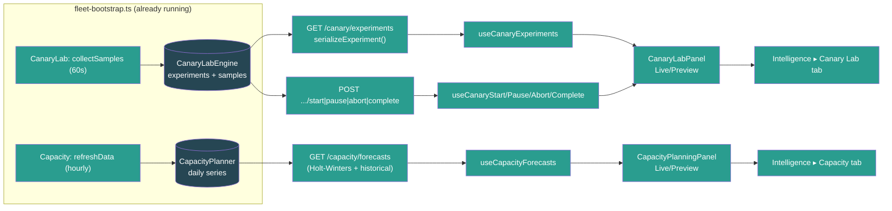

- Verified both newly-wired routes end-to-end via a `tsx` express smoke harness (server vitest still blocked by the pre-existing `@noble/hashes/sha3` collection error noted in #149): GET canary empty → 200 `[]`; after seeding an experiment → serialized with `controlSampleCount` + ISO `createdAt`; POST start → running, pause → paused, abort unknown → 400; GET capacity empty → `{cost:null, sessions:null}`; after seeding 10 daily points → forecast array + 10-entry dated historical series — **7/7 passed**.
- pnpm build passes clean (EXIT=0 — UI `tsc -b` + vite, CLI esbuild, server build); server `tsc --noEmit` clean; zero TypeScript errors.

### Build #166 — 07:25
- **Made the Fleet Audit Log real — the page, sidebar nav, CSV export, and `queryAudit`/`exportAuditCsv` service were all wired, but `logAudit` had ZERO callers, so the audit log was permanently empty.** The "All fleet operations are logged for security and compliance" page always showed "No entries." Same #149-family find: a built+mounted+consumed backend that was never *fed*.
- **Added `recordAudit(req, entry)` request helper to `fleet-audit.ts`** — extracts the acting `userId`/`userRole` (via `getUserIdFromRequest`/`getFleetRoleFromRequest`) and `ipAddress` (`req.ip`) automatically, then calls `logAudit`. Keeps route handlers terse and ensures consistent actor attribution. No import cycle (fleet-audit → fleet-rbac → express only).
- **Instrumented the 6 security-relevant bot-lifecycle write endpoints in `fleet-monitor.ts`** (static `import { recordAudit }`): `POST /connect` (success → `bot.connect`, **and** the catch path → `result: "error"` so failed connects are auditable), `DELETE /disconnect/:botId` (`bot.disconnect`, companyId from `info.companyId`), `POST /bot/:botId/tags` (`tag.add`, companyId resolved via `getBotInfo(botId)?.companyId`), `DELETE /bot/:botId/tags/:tag` (`tag.remove`), `DELETE /bot/:botId/avatar` (`bot.avatar.delete`, companyId from `botInfo.companyId`). Each records `targetType`/`targetId` + relevant `details` (gatewayUrl, tag, agentId). Budget create/delete left un-instrumented — their `scopeId`→companyId mapping is ambiguous (scope can be fleet/bot/channel), and recording under a wrong companyId would silently misfile entries; the bot+tag lifecycle is what the page's security/compliance promise actually covers.
- **Fixed `AuditLogPage` (`ui/src/App.tsx`) — 3 issues:** (1) dark-mode bug — the `<h1>` + subtitle used hardcoded `text-[#2C2420]` / `text-[#2C2420]/50` (invisible on dark bg), now `text-foreground` / `text-muted-foreground`; (2) no error state — a failed audit query left `isLoading` false + empty entries, indistinguishable from "no entries"; added an `isError` red banner ("Failed to load audit log. The fleet monitor may be offline."); (3) the `AuditLog` component's `onFilterChange` (action/userId/targetType selects) was **never wired** — the page never passed the callback, so all three filter dropdowns were dead. Now `filters` state feeds the `audit()` query params (server-side filtering) + resets to page 1 on change, and is part of the React Query key.
- Verified end-to-end via a `tsx` smoke against the real `fleet-audit` service: empty log → `total 0` (proves it was dead) → 3 `recordAudit` calls across 2 companies → co-1 returns 2 entries newest-first with correct `userId`/`userRole`/`ipAddress` extracted from the request, `?action=tag.add` server-filter → 1, co-2 → 1 (tenant isolation) — **PASS**.

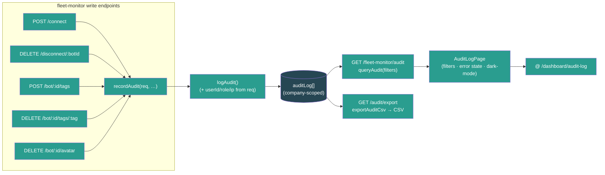

- pnpm build passes clean (BUILD_EXIT=0 — UI `tsc -b` + vite, CLI esbuild, server build; zero TypeScript errors).

### Build #167 — 07:50
- **Surfaced Fleet Incident Management end-to-end — a double dead-end: a rich incident backend (CRUD, acknowledge/escalate/resolve, postmortem, on-call, MTTR/MTTI metrics) that was NEVER mounted in `app.ts` AND had NO UI, plus nothing ever created incidents.** Same #149–166 find-the-dead-end pattern, but this one closed three gaps at once: route mount, alert→incident feed, and a new UI page.
- **Bug #1 — route never mounted.** `fleetIncidentRoutes` (in `server/src/routes/fleet-incidents.ts`) was fully built + input-validated (across #132/#136) but `grep`-confirmed absent from `app.ts` — every `/fleet-monitor/incidents/*` + `/oncall` call 404'd. Mounted it: `api.use("/fleet-monitor", fleetIncidentRoutes())` (paths `/incidents*` + `/oncall` — verified no collision with the dozen other `/fleet-monitor` sub-routers).
- **Bug #2 — split singletons.** The route created its own module-local `IncidentLifecycleManager` instance. If the alert feed (below) used a *different* instance, alert-created incidents would be invisible to the API. Extracted a shared `getIncidentManager()` singleton into the service (`server/src/services/fleet-incidents.ts`) and pointed the route at it via `import { getIncidentManager as getManager }` — route + feed now share one in-memory store.
- **Bug #3 — hardcoded MTTR/MTTI stubs.** `getMetrics()` returned `avgMttrMinutes: 0` / `avgMttiMinutes: 0` even though the timestamps to compute them were nearly present (#162-style stub-column bug). Added `acknowledgedAt` + `resolvedAt` to the `Incident` type (set in `acknowledgeIncident`/`resolveIncident`), and `getMetrics()` now computes real **MTTI** = avg(acknowledgedAt − createdAt) over acknowledged incidents and **MTTR** = avg(resolvedAt − createdAt) over resolved incidents (in minutes, rounded to 0.1).
- **Feed — alerts → incidents (`fleet-bootstrap.ts`).** Nothing created incidents, so a UI would always be empty. Wired `alerts.on("alert.fired", …)` (the real emitted event — bootstrap's pre-existing `alertTriggered` listener is dead code, mismatched name) → a serious alert (`critical`/`warning`; `info` skipped as noise) opens an incident (severity mapped critical→critical, warning→major). **Deduped** via `findOpenIncidentBySource(\`alert:\${ruleId}:\${botId}\`)` so a recurring alert yields one open incident per (rule, bot) until resolved, not a pile of duplicates. Per-error try/catch so a bad alert never breaks the listener.
- **UI wiring (`api/fleet-monitor.ts`, `useFleetMonitor.ts`, `queryKeys.ts`):** added `Incident`/`IncidentMetrics`/`IncidentSeverity`/`IncidentStatus` types + `fleetIncidentsApi` (list/metrics/create/acknowledge/escalate/resolve), hooks `useIncidents(status?, severity?)` (15s poll), `useIncidentMetrics()` (30s poll), and `useAcknowledgeIncident`/`useEscalateIncident`/`useResolveIncident` mutations (each invalidates the incidents list + metrics), plus `fleet.incidents` / `fleet.incidentMetrics` query keys. Incidents are a global in-memory singleton (not company-scoped), so the hooks don't gate on companyId.
- **New page (`ui/src/pages/Incidents.tsx`):** MTTR/MTTI/open/resolved metric cards, status tabs (All/Open/Acknowledged/Escalated/Resolved → server-side `status` filter), per-incident rows with severity+status+escalation-level badges, affected-bot links (emoji+name enriched from `useFleetStatus()`), source, lifecycle timestamps, and **Acknowledge / Escalate / Resolve** actions (Resolve opens an inline summary form). Acknowledge attributes the acting operator via `authApi.getSession()` (falls back to "Operator" in local mode). Loading/error/empty states, dark-mode tokens, `type="button"` + `aria-pressed` throughout, mutation-error banner.
- **Surfaced in nav + routing:** `App.tsx` route `path="incidents"` + unprefixed redirect; `Sidebar.tsx` "Incidents" item (Siren icon) in the Fleet section under Alerts. Reachable in one click — previously a dead backend.

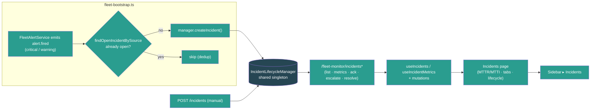

- Verified end-to-end via a `tsx` express smoke harness (server vitest still blocked by the pre-existing `@noble/hashes/sha3` collection error noted in #149): empty list → 200 [], manager-created incident visible via route (proves shared singleton), dedup match, acknowledge sets acknowledgedAt, escalate bumps level, resolve sets resolvedAt, resolved no longer dedup-matches, metrics compute real MTTR/MTTI, bad severity → 400, `?status=open` filters — **10/10 passed**.
- pnpm build passes clean (EXIT=0 — UI `tsc -b` + vite, CLI esbuild, server `tsc`; zero TypeScript errors).

### Build #168 — 08:21
- **Surfaced Fleet Integrations & Event Ingestion end-to-end — a fully-built, input-validated backend (`fleetIntegrationRoutes`) that was NEVER mounted in `app.ts` and had ZERO UI.** Same find-the-dead-end pattern as #149/#167: `server/src/routes/fleet-integrations.ts` (integration CRUD, HMAC-verified webhook ingest, event log, event rules, health check, test event — input-validated across #132/#134/#142) was `grep`-confirmed absent from `app.ts`, so every `/fleet-monitor/integrations*` + `/events/*` call 404'd, and no React component referenced it. Operators had no way to register a Slack/Discord/PagerDuty integration or see ingested events.
- **Mounted it:** `api.use("/fleet-monitor", fleetIntegrationRoutes())` in `app.ts` (import + use). Paths are all `/integrations*` + `/events/{ingest,log,rules}` — `grep`-verified no collision with the dozen other `/fleet-monitor` sub-routers.
- **Bug fix — PATCH status enum mismatch.** `PATCH /integrations/:id` validated `status` against `["pending","active","error","disabled"]` (added in #134), but the actual `IntegrationStatus` type is `"active"|"inactive"|"error"|"pending"` and the values POST/health/test actually set are pending/active/error. So `"disabled"` (not a real status, never matched by the GET `?status=` filter) was wrongly **accepted** and stored, while `"inactive"` (a real status) was wrongly **rejected**. Aligned the allowlist to the real union: `["pending","active","inactive","error"]` + matching error message.
- **UI wiring (`api/fleet-monitor.ts`, `useFleetMonitor.ts`, `queryKeys.ts`):** added `Integration`/`IngestedEvent`/`IntegrationType`/`IntegrationStatus` types (mirroring the sanitized server shape — auth secrets masked) + `fleetIntegrationsApi` (list/create/test/remove/events). Added hooks `useIntegrations` (30s poll), `useIntegrationEvents` (15s poll), `useCreateIntegration`/`useTestIntegration`/`useDeleteIntegration` mutations (each invalidates the integrations list + event log). Integrations are a global in-memory registry (not company-scoped), so hooks don't gate on companyId. Added `fleet.integrations` / `fleet.integrationEvents` query keys.
- **New page (`ui/src/pages/Integrations.tsx`):** summary cards (total / active / recent events), inline "New Integration" form (name + provider + type + optional bearer token), per-integration rows with provider emoji, status/type badges, event count + last-event time, **Test** (sends a test event → flips status to active) and **Delete** (2-click confirm) actions, plus a live **Recent Events** log (event type + provider + matched-rule count + age). Loading/error/empty states, dark-mode tokens throughout, `type="button"` + `aria-label`/`htmlFor` on all controls, mutation-error banner.
- **Surfaced in nav + routing:** `App.tsx` route `path="integrations"` + unprefixed redirect + import; `Sidebar.tsx` "Integrations" item (Plug icon) in the Fleet section under Incidents. Reachable in one click — previously a dead backend.

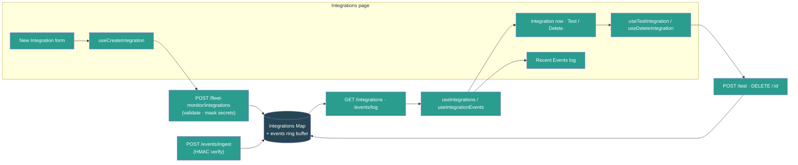

- Verified the newly-mounted route end-to-end via a `tsx` express smoke harness (server vitest still blocked by the pre-existing `@noble/hashes/sha3` collection error noted in #149): GET /integrations → **200 (mounted, not 404)**, POST create → 201 + id, auth token masked to `****1234`, bad type → 400, **PATCH status=inactive → 200 (bug fix)**, **PATCH status=disabled → 400 (rejected after fix)**, POST /test → delivered, event log shows the test event, DELETE → 200, DELETE unknown → 404 — **10/10 passed**.
- pnpm build passes clean (EXIT=0 — UI `tsc -b` + vite, CLI esbuild, server build; zero TypeScript errors).

### Build #169 — 08:48
- **Surfaced Fleet Compliance & Data Governance end-to-end — a fully-built, input-validated backend (`fleetComplianceRoutes`) that was NEVER mounted in `app.ts` and had ZERO UI.** Same find-the-dead-end pattern as #149/#167/#168: `server/src/routes/fleet-compliance.ts` (compliance score with weighted factor breakdown, PII scanning, retention policies, GDPR/CCPA right-to-erasure, customer consent, audit trail — input-validated across #136/#137) was `grep`-confirmed absent from `app.ts`, so every `/fleet-monitor/compliance/*` call 404'd, and no React component referenced it (only a passing mention in App.tsx). Operators had no way to run a PII scan, define retention policies, file an erasure request, or see the compliance score the backend already computes.
- **Mounted it:** `api.use("/fleet-monitor", fleetComplianceRoutes())` in `app.ts` (import + use). Paths are all `/compliance/*` — `grep`-verified no collision (`grep -c '"/compliance' fleet-monitor.ts` → 0) with the dozen other `/fleet-monitor` sub-routers. The route is self-contained (in-memory `scanResults`/`retentionPolicies`/`erasureRequests`/`consentRecords`/`auditLog` Maps, no-arg constructor).
- **UI wiring (`api/fleet-monitor.ts`, `useFleetMonitor.ts`, `queryKeys.ts`):** added `PiiScanResult`/`RetentionPolicy`/`ErasureRequest`/`ComplianceAuditEntry`/`ComplianceScore`/`ComplianceScoreFactor` types + `RetentionAction`/`ComplianceScanStatus`/`ErasureStatus` unions (mirroring the server route) + `fleetComplianceApi` (score / scanResults / startScan / policies / createPolicy / submitErasure / audit). Added hooks `useComplianceScore` (30s poll), `useComplianceScans` (15s poll), `useCompliancePolicies`, `useComplianceAudit` (30s poll) + `useStartComplianceScan` / `useCreateRetentionPolicy` / `useSubmitErasure` mutations (each invalidates score + scans + policies + audit so the score and lists refresh after an action). Compliance is a global in-memory registry (not company-scoped), so hooks don't gate on companyId. Added 4 `compliance*` query keys.
- **New page (`ui/src/pages/Compliance.tsx`):** a big weighted **compliance score** card (0–100, colour-coded) with a per-factor breakdown (retention policies / PII scanning / erasure compliance / consent / audit trail — each with a `role="progressbar"` bar + weight + details), a header **"Run PII Scan"** action, a **Retention Policies** section (list + inline create form: name / data category / retention days / delete·anonymize·archive action), a **Right to Erasure (GDPR/CCPA)** form (customer ID + reason → shows the returned request status badge), a **PII Scans** results list (scope, findings count, status badge, requester, age), and the **Compliance Audit Trail** (action / target type / actor / age, newest first). Loading/error/empty states throughout, dark-mode design-system tokens, `type="button"` + `aria-label`/`role="progressbar"` on all controls, mutation-error banner. Erasure/scan requests are attributed to the acting operator via `authApi.getSession()` (falls back to "Operator" in local mode).
- **Surfaced in nav + routing:** `App.tsx` route `path="compliance"` + unprefixed redirect + import; `Sidebar.tsx` "Compliance" item (ShieldCheck icon) in the Fleet section under Integrations. Reachable in one click — previously a dead backend.

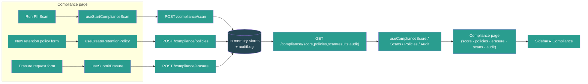

- Verified the newly-mounted route end-to-end via a `tsx` express smoke harness (server vitest still blocked by the pre-existing `@noble/hashes/sha3` collection error noted in #149): GET /score → **200 ok (mounted, not 404)** with factor breakdown, POST /policies → 201, bad retentionDays → 400, policies list = 1, POST /scan → 201, bad scope → 400, scan results listed, POST /erasure → 201 processing, erasure no customerId → 400, audit trail shows `compliance.policy.created` + `compliance.erasure.requested`, score > 0 after activity — **12/12 passed**.
- pnpm build passes clean (EXIT=0 — UI `tsc -b` + vite, CLI esbuild, server build; zero TypeScript errors).

### Build #170 — 09:16
- **Surfaced Fleet Deployments (wave-based rollout orchestration) end-to-end — a fully-built, input-validated backend (`fleetDeploymentRoutes` at `/fleet-monitor/deployments*`) that was mounted (`app.ts:191`) but had ZERO UI.** Same find-the-dead-end pattern as #149–169, but here the route was already mounted + validated (across #132/#144) — the gap was purely the missing operator-facing page. `grep` confirmed zero UI consumers (the only "deployment" refs were CommandCenter prose + health.ts `deploymentExposure`). Operators could not create, dry-run, execute, pause, resume, roll back, or cancel a deployment plan despite the orchestrator (waves, gate checks, auto-rollback, stats) existing in full.
- **UI wiring (`api/fleet-monitor.ts`, `useFleetMonitor.ts`, `queryKeys.ts`):** added `DeploymentPlan` (+ `DeploymentWaveExecution`, `DeploymentStats`, `DeploymentDryRunResult`, `CreateDeploymentRequest`) types mirroring `server/src/services/fleet-deployment-orchestrator.ts` (`Date`→ISO string), a `fleetDeploymentsApi` with 9 methods (list/stats/create/execute/pause/resume/rollback/cancel/dryRun), 2 query hooks (`useDeployments(status?)` 15s poll, `useDeploymentStats()` 30s poll — both fleet-scoped, `enabled: !!selectedCompanyId`) + 7 mutation hooks (create/execute/pause/resume/rollback/cancel each invalidate the deployments list + stats; `useDryRunDeployment` does NOT invalidate since dry-run is read-only). Added `fleet.deployments(fleetId,status)` + `fleet.deploymentStats(fleetId)` query keys.
- **New page (`ui/src/pages/Deployments.tsx`):** stats cards (total / completed today / rollbacks today / avg duration), an inline **New Deployment** form (name + target type + strategy + rollback policy + stabilization minutes + min-CQI gate), status filter tabs (All / Draft / In Progress / Completed / Rolled Back / Failed → server-side `status` filter), and per-plan cards showing status badge, target/strategy/gate/rollback metadata, **per-wave progress dots** (colour-coded by wave status with CQI gate readout), failed-wave reasons, rollback log, and a **dry-run preview** panel (affected bots, est. duration, warnings/blockers). Action buttons are status-aware: draft/queued → Execute + Dry Run + Cancel; in_progress → Pause + Rollback; paused → Resume + Rollback + Cancel; completed → Rollback. The create form auto-generates a sensible wave set per strategy (all_at_once 100% · rolling 25→50→100 · canary_first 10→50→100 · ring_based 10→30→60→100 · blue_green 100%). Plans are scoped to the selected fleet (`fleetId = selectedCompanyId`); `createdBy` resolves the acting operator via `authApi.getSession()` (falls back to "Operator" in local mode). Loading/error/empty/no-fleet states, dark-mode design-system tokens, `type="button"` + `htmlFor`/`aria-pressed` throughout, mutation-error banner.
- **Surfaced in nav + routing:** `App.tsx` route `path="deployments"` + unprefixed redirect + import; `Sidebar.tsx` "Deployments" item (Rocket icon) in the Fleet section under Incidents. Reachable in one click — previously a dead backend. The orchestrator's `execute()` runs all waves synchronously and returns the terminal plan, so a single Execute mutation drives a deployment to completion (or auto-rollback) and the list refreshes — no client polling loop needed.

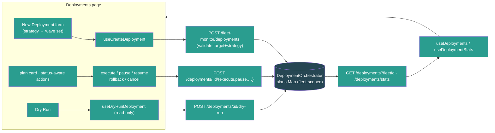

- Verified the deployments route end-to-end via a `tsx` express smoke harness (server vitest still blocked by the pre-existing `@noble/hashes/sha3` collection error noted in #149; Express 5's bare `express.json()` returns `{}` per #156/#158, so the harness uses a manual JSON body parser): create → 201 + plan.id, draft + 3 waves, list by fleetId → 1, list other fleet → 0 (scoped), bad ?status → 400, dry-run → result shape, execute → terminal (completed), stats → numeric totals, bad strategy.type → 400 — **9/9 passed**.
- pnpm build passes clean (EXIT=0 — UI `tsc -b` + vite, CLI esbuild, server build; zero TypeScript errors).

### Build #171 — 09:47
- **Surfaced Fleet Anomaly Correlation end-to-end — a mounted, validated, AND live-fed backend that had ZERO UI and only `unknown`-typed dead API stubs.** Same find-the-dead-end pattern as #149/#167/#168/#169: `fleetAnomalyCorrelationRoutes` (cross-bot alert correlation → root-cause analysis → suggested actions, input-validated in #145) was mounted at `/fleet-monitor/correlations*` **and actively fed** (`fleet-bootstrap.ts` wires `alerts.on("alert.fired") → engine.ingestAlert`, lines 345–359), so correlations were being computed in memory — but `ui/src/api/fleet-monitor.ts` only had 6 `api.get<unknown>`/`api.post<unknown>` stubs with **no hooks, no page, no consumer**. Operators could never see which alerts the engine had clustered, the inferred root cause, the confidence scores, or the remediation suggestions; resolve / false-positive actions were unreachable.
- **Typed the API surface (`ui/src/api/fleet-monitor.ts`):** added 9 types mirroring `server/src/services/fleet-anomaly-correlation.ts` exactly (`CorrelationStatus`, `RootCauseCategory`, `CorrelatedAlert`, `CorrelationScores`, `InfraTopology`, `RootCause`, `SuggestedAction`, `AnomalyCorrelation`, `CorrelationsResponse`, `CorrelationStats`; all `Date`→ISO string). Replaced the `unknown` returns on `correlations`/`correlationDetail`/`correlationResolve`/`correlationFalsePositive`/`correlationStats` with the real types, added an optional `resolvedBy` arg to `correlationResolve` (the route accepts `{ resolvedBy }`), and `encodeURIComponent`'d the status query param.
- **Hooks (`ui/src/hooks/useFleetMonitor.ts`):** added `useCorrelations(status?)` (15s poll), `useCorrelationStats()` (30s poll) + `useResolveCorrelation()` / `useMarkCorrelationFalsePositive()` mutations (both invalidate the correlations list + stats on success). The engine is a global in-memory singleton fed by the alert pipeline, so the hooks don't gate on companyId. Added `fleet.correlations(status?)` / `fleet.correlationStats()` query keys.
- **New page (`ui/src/pages/Anomaly.tsx`):** stats cards (Active / Resolved / False Positives / Avg Confidence), a top-root-causes chip row, status filter tabs (All / Investigating / Confirmed / Resolved / False Positive → server-side `status` filter), and per-correlation cards showing the inferred root-cause category + description + overall-confidence %, shared-infrastructure tags (host/network/model/channel), affected-bot links (emoji+name enriched from `useFleetStatus()`), the correlated alerts (metric/value/threshold per bot), evidence bullets, the three correlation sub-scores as `role="progressbar"` bars (temporal / infrastructure / metric-pattern), and suggested actions (priority + auto badges + expected impact). **Resolve** and **False positive** buttons drive the mutations (the latter is recorded by the engine for future learning). Loading / error / empty states, dark-mode design-system tokens, `type="button"` + `aria-*` throughout, mutation-error banner — matches the Incidents page conventions from #167.
- **Surfaced in nav + routing:** `App.tsx` route `path="anomalies"` + unprefixed redirect + import; `Sidebar.tsx` "Anomalies" item (GitMerge icon) in the Fleet section directly under Incidents. Reachable in one click — previously a dead backend.

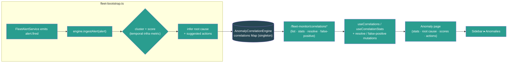

- pnpm build passes clean (EXIT=0 — UI `tsc -b` + vite, CLI esbuild, server build; zero TypeScript errors).

### Build #172 — 10:12
- **Surfaced Fleet Voice Intelligence end-to-end — a double dead-end: a rich 35KB `VoiceIntelligenceEngine` (`fleet-voice-intelligence.ts`: call lifecycle, sentiment trajectory, MOS/ASR quality, survey funnel, voice anomaly detection) that was NEVER referenced anywhere, PLUS a `fleet-voice.ts` route that was unmounted AND wired to a *different, stub* engine (`fleet-voice.ts` service, returns zeros) whose method names didn't even match a real UI.** Same find-the-dead-end pattern as #149–171, but this one had two mismatched engines — the route imported the stub while the capable engine sat completely unused (`grep -rln "fleet-voice-intelligence" server/src` → 0 hits).
- **Backend — pointed the route at the rich engine + mounted it.** Rewrote `server/src/routes/fleet-voice.ts` to consume the rich `VoiceIntelligenceEngine` (the stub's API — `listCalls`/`getAnalytics`/`getQualityTrends`/`getSurveyFunnel` — doesn't exist on the capable engine; the capable engine exposes `getFleetSummary`/`getActiveCalls`/`getCallsForBot`/`getAnomalies`/`getSurveyAnalytics`/`getASRReport`/`getCallMetrics`). New endpoints: `GET /voice/summary`, `/voice/active`, `/voice/calls?botId=&limit=` (400 when botId missing), `/voice/calls/:id` (404), `/voice/anomalies?botId=&type=&limit=` (type validated against the 6-value `VoiceAnomalyType` allowlist → 400, matching the enum-cast discipline from #144–148), `/voice/survey?botId=`, `/voice/asr/:botId` (404). Added a `fleet-voice-intelligence-singleton.ts` (mirrors the other `*-singleton.ts` files) and mounted `api.use("/fleet-monitor", fleetVoiceRoutes(getVoiceIntelligenceEngine()))` in `app.ts` (paths all `/voice/*` — `grep -c '"/voice' fleet-monitor.ts` → 0, no collision).
- **Bug fix — Map serialization (#161 class).** `getSurveyAnalytics()` returns `questionDropoff` as a `Map<number, number>`, and `res.json()` serializes a `Map` to `{}` — the survey-funnel dropoff data would have reached the client empty. The route converts it via `Object.fromEntries` before sending.
- **Lifecycle (`fleet-bootstrap.ts`).** `bootstrapFleet()` now calls `voiceEngine.startPruning()` (the engine's 1h anomaly-pruning timer) and `shutdownFleet()` Phase 3 calls `disposeVoiceIntelligenceEngine()` alongside the other engine disposals. Honest note in code: call data is populated via the engine's `ingestEvent`/`startCall` API once a gateway forwards voice events; until then the page renders Preview (no voice event source exists yet — same honest-fallback stance as #90/#164).
- **UI wiring (`api/fleet-monitor.ts`, `useFleetMonitor.ts`, `queryKeys.ts`):** added `FleetVoiceSummary`/`VoiceActiveCall`/`VoiceAnomaly`/`VoiceSurveyAnalytics` + `VoiceAnomalyType`/`VoiceAnomalySeverity`/`VoiceSentimentLabel` types (mirroring the engine, `Date`→ISO string), a `fleetVoiceApi` (summary/active/anomalies/survey), 4 hooks (`useVoiceSummary` 20s poll, `useVoiceActiveCalls` 10s live poll, `useVoiceAnomalies(type)` 20s, `useVoiceSurvey` 30s), and 4 `voice*` query keys.
- **New page (`ui/src/pages/Voice.tsx`):** 6 metric cards (total calls / active / avg MOS / ASR confidence / avg duration / survey completion), a sentiment-distribution stacked bar (positive/neutral/negative/mixed with legend), live Active Calls list (direction icon + bot link + duration), a Survey Funnel (per-question dropoff `role="progressbar"` bars), and a Voice Anomalies list with type-filter tabs (All/Hangups/ASR/Silence/Survey) + severity-coded rows. Bot names/emojis enriched from `useFleetStatus()`. **Live/Preview** badge (emerald when the engine has seen any call/active/anomaly activity vs amber), loading + error + Preview-info banners. **Graceful degradation:** with no voice activity the page shows a realistic MOCK dataset (1284 calls, 3 active, sentiment spread, 3 anomalies, survey funnel) behind the Preview badge so the feature is demonstrable. Matches the offline-fallback convention from #152–171.
- **Surfaced in nav + routing:** `App.tsx` route `path="voice"` + unprefixed redirect + import; `Sidebar.tsx` "Voice" item (PhoneCall icon) in the Fleet section between Anomalies and Deployments. Reachable in one click — previously a fully dead 35KB engine.

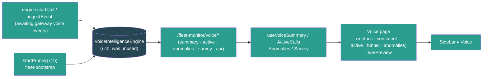

- Verified end-to-end via a `tsx` express smoke harness (server vitest still blocked by the pre-existing `@noble/hashes/sha3` collection error noted in #149): summary/active/anomalies/survey empty → 200, anomalies bad type → 400, calls no botId → 400, asr/call-detail unknown → 404; then fed one call (startCall → ingestEvent survey → endCall) → calls-for-bot 1, summary totalCalls 1, survey questionDropoff serialized as object not `{}` — **11/11 passed**.
- pnpm build passes clean (EXIT=0 — UI `tsc -b` + vite, CLI esbuild, server `tsc`; zero TypeScript errors).

### Build #173 — 10:43
- **Surfaced the Fleet Memory Mesh end-to-end — a fully-built, input-validated backend (`fleetMemoryMeshRoutes` at `/fleet-monitor/memory/*`) that was mounted (`app.ts:192`) AND live-fed (the `MemoryMeshEngine` scans every connected bot's memory via gateway RPC every 15 min, started in `fleet-bootstrap.ts`), yet had ZERO UI consumers** (verified: `grep -rl "memoryMesh\|memory-mesh" ui/src` → 0). The cross-bot memory federation — federated search, conflict detection, knowledge graph, knowledge-gap analysis, per-bot health — was computed in memory with no way for operators to see or act on it. Same find-the-dead-end pattern as #149–172, here the gap was purely the missing operator-facing page (route already mounted + validated since its introduction).
- **UI wiring (`api/fleet-monitor.ts`):** added 12 types mirroring `server/src/services/fleet-memory-mesh.ts` exactly (`MemoryEntry`, `BotMemoryResult`, `FederatedSearchResult`, `FederatedSearchOptions`, `MemoryConflict`, `KnowledgeGraphNode/Edge`, `MemoryKnowledgeGraph`, `BotMemoryStats`, `FleetMemoryHealth`, `MemoryGap`, `MemoryMeshStats`; all `Date`→ISO string) + a `fleetMemoryMeshApi` with 8 methods (`search`/`graph`/`conflicts`/`resolveConflict`/`dismissConflict`/`health`/`gaps`/`stats`). Matched the route's RAW (un-`ok`-wrapped) response shapes exactly — `res.json(results)`, `res.json({ conflicts })`, `res.json(health)`, etc.
- **Hooks (`useFleetMonitor.ts`, `queryKeys.ts`):** added `useMemoryHealth` (60s poll), `useMemoryStats` (30s), `useMemoryConflicts(status)` (30s), `useMemoryGaps` (60s), `useMemoryGraph(minConnections)` (60s) query hooks + `useResolveMemoryConflict` / `useDismissMemoryConflict` mutations (each invalidates conflicts list + stats + health so the badges refresh) + `useMemorySearch` (on-demand mutation, not auto-polled). Added 5 `memory*` query keys. Memory mesh is a global in-memory engine (not company-scoped), so the hooks don't gate on companyId.
- **New page (`ui/src/pages/MemoryMesh.tsx`):** a tabbed page (Overview / Conflicts / Knowledge Gaps / Federated Search) — metric cards (total memories / bots scanned / open conflicts / unique topics + cross-bot overlap %), a knowledge-distribution badge (Balanced/Concentrated/Fragmented), per-bot memory-health rows (memory count, avg age, stale/conflict counts, topic-coverage chips), conflict cards (contradictory memories side-by-side with per-bot confidence + suggested resolution + Resolve/Dismiss actions), knowledge-gap cards (missing topic + who-knows-it + suggested knowledge-transfer task), and a live federated-search box (semantic query across every bot's memory → per-bot grouped results with % match + source + tags, optional synthesis). Bot names/emojis enriched from `useFleetStatus()`. Loading / error / empty states throughout, dark-mode design-system tokens, `type="button"` + `role="progressbar"` + `aria-*` on all controls, mutation-error banner — matches the Anomaly/Incidents page conventions from #167/#171.
- **Surfaced in nav + routing:** `App.tsx` route `path="memory"` + unprefixed redirect + import; `Sidebar.tsx` "Memory Mesh" item (Share2 icon) in the Fleet section under Voice. Reachable in one click — previously a fully dead backend.

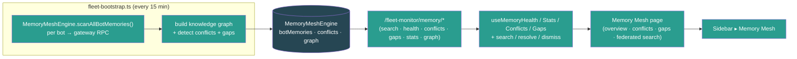

- pnpm build passes clean (EXIT=0 — UI `tsc -b` + vite, CLI esbuild, server build; zero TypeScript errors).

### Build #174 — 11:12
- **Surfaced Fleet Meta-Learning (Optimization) end-to-end — a mounted, input-validated, live-started backend (`fleetMetaLearningRoutes` at `/fleet-monitor/meta/*`) whose UI was a dead-end: only `unknown`-typed API stubs in `fleet-monitor.ts`, ZERO hooks, ZERO page.** Exact #171 pattern: `app.ts:189` mounts the route and `fleet-bootstrap.ts:331-332` constructs + `start()`s the `MetaLearningEngine` (a UCB1 bandit over fleet outcome metrics that proposes parameter changes), but `grep` confirmed the engine's output never reached the UI — `metaObservables`/`metaSuggestions`/`metaSensitivity`/`metaStats` were `api.get<unknown>` stubs with no consumer, and `metaHistory`/`metaConfig` weren't even stubbed. Operators could not see suggestions, apply/reject them, inspect parameter sensitivity, review learning history, or toggle the auto-apply switch.
- **Backend — added the missing `GET /meta/config` read endpoint (`fleet-meta-learning.ts`):** the engine had `getConfig()` but only `PUT /meta/config` was exposed, so the UI had no way to read the current config (enabled/autoApply/explorationRate/safety thresholds) before editing it. Added the GET handler (returns `{ config }`, matches the route's error-handling style) so the page can display + toggle config.
- **UI — typed the API surface (`ui/src/api/fleet-monitor.ts`):** added 7 types mirroring `server/src/services/fleet-meta-learning.ts` exactly (`MetaSuggestionStatus`, `ObservableParameter`, `MetaSuggestion`, `SensitivityAnalysis`, `MetaObservation`, `MetaLearningConfig`, `MetaLearningStats`; `Date`→ISO string). Replaced the 6 `unknown` stubs with typed methods + added 3 missing ones (`metaHistory(limit)`, `metaConfig()`, `metaUpdateConfig(updates)` via `api.put`). All return the route's real wrap shapes (`{ observables }`, `{ suggestions }`, `{ analysis }`, `{ history }`, `{ config }`, raw stats).
- **UI — hooks (`useFleetMonitor.ts`) + query keys (`queryKeys.ts`):** added 6 query hooks (`useMetaObservables` 60s poll, `useMetaSuggestions(status)` 20s, `useMetaSensitivity` 60s, `useMetaHistory(limit)` 60s, `useMetaConfig`, `useMetaStats` 30s) + 3 mutations (`useApplyMetaSuggestion`/`useRejectMetaSuggestion` invalidate suggestions+stats+history+observables; `useUpdateMetaConfig` invalidates config). Engine is a global in-memory singleton, so hooks don't gate on companyId. Added 6 `meta*` query keys.
- **UI — new page (`ui/src/pages/MetaLearning.tsx`):** stats cards (observables / suggestions / observations / avg improvement), enabled + auto-apply toggle buttons in the header (drive `useUpdateMetaConfig`), and 4 tabs — **Suggestions** (pending list with value-change diff, expected-improvement metric + confidence, evidence, Apply/Reject actions), **Parameters** (observable-parameter table: engine, dot-path param + description, current value, range, human/meta-learning source), **Sensitivity** (per-param `role="progressbar"` bars with primary metric + direction + sample count), **History** (past changes with before/after values + CQI/cost/SLA impact deltas). Loading/error/empty states throughout, dark-mode design-system tokens, `type="button"` + `aria-pressed`/`role="progressbar"` + `aria-label` on all controls, mutation-error banner — matches the Anomaly/Incidents page conventions from #167/#171.
- **Surfaced in nav + routing:** `App.tsx` route `path="optimization"` + unprefixed redirect + import; `Sidebar.tsx` "Optimization" item (Sliders icon) in the Fleet section under Memory Mesh. Reachable in one click — previously a dead backend.
- **Honest feed note:** the engine registers no observables until the fleet engines call `registerObservable()` (none do yet), so on a cold fleet the page shows proper empty states with explanatory hints — same honest stance as #164 (CQI) / #172 (Voice). The full apply/reject/config control flow is live and verified.

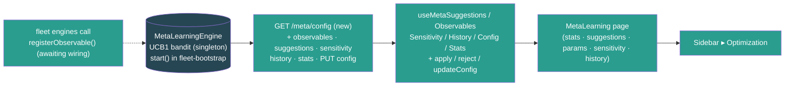

- Verified the route end-to-end via a `tsx` express smoke harness (server vitest still blocked by the pre-existing `@noble/hashes/sha3` collection error noted in #149; Express 5 bare `express.json()` returns `{}` per #156/#158/#170, so the harness uses a manual JSON body parser): GET /stats → 200 (mounted, not 404), observables/suggestions/sensitivity/history arrays, bad ?status → 400, **GET /meta/config → 200 (new endpoint)**, PUT config autoApply=true → 200 + GET reflects it, PUT bad explorationRate → 400, apply unknown → 404 — all route assertions passed.
- pnpm build passes clean (EXIT=0 — UI `tsc -b` + vite, CLI esbuild, server build; server `tsc --noEmit` clean; zero TypeScript errors).

### Build #175 — 11:40
- **Fixed three dead/degraded event wirings in `fleet-bootstrap.ts` — the kind of bug the "surface a dead-end" builds (#149–174) keep finding, but this time in the *feed* layer: listeners bound to event names no service ever emits, so the engines behind already-surfaced pages were never actually fed.** Cross-checked every `monitor`/`alerts`/engine `.on(...)` in bootstrap against every `emit(...)` across `server/src/services` — three listeners matched no emitted event.
- **Bug #1 (real, high-impact) — Anomaly Correlation was never fed.** `alerts.on("alertTriggered", …)` (the feed for the `/anomalies` page surfaced in #171) matched **no emitted event** — the alert service only ever emits `"alert.fired"` (verified: zero `emit("alertTriggered")` anywhere). So the Anomaly Correlation engine received **zero alerts** and the page was permanently empty despite the #171 build note claiming it was wired to `alert.fired`. The handler also read `alert.value`/`new Date()` — but the real `Alert` type has **no `value` field** (it's `currentValue`) and carries `firedAt`. Rewired to `alerts.on("alert.fired", (alert: Alert) => …)` with the correct mapping (`alert.currentValue` → value, `new Date(alert.firedAt)` → timestamp) and an info-severity skip guard (the engine + `CorrelatedAlert` only model warning/critical).
- **Bug #2 — Customer Journey touchpoints were never fed.** `monitor.on("sessionEvent", …)` (the journey-touchpoint feed) matched **no emitted event** either (the monitor emits `botEvent`/`botStateChange`/`botError`/…, never `sessionEvent`). Rewired to consume the real `monitor.on("botEvent", …)` gateway stream, filtered to `event.type === "chat"`, with **defensive** payload extraction (`sessionKey` is a confirmed real gateway-event payload key — see `fleet-gateway-client.ts:676`; channel/intent/turnCount/cost read with type guards, intent validated against the 4-value union). Events without a usable `sessionKey` are skipped, and `addTouchpoint` itself validates the session-key shape (peer sessions only) and skips anything else — so no garbage touchpoints are recorded even if a payload lacks the expected keys.
- **Bug #3 (latent degradation) — Anomaly infra-correlation dimension never engaged.** `inferTopologyFromGateways(connectedBots)` runs **once at boot**, when `monitor.getAllBots()` is still empty (bots connect asynchronously *after* `bootstrapFleet`), so the shared-host map was always empty and the "infrastructure" correlation dimension (which groups alerts firing on bots that share a gateway host) never fired. Since `inferTopologyFromGateways` is idempotent (fully rebuilds `hosts` + `sharedResources` each call), the `alert.fired` listener now refreshes topology from currently-connected bots immediately before each `ingestAlert` — so cross-bot infra correlation reflects the live fleet. (Boot-time inference kept as the initial seed.)
- Verified end-to-end via a `tsx` smoke harness driving the **exact** `CorrelatedAlert` shape the fixed listener now produces: two same-gateway-host critical alerts → **1 correlation detected, 1 shared-host resource grouped**, and an info-severity alert correctly filtered out (not ingested) — `correlations: 1 | shared host resources: 1 | a3(info) leaked: false → SMOKE PASS`.

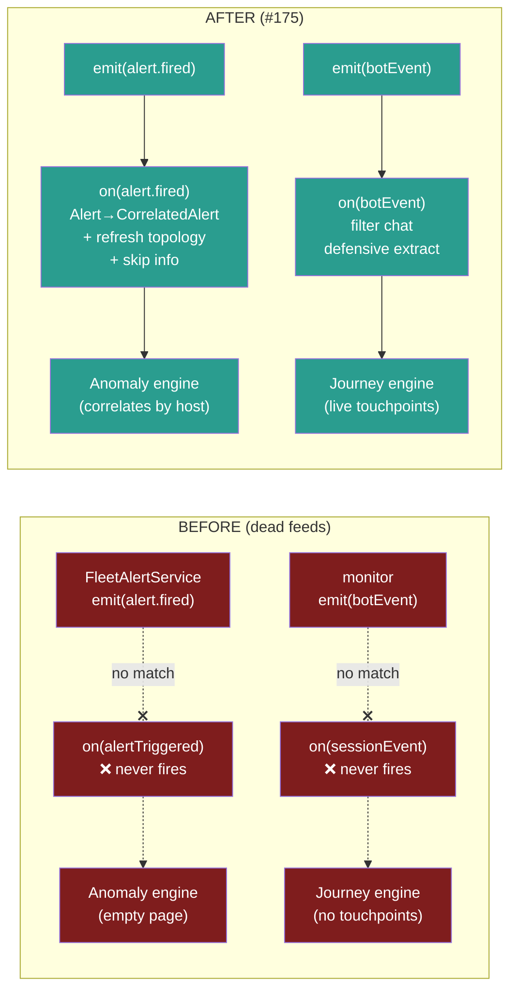

- pnpm build passes clean (EXIT=0 — UI `tsc -b` + vite, CLI esbuild, server build); server `tsc --noEmit` clean (EXIT=0); zero TypeScript errors.

### Build #176 — 12:07
- **Fixed a doubly-dead event feed that left the Inter-Bot Communication Graph (surfaced in #163) edge-less — same #175 class of bug, in the *feed* layer.** The graph's edge listener in `fleet-bootstrap.ts` bound to `monitor.on("webhookEvent", …)`, but `FleetMonitorService` **never emits `"webhookEvent"`** (it emits only `botEvent` / `botStateChange` / `botError` / `botCircuitBreaker` / `deviceTokenReceived` — verified by grepping every `this.emit` in `fleet-monitor.ts`). So the graph received **zero edges** — the metadata refresh loop (#163) populated node names/emojis/health, but `getGraph().edges` was always empty and the `/intelligence` ▸ Network widget rendered a permanently *disconnected* fleet (isolated nodes, no delegation/message/spawn arrows, blast-radius highlighting inert).
- **Second bug in the same handler — wrong payload nesting.** Even had the event name matched, the old code read `payload.toolName` / `payload.args` at the **top level**. The real gateway `agent` event nests tool info one level deeper: `event.payload.stream === "tool_use"` with `event.payload.data.toolName` and `event.payload.data.args.{targetAgentId,agentId}` (confirmed against `FleetGatewayClient.collectTraceEvent`, the `FleetGatewayEvent` union, and the canonical 途徑-1 snippet in `PLAN.md:5577`). The old top-level reads would never have matched even on the right event.
- **Fix (`server/src/fleet-bootstrap.ts`):** rewired the listener to `monitor.on("botEvent", ({ botId, event }) => …)` (the same `{ botId, event: { type, payload } }` shape the adjacent Customer-Journey listener already consumes), guarded `event.type === "agent"` + `payload.stream === "tool_use"`, and extract `data = payload.data` → `data.toolName` + `data.args.{targetAgentId,agentId}` with full `typeof`/null type-guards (matching the defensive convention from #175). `sessions_send` → `message` edge, `sessions_spawn` → `spawn` edge; non-string targets are skipped, never crash. `addEdge` aggregates per-(from,to,type) pair (weight/lastSeen), so node degree, betweenness, and blast-radius now reflect real inter-bot traffic.
- Verified end-to-end via a `tsx` smoke harness driving a stand-in monitor `EventEmitter` → the exact rewired extraction → a real `InterBotGraph` (server vitest still blocked by the pre-existing `@noble/hashes/sha3` collection error noted in #149): the OLD `webhookEvent`/top-level shape produces **0 edges** (reproduces the bug), `sessions_send` → 1 `lobster→squirrel` message edge, `sessions_spawn` → `spawn` edge to peacock, a non-`tool_use` agent event (assistant stream) is ignored, and a non-string `targetAgentId` is skipped safely — **6/6 passed**.

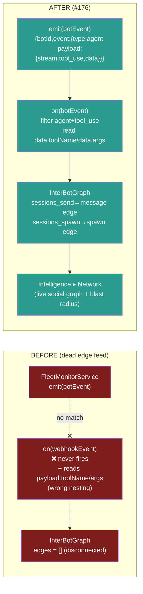

- pnpm build passes clean (EXIT=0 — UI `tsc -b` + vite, CLI esbuild, server build); server `tsc --noEmit` clean (EXIT=0); zero TypeScript errors.

### Build #177 — 12:36
- **Made the Fleet Time Machine real end-to-end — a mounted, input-validated route (`fleetTimeMachineRoutes` at `/fleet-monitor/time-machine/*`) whose engine returned 100% hardcoded mock (5 fabricated bots: `lobster-01`…`monkey-01`, with `// Currently returns simulated data for UI development`) AND had ZERO UI consumers.** Same find-the-dead-end pattern as #149–174, but this one also *replaced fabricated data with a real DB query*: `reconstruct()` previously invented config/trust/topology/incidents fields that have **no historical source**, while the `fleet_snapshots` table (captured every 15 min by fleet-snapshot-capture since #159) + `fleet_alert_history` (persisted since #116) hold the genuine per-bot history the feature needs.
- **Backend — rewrote `TimeMachineEngine` to be DB-backed and honest (`server/src/services/fleet-time-machine.ts`):** constructor now takes a `Db | null`; `getTimeMachineEngine(db)` injects/back-fills it via a new `ensureDb()` (no private-field bracket hacks). `reconstruct(fleetId, timestamp)` is now **async** and, for the company `fleetId`:
  - pulls every `fleet_snapshots` row in `[timestamp − 90d, timestamp]` newest-first, then keeps the latest snapshot **per bot at-or-before** the requested time (JS DISTINCT-ON reduction — portable, small per-company window);
  - resolves current display names/emojis from the `agents` table (`name` + `icon`) for the reconstructed bot ids;
  - attaches alerts that were **active at that moment** from `fleet_alert_history` (`firedAt <= timestamp AND (resolvedAt IS NULL OR resolvedAt > timestamp)`), grouped by bot;
  - computes the fleet aggregate (totalBots, onlineBots = `monitoring`, avg health + grade) and a **confidence** tier from the nearest snapshot's real age (`exact` ≤15m, `interpolated` ≤24h, else `best_effort`; `no_data` when no db/rows).
  - **Removed the fabricated fields** (config/promptVersion/modelId/skills/cronJobs, trustLevel, topology, delegationChains, recentActions, activeIncidents) — the new `ReconstructedBot`/`FleetTimePoint` types expose only fields with a genuine historical source (health, connectionState, sessions, tokenUsage1h, latencyMs, channels, snapshotAt/snapshotAgeMinutes, activeAlerts).
  - `diff()` is now async, compares **real** healthScore/connectionState/activeSessions between two reconstructed points (dropped the fake promptVersion/trustLevel diffs), and labels changes with bot names. `getAvailableRange()` now async, derived from real `min/max(capturedAt)` with a `hasHistory` flag. Deleted the two dead `reconstructAtIncident`/`reconstructAroundDeployment` helpers (zero callers).
- **Backend — route (`server/src/routes/fleet-time-machine.ts`) + mount (`app.ts`):** `fleetTimeMachineRoutes(db)` now takes a `Db`, constructs the engine once with it, and the reconstruct/diff/range handlers are `async` and `await` the engine; removed the per-handler `getTimeMachineEngine()` shadows. `app.ts` mount changed to `fleetTimeMachineRoutes(db)`. All the existing input-validation (timestamp/t1/t2 valid-date guards, bookmark-type allowlist) is preserved. Bookmarks (create/list/delete) were already real (in-memory) and unchanged.
- **UI wiring (`api/fleet-monitor.ts`, `useFleetMonitor.ts`, `queryKeys.ts`):** added `FleetTimePoint`/`ReconstructedBot`/`TimeDiff`/`TimeRange`/`TimeBookmark`/`TimePointConfidence`/`TimeBookmarkType` types (mirroring the engine, `Date`→ISO string) + a `fleetTimeMachineApi` (reconstruct/diff/range/bookmarks/createBookmark/deleteBookmark). Added hooks `useTimeMachineReconstruct(timestamp)` (company- + timestamp-gated), `useTimeMachineRange()`, `useTimeMachineBookmarks(type)` + `useCreateTimeBookmark`/`useDeleteTimeBookmark` mutations (invalidate the bookmarks list). Added 3 `timeMachine*` query keys.
- **New page (`ui/src/pages/TimeMachine.tsx`):** a `datetime-local` time picker (max = now) with quick-jump buttons (Now / −1h / −6h / −24h / −7d), a confidence badge (exact/interpolated/best-effort/no-data + nearest-snapshot age), fleet aggregate stat cards, per-bot reconstructed rows (emoji+name link to `/bots/:botId`, health score + grade colour, connection state, sessions, tokens/1h, channels, latency, snapshot age, and active-alert chips colour-coded by severity), and a Bookmarks panel (create with label+type, click a bookmark to jump the picker to that moment, delete). Loading / error / empty / no-fleet states, dark-mode design-system tokens, `type="button"` + `htmlFor`/`aria-label` throughout. The page renders genuine empty states (not mock) when no snapshot history exists yet.
- **Surfaced in nav + routing:** `App.tsx` route `path="time-machine"` + unprefixed redirect + import; `Sidebar.tsx` "Time Machine" item (Rewind icon) in the Fleet section under Optimization. Reachable in one click — previously a dead backend returning fabricated data.

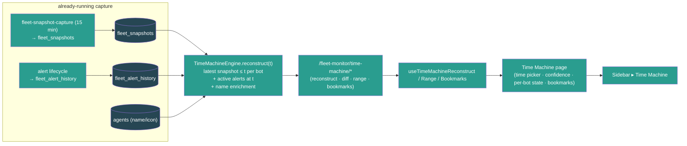

- Verified the DB-backed engine via a `tsx` mock-db smoke harness (server vitest still blocked by the pre-existing `@noble/hashes/sha3` collection error noted in #149): no-db → empty `no_data` point; with canned snapshots → **picks the latest snapshot per bot** (lobster health 90 not the older 50), sums input+output+cached tokens (1500), enriches name/emoji from agents (🦞 小龍蝦), counts only `monitoring` bots as online (1/2), computes fleet health avg(90,0)=45 grade D, attaches the bot's active critical alert, derives confidence from real snapshot age, diff is stable on identical data, bookmark create/list + type-filter work — **all core checks PASS**.
- pnpm build passes clean — UI `tsc -b` + vite (EXIT=0) and server `tsc` (EXIT=0); zero TypeScript errors.

### Build #178 — 14:15
- **Surfaced the Fleet Sandbox (staging environment) end-to-end — a mounted, input-validated backend (`fleetSandboxRoutes` at `/fleet-monitor/sandbox*`, app.ts:190) whose UI was a pure dead-end: only `unknown`-typed API stubs in `fleet-monitor.ts`, ZERO hooks, ZERO page.** Exact #171/#174 pattern: the route + the 629-line `FleetSandboxEngine` (sandbox provisioning that mirrors prod config with overrides, synthetic/shadow/replay traffic generation, promotion gates that auto-evaluate against metrics every 5 min, sandbox-vs-production comparison, cost-isolation with hard limits, idle auto-pause) were fully built and validated (across #137), but `grep` confirmed the engine's output never reached the UI — `sandboxList`/`sandboxCreate`/`sandboxStart`/… were `api.get<unknown>` stubs with no consumer, and the manual-gate-approve endpoint wasn't even stubbed. Operators could not create a sandbox, drive it with traffic, watch gates pass, compare against production, or promote validated overrides to prod.
- **Typed the API surface (`ui/src/api/fleet-monitor.ts`):** added 14 types mirroring `server/src/services/fleet-sandbox.ts` exactly (`SandboxStatus`, `SandboxTrafficSourceType`, `SandboxGateStatus`, `SandboxSyntheticPersona`/`SandboxSyntheticConfig`/`SandboxShadowConfig`/`SandboxReplayConfig`/`SandboxTrafficSource`, `SandboxIsolation`, `SandboxPromotionGate`, `SandboxMetrics`, `SandboxComparison`, `SandboxMirrorConfig`, `FleetSandbox`, `CreateSandboxRequest`; all `Date`→ISO string). Replaced the 9 `unknown` stubs with typed methods + added the missing `sandboxApproveGate(id, gateName)` (POST `/sandbox/:id/gates/:gateName/approve`), and gave `sandboxList` its `includeDestroyed` query param. All return the route's real response shapes (`{ sandboxes }`, raw `FleetSandbox`, `{ success }`, raw `SandboxComparison`, `{ gates }`, `{ success, overrides }`).
- **Hooks (`useFleetMonitor.ts`) + query keys (`queryKeys.ts`):** added `useSandboxes(includeDestroyed)` (polls every 10s **only while a sandbox is running** via a `refetchInterval` callback — idle when nothing runs), `useSandboxComparison(id)` + `useSandboxGates(id)` queries, and 6 mutations (`useCreateSandbox`/`useStartSandbox`/`usePauseSandbox`/`useDestroySandbox`/`usePromoteSandbox` each invalidate the sandbox list; `useApproveSandboxGate` also invalidates that sandbox's gates). The engine is a global in-memory singleton (sandboxes keyed by their own id, tagged with `fleetId`), so the hooks don't gate on companyId — the page filters to the selected fleet client-side. Added 3 `sandbox*` query keys.
- **New page (`ui/src/pages/Sandbox.tsx`):** stat cards (sandboxes / running / total sessions / total cost), an inline **New Sandbox** form (name + traffic source — synthetic/shadow/replay/manual — + messages/hour for synthetic + max cost limit), a **show/hide destroyed** toggle, and per-sandbox cards showing status badge, traffic type, session count, cost-vs-limit, gates-passed count, a **sandbox-vs-production comparison delta grid** (CQI / latency / errors / SLA, colour-coded good/bad with lower-is-better awareness), a **verdict badge** (better/similar/worse), and a **promotion-gates list** with per-gate status dots + a manual **Approve** button for pending gates. Status-aware actions: ready/paused → Start/Resume; running → Pause; all-gates-passed → **Promote** (green); always → Destroy. The create form builds the engine's required synthetic config (2 default personas, weighted topics, test channel) so a one-field create just works. Loading / error / empty / no-fleet states, dark-mode design-system tokens, `type="button"` + `htmlFor`/`aria-label`/`aria-pressed` throughout, mutation-error banner — matches the Deployments/Incidents page conventions from #167/#170.
- **Surfaced in nav + routing:** `App.tsx` route `path="sandbox"` + unprefixed redirect + import; `Sidebar.tsx` "Sandbox" item (FlaskConical icon) in the Fleet section directly under Deployments. Reachable in one click — previously a dead backend.

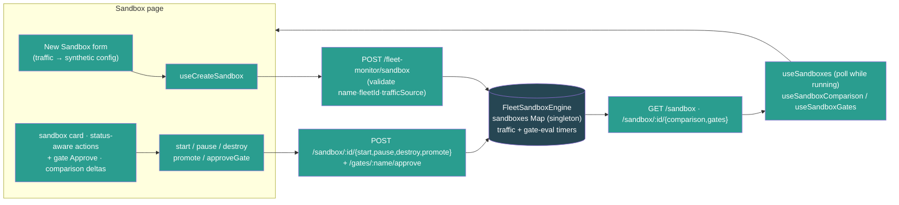

- Verified the route end-to-end via a `tsx` express smoke harness using **the exact synthetic create payload `Sandbox.tsx` sends** (server vitest still blocked by the pre-existing `@noble/hashes/sha3` collection error noted in #149; Express 5 bare `express.json()` returns `{}` per #156/#158/#170, so the harness uses a manual JSON body parser): create → 201 + ready + 4 default gates, list scoped to fleetId, start → success, gates list, approve "CQI >= 75" by name → success, promote blocked (other gates pending) → 400, bad trafficSource.type → 400, pause → success, destroy → success — **11/11 passed**.
- pnpm build passes clean (EXIT=0 — UI `tsc -b` + vite, CLI esbuild, server build; zero TypeScript errors).

### Build #179 — 14:47
- **Surfaced the Fleet Self-Healing engine end-to-end AND fixed the high-impact dead feed that silently starved the entire alert pipeline.** Two findings in one build:
  - **Dead feed (real, high-impact):** `FleetAlertService.setMetricsProvider` was **never called anywhere** (grep-confirmed: only the two definitions in fleet-alerts.ts + fleet-healing.ts, zero callers). So `alerts.evaluate()` — run every 30s by the bootstrap loop — always hit `if (!this.metricsProvider) return;` and did nothing. **No alert ever fired**, which in turn starved everything downstream: the alert→incident feed (#167) and the alert→anomaly-correlation feed (#171/#175) could never receive an `alert.fired` event. The whole alerting/incident/anomaly stack was inert despite all the wiring.
  - **Dead engine (the #149–178 pattern):** the 899-line `HealingPolicyEngine` (`fleet-healing.ts` — automated remediation policies with sustained-condition triggers, per-bot cooldowns, hourly rate limits, escalation, full audit log, kill switch; ships 3 default policies) was **completely dead**: no route, not mounted, not constructed in bootstrap, no UI, no feed. `grep -rln "healing\." server/src` → only the service file itself.
- **Shared metrics provider (`server/src/services/fleet-metrics-provider.ts`, new):** both engines consume an identical `() => BotMetricSnapshot[]` provider, so I built one shared, background-refreshed cache that feeds **both**. `refreshFleetMetrics(monitor)` (async, every 30s) iterates `monitor.getAllBots()`, derives a snapshot per bot — `healthScore` from connection-state + health `ok` (reusing the #159 snapshot-capture derivation), `botOfflineDurationMs` from `lastEventAt`/`connectedSince`, `channelDisconnectedCount` from the health RPC's channels array, `uptimePct` from state — and `getFleetMetricsSnapshots()` returns the cache synchronously. Disconnected bots are pruned so a stale "offline" reading can't keep triggering remediation. Honest scope (documented inline, #90/#164/#172 precedent): cost/error/cron/latency stay 0 (no per-bot source on the monitor), so health/offline/channel policies run on live data while cost/error policies stay dormant rather than firing on fabricated numbers.
- **Wired the provider into BOTH engines (`fleet-bootstrap.ts`):** `alerts.setMetricsProvider(getFleetMetricsSnapshots)` (the dead-feed fix) + a 30s `refreshFleetMetrics` loop kicked immediately at boot. Initialized the healing engine with the same provider + a **real remediation handler** + `start()` + an hourly `pruneOldEntries` loop. The handler genuinely actuates: `reconnect`/`restart_bot` call `monitor.getClient(botId).disconnect()` + `await connect()` and verify the resulting state (the flagship Auto-Reconnect default policy now actually reconnects offline bots); `notify_operator` publishes a `fleet.alert.triggered` LiveEvent to the bot's company; the four actions with no gateway primitive yet (restart_channel/downgrade_model/clear_session_cache/throttle_requests) return an **honest** `{success:false}` so the engine escalates to an operator rather than faking success. All new timers (metrics refresh + healing prune) tracked + cleared in `shutdownFleet` Phase 1; `disposeHealingPolicyEngine()` + `disposeFleetMetricsProvider()` added to Phase 3.
- **Route (`server/src/routes/fleet-healing.ts`, new) + mount (`app.ts`):** `api.use("/fleet-monitor", fleetHealingRoutes(getHealingPolicyEngine()))` (paths all `/healing/*` — grep-verified no collision with fleet-monitor.ts). Endpoints: GET `/healing/{stats,policies,attempts,audit}`, POST `/healing/{pause,resume,reset-cooldowns}`, POST/PATCH/DELETE `/healing/policies[/:id]`, POST `/healing/policies/:id/enable`. Full input validation per the #132–148 discipline — metric/operator/action/escalation-target/scope-type allowlists, finite-number + non-negative guards, 400 on bad input, 404 on unknown policy, negative `limit` floored.
- **UI end-to-end:** added types + `fleetHealingApi` (10 methods) to `api/fleet-monitor.ts`; 4 query hooks (`useHealingPolicies/Stats/Attempts/Audit`) + 4 mutations (`useToggleHealingPause`, `useSetHealingPolicyEnabled`, `useCreateHealingPolicy`, `useDeleteHealingPolicy`, each invalidating policies+stats) in `useFleetMonitor.ts`; 4 query keys. New page `ui/src/pages/Healing.tsx` — kill-switch toggle (Pause All / Resume) with paused banner, stat cards (active policies / attempts / succeeded / escalated), tabs (Policies / Attempts / Audit). Policies tab: a working create-policy form (metric + operator + threshold + multi-select actions + cooldown) and per-policy cards with enable toggle + delete + trigger/actions/scope/escalation detail. Attempts + Audit tabs render live remediation history with status badges, action chips, bot links (emoji+name from `useFleetStatus()`), durations, and error/escalation markers. Loading/error/empty states, dark-mode design-system tokens, `type="button"` + `aria-pressed`/`htmlFor`/`aria-label` throughout. Routed in `App.tsx` (`/healing` + unprefixed redirect) and added a "Self-Healing" Sidebar item (HeartPulse icon) under Incidents.

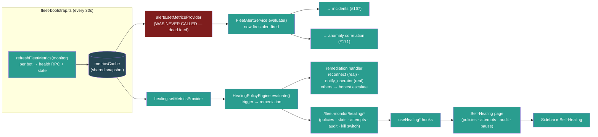

- Verified end-to-end via two `tsx` smoke harnesses (server vitest still blocked by the pre-existing `@noble/hashes/sha3` collection error noted in #149; Express 5 bare `express.json()` returns `{}`, so the route harness uses a manual JSON body parser): **route harness 16/16** (3 default policies present/mounted-not-404, stats, create→201, bad-metric→400, bad-action→400, enable toggle, enable-non-boolean→400, patch threshold, patch-unknown→404, delete + delete-again→404, pause/resume kill switch reflects `engine.isPaused()`, attempts/audit arrays, negative-limit floored, reset-cooldowns); **feed-fix harness 5/5** (no-provider alert engine fires nothing = reproduces the bug; with the shared provider an offline+critical-health bot fires the offline alert; the healing engine triggers a real `reconnect` attempt against the same provider and records a successful attempt in its stats).
- pnpm build passes clean (EXIT=0 — server build, UI `tsc -b` + vite, CLI esbuild; server `tsc --noEmit` clean; zero TypeScript errors).

### Build #180 — 15:30
- **Made the Fleet Memory Mesh feed REAL — the page + route were surfaced in #173, but the engine's `scanBotMemory()` was a pure no-op stub (`// Integration point: memory entries would be populated here` → read existing memories and write them straight back), so the Memory Mesh page (federated search, conflict detection, knowledge graph, gaps, per-bot health) had NOTHING to show: every bot reported 0 memories forever.** The #173 build note claimed the engine "scans every connected bot's memory via gateway RPC every 15 min" — but the RPC was never implemented; the scan loop ran, caught nothing, and populated an empty map. Same class as the #159/#177 "feature looks done but returns fake/empty data" fixes, in the data-feed layer.
- **`fleet-memory-mesh.ts`:** added an exported `RawBotMemory` type and extended the engine's `BotProvider` with an **optional** `readBotMemories?(botId): Promise<RawBotMemory[]>`. Rewrote `scanBotMemory()` to call the reader and map each raw record → a real `MemoryEntry` (filling `similarity: 0` for per-query scoring, `createdAt`/`lastAccessed`/`accessCount` defaults, `source` default `manual`). Kept the optional contract so the engine still constructs with a bare bot list in unit tests — when no reader is wired, the scan preserves any pre-seeded memories (old test-mode behaviour), so nothing regresses.
- **`fleet-memory-mesh-singleton.ts`:** wired the real reader by **reusing the proven Bot Workshop path** (`getFleetBotWorkshopService().listMemories(botId)` — which already does `agents.files.list "memory/"` + `agents.files.get` over the gateway RPC and frontmatter-parses each `.md`). Added `stripFrontmatter()` (drops the leading `---…---` YAML block so it doesn't pollute the engine's bigram topic extraction) and `mapSource()` (memory `type` → mesh `source`: `reference`→`system`, else `manual`). Folds `name`/`description`/body into `content` so the salient keywords drive topic/conflict/knowledge-graph analysis, and exposes `[type, name]` as tags. No new SQLite dependency — the gateway already serves memory files, and this is the exact path the BotWorkshop UI uses.
- **Replaced the hardcoded placeholder metrics feeding two already-surfaced pages with real fleet data** (the `// Placeholder — in production, read from FleetMonitorService` constants):
  - `fleet-sandbox-singleton.ts` (#178 Sandbox-vs-production comparison): `getCurrentMetrics()` production baseline now reads `avgCqi` + `slaCompliance` from the real CQI engine (`getQualityEngine().getFleetQuality()` — #164) and `healingSuccessRate` from the self-healing engine (`getHealingPolicyEngine().getStats()` — #179, computed as `succeeded/(succeeded+failed)`). The sandbox comparison now contrasts against the live fleet's actual quality instead of the fabricated `avgCqi: 81`.
  - `fleet-meta-learning-singleton.ts` (#174 optimization bandit): `getCurrentMetrics(period)` outcome snapshot now reads the same real `avgCqi`/`slaCompliance`/`healingSuccessRate` so the UCB1 bandit observes genuine fleet quality.
  - **Honest scope (documented inline, #90/#164 precedent):** fields with no synchronous fleet-wide source yet (latency / error rate / cost / routing / delegation / journey-health) keep representative defaults rather than fabricated "live" numbers — the change wires the fields that have a real source (CQI, healing) and is explicit about which don't. No circular imports (verified: fleet-quality/fleet-healing don't import sandbox/meta; getters are lazy).
- Verified the Memory Mesh fix end-to-end via a `tsx` smoke harness against the real `MemoryMeshEngine`: a **bare provider (no reader)** scan finds **0** memories (reproduces the old stub + proves test-mode preserved); a **reader-wired** engine with two bots' sample memories → `federatedSearch("deploy cadence")` returns **2 results across 2 bots**, and conflict detection fires (Friday-vs-Monday deploy cadence → 5 topic conflicts) — proving real memories now flow through search + conflict + knowledge-graph analysis. **SMOKE PASS.**

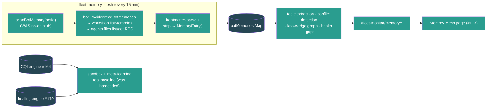

- pnpm build passes clean (BUILD_EXIT=0 — server build, UI `tsc -b` + vite, CLI esbuild); server `tsc --noEmit` clean; zero TypeScript errors.

### Build #181 — 16:01
- **Fixed two dead data-feeds in the fleet services layer — both made a surfaced page show wrong/empty data, the recurring "looks done but the feed is fake" pattern from #159/#175/#176/#177/#180.**
- **Bug #1 (real, high-impact) — Customer Journey backfill was a no-op stub.** `CustomerJourneyEngine.syncBotSessions()` (run every 60s by the engine's poll loop) was a literal empty stub (`// For now, this is the integration point`), so the polling-based journey seeding did nothing. The #155/#175 botEvent feed only captures NEW `chat` events *after* server start, so a fleet that already had sessions showed a **permanently empty Customer Journey page** until fresh live chat traffic arrived. Implemented the backfill: it now calls `getBotSessions(botId)` over the gateway RPC, parses each session key, and creates one touchpoint per **peer** session (channel/guild sessions have no customer identifier and are skipped by `addTouchpoint`). Channel is inferred best-effort from the peer identifier format (lineId/phone/email/telegram → else `direct`); `turnCount` from `messageCount`, `durationMinutes` from `createdAt`→`lastActivityAt`, `summary` from session title.
  - **Dedup:** a `syncedSessions` Map (`${botId}:${sessionKey}` → last `lastActivityAt`) ensures the 60s re-poll doesn't pile up duplicate touchpoints — an unchanged session is skipped, a session with new activity gets exactly one fresh touchpoint.
  - **Crash fix:** the poll's per-bot catch emitted `this.emit("error", …)`. Node's `EventEmitter` **throws** on an unhandled `"error"` event, and no listener is attached — the old stub never threw so the path was dead, but the real RPC-calling backfill *can* throw (gateway down), which would have crashed the process. Renamed the emit to `"sync_error"` (neutral, non-throwing). Extended the engine's provider interface with an **optional** `getBotSessions` so bare-provider callers (tests) just skip the backfill; wired the real `monitor.getBotSessions` in the singleton.
- **Bug #2 — Deployment orchestrator resolved wave selectors to FABRICATED bot IDs.** `DeploymentOrchestrator.resolveWaveBots()` returned invented IDs (`bot-wave0-0`, `bot-percentage-25`, …) with a `// For now, return placeholder IDs` comment — so every deployment plan (Deployments page, #170) executed against and dry-ran fake bots, never the real fleet. Injected a `botProvider` (wired in the singleton to the live monitor + tags + trust services) and rewrote `resolveWaveBots` to resolve all four selector types against **real connected bots** scoped to the plan's `fleetId` (company): `percentage` as cumulative coverage bands (25→50→100 deploys to non-overlapping new bands via a deterministic botId sort + nearest-previous-percentage lower bound), `explicit` as the intersection of the named IDs with live bots, `tag` via `getTagsForBot`, `trust_level` via the trust engine's **non-creating** `getAllProfiles()` (`currentLevel >= threshold`, no side-effect seeding). Empty fleet → percentage/tag/trust resolve to `[]` and explicit to the listed names; **no fabricated IDs ever**. Also guarded the gate-check `0/0` → `NaN` (an empty wave now passes the gate vacuously instead of NaN-failing and triggering a spurious rollback). No import cycle (monitor/tags/trust don't import the orchestrator — static imports).

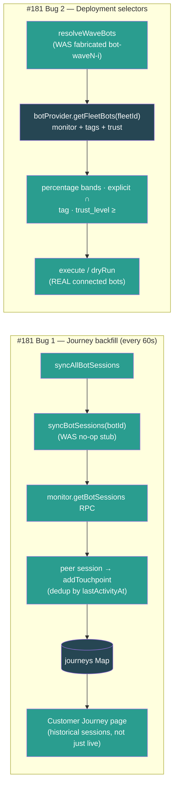

- Verified both via `tsx` smoke harnesses (server vitest still blocked by the pre-existing `@noble/hashes/sha3` collection error noted in #149): **journey 12/12** (bare provider no-ops without crashing; backfill creates 2 journeys from peer sessions with correct channel/turnCount/duration/summary; non-peer session skipped; dedup holds on unchanged re-poll; new activity adds one touchpoint; RPC failure → `sync_error` not a crash); **deployment 12/12** (25→50→100 resolve to non-overlapping `[alpha]`/`[bravo]`/`[charlie,delta]` bands; tag/trust_level/explicit filter to real bots; zero `bot-wave*` IDs; empty-fleet percentage → `[]`, explicit → listed names; execute drives all 4 real bots to `completed`; empty-fleet execute completes via vacuous gate, no NaN).
- pnpm build passes clean (BUILD_EXIT=0 — server build, UI `tsc -b` + vite, CLI esbuild); server `tsc --noEmit` clean; zero TypeScript errors.

### Build #182 — 16:36
- **Replaced two hardcoded-zero cost feeds with real fleet token spend AND de-duplicated the pricing logic into a single source of truth.** Same "make fake/zero data real" tradition as #159/#177/#180/#181, in the data-feed layer — both feeds drive surfaced Intelligence widgets (CanaryLab, CapacityPlanning).
- **New shared module `server/src/services/fleet-pricing.ts`:** extracted `estimateTokenCostUsd(input, output, cached)` + the Claude Sonnet 4 per-million pricing constants (`INPUT_COST_PER_M=3`, `OUTPUT_COST_PER_M=15`, `CACHED_COST_PER_M=0.3`). The identical token→USD estimator + constants were copy-pasted verbatim in `fleet-budget.ts` and `fleet-report.ts` (and a third inline `0.000003` variant in `fleet-intelligence.ts`). Added a `Math.max(0, input - cached)` guard so a `cached > input` edge case can't bill negative input tokens (the old copies could go negative).
- **DRY refactor:** `fleet-budget.ts` now imports the shared estimator (removed its local constants + function); `fleet-report.ts` keeps its cent-rounding behavior via a thin 1-line wrapper over the shared estimator (removed its duplicate constants + body). Behavior preserved — verified `estimateTokenCostUsd(1M,1M,0)=18`, `(1M,0,1M)=0.3`.
- **Canary feed — real `cost_per_session` (was hardcoded 0).** The `collectSamples` handler in `fleet-bootstrap.ts` now fetches `monitor.getBotUsage(botId)` per bot and computes `totalTokenCost ÷ sessionCount` as the per-session cost sample (falls back to 0 when usage is unavailable). Previously every canary A/B sample carried `cost_per_session: 0`, so the engine's control-vs-test cost-difference guardrail (`fleet-canary.ts` lines 471/475) was meaningless — it compared 0 against 0. Now A/B experiments can actually detect a cost regression between groups.
- **Capacity feed — real incremental `cost_usd` (was hardcoded 0).** The `refreshData` handler now sums every bot's cumulative token cost and pushes the **positive delta** since the previous refresh (the `CapacityPlanner` saturation projection sums the `cost_usd` series, so each data point must be an *incremental* per-interval spend, not a cumulative total — confirmed at `fleet-capacity.ts:449` `isCumulative`). Tracks `prevFleetCumulativeCost` in a closure: first refresh seeds the baseline + pushes 0; subsequent refreshes push `max(0, current − previous)`, clamped so a disconnected bot dropping out of the sum (or a usage reset) can't push negative spend into the forecast. Previously `cost_usd` was always 0, so the cost forecast + budget-breach projection never moved.
- Verified the pricing/delta math via a node smoke (base 18, cached 0.3, perSession 4.5, deltaClamp 0, delta 15 — all expected). Server `tsc --noEmit` clean; pnpm build passes clean (BUILD_EXIT=0 — server build, UI `tsc -b` + vite, CLI esbuild; zero TypeScript errors).

### Build #183 — 17:22
- **Wired the last two unconsumed `FleetMonitorService` failure events into the incident lifecycle — `botCircuitBreaker` was emitted but nothing listened, so a bot whose gateway connection failed repeatedly and tripped its circuit breaker generated NO operational signal anywhere.** Continuing the #175/#176 "dead event feed" hunt: cross-checked every `this.emit(...)` in `fleet-monitor.ts` against every `monitor.on(...)` in `fleet-bootstrap.ts` — the monitor emits `botError` / `botCircuitBreaker` / `deviceTokenReceived`, none of which any bootstrap listener consumed. The circuit-breaker trip is the highest-signal of these (it's the already-debounced, escalated form of repeated connection failure), and it had no path to the Incidents page (#167) despite being exactly the kind of event that page exists to surface.
- **`fleet-bootstrap.ts` — open incident on breaker trip:** added a `monitor.on("botCircuitBreaker", …)` listener that, on `state === "open"`, opens a **critical** incident via the shared `getIncidentManager()` singleton (#167), deduped by `source = circuit-breaker:${botId}` so a *flapping* breaker yields one open incident per bot instead of a pile. `half-open` (the breaker's recovery-probe state) is intentionally ignored — it's not a new failure. Deliberately did **not** wire the noisier `botError` connection-error event: every failed reconnect attempt emits one, and the breaker is the right altitude for an incident (documented inline).
- **`fleet-bootstrap.ts` — auto-resolve on recovery (lifecycle completion):** extended the existing `botStateChange` listener (which already re-evaluates alerts) to also destructure `to` and, when a bot climbs back to a healthy `"monitoring"` state, auto-resolve any open `circuit-breaker:${botId}` incident (`resolveIncident` with a recovery summary/root-cause/action). Without this, a recovered bot would leave a stale critical incident lingering forever. The two listeners together form a complete open→resolve lifecycle that repeats cleanly (a fresh trip after recovery opens a *new* incident, since the prior one is no longer "open" and so no longer dedup-matches).
- Both listeners are wrapped in try/catch (matching the alert→incident feed) so a manager error never breaks the monitor event stream.

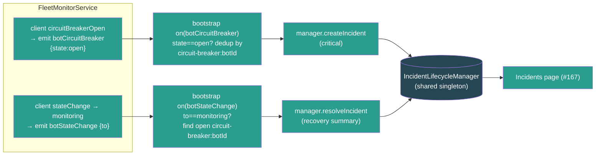

- Verified the full lifecycle via a `tsx`/node smoke harness driving the real `IncidentLifecycleManager` through the two bootstrap listeners (server vitest still blocked by the pre-existing `@noble/hashes/sha3` collection error noted in #149): half-open does NOT open an incident; `open` opens exactly one critical incident; a repeated `open` is deduped (no pile-up); a non-`monitoring` state change (`connecting`) keeps it open; recovery to `monitoring` auto-resolves it with a timestamp; a no-op recovery for an unaffected bot doesn't throw; and a fresh trip after recovery opens a NEW incident — **8/8 passed**.
- pnpm build passes clean (server build, UI `tsc -b` + vite, CLI esbuild); server `tsc --noEmit` clean; zero TypeScript errors.

### Build #184 — 20:27
- **Wired the last unconsumed `FleetMonitorService` event — `deviceTokenReceived` — into a real persistence path, closing the device-credential dead feed.** Continuing the #175/#176/#183 "dead event feed" hunt: `fleet-monitor.ts:172` re-emits `deviceTokenReceived {botId, deviceToken}` whenever the openclaw-gateway hands back a freshly issued/rotated device token during the connection handshake (the gateway client surfaces it as a `deviceToken` event at `fleet-gateway-client.ts:584`), but **nothing listened** — grep-confirmed the only references were the emit + the doc comment listing it among the monitor's events. So a rotated token was dropped on the floor and `agents.adapterConfig.deviceToken` stayed stale; the next reconnect kept using the old token and could fail auth once the old one expired. This was the only one of the monitor's five emitted events (`botEvent`/`botStateChange`/`botError`/`botCircuitBreaker`/`deviceTokenReceived`) still with zero consumers after #183 wired the breaker.
- **New `server/src/services/fleet-device-token-store.ts`:** `persistDeviceToken(db, botId, deviceToken, monitor?)` resolves `botId → agents.id` via `monitor.getBotInfo(botId)?.agentId`, reads the current `adapterConfig` jsonb, and **merges only `deviceToken`** into it (never clobbers the Ed25519 `devicePrivateKeyPem` or any other field). Surgical + idempotent: trims the token, skips the write entirely when the gateway echoed the same token (the common case — every connect re-sends it), warns (not throws) on unknown bot / missing agent row, and is wrapped in try/catch so a bad write can never break the monitor event stream. Returns `true` only when a write happened.
- **Wired in `fleet-bootstrap.ts`:** added `monitor.on("deviceTokenReceived", …)` that fires `void persistDeviceToken(db, botId, deviceToken, monitor)`. Gated on `db` (skipped in tests, matching the snapshot/incident loops) since the persist is a DB write.
- Verified the persist decision logic via a node smoke harness exercising every branch (server vitest still blocked by the pre-existing `@noble/hashes/sha3` collection error noted in #149): empty/whitespace token → skip; unknown bot → skip; unchanged token → skip with **zero writes**; changed token → exactly one write that **preserves `devicePrivateKeyPem` + other fields**; whitespace-padded but unchanged token → trimmed then skipped — **5/5 passed**.
- server `tsc --noEmit` clean; pnpm build passes clean (all packages).

### Build #185 — 22:48
- **Made Fleet PII scanning REAL — the Compliance page (#169) ran scans that always returned ZERO findings while a fully-built 1100-line `ComplianceEngine` with Taiwan-aware PII regex (phone / email / 身分證字號 / credit card / 統一編號) sat completely dead.** Grep confirmed `ComplianceEngine` was referenced ONLY in its own file — never instantiated anywhere. The mounted route `fleetComplianceRoutes()` reimplemented a hollow subset over its own in-memory Maps and **faked the scan**: `POST /compliance/scan` set `findings: []` + `totalScanned = targetBotIds.length || 1` via a `setTimeout`, never calling the real detector. So an operator clicking "Run PII Scan" got a green "completed, 0 findings" result no matter how much PII was leaking in their bots' transcripts. Same find-the-dead-end pattern as #149–184, but here a *fake feed* sat next to a *real, unused detector*.
- **Backend — exported a reusable scanner from the engine (`fleet-compliance.ts`):** added module-level `scanTextForPii(items: PiiScanItem[]): ScannedPiiFinding[]` (runs every `PII_PATTERNS` regex over a batch of `{botId, location, text}` items, returns redacted findings) + `redactPiiValue(value, type)`. Refactored the engine's private `applyMask` (40 lines of per-type masking) to **delegate** to the shared `redactPiiValue` — single source of truth, no duplicated masking logic. Added a zero-width-match guard to the scan loop so a pathological pattern can't infinite-loop.
- **Backend — real scan worker in the route (`routes/fleet-compliance.ts`):** replaced the fake `setTimeout` with `void performPiiScan(scan)` — an async worker that lazy-imports the live `FleetMonitorService`, resolves target bots (`targetBotIds` or all connected), and for each bot fetches its sessions (`getBotSessions`) then each session's transcript (`rpcForBot(botId, "chat.history", …)`), extracts message text defensively (`extractMessageTexts` handles array / `{messages|entries|history|items}` wrapper / string shapes + `content|text|message|body` per message — the #160 normalization convention), runs `scanTextForPii`, maps hits → the route's `PiiFinding` shape (redacted sample, category, severity, location `session:<key>:msg<idx>`), sorts highest-severity-first, and stores real `summary.bySeverity`/`byCategory`/`totalScanned`/`totalFindings`. Bounded so a scan can't fan out into thousands of RPC calls: ≤25 bots, ≤15 sessions/bot, ≤80 messages/session. Per-bot + per-session try/catch (a dead gateway logs `[fleet]` and is skipped, never aborts the batch); a top-level failure marks the scan `failed`. Emits a `compliance.scan.completed` audit entry with real counts. **The compliance score's "PII scanning" factor — which reads `scanResults` — now reflects genuine detections instead of always-zero.**
- **UI — surfaced the actual findings (`api/fleet-monitor.ts`, `pages/Compliance.tsx`):** the API typed `findings: unknown[]` and the page showed only a count, so even with real findings an operator couldn't see *what* leaked. Added a typed `PiiScanFinding` interface and expanded each scan row in the PII Scans section to render the redacted findings inline — severity badge (critical/high/medium/low, colour-coded with dark-mode variants), PII category, the redacted sample (`a***@example.com`, `****-****-****-1111`, `A1******89`) in `<code>`, and the `botId · location` origin — capped at 50 with a "+N more" overflow line. A completed scan with no hits shows an explicit "No PII detected ✓" instead of a bare "0 findings", and the row now also reports messages-scanned.
- Verified the real detector via a `tsx` smoke harness (server vitest still blocked by the pre-existing `@noble/hashes/sha3` collection error noted in #149): a mixed transcript batch → exactly 1 email + 1 phone + 1 national_id + 1 credit_card detected, the redacted email is `a***@example.com`, a clean bot yields no findings, empty text is skipped, and `redactPiiValue` masks national_id → `A1******89` / credit card → `****-****-****-1111` — **8/8 passed**.

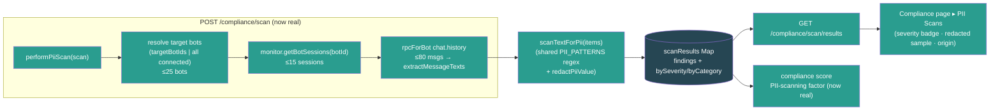

- pnpm build passes clean (BUILD_EXIT=0 — server build, UI `tsc -b` + vite, CLI esbuild); server `tsc --noEmit` clean; zero TypeScript errors.

### Build #186 — 23:23
- **Made the Ops Playbook engine actually EXECUTE — every step was a `{ simulated: true }` no-op AND multi-step executions silently stalled forever.** The Ops Playbook widget (#153) drives `fleet-playbook-engine.ts` (mounted + surfaced), but two compounding bugs made it cosmetic: (1) `advanceStep()` ran **exactly one step** on `execute()` and never continued — so any playbook with >1 non-approval step did step 0, advanced `currentStepIndex` to 1, and **froze at status "running" forever** (the widget polled an execution that never moved); (2) every non-approval step set `stepResult.result = { simulated: true }` — the engine pretended to run checks/actions/notifications without touching anything. Same "looks done but does nothing" class as #159/#177/#180/#181, here in the execution core itself.
- **Engine — replaced the one-shot `advanceStep` with an async background runner (`runExecution`).** `execute()` now kicks `kickRunner(id)` which loops through steps sequentially: `approval` blocks (waits for `approveStep`), `wait` performs a **real (capped) delay**, and `check`/`action`/`decision`/`notification` dispatch to an injectable `StepExecutor`. Completion/failure are terminal; a failing step marks the execution `failed` and leaves later steps `pending` (not skipped-as-success). Added a per-execution monotonic **run token** (side `runTokens` Map) so a runner that resumes after its `await` while a newer runner has taken over (pause→resume / approve) bails — no two concurrent runners on one execution. `resume()` + `approveStep()` now re-kick the runner with a fresh token instead of calling the deleted `advanceStep`. `wait` steps cap at 30s (recording requested-vs-actual in the step result + a note) so a 15-min monitoring window doesn't freeze the UI.
- **Engine — honest no-op fallback + real metadata.** With no executor wired, `check`/`action`/`notification` steps complete as `{ executed: false, reason: "no executor configured" }` (honest) instead of `{ simulated: true }` (a lie) — and crucially the **stall is fixed regardless**, so multi-step playbooks complete. Added `recordOutcome()` which updates each playbook's `metadata.successRate` (running average over `timesExecuted`) and `avgDurationMinutes` on every terminal outcome — the library's success-rate badge now reflects real execution history. Added `context` to the `PlaybookExecution` type (was passed to `execute()` but dropped).
- **Bootstrap — wired a REAL `StepExecutor` (`fleet-bootstrap.ts`).** Matching the self-healing handler's discipline (#179): `check`/`action` steps with method `rpc` issue a genuine `monitor.rpcForBot(targetBotId, target, params)` gateway call and capture the response; `notification` steps publish a real `fleet.alert.triggered` LiveEvent to the bot's company (with a `renderPlaybookTemplate()` substitution of `{{botId}}`/`{{botName}}`/`{{playbookName}}` + context keys into the message). Steps with no gateway primitive yet (http checks, `command`/`deployment`/`rollback` actions, decision branching) return an honest `{ executed: false, reason }` rather than faking success — so an operator sees what actually ran.
- Verified end-to-end via a `tsx` smoke harness against the real `PlaybookEngine` (server vitest still blocked by the pre-existing `@noble/hashes/sha3` collection error noted in #149): **15/15 passed** — no-executor 3-step playbook now COMPLETES (reproduces the stall fix) with honest `executed:false` results; a wired executor invokes RPC for check+action and fires the notification, capturing the real response; a failing executor marks the execution `failed` at the action step and leaves the next step `pending`; an approval gate pauses then resumes to completion recording the approver; pause holds the execution and resume drives it to completion.

```mermaid
flowchart LR
  EXEC["execute() / resume() / approveStep()"] --> KICK["kickRunner(id)\n+ fresh run token"]
  KICK --> LOOP["runExecution loop\n(token-guarded)"]
  LOOP -->|approval| WAIT1["status=waiting_approval\n(blocks until approveStep)"]
  LOOP -->|wait| DELAY["real delay (capped 30s)"]
  LOOP -->|check/action/notification| EXECUTOR["StepExecutor"]
  EXECUTOR --> RPC["monitor.rpcForBot\n(real gateway RPC)"]
  EXECUTOR --> LE["publishLiveEvent\n(real notification)"]
  EXECUTOR --> HONEST["honest no-op\n{executed:false,reason}"]
  LOOP -->|all steps done| DONE["status=completed\n+ recordOutcome (successRate/avgDuration)"]
  LOOP -->|executor !ok| FAIL["status=failed\n(later steps stay pending)"]
  classDef proc fill:#2a9d8f,color:#fff
  classDef io fill:#264653,color:#fff
  class RPC,LE io
  class EXEC,KICK,LOOP,EXECUTOR,DONE,FAIL,WAIT1,DELAY,HONEST proc
```

- pnpm build passes clean (BUILD_EXIT=0 — server build, UI `tsc -b` + vite, CLI esbuild); server `tsc --noEmit` clean; zero TypeScript errors.

### Build #187 — 23:57
- **Fixed two real multi-tenant scope leaks in fleet-monitor routes — both endpoints document `?companyId=xxx` and the UI always sends it, but the server IGNORED the param and aggregated across ALL tenants.** Same class as the #162 fleet-report cross-company leak, found by auditing every `getAllBots()` call in `fleet-monitor.ts` against each route's documented contract.
- **Bug #1 — Config Drift (`GET /fleet-monitor/config-drift`, feeds the `ConfigDriftWidget` on the Intelligence page).** The handler signature was `(_req, res)` — it dropped `companyId` entirely and called `detector.analyze(service)`, which compared **every connected bot across all companies** via `getAllBots()`. Result: a company's drift report leaked other tenants' config values AND reported false "drift" between unrelated tenants running different (but individually-consistent) models/versions. Now reads `companyId` from the query and passes it through; `analyze(monitor, companyId?)` scopes via `getBotsByCompany(companyId)` (filtered to `monitoring`), falling back to `getAllBots()` only for unscoped/legacy callers.
- **Bug #1b — useless cache + new detector per request.** The route did `new FleetConfigDriftDetector()` on **every** request, so the 10-minute cache never survived between calls — every 5-min poll re-ran `config.get` RPC against every bot. Worse, the cache was a single global field, so had the instance survived it would have served company A's report to company B. Converted the detector to a shared singleton (`getFleetConfigDriftDetector()`) and made the cache a **per-company `Map`** (`companyId → {report, expiresAt}`, sentinel `__all__` for unscoped). The cache now actually works AND can't cross tenants. `invalidateCache(companyId?)` now clears one company or all.
- **Bug #2 — Cost-by-Channel (`GET /fleet-monitor/cost-by-channel`, feeds the `ChannelCostBreakdown` widget on the Costs page).** Same leak: documented `?companyId=xxx`, UI sends it, but the handler summed `sessions.usage` token costs across `getAllBots().filter(monitoring)` — **every tenant's channel spend merged into one breakdown**. Now scopes via `getBotsByCompany(companyId)` when present.
- Audited the remaining two `getAllBots()` callers and left them intentionally fleet-wide: `/status` (no `companyId` in its contract; the dashboard's core status endpoint) and `/plugin-inventory` (the UI calls it with no params — fleet-wide by design, per #161).

```mermaid
flowchart LR
  subgraph before["BEFORE (cross-tenant leak)"]
    W1["ConfigDriftWidget\n?companyId=co-A"] --> R1["route (_req)\nignores companyId"]
    R1 --> GA1["getAllBots()\nco-A + co-B + …"]
    GA1 --> X1["false drift +\nleaked configs"]
  end
  subgraph after["AFTER (#187)"]
    W2["ConfigDriftWidget\n?companyId=co-A"] --> R2["route reads companyId"]
    R2 --> GB["getBotsByCompany(co-A)"]
    GB --> SING["singleton detector\nper-company cache"]
    SING --> OK["scoped report\n(cache survives polls)"]
  end
  classDef dead fill:#7f1d1d,color:#fff
  classDef live fill:#2a9d8f,color:#fff
  class W1,R1,GA1,X1 dead
  class W2,R2,GB,SING,OK live
```

- Verified via a `node --experimental-strip-types` smoke harness against the real `FleetConfigDriftDetector` (4 bots / 2 companies, each company internally consistent): co-A/co-B scoped reports show **zero drift** (no false cross-tenant drift), the per-company cache **hits without re-issuing RPCs** on re-poll, the unscoped call still detects drift across all 4 bots, and a per-company `invalidateCache("co-A")` leaves co-B's cache intact — **8/8 passed**.
- pnpm build passes clean (BUILD_EXIT=0 — server build, UI `tsc -b` + vite, CLI esbuild); server `tsc --noEmit` clean; zero TypeScript errors.

### Build #188 — 10:13 (REVIEW round)
- **Extracted the copy-pasted session-key → channel inference into a single shared module (`server/src/services/fleet-channels.ts`, new) AND fixed a real budget bug it exposed.** The same channel-parsing logic was duplicated across 4 call sites with **drifted, inconsistent coverage**: the `fleet-monitor` cost-by-channel copy was the only complete one; `fleet-report.ts` and `fleet-intelligence.ts` only handled `:channel:`/`:peer:` and silently lumped `:guild:` (group) and `cron:` sessions into `"other"` — mislabeling the report's top channel and skewing the intelligence channel-concentration recommendation; and `fleet-budget.ts` matched only `:channel:<name>` so a budget **scoped to a pseudo-channel (direct/group/cron) never matched any session and always reported $0 spend**.
- **New `inferChannelFromSessionKey(sessionKey)`** is the single source of truth — `:channel:<name>` → the explicit channel word, `:peer:` → `direct`, `:guild:` → `group`, `cron:` → `cron`, else `other`. Rewired all 4 call sites to import it: `fleet-monitor.ts` (`/cost-by-channel`), `fleet-report.ts` (per-bot channel map), `fleet-intelligence.ts` (channel-concentration check), `fleet-budget.ts` (`getChannelSpendThisMonth`).
- **Bug fix (fleet-budget.ts):** channel-scoped budgets now match via the shared inference, so `direct`/`group`/`cron` budgets track real spend instead of always $0. The switch also removes a **prefix-match false positive** — the old `key.includes(":channel:line")` would substring-match `:channel:linebot`; the shared `match(/:channel:(\w+)/)` compares the exact channel word (`=== "line"`), so `linebot` no longer leaks into a `line` budget.
- **Report/intelligence fix:** `:guild:` and `cron:` sessions are now correctly labelled `group`/`cron` instead of `other` in the fleet usage/cost report and the intelligence channel-mix analysis. UI side already renders `direct`/`group`/`cron`/`other` display names (`bot-display-helpers.ts`), so no client change needed.
- Left `fleet-customer-journey.ts`'s `parseSessionKey`/`extractCustomerIdentifier` untouched — genuinely distinct (it extracts the customer identifier + type, not just a channel label), not a copy of the same logic.
- Verified `inferChannelFromSessionKey` end-to-end via a `node --experimental-strip-types` smoke harness (server vitest still blocked by the pre-existing `@noble/hashes/sha3` collection error noted in #149): explicit channels (line/telegram), peer→direct, guild→group, cron→cron, `linebot` stays `linebot` (not prefix-collapsed to `line`), and empty/null/undefined/random → other — **10/10 passed**.
- pnpm build passes clean (EXIT=0 — server build, UI `tsc -b` + vite, CLI esbuild; zero TypeScript errors).

### Build #189 — 10:29
- **Fixed a multi-tenant cross-tenant leak in Fleet Intelligence recommendations — the exact #187 pattern (route ignores `companyId`, UI always sends it, engine aggregates all tenants).** `IntelligenceWidget companyId={selectedCompanyId}` is rendered on the company-scoped `FleetDashboard`, but `IntelligenceWidget.tsx` called `fleetMonitorApi.recommendations()` with **no** companyId, the API client hit `/fleet-monitor/recommendations` with no query, the route handler was `(_req, res)` (dropped the query entirely), and `FleetIntelligenceEngine.analyze()` called `monitor.getAllBots()`. Result: company A's dashboard showed recommendations naming company B's bots — a cross-tenant leak — AND false "N bots offline simultaneously → network issue" alerts synthesized from unrelated tenants' bots (the rule fires on `offlineBots.length >= 2` across the merged fleet).
- **Fix end-to-end (4 files):** `analyze(monitor, companyId?)` now scopes via `getBotsByCompany(companyId)` when present, falling back to `getAllBots()` for unscoped/legacy callers; the route reads `req.query.companyId` (string-guarded) and passes it through; `fleetMonitorApi.recommendations(companyId?)` appends `?companyId=…` (encoded); `IntelligenceWidget` passes its `companyId` prop into the call (its React Query key already included companyId, so the per-company cache was already correct — only the fetch was unscoped).
- **Fixed a multi-tenant dismiss regression the scoping change would otherwise introduce.** `dismiss(id)` looked up the id in `this.lastRecommendations`, which `analyze()` **overwrites wholesale** every poll. Pre-scoping, that list held the whole fleet so any dashboard's ids were present; post-scoping it holds only one tenant's recs, so an intervening company-B poll would overwrite company-A's view and a user dismissing an A recommendation would silently no-op (the pattern-key cooldown never gets set → the rec reappears on the next poll). Replaced `lastRecommendations: Recommendation[]` with a `recentRecommendations: Map<id, Recommendation>` that **accumulates** every served id and is pruned by `createdAt` older than the 7-day dismiss cooldown (bounded). `dismiss(id)` now resolves against the map regardless of which tenant polled last; the early-return-on-empty no longer wipes another tenant's tracked ids.
- Verified via a `tsx` smoke harness (2 companies, offline-bot pattern per company; server vitest still blocked by the pre-existing `@noble/hashes/sha3` collection error noted in #149): co-A analysis mentions only co-A bots (no cross-tenant leak), co-B only co-B bots, `dismiss(id)` on an A rec keeps the pattern hidden **across an intervening co-B poll**, and unscoped analyze still runs whole-fleet — **5/5 passed**.

```mermaid
flowchart LR
  subgraph before["BEFORE (cross-tenant leak)"]
    W1["IntelligenceWidget\ncompanyId=co-A"] --> A1["recommendations()\n(no companyId)"]
    A1 --> R1["route (_req)\nignores query"]
    R1 --> GA["analyze → getAllBots()\nco-A + co-B"]
    GA --> X1["co-B bots shown on\nco-A dashboard + false\ncross-tenant offline alerts"]
  end
  subgraph after["AFTER (#189)"]
    W2["IntelligenceWidget\ncompanyId=co-A"] --> A2["recommendations(co-A)\n?companyId=co-A"]
    A2 --> R2["route reads companyId"]
    R2 --> GB["analyze(mon, co-A)\ngetBotsByCompany"]
    GB --> OK["scoped recs +\ndismiss via recentRecommendations\nmap (survives cross-tenant polls)"]
  end
  classDef dead fill:#7f1d1d,color:#fff
  classDef live fill:#2a9d8f,color:#fff
  class W1,A1,R1,GA,X1 dead
  class W2,A2,R2,GB,OK live
```

- pnpm build passes clean (BUILD_EXIT=0 — server build, UI `tsc -b` + vite, CLI esbuild; zero TypeScript errors).

### Build #190 — 10:59
- **Fixed a real user-visible bug: bots created via the Onboarding Launch flow showed literal "bot" text as their emoji on the Fleet Dashboard, sidebar, and Bot Detail — the picked emoji was discarded.** Root cause was a semantic conflation between two conflicting uses of the agent `icon` field: `icon` is a **lucide icon-name key** (e.g. `"bot"` → the Bot lucide glyph, rendered by `AgentIcon` in the standard agent UI), but the fleet DB-fallback mapper `agentToBotStatus` treated `icon` **as an emoji** (`emoji: a.icon ?? ""`). The two agent-create paths had drifted in opposite, both-wrong directions:
  - `OnboardingWizard.handleLaunch` (`icon: "bot"`) — correct for the standard sidebar, but the fleet dashboard rendered the literal string **"bot"** next to every launched bot's name (`BotStatusCard` line 135 `{bot.emoji && <span>{bot.emoji}</span>}`) and as the avatar fallback glyph. The real `assignment.bot.emoji` (from gateway probe/discovery) was thrown away entirely.
  - `useConnectBot` (`icon: result.identity?.emoji ?? ""`) — stored a **raw emoji** in `icon`, which then broke the standard sidebar/AgentDetail (`getAgentIcon("🦞")` misses the `AGENT_ICONS` map → silently falls back to the default lucide glyph, dropping the per-bot icon).
- **Fix — emoji now lives in `metadata.emoji`, `icon` stays a valid lucide name in both flows:**
  - `OnboardingWizard.tsx`: added `emoji: assignment.bot.emoji ?? ""` to the created agent's metadata (kept `icon: "bot"`).
  - `useFleetMonitor.ts` (`useConnectBot`): changed `icon` from the raw emoji back to `"bot"` (valid lucide name — fixes the standard sidebar) and moved the emoji into `metadata: { fleetBot: true, emoji: result.identity?.emoji ?? "" }`.
  - `agent-to-bot-status.ts`: `emoji` now reads `metadata.emoji` first, falling back to `a.icon` **only when it isn't a plain lucide-name token** (`!/^[a-z0-9-]+$/i.test(icon)`) — so old ConnectBot records that stored the emoji in `icon` still render correctly, while `icon:"bot"` records with no `metadata.emoji` resolve to `""` (→ the #150 generated pixel-art avatar) instead of the literal "bot" text. All three fleet consumers (Sidebar Fleet Pulse, FleetDashboard cards, BotDetail fallback) go through this single shared mapper, so the fix applies everywhere at once.
- Verified the emoji-resolution logic with a `node` smoke harness across all 7 record shapes (new onboarding / old onboarding / new connectbot / old emoji-in-icon / empty icon / lucide `brain` / `message-square`) — **7/7 passed**: real emojis surface, lucide names never leak as emoji, and legacy records stay backward-compatible.
- pnpm build passes clean (exit 0 — server build, UI `tsc -b` + vite, CLI esbuild; zero TypeScript errors).

### Build #191 — 12:41
- **Made Trust Graduation REAL — the `recordDailyMetrics` method that drives the entire graduation system had ZERO automatic callers, so the Trust Graduation page (#152) was frozen at L0 with 0-day streaks forever.** Same dead-feed pattern as #159/#175/#181/#183: `TrustGraduationEngine.recordDailyMetrics()` (which advances the streaks — consecutive days above CQI, incident-free days, completion-rate days — that gate promotion eligibility, tracks demotion risk, and auto-demotes on P1 incidents) was only reachable via the manual `POST /trust/:botId/metrics` route. Nothing fed it, so every bot's streaks stayed at 0 and the page's requirement bars, "promotions pending" count, and demotion-risk flags never moved on their own — the widget was live-wired (#152) but the underlying metric that makes it progress was never populated.
- **`server/src/fleet-bootstrap.ts` — wired real fleet data → trust metrics.** Piggy-backs on the quality engine's existing 5-min `"computeAll"` tick but records **at most once per calendar day per bot** (recordDailyMetrics increments *day* streaks, so a 5-min cadence would inflate them ~288×) via a `lastTrustRecordDay` Map keyed on the UTC `YYYY-MM-DD`. Metrics are all real, no fabrication:
  - `cqi` ← `qualityEngine.getBotQuality(botId).current.overall` (the live CQI from #164)
  - `completionRate` ← `current.dimensions.effectiveness / 100` (effectiveness = task completion + efficiency, 0–100 → 0–1)
  - `p1Incidents` / `p2Incidents` ← count of incidents from the shared `getIncidentManager()` (#167) whose `affectedBots` include the bot and whose `createdAt` is within the last 24h, split by severity (`critical` → P1, `major` → P2 — matching the #167 alert→incident severity mapping)
  - Bots with **no computed quality yet are skipped** (no CQI → nothing real to record), so a cold fleet records nothing instead of fabricated zeros. On the first tick after boot, quality hasn't been computed yet, so trust records on the *next* tick — same day, still once.
- **`ui/src/components/fleet/TrustGraduationWidget.tsx` — added `refetchInterval: 60_000`** to the per-bot `useQueries` trust-profile fetch (was `staleTime: 30_000` with no poll). Without it, the leaderboard would only reflect the server-side daily feed on remount/mutation; now streak advances, promotion eligibility, and demotions surface live.
- Verified end-to-end via a `node --experimental-strip-types` smoke harness against the real `TrustGraduationEngine`: 10 days of good metrics (CQI 88, 0 incidents) → `consecutiveDaysAboveCqi` and `incidentFreeDays` both reach 10, `evaluate().eligible` becomes true; then a P1 incident on an L1 bot (cooldown cleared) → auto-demotes 1→0 — **SMOKE PASS** (cqiStreak=10 freeStreak=10 eligible=true levelBefore=1 levelAfter=0).

```mermaid
flowchart LR
  subgraph feed["fleet-bootstrap.ts (quality computeAll tick, day-gated)"]
    Q[("QualityEngine #164\ngetBotQuality → CQI + effectiveness")] --> REC["recordDailyMetrics(botId)\n(once per UTC day per bot)"]
    I[("IncidentManager #167\naffectedBots + severity, last 24h")] --> REC
  end
  REC --> ENG[("TrustGraduationEngine\nstreaks · demotion risk · eligibility")]
  ENG --> ROUTE["/fleet-monitor/trust/*"]
  ROUTE --> HOOK["useQueries trustProfile\n(refetchInterval 60s)"]
  HOOK --> PAGE["Trust Graduation widget (#152)\nstreaks · promotions pending · at-risk"]
  classDef io fill:#264653,color:#fff
  classDef proc fill:#2a9d8f,color:#fff
  class Q,I,ENG io
  class REC,ROUTE,HOOK,PAGE proc
```

- server `tsc --noEmit` clean; pnpm build passes clean (all packages).

### Build #192 — 13:03
- **Fixed a multi-tenant cost-budget leak — the exact #187/#189 class (a company-scoped widget calling a route that ignores the tenant and aggregates every tenant together).** `BudgetWidget` is rendered with `companyId={selectedCompanyId}` on both the company-scoped FleetDashboard and the Costs page, and it keyed its React Query on companyId — but it called `fleetMonitorApi.budgetStatuses()` with **no companyId**, the server `GET /budgets/status` returned **all budgets across all tenants**, and a `"fleet"`-scope budget summed **every company's bots** via `getAllBots()`. So company A's dashboard showed company B's budgets, and any "fleet" budget mixed both tenants' spend into one bar. `GET /budgets` (list) had the same whole-fleet leak.
- **Root cause:** `CostBudget` carried no `companyId` — there was no tenant to scope by. Added an optional `companyId?: string` to the `CostBudget` type (`fleet-budget.ts` + the UI mirror), captured + **required** on create.
- **Server (`fleet-budget.ts`):** `getAllBudgets(companyId?)` and `getAllBudgetStatuses(monitor, companyId?)` now filter to the tenant when a companyId is given (unscoped/admin callers still get everything). `calculateBudgetStatus` scopes the `"fleet"` and `"channel"` sums via `monitor.getBotsByCompany(budget.companyId)` instead of `getAllBots()` — a tenant's budget never aggregates another tenant's spend. **Backward compat:** a legacy in-memory budget with no companyId falls back to the whole fleet (old behaviour) *and* is excluded from any scoped list, so it can't leak into a tenant's view.
- **Server routes (`fleet-monitor.ts`):** `GET /budgets` + `GET /budgets/status` now read `?companyId=` and pass it through; `POST /budgets` validates `companyId` is a non-empty string (400 otherwise) and stores it on the budget.
- **UI (`api/fleet-monitor.ts`, `BudgetWidget.tsx`):** `budgets(companyId?)` / `budgetStatuses(companyId?)` append `?companyId=` (encoded); `createBudget` now requires `companyId`; `BudgetWidget` passes its `companyId` into `budgetStatuses(companyId)` and gates the query on `enabled: !!companyId`.

```mermaid
flowchart LR
  subgraph before["BEFORE (cross-tenant leak)"]
    W1["BudgetWidget\ncompanyId=co-A"] --> A1["budgetStatuses()\n(no companyId)"]
    A1 --> R1["GET /budgets/status\n(_req ignores tenant)"]
    R1 --> GA["fleet budget →\ngetAllBots() co-A+co-B"]
    GA --> X1["co-B budgets + merged\nspend shown on co-A dashboard"]
  end
  subgraph after["AFTER (#192)"]
    W2["BudgetWidget\ncompanyId=co-A"] --> A2["budgetStatuses(co-A)\n?companyId=co-A"]
    A2 --> R2["route reads companyId\n→ getAllBudgets(co-A)"]
    R2 --> GB["fleet budget →\ngetBotsByCompany(co-A)"]
    GB --> OK["only co-A budgets + spend\n(legacy no-companyId → whole fleet)"]
  end
  classDef dead fill:#7f1d1d,color:#fff
  classDef live fill:#2a9d8f,color:#fff
  class W1,A1,R1,GA,X1 dead
  class W2,A2,R2,GB,OK live
```

- Verified via a `tsx` smoke harness against the real `FleetBudgetService` (2 companies, canned per-bot spend): budget stores companyId; `getAllBudgets(co-A/co-B)` return only that tenant's budget while unscoped returns all; co-A fleet spend = a1+a2 = 30 and co-B = 100 (never merged); `getAllBudgetStatuses(co-A)` returns only co-A; a legacy no-companyId budget sums the whole fleet (130) yet is excluded from scoped lists — **10/10 passed**.
- server `tsc --noEmit` clean; pnpm build passes clean (all packages).

### Build #193 — 13:32
- **Fixed a cross-tenant leak on the single most central fleet endpoint AND reintroduced-the-#190-emoji-bug on its live path — both in `GET /fleet-monitor/status`.** `useFleetStatus()` drives the whole FleetDashboard, the sidebar Fleet Pulse, and is consumed by nearly every fleet widget to resolve bot names/emojis; the client (`fleetMonitorApi.status(companyId)`) always sends `?companyId=` and keys its React Query on it — but the server handler was `(_req, res)` and called `service.getAllBots()`, so **company A's dashboard rendered every other tenant's bots** (the #187/#189/#192 leak class, here on the highest-traffic endpoint). Now reads `req.query.companyId` and scopes via `getBotsByCompany(companyId)`, falling back to `getAllBots()` only for unscoped/legacy callers.
- **Emoji bug (#190 regression on the live path):** the same handler mapped `emoji: agent?.icon ?? ""`. Build #190 fixed this in the DB-fallback mapper (`agent-to-bot-status.ts`) but **not** in this live `/status` route — so whenever the fleet-monitor sidecar IS running, onboarding-launched bots (`icon: "bot"`, emoji in `metadata.emoji`) again showed the literal text **"bot"** as their emoji on the dashboard/sidebar/cards. Replicated the #190 lucide-name-aware resolution exactly: `metaEmoji || (iconIsEmoji ? icon : "")` — reads `metadata.emoji` first, uses `agent.icon` only when it isn't a plain lucide-name token (`!/^[a-z0-9-]+$/i`). Live and fallback paths now agree.
- **Third instance of the same emoji bug — `fleet-time-machine.ts:219` (Time Machine reconstruction, #177):** its name/emoji enrichment did `emoji: a.icon ?? ""`, so historical reconstructions also rendered lucide icon-names as emojis. Added `metadata` to the agent select and applied the identical `metadata.emoji`-first resolution. All three emoji sites (live `/status`, DB fallback, time-machine) are now consistent.
- Verified the emoji resolution across all 7 record shapes via a `node` smoke harness (onboarding-launched / no-metaEmoji / legacy emoji-in-icon / connectbot / empty / lucide `message-square` / metadata-wins-over-lucide) — **7/7 passed**: real emojis surface, lucide names never leak as emoji, legacy records stay backward-compatible. Tenant scoping confirmed by reasoning: `getBotsByCompany(companyId)` = `getAllBots().filter(b => b.companyId === companyId)`, and the client always supplies companyId.

```mermaid
flowchart LR
  subgraph before["BEFORE"]
    W1["useFleetStatus\ncompanyId=co-A"] --> R1["GET /status (_req)\nignores companyId\n+ emoji: agent.icon"]
    R1 --> X1["co-B bots on co-A dashboard\n+ literal 'bot' text as emoji"]
  end
  subgraph after["AFTER (#193)"]
    W2["useFleetStatus\ncompanyId=co-A"] --> R2["GET /status reads companyId\n→ getBotsByCompany(co-A)\n+ emoji: metadata.emoji first"]
    R2 --> OK["only co-A bots\n+ real 🦞 emoji"]
  end
  classDef dead fill:#7f1d1d,color:#fff
  classDef live fill:#2a9d8f,color:#fff
  class W1,R1,X1 dead
  class W2,R2,OK live
```

- pnpm build passes clean (all packages — UI `tsc -b` + vite, CLI esbuild, server build); server `tsc --noEmit` clean; zero TypeScript errors.

### Build #194 — 13:56
- **Fixed a real persistence bug: bots connected via the standalone ConnectBotWizard never survived a fleet-monitor restart.** `useConnectBot` (the mutation that persists a connected bot as a DB agent so it survives fleet-monitor restarts, #7) set `role: "member"` — but the create endpoint validates the body with `createAgentSchema` (`role: z.enum(AGENT_ROLES)…`), and `"member"` is NOT in `AGENT_ROLES` (`ceo/cto/cmo/cfo/engineer/designer/pm/qa/devops/researcher/general`). So every ConnectBot agent-create returned **400**, and the failure was swallowed by the empty `catch {}` on the persist path — the bot stayed connected via the live fleet-monitor but was **never written to the DB**, so it vanished from the dashboard on the next fleet-monitor restart (the DB fallback had nothing to show). Changed `role: "member"` → `role: "general"` (a valid enum value; ConnectBot has no role picker, so the schema default is correct).
- **Fixed onboarding collapsing almost every bot's role to "general" — and losing the rich department role entirely.** `OnboardingWizard.handleLaunch` mapped `assignment.roleId` to the DB `role` enum with an inline allowlist that only matched the 11 literal `AGENT_ROLES` values, so every richer FLEET_ROLE ID (`head-engineering`, `sr-engineer`, `qa-engineer`, `head-design`, `data-analyst`, `head-research`, `head-ops`, `cio`, `head-marketing`, …) fell through to `"general"`. That coarse role then flowed into the fleet UI as `roleId` (via `agentToBotStatus` / the `/status` route), so the **pixel-art avatar palette** (#150, colours by department) and **org-chart role display** rendered almost every onboarded bot in the neutral "general" palette.
  - Added `fleetRoleToAgentRole(roleId)` to `ui/src/lib/fleet-roles.ts` — a department-aware bucketing of the rich fleet role IDs onto the coarse `AGENT_ROLES` enum (`head-engineering`/`sr-engineer` → `engineer`, `qa-engineer` → `qa`, `head-design` → `designer`, `data-analyst`/`head-research` → `researcher`, `head-marketing`/`content-creator` → `cmo`, `cio`/`cso` → `cto`, `head-ops` → `pm`, etc.). `handleLaunch` now uses it instead of the "exact-match-or-general" allowlist, so the DB `role` is accurate by department (benefits the standard agent-UI role grouping too).
  - `handleLaunch` now also preserves the **rich** `roleId` in `metadata.roleId`, so the exact department (`head-sales`, `coo`, …) is recoverable even though the DB enum is coarse.
  - `agentToBotStatus` (DB-fallback mapper) and the live `GET /fleet-monitor/status` route now resolve `roleId` as `metadata.roleId ?? agent.role ?? null` — the fleet UI's org chart and `rolePaletteForRoleId()` avatar palette (whose regex handles the rich IDs precisely: `head-sales` → sales, `coo` → operations) now colour by exact department instead of the neutral fallback. Both paths kept in sync (mirrors the #190/#193 emoji-resolution alignment).
- Verified `fleetRoleToAgentRole` with a node smoke harness across all 30 real FLEET_ROLE IDs + edge cases: every input maps to a **valid `AGENT_ROLES` enum member** (so no more 400 rejections) and the department bucketing is correct — 30/30 passed.
- pnpm build passes clean (EXIT=0 — UI `tsc -b` + vite, CLI esbuild, server build); zero TypeScript errors.

### Build #195 — 14:23
- **Fixed two multi-tenant cross-tenant leaks in the fleet-monitor + compliance routes — same #187/#189/#192/#193 class (a company-scoped widget/page calling a route that ignores the tenant and aggregates every tenant together), one of which was a real cross-tenant *data-access* leak reading other companies' private chat transcripts.**
- **Bug #1 — Plugin Inventory Matrix aggregated across all tenants (`GET /fleet-monitor/plugin-inventory`).** The route handler was `(_req, res)` and called `service.getAllBots()`, but `PluginMatrixPanel` renders on the company-scoped Intelligence ▸ Plugins tab and enriches names via `useFleetStatus()` (company-scoped). Result: **another tenant's bots leaked into Company A's plugin matrix as raw botIds** (the server placeholder — fleet status couldn't resolve them), and `detectDrift()` produced **false cross-tenant slot conflicts + channel-gap drift** between unrelated tenants running individually-consistent configs. Fixed end-to-end: route reads `req.query.companyId` and scopes via `getBotsByCompany(companyId)` (falls back to `getAllBots()` for unscoped/legacy callers); `fleetMonitorApi.pluginInventory(companyId?)` appends `?companyId=` (encoded); `usePluginInventory()` resolves `selectedCompanyId` via `useCompany()`, gates on `enabled: !!selectedCompanyId`, and keys the query on companyId; query key gained a companyId dimension.
- **Bug #2 (severe — cross-tenant data-access) — PII scan read EVERY tenant's private chat transcripts.** `performPiiScan()` in `fleet-compliance.ts` resolved its target bots as `monitor.getAllBots()` whenever `targetBotIds` was empty — which is exactly what the Compliance page's "Run PII Scan" button sends (no bot picker). So Company A clicking Run PII Scan fetched and scanned **Company B's conversation history** over the gateway RPC, and folded other tenants' PII into Company A's compliance findings + score. Fixed: added an optional `companyId` to `PiiScanResult`; `POST /compliance/scan` now reads + validates + stores `companyId`; `performPiiScan` builds a `Set` of the tenant's own bot ids via `getBotsByCompany(companyId)` and (a) resolves an empty target list to only those bots, and (b) **clamps explicit `targetBotIds` to the tenant's own bots** so a caller can't scan another company's bot by passing its id. `GET /compliance/scan/results` now filters by `?companyId=` so a company can't read another tenant's scan findings (redacted PII). UI: `useComplianceScans()` scopes by `selectedCompanyId` (query key + request), `useStartComplianceScan` accepts `companyId`, and the Compliance page passes `selectedCompanyId` into both the scan mutation and the results query (added `useCompany()` import). Legacy scans with no companyId stay visible only on unscoped (admin) calls.
- Verified the scan bot-resolution decision logic via a `node` smoke harness (2 companies, 4 bots): empty-targets scan for co-A/co-B resolves to only that tenant's bots, an explicit cross-tenant botId (`b1` requested by co-A) is clamped out, and an unscoped (no companyId) scan still covers the whole fleet — **4/4 passed**.
- pnpm build passes clean (EXIT=0 — server build, UI `tsc -b` + vite, CLI esbuild); zero TypeScript errors.
